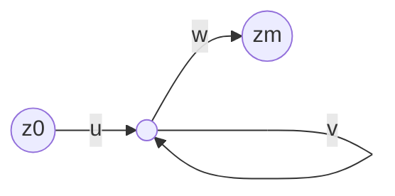

---
tags:
  - 4semester
  - FSK
  - informatik
fach: "[[Formale Sprachen und Komplexität (FSK)]]"
Thema:
Benötigte Zeit:
date created: Wednesday, 15. May 2024, 12:23
date modified: Wednesday, 3. July 2024, 13:59
---

[Skript](https://www.tcs.ifi.lmu.de/lehre/ss-2024/fsk_de/zue-03-regulaere-ausdruecke-abschluss-pumping-lemmas.pdf)

# 1. Reguläre Ausdrücke

- **Übersicht und Syntax**: Reguläre Ausdrücke umfassen Symbole wie ∅ (leere Menge), $ε$ (leerer String) und Zeichen aus einer Menge $Σ$. Sie können kombiniert werden durch Verkettung $(α_1α_2)$, Vereinigung $(α_1 | α_2)$ und Kleene-Stern $(α^*)$.
- **Redundanz in der Notation**: $ε$ kann als $(∅)^*$ dargestellt werden, da die Sprache von $(∅)^*$, bezeichnet als $L((∅)^*) = \{ε\}$, ist.
- **Reguläre Ausdrücke für spezifische Sprachen**:
  - Sprache $\{u ∈ \{a, b\}^* | |u| = 4\}$: Kann dargestellt werden als $(a|b)(a|b)(a|b)(a|b)$ oder komplexe Kombinationen unter Verwendung von Paaren aus $a$'s und $b$'s.
  - Sprache $\{u ∈ \{a, b\}^* | |u| ≤ 4\}$: Kann mit Kombinationen von $ε$ und den Buchstaben $a$, $b$ bis zu viermal ausgedrückt werden.
  - Sprache $\{u ∈ \{a, b\}^* | |u| ≥ 4\}$: Dargestellt als $(a|b)(a|b)(a|b)(a|b)(a|b)^*$.

# 2. Komplemente regulärer Ausdrücke

- **Fehlen eines direkten Komplement-Operators**: Um das Komplement einer Sprache zu finden, die durch einen regulären Ausdruck beschrieben wird, wandelt man den regulären Ausdruck in einen nicht-deterministischen endlichen Automaten (NFA) um, diesen in einen deterministischen endlichen Automaten (DFA) und dann in einen DFA für das Komplement, und schließlich zurück in einen regulären Ausdruck.
- **Einfacherer Ansatz**: Beschreibe die Sprache und ihr Komplement in einfachen Begriffen und leite direkt reguläre Ausdrücke ab.
  - Für die durch $0^*10^*$ erzeugte Sprache schließt das Komplement Wörter ohne $1$ oder mit zwei oder mehr $1$'s ein, repräsentiert als $0^* | (0|1)^*1(0|1)^*1(0|1)^*$.

# 3. Abschlusseigenschaften regulärer Sprachen

- **Eigenschaften**: Wenn $L_1$ und $L_2$ regulär sind, dann sind auch die Vereinigung, Schnitt, Konkatenation, Kleene-Stern und das Komplement regulär. Falsche Anwendungen dieser Eigenschaften können zu falschen Schlussfolgerungen über die Regularität bestimmter Sprachen führen.
- **Beispiele und Gegenbeispiele**: Demonstrationen, die falsche Anwendungen der Eigenschaften verwenden, um zu behaupten, dass Sprachen wie $\{a^nb^n | n ∈ ℕ\}$ regulär sind, was falsch ist.

# 4. Pumping Lemmas

- **Intuition und Definitionen**:
  - Jede reguläre Sprache muss das Pumping Lemma erfüllen, das besagt, dass für jedes hinreichend lange Wort in der Sprache es in Teile $uvw$ zerlegt werden kann, wobei das wiederholte 'v' Teil jede Anzahl von Malen immer noch Wörter in der Sprache ergibt.
  - **Anwendung**: Wird verwendet, um die Nicht-Regularität zu beweisen, indem gezeigt wird, dass eine Sprache die Bedingungen des Pumping Lemmas nicht erfüllt.
- **Beispielbeweise**: Detaillierte Beweise unter Verwendung des Pumping Lemmas, um die Nicht-Regularität von Sprachen, wie $\{a^jb^j | j ∈ ℕ\}$, zu zeigen, mit Schritten, die typische Fehler in der Anwendung und Argumentation hervorheben.

---

> [!note] S.8 Quiz
> Geben Sie einen regulären Ausdruck an, der
>
> $$
> \{u ∈ \{a, b\}^* | |u| ≥ 4\}
> $$
>
> erzeugt.
>
> Antwort:
>
> $$
> (a|b)(a|b)(a|b)(a|b)(a|b)^*
> $$
>
> - **Erklärung**: Zuerst 4x a oder b dann am Ende kann alles kommen auch ein
>   $\epsilon$, da Kleene-Stern auch das leere Wort beinhaltet.

## Aufgabe: NFA konstruieren

Konstruieren Sie mit dem Verfahren aus der Vorlesung einen NFA mit $ε$-Übergängen und eindeutigen Start- und Endzuständen, der als Sprache genau die durch den regulären Ausdruck

$$
ba(b|c)^*
$$

erzeugte Sprache akzeptiert.

Antwort: siehe Skript

---

> [!info] S.15 Quiz
> Die gegebene Bedingung lautet:
>
> $$
> L_1 \text{ regulär und } L_2 \text{ regulär } \implies L_1 \cap L_2 \text{ regulär}
> $$
>
> ### Aussagen:
>
> a) Wenn $L_1 \cap L_2$ nicht regulär ist, dann ist weder $L_1$ noch $L_2$ regulär.
>
> - **Falsch:** Es könnte sein, dass nur eine der Sprachen nicht regulär ist.
>
> b) Wenn $L_1 \cap L_2$ regulär ist, dann sind $L_1$ und $L_2$ regulär.
>
> - **Falsch:** Der Schnitt könnte auch aus anderen Gründen regulär sein.
>
> c) Wenn $L_1 \cap L_2$ nicht regulär ist und $L_1$ regulär ist, dann ist $L_2$ nicht regulär.
>
> - **Richtig:** Wenn $L_1$ regulär ist, muss $L_2$ nicht regulär sein, damit der Schnitt nicht regulär ist.
>
> d) Wenn $L_1$ und $L_2$ jeweils nicht regulär sind, dann ist $L_1 \cap L_2$ ebenfalls nicht regulär.
>
> - **Falsch:** Der Schnitt von zwei nicht regulären Sprachen kann regulär sein.
>
> ### Fazit:
>
> Nur Aussage **c** ist korrekt.

> [!tip] Tipp
> Zwei reguläre Sprachen können einen nicht regulären Schnitt erzeugen
>
> ## Nichtregularität zeigen mit Abschlusseigenschaften
>
> ### Satz
>
> $$
> S = \{ w \in \{a, b\}^* \mid \#_a(w) = \#_b(w) \}
> $$
>
> ist nicht regulär.
>
> ### Beweis
>
> Durch Widerspruch. Nehme an, $S$ ist regulär.
>
> Da $L_1 = L(a^*b^*)$ regulär ist, muss (aufgrund der Abschlusseigenschaft für reguläre Sprachen) auch $L_1 \cap S$ regulär sein.
>
> Aber $L_1 \cap S = \{ a^n b^n \mid n \in \mathbb{N} \}$ ist nicht regulär. Widerspruch.

---

# 3. Das Pumping-Lemma für reguläre Sprachen

## Intuition hinter dem Pumping-Lemma

- Wenn ein DFA $n$ Zustände hat, dann müssen akzeptierte Wörter der Länge $\ge n$ eine Schleife durchlaufen.
- Diese Wörter kann man aufpumpen: $uv^i w$, $uv^2 w$, $uv^3 w$, $\ldots$
  Man kann auch die Schleife überspringen: $uw$.
  Allgemein: $uv^i w$ für $i \in \mathbb{N}$ liegt in der erkannten Sprache.

## Das Pumping-Lemma für reguläre Sprachen

### Definition

Eine Sprache $L$ hat die **Pumping-Eigenschaft** (für reguläre Sprachen), wenn gilt:
Es gibt eine Zahl $n \in \mathbb{N}_{>0}$, sodass jedes Wort $z \in L$, welches Mindestlänge $n$ hat (d.h. $|z| \ge n$), als $z = uvw$ geschrieben werden kann, sodass gilt:

1. $|uv| \le n$
2. $|v| \ge 1$
3. für alle $i \in \mathbb{N}$: $uv^i w \in L$.

### Lemma (Pumping-Lemma)

Jede reguläre Sprache hat die **Pumping-Eigenschaft**.

> [!note] Quiz S.23
>
> # Quiz
>
> **Welche der folgenden Aussagen sind korrekte Formulierungen des Pumping-Lemmas?**
>
> a) Sei $L$ eine reguläre Sprache. Dann gilt für jede natürliche Zahl $n \ge 1$: Es gibt ein Wort $z$ aus $L$, welches Mindestlänge $n$ hat, sodass es für jede Zerlegung $z = uvw$ mit $|uv| \le n$ und $|v| \ge 1$ ein $i \ge 0$ gibt mit $uv^i w$ liegt nicht in $L$.
>
> b) Sei $L$ eine Sprache. Dann ist $L$ regulär, genau dann, wenn es eine natürliche Zahl $n \ge 1$ gibt, sodass jedes Wort $z$ aus $L$, welches Mindestlänge $n$ hat, als $z = uvw$ geschrieben werden kann, mit $|uv| \le n$, $|v| \ge 1$, und $uv^i w$ in $L$ liegt für alle $i \ge 0$.
>
> c) Sei $L$ eine Sprache. Dann ist $L$ keinesfalls regulär, falls für jede natürliche Zahl $n \ge 1$ gilt: Es gibt ein Wort $z$ aus $L$, welches Mindestlänge $n$ hat, sodass es für jede Zerlegung $z = uvw$ mit $|uv| \le n$ und $|v| \ge 1$ ein $i \ge 0$ gibt mit $uv^i w$ liegt nicht in $L$.
>
> d) Sei $L$ eine reguläre Sprache. Dann gibt es eine natürliche Zahl $n \ge 1$, sodass jedes Wort $z$ aus $L$, welches Mindestlänge $n$ hat, als $z = uvw$ geschrieben werden kann, mit $|uv| \le n$, $|v| \ge 1$, und $uv^i w$ liegt in $L$ für alle $i \ge 0$.
>
> e) Sei $L$ eine Sprache und es gibt eine natürliche Zahl $n \ge 1$, sodass jedes Wort $z$ aus $L$, welches Mindestlänge $n$ hat, als $z = uvw$ geschrieben werden kann, mit $|uv| \le n$, $|v| \ge 1$, und $uv^i w$ liegt in $L$ für alle $i \ge 0$. Dann ist $L$ regulär.
>
> **Antwort: c) und d).**
>
> ## Erklärung
>
> - **c)** Diese Aussage besagt, dass eine Sprache nicht regulär ist, wenn es für jede natürliche Zahl $n \ge 1$ ein Wort $z$ in $L$ gibt, das sich nicht gemäß den Bedingungen des Pumping-Lemmas in $uv^i w$ aufpumpen lässt, sodass $uv^i w$ nicht in $L$ liegt. Diese Formulierung beschreibt korrekt die Negation des Pumping-Lemmas, die verwendet wird, um zu beweisen, dass eine Sprache nicht regulär ist.
> - **d)** Diese Aussage ist die positive Formulierung des Pumping-Lemmas für reguläre Sprachen. Sie besagt, dass für jede reguläre Sprache $L$ eine Zahl $n$ existiert, sodass jedes Wort $z$ in $L$ mit Mindestlänge $n$ in der Form $z = uvw$ geschrieben werden kann und alle gepumpten Versionen $uv^i w$ ebenfalls in $L$ liegen. Dies ist genau die Bedingung, die das Pumping-Lemma beschreibt.
>
> ### Falsche Antworten
>
> - **a)** Diese Aussage ist eine Negation, aber sie enthält den Fehler, dass sie sagt, für _jede_ Zerlegung $z = uvw$ existiert ein $i \ge 0$, sodass $uv^i w$ nicht in $L$ liegt. Dies ist nicht korrekt, da das Pumping-Lemma nur fordert, dass _eine_ Zerlegung gefunden werden kann, die die Bedingungen erfüllt.
> - **b)** Diese Aussage beschreibt eine Bedingung, die sowohl notwendig als auch hinreichend für reguläre Sprachen ist. Das Pumping-Lemma ist jedoch nur eine notwendige Bedingung, keine hinreichende. Das bedeutet, dass es auch nicht reguläre Sprachen geben kann, die die Pumping-Eigenschaft erfüllen.
> - **e)** Diese Aussage ist falsch, weil das Pumping-Lemma nur eine notwendige Bedingung für reguläre Sprachen ist, nicht eine hinreichende. Das heißt, es gibt Sprachen, die die Pumping-Eigenschaft erfüllen, aber trotzdem nicht regulär sind.

> [!tip] Tipp
> "genau dann wenn" Aussagen sollten einen stutzig machen bei Quizzes, da diese oftmals falsch sind.

## Anwendung des Pumping-Lemmas

Sei $L$ eine Sprache, die wir als nicht regulär beweisen wollen.

**Pumping-Lemma:**

$L$ ist regulär $\implies$ $L$ hat die Pumping-Eigenschaft

**Kontraposition:**

$L$ hat **nicht** die Pumping-Eigenschaft $\implies$ $L$ ist **nicht** regulär

**Beweisstrategie für die Aussage „$L$ nicht regulär“:**

1. Durch die Kontraposition reicht es zu zeigen, dass $L$ die Pumping-Eigenschaft **nicht** hat.
2. Zeige dies durch Widerspruch: Nehme an, dass $L$ die Pumping-Eigenschaft hat.
3. Leite einen Widerspruch her.
4. D.h. $L$ ist **nicht** regulär.

### Beispiel: $L$ erfüllt die Pumping-Eigenschaft

**Satz**

$L = \{a^n a^n \mid n \in \mathbb{N}\}$ erfüllt die Pumping-Eigenschaft.

**Beweis**

1. Sei $n = 2$.
2. Sei $z \in L$ mit $|z| \ge n$.
3. Wir zerlegen $z = uvw$ mit $u = \epsilon$, $v = z[1]z[2]$ und $w$ das Suffix von $z$ ohne die ersten beiden Buchstaben.
4. Da $z \in L$, ist $z = a^j a^j$ und dann gilt: $v = aa$, $w = a^{j-1}a^{j-1}$. Daher gilt auch: $uv^i w = a^i a^i a^{j-1} a^{j-1} = a^{i+j-1} a^{i+j-1} \in L$ für alle $i \in \mathbb{N}$.

---

# 4. Das Pumping-Lemma für kontextfreie Sprachen (nur FSK)

## Das Pumping-Lemma für kontextfreie Sprachen

### Definition

Eine Sprache $L$ hat die **Pumping-Eigenschaft** (für kontextfreie Sprachen), wenn gilt:
Es gibt eine Zahl $n \in \mathbb{N}_{>0}$, sodass jedes Wort $z \in L$, welches Mindestlänge $n$ hat (d.h. $|z| \ge n$), als $z = uvwxy$ geschrieben werden kann, sodass gilt:

1. $|vx| \ge 1$
2. $|vwx| \le n$
3. für alle $i \in \mathbb{N}$: $uv^i wx^i y \in L$.

### Lemma (Pumping-Lemma)

Jede kontextfreie Sprache hat die **Pumping-Eigenschaft**.

# Aufgabe: Kontextfreiheit widerlegen

## Aufgabe

Zeige, dass $L_4 = \{a^m b a^m b a^m \mid m \in \mathbb{N}\}$ nicht kontextfrei ist.

## Beweis

**Mit dem Pumping-Lemma:**

- Sei $n$ beliebig.
- Wir wählen $z = a^n b a^n b a^n$. (Dann gilt $z \in L_4$ und $|z| \ge n$.)
- Sei $z = uvwxy$ mit $|vwx| \le n$, $|vx| \ge 1$ und $uv^i wx^i y \in L_4$ für alle $i \in \mathbb{N}$.
- Dann kann $vwx$ nicht zwei $b$'s enthalten.
- Fall $vx$ enthält ein $b$: Dann $uv^0 wx^0 y \notin L_4$, da das $b$ entfernt wurde. Widerspruch.
- Fall $vx$ enthält kein $b$: Dann $uv^2 wx^2 y \notin L_4$, da maximal zwei $a$-Folgen aufgepumpt wurden, die dritte $a$-Folge aber noch aus $n$ vielen $a$'s besteht (und die Trennung durch $b$ noch vorhanden ist). Widerspruch.

## Erklärung

**Das Pumping-Lemma für kontextfreie Sprachen:**

Das Pumping-Lemma für kontextfreie Sprachen besagt, dass in einer kontextfreien Sprache jedes lange genug Wort so zerlegt werden kann, dass bestimmte Teile des Wortes (die als $v$ und $x$ bezeichnet werden) "aufgepumpt" werden können, ohne dass das Wort die Sprache verlässt. Dies bedeutet, dass man $v$ und $x$ beliebig oft wiederholen kann und das resultierende Wort immer noch in der Sprache ist.

**Anwendung zur Widerlegung:**

Um zu zeigen, dass eine Sprache nicht kontextfrei ist, wählt man ein Wort aus der Sprache, das lang genug ist, und zeigt, dass es keine Zerlegung gibt, die den Bedingungen des Pumping-Lemmas entspricht. In diesem Fall haben wir gezeigt, dass für das Wort $a^n b a^n b a^n$ jede mögliche Zerlegung entweder dazu führt, dass ein $b$ entfernt wird oder dass die Struktur der $a$'s gestört wird, was beides zu einem Wort führt, das nicht mehr in der Sprache $L_4$ liegt. Damit haben wir bewiesen, dass $L_4$ nicht kontextfrei ist.

<!-- DISQUS SCRIPT COMMENT START -->

<!-- DISQUS RECOMMENDATION START -->

<noscript>
Please enable JavaScript to view the 
<a href="https://disqus.com/?ref_noscript" rel="nofollow">
comments powered by Disqus.
</a>
</noscript>

<!-- DISQUS RECOMMENDATION END -->

<noscript>Please enable JavaScript to view the <a href="https://disqus.com/?ref_noscript">comments powered by Disqus.</a></noscript>

<!-- DISQUS SCRIPT COMMENT END -->
