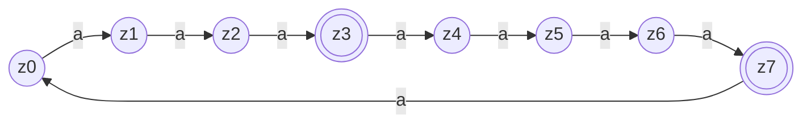

---
tags:
  - 4semester
  - FSK
  - informatik
  - Übungsblatt
fach: "[[FSK]]"
Thema: 
Benötigte Zeit:
date created: Monday, 29. April 2024, 11:52
date modified: Monday, 29. April 2024, 23:35
---

> [!info] 
> Wenn Sie Automaten angeben, tun Sie dies immer in Form eines Zustandsgraphen. Andere Formen der Darstellung (z.B. als Liste von Übergängen) werden nicht gewertet, da sie sehr viel aufwändiger zu korrigieren sind. Vergessen Sie nicht, im Zustandsgraph Start- und Endzustände zu markieren.
# FSK2-1 Grammatik und Elimination von ε-Produktionen (2 Punkte)

## a) Geben Sie kontextfreie Grammatiken (ggf. mit ε-Produktionen) an, die folgende Sprachen über dem Alphabet Σ = {a, b} erkennen:

### i) $L_1 = \{caw \ | \ c \in \Sigma^*, w \in \Sigma^*\}$

- Alphabet: $\Sigma = \{a,b\}$
- 4-Tupel Grammatikform $G = (N, \Sigma, P, S)$
- $N: \{S,C,B\}$
$$
\begin{aligned}
P: \{\\
S &\rightarrow A\space a\space B \\
C &\rightarrow aA\space|\space bA \space|\space\varepsilon \\
B &\rightarrow aB\space|\space bB \space|\space\varepsilon \\
\}
\end{aligned}
$$
- $S:S$
$$
G = \{S,\{a,b\},\{\quad S \rightarrow A\space a\space B,\quad C \rightarrow aA\space|\space bA \space|\space\varepsilon, \quad B \rightarrow aB\space|\space bB \space|\space\varepsilon \quad \},S\}
$$

### i) $L_2 = \{aawbb \ | \ w \in \Sigma^*\}$

- Alphabet: $\Sigma = \{a,b\}$
- 4-Tupel Grammatikform $G = (N, \Sigma, P, S)$
- $N: \{S,C,B\}$
$$
\begin{aligned}
P: \{\\
S &\rightarrow aa\space w\space \\
S &\rightarrow A\space w\space B \\
A &\rightarrow aA\space|\space bA \space|\space\varepsilon \\
B &\rightarrow aB\space|\space bB \space|\space\varepsilon \\
\}
\end{aligned}
$$
- $S:S$
$$
G = \{S,\{a,b\},\{\quad S \rightarrow A\space a\space B,\quad C \rightarrow aA\space|\space bA \space|\space\varepsilon, \quad B \rightarrow aB\space|\space bB \space|\space\varepsilon \quad \},S\}
$$

## b) Betrachten Sie die Grammatik $G = (\{A, B, C\}, \{a, b\}, P, A)$ mit Produktionen $P = \{A \rightarrow abBc, A \rightarrow AaA, B \rightarrow \varepsilon, B \rightarrow CC, C \rightarrow BB\}$

Geben Sie eine zu $G$ äquivalente Grammatik $G'$ ohne ε-Produktionen an. Verwenden Sie den Algorithmus zur Elimination von ε-Produktionen aus der Vorlesung und geben Sie die Zwischenschritte Ihrer Berechnung an. (Das ermöglicht uns, Ihnen bei kleinen Fehlern noch Teilpunkte zu geben.)

# FSK2-2 DFAs und Minimierung (2 Punkte)

## a) Geben Sie DFAs an, die folgende Sprachen über dem Alphabet Σ = {a, b} erkennen:

### i) $L_1 = \{a^n W \ | \ c \in \Sigma^*, w \in \Sigma^*\}$

### ii) $L_2 = \{a^n W b^n \ | \ w \in \Sigma^*\}$

(Das sind die gleichen Sprachen wie in Aufgabe FSK2-1.)

## b) Minimieren Sie die folgenden DFAs. Verwenden Sie die tabellarische Variante des Algorithmus zur Minimierung von DFAs aus der Vorlesung (nicht die grafische Variante und nicht den Algorithmus von letztem Jahr!). Geben Sie die Partitionstabelle und den minimalen DFA an.

### i) DFA A1 über dem Alphabet $Σ = \{a\}$:

### ii) DFA A2 aber dem Alphabet $Σ = {+, −, ., 0, … , 9}$ (bekannt aus der Vorlesung)

>[!info] Bild aus Blatt entnehmen

# FSK2-3 Kleine Automaten (0 Punkte)

## a) Sei $A_1$ ein DFA mit Alphabet $\Sigma$ und genau einem Zustand. Zeigen oder widerlegen Sie: Es ist entweder $L(A_1) = \Sigma^*$ oder $L(A_1) = \emptyset$.

## b) Sei $A_2$ ein DFA mit Alphabet $\Sigma = \{a, b\}$ und genau zwei Zuständen. Angenommen es gibt ein Wort $z \notin L(A_2)$ und für alle $i \in \mathbb{N}$ ist $a^i \in L(A_2)$. Zeigen oder widerlegen Sie: Für jeden solchen Automaten $A_2$ ist $bb \notin L(A_2)$.

## c) Zeigen Sie: Für jeden DFA mit Alphabet $\Sigma = \{a, b\}$ und genau vier Zuständen gilt: Wenn für jede natürliche Zahl $n \geq 1$ das Wort $a^{n^2}$ in $L(A)$ ist, dann ist auch $a^{12} \in L(A)$.

# FSK2-4 Grammatik-Konkatenation (0 Punkte)

> [!note] Aufgabenstellung 
> Seien $G$ und $G'$ Typ-i-Grammatiken (für $i \in \{0, \ldots, 3\}$), sodass $\varepsilon \notin L(G)$ und $\varepsilon \notin L(G')$. Zeigen oder widerlegen Sie für alle $i$: Es gibt eine Grammatik $G''$ vom Typ $i$, sodass $L(G'') = L(G)L(G')$.

---
$$
L \subseteq \Sigma^{*}\text{ heisst } \underline{erkennbar}, \ falls \quad \exists \mathscr{A} \ mit \ L(\mathscr{A})=L
$$
---
