---
tags:
  - 4semester
  - FSK
  - informatik
  - Übungsblatt
fach: "[[Formale Sprachen und Komplexität (FSK)]]"
Thema:
Benötigte Zeit:
date created: Monday, 29. April 2024, 11:52
date modified: Thursday, 6. June 2024, 22:47
---

> [!info]
> Wenn Sie Automaten angeben, tun Sie dies immer in Form eines Zustandsgraphen. Andere Formen der Darstellung (z.B. als Liste von Übergängen) werden nicht gewertet, da sie sehr viel aufwändiger zu korrigieren sind. Vergessen Sie nicht, im Zustandsgraph Start- und Endzustände zu markieren.

# FSK2-1 Grammatik und Elimination von ε-Produktionen (2 Punkte)

## a) Geben Sie kontextfreie Grammatiken (ggf. mit ε-Produktionen) an, die folgende Sprachen über dem Alphabet Σ = {a, b} erkennen:

### i) $L_1 = \{caw \ | \ c \in \Sigma^*, w \in \Sigma^*\}$

- Alphabet: $\Sigma = \{a,b\}$
- 4-Tupel Grammatikform $G = (N, \Sigma, P, S)$
- $N: \{S,C,B\}$
  $$
  \begin{aligned}
  P: \{\\
  S &\rightarrow C\space a\space B \\
  C &\rightarrow aA\space|\space bA \space|\space\varepsilon \\
  B &\rightarrow aB\space|\space bB \space|\space\varepsilon \\
  \}
  \end{aligned}
  $$
- $S:S$
  $$
  G = \{S,\{a,b\},\{\quad S \rightarrow C\space a\space B,\quad C \rightarrow aA\space|\space bA \space|\space\varepsilon, \quad B \rightarrow aB\space|\space bB \space|\space\varepsilon \quad \},S\}
  $$

### i) $L_2 = \{aawbb \ | \ w \in \Sigma^*\}$

- Alphabet: $\Sigma = \{a,b\}$
- 4-Tupel Grammatikform $G = (N, \Sigma, P, S)$
- $N: \{S,W,B\}$
- $S:S$

#### Erste Idee

$$
\begin{aligned}
P: \{\\
S &\rightarrow aaW \\
W &\rightarrow aW \ | \ bW\ |\ B\ |\ \varepsilon \\
B &\rightarrow bb\\
\}
\end{aligned}
$$

$$
G = \{S,\{a,b\},\{\quad S \rightarrow aaW,\quad W \rightarrow aW \ | \ bW\ |\ B\ |\ \varepsilon, \quad B \rightarrow bb  \quad \},S\}
$$

#### Zweite Idee (Besser?)

$$
\begin{aligned}
P: \{\\
S &\rightarrow aaWbb \\
W &\rightarrow aW \ | \ bW\ |\ \varepsilon \\
\}
\end{aligned}
$$

$$
G = \{S,\{a,b\},\{\quad S \rightarrow aaWbb,\quad W \rightarrow aW \ | \ bW\ |\ \varepsilon \quad \},S\}
$$

## b) Betrachten Sie die Grammatik $G = (\{A, B, C\}, \{a, b\}, P, A)$ mit Produktionen

> [!info] Aufgabenstellung
>
> $$
> P = \{A \rightarrow aBbC, A \rightarrow AaA, B \rightarrow \varepsilon, B \rightarrow CC, C \rightarrow BB\}
> $$
>
> Geben Sie eine zu $G$ äquivalente Grammatik $G'$ ohne ε-Produktionen an. Verwenden Sie den Algorithmus zur Elimination von ε-Produktionen aus der Vorlesung und geben Sie die Zwischenschritte Ihrer Berechnung an. (Das ermöglicht uns, Ihnen bei kleinen Fehlern noch Teilpunkte zu geben.)

<div style="position: relative; width: 100%; padding-top: 56.25%; overflow: hidden;">
    <iframe src="https://www.youtube.com/embed/7xL6JMaB5-A?si=pkFeeuZs08tEFAuf" title="YouTube video player" 
            style="position: absolute; top: 0; left: 0; width: 100%; height: 100%;"
            frameborder="0" allow="accelerometer; autoplay; clipboard-write; encrypted-media; gyroscope; picture-in-picture; web-share"
            allowfullscreen referrerpolicy="strict-origin-when-cross-origin">
    </iframe>
</div>

**Ziel: $\varepsilon$ eliminieren**

### 1. Schritt (ausfindig machen was $\varepsilon$ bildet)

$$
M=\{B,C\}
$$

### 2. Schritt ($\varepsilon$-freie Grammatik bilden -- $\varepsilon$ entfernen)

$$
P = \{A \rightarrow aBbC, A \rightarrow AaA, B \rightarrow CC, C \rightarrow BB\}
$$

### 3. Schritt ($\varepsilon$-kompensieren)

$$
\begin{aligned}
P = \{A &\rightarrow aBbC \space|\space AaA \space|\space abC \space|\space aBb , \\
B &\rightarrow CC \space|\space C,\\
C &\rightarrow BB \space |\space B\}
\end{aligned}
$$

→ $A \rightarrow ab$ fehlt muss noch hinzugefügt werden

# FSK2-2 DFAs und Minimierung (2 Punkte)

## a) Geben Sie DFAs an, die folgende Sprachen über dem Alphabet Σ = {a, b} erkennen:

### i) $L_1 = \{caw \ | \ c \in \Sigma^*, w \in \Sigma^*\}$


**Falsch** siehe Lösung

**Erklärung des Gedankenganges, warum so dargestellt:**

- Pfade zwischen $z_0$ und $z_1$ stellen $c$ dar, was eine Kette von Buchstaben vor $a$ ist
- Der Pfad von $z_1$ zu $z_2$ stellt $a$ dar, was immer steht
- $z_{2}$ ist ein akzeptierender Zustand, da $w \in \Sigma^*$ und auf das $a$ das leere Wort $\varepsilon$ folgen kann
- Es kann aber auch eine Zeichenkette nach $a$ kommen, was mit den Pfaden zwischen $z_2$ und $z_3$ dargestellt wird
- $z_3$ ist ein Endzustand, für alle ungerade Anzahlen von Buchstaben nach $a$

### ii) $L_2 = \{aawbb \ | \ w \in \Sigma^*\}$


$z_0$ und $z_1$ landen im Müllzustand

**Erklärung des Gedankenganges, warum so dargestellt:**

- Pfade von $z_0$ bis $z_2$ stellt $aa$ im Wort da
- Pfade zwischen $z_2,z_3$ und $z_4$ stellen das Wort $w$ dar
- Die $b$ Pfade ab $z_3$ und $z_4$ bis $z_6$ stellen das $bb$ nach dem $w$ dar
- $z_6$ ist ein akzeptierender Zustand, da das Wort ab da immer garantiert mit $bb$

## b) Minimieren Sie die folgenden DFAs. Verwenden Sie die tabellarische Variante des Algorithmus zur Minimierung von DFAs aus der Vorlesung (nicht die grafische Variante und nicht den Algorithmus von letztem Jahr!). Geben Sie die Partitionstabelle und den minimalen DFA an.

### i) DFA A1 über dem Alphabet $Σ = \{a\}$:

```mermaid
graph LR
	id1(( )) --> circleId0(("`z0`"))
    circleId0(("`z0`")) -->|a| circleId1(("`z1`"))

    circleId1(("`z1`")) -->|a| circleId2(("`z2`"))

    circleId2(("`z2`")) -->|a| doubleCircleId3((("`z3`")))

    doubleCircleId3((("`z3`"))) -->|a| circleId4(("`z4`"))

    circleId4(("`z4`")) -->|a| circleId5(("`z5`"))

    circleId5(("`z5`")) -->|a| circleId6(("`z6`"))

    circleId6(("`z6`")) -->|a| doubleCircleId7((("`z7`")))

    doubleCircleId7((("`z7`"))) -->|a| circleId0(("`z0`"))
```

- Endzustände $z_3$ und $z_7$ werden getrennt

$$
z_0 \quad z_1 \quad z_2  \quad z_4 \quad z_5 \quad z_{6}\quad |\quad z_3 \quad z_7
$$

- $z_2$ und $z_6$ führen in Klasse 2 bzw. in andere Partition, deswegen teilen wird diese

$$
z_0 \quad z_1  \quad z_4 \quad z_{5}\quad | \quad z_{2} \quad z_{6}\quad |\quad z_3 \quad z_7
$$

- Jetzt führen aber $z_{1}$ und $z_{5}$ auch in andere Partitionen und müssen geteilt werden

$$
z_0  \quad z_{4}\quad| \quad z_{1} \quad z_{5}\quad | \quad z_{2} \quad z_{6}\quad |\quad z_3 \quad z_7
$$


### ii) DFA A2 aber dem Alphabet $Σ = {+, −, ., 0, … , 9}$ (bekannt aus der Vorlesung)

> [!info] Graph aus Blatt entnehmen

$z10$ Müllzustand fehlt muss als nicht Endzustand behandelt werden
$z_4$ und $z_8$ müssen noch partitioniert werden, da sie in eine andere Partition führen, da jeweil 2 Pfeile von diesen Zuständen ausgehen, einmal auf sich selbst und einmal auf einen anderen Zustand

$$
z_0 \quad z_1 \quad z_2 \quad z_3 \quad z_4 \quad z_5 \quad z_6 \quad z_{7 \quad}z_8 \quad z_9
$$

- Endzustände $z_{3},z_{4},z_{5},z_{7},z_{8}, z_{9}$

$$
z_{0} \quad z_{1} \quad z_{2}    \quad z_{6}   \quad | \quad z_{3} \quad z_{4} \quad z_{5} \quad z_{7} \quad z_{8} \quad z_{9}
$$

- $z_{6}$ und $z_{2}$ führen in andere Partition werden deswegen getrennt

$$
z_{0} \quad z_{1}\quad | \quad z_{2}    \quad z_{6}   \quad | \quad z_{3} \quad z_{4} \quad z_{5} \quad z_{7} \quad z_{8} \quad z_{9}
$$

- $z_{1}$ führt in 2 andere Partition deswegen trennen

$$
z_{0}\quad | \quad z_{1}\quad | \quad z_{2}    \quad z_{6}   \quad | \quad z_{3} \quad z_{4} \quad z_{5} \quad z_{7} \quad z_{8} \quad z_{9}
$$

# FSK2-3 Kleine Automaten (0 Punkte)

## a) Sei $A_1$ ein DFA mit Alphabet $\Sigma$ und genau einem Zustand. Zeigen oder widerlegen Sie: Es ist entweder $L(A_1) = \Sigma^*$ oder $L(A_1) = \emptyset$.

**Gedankengang:**

- Wenn das DFA nur einen Zustand hat, kann dieser entweder akzeptieren sein oder nicht

**Beweis:**

- Es gibt 2 Fälle für $A_1$:
  - Der Zustand von $A_1$ ist ein akzeptierender Zustand
  - Der Zustand von $A_1$ ist _kein_ akzeptierender Zustand
- Der Zustand von $A_1$ sei deklariert als $z_0$
- Alle Pfade von $z_0$ führen zurück zu $z_0$
- _Erster Fall: akzeptierender Zustand_

```mermaid
graph LR
id0(( )) --> id1(((z0))) --w∈Σ--> id1(((z0)))
```



- Da $z_0$ der akzeptierende Zustand ist, kann man damit alle Wörter aus $\Sigma$ darstellen

  - Beim Lesen von jedem String landet der Automat in $z_0$ was ein akzeptierender Zustand ist
  - Es gilt also: $L(A_1) = \Sigma^*$

- _Zweiter Fall: nicht akzeptierender Zustand_

```mermaid
graph LR
id0(( )) --> id1((z0)) --w∈Σ--> id1((z0))
```



- Da $z_0$ _kein_ akzeptierender Zustand ist, landet der Automat beim lesen in keinen akzeptierenden Zustand, was dazu führt, dass kein Wort gültig ist  
   - Es gilt also: $L(A_1) = \emptyset$
  $$
  \tag*{$\blacksquare$}
  $$
  **Schlussfolgerung:**
  Die Behauptung ist wahr. Für einen DFA $𝐴1$ mit genau einem Zustand ist die von ihm akzeptierte Sprache entweder $Σ^*$ oder $∅$, abhängig davon, ob der einzige Zustand ein akzeptierender Zustand ist oder nicht.

## b) Sei $A_2$ ein DFA mit Alphabet $\Sigma = \{a, b\}$ und genau zwei Zuständen. Angenommen es gibt ein Wort $z \notin L(A_2)$ und für alle $i \in \mathbb{N}$ ist $a^i \in L(A_2)$. Zeigen oder widerlegen Sie: Für jeden solchen Automaten $A_2$ ist $bb \notin L(A_2)$.

**Widerleg durch Gegenbeispiel**


Dieser Automat kann das Wort $bb$ Produzieren und besteht aus genau zwei Zuständen. Also gilt $bb\ \in L(A_2)$

## c) Zeigen Sie: Für jeden DFA mit Alphabet $\Sigma = \{a, b\}$ und genau vier Zuständen gilt: Wenn für jede natürliche Zahl $n \geq 1$ das Wort $a^{n^2}$ in $L(A)$ ist, dann ist auch $a^{12} \in L(A)$.

### Erster Ansatz Induktion

**Beweis durch Induktion:**
_Induktionsanfang:_
Es wird bewiesen, dass die Aussage für die kleinste Zahl, den Startwert, gilt.

$$
\begin{aligned}
n=1 : a^{1^{2}} = a^{1}
\end{aligned}
$$

_Indutktionsannahme:_
Gilt die Aussage für eine beliebige Zahl, so gilt sie auch für deren Nachfolge

$$
n\rightarrow n+1
$$

_Induktionsschritt:_

$$
\begin{aligned}

a^{(n+1)^{2}} &=a^{n^{2}+2n+1} \\
&=a^{n^{2}} \cdot a^{2n+1}
\end{aligned}
$$

Da nach der Induktionsannahme $a^{n^{2}}$ wahr ist, und weil $a^{2n+1}$ eine korrekte Anwendung der Potenzgesetze ist, ist auch $a^{(n+1)^{2}}$ wahr.

**Zusammenfassung:**
Durch den Induktionsanfang und den Induktionsschritt haben wir gezeigt, dass $a^{k^2}$ für alle natürlichen Zahlen $k$ gilt, beginnend bei $k = 1$. Somit gilt die Aussage auch für $a^{12}$

# FSK2-4 Grammatik-Konkatenation (0 Punkte)

- [x] FSK 2-4 verstehen was abgeht [completion:: 2024-07-15]

> [!note] Aufgabenstellung
> Seien $G$ und $G'$ Typ-i-Grammatiken (für $i \in \{0, \ldots, 3\}$), sodass $\varepsilon \notin L(G)$ und $\varepsilon \notin L(G')$. Zeigen oder widerlegen Sie für alle $i$: Es gibt eine Grammatik $G''$ vom Typ $i$, sodass $L(G'') = L(G)L(G')$.

Die Aufgabenstellung erfordert den Nachweis, dass für jede Typ-i-Grammatik (wobei $i \in \{0, 1, 2, 3\}$) $G$ und $G'$, die $\varepsilon$ nicht enthalten, eine entsprechende Grammatik $G''$ existiert, deren Sprache der Konkatenation der Sprachen von $G$ und $G'$ entspricht, also $L(G'') = L(G)L(G')$.

## Typ-0 (Rekursiv aufzählbare Grammatiken):

- Typ-0-Grammatiken können jede berechenbare Sprache generieren, einschließlich der Konkatenation zweier Sprachen. Dies wird erreicht, indem die Produktionen von $G$ mit denen von $G'$ kombiniert werden, wobei das Ende der Produktionen von $G$ direkt zum Beginn der Produktionen von $G'$ übergeht.

## Typ-1 (Kontextsensitive Grammatiken):

- Für Typ-1-Grammatiken kann eine Grammatik $G''$ konstruiert werden, die zuerst ein Wort aus $L(G)$ und dann aus $L(G')$ erzeugt, ohne die Kontextsensitivität zu verletzen.

## Typ-2 (Kontextfreie Grammatiken):

- Die Konstruktion von $G''$ für kontextfreie Grammatiken umfasst die Einführung eines neuen Startsymbols und Regeln, die zuerst ein Wort aus $L(G)$ und anschließend aus $L(G')$ generieren.

## Typ-3 (Reguläre Grammatiken):

- Reguläre Grammatiken unterstützen die Konkatenation, indem das Endsymbol der Regeln von $G$, das sonst auf das leere Wort führt, durch das Startsymbol von $G'$ ersetzt wird.

Zusammengefasst ist es für alle Grammatiktypen möglich, die Konkatenation ihrer Sprachen durch eine Grammatik des gleichen Typs zu realisieren.

---

$$
L \subseteq \Sigma^{*}\text{ heisst } \underline{erkennbar}, \ falls \quad \exists \mathscr{A} \ mit \ L(\mathscr{A})=L
$$

---

<!-- DISQUS SCRIPT COMMENT START -->

<hr style="border: none; height: 2px; background: linear-gradient(to right, #f0f0f0, #ccc, #f0f0f0); margin-top: 4rem; margin-bottom: 5rem;">
<div id="disqus_thread"></div>
<script>
    /**
    *  RECOMMENDED CONFIGURATION VARIABLES: EDIT AND UNCOMMENT THE SECTION BELOW TO INSERT DYNAMIC VALUES FROM YOUR PLATFORM OR CMS.
    *  LEARN WHY DEFINING THESE VARIABLES IS IMPORTANT: https://disqus.com/admin/universalcode/#configuration-variables    */
    /*
    var disqus_config = function () {
    this.page.url = PAGE_URL;  // Replace PAGE_URL with your page's canonical URL variable
    this.page.identifier = PAGE_IDENTIFIER; // Replace PAGE_IDENTIFIER with your page's unique identifier variable
    };
    */
    (function() { // DON'T EDIT BELOW THIS LINE
    var d = document, s = d.createElement('script');
    s.src = 'https://myuninotes.disqus.com/embed.js';
    s.setAttribute('data-timestamp', +new Date());
    (d.head || d.body).appendChild(s);
    })();
</script>
<noscript>Please enable JavaScript to view the <a href="https://disqus.com/?ref_noscript">comments powered by Disqus.</a></noscript>

<!-- DISQUS SCRIPT COMMENT END -->
