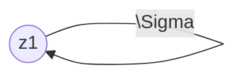

---
tags:
  - 4semester
  - FSK
  - informatik
  - Übungsblatt
fach: "[[FSK]]"
Thema: 
Benötigte Zeit:
date created: Monday, 29. April 2024, 11:52
date modified: Wednesday, 1. May 2024, 07:42
---

> [!info] 
> Wenn Sie Automaten angeben, tun Sie dies immer in Form eines Zustandsgraphen. Andere Formen der Darstellung (z.B. als Liste von Übergängen) werden nicht gewertet, da sie sehr viel aufwändiger zu korrigieren sind. Vergessen Sie nicht, im Zustandsgraph Start- und Endzustände zu markieren.
# FSK2-1 Grammatik und Elimination von ε-Produktionen (2 Punkte)

## a) Geben Sie kontextfreie Grammatiken (ggf. mit ε-Produktionen) an, die folgende Sprachen über dem Alphabet Σ = {a, b} erkennen:

### i) $L_1 = \{caw \ | \ c \in \Sigma^*, w \in \Sigma^*\}$

- Alphabet: $\Sigma = \{a,b\}$
- 4-Tupel Grammatikform $G = (N, \Sigma, P, S)$
- $N: \{S,C,B\}$
$$
\begin{aligned}
P: \{\\
S &\rightarrow A\space a\space B \\
C &\rightarrow aA\space|\space bA \space|\space\varepsilon \\
B &\rightarrow aB\space|\space bB \space|\space\varepsilon \\
\}
\end{aligned}
$$
- $S:S$
$$
G = \{S,\{a,b\},\{\quad S \rightarrow A\space a\space B,\quad C \rightarrow aA\space|\space bA \space|\space\varepsilon, \quad B \rightarrow aB\space|\space bB \space|\space\varepsilon \quad \},S\}
$$

### i) $L_2 = \{aawbb \ | \ w \in \Sigma^*\}$

- Alphabet: $\Sigma = \{a,b\}$
- 4-Tupel Grammatikform $G = (N, \Sigma, P, S)$
- $N: \{S,W,B\}$
- $S:S$

#### Erste Idee
$$
\begin{aligned}
P: \{\\
S &\rightarrow aaW \\
W &\rightarrow aW \ | \ bW\ |\ B\ |\ \varepsilon \\
B &\rightarrow bb\\
\}
\end{aligned}
$$

$$
G = \{S,\{a,b\},\{\quad S \rightarrow aaW,\quad W \rightarrow aW \ | \ bW\ |\ B\ |\ \varepsilon, \quad B \rightarrow bb  \quad \},S\}
$$

#### Zweite Idee (Besser?)

$$
\begin{aligned}
P: \{\\
S &\rightarrow aaWbb \\
W &\rightarrow aW \ | \ bW\ |\ \varepsilon \\
\}
\end{aligned}
$$
$$
G = \{S,\{a,b\},\{\quad S \rightarrow aaWbb,\quad W \rightarrow aW \ | \ bW\ |\ \varepsilon \quad \},S\}
$$
## b) Betrachten Sie die Grammatik $G = (\{A, B, C\}, \{a, b\}, P, A)$ mit Produktionen 

>[!info] Aufgabenstellung
>
>$$
>P = \{A \rightarrow aBbC, A \rightarrow AaA, B \rightarrow \varepsilon, B \rightarrow CC, C \rightarrow BB\}
>$$
>Geben Sie eine zu $G$ äquivalente Grammatik $G'$ ohne ε-Produktionen an. Verwenden Sie den Algorithmus zur Elimination von ε-Produktionen aus der Vorlesung und geben Sie die Zwischenschritte Ihrer Berechnung an. (Das ermöglicht uns, Ihnen bei kleinen Fehlern noch Teilpunkte zu geben.)

    <iframe src="https://www.youtube.com/embed/7xL6JMaB5-A?si=pkFeeuZs08tEFAuf" title="YouTube video player" 
            style="position: absolute; top: 0; left: 0; width: 100%; height: 100%;"
            frameborder="0" allow="accelerometer; autoplay; clipboard-write; encrypted-media; gyroscope; picture-in-picture; web-share"
            allowfullscreen referrerpolicy="strict-origin-when-cross-origin">
    </iframe>

**Ziel: $\varepsilon$ eliminieren** 
### 1. Schritt (ausfindig machen was $\varepsilon$ bildet)

$$
M=\{B,C\}
$$
### 2. Schritt ($\varepsilon$-freie Grammatik bilden -- $\varepsilon$ entfernen)

$$
P = \{A \rightarrow aBbC, A \rightarrow AaA, B \rightarrow CC, C \rightarrow BB\}
$$
### 3. Schritt ($\varepsilon$-kompensieren)

$$
\begin{aligned}
P = \{A &\rightarrow aBbC \space|\space AaA \space|\space abC \space|\space aBb , \\
B &\rightarrow CC \space|\space C,\\
C &\rightarrow BB \space |\space B\}
\end{aligned}
$$

# FSK2-2 DFAs und Minimierung (2 Punkte)

## a) Geben Sie DFAs an, die folgende Sprachen über dem Alphabet Σ = {a, b} erkennen:

### i) $L_1 = \{caw \ | \ c \in \Sigma^*, w \in \Sigma^*\}$

**Erklärung des Gedankenganges, warum so dargestellt:**
- Pfade zwischen $z_0$ und $z_1$ stellen $c$ dar, was eine Kette von Buchstaben vor $a$ ist
- Der Pfad von $z_1$ zu $z_2$ stellt $a$ dar, was immer steht
- $z_{2}$ ist ein akzeptierender Zustand, da $w \in \Sigma^*$ und auf das $a$ das leere Wort $\varepsilon$ folgen kann
- Es kann aber auch eine Zeichenkette nach $a$ kommen, was mit den Pfaden zwischen $z_2$ und $z_3$ dargestellt wird
- $z_3$ ist ein Endzustand, für alle ungerade Anzahlen von Buchstaben nach $a$

### ii) $L_2 = \{aawbb \ | \ w \in \Sigma^*\}$

**Erklärung des Gedankenganges, warum so dargestellt:**
- Pfade von $z_0$ bis $z_2$ stellt $aa$ im Wort da
- Pfade zwischen $z_2,z_3$ und $z_4$ stellen das Wort $w$ dar
- Die $b$ Pfade ab $z_3$ und $z_4$ bis $z_6$ stellen das $bb$ nach dem $w$ dar
- $z_6$ ist ein akzeptierender Zustand, da das Wort ab da immer garantiert mit $bb$

## b) Minimieren Sie die folgenden DFAs. Verwenden Sie die tabellarische Variante des Algorithmus zur Minimierung von DFAs aus der Vorlesung (nicht die grafische Variante und nicht den Algorithmus von letztem Jahr!). Geben Sie die Partitionstabelle und den minimalen DFA an.

### i) DFA A1 über dem Alphabet $Σ = \{a\}$:

- Endzustände $z_3$ und $z_7$ werden getrennt

$$
z_0 \quad z_1 \quad z_2  \quad z_4 \quad z_5 \quad z_{6}\quad |\quad z_3 \quad z_7
$$ 
- $z_2$ und $z_6$ führen in Klasse 2 bzw. in andere Partition, deswegen teilen wird diese

$$
z_0 \quad z_1  \quad z_4 \quad z_{5}\quad | \quad z_{2} \quad z_{6}\quad |\quad z_3 \quad z_7
$$

- Jetzt führen aber $z_{1}$ und $z_{5}$ auch in andere Partitionen und müssen geteilt werden 

$$
z_0  \quad z_{4}\quad| \quad z_{1} \quad z_{5}\quad | \quad z_{2} \quad z_{6}\quad |\quad z_3 \quad z_7
$$

### ii) DFA A2 aber dem Alphabet $Σ = {+, −, ., 0, … , 9}$ (bekannt aus der Vorlesung)

>[!info] Bild aus Blatt entnehmen

$$
z_0 \quad z_1 \quad z_2 \quad z_3 \quad z_4 \quad z_5 \quad z_6 \quad z_{7 \quad}z_8 \quad z_9
$$

- Endzustände $z_{3},z_{4},z_{5},z_{7},z_{8}, z_{9}$

$$
z_{0} \quad z_{1} \quad z_{2}    \quad z_{6}   \quad | \quad z_{3} \quad z_{4} \quad z_{5} \quad z_{7} \quad z_{8} \quad z_{9}
$$

- $z_{6}$ und $z_{2}$ führen in andere Partition werden deswegen getrennt

$$
z_{0} \quad z_{1}\quad | \quad z_{2}    \quad z_{6}   \quad | \quad z_{3} \quad z_{4} \quad z_{5} \quad z_{7} \quad z_{8} \quad z_{9}
$$

- $z_{1}$ führt in 2 andere Partition deswegen trennen

$$
z_{0}\quad | \quad z_{1}\quad | \quad z_{2}    \quad z_{6}   \quad | \quad z_{3} \quad z_{4} \quad z_{5} \quad z_{7} \quad z_{8} \quad z_{9}
$$

# FSK2-3 Kleine Automaten (0 Punkte)

## a) Sei $A_1$ ein DFA mit Alphabet $\Sigma$ und genau einem Zustand. Zeigen oder widerlegen Sie: Es ist entweder $L(A_1) = \Sigma^*$ oder $L(A_1) = \emptyset$.

**Gedankengang:**
- Wenn das DFA nur einen Zustand hat, kann dieser entweder akzeptieren sein oder nicht 

**Beweis:**
- Es gibt 2 Fälle für $A_1$:
	- Der Zustand von $A_1$ ist ein akzeptierender Zustand
	- Der Zustand von $A_1$ ist *kein* akzeptierender Zustand
- Der Zustand von $A_1$ sei deklariert als $z_0$
- Alle Pfade von $z_0$ führen zurück zu $z_0$

- *Erster Fall: akzeptierender Zustand*

## b) Sei $A_2$ ein DFA mit Alphabet $\Sigma = \{a, b\}$ und genau zwei Zuständen. Angenommen es gibt ein Wort $z \notin L(A_2)$ und für alle $i \in \mathbb{N}$ ist $a^i \in L(A_2)$. Zeigen oder widerlegen Sie: Für jeden solchen Automaten $A_2$ ist $bb \notin L(A_2)$.

## c) Zeigen Sie: Für jeden DFA mit Alphabet $\Sigma = \{a, b\}$ und genau vier Zuständen gilt: Wenn für jede natürliche Zahl $n \geq 1$ das Wort $a^{n^2}$ in $L(A)$ ist, dann ist auch $a^{12} \in L(A)$.

# FSK2-4 Grammatik-Konkatenation (0 Punkte)

> [!note] Aufgabenstellung 
> Seien $G$ und $G'$ Typ-i-Grammatiken (für $i \in \{0, \ldots, 3\}$), sodass $\varepsilon \notin L(G)$ und $\varepsilon \notin L(G')$. Zeigen oder widerlegen Sie für alle $i$: Es gibt eine Grammatik $G''$ vom Typ $i$, sodass $L(G'') = L(G)L(G')$.

---
$$
L \subseteq \Sigma^{*}\text{ heisst } \underline{erkennbar}, \ falls \quad \exists \mathscr{A} \ mit \ L(\mathscr{A})=L
$$
---
