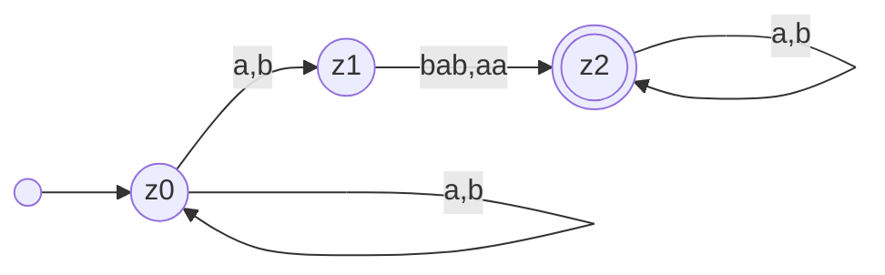
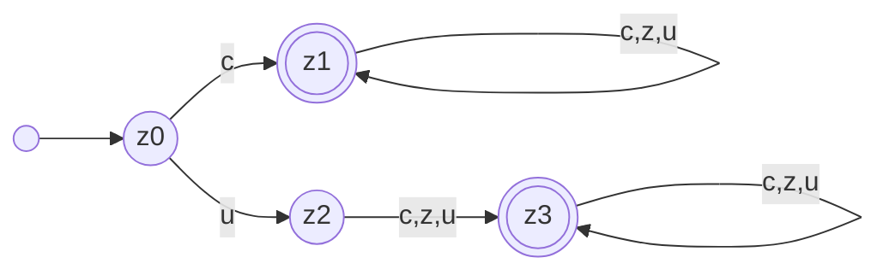
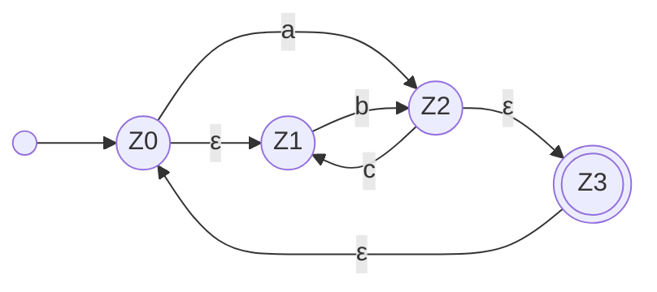
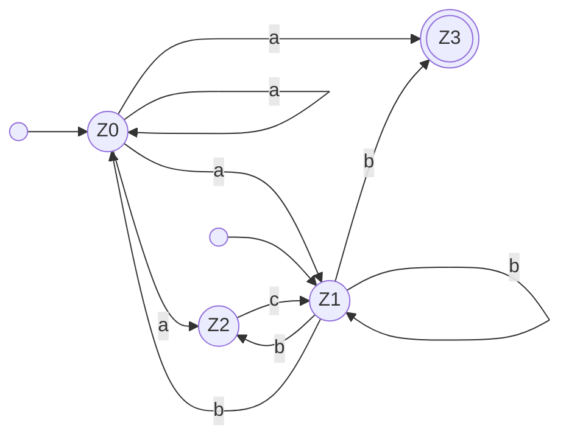
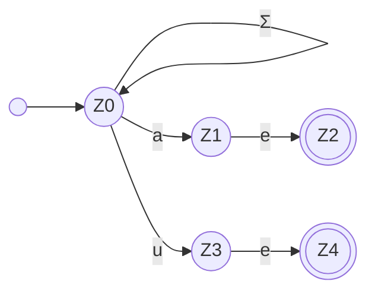
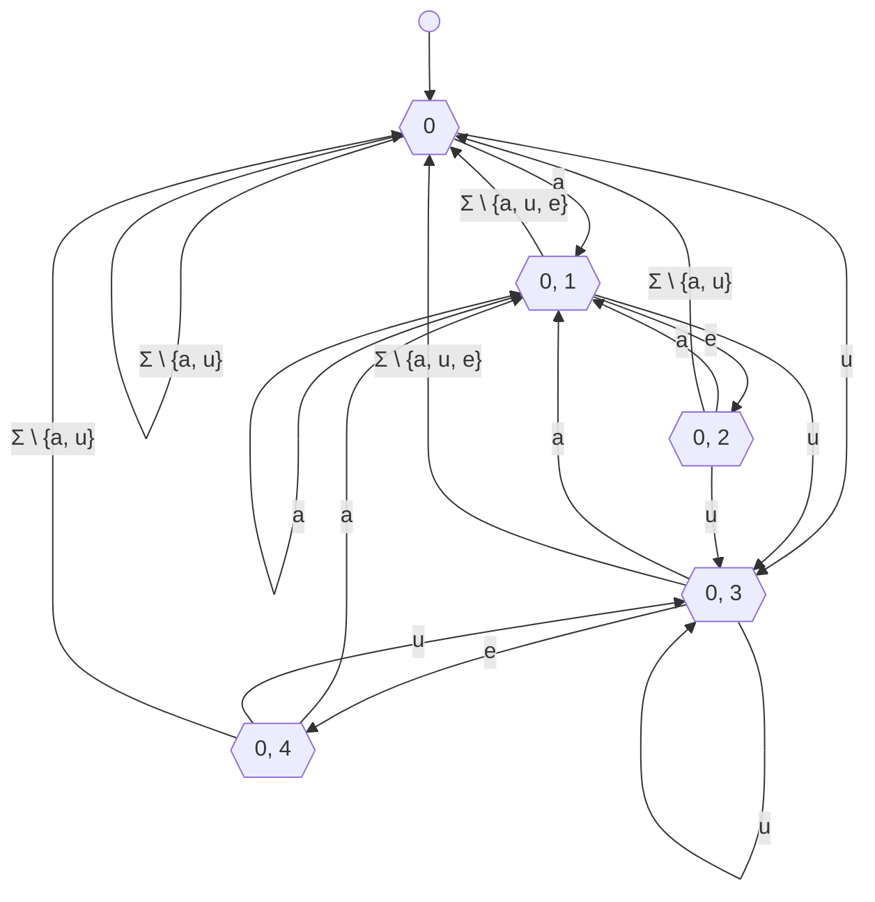
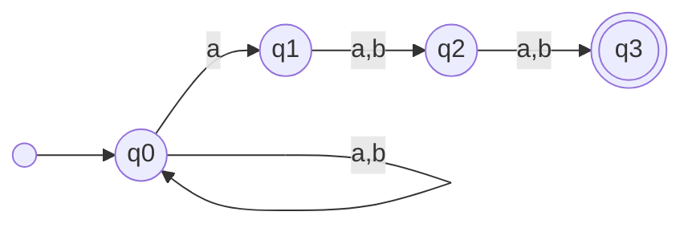
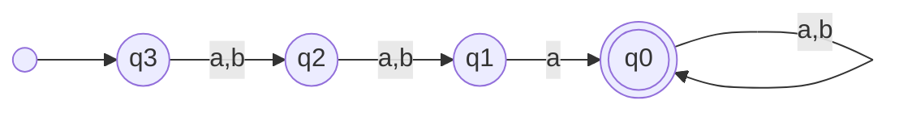
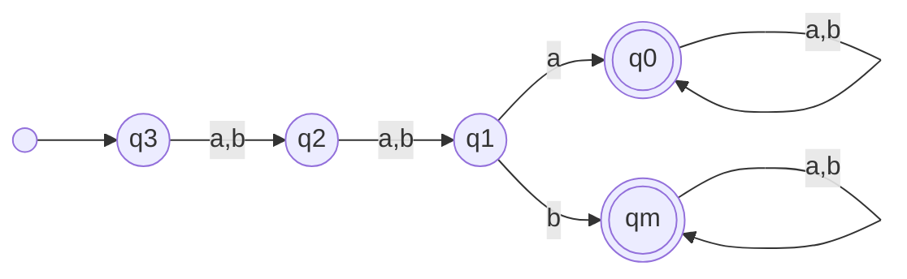

---
tags:
  - 4semester
  - FSK
  - informatik
  - Übungsblatt
fach: "[[Formale Sprachen und Komplexität (FSK)]]"
Thema:
Benötigte Zeit:
date created: Saturday, 4. May 2024, 20:06
date modified: Tuesday, 28. May 2024, 18:28
---

> [!info]
> Wenn Sie Automaten angeben, tun Sie dies immer in Form eines Zustandsgraphen. Andere Formen der Darstellung (z.B. als Liste von Übergängen) werden nicht gewertet, da sie sehr viel aufwändiger zu korrigieren sind. Vergessen Sie nicht, im Zustandsgraph Start- und Endzustände zu markieren.

# FSK3-1 Konstruktion von NFAs (2 Punkte)

> [!info] Verwenden Sie in dieser Aufgabe nur NFAs ohne ε-Übergänge

## a) Geben Sie einen NFA an, der die folgende Sprache $L$ über dem Alphabet $Σ = \{a, b\}$ akzeptiert:

$$
L = \{u\ v\  w \ | \ v,w \in \Sigma^{*},\ v\in \{bab,aa\} \}
$$

Wörter dürfen nicht auf pfad stehen, nur Buchstaben



## b) Viele Programmiersprachen erlauben nur Variablennamen, die Regeln wie diese erfüllen:

> [!info] Aufgabenstellung
>
> - Ein Variablenname kann Unterstriche, kleine und große Buchstaben (a–z, A–Z) und Ziffern enthalten.
> - Ein Variablenname muss mindestens ein Zeichen enthalten.
> - Ein Variablenname darf nicht mit einer Ziffer anfangen.
> - „\_“ ist kein Variablenname.
>
> **Geben Sie einen NFA an, der genau die Variablennamen erkennt, die diesen Regeln folgen.**

Für die Übersicht führe ich ein paar Variablen hinzu:

- $c = \text{Buchstaben (a-z,A-Z)}$
- $z = \text{Ziffer}$
- $u = \text{Unterstrich (\_)}$



- z0 kein Endzustand weil mindestens ein Wort drin sein muss
  - Beispielname für z0: ""
- z1 Endzustand Variablenname mit mindestens einem Buchstaben
  - Beispielname für z1: "a" und danach rekursiv eventuell : "asdf123"
- z2 kein Endzustand weil nur Unterstrich
  - Beispielname für z2: "\_" → nicht erlaubt
- z3 ist ein Endzustand, da unterstrich am Anfang aber danach Zeichen folgt
  - Beispielname für z3: "\_a" danach rekursiv "\_asdf123"

## c) Sei $n$ eine natürliche Zahl, $\Sigma_n = \{0, \dots, n\}$ und

> [!note]
>
> $$
> L_n = \{w \in \Sigma_n^* \mid i \in \Sigma_n, \#_i(w) = i\}
> $$
>
> **Das heißt, die Sprache $L$ enthält genau die Wörter $w$, für die gilt: Es gibt eine Zahl $i \in \{0, \dots, n\}$ sodass das Wort $w$ das Symbol $i$ genau $i$-mal enthält.**
>
> **Z.B. ist $2012323 \in L_3$, da dieses Wort genau 1-mal das Symbol 1 enthält. Ebenso ist $20311233 \in L_3$, da dieses Wort genau 2-mal das Symbol 2 enthält. Hingegen ist $0112223 \notin L_3$.**
>
> **Geben Sie für jedes $n$ einen NFA $A_n$ an, der $L_n$ erkennt. Beschreiben Sie ausnahmsweise $A_n$ nicht durch einen Zustandsgraph, sondern geben Sie die Zustandsmenge, Start- und Endzustände und Übergänge (in Abhängigkeit von $n$) explizit an. Geben Sie außerdem den Zustandsgraph von $A_3$ an.**

**Gedankengang:**

- $2012323 \in L_3$ weil alle jede Ziffer kommt weniger als 2 mal vor $L_{3}=\{0,1,2\}$
- $0112223 \notin L_3$ weil die 2 drei-mal vorkommt $3 \notin L_{3}$

> [!summary]
>
> ### Definition des NFA $A_n$
>
> Für die Definition eines Nichtdeterministischen Endlichen Automaten (NFA), der die Sprache $L_n$ erkennt, gehen wir wie folgt vor:
>
> #### Zustandsmenge:
>
> - Die Zustandsmenge $Q$ von $A_n$ besteht aus allen möglichen Zählerkonfigurationen für jedes Symbol in $\Sigma_n$, die angeben, wie oft jedes Symbol bis zu einem bestimmten Punkt im Wort erschienen ist. Zusätzlich gibt es einen besonderen Startzustand $q_0$ und Fehlerzustände für unerlaubte Symbolzählungen.
> - Jeder Zustand $q$ in $Q$ kann durch ein Tupel $(c_0, c_1, \ldots, c_n)$ repräsentiert werden, wobei $c_i$ die Anzahl des Symbols $i$ in $\Sigma_n$ ist, das bis jetzt gelesen wurde. Jedes $c_i$ kann Werte von 0 bis $n$ annehmen, wobei Werte größer als $n$ zu einem Fehlerzustand führen.
>
> #### Startzustand:
>
> - Der Startzustand ist $q_0 = (0, 0, \ldots, 0)$, was bedeutet, dass noch kein Symbol gelesen wurde.
>
> #### Akzeptierende Zustände:
>
> - Ein Zustand $(c_0, c_1, \ldots, c_n)$ ist ein akzeptierender Zustand, wenn genau eine der Zählungen $c_i = i$ ist und alle anderen $c_j$ (für $j \neq i$) kleiner als $j$ sind. Das heißt, genau ein Symbol $i$ kommt genau $i$-mal vor, und kein anderes Symbol kommt öfter vor, als es seine Ziffer erlaubt.
>
> #### Übergänge:
>
> - Von jedem Zustand $(c_0, c_1, \ldots, c_n)$ gibt es einen Übergang zum Zustand $(c_0, c_1, \ldots, c_i+1, \ldots, c_n)$ beim Lesen des Symbols $i$. Wenn $c_i+1 > n$, führt der Übergang in einen Fehlerzustand.
>
> #### Fehlerzustände:
>
> - Fehlerzustände werden erreicht, wenn eine Zählung $c_i$ größer als $n$ wird. Alle Übergänge von Fehlerzuständen führen wieder in Fehlerzustände.
>
> ### Zustandsgraph für $A_3$
>
> Für den speziellen Fall von $n = 3$ erstellen wir einen Zustandsgraphen:
>
> - **Zustände**: Jeder Zustand ist ein Tupel $(c_0, c_1, c_2, c_3)$, wobei jedes $c_i$ von 0 bis 3 reichen kann. Zustände, in denen $c_i > i$ sind nicht Teil unseres Automaten.
> - **Akzeptierende Zustände**: Zustände wie $(0, 1, 0, 0)$, $(0, 0, 2, 0)$ und $(0, 0, 0, 3)$.
> - **Startzustand**: $(0, 0, 0, 0)$
> - **Übergänge**: Basierend auf der obigen Beschreibung.
>
> Lassen Sie uns eine detaillierte grafische Darstellung des Nichtdeterministischen Endlichen Automaten $A_3$ erstellen, der die Sprache $L_3$ erkennt. Diese Visualisierung wird die Zustandsmenge, akzeptierende Zustände, Startzustand und Übergänge für $n=3$ enthalten. Beachten Sie, dass ich zur Vereinfachung nur relevante Teile des Automaten zeige, da die vollständige Darstellung sehr umfangreich wäre.
>
> Hier ist die grafische Darstellung von $A_3$:
>
> ### Zustandsgraph von $A_3$
>
> 1. **Zustände**:
>
>    - Jeder Zustand ist ein Tupel $(c_0, c_1, c_2, c_3)$, wobei $c_i$ die Anzahl der Male darstellt, dass das Symbol $i$ gelesen wurde. Nur diejenigen Zustände, bei denen keine $c_i$ die Bedingung $c_i > i$ erfüllt, sind gültig.
>    - Fehlerzustände sind solche, bei denen mindestens ein $c_i > i$.
>
> 2. **Startzustand**:
>
>    - Der Startzustand ist $(0, 0, 0, 0)$.
>
> 3. **Akzeptierende Zustände**:
>
>    - $(0, 1, 0, 0)$: Symbol 1 kommt genau einmal vor.
>    - $(0, 0, 2, 0)$: Symbol 2 kommt genau zweimal vor.
>    - $(0, 0, 0, 3)$: Symbol 3 kommt genau dreimal vor.
>
> 4. **Übergänge**:
>
>    - Von jedem Zustand $(c_0, c_1, c_2, c_3)$ gibt es Übergänge zu $(c_0+1, c_1, c_2, c_3)$, $(c_0, c_1+1, c_2, c_3)$, $(c_0, c_1, c_2+1, c_3)$ und $(c_0, c_1, c_2, c_3+1)$ beim Lesen der entsprechenden Symbole 0, 1, 2, bzw. 3. Übergänge, die zu ungültigen Zuständen führen, werden nicht gezeigt.

---

# FSK3-2 Entfernen von $\epsilon$-Übergängen und Potenzmengenkonstruktion (2 Punkte)

## a) Sei $A_1$ der folgende NFA über dem Alphabet $\{a, b, c\}$:



> [!info] Aufgabenstellung
> Geben Sie einen NFA $A_1'$ ohne $\epsilon$-Übergänge mit $L(A_1') = L(A_1)$ an. Verwenden Sie den Algorithmus zum Entfernen von $\epsilon$-Übergängen aus der Vorlesung. Geben Sie die Zwischenschritte Ihrer Berechnung an. Das erlaubt uns, Ihnen für Folgefehler Teiilpunkte zu geben.

Alle Knoten die von $z_0$ ausgehend mit dem leeren Wort erreicht werden können sind Startzustände und müssen behandelt werden. Dies ist nur bei $z_1$ der Fall.

Muss mit einem Zeichen aus $\Sigma$ beginnen und dann nur noch Epsilon Ketten. Kann von jedem Knoten Anfangen nicht nur von Startzuständen.

$\epsilon$ - Übergänge implizieren nicht das $\epsilon$ in der Sprache ist

$$
z_{0}\overset{a}{\rightarrow}z_{2} \quad
z_{2}\overset{\epsilon}{\rightarrow}z_{3}\quad
z_{3}\overset{\epsilon}{\rightarrow}z_{0} \quad
z_{0}\overset{\epsilon}{\rightarrow}z_{1}
$$

Kann vereinfacht werden zu:

$$
z_{0}\overset{a}{\rightarrow}z_{2} \quad
z_{0}\overset{a}{\rightarrow}z_{3}\quad
z_{0}\overset{a}{\rightarrow}z_{0} \quad
z_{0}\overset{a}{\rightarrow}z_{1}
$$

Da der Pfad mit mit $z_{0}\overset{a}{\rightarrow}z_{2}$ beginnt, darf $z_{0}\overset{\epsilon}{\rightarrow}z_{1}$ zu $z_{0}\overset{a}{\rightarrow}z_{1}$ vereinfacht werden

**Nun das gleiche für $z_1$**

$$
z_{1}\overset{b}{\rightarrow}z_{2} \quad
z_{2}\overset{\epsilon}{\rightarrow}z_{3}\quad
z_{3}\overset{\epsilon}{\rightarrow}z_{0} \quad
z_{0}\overset{\epsilon}{\rightarrow}z_{1}
$$

Kann vereinfacht werden zu:

$$
z_{1}\overset{b}{\rightarrow}z_{2} \quad
z_{1}\overset{b}{\rightarrow}z_{3}\quad
z_{1}\overset{b}{\rightarrow}z_{0} \quad
z_{1}\overset{b}{\rightarrow}z_{1}
$$

Leeren Knoten zu Z0 un Z1 sind Startknoten



## b) Der folgende NFA $A_2$ über einem Alphabet $\Sigma = \{a, e, u\}$ kann verwendet werden, um in einem Text nach den Zeichenfolgen $ae$ und $ue$ zu suchen.



> [!info] Aufgabenstellung
> Die Suche wird wesentlich beschleunigt, wenn wir $A_2$ in einen DFA umwandeln. Verwenden Sie deshalb die [[Potenzmengenkonstruktion]], um einen DFA $A_2'$ mit $L(A_2') = L(A_2)$ zu konstruieren. Geben Sie außer dem Zustandsgraph von $A_2'$ auch die Rechenschritte an, die Sie bei der Potenzmengenkonstruktion ausgeführt haben. Das erlaubt uns, Ihnen bei Folgefehlern noch Teilpunkte zu geben.

|   Start   |          $\rightarrow$          |   Ziel    |
| :-------: | :-----------------------------: | :-------: |
|  $\{0\}$  |               $a$               | $\{0,1\}$ |
|  $\{0\}$  |               $u$               | $\{0,2\}$ |
|  $\{0\}$  | $\Sigma \ \backslash\  \{a,u\}$ |  $\{0\}$  |
| $\{0,1\}$ |               $a$               | $\{0,1\}$ |
| $\{0,1\}$ |               $u$               | $\{0,3\}$ |
| $\{0,1\}$ |               $e$               | $\{0,2\}$ |
| $\{0,1\}$ | $\Sigma \ \backslash\  \{a,u\}$ |  $\{0\}$  |
| $\{0,3\}$ |               $a$               | $\{0,1\}$ |
| $\{0,3\}$ |               $u$               | $\{0,3\}$ |
| $\{0,3\}$ |               $e$               | $\{0,4\}$ |
| $\{0,3\}$ | $\Sigma \ \backslash\  \{a,u\}$ |  $\{0\}$  |
| $\{0,2\}$ |               $a$               | $\{0,1\}$ |
| $\{0,2\}$ |               $u$               | $\{0,3\}$ |
| $\{0,2\}$ | $\Sigma \ \backslash\  \{a,u\}$ |  $\{0\}$  |
| $\{0,4\}$ |               $a$               | $\{0,1\}$ |
| $\{0,4\}$ |               $u$               | $\{0,3\}$ |
| $\{0,4\}$ | $\Sigma \ \backslash\  \{a,u\}$ |  $\{0\}$  |



---

Ich werde den Inhalt des Bildes, das eine Textseite zum Thema Tokenizer zeigt, in Markdown-Format umwandeln, wobei mathematische Ausdrücke in LaTeX (mit `$` für Inline und `$$` für Display-Modus) und Code in Code-Blöcke eingefügt werden.

---

# FSK3-3 Tokenizer

> [!note] Aufgabenstellung
> Ein Einsatzgebiet für endliche Automaten sind Tokenizer. Diese werden verwendet, um den Quelltext einer Programmiersprache in syntaktische Einheiten (Tokens) zu zerlegen. Ein Token ist beispielsweise ein Schlüsselwort, ein Bezeichner oder ein Operator.
>
> Zum Beispiel wird das Programm
>
> ```java
> if (x==y) {z=x;}
> ```
>
> zerlegt in
>
> ```plaintext
> "if" "(" "x" "==" "y" ")" "{" "z" "=" "x" "}" ";"
> ```
>
> In dieser Aufgabe erstellen wir einen Tokenizer, indem wir die möglichen Tokens als reguläre Sprache auffassen.

## a) Um alle Schritte sinnvoll per Hand rechnen zu können, arbeiten wir mit einem reduzierten Alphabet ($Σ$ statt $\Sigma$ oder {}, weniger Buchstaben aus dem Alphabet, nur eine Ziffer, …):

$$
Σ = \{a, x, o, [, ], -, '\,'\}
$$

Um das erste Token aus einem String zu identifizieren, wird A vom Anfang des Strings aus laufen gelassen. Wenn der Lauf nie in einen Endzustand kommt, meldet der Tokenizer einen Fehler. Ansonsten wird die letzte Position, in welcher der Automat in einem Endzustand war, als Token-Ende genommen.

Zum Beispiel ist bei Eingabe $'==aa['$ der Lauf

$$
q_0 \overset{=}{\rightarrow} q_2 \overset{=}{\rightarrow} q_2 \overset{a}{\rightarrow} q_m \overset{a}{\rightarrow} q_m \overset{[}{\rightarrow} q_m
$$

Da $q_2$ akzeptierend ist (aber $q_m$ nicht), ist das erkannte Token $'=='$.

Notieren Sie bei folgenden Strings die Zustände, die A bei Verarbeitung dieser Strings annehmen wird (die Läufe) und geben Sie je die Ausgabe des Tokenizers an. Bezüglich der Ausgabe reicht es, sofern der Tokenizer keinen Fehler zurückgibt, nur das erste erkannte Token anzugeben.

### aa\==aa:

- Pfad:
  $$
  q_0 \overset{a}{\rightarrow} q_4 \overset{a}{\rightarrow} q_4 \overset{=}{\rightarrow} q_5 \overset{=}{\rightarrow} q_m \overset{a}{\rightarrow} q_m \overset{a}{\rightarrow} q_m
  $$
- Erkanntes Token: `aa`

### a\[0\]:

- Pfad:
  $$
  q_0 \overset{a}{\rightarrow} q_4 \overset{[}{\rightarrow} q_m \overset{0}{\rightarrow} q_m \overset{]}{\rightarrow} q_m
  $$
- Erkanntes Token: `a`

### a\[\[\[\[\]:

- Pfad:
  $$
  q_0 \overset{a}{\rightarrow} q_4 \overset{[}{\rightarrow} q_m \overset{[}{\rightarrow} q_m \overset{[}{\rightarrow} q_m \overset{[}{\rightarrow} q_m \overset{[}{\rightarrow} q_m \overset{]}{\rightarrow} q_m
  $$
- Erkanntes Token: `a`

### "a\[0]"ax":

- Pfad:
  $$
  q_0 \overset{"}{\rightarrow} q_5 \overset{a}{\rightarrow} q_5 \overset{[}{\rightarrow} q_5 \overset{0}{\rightarrow} q_5 \overset{]}{\rightarrow} q_7 \overset{"}{\rightarrow} q_5 \overset{a}{\rightarrow} q_5 \overset{x}{\rightarrow} q_7
  $$
- Erkanntes Token: `"a[0]"ax"`

### "a=\[0]"ax":

- Pfad:
  $$
  q_0 \overset{"}{\rightarrow} q_5 \overset{a}{\rightarrow} q_5 \overset{=}{\rightarrow} q_m \overset{[}{\rightarrow} q_m \overset{0}{\rightarrow} q_m \overset{]}{\rightarrow} q_m \overset{"}{\rightarrow} q_m \overset{a}{\rightarrow} q_m \overset{x}{\rightarrow} q_m
  $$
- Kein erkannter Token: Fehler

### "a\[0]"a=x":

- Pfad:
  $$
  q_0 \overset{"}{\rightarrow} q_5 \overset{a}{\rightarrow} q_5 \overset{[}{\rightarrow} q_5 \overset{0}{\rightarrow} q_5 \overset{]}{\rightarrow} q_7 \overset{"}{\rightarrow} q_5 \overset{a}{\rightarrow} q_m \overset{=}{\rightarrow} q_m \overset{x}{\rightarrow} q_m
  $$
- Erkannter Token: `"a[0]"`

## b) Bestimmen Sie asymptotisch (in O-Notation), wie viele Schritte der Tokenizer Automat braucht, um ein Token aus einem String der Länge $n$ zu extrahieren

O(n), da die Verarbeitung von einem Zeichen ( O(1) ) ist und zweimal über den String gelaufen werden muss: Einmal zur Verarbeitung des Strings und einmal bei der Suche nach dem letzten Zustand, der ein Endzustand ist. (Man kann sich den jeweils letzten Endzustand natürlich auch merken, dann muss man nur einmal über den String laufen. Das ändert aber an der asymptotischen Laufzeit nichts.)

## c) Um mehrere Tokens zu extrahieren, wird das gefundene Token von dem String entfernt und wieder von vorne ein Token gesucht. Wenn der verbleibende String leer ist, ist der Tokenizer fertig.

Beispiel: Bei der oben genannten Eingabe =\=aa\[ mit dem ersten Token \==, ist der Reststring nach dem Entfernen aa\[, das zweite Token dann also aa.

Zerlegen Sie mit diesem Algorithmus den String a="ax0"aa\[0]=a in alle Tokens.

### String: `a:="ax0"aa[0]=a`

#### Automat für `a:="ax0"aa[0]=a`

- Pfad:
  $$
  q_0 \overset{a}{\rightarrow} q_4 \overset{:}{\rightarrow} q_7 \overset{"}{\rightarrow} q_m \overset{a}{\rightarrow} q_m \overset{x}{\rightarrow} q_m \overset{0}{\rightarrow} q_m \overset{"}{\rightarrow} q_m \overset{a}{\rightarrow} q_m \overset{a}{\rightarrow} q_m \overset{[}{\rightarrow} q_m \overset{0}{\rightarrow} q_m \overset{]}{\rightarrow} q_m \overset{=}{\rightarrow} q_m \overset{a}{\rightarrow} q_m
  $$
- Token: `a`
- Reststring: `"ax0"aa[0]=a`

#### Automat für `:="ax0"aa[0]=a`

- Pfad:
  $$
  q_0 \overset{:}{\rightarrow} q_2 \overset{=}{\rightarrow} q_m \overset{"}{\rightarrow} q_m \overset{a}{\rightarrow} q_m \overset{x}{\rightarrow} q_m \overset{0}{\rightarrow} q_m \overset{"}{\rightarrow} q_m \overset{a}{\rightarrow} q_m \overset{a}{\rightarrow} q_m \overset{[}{\rightarrow} q_m \overset{0}{\rightarrow} q_m \overset{]}{\rightarrow} q_m
  $$
- Token: `:=`
- Reststring: `"ax0"aa[0]=a`

#### Automat für `"ax0"`

- Pfad:
  $$
  q_0 \overset{"}{\rightarrow} q_5 \overset{a}{\rightarrow} q_5 \overset{x}{\rightarrow} q_5 \overset{0}{\rightarrow} q_5 \overset{"}{\rightarrow} q_7
  $$
- Token: `"ax0"`
- Reststring: `aa[0]=a`

#### Automat für `aa`

- Pfad:
  $$
  q_0 \overset{a}{\rightarrow} q_4 \overset{a}{\rightarrow} q_4 \overset{[}{\rightarrow} q_m \overset{0}{\rightarrow} q_m \overset{]}{\rightarrow} q_m \overset{=}{\rightarrow} q_m \overset{a}{\rightarrow} q_m
  $$
- Token: `aa`
- Reststring: `[0]=a`

#### Automat für `[`

- Pfad:
  $$
  q_0 \overset{[}{\rightarrow} q_1 \overset{0}{\rightarrow} q_m \overset{]}{\rightarrow} q_m \overset{=}{\rightarrow} q_m \overset{a}{\rightarrow} q_m
  $$
- Token: `[`
- Reststring: `0]=a`

#### Weitere Token

- `0`

  - Pfad:
    $$
    q_0 \overset{0}{\rightarrow} q_3 \overset{]}{\rightarrow} q_m \overset{=}{\rightarrow} q_m \overset{a}{\rightarrow} q_m
    $$
  - Token: `0`
  - Reststring: `]=a`

- `]`

  - Pfad:
    $$
    q_0 \overset{]}{\rightarrow} q_1 \overset{=}{\rightarrow} q_m \overset{a}{\rightarrow} q_m
    $$
  - Token: `]`
  - Reststring: `=a`

- `=`
  - Pfad:
    $$
    q_0 \overset{=}{\rightarrow} q_2 \overset{a}{\rightarrow} q_m
    $$
  - Token: `=`
  - Reststring: `a`

#### Abschluss

- `a`
  - Pfad:
    $$
    q_0 \overset{a}{\rightarrow} q_4
    $$
  - Token: `a`
  - Reststring: `\epsilon`

#### Liste der Tokens:

- `"`, `=`, `"ax0"`, `aa`, `[`, `0`, `]`, `=`, `a`

## d) Tatsächlich müssen wir den String nicht verändern, sondern, wenn ein Token gefunden wurde, nur den Automaten an der nächsten Position im String starten. Wir „kürzen“ den String also in $O(1)$. Wie viele Schritte brauchen wir dann asymptotisch, um alle Tokens aus einem String der Länge $n$ zu finden?

> [!warning] Hinweis
> Es ist nicht $O(n)$. Man könnte das Verfahren aber optimieren, um eine Laufzeit von $O(n)$ zu erreichen

Um alle Tokens in einem String der Länge $n$ zu finden, indem wir einen Automaten verwenden, der an jeder Position im String startet, betrachten wir die folgenden Schritte:

1. **Initialisierung**: Der Automat startet an der Position 0 im String.
2. **Durchlauf**: Für jede Position $i$ im String (von 0 bis $n-1$) startet der Automaten neu und versucht, ein Token zu erkennen.
3. **Token-Erkennung**: Sobald ein Token erkannt wird, wird der Automat an der nächsten Position im String gestartet. Die Länge des erkannten Tokens kann variieren.
4. **Ende**: Der Prozess endet, wenn der Automat an einer Position kein Token mehr erkennen kann oder das Ende des Strings erreicht ist.

**Analyse der Laufzeit**:

- In jedem Schritt startet der Automat neu und durchläuft den Teilstring, der beginnt an der aktuellen Position bis zum Ende des Strings. Die maximale Anzahl von Schritten, die der Automat in einem Durchlauf machen kann, ist proportional zur Länge des Strings, also $O(n)$ für jeden Startpunkt.
- Da der Automat an jeder von $n$ Positionen im String startet, beträgt die Gesamtzahl der Schritte $n \times O(n) = O(n^2)$.

> [!tip] Optimierung (Zusatz)
> **Optimierung**:
> Um die Laufzeit auf $O(n)$ zu optimieren, können wir folgende Techniken anwenden:
>
> - **Überlappende Durchläufe vermeiden**: Anstatt den Automaten jedes Mal von vorne zu starten, können wir den verbleibenden Teil des Strings nach dem Erkennen eines Tokens weiterverarbeiten. Dies bedeutet, dass der Automat direkt an der Stelle fortsetzt, an der das letzte Token endete.
> - **Vorverarbeitung des Strings**: Durch die Verwendung von Datenstrukturen wie Suffixbäumen oder Suffixarrays können wir die Suche nach Tokens effizienter gestalten, da diese Strukturen es ermöglichen, schnell zu überprüfen, ob ein bestimmter Teilstring ein gültiges Token ist.
>
> Durch die Anwendung dieser Optimierungen können wir die Anzahl der benötigten Schritte auf $O(n)$ reduzieren, was eine effiziente Lösung für das Problem darstellt.

---

# FSK3-4 Umgedrehte Sprache (0 Punkte)

> [!note] Aufgabenstellung
> Sei $T$ die Funktion, die aus einem NFA $A = (Z, \Sigma, \delta, S, E)$ einen NFA $T(A) = (Z, \Sigma, \delta_0, E, S)$ erzeugt, wobei $p \in \delta_0(q, a) \Leftrightarrow q \in \delta(p, a)$.

## a) Automaten $B = T(A)$ berechnen

Gegeben ist der folgende Automat \( A \):



### Automat B:



## b) Geben Sie einen DFA C mit L(B) = L(C) an. (Sie dürfen die Potenzmengenkonstruktion nutzen, müssen aber nicht.)

Fast wie in b), aber $q_1$ benötigt noch einen ausgehenden Übergang mit $b$. Darum Müllzustand hinzufügen.



## c) Zeigen Sie: Für jeden NFA $A$ ist $L(T(A)) = \{\overline{w} \,|\, w \in L(A)\}$. Dabei steht $w$ wie in der Vorlesung für das rückwärts gelesene Wort $w$.

Wir zeigen für alle $q, p \in Z$ und alle $w \in \Sigma^*$:

$$
q \in \delta(p, w) \iff p \in \delta'(q, w)
$$

durch Induktion über die Länge $|w|$.
Zur Erinnerung: Für $X \subseteq Z, a \in \Sigma, w \in \Sigma^*$ und $z \in Z$ gilt

$$
\delta(X, \epsilon) = X, \quad \delta(X, aw) = \delta(\bigcup_{z \in X} \delta(z, a), w), \quad \delta'(z, w) := \delta'(\{z\}, w)
$$

## Basis:

$w = \epsilon$: Die Definition von $\delta$ liefert sofort $\delta(q, \epsilon) = \{q\} = \delta'(q, \epsilon)$

## Schritt:

$a_1 \cdot \ldots \cdot a_n \to a_1 \cdot \ldots \cdot a_{n+1}$:

$$
\begin{aligned}
q &\in \hat{\delta}(p, a_{n+1} \cdot \ldots \cdot a_1) \\
\text{g.d.w. } &\exists z \in Z: z \in \delta(p, a_{n+1}) \land q \in \hat{\delta}(z, a_n \cdot \ldots \cdot a_1) & (\text{Definition von } \hat{\delta}) \\

\text{g.d.w. } &\exists z \in Z: z \in \delta(p, a_{n+1}) \land z \in \hat{\delta'}(q, a_1 \cdot \ldots \cdot a_n) & (\text{mit IH}) \\

\text{g.d.w. } &\exists z \in Z: p \in \delta'(z, a_{n+1}) \land z \in \hat{\delta'}(q, a_1 \cdot \ldots \cdot a_n) & (\text{Definition von } \delta') \\

\text{g.d.w. } &p \in \hat{\delta'}(q, a_1 \cdot \ldots \cdot a_{n+1}) & (\text{Definition von } \delta')
\end{aligned}
$$

## Schließlich zeigen wir die Behauptung:

$$
\begin{aligned}
\overline{w} &\in L(A) \\
\text{g.d.w. } &\exists q \in E, p \in S : q \in \hat{\delta}(p, \overline{w}) \\
\text{g.d.w. } &\exists q \in E, p \in S : p \in \hat{\delta'}(q, w) & (\text{mit Gleichung (1)}) \\
\text{g.d.w. } &w \in L(T(A))
\end{aligned}
$$

> [!tip] Erklärung
> Der gegebene Beweis zeigt die Äquivalenz der Sprachen eines nichtdeterministischen endlichen Automaten (NFA) $A$ und seines transformierten Automaten $T(A)$. Die Transformation besteht darin, die Übergangsfunktion $\delta$ so zu ändern, dass sie Wörter rückwärts akzeptiert. Hier wird gezeigt, dass das Rückwärtslesen eines Wortes in $A$ dem Vorwärtslesen in $T(A)$ entspricht.
>
> Der Beweis nutzt eine Induktion über die Länge eines Wortes $w$ und verwendet eine umgekehrte Übergangsfunktion $\delta'$, die im rückwärts transformierten Automaten $T(A)$ verwendet wird. Der Hauptansatz besteht darin, die Äquivalenz der Übergänge zwischen den Zuständen in $A$ und $T(A)$ für alle Zustände $q, p \in Z$ und alle Wörter $w \in \Sigma^*$ zu zeigen.
>
> ### Basisfall
>
> Der Basisfall betrachtet das leere Wort $\epsilon$. Die Übergangsfunktion $\delta$ eines jeden NFA definiert, dass $\delta(q, \epsilon) = \{q\}$. Da $\delta'$ analog definiert ist, gilt auch $\delta'(q, \epsilon) = \{q\}$. Damit ist der Basisfall bestätigt: Für das leere Wort bleibt man im gleichen Zustand, sowohl in $A$ als auch in $T(A)$.
>
> ### Induktionsschritt
>
> Im Induktionsschritt wird die Behauptung von Wörtern der Länge $n$ auf Wörter der Länge $n+1$ erweitert. Wir betrachten ein Wort $a_{n+1} \cdot \ldots \cdot a_1$. Der Beweis geht davon aus, dass der Übergang von einem Zustand $p$ zu einem Zustand $q$ in $A$ mittels des Wortes $a_{n+1} \cdot \ldots \cdot a_1$ einem Übergang in $T(A)$ entspricht, wenn das Wort $a_1 \cdot \ldots \cdot a_{n+1}$ betrachtet wird. Durch die Induktionshypothese und die Definition der Übergangsfunktion $\delta'$ wird gezeigt, dass diese beiden Übergänge äquivalent sind.
>
> ### Zusammenfassung des Beweises
>
> Der Beweis schließt mit dem Nachweis, dass ein Wort $w$ von $A$ akzeptiert wird, wenn und nur wenn das rückwärts gelesene Wort $\overline{w}$ von $T(A)$ akzeptiert wird. Dies geschieht durch den Zusammenhang der anfänglichen und endgültigen Zustände und deren Erreichbarkeit über die Übergangsfunktionen $\delta$ und $\delta'$.
>
> Durch diesen Beweis wird etabliert, dass $L(T(A)) = \{\overline{w} \,|\, w \in L(A)\}$ gilt. Dies bedeutet, dass die Sprache von $T(A)$ genau aus den umgekehrten Wörtern der Sprache von $A$ besteht, was zeigt, dass das Rückwärtslesen der Wörter in $A$ äquivalent zum Vorwärtslesen in $T(A) ist.

<!-- Modal START -->
<div id="myModal" class="modal">
  <div class="modal-content">
    <span id="closeModal" class="close">&times;</span>
    <p class="modal-text">
      If MyUniNotes has been helpful and you’d like to support my efforts, <span class="modal-highlight"> you can contribute with a donation: <a class="modal-dono-link" href="https://paypal.me/myuninotes4u">Donate via PayPal</a> :) </span> Your support will help me continue improving the content, but there is no obligation to donate.
    </p>
    <p class="modal-text">
      <span class="modal-highlight">MyUniNotes is a personal, non-revenue project as I believe in accessible education for everyone.</span> I manage this project alongside my studies, with all materials handwritten by me trying to help others understand challenging concepts.
    </p>
  </div>
</div>

<script>
  // JavaScript to display the modal on page load
  document.addEventListener('DOMContentLoaded', function() {
    // Generate a random number between 1 and 1
    // Wanted it to load with a adjustable probability for every page load but did not work, as DOM is loaded only once. Therefore now loading it every time website is visited and DOM is loaded.
    const randomNumber = Math.floor(Math.random() * 1) + 1; 
    // console.log(randomNumber)
    if (randomNumber === 1) {
      setTimeout(function() {
        const modal = document.getElementById('myModal');
        if (modal) {
          modal.classList.add('show');
        }
      }, 1000); // Adjust the delay as needed

      const closeModal = document.getElementById('closeModal');
      if (closeModal) {
        closeModal.addEventListener('click', function() {
          const modal = document.getElementById('myModal');
          if (modal) {
            modal.classList.remove('show');
          }
        });
      }
    } else {
      // Ensure the modal is hidden if the random number is not 1
      const modal = document.getElementById('myModal');
      if (modal) {
        modal.style.display = 'none';
      }
    }
  });
</script>
<!-- Modal END -->

<!-- DISQUS SCRIPT COMMENT START -->

<!-- DISQUS RECOMMENDATION START -->

<div id="disqus_recommendations"></div>

<script> 
(function() { // REQUIRED CONFIGURATION VARIABLE: EDIT THE SHORTNAME BELOW
var d = document, s = d.createElement('script'); // IMPORTANT: Replace EXAMPLE with your forum shortname!
s.src = 'https://myuninotes.disqus.com/recommendations.js'; s.setAttribute('data-timestamp', +new Date());
(d.head || d.body).appendChild(s);
})();
</script>
<noscript>
Please enable JavaScript to view the 
<a href="https://disqus.com/?ref_noscript" rel="nofollow">
comments powered by Disqus.
</a>
</noscript>

<!-- DISQUS RECOMMENDATION END -->

<hr style="border: none; height: 2px; background: linear-gradient(to right, #f0f0f0, #ccc, #f0f0f0); margin-top: 4rem; margin-bottom: 5rem;">
<div id="disqus_thread"></div>
<script>
    /**
    *  RECOMMENDED CONFIGURATION VARIABLES: EDIT AND UNCOMMENT THE SECTION BELOW TO INSERT DYNAMIC VALUES FROM YOUR PLATFORM OR CMS.
    *  LEARN WHY DEFINING THESE VARIABLES IS IMPORTANT: https://disqus.com/admin/universalcode/#configuration-variables    */
    /*
    var disqus_config = function () {
    this.page.url = PAGE_URL;  // Replace PAGE_URL with your page's canonical URL variable
    this.page.identifier = PAGE_IDENTIFIER; // Replace PAGE_IDENTIFIER with your page's unique identifier variable
    };
    */
    (function() { // DON'T EDIT BELOW THIS LINE
    var d = document, s = d.createElement('script');
    s.src = 'https://myuninotes.disqus.com/embed.js';
    s.setAttribute('data-timestamp', +new Date());
    (d.head || d.body).appendChild(s);
    })();
</script>
<noscript>Please enable JavaScript to view the <a href="https://disqus.com/?ref_noscript">comments powered by Disqus.</a></noscript>

<!-- DISQUS SCRIPT COMMENT END -->

<!-- Modal START -->
<div id="myModal" class="modal">
  <div class="modal-content">
    <span id="closeModal" class="close">&times;</span>
    <p class="modal-text">
      If MyUniNotes has been helpful and you’d like to support my efforts, <span class="modal-highlight"> you can contribute with a donation: <a class="modal-dono-link" href="https://paypal.me/myuninotes4u">Donate via PayPal</a> :) </span> Your support will help me continue improving the content, but there is no obligation to donate.
    </p>
    <p class="modal-text">
      <span class="modal-highlight">MyUniNotes is a personal, non-revenue project as I believe in accessible education for everyone.</span> I manage this project alongside my studies, with all materials handwritten by me trying to help others understand challenging concepts.
    </p>
  </div>
</div>

<script>
  // JavaScript to display the modal on page load
  document.addEventListener('DOMContentLoaded', function() {
    // Generate a random number between 1 and 1
    // Wanted it to load with a adjustable probability for every page load but did not work, as DOM is loaded only once. Therefore now loading it every time website is visited and DOM is loaded.
    const randomNumber = Math.floor(Math.random() * 1) + 1; 
    // console.log(randomNumber)
    if (randomNumber === 1) {
      setTimeout(function() {
        const modal = document.getElementById('myModal');
        if (modal) {
          modal.classList.add('show');
        }
      }, 1000); // Adjust the delay as needed

      const closeModal = document.getElementById('closeModal');
      if (closeModal) {
        closeModal.addEventListener('click', function() {
          const modal = document.getElementById('myModal');
          if (modal) {
            modal.classList.remove('show');
          }
        });
      }
    } else {
      // Ensure the modal is hidden if the random number is not 1
      const modal = document.getElementById('myModal');
      if (modal) {
        modal.style.display = 'none';
      }
    }
  });
</script>
<!-- Modal END -->

<!-- Modal START -->
<div id="myModal" class="modal">
  <div class="modal-content">
    <span id="closeModal" class="close">&times;</span>
    <p class="modal-text">
      If MyUniNotes has been helpful and you’d like to support my efforts, <span class="modal-highlight"> you can contribute with a donation: <a class="modal-dono-link" href="https://paypal.me/myuninotes4u">Donate via PayPal</a> :) </span> Your support will help me continue improving the content, but there is no obligation to donate.
    </p>
    <p class="modal-text">
      <span class="modal-highlight">MyUniNotes is a personal, non-revenue project as I believe in accessible education for everyone.</span> I manage this project alongside my studies, with all materials handwritten by me trying to help others understand challenging concepts.
    </p>
  </div>
</div>

<script>
  // JavaScript to display the modal on page load
  document.addEventListener('DOMContentLoaded', function() {
    // Generate a random number between 1 and 1
    // Wanted it to load with a adjustable probability for every page load but did not work, as DOM is loaded only once. Therefore now loading it every time website is visited and DOM is loaded.
    const randomNumber = Math.floor(Math.random() * 1) + 1; 
    // console.log(randomNumber)
    if (randomNumber === 1) {
      setTimeout(function() {
        const modal = document.getElementById('myModal');
        if (modal) {
          modal.classList.add('show');
        }
      }, 1000); // Adjust the delay as needed

      const closeModal = document.getElementById('closeModal');
      if (closeModal) {
        closeModal.addEventListener('click', function() {
          const modal = document.getElementById('myModal');
          if (modal) {
            modal.classList.remove('show');
          }
        });
      }
    } else {
      // Ensure the modal is hidden if the random number is not 1
      const modal = document.getElementById('myModal');
      if (modal) {
        modal.style.display = 'none';
      }
    }
  });
</script>
<!-- Modal END -->

<!-- Modal START -->
<div id="myModal" class="modal">
  <div class="modal-content">
    <span id="closeModal" class="close">&times;</span>
    <p class="modal-text">
      If MyUniNotes has been helpful and you’d like to support my efforts, <span class="modal-highlight"> you can contribute with a donation: <a class="modal-dono-link" href="https://paypal.me/myuninotes4u">Donate via PayPal</a> :) </span> Your support will help me continue improving the content, but there is no obligation to donate.
    </p>
    <p class="modal-text">
      <span class="modal-highlight">MyUniNotes is a personal, non-revenue project as I believe in accessible education for everyone.</span> I manage this project alongside my studies, with all materials handwritten by me trying to help others understand challenging concepts.
    </p>
  </div>
</div>

<script>
  // JavaScript to display the modal on page load
  document.addEventListener('DOMContentLoaded', function() {
    // Generate a random number between 1 and 1
    // Wanted it to load with a adjustable probability for every page load but did not work, as DOM is loaded only once. Therefore now loading it every time website is visited and DOM is loaded.
    const randomNumber = Math.floor(Math.random() * 1) + 1; 
    // console.log(randomNumber)
    if (randomNumber === 1) {
      setTimeout(function() {
        const modal = document.getElementById('myModal');
        if (modal) {
          modal.classList.add('show');
        }
      }, 1000); // Adjust the delay as needed

      const closeModal = document.getElementById('closeModal');
      if (closeModal) {
        closeModal.addEventListener('click', function() {
          const modal = document.getElementById('myModal');
          if (modal) {
            modal.classList.remove('show');
          }
        });
      }
    } else {
      // Ensure the modal is hidden if the random number is not 1
      const modal = document.getElementById('myModal');
      if (modal) {
        modal.style.display = 'none';
      }
    }
  });
</script>
<!-- Modal END -->
