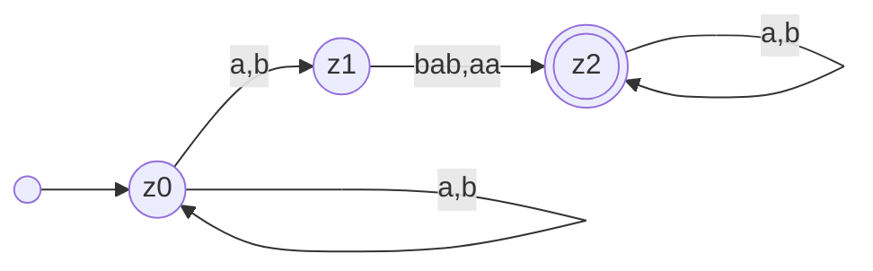
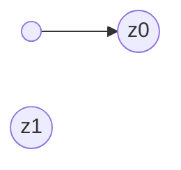

---
tags:
  - 4semester
  - FSK
  - informatik
  - Übungsblatt
fach: "[[FSK]]"
Thema: 
Benötigte Zeit:
date created: Saturday, 4. May 2024, 20:06
date modified: Saturday, 4. May 2024, 22:09
---

> [!info] 
> Wenn Sie Automaten angeben, tun Sie dies immer in Form eines Zustandsgraphen. Andere Formen der Darstellung (z.B. als Liste von Übergängen) werden nicht gewertet, da sie sehr viel aufwändiger zu korrigieren sind. Vergessen Sie nicht, im Zustandsgraph Start- und Endzustände zu markieren.

# FSK3-1 Konstruktion von NFAs (2 Punkte)

> [!info] Verwenden Sie in dieser Aufgabe nur NFAs ohne ε-Übergänge

## a) Geben Sie einen NFA an, der die folgende Sprache $L$ über dem Alphabet $Σ = \{a, b\}$ akzeptiert:

$$
L = \{u\ v\  w \ | \ v,w \in \Sigma^{*},\ v\in \{bab,aa\} \}
$$

## b) Viele Programmiersprachen erlauben nur Variablennamen, die Regeln wie diese erfüllen:

>[!info] Aufgabenstellung
>- Ein Variablenname kann Unterstriche, kleine und große Buchstaben (a–z, A–Z) und Ziffern enthalten.
>- Ein Variablenname muss mindestens ein Zeichen enthalten.
>- Ein Variablenname darf nicht mit einer Ziffer anfangen.
>- „_“ ist kein Variablenname.
>
>**Geben Sie einen NFA an, der genau die Variablennamen erkennt, die diesen Regeln folgen.**

Für die Übersicht führe ich ein paar Variablen hinzu:
- $c = \text{Buchstaben (a-z,A-Z)}$
- $z = \text{Ziffer}$
- $\_ = \text{Unterstrich}$

