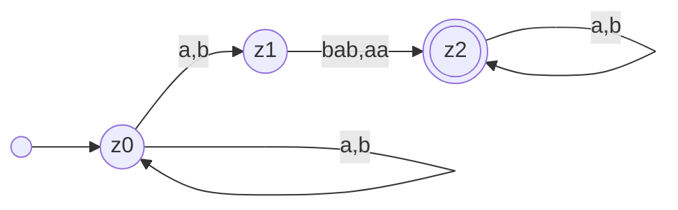
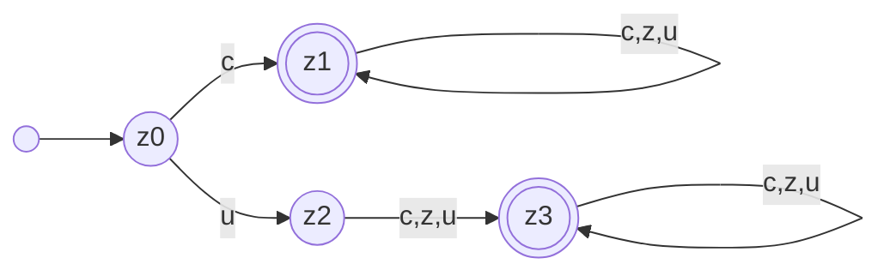
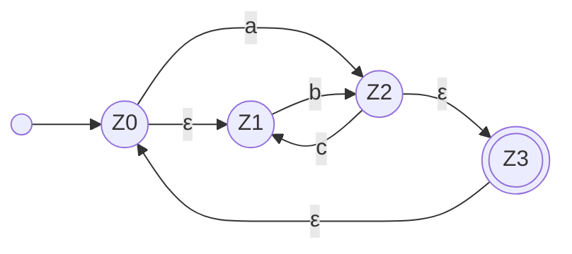
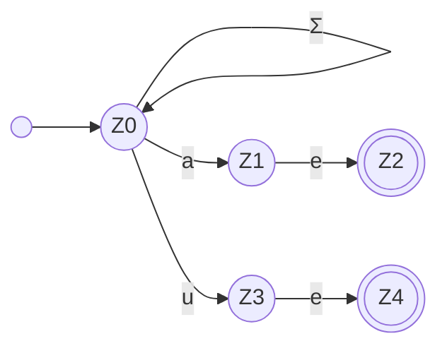

---
tags:
  - 4semester
  - FSK
  - informatik
  - Übungsblatt
fach: "[[FSK]]"
Thema: 
Benötigte Zeit:
date created: Saturday, 4. May 2024, 20:06
date modified: Wednesday, 8. May 2024, 02:27
---

# TODOs

- [ ] [[FSK-ÜB-3]] ab 3-2 fortsetzen

> [!info] 
> Wenn Sie Automaten angeben, tun Sie dies immer in Form eines Zustandsgraphen. Andere Formen der Darstellung (z.B. als Liste von Übergängen) werden nicht gewertet, da sie sehr viel aufwändiger zu korrigieren sind. Vergessen Sie nicht, im Zustandsgraph Start- und Endzustände zu markieren.

# FSK3-1 Konstruktion von NFAs (2 Punkte)

> [!info] Verwenden Sie in dieser Aufgabe nur NFAs ohne ε-Übergänge

## a) Geben Sie einen NFA an, der die folgende Sprache $L$ über dem Alphabet $Σ = \{a, b\}$ akzeptiert:

$$
L = \{u\ v\  w \ | \ v,w \in \Sigma^{*},\ v\in \{bab,aa\} \}
$$

## b) Viele Programmiersprachen erlauben nur Variablennamen, die Regeln wie diese erfüllen:

>[!info] Aufgabenstellung
>- Ein Variablenname kann Unterstriche, kleine und große Buchstaben (a–z, A–Z) und Ziffern enthalten.
>- Ein Variablenname muss mindestens ein Zeichen enthalten.
>- Ein Variablenname darf nicht mit einer Ziffer anfangen.
>- „_“ ist kein Variablenname.
>
>**Geben Sie einen NFA an, der genau die Variablennamen erkennt, die diesen Regeln folgen.**

Für die Übersicht führe ich ein paar Variablen hinzu:
- $c = \text{Buchstaben (a-z,A-Z)}$
- $z = \text{Ziffer}$
- $u = \text{Unterstrich (\_)}$

- z0 kein Endzustand weil mindestens ein Wort drin sein muss
	- Beispielname für z0: ""
- z1 Endzustand Variablenname mit mindestens einem Buchstaben
	- Beispielname für z1: "a" und danach rekursiv eventuell : "asdf123"
- z2 kein Endzustand weil nur Unterstrich
	- Beispielname für z2: "\_" → nicht erlaubt
- z3 ist ein Endzustand, da unterstrich am Anfang aber danach Zeichen folgt
	- Beispielname für z3: "\_a" danach rekursiv "\_asdf123"

Entschuldigung für das Missverständnis. Hier ist der Text in der ursprünglichen Sprache, formatiert für Markdown:

## c) Sei $n$ eine natürliche Zahl, $\Sigma_n = \{0, \dots, n\}$ und

>[!note]
> $$
> L_n = \{w \in \Sigma_n^* \mid i \in \Sigma_n, \#_i(w) = i\}
> $$
> 
> **Das heißt, die Sprache $L$ enthält genau die Wörter $w$, für die gilt: Es gibt eine Zahl $i \in \{0, \dots, n\}$ sodass das Wort $w$ das Symbol $i$ genau $i$-mal enthält.**
> 
> **Z.B. ist $2012323 \in L_3$, da dieses Wort genau 1-mal das Symbol 1 enthält. Ebenso ist $20311233 \in L_3$, da dieses Wort genau 2-mal das Symbol 2 enthält. Hingegen ist $0112223 \notin L_3$.**
> 
> **Geben Sie für jedes $n$ einen NFA $A_n$ an, der $L_n$ erkennt. Beschreiben Sie ausnahmsweise $A_n$ nicht durch einen Zustandsgraph, sondern geben Sie die Zustandsmenge, Start- und Endzustände und Übergänge (in Abhängigkeit von $n$) explizit an. Geben Sie außerdem den Zustandsgraph von $A_3$ an.**

**Gedankengang:**
- $2012323 \in L_3$ weil alle jede Ziffer kommt weniger als 2 mal vor $L_{3}=\{0,1,2\}$
- $0112223 \notin L_3$ weil die 2 drei-mal vorkommt $3 \notin L_{3}$

>[!summary]
> ### Definition des NFA $A_n$
>
> Für die Definition eines Nichtdeterministischen Endlichen Automaten (NFA), der die Sprache $L_n$ erkennt, gehen wir wie folgt vor:
>
> #### Zustandsmenge:
>
> - Die Zustandsmenge $Q$ von $A_n$ besteht aus allen möglichen Zählerkonfigurationen für jedes Symbol in $\Sigma_n$, die angeben, wie oft jedes Symbol bis zu einem bestimmten Punkt im Wort erschienen ist. Zusätzlich gibt es einen besonderen Startzustand $q_0$ und Fehlerzustände für unerlaubte Symbolzählungen.
> - Jeder Zustand $q$ in $Q$ kann durch ein Tupel $(c_0, c_1, \ldots, c_n)$ repräsentiert werden, wobei $c_i$ die Anzahl des Symbols $i$ in $\Sigma_n$ ist, das bis jetzt gelesen wurde. Jedes $c_i$ kann Werte von 0 bis $n$ annehmen, wobei Werte größer als $n$ zu einem Fehlerzustand führen.
>
> #### Startzustand:
>
> - Der Startzustand ist $q_0 = (0, 0, \ldots, 0)$, was bedeutet, dass noch kein Symbol gelesen wurde.
>
> #### Akzeptierende Zustände:
>
> - Ein Zustand $(c_0, c_1, \ldots, c_n)$ ist ein akzeptierender Zustand, wenn genau eine der Zählungen $c_i = i$ ist und alle anderen $c_j$ (für $j \neq i$) kleiner als $j$ sind. Das heißt, genau ein Symbol $i$ kommt genau $i$-mal vor, und kein anderes Symbol kommt öfter vor, als es seine Ziffer erlaubt.
>
> #### Übergänge:
>
> - Von jedem Zustand $(c_0, c_1, \ldots, c_n)$ gibt es einen Übergang zum Zustand $(c_0, c_1, \ldots, c_i+1, \ldots, c_n)$ beim Lesen des Symbols $i$. Wenn $c_i+1 > n$, führt der Übergang in einen Fehlerzustand.
>
> #### Fehlerzustände:
>
> - Fehlerzustände werden erreicht, wenn eine Zählung $c_i$ größer als $n$ wird. Alle Übergänge von Fehlerzuständen führen wieder in Fehlerzustände.
>
> ### Zustandsgraph für $A_3$
>
> Für den speziellen Fall von $n = 3$ erstellen wir einen Zustandsgraphen:
>
> - **Zustände**: Jeder Zustand ist ein Tupel $(c_0, c_1, c_2, c_3)$, wobei jedes $c_i$ von 0 bis 3 reichen kann. Zustände, in denen $c_i > i$ sind nicht Teil unseres Automaten.
> - **Akzeptierende Zustände**: Zustände wie $(0, 1, 0, 0)$, $(0, 0, 2, 0)$ und $(0, 0, 0, 3)$.
> - **Startzustand**: $(0, 0, 0, 0)$
> - **Übergänge**: Basierend auf der obigen Beschreibung.
>
> Lassen Sie uns eine detaillierte grafische Darstellung des Nichtdeterministischen Endlichen Automaten $A_3$ erstellen, der die Sprache $L_3$ erkennt. Diese Visualisierung wird die Zustandsmenge, akzeptierende Zustände, Startzustand und Übergänge für $n=3$ enthalten. Beachten Sie, dass ich zur Vereinfachung nur relevante Teile des Automaten zeige, da die vollständige Darstellung sehr umfangreich wäre.
>
> Hier ist die grafische Darstellung von $A_3$:
>
> ### Zustandsgraph von $A_3$
>
> 1. **Zustände**:
>     
>     - Jeder Zustand ist ein Tupel $(c_0, c_1, c_2, c_3)$, wobei $c_i$ die Anzahl der Male darstellt, dass das Symbol $i$ gelesen wurde. Nur diejenigen Zustände, bei denen keine $c_i$ die Bedingung $c_i > i$ erfüllt, sind gültig.
>     - Fehlerzustände sind solche, bei denen mindestens ein $c_i > i$.
> 2. **Startzustand**:
>     
>     - Der Startzustand ist $(0, 0, 0, 0)$.
> 3. **Akzeptierende Zustände**:
>     
>     - $(0, 1, 0, 0)$: Symbol 1 kommt genau einmal vor.
>     - $(0, 0, 2, 0)$: Symbol 2 kommt genau zweimal vor.
>     - $(0, 0, 0, 3)$: Symbol 3 kommt genau dreimal vor.
> 4. **Übergänge**:
>     
>     - Von jedem Zustand $(c_0, c_1, c_2, c_3)$ gibt es Übergänge zu $(c_0+1, c_1, c_2, c_3)$, $(c_0, c_1+1, c_2, c_3)$, $(c_0, c_1, c_2+1, c_3)$ und $(c_0, c_1, c_2, c_3+1)$ beim Lesen der entsprechenden Symbole 0, 1, 2, bzw. 3. Übergänge, die zu ungültigen Zuständen führen, werden nicht gezeigt.

---

# FSK3-2 Entfernen von $\epsilon$-Übergängen und Potenzmengenkonstruktion (2 Punkte)

## a) Sei $A_1$ der folgende NFA über dem Alphabet $\{a, b, c\}$:

>[!info] Aufgabenstellung
>Geben Sie einen NFA $A_1'$ ohne $\epsilon$-Übergänge mit $L(A_1') = L(A_1)$ an. Verwenden Sie den Algorithmus zum Entfernen von $\epsilon$-Übergängen aus der Vorlesung. Geben Sie die Zwischenschritte Ihrer Berechnung an. Das erlaubt uns, Ihnen für Folgefehler Teiilpunkte zu geben.

## b) Der folgende NFA $A_2$ über einem Alphabet $\Sigma = \{a, e, u\}$ kann verwendet werden, um in einem Text nach den Zeichenfolgen $ae$ und $ue$ zu suchen.

>[!info] Aufgabenstellung
>Die Suche wird wesentlich beschleunigt, wenn wir $A_2$ in einen DFA umwandeln. Verwenden Sie deshalb die Potenzmengenkonstruktion, um einen DFA $A_2'$ mit $L(A_2') = L(A_2)$ zu konstruieren. Geben Sie außer dem Zustandsgraph von $A_2'$ auch die Rechenschritte an, die Sie bei der Potenzmengenkonstruktion ausgeführt haben. Das erlaubt uns, Ihnen bei Folgefehlern noch Teilpunkte zu geben.
