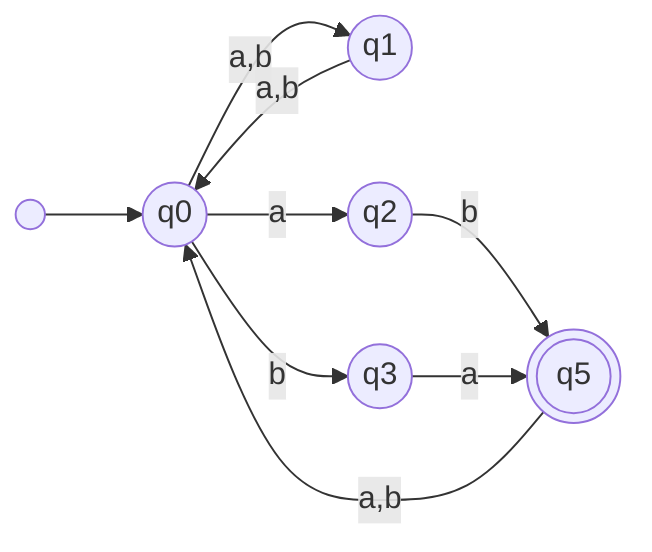
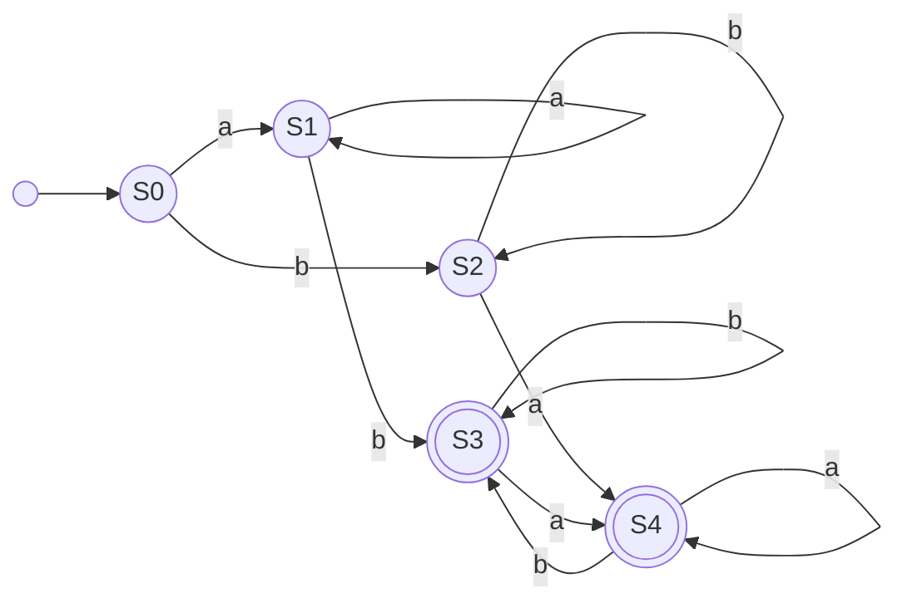
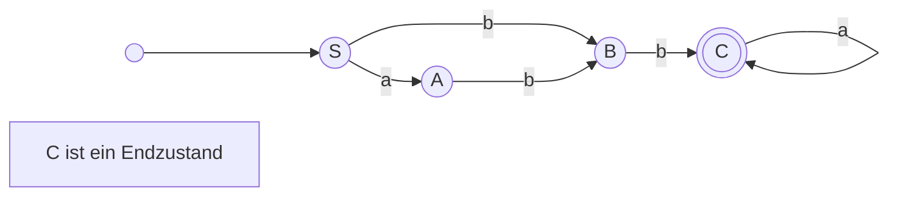
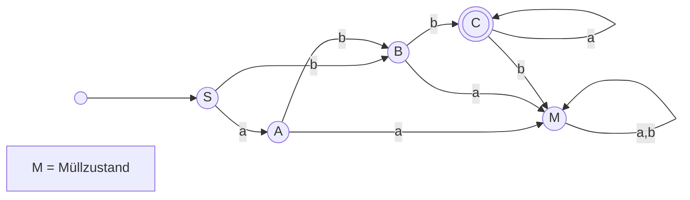
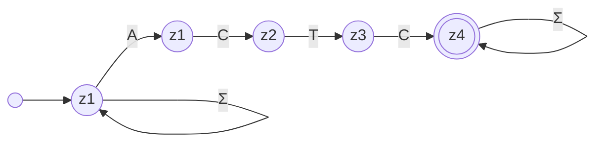
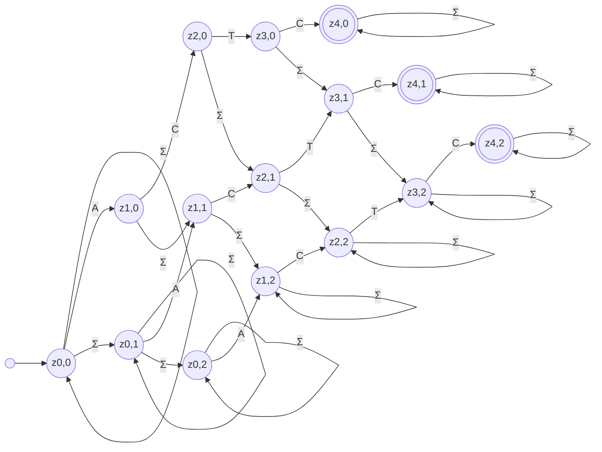

---
tags:
  - 4semester
  - FSK
  - informatik
  - Übungsblatt
fach: "[[Formale Sprachen und Komplexität (FSK)]]"
Thema:
Benötigte Zeit:
date created: Monday, 13. May 2024, 22:00
date modified: Wednesday, 15. May 2024, 02:04
---

# FSK4-1 [[Pumping-Lemma]] für reguläre Sprachen (2 Punkte)

Zeigen Sie mit dem Pumping-Lemma für reguläre Sprachen, dass die folgenden Sprachen nicht regulär sind.

## a) $L_1 = \{ a^i b^j c^k d^i \mid i, j, k \in \mathbb{N}_{>0} \}$ über dem Alphabet $\Sigma_1 = \{ a, b, c, d \}$.

> [!tip] [[Pumping-Lemma#Schema des Lemma-Beweises]]
>
> $$
> \begin{aligned}
> \text{WENN} \quad & \forall p \in \mathbb{N} \text{ gilt:} \\
> &\exists w \in L  \text{ mit } |w|\geq p:\\
> &\forall \text{ Zerlegungen } w = xyz \text{ mit } y \neq \epsilon \text{ und } |xy| \leq p: \\
> & \exists i \in \mathbb{N} \text{ sodass } xy^i z \notin L \\
> \text{DANN} \quad & L \text{ nicht erkennbar}
> \end{aligned}
> $$

### Beweis

$$
\textbf{Annahme:} \quad L_1 \text{ ist regulär.}
$$

$$
\begin{aligned}
&1. \ \text{Gemäß Pumping-Lemma gibt es eine Pumping-Länge } p \in \mathbb{N}. \\
&2. \ \text{Wähle } w = a^p b^1 c^1 d^p \text{ aus } L_1, \text{ wobei } |w| = 2p + 2 \geq p. \\
&3. \ \text{Zerlege } w = xyz, \text{ wobei } |xy| \leq p \text{ und } |y| > 0. \\
&4. \ \text{Wähle } x = a^m, \ y = a^n \text{ und } z = a^{p-m-n}b^1c^1d^p, \text{ wobei } m+n \leq p \text{ und } n > 0. \\
&5. \ \text{Setze } i = 0. \\
\end{aligned}
$$

**Abpumpen:**

- Das gepumpte Wort wird $xy^0z = xa^{0}z = a^{m}a^{p-m-n}b^1c^1d^p = a^{p-n}b^1c^1d^p$.
- Das resultierende Wort hat $p-n$ $a$'s und $p$ $d$'s.
- Da $n > 0$, gilt $p-n \neq p$, und somit passt das Wort $a^{p-n}b^1c^1d^p$ nicht in die Form $a^i b^j c^k d^i$, weil die Anzahl der $a$'s und $d$'s nicht mehr übereinstimmt.

**Fazit:**

- Da $xy^0z \notin L_1$ für $i = 0$, und das Wort $w$ beliebig gewählt wurde, folgt daraus, dass $L_1$ nicht regulär sein kann, da es das Pumping-Lemma verletzt.

## b) $L_2 = L(G_2)$, wobei $G_2$ eine kontextfreie Grammatik ist mit

> [!note] Aufgabenstellung
>
> $$
> G_2 = (\{S, A, B\}, \{(), [], [, ]\}, P, S)
> $$
>
> $$
> P = \{ S \rightarrow (S), S \rightarrow [S], S \rightarrow A, S \rightarrow \epsilon, A \rightarrow B, A \rightarrow [], B \rightarrow S, B \rightarrow BB \}
> $$
>
> $L_2$ ist die Sprache der zueinander passenden eckigen und runden Klammern, d.h. es sind z.B. $([][]) \in L_2$ und $()() \in L_2$, aber $([]) \notin L_2$ und $) \notin L_2$ (vgl. Aufgabe FSK1-3).
> Hier ist der umgewandelte Text mit den angepassten LaTeX-Syntax:

### Beweis

$$
\textbf{Annahme:} \quad L_2 \text{ ist regulär.}
$$

$$
\begin{aligned}
&1. \ \text{Gemäß dem Pumping-Lemma gibt es eine Pumping-Länge } p \in \mathbb{N}. \\
&2. \ \text{Wähle } w = ([)^p ]^p \text{ aus } L_2, \text{ wobei } |w| = 2p \geq p. \\
&3. \ \text{Zerlege } w = xyz, \text{ wobei } |xy| \leq p \text{ und } |y| > 0. \\
&4. \ \text{Da } |xy| \leq p, \text{ muss } y \text{ nur aus } ([ \text{ bestehen, wähle z.B. } y = ([)^n \text{ mit } n > 0. \\
&5. \ \text{Setze } i = 0.
\end{aligned}
$$

**Abpumpen:**

- Das gepumpte Wort wird $xy^0z = xz$.
- Wenn $x = ([)^m$ und $z = ([)^{p-m-n} ]^p$, dann ist $xy^0z = ([)^{p-n} ]^p$.
- Das resultierende Wort hat $p-n$ öffnende und $p$ schließende Klammern.

**Fazit:**

- Da $n > 0$, gilt $p-n < p$, und somit passt das Wort $([)^{p-n} ]^p$ nicht in die Form, die eine gleiche Anzahl von zueinander passenden Klammern erfordert, weil die Anzahl der öffnenden Klammern $([$) geringer ist als die Anzahl der schließenden Klammern $]$.
- Da $xy^0z \notin L_2$ für $i = 0$, und das Wort $w$ gemäß den Vorgaben des Pumping-Lemmas gewählt wurde, folgt daraus, dass $L_2$ nicht regulär sein kann, da es das Pumping-Lemma verletzt.

> [!summary]
> Um zu zeigen, dass die Sprache $L_2$, die korrekt gepaarte Klammern enthält, nicht regulär ist, verwenden wir das Pumping-Lemma für reguläre Sprachen. Hier ist eine noch kürzere und einfachere Zusammenfassung des Beweises:
>
> 1.  **Annahme**: Angenommen $L_2$ ist regulär.
> 2.  **Wortwahl**: Wir wählen ein Wort $w$, bestehend aus $p$ öffnenden gefolgt von $p$ schließenden Klammern, z.B. $w = ([)^p ]^p$.
> 3.  **Zerlegung und Pumping**: Das Pumping-Lemma sagt, dass man $w$ in Teile $x, y, z$ zerlegen kann, wobei $y$ wiederholbar ist. Wichtig ist, dass $y$ nur aus öffnenden Klammern besteht.
> 4.  **Abpumpen**: Wenn wir $y$ beim Pumpen entfernen, sind weniger öffnende als schließende Klammern im Wort $xz$, was zu einem Ungleichgewicht führt.
>
> **Fazit**: $xz$ hat nicht mehr die gleiche Anzahl öffnender und schließender Klammern, was es ungültig für $L_2$ macht. Das zeigt, dass $L_2$ nicht regulär sein kann.

---

# FSK4-2 Reguläre Ausdrücke und Abschlusseigenschaften (2 Punkte)

## a) Betrachten Sie den regulären Ausdruck $\alpha = (a|b)*(ab|ba)(a|b)*$.

### i) Geben Sie einen NFA ohne $\epsilon$-Übergänge an, der $L(\alpha)$ erkennt. Sie können die Algorithmen aus der Vorlesung zur Konstruktion eines NFA aus einem regulären Ausdruck und zur Elimination von $\epsilon$-Übergängen verwenden, müssen aber nicht.

### ii) Geben Sie einen DFA an, der $L(\alpha)$ erkennt. Sie können die Potenzmengenkonstruktion verwenden, müssen aber nicht.

## b) Geben Sie [[Reguläre Ausdrücke]] an, die die folgenden Sprachen erkennen.

### i) Die Sprache $L_3$ der Wörter über dem Alphabet $\Sigma_1 = \{a, b, c\}$, die mit $a$ oder $b$ anfangen und mindestens ein $c$ enthalten.

$$
[ab][abc]^*c[abc]^*
$$

**Erklärung des regulären Ausdrucks:**

- \[ab\]: Das Wort beginnt mit $a$ oder $b$.
- \[abc\]\*: Nach dem Anfangsbuchstaben können beliebige Zeichen aus dem Alphabet $\{a, b, c\}$ folgen, und zwar beliebig oft, auch gar nicht.
- c: Es muss mindestens ein $c$ im Wort vorkommen.
- \[abc\]\*: Nach dem ersten $c$ können wieder beliebige Zeichen aus dem Alphabet $\{a, b, c\}$ beliebig oft folgen.

### ii) Die Sprache $L_4$ der Wörter über dem Alphabet $\Sigma_2 = \{a, b\}$, die keine zwei $a$'s hintereinander enthalten.

$$
b^*(ab^*)^*
$$

**Erklärung des regulären Ausdrucks:**

- b\*:Das Wort kann mit beliebig vielen $b$'s beginnen, einschließlich keinem $b$.
- (ab\*)\*: Nach jedem $a$ darf kein weiteres $a$ direkt folgen. Stattdessen kann ein $a$ von beliebig vielen $b$'s gefolgt werden (einschließlich keinem), und diese Sequenz aus einem $a$ und den darauf folgenden $b$'s kann beliebig oft wiederholt werden, einschließlich gar nicht.

## c) Zeigen Sie mithilfe der Abschlusseigenschaften regulärer Sprachen, dass die Sprache $L_5 = \{a^i w d^{i+1} \mid i \in \mathbb{N}, w \in \Sigma_3^*\}$ über dem Alphabet $\Sigma_3 = \{a, b, c, d\}$ nicht regulär ist. Sie dürfen annehmen, dass die Sprache $L_1$ aus Aufgabe FSK4-1a nicht regulär ist.

Um zu zeigen, dass die Sprache $L_5 = \{a^i w d^{i+1} \mid i \in \mathbb{N}, w \in \Sigma_3^*\}$ nicht regulär ist, gehen wir wie folgt vor:

1. **Annahme:** $L_5$ ist regulär.
2. **Konstruktion:** Betrachte die reguläre Sprache $R = a^*d^*$, die durch den regulären Ausdruck beschrieben wird und alle Wörter mit beliebigen Anzahlen von $a$'s gefolgt von $d$'s enthält.
3. **Durchschnitt:** Der Durchschnitt $L_5 \cap R$ ergibt die Sprache $\{a^i d^{i+1} \mid i \in \mathbb{N}\}$, die die Struktur von $L_1$ widerspiegelt und nach Annahme nicht regulär ist.
4. **Widerspruch:** Da der Durchschnitt zweier regulärer Sprachen regulär sein sollte, der erhaltene Durchschnitt jedoch nicht regulär ist, führt dies zu einem Widerspruch.

**Schlussfolgerung:** $L_5$ kann nicht regulär sein, da dies zu einem Widerspruch führt.

---

# FSK4-3 Grammatik über Automaten zu Grammatik (0 Punkte)

> [!note] Aufgabenstellung
> Gegeben sei die reguläre Grammatik
>
> $$
> G = (\{S, A, B, C\}, \{a, b\}, \{S \rightarrow aA \mid bB, A \rightarrow bB, B
> \rightarrow bC, C \rightarrow aC \mid a\}, S)
> $$

## a) Erzeugen Sie gemäß der Konstruktion aus der Vorlesung aus $G$ einen NFA $A$ mit $L(G) = L(A)$.

## b) Erzeugen Sie mit der Potenzmengenkonstruktion aus $A$ einen DFA $B$ mit $L(B) = L(A)$. Geben Sie nur den vom Startzustand erreichbaren Teil von $A$ an.

|  Start  | $\rightarrow$ |    Ziel     |
| :-----: | :-----------: | :---------: |
| $\{S\}$ |      $a$      |   $\{A\}$   |
| $\{S\}$ |      $b$      |   $\{B\}$   |
| $\{A\}$ |      $a$      | $\emptyset$ |
| $\{A\}$ |      $b$      |   $\{B\}$   |
| $\{B\}$ |      $a$      | $\emptyset$ |
| $\{B\}$ |      $b$      |   $\{C\}$   |
| $\{C\}$ |      $a$      |   $\{C\}$   |
| $\{C\}$ |      $b$      | $\emptyset$ |

## c) Erzeugen Sie gemäß der Konstruktion aus der Vorlesung aus $B$ eine Grammatik $H$ mit $L(B) = L(H)$.

### Erste Option:

$$
\begin{aligned}
H = (\{S, A, B, C, M\}, \{a, b\}, \{\\ S &\rightarrow aA \mid bB,\\
A &\rightarrow aM\ |\ bB,\\
B &\rightarrow aM \ | \ bC,\\
C &\rightarrow aC \mid a \mid bM \\
\}, S)
\end{aligned}
$$

Die Grammatik wurde um den Müllzustand erweitert

### Zweite Option: (inkorrekt?)

$$
\begin{aligned}
H' = (\{S, A, B, C\}, \{a, b\}, \{\\
S &\rightarrow aA \mid bB,\\
A &\rightarrow bB,\\
B &\rightarrow bC,\\
C &\rightarrow aC \mid a \\
\}, S)
\end{aligned}
$$

Die **Grammatik** $H'$ entspricht der vom **DFA** $B$ akzeptierten **Sprache**, da sie durch eine direkte Überführung der **Zustände** und **Übergänge** des DFA in **Nichtterminale** und **Produktionsregeln** entsteht, die die **Akzeptanzbedingungen** des DFA genau abbilden.

## d) Vergleichen Sie die Grammatiken $G$ und $H$. Beschreiben Sie die Gemeinsamkeiten dieser Grammatiken, sowie ihre Unterschiede. Überlegen Sie sich, wodurch diese Effekte zustande kommen.

### Gemeinsamkeiten:

1. **Nichtterminale und Terminale:** Beide Grammatiken nutzen $\{S, A, B, C\}$ und $\{a, b\}$.
2. **Startsymbol:** Beide haben $S$ als Startsymbol.
3. **Ähnliche Produktionen:** Produktionen wie $S \rightarrow aA \mid bB$ und $B \rightarrow bC$ sind identisch.

### Unterschiede:

1. **Müllzustand:** $H$ führt den Müllzustand $M$ ein, den $G$ nicht hat.
2. **Zusätzliche Produktionen:** $H$ enthält Produktionen wie $A \rightarrow aM$ und $B \rightarrow aM$, die den Müllzustand reflektieren.
3. **Endproduktion:** In $H$ hat $C$ eine Endproduktion $a$, die in $G$ fehlt.

### Ursachen der Unterschiede:

- **Müllzustand:** $H$ modelliert explizit den Müllzustand für die DFA-Vollständigkeit, während $G$ sich auf die Sprachgenerierung konzentriert.
- **Automatenlogik:** $H$ spiegelt die vollständige DFA-Struktur wider, während $G$ nur die akzeptierten Sprachelemente darstellt.

Zusammenfassend modelliert $H$ den vollständigen DFA, inklusive ungültiger Eingaben, während $G$ die Sprache direkt generiert.

---

# FSK4-4 DNA-Analyse mit NFA (0 Punkte)

> [!note] Aufgabenstellung
> Diese Aufgabe handelt von der Analyse von Desoxyribonukleinsäure (DNS/DNA) mithilfe von NFA. DNA ist eine Abfolge der Basen Adenin, Thymin, Guanin und Cytosin, typischerweise mit A, T, G und C abgekürzt. Dementsprechend ist das Alphabet aller Automaten in dieser Aufgabe $\Sigma = \{A, C, G, T\}$.

## a) Um das Vorkommen einer Basensequenz zu finden, wird aus dieser Sequenz ein NFA erzeugt, der alle Wörter akzeptiert, in denen diese Sequenz als Teilwort vorkommt.

> [!note] Aufgabenstellung
> Geben Sie einen NFA $B$ an, der genau diejenigen Wörter akzeptiert, in denen $ACTC$ als Teilwort vorkommt.
>
> **Hinweis:** Sie können (müssen aber nicht) dazu den regulären Ausdruck $(A|C|G|T)^* ACTC (A|C|G|T)^*$ verwenden, der genau diese Sprache akzeptiert.
>
> **Hinweis:** Sie können auch einen DFA angeben, aber ein NFA ist übersichtlicher.

## b) Beim Kopieren von DNA kann es vorkommen, dass Fehler auftreten. Zum Beispiel kann eine Base durch eine andere ersetzt werden; es kann eine Base ausgelassen werden; es kann eine zusätzliche Base eingefügt werden; und es können auch komplexere Fehler auftreten. Zur Vereinfachung behandeln wir hier nur den Fall, dass eine Base durch eine andere ersetzt wird.

> [!note] Aufgabenstellung
> Aus einem NFA $D = (Z, \Sigma, \delta, S, E)$ kann ein NFA $F = (Z', \Sigma, \delta', S', E')$ erzeugt werden, der alle Wörter akzeptiert, die durch höchstens $k$ fehlerhafte Ersetzungen aus $D$ entstehen.
>
> Dabei sind:
>
> - $Z' = Z \times \{0, \ldots, k\}$
> - $$
>   \delta'((q, i), a) = \{(q', i) \mid q' \in \delta(q, a)\} \cup \{(q', i+1) \mid
>   (\exists b \in \Sigma. q' \in \delta(q, b)) \land i + 1 \leq k\}
>   $$
> - $S' = S \times \{0\} = \{(s, 0) \mid s \in S\}$
> - $E' = E \times \{0, \ldots, k\}$
>
> Berechnen Sie mit der obigen Konstruktion einen NFA $H$ aus $B$, der Wörter mit bis zu 2 Fehlern akzeptiert.

> [!tip] Erklärung $\delta'$
> Die **Transitionsfunktion** $\delta'$ definiert, wie der modifizierte Automat von einem **Zustand** zum anderen übergeht, unter Berücksichtigung möglicher **Fehler** in der Eingabe. Hier ist eine kurze und verständliche Erklärung:
>
> 1. **$\{(q', i) | q' \in \delta(q, a)\}$**: Diese Menge beschreibt **normale Übergänge** ohne Fehler. Wenn der Automat im Zustand **$(q, i)$** ist und das Zeichen **$a$** liest, kann er in den Zustand **$(q', i)$** übergehen, wenn **$q'$** ein gültiger Übergangszustand von **$q$** aus ist, gegeben das Zeichen **$a$** im ursprünglichen Automaten **$D$**. Das bedeutet, es wird kein **Fehler** gezählt und der **Fehlerindex** **$i$** bleibt unverändert.
>     
> 2. **$\{(q', i+1) | (\exists b \in \Sigma. q' \in \delta(q, b) \land i+1 \leq k)\}$**: Diese Menge erlaubt **fehlerhafte Übergänge**, bei denen ein Zeichen falsch interpretiert wird. Wenn der Automat im Zustand **$(q, i)$** ist und das Zeichen **$a$** liest, kann er auch in den Zustand **$(q', i+1)$** übergehen, wenn es möglich ist, **$q'$** von **$q$** aus zu erreichen durch das Lesen eines beliebigen anderen Zeichens **$b$** (nicht notwendigerweise **$a$**). Dies zählt als ein **Fehler**, und der **Fehlerindex** **$i$** wird um 1 erhöht, solange die Gesamtzahl der **Fehler** **$i+1$** nicht größer als **$k$** ist.
>
> Zusammengefasst: $\delta'$ erlaubt sowohl **normale** als auch **fehlerhafte Übergänge**, wobei **fehlerhafte Übergänge** die Annahme eines falschen Zeichens unter der Bedingung beinhalten, dass die maximale erlaubte **Fehlerzahl** **$k$** noch nicht erreicht ist.

## c) Geben Sie an und begründen Sie, welche der folgenden Wörter von $H$ akzeptiert werden. Prüfen Sie, ob Ihr Ergebnis korrekt ist, also ob die erkannten Wörter tatsächlich diejenigen sind, bei denen bis auf höchstens 2 Fehler das Wort $ACTC$ als Teilwort vorkommt.

$AAAAACCCAAA, GAGGCGT, TAGCA, TCTCA$

Um zu bestimmen, ob die gegebenen Wörter von dem NFA $H$ akzeptiert werden, prüfen wir, ob das Wort "ACTC" mit höchstens zwei Fehlern in jedem Wort erscheinen kann.

### Wortanalyse:

1. $AAAAACCCAAA$

   - **Suche nach "ACTC":** Kein Vorkommen von "ACTC".
   - **Mögliche Fehler:** Das nächste, was "ACTC" ähnlich sieht, wäre "ACCA" (zum Beispiel durch Ersetzung von 'T' durch 'A' und 'C' durch 'A').
   - $\Longrightarrow$ **Ergebnis:** Zwei Fehler, um von "ACCA" zu "ACTC" zu gelangen. **Wird akzeptiert.**

2. $GAGGCGT$

   - **Suche nach "ACTC":** Kein direktes Vorkommen von "ACTC".
   - **Mögliche Fehler:** Das nächste, was "ACTC" ähnlich sieht, wäre "GCGT" eine Korrektur würde 3 Korrekturen benötigen "`A`C`TC`"
   - $\Longrightarrow$ **Ergebnis:** Wort benötigt 3 Korrekturen **Wird nicht akzeptiert.**

3. **TAGCA**
   - **Suche nach "ACTC":** Kein direktes Vorkommen von "ACTC".
   - **Mögliche Fehler:** Das nächste, was "ACTC" ähnlich sieht, wäre "AGCA" eine Korrektur würde 3 Korrekturen benötigen "A`CTC`"

- $\Longrightarrow$ **Ergebnis:** Wort hat 3 Fehler, **Wird nicht akzeptiert.**

4. **TCTCA**
   - **Suche nach "ACTC":** Kein direktes Vorkommen von "ACTC".
   - **Mögliche Fehler:** Das nächste, was "ACTC" ähnlich sieht, wäre "TCTC" eine Korrektur würde 1 Korrektur benötigen "`A`CTC"
   - $\Longrightarrow$ **Ergebnis:** Nur ein Fehler , **wird akzeptiert.**

### Zusammenfassung:

- **AAAAACCCAAA**: Akzeptiert (zwei Fehler )
- **GAGGCGCT**: Nicht akzeptiert (drei Fehler)
- **TAGCA**: Nicht akzeptiert (drei Fehler)
- **TCTCA**: Akzeptiert (ein Fehler)

## d) Begründen Sie, dass die Konstruktion aus b) korrekt ist, also tatsächlich für jeden NFA $D$ und jedes $k$ einen NFA $F$ liefert, der maximal $k$ Fehler zulässt.

> [!warning] Hinweis
> Sie können auch als Vorüberlegung dies erst für den NFA $H$ zeigen.

Die Konstruktion eines NFA $F$ aus einem NFA $D$ zur Akzeptanz von Wörtern mit bis zu $k$ Ersetzungsfehlern lässt sich durch folgende Schritte begründen:

1. **Erweiterter Zustandsraum**: $F$ kombiniert jeden Zustand $q$ aus $D$ mit einem Fehlerzähler $i$, um bis zu $k$ Fehler zu verfolgen.

2. **Transitionsfunktion $\delta'$**: $F$ hat normale Übergänge für exakte Zeichen und Fehlerhafte Übergänge für nicht erwartete Zeichen, die als Fehler gezählt werden.

3. **Beweis durch Induktion (Korrekte Akzeptanz)**: $F$ akzeptiert ein Wort genau dann, wenn es durch bis zu $k$ Ersetzungsfehler aus einem von $D$ akzeptierten Wort entsteht.

4. **Übereinstimmung von Start- und Endzuständen**: Startzustände von $F$ entsprechen denen von $D$, und Endzustände in $F$ berücksichtigen alle möglichen Fehlerzähler.

Damit akzeptiert $F$ genau die Wörter, die aus den von $D$ akzeptierten Wörtern durch bis zu $k$ Ersetzungsfehler entstehen.

<!-- Modal START -->

  

    &times;
    

      If MyUniNotes has been helpful and you’d like to support my efforts,  you can contribute with a donation: <a class="modal-dono-link" href="https://paypal.me/myuninotes4u">Donate via PayPal</a> :)  Your support will help me continue improving the content, but there is no obligation to donate.
    

    

      MyUniNotes is a personal, non-revenue project as I believe in accessible education for everyone. I manage this project alongside my studies, with all materials handwritten by me trying to help others understand challenging concepts.
    

  

<!-- Modal END -->

<!-- DISQUS SCRIPT COMMENT START -->

<!-- DISQUS RECOMMENDATION START -->

<noscript>
Please enable JavaScript to view the 
<a href="https://disqus.com/?ref_noscript" rel="nofollow">
comments powered by Disqus.
</a>
</noscript>

<!-- DISQUS RECOMMENDATION END -->

<noscript>Please enable JavaScript to view the <a href="https://disqus.com/?ref_noscript">comments powered by Disqus.</a></noscript>

<!-- DISQUS SCRIPT COMMENT END -->

<!-- Modal START -->

  

    &times;
    

      If MyUniNotes has been helpful and you’d like to support my efforts,  you can contribute with a donation: <a class="modal-dono-link" href="https://paypal.me/myuninotes4u">Donate via PayPal</a> :)  Your support will help me continue improving the content, but there is no obligation to donate.
    

    

      MyUniNotes is a personal, non-revenue project as I believe in accessible education for everyone. I manage this project alongside my studies, with all materials handwritten by me trying to help others understand challenging concepts.
    

  

<!-- Modal END -->

<!-- Modal START -->

  

    &times;
    

      If MyUniNotes has been helpful and you’d like to support my efforts,  you can contribute with a donation: <a class="modal-dono-link" href="https://paypal.me/myuninotes4u">Donate via PayPal</a> :)  Your support will help me continue improving the content, but there is no obligation to donate.
    

    

      MyUniNotes is a personal, non-revenue project as I believe in accessible education for everyone. I manage this project alongside my studies, with all materials handwritten by me trying to help others understand challenging concepts.
    

  

<!-- Modal END -->
