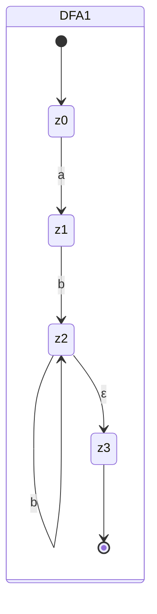
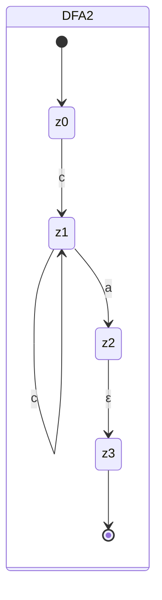

---
tags:
  - 4semester
  - FSK
  - informatik
fach: "[[Formale Sprachen und Komplexität (FSK)]]"
Thema:
Benötigte Zeit:
date created: Tuesday, 4. June 2024, 10:21
date modified: Friday, 14. June 2024, 12:13
---

# FSK7-1 Sprachen einordnen (2 Punkte)

> [!note] Aufgabenstellung
> Die formalen Sprachen $L_i$, $i \in \{0, \ldots, 3\}$, seien definiert als
>
> $$
> \begin{aligned}
> L_0 & := \{ab^i \mid i \in \mathbb{N}\} \cup \{c^{i}a \mid i \in \mathbb{N}\}
> \subseteq \{a,b,c\}^* \\
> L_1 & := \{w\$ \mid \#_a(w) < \#_b(w) + \#_c(w)\} \subseteq \{a,b,c,\$\}^* \\
> L_2 & := \{(ab)^j\$c^i \mid i, j \in \mathbb{N}\} \subseteq \{a,b,c,\$\}^* \\
> L_3 & := \{(ab)^i\$\ c^j\$(ab)^{i} \mid j < i \ und \ i, j \in \mathbb{N}\} \subseteq \{a,b,c,\$\}^*
> \end{aligned}
> $$
>
> Für die $i$-fache Wiederholung des Worts $w$ schreiben wir manchmal $(w)^i$ statt nur $w^i$, um Anfang und Ende von $w$ zu markieren. Die Klammern sind daher **nicht** Teil des Alphabets der jeweiligen Sprachen.
>
> Bearbeiten Sie die folgenden Arbeitsaufträge für jede der Sprachen $L_i$.

## a) Beweisen oder widerlegen Sie, dass $L_i$ regulär ist.

Aus dem Bauchgefühl raus:
Nicht regulär L1 wegen der #

### $L_0$

- Regulär, da man es in einem [[Reguläre Ausdrücke|RegEx]] darstellen kann
  $$
  L_0=L(ab^{*}\mid c^{*}a)
  $$

### $L_1$

[[Pumping-Lemma]]

#### Gegeben:

$$
L_1  := \{w\$ \mid \#_a(w) \lt \#_b(w) + \#_{c(w)\}}\subseteq \{a,b,c,\$\}^*
$$

#### Gesucht:

- Wort in der Sprache $L_1$, dass das Pumping Lemma verletzt

#### Lösungsweg

- Angenommen, $L_1$ sei regulär. Dann existier eine Pumping-Länge $p$

$$
\text{Wort w} \in L_{1}, \ |w| \geq p
$$

$$
w = a^{p}b^{p+1}\$
$$

- Das Wort ist in der Sprache enthalten, da $b$ genau einmal öfter drankommt als $a$. Das $c$ kann außenvor gelassen werden, da $b^{p+1}$ alleine schon die Bedingung für die Sprache erfüllt

$$
\begin{aligned}
\#_{a}(w)&=p\\
\#_{b}(w)&=p+1\\
\#_{c}(w)&=0\\
\#_{a}(w) \lt \#_{b}(w) + \#_{c}(w) &\Rightarrow p \lt (p+1) + 0
\end{aligned}
$$

**Pumping - xyz bestimmen**

$$
w =xyz : |xy|\leq p \ , \ |y| \gt0
$$

- Für $y$ wähle $a^p$,da gilt $|xy| \leq p$ sodass gilt:
  $$
  y=a^{k}: k \gt 0
  $$
- Der $x$ Teil besteht dann aus den restlichen $a$'s vor $y$
  $$
  x = a^{p-k}
  $$
- sodass:
  $$
  xy=a^{p-k}a^{k}
  $$
- $z$ ist nun der ganze Rest
  $$
  b^{p+1}\$
  $$

**Pumping - y aufpumpen**

$$
\begin{aligned}
w' &=xy^{2}z \\
&= (a^{p-k})(a^{k})^{2}(b^{p+1}\$) \\
&= (a^{p-k})(a^{k}a^{k})(b^{p+1}\$) \\
&= (a^{p-k})(a^{k}a^{k})(b^{p+1}\$) \\
&=(\frac{a^{p}}{a^{k}})(a^{k}a^{k})(b^{p+1}\$) \\
&=(a^{p})(a^{k})(b^{p+1}\$) \\
&=(a^{p+k})(b^{p+1}\$) \\
\end{aligned}
$$

$$
\begin{aligned}
\#_{a}(w)&=p+k\\
\#_{b}(w)&=p+1\\
\#_{c}(w)&=0\\
\#_{a}(w) \lt \#_{b}(w) + \#_{c}(w) &\Rightarrow p \lt (p+1) + 0
\end{aligned}
$$

- Da $k\gt 0$ ist $p+k \geq p+1$, was bedeutet, dass die Bedingung
  $$
  \#_{a}(w) \lt \#_{b}(w) + \#_{c}(w) \Rightarrow p \lt (p+1) + 0
  $$
  nicht erfüllt ist.

**$\Longrightarrow$ Daher liegt das gepumpte Wort $w'$ nicht in der Sprache $L_1$ und es ist gezeigt, dass die Sprache nicht regulär ist, da sie nicht die Bedingung des Pumping Lemmas erfüllt**

### $L_2$

- Regulär, da man es in einem [[Reguläre Ausdrücke|RegEx]] darstellen kann
  $$
  L_{2}=((ab)^*\$c^{*})
  $$

### $L_3$

[[Pumping-Lemma]]

#### Gegeben:

$$
L_3  := \{(ab)^i\$\ c^j\$(ab)^{i} \mid j < i \ und \ i, j \in \mathbb{N}\} \subseteq \{a,b,c,\$\}^*
$$

#### Gesucht:

- Wort in der Sprache $L_3$, dass das Pumping Lemma verletzt

#### Lösungsweg

- Angenommen, $L_3$ sei regulär. Dann existier eine Pumping-Länge $p$

$$
\text{Wort w} \in L_{3}, \ |w| \geq p
$$

$$
w = (ab)^p\$\ c^{p-1}\$(ab)^{p}
$$

- Das Wort ist in der Sprache enthalten, da die Bedingung $j \lt i$ erfüllt wird, da: $p-1\lt p$

**Pumping - xyz bestimmen**

$$
w =xyz : |xy|\leq p \ , \ |y| \gt0
$$

- Für $y$ wähle $(ab)^k$,da gilt $|xy| \leq p$ sodass gilt:
  $$
  y=(ab)^{k}
  $$
  $$
  x = (ab)^{p-k}
  $$
  $$
  z=\$c^{p-1}(ab)^{p}\$
  $$
  $$
  x,y,z :\  k \gt0
  $$
  **Pumping - y aufpumpen**

$$
\begin{aligned}
w' &=xy^{2}z \\
&= (ab)^{p-k}{(ab)^{k}}^{2}\$ c^{p-1}\$(ab)^{p}  \\
&= (ab)^{p-k}{(ab)^{k}} {(ab)^{k}}\$ c^{p-1}\$(ab)^{p} \\
&= (ab)^{p+k}\$ c^{p-1}\$(ab)^{p} \\
\end{aligned}
$$

Da $p+k \gt p$, hat das gepumpte Wort mehr als $p$ `ab`-Paare im ersten Teil. Dies bedeutet, dass die `ab`-Teile am Anfang und am Ende des wortes nicht mehr die gleiche Anzahl haben

**$\Longrightarrow$ Daher liegt das gepumpte Wort $w'$ nicht in der Sprache $L_3$ und es ist gezeigt, dass die Sprache nicht regulär ist, da sie nicht die Bedingung des Pumping Lemmas erfüllt**

## b) Beweisen oder widerlegen Sie, dass $L_i$ deterministisch kontextfrei ist. ([[Deterministisch Kontextfreie Sprachen und Kontextfreie Sprachen]])

### $L_{0}$

$$
\{ab^i \mid i \in \mathbb{N}\} \cup \{c^{i}a \mid i \in \mathbb{N}\}
>\subseteq \{a,b,c\}^*
$$

- Teilmenge $\{ab^i \mid i \in \mathbb{N}\}$ ist durch DPDA darstellbar

- Teilmenge $\{c^{i}a \mid i \in \mathbb{N}\}$ ist durch DPDA darstellbar

$\Longrightarrow$ Zudem auch regulär. Deswegen ist $L_0$ deterministisch kontextfrei.

### $L_{1}$

**Widerlegung, dass $L_1$ deterministisch kontextfrei ist:**

- Nehmen wir an $L_1$ sei deterministisch kontextfrei.
- Dann gibt es eine Pumping-Länge $p$.
- Wähle das Wort $w = a^{p}b^{p+1}\$$.
  - $w \in L_1$, da $\#_{a}(w) = p < \#_{b}(w) = p+1$.
- Zerlege $w$ in $uvxyz$, wobei $|vxy|\leq p$, $|vy| \geq 1$ und $\text{für alle } k \geq 0$ ist $uv^{k}xy^{k}z \in L_1$.
- Da $|vxy| \leq p$ und $v$ sowie $y$ nicht leer sein dürfen ($|vy| \geq 1$), muss $vxy$ vollständig innerhalb der ersten $p$ Zeichen von $w$ liegen, die nur 'a's enthalten. Das bedeutet, dass $v$ und $y$ ausschließlich aus 'a's bestehen.

- Pumpe $v$ und $y$: Betrachte das Wort $w' = uv^2xy^2z$.
  - $w' = a^i a^{2j} a^k a^{2l} a^{p-i-j-k-l} b^{p+1}\$ = a^{p+j+l} b^{p+1}\$$.

Nun enthält $w'$ mehr 'a's als 'b's, was bedeutet, dass $w' \notin L_1$ ist, da $\#_a(w') = p + j + l \geq p + 1 > p + 1 = \#_b(w') + \#_c(w')$.

$\Longrightarrow$ Dies widerspricht der Annahme, dass $L_1$ deterministisch kontextfrei ist. Daher ist $L_1$ nicht deterministisch kontextfrei.

### Zusammenfassung

1. Angenommen, $L_1$ ist kontextfrei.
2. Es gibt eine Pumping-Länge $p$.
3. Wähle $w = a^p b^{p+1}\$ \in L_1$.
4. Zerlege $w$ in $uvxyz$ mit den Bedingungen des Pumping Lemmas.
5. Da $|vxy| \leq p$, bestehen $v$ und $y$ nur aus 'a's.
6. Pumpe $v$ und $y$ und erhalte ein Wort $w'$, das mehr 'a's als 'b's hat.
7. Dies führt zu einem Widerspruch, da $w' \notin L_1$ ist.

Daher ist $L_1$ nicht kontextfrei.

### $L_2$

- Ist eine reguläre Sprache und damit auch deterministisch kontextfrei, da reguläre Sprachen eine Unterklasse der deterministisch kontextfreien Sprachen sind

### $L_3$

$$
L_3 := \{(ab)^i\$c^j\$(ab)^i \mid j < i \ und \ i, j \in \mathbb{N}\} \subseteq \{a,b,c,\$\}^*
$$

**Widerlegung, dass $L_3$ deterministisch kontextfrei ist:**

- Nehmen wir an, $L_3$ sei deterministisch kontextfrei.
- Dann gibt es eine Pumping-Länge $p$.
- Wähle das Wort $w = (ab)^p\$c^{p-1}\$(ab)^p$.
  - $w \in L_3$, da $j = p-1 < i = p$.
- Zerlege $w$ in $uvxyz$, wobei $|vxy|\leq p$, $|vy| \geq 1$ und für alle $k \geq 0$ ist $uv^kxy^kz \in L_3$.
- Da $|vxy| \leq p$, liegt $vxy$ vollständig im ersten Teil $(ab)^p$.
  - Dies bedeutet, dass $v$ und $y$ ausschließlich aus 'a' und 'b' bestehen.

Nun betrachten wir das gepumpte Wort $w' = uv^2xy^2z$:

- Da $v$ und $y$ ausschließlich aus 'a' und 'b' bestehen und $|vxy| \leq p$, führen wir das Pumpen innerhalb des ersten Teils $(ab)^p$ durch.
- Dies führt dazu, dass der gepumpte Teil mehr 'ab'-Paare hat als der Rest des Wortes.
- Das resultierende Wort $w' = (ab)^{p+k}\$c^{p-1}\$(ab)^p$ für $k \geq 1$ enthält mehr 'ab'-Paare im ersten Segment als im zweiten, was bedeutet, dass $w' \notin L_3$ ist.

#### Detaillierte Zerlegung

1. **Annahme**: $L_3$ sei deterministisch kontextfrei.
2. **Wahl des Wortes**: Wähle das Wort $w = (ab)^p\$c^{p-1}\$(ab)^p \in L_3$.
3. **Zerlegung**: Zerlege $w$ in $uvxyz$, wobei:

   - $|vxy| \leq p$,
   - $|vy| \geq 1$.

4. Da $|vxy| \leq p$, muss $vxy$ innerhalb des ersten Teils $(ab)^p$ liegen.

   - Dies bedeutet, dass $v$ und $y$ ausschließlich aus 'a' und 'b' bestehen.
   - Sei $u = (ab)^i$, $v = (ab)^j$, $x = (ab)^k$, $y = (ab)^l$, $z = (ab)^{p-i-j-k-l}\$c^{p-1}\$(ab)^p$ für einige $i, j, k, l \geq 0$, wobei $j + k + l \leq p$ und $j + l \geq 1$.

5. **Pumpen**: Betrachte das Wort $w' = uv^2xy^2z$:

   - $w' = (ab)^i (ab)^{2j} (ab)^k (ab)^{2l} (ab)^{p-i-j-k-l}\$c^{p-1}\$(ab)^p = (ab)^{p+j+l}\$c^{p-1}\$(ab)^p$

6. **Widerspruch**: Das gepumpte Wort $w'$ hat mehr 'ab'-Paare im ersten Segment als im zweiten, was gegen die Struktur von $L_3$ verstößt, da $j < i$ nicht mehr erfüllt ist.

$\Longrightarrow$ Dies widerspricht der Annahme, dass $L_3$ deterministisch kontextfrei ist. Daher ist $L_3$ nicht deterministisch kontextfrei.

#### Zusammenfassung

1. Angenommen, $L_3$ ist deterministisch kontextfrei.
2. Es gibt eine Pumping-Länge $p$.
3. Wähle $w = (ab)^p\$c^{p-1}\$(ab)^p \in L_3$.
4. Zerlege $w$ in $uvxyz$ mit den Bedingungen des Pumping Lemmas.
5. Da $|vxy| \leq p$, bestehen $v$ und $y$ nur aus 'a's und 'b's.
6. Pumpe $v$ und $y$ und erhalte ein Wort $w'$, das die Struktur von $L_3$ verletzt.
7. Dies führt zu einem Widerspruch, da $w' \notin L_3$ ist.
   Daher ist $L_3$ nicht deterministisch kontextfrei.

## c) Beweisen oder widerlegen Sie, dass $L_i$ kontextfrei ist. ([[Deterministisch Kontextfreie Sprachen und Kontextfreie Sprachen]])

> [!info] Hinweis:
> N Nutzen Sie, dass manche Aussagen direkt aus anderen Aussagen folgen. Um zu beweisen, dass $L_i$ regulär/deterministisch kontextfrei/kontextfrei ist, genügt es, ein geeignetes Konstrukt $K_i$ (Grammatik, Automat oder regulärer Ausdruck) anzugeben und kurz zu begründen, warum $L(K_i) = L_i$ gilt.

Ihre vorgeschlagenen Produktionsregeln für \(L_0\) sehen gut aus und entsprechen der Struktur der Sprache \(L_0\). Hier ist die vollständige Darstellung:

### $L_0$

$$
L_0 := \{ab^i \mid i \in \mathbb{N}\} \cup \{c^i a \mid i \in \mathbb{N}\} \subseteq \{a,b,c\}^*
$$

**Beweis, dass $L_0$ kontextfrei ist:**

Um zu beweisen, dass $L_0$ kontextfrei ist, konstruieren wir eine kontextfreie Grammatik (CFG), die $L_0$ erzeugt.

1. **Grammatik:**

   - Variablen: $S, B, C$
   - Terminale: $a, b, c$
   - Startsymbol: $S$
   - Produktionsregeln:
     - $S \rightarrow aB \mid aC \mid aa$
     - $B \rightarrow bB \mid bC$
     - $C \rightarrow cC \mid a$

2. **Erklärung:**
   - Die Regel $S \rightarrow aB \mid aC \mid aa$ erlaubt es, entweder mit einem 'a' zu beginnen und dann entweder in den 'b'- oder 'c'-Teil der Sprache zu wechseln, oder direkt mit 'aa' zu enden.
   - Die Regel $B \rightarrow bB \mid bC$ erzeugt die Folge von 'b's nach dem anfänglichen 'a', wobei sie entweder zu weiteren 'b's oder zu 'c's führt.
   - Die Regel $C \rightarrow cC \mid a$ erzeugt die Folge von 'c's gefolgt von einem abschließenden 'a'.

### $L_1$

$$
L_1 := \{w\$ \mid \#_a(w) < \#_b(w) + \#_c(w)\} \subseteq \{a,b,c,\$\}^*
$$

**Widerlegung, dass $L_1$ kontextfrei ist:**

- Nehmen wir an, $L_1$ sei kontextfrei.
- Dann gibt es eine Pumping-Länge $p$.
- Wähle das Wort $w = a^p b^{p+1}\$ \in L_1$, da $\#_a(w) = p < \#_b(w) = p+1$.
- Zerlege $w$ in $uvxyz$ gemäß dem Pumping Lemma für kontextfreie Sprachen, wobei $|vxy| \leq p$, $|vy| \geq 1$ und $uv^kxy^kz \in L_1$ für alle $k \geq 0$.
- Da $|vxy| \leq p$, muss $vxy$ innerhalb der ersten $p$ Zeichen von $w$ liegen, die nur 'a's enthalten. Somit besteht $v$ und $y$ ausschließlich aus 'a's.

Pumpe $y$: Betrachte das Wort $w' = uv^2xy^2z$:

- $w' = a^{p+k} b^{p+1}\$$ für $k \geq 1$.
- Nun enthält $w'$ mehr 'a's als 'b's, was bedeutet, dass $w' \notin L_1$ ist, da $\#_a(w') \geq \#_b(w')$.

Dies widerspricht der Annahme, dass $L_1$ kontextfrei ist. Daher ist $L_1$ nicht kontextfrei.

### $L_2$

$$
L_2 := \{(ab)^j\$c^i \mid i, j \in \mathbb{N}\} \subseteq \{a,b,c,\$\}^*
$$

**Beweis, dass $L_2$ kontextfrei ist:**

$L_2$ ist regulär, daher auch kontextfrei. Wir konstruieren einen deterministischen endlichen Automaten (DFA), der $L_2$ erkennt, und beschreiben ihn mit einem regulären Ausdruck:

1. **Regulärer Ausdruck:** $(ab)^*\$c^*\$$

### $L_3$

$$
L_3 := \{(ab)^i\$c^j\$(ab)^i \mid j < i \ und \ i, j \in \mathbb{N}\} \subseteq \{a,b,c,\$\}^*
$$

**Widerlegung, dass $L_3$ kontextfrei ist:**

- Nehmen wir an, $L_3$ sei kontextfrei.
- Dann gibt es eine Pumping-Länge $p$.
- Wähle das Wort $w = (ab)^p\$c^{p-1}\$(ab)^p \in L_3$, da $j = p-1 < i = p$.
- Zerlege $w$ in $uvxyz$, wobei $|vxy|\leq p$, $|vy| \geq 1$ und für alle $k \geq 0$ ist $uv^kxy^kz \in L_3$.
- Da $|vxy| \leq p$, liegt $vxy$ vollständig im ersten Teil $(ab)^p$ und besteht nur aus 'a' und 'b'.

Pumpe $y$: Betrachte das Wort $w' = uv^2xy^2z$:

- $w' = (ab)^{p+k}\$c^{p-1}\$(ab)^p$ für $k \geq 1$.
- Nun hat $w'$ mehr 'ab'-Paare im ersten Teil als im letzten Teil, was gegen die Struktur von $L_3$ verstößt, da $j < i$ nicht mehr erfüllt ist.

Dies widerspricht der Annahme, dass $L_3$ kontextfrei ist. Daher ist $L_3$ nicht kontextfrei.

### Zusammenfassung

- $L_0$ ist kontextfrei, da regulär und eine kontextfreie Grammatik angegeben wurde.
- $L_1$ ist nicht kontextfrei, wie durch das Pumping Lemma gezeigt wurde.
- $L_2$ ist regulär und daher kontextfrei.
- $L_3$ ist nicht kontextfrei, wie durch das Pumping Lemma gezeigt wurde.

---

# FSK7-2 Turingmaschinen verstehen (0 Punkte)

> [!note] Aufgabenstellung
> Die folgende DTM $M$ ist als Zustandsgraph gegeben, wobei $\Sigma = \{a, b, c\}$,
> $\Gamma = \Sigma \cup \{\#_a, \#_b, \#_c, \square\}$ und $\square$ das Blank-Symbol
> ist.

> [!info] Bild aus Blatt entnehmen

## a) Geben Sie Läufe der Turingmaschine (Übergänge von der Startkonfiguration bis zur Endkonfiguration) für die Wörter $\varepsilon$, abcc und abc an.

### Lauf für $\varepsilon$ (das leere Wort):

1. Start im Zustand $z_0$.
2. Übergang von $z_0$ nach $z_4$ durch den Übergang $\#_b: \#_b, R$.
3. Zustand $z_4$ hat einen Selbstübergang mit $\#_b: \#_b, R$, dieser findet jedoch keine weiteren Zeichen.
4. Übergehen nach $z_5$ durch $\Box: \Box, L$.
5. Von $z_5$ nach $z_e$ durch $\Box: \Box, R$.
6. Endkonfiguration: Erreicht $z_e$.

### Lauf für das Wort "abcc":

1. **Start im Zustand $z_0$**:

   - $\text{Lesen von } a$: Übergang von $z_0$ nach $z_1$ mit $a: \#_a, R$.
   - Band: $\#_a bcc$

2. **Lesen von 'b' in $z_1$**:

   - Übergang: $b: b, R$.
   - Wir bleiben in $z_1$ und lesen das 'b'.
   - Band: $\#_a bcc$

3. **Lesen von 'b' in $z_1$**:

   - Übergang: $b: \#_b, R$.
   - Wir gehen von $z_1$ nach $z_2$ und ersetzen 'b' durch $\#_b$.
   - Band: $\#_a \#_b cc$

4. **Lesen von 'c' in $z_2$**:

   - Übergang: $c: \#_c, R$.
   - Wir gehen von $z_2$ nach $z_3$ und ersetzen 'c' durch $\#_c$.
   - Band: $\#_a \#_b \#_c c$

5. **Lesen von 'c' in $z_3$**:

   - Übergang: $c: c, L$.
   - Wir bleiben in $z_3$ und lesen das 'c'.
   - Band: $\#_a \#_b \#_c c$

6. **Lesen von $\#_c$ in $z_3$**:

   - Übergang: $\#_c: \#_c, L$.
   - Wir gehen von $z_3$ nach $z_2$ und lesen das 'c'.
   - Band: $\#_a \#_b \#_c c$

7. **Lesen von 'c' in $z_2$**:

   - Übergang: $c: \#_c, R$.
   - Wir gehen von $z_2$ nach $z_3$ und ersetzen 'c' durch $\#_c$.
   - Band: $\#_a \#_b \#_c \#_c$

8. **Lesen von $\#_c$ in $z_3$**:
   - Übergang: $\#_c: \#_c, L$.
   - Wir bleiben in $z_3$ und lesen das '$\#_c$'.
   - Band: $\#_a \#_b \#_c \#_c$

Ergebnis: Die Turingmaschine befindet sich in einer Schleife, daher kommt sie in den Müllzustand $z_M$.

### Lauf für das Wort "abc":

1. **Start im Zustand $z_0$**:

   - $\text{Lesen von } a$: Übergang von $z_0$ nach $z_1$ mit $a: \#_a, R$.
   - Band: $\#_a bc$

2. **Lesen von 'b' in $z_1$**:

   - Übergang: $b: b, R$.
   - Wir bleiben in $z_1$ und lesen das 'b'.
   - Band: $\#_a bc$

3. **Lesen von 'b' in $z_1$**:

   - Übergang: $b: \#_b, R$.
   - Wir gehen von $z_1$ nach $z_2$ und ersetzen 'b' durch $\#_b$.
   - Band: $\#_a \#_b c$

4. **Lesen von 'c' in $z_2$**:

   - Übergang: $c: \#_c, R$.
   - Wir gehen von $z_2$ nach $z_3$ und ersetzen 'c' durch $\#_c$.
   - Band: $\#_a \#_b \#_c$

5. **Lesen von $\Box$ in $z_3$**:

   - Übergang: $\Box: \Box, L$.
   - Wir gehen von $z_3$ nach $z_5$.
   - Band: $\#_a \#_b \#_c \Box$

6. **Lesen von $\#_c$ in $z_5$**:

   - Übergang: $\#_c: \#_c, L$.
   - Wir bleiben in $z_5$ und lesen das $\#_c$.
   - Band: $\#_a \#_b \#_c \Box$

7. **Lesen von $\#_b$ in $z_5$**:

   - Übergang: $\#_b: \#_b, L$.
   - Wir bleiben in $z_5$ und lesen das $\#_b$.
   - Band: $\#_a \#_b \#_c \Box$

8. **Lesen von $\#_a$ in $z_5$**:

   - Übergang: $\#_a: \#_a, L$.
   - Wir bleiben in $z_5$ und lesen das $\#_a$.
   - Band: $\#_a \#_b \#_c \Box$

9. **Lesen von $\Box$ in $z_5$**:
   - Übergang: $\Box: \Box, R$.
   - Wir gehen von $z_5$ nach $z_e$.
   - Band: $\#_a \#_b \#_c \Box$

Endkonfiguration: Erreicht $z_e$.

## b) Welche Sprache akzeptiert die Turingmaschine $M$? Begründen Sie Ihre Antwort.

## Lösung

Die Turingmaschine $M$ akzeptiert die Sprache $L = \{ a^n b^n c^n \mid n \geq 0 \}$.

### Begründung:

1. **Startzustand $z_0$**:

   - Markiert jedes 'a' mit $\#_a$ und wechselt zu $z_1$.

2. **Zustand $z_1$**:

   - Markiert jedes 'b' mit $\#_b$ und wechselt zu $z_2$.

3. **Zustand $z_2$**:

   - Markiert jedes 'c' mit $\#_c$ und wechselt zu $z_3$.

4. **Zustand $z_3$**:

   - Bewegt sich nach links zum nächsten $\#_a$ und wechselt zu $z_4$.

5. **Zustand $z_4$**:

   - Bewegt sich nach rechts, um weitere unmarkierte 'a', 'b' und 'c' zu finden und zu markieren.

6. **Zustand $z_5$**:

   - Bewegt sich nach links und wechselt zu $z_e$, wenn es ein leeres Feld findet.

7. **Endzustand $z_e$**:

   - Akzeptiert die Eingabe, wenn alle 'a', 'b' und 'c' markiert sind.

8. **Müllzustand $z_M$**:
   - Lehnt die Eingabe ab, wenn sie nicht der Form $a^n b^n c^n$ entspricht.

## c) Die obige Turingmaschine $M$ mit Alphabet $\Sigma$ und Bandalphabet $\Gamma$ berechnet eine (partielle) Funktion $f : \Sigma^* \rightarrow \Gamma^*$, wenn für alle $u \in \Sigma^*$ und $v \in \Gamma^*$ gilt: $f(u) = v$ g.d.w. $z_0 u \vdash^* z_e \square v \square \cdots \square$ mit $z_e$ Endzustand. (Beachten Sie: Diese Definition weicht leicht von der aus der Vorlesung ab, weil die Wertemenge von $f$ nicht $\Sigma^*$ ist, sondern $\Gamma^*$.)

### Welche Funktion berechnet $M$?

Die Turingmaschine $M$ berechnet die Funktion $f : \Sigma^* \rightarrow \Gamma^*$, die ein Eingabewort der Form $a^n b^n c^n$ in ein markiertes Wort umwandelt.

#### Definition der Funktion $f$:

Für eine Eingabe $u \in \Sigma^*$ gilt:

- $u = a^n b^n c^n$
- $f(a^n b^n c^n) = \#_a^n \#_b^n \#_c^n$

#### Funktionsweise:

1. Die Turingmaschine beginnt im Zustand $z_0$ und markiert jedes 'a' mit $\#_a$, wechselt zu $z_1$.
2. In $z_1$ markiert sie jedes 'b' mit $\#_b$, wechselt zu $z_2$.
3. In $z_2$ markiert sie jedes 'c' mit $\#_c$, wechselt zu $z_3$.
4. Die Maschine bewegt sich zurück, überprüft und markiert weitere Symbole, falls vorhanden.
5. Wenn alle Symbole markiert sind, wechselt sie zu $z_e$ und akzeptiert die Eingabe.

#### Beispiel:

Für die Eingabe $u = aabcc$:

- Das markierte Ergebnis wäre $v = \#_a \#_a \#_b \#_b \#_c \#_c$

#### Zusammenfassung:

Die Turingmaschine $M$ markiert die Symbole 'a', 'b', und 'c' der Eingabe und transformiert sie gemäß der Funktion $f(u) = \#_a^n \#_b^n \#_c^n$.

## d) Bestimmen Sie asymptotisch, also in O-Notation, die Anzahl der Schritte (abhängig von $n$), die die Turingmaschine braucht, um das Wort $w = a^n b^n c^n$ zu erkennen.

Die Maschine beginnt im Startzustand $z_0$ und markiert jedes 'a' mit $\#_a$. Dieser Prozess dauert $O(n)$ Schritte. Anschließend bewegt sich die Maschine im Zustand $z_1$ weiter nach rechts und markiert jedes 'b' mit $\#_b$, was ebenfalls $O(n)$ Schritte dauert. Danach, im Zustand $z_2$, markiert die Maschine jedes 'c' mit $\#_c$ und kehrt schließlich im Zustand $z_3$ zum Anfang des Bandes zurück, was erneut $O(n)$ Schritte benötigt.

Diese Markierungsschritte und die Rückkehr zum Anfang wiederholen sich, bis alle 'a', 'b' und 'c' markiert sind. Da diese Prozesse für jedes der $n$ Zeichen wiederholt werden, ergibt sich die Gesamtzahl der Schritte zu $O(n) \times n = O(n^2)$.

Zusammengefasst benötigt die Turingmaschine $M$ also $O(n^2)$ Schritte, um das Wort $w = a^n b^n c^n$ zu erkennen.

---

# FSK7-4 Konstruktion Grammatik zu PDA (0 Punkte)

> [!note] Aufgabenstellung
> Sei $G = (V, \{a, b\}, P, S)$ eine Grammatik in Greibach-Normalform mit Produktionen
>
> $P = \{S \rightarrow aBCD, B \rightarrow bB \mid bC, C \rightarrow cCD \mid cD, D \rightarrow d\}$

## a) Erzeugen Sie gemäß der Konstruktion aus der Vorlesung aus $G$ einen PDA $M$ mit $L(M) = L(G)$, der mit leerem Keller akzeptiert.

Der Pushdown-Automat (PDA) $M = (Q, \Sigma, \Gamma, \delta, q_0, Z_0, F)$, der mit leerem Keller akzeptiert, wird wie folgt konstruiert:

- Zustände: $Q = \{q_0, q_1, q_2\}$
- Eingabealphabet: $\Sigma = \{a, b, c, d\}$
- Kelleralphabet: $\Gamma = \{S, A, B, C, D\}$
- Startzustand: $q_0$
- Startsymbol: $Z_0 = S$
- Akzeptierender Zustand: $F = \{q_2\}$

Übergangsfunktionen $\delta$:

1. $\delta(q_0, \epsilon, S) = \{(q_1, aBCD)\}$
2. $\delta(q_1, a, \epsilon) = \{(q_1, \epsilon)\}$
3. $\delta(q_1, b, B) = \{(q_1, bB), (q_1, bC)\}$
4. $\delta(q_1, c, C) = \{(q_1, cCD), (q_1, cD)\}$
5. $\delta(q_1, d, D) = \{(q_1, \epsilon)\}$
6. $\delta(q_1, \epsilon, \epsilon) = \{(q_2, \epsilon)\}$

## b) Erzeugen Sie gemäß der sogenannten Tripelkonstruktion aus der Vorlesung aus $M$ eine kontextfreie Grammatik $H$ mit $L(H) = L(M)$.

Die kontextfreie Grammatik $H = (V', \Sigma, P', S')$ wird aus dem PDA $M$ wie folgt konstruiert:

- Nichtterminale: $V' = \{[q_0Xq_1], [q_1Xq_1], [q_1Xq_2], \ldots\}$ für $X \in \Gamma$
- Terminale: $\Sigma = \{a, b, c, d\}$
- Startsymbol: $S' = [q_0Sq_2]$

Produktionen $P'$:

1. $[q_0Sq_1] \rightarrow a[q_1Bq_1][q_1Cq_1][q_1Dq_1]$
2. $[q_1Bq_1] \rightarrow b[q_1Bq_1] \mid b[q_1Cq_1]$
3. $[q_1Cq_1] \rightarrow c[q_1Cq_1][q_1Dq_1] \mid c[q_1Dq_1]$
4. $[q_1Dq_1] \rightarrow d$
5. $[q_1\epsilon q_2] \rightarrow \epsilon$

## c) Vergleichen Sie die Grammatiken $G$ und $H$. Beschreiben Sie die Gemeinsamkeiten dieser Grammatiken, sowie ihre Unterschiede.

### Gemeinsamkeiten:

- Beide Grammatiken $G$ und $H$ erzeugen die gleiche Sprache $L(G) = L(H)$.
- Beide sind kontextfreie Grammatiken.

### Unterschiede:

- Grammatik $G$ ist direkt in Greibach-Normalform, während $H$ durch eine Tripelkonstruktion aus einem PDA abgeleitet ist.
- Die Produktionsregeln von $G$ sind einfacher und direkter, während die von $H$ komplexere Strukturen und Zwischenzustände enthalten.
- $H$ verwendet Tripel von Zuständen für die Nichtterminale, um die Übergänge des PDA zu modellieren, was in $G$ nicht nötig ist.

---

# FSK7-3 Turingmaschinen erstellen (2 Punkte)

> [!note] Aufgabenstellung
> Wir betrachten die Sprache $L = \{ w \mid \#_b(w) > \#_c(w) \}$ über dem Alphabet $\{b, c\}$.

## a) Erstellen Sie auf [https://turingmachinesimulator.com](https://turingmachinesimulator.com) eine TM, der L erkennt. Geben Sie sowohl einen Link zur Maschine an als auch den "Programmtext" der Maschine.

## b) Geben Sie für Ihre TM aus Teilaufgabe a) einen Zustandsgraphen an.

## c) Geben Sie die Läufe der folgenden Wörter auf Ihre TM aus Teilaufgabe a) an: $\varepsilon$, $c$, $bcc$, $cbcb$.

> **Hinweis:** Wörter, die nicht in $L$ liegen, erzeugen eventuell unendliche Läufe. Geben Sie in solchen Fällen ein Präfix an, aus dem ersichtlich wird, dass der Lauf unendlich ist.

<!-- Modal START -->

  

    &times;
    

      If MyUniNotes has been helpful and you’d like to support my efforts,  you can contribute with a donation: <a class="modal-dono-link" href="https://paypal.me/myuninotes4u">Donate via PayPal</a> :)  Your support will help me continue improving the content, but there is no obligation to donate.
    

    

      MyUniNotes is a personal, non-revenue project as I believe in accessible education for everyone. I manage this project alongside my studies, with all materials handwritten by me trying to help others understand challenging concepts.
    

  

<!-- Modal END -->

<!-- DISQUS SCRIPT COMMENT START -->

<!-- DISQUS RECOMMENDATION START -->

<noscript>
Please enable JavaScript to view the 
<a href="https://disqus.com/?ref_noscript" rel="nofollow">
comments powered by Disqus.
</a>
</noscript>

<!-- DISQUS RECOMMENDATION END -->

<noscript>Please enable JavaScript to view the <a href="https://disqus.com/?ref_noscript">comments powered by Disqus.</a></noscript>

<!-- DISQUS SCRIPT COMMENT END -->

<!-- Modal START -->

  

    &times;
    

      If MyUniNotes has been helpful and you’d like to support my efforts,  you can contribute with a donation: <a class="modal-dono-link" href="https://paypal.me/myuninotes4u">Donate via PayPal</a> :)  Your support will help me continue improving the content, but there is no obligation to donate.
    

    

      MyUniNotes is a personal, non-revenue project as I believe in accessible education for everyone. I manage this project alongside my studies, with all materials handwritten by me trying to help others understand challenging concepts.
    

  

<!-- Modal END -->

<!-- Modal START -->

  

    &times;
    

      If MyUniNotes has been helpful and you’d like to support my efforts,  you can contribute with a donation: <a class="modal-dono-link" href="https://paypal.me/myuninotes4u">Donate via PayPal</a> :)  Your support will help me continue improving the content, but there is no obligation to donate.
    

    

      MyUniNotes is a personal, non-revenue project as I believe in accessible education for everyone. I manage this project alongside my studies, with all materials handwritten by me trying to help others understand challenging concepts.
    

  

<!-- Modal END -->
