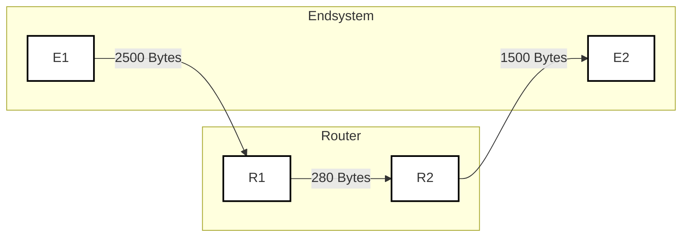
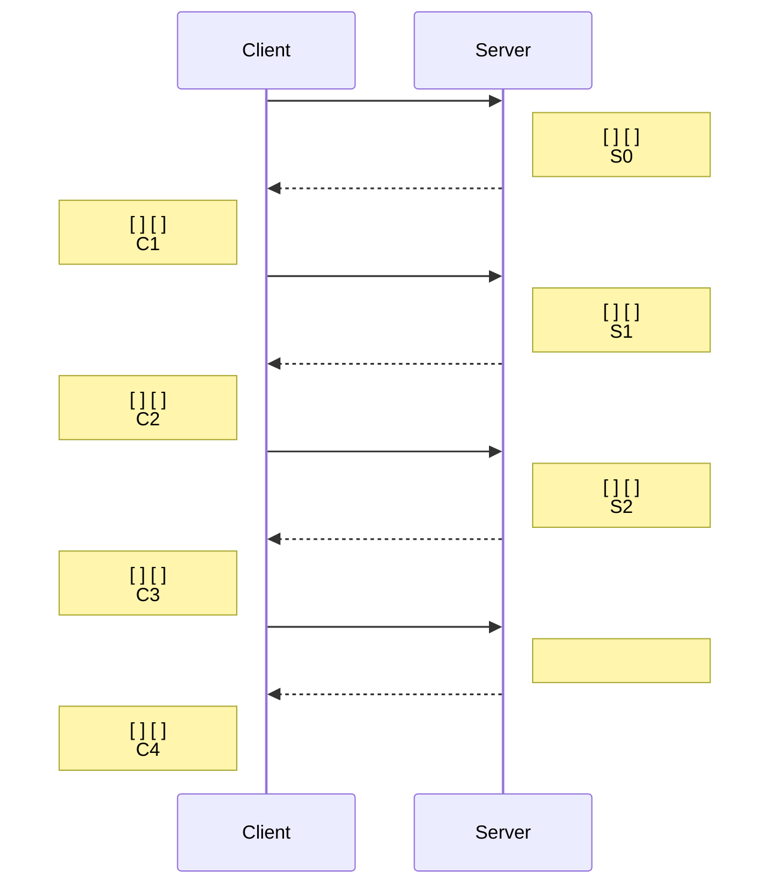

---
tags:
  - 4semester
  - informatik
  - RNVS
fach: "[[Rechnernetze und Verteilte Systeme (RNVS)]]"
Thema:
Benötigte Zeit:
date created: Monday, 22. July 2024, 17:54
date modified: Monday, 22. July 2024, 18:32
---

# Gedächtnisprotokoll der Klausur zur Vorlesung Rechnernetze

## 15.07.2015

### Notenschlüssel:

| Note | Punkte |
| ---- | ------ |
| 5.0  | 0      |
| 4.0  | 40     |
| 3.7  | 43     |
| 3.3  | 46     |
| 3.0  | 49     |
| 2.7  | 52     |
| 2.3  | 55     |
| 2.0  | 58     |
| 1.7  | 61     |
| 1.3  | 64     |
| 1.0  | 67     |

### Klausurstatistiken für Semestralklausur:

- Teilnehmer (bewertet): 311 (222)
- Durchschnittliche Punkte: 49.5
- Durchschnittliche Bonuspunkte: 0.0
- Durchschnittliche Note: 3.04

### Notenverteilung:

| Note | Ab Punkten | Häufigkeit |
| ---- | ---------- | ---------- |
| 5.0  | 0          | 40         |
| 4.0  | 40         | 22         |
| 3.7  | 43         | 16         |
| 3.3  | 46         | 18         |
| 3.0  | 49         | 19         |
| 2.7  | 52         | 28         |
| 2.3  | 55         | 14         |
| 2.0  | 58         | 20         |
| 1.7  | 61         | 19         |
| 1.3  | 64         | 18         |
| 1.0  | 67         | 8          |

### Hinweise:

- Jede falsche oder zu viel gegebene Antwort führt zu Punktabzug.
- ei den Mehrfachauswahl-Fragen können mehr als eine Antwort richtig sein.

# I. Multiple Choice

<Verschiedene Fragen zu ISO/OSI-Schichten, …>

## Hier sind einige Multiple-Choice-Fragen zum Thema ISO/OSI-Schichten:

### 1. Welche der folgenden Schichten gehört nicht zum OSI-Modell?

- a) Anwendungsschicht
- b) Transportschicht
- c) Steuerungsschicht
- d) Sicherungsschicht

### 2. Auf welcher Schicht des OSI-Modells wird Routing durchgeführt?

- a) Anwendungsschicht
- b) Transportschicht
- c) Netzwerkschicht
- d) Sicherungsschicht

### 3. Welche Protokolle gehören zur Transportschicht des OSI-Modells?

- a) TCP und UDP
- b) IP und ICMP
- c) HTTP und FTP
- d) Ethernet und PPP

### 4. Welche Schicht des OSI-Modells ist für die Datenverschlüsselung zuständig?

- a) Sitzungsschicht
- b) Präsentationsschicht
- c) Netzwerkschicht
- d) Anwendungsschicht

### 5. Welche der folgenden Funktionen wird von der Sicherungsschicht bereitgestellt?

- a) Pfadbestimmung und Routing
- b) Datenflusskontrolle und Fehlererkennung
- c) Datenkompression und Verschlüsselung
- d) Netzwerkzugriff und Datenübertragung

### 6. Auf welcher Schicht des OSI-Modells arbeitet ein Switch hauptsächlich?

- a) Physikalische Schicht
- b) Sicherungsschicht
- c) Netzwerkschicht
- d) Transportschicht

### 7. Welches der folgenden Protokolle arbeitet auf der Anwendungsschicht des OSI-Modells?

- a) FTP
- b) IP
- c) ARP
- d) PPP

### 8. Die Hauptaufgabe der Netzwerkschicht ist:

- a) Sicherstellung der fehlerfreien Datenübertragung
- b) Steuerung der logischen Pfade zwischen Sender und Empfänger
- c) Verwaltung von Netzwerkverbindungen
- d) Übersetzung von Daten in ein standardisiertes Format

### 9. Welche der folgenden Aussagen zur Präsentationsschicht ist korrekt?

- a) Sie ist für die physikalische Übertragung der Daten zuständig.
- b) Sie stellt sicher, dass die Daten in einem anwendungsgerechten Format vorliegen.
- c) Sie übernimmt die Datenflusskontrolle zwischen Endgeräten.
- d) Sie ist für das Routing von Datenpaketen verantwortlich.

### 10. Welches Gerät arbeitet typischerweise auf der physikalischen Schicht des OSI-Modells?

- a) Router
- b) Switch
- c) Hub
- d) Firewall

> [!success]- Lösung
>
> 1. **c) Steuerungsschicht**
>    - Erklärung: Die Steuerungsschicht ist keine der sieben Schichten des OSI-Modells. Die sieben Schichten sind: Anwendungsschicht, Präsentationsschicht, Sitzungsschicht, Transportschicht, Netzwerkschicht, Sicherungsschicht und physikalische Schicht.
> 2. **c) Netzwerkschicht**
>    - Erklärung: Routing ist die Hauptaufgabe der Netzwerkschicht. Diese Schicht bestimmt den besten Pfad für Datenpakete durch das Netzwerk.
> 3. **a) TCP und UDP**
>    - Erklärung: TCP (Transmission Control Protocol) und UDP (User Datagram Protocol) sind Protokolle der Transportschicht, die für die Datenübertragung zwischen Hosts zuständig sind.
> 4. **b) Präsentationsschicht**
>    - Erklärung: Die Präsentationsschicht ist für die Datenverschlüsselung und -dechiffrierung verantwortlich, um eine sichere Übertragung zu gewährleisten.
> 5. **b) Datenflusskontrolle und Fehlererkennung**
>    - Erklärung: Die Sicherungsschicht stellt sicher, dass die Daten ohne Fehler übertragen werden, indem sie Fehler erkennt und korrigiert. Sie kümmert sich auch um die Datenflusskontrolle.
> 6. **b) Sicherungsschicht**
>    - Erklärung: Ein Switch arbeitet hauptsächlich auf der Sicherungsschicht des OSI-Modells. Er verwendet MAC-Adressen, um Datenrahmen an die richtigen Geräte im lokalen Netzwerk weiterzuleiten.
> 7. **a) FTP**
>    - Erklärung: FTP (File Transfer Protocol) ist ein Protokoll der Anwendungsschicht und wird zum Übertragen von Dateien über ein Netzwerk verwendet.
> 8. **b) Steuerung der logischen Pfade zwischen Sender und Empfänger**
>    - Erklärung: Die Netzwerkschicht steuert die logischen Pfade, durch die die Datenpakete vom Sender zum Empfänger gelangen, und kümmert sich um Routing und Weiterleitung.
> 9. **b) Sie stellt sicher, dass die Daten in einem anwendungsgerechten Format vorliegen.**
>    - Erklärung: Die Präsentationsschicht ist verantwortlich für die Datenformatierung, -kompression und -verschlüsselung, um sicherzustellen, dass die Daten in einem verständlichen Format für die Anwendungsschicht vorliegen.
> 10. **c) Hub**
>     - Erklärung: Ein Hub arbeitet auf der physikalischen Schicht des OSI-Modells und überträgt physikalische Signale an alle Ports, ohne die Daten zu verarbeiten oder zu filtern.

# II. Offene Fragen

## 1. Welche ISO/OSI-Schichten implementiert ein Router?

## 2. Nenne eine Gemeinsamkeit und einen Unterschied folgender Netze: `10.0.0.0/8`, `172.16.0.0/12` und `192.168.0.0/16`

## 3. Wie lässt sich das "Count-to-infinity"-Problem lösen?

## 4. Nenne zwei Störeinflüsse aus elektrische Leiter.

## 5. Auf welcher Schicht wird die MTU festgelegt?

# III. CIDR und Subnetting

## 6. Notieren Sie die IPv6-Adresse `1337:0000:0000:0000:1000:0000:0000:0001` maximal verkürzt, so dass keine kürzere vollständige Darstellung dieser Adresse in IPv6 existiert.

## 7. Ein Internetanbieter erhält das Subnetz `2001:CDE0:0000:0000:0000:0000:0000:0000/28`. Dieses wird vollständig in vier gleich große Teilbereiche geteilt.

### a. Geben Sie die Länge der Netz-ID der entstehenden Teilnetze in Anzahl Bits an!

### b. Schreiben Sie die vier entstehenden Subnetze in CIDR-Notation auf!

## 8. Betrachten Sie ein Netz bestehend aus den Endsystemen `E1` und `E2`, sowie den Routern `R1` und `R2`. Die Leitungen sind mit ihren maximum transfer units beschriftet.



### a. Nennen Sie die Komponente(n), die ein 1000 Byte langes IPv6-Paket von `E1` an `E2` fragmentieren!

### b. `E1` möchte ein IPv6 Paket mit 600 Bytes Nutzdaten an `E2` senden. Header (40 Byte) Nutzdaten (600 Byte)

```plaintext
+--------------------+---------------------+
| Header (40 Byte)   | Nutzdaten (600 Byte)|
+--------------------+---------------------+

```

$$
\begin{array}{|c|c|}
\hline
\text{Header (40 Byte)} & \text{Nutzdaten (600 Byte)} \\
\hline
\end{array}
$$

### Zeichnen Sie die Fragmente so wie `E2` sie empfängt. Geben Sie dabei Kopf- und Nutzdatenlänge analog zur Darstellung des ursprünglichen Pakets an! Hinweis: Ein IPv6 Header inklusive Fragmentation-Header ist 48 Byte lang.

| Fragmentnummer | Fragment |
| -------------- | -------- |
| 1              |          |
| 2              |          |
| 3              |          |

# IV. Vielfachzugriff

> [!note] Aufgabenstellung
> Die Abbildung zeigt drei Rechner, die über einen Bus miteinander verbunden sind. Zum Medienzugriff wird ein statischer Zeitmultiplex eingesetzt, der die gesamte verfügbare Zeit gleichmäßig in Intervalle aufteilt.
>
> `A` möchte 3 Rahmen an `B` senden, `B` möchte 3 Rahmen an `C` senden und `C` möchte 3 Rahmen an `A` senden. Alle Rechner sind gleichzeitig sendebereit, ein Rahmen mit Nutzdaten ist exakt ein Sendeintervall groß und zu jedem Zeitpunkt kann nur ein einzelner Rechner senden.

## 9. Tragen sie an den Zeitstrahl mit den Absendern beschriftete Intervalle an, zu denen die Rechner senden!

```plaintext
+-------------------------------------------------------->
```

## 10. Die korrekte Übertragung der Rahmen soll nun quittiert werden. Gehen Sie davon aus, dass keine Übertragungsfehler auftreten! Angenommen jeder Rechner versendet nach Erhalt eines Rahmens nächstmöglich eine explizite Quittungs-PDU, die genau so lang wie die zu quittierende Nachricht ist.

### a. Wie viele Rahmen sind notwendig, um die gesamte Übertragung abzuschließen?

### b. Von welchem PDU-Typ ist der letzte gesendete Rahmen?

### c. `A` beginnt als erster mit der Datenübertragung. Welcher ist der letzte Rechner, der einen Rahmen verschickt und an wen ist dieser adressiert?

Sender:

Empfänger:

# V. Ethernet, CSMA

## 11.

> [!note] Aufgabenstellung
> Gegeben sei ein Ethernet mit einer Übertragungsrate von $10 \text{ GBit/s}$, einer Leitungslänge von $2000 \text{m}$ und einer Signalgeschwindigkeit von $2 \cdot 10^8 \text{m/s}$. Berechnen Sie die minimale Rahmengröße, bei der CSMA/CD als Vielfachzugriffsverfahren noch einsetzbar wäre. Geben Sie das Ergebnis in Bytes (Oktetten), sowie den Rechenweg an!
>
> Hinweis: $1 \text{ GBit} = 10^9 \text{ Bits}$

---

# VI. Cyclic Redundancy Check

> [!note] Aufgabenstellung
> Gegeben sei das Generatorpolynom $G = x^3 + 1$

## 12. Welche Länge hat das Generatorpolynom $G$ in Bits?

## 13. Das Wort $110011$ soll übertragen werden. Geben Sie die zu sendende Bitfolge (inkl. der CRC-Prüfsumme) an!

## 14. Beim Empfänger kommt die Bitfolge $10011001$ an. Zeigen Sie (mit Rechnung), dass diese korrekt übertragen wurde und markieren Sie die Stelle, an der der Empfänger weiß, dass die Übertragung fehlerfrei war und begründen Sie kurz.

---

# VII. TCP

## 15. Folgendes Diagramm beschreibt einen HTTP-Anfrage-Antwort-Dialog zwischen einem Client und einem Server inkl. des TCP Auf- und Abbaus. Die Anfrage sei 50 Byte groß, die Antwort 1000 Byte.



### a. Tragen Sie in das Sequenzdiagramm alle gesendeten TCP-Flags ein (und nichts sonst)!


### Zu Beginn der Übertragung stehe der Sequenznummernzähler des Clients auf `5050`, der des Servers auf `7070`.

### b. Welche Sequenznummer und welche ACK-Nummer wird in Paket `S0` übertragen?

### c. In welchem Paket geschieht die HTTP-Anfrage?

### d. Die Serverantwort trage die Sequenznummer `x` und die ACK-Nummer `y`. Wie lauten die Sequenznummer und die ACK der Bestätigung/Quittung dazu?

### e. Wie groß ist der Unterschied der Sequenznummern zwischen `C3` und `C4`?

### f. Um wieviel wurde der Sequenznummernzähler des Servers während des Dialogs insgesamt erhöht?

# VIII. DNS

## 16. a. Wie viele DNS-Anfragen waren nötig, um den Hostnamen `<xxx@ifi.lmu.de>` aufzulösen?

### b. Welche IP-Adresse hat der gesuchte Host?

### c. Ist die DNS-Anfrage rekursiv oder iterativ? Begründen Sie Ihre Antwort!

### d. Welches Protokoll der IST/OSI-Schicht 4 wird bei Name-Servern für den Zonentransfer eingesetzt? Welches für DNS-Anfragen?

### e. Lässt sich auf Basis dieser Informationen eine E-Mail an `<yyy@ifi.lmu.de>` ausliefern?

# IX. Email

Gegeben sind die vollständigen Daten, die ein SMTP-Server während einer SMTP-Sitzung empfängt:

> [!note]
>
> Gegeben sind die vollständigen Daten, die ein SMTP-Server während einer SMTP-Sitzung empfängt:
>
> | O   | Daten                                 |
> | --- | ------------------------------------- |
> | 1   | Helo nm.ifi.lmu.de                    |
> | 2   | Mail From: `<root@nm.ifi.lmu.de>`     |
> | 3   | Rcpt To: `<manager@nm.ifi.lmu.de>`    |
> | 4   | Data                                  |
> | 5   | Reply-To: `<operators@nm.ifi.lmu.de>` |
> | 6   | From: `<admin@nm.ifi.lmu.de>`         |
> | 7   | To: `<manager@nm.ifi.lmu.de>`         |
> | 8   | Subject: Was ist das                  |
> | 9   |                                       |
> | 10  | was ist das?                          |
> | 11  |                                       |
> | 12  | .                                     |
> | 13  | Quit                                  |

## 17. Markieren Sie genau die Zeilen, die SMTP-Protokollsteuerinformationen enthalten!

Hinweis: Es zählt genau die Markierung in den vorgegebenen Kreisen!

## 18. An wen soll eine Antwort adressiert werden?

## 19. Wie lautet die Kennung des Empfängers?

## 20. Welches Protokoll verwendet ein User Agent (UA) zum Versenden von E-Mails?

## 21. Wie nennt man bei E-Mail den Mechanismus, mit dem z.B. auch das Versenden von nicht ASCII-Zeichen ermöglicht wird?

## 22. Wird E-Mail durch den Einsatz von TCP unempfindlich gegenüber dem Dienstgütemerkmal "Datenverlust"? Begründen Sie Ihre Antwort!

# X. Comic: So funktioniert das Internet

[](https://postimg.cc/Cd1wZXmY)

## 23. Wie muss das Feld `a)` in Bild 3 beschriftet werden?

## 24. Wie muss das Feld `b)` in Bild 6 beschriftet werden?

## 25. Welches Protokoll sprechen Browser und Eule in Bild 3?

## 26. Welches Protokoll sprechen Browser und Eule in Bild 5?

## 27. Nennen Sie ein Bild, in dem zwei Instanzen der Anwendungsschicht miteinander kommunizieren.

<!-- Modal START -->
<div id="myModal" class="modal">
  <div class="modal-content">
    <span id="closeModal" class="close">&times;</span>
    <p class="modal-text">
      If MyUniNotes has been helpful and you’d like to support my efforts, <span class="modal-highlight"> you can contribute with a donation: <a class="modal-dono-link" href="https://paypal.me/myuninotes4u">Donate via PayPal</a> :) </span> Your support will help me continue improving the content, but there is no obligation to donate.
    </p>
    <p class="modal-text">
      <span class="modal-highlight">MyUniNotes is a personal, non-revenue project as I believe in accessible education for everyone.</span> Please note that these are my own notes and solutions, and I cannot guarantee the complete accuracy of all solutions as I am still a student myself.
  </div>
</div>

<script>
  // JavaScript to display the modal on page load
  document.addEventListener('DOMContentLoaded', function() {
    // Generate a random number between 1 and 1
    // Wanted it to load with a adjustable probability for every page load but did not work, as DOM is loaded only once. Therefore now loading it every time website is visited and DOM is loaded.
    const randomNumber = Math.floor(Math.random() * 1) + 1; 
    // console.log(randomNumber)
    if (randomNumber === 1) {
      setTimeout(function() {
        const modal = document.getElementById('myModal');
        if (modal) {
          modal.classList.add('show');
        }
      }, 1000); // Adjust the delay as needed

      const closeModal = document.getElementById('closeModal');
      if (closeModal) {
        closeModal.addEventListener('click', function() {
          const modal = document.getElementById('myModal');
          if (modal) {
            modal.classList.remove('show');
          }
        });
      }
    } else {
      // Ensure the modal is hidden if the random number is not 1
      const modal = document.getElementById('myModal');
      if (modal) {
        modal.style.display = 'none';
      }
    }
  });
</script>
<!-- Modal END -->

<!-- DISQUS SCRIPT COMMENT START -->

<!-- DISQUS RECOMMENDATION START -->

<div id="disqus_recommendations"></div>

<script> 
(function() { // REQUIRED CONFIGURATION VARIABLE: EDIT THE SHORTNAME BELOW
var d = document, s = d.createElement('script'); // IMPORTANT: Replace EXAMPLE with your forum shortname!
s.src = 'https://myuninotes.disqus.com/recommendations.js'; s.setAttribute('data-timestamp', +new Date());
(d.head || d.body).appendChild(s);
})();
</script>
<noscript>
Please enable JavaScript to view the 
<a href="https://disqus.com/?ref_noscript" rel="nofollow">
comments powered by Disqus.
</a>
</noscript>

<!-- DISQUS RECOMMENDATION END -->

<hr tle="border: none; height: 2px; background: linear-gradient(to right, #f0f0f0, #ccc, #f0f0f0); margin-top: 4rem; gin-bottom: 5rem;">
<div id="disqus_thread"></div>
<script>
    /**
    * RECOMENDED CONFIGURATION VARIABLES: EDIT AND UNCOMMENT THE SECTION BELOW TO INSERT DYNAMIC VALUES FROM YOUR PLATFORM OR CMS.
    * LEARN WHY DEFINING THESE VARIABLES IS IMPORTANT: https://disqus.com/admin/universalcode/#configuration-variables */
    /*
    var disqus_config = function () {
    this.page.url = PAGE_URL; // Replace PAGE_URL with your page's canonical URL variable
    this.page.identifier = PAGE_IDENTIFIER; // Replace PAGE_IDENTIFIER with your page's unique identifier variable
    };
    */
    (function() { // DON'T EDIT BELOW THIS LINE
    var d = document, s = d.createElement('script');
    s.src = 'https://myuninotes.disqus.com/embed.js';
    s.setAttribute('data-timestamp', +new Date());
    (d.head || d.body).appendChild(s);
    })();
</script>
<noscript>Please enable JavaScript to view the <a href="https://disqus.com/?ref_noscript">comments powered by Disqus.</a></noscript>

<!-- DISQUS SCRIPT COMMENT END -->
