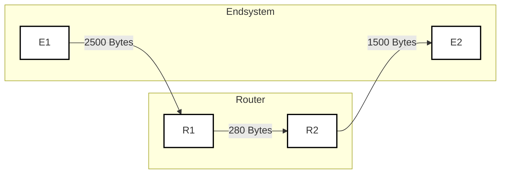
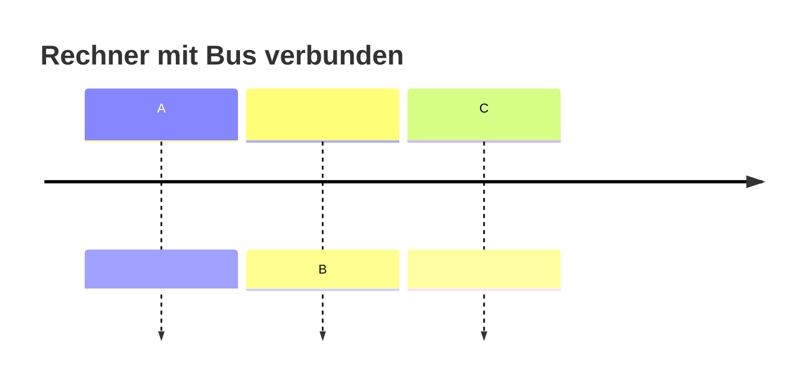
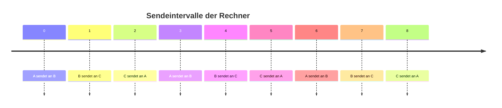
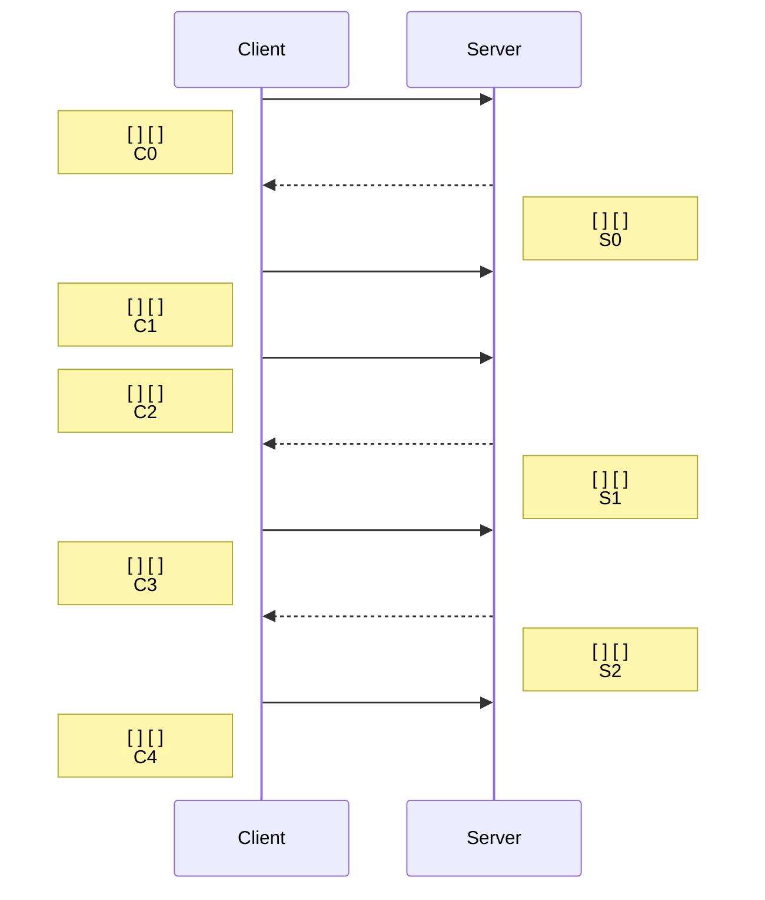
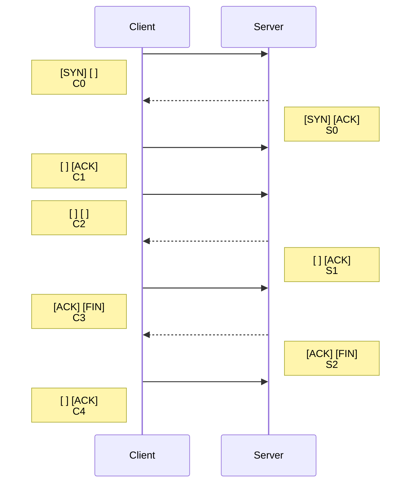
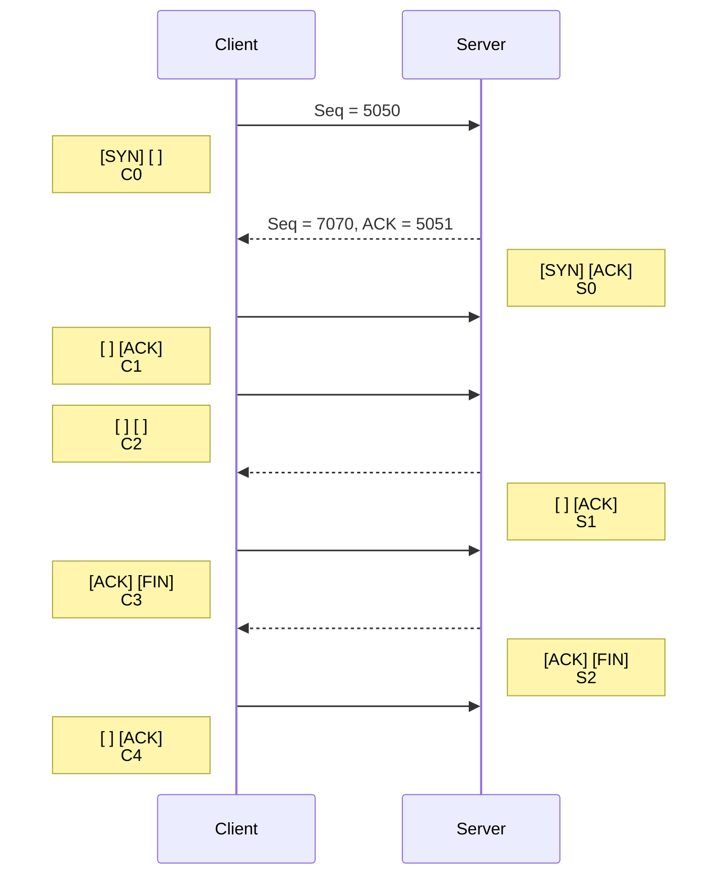

---
tags:
  - 4semester
  - informatik
  - RNVS
fach: "[[Rechnernetze und Verteilte Systeme (RNVS)]]"
Thema:
Benötigte Zeit:
date created: Monday, 22. July 2024, 17:54
date modified: Monday, 22. July 2024, 23:23
---

# Gedächtnisprotokoll der Klausur zur Vorlesung Rechnernetze

## 15.07.2015

### Notenschlüssel:

| Note | Punkte |
| ---- | ------ |
| 5.0  | 0      |
| 4.0  | 40     |
| 3.7  | 43     |
| 3.3  | 46     |
| 3.0  | 49     |
| 2.7  | 52     |
| 2.3  | 55     |
| 2.0  | 58     |
| 1.7  | 61     |
| 1.3  | 64     |
| 1.0  | 67     |

### Klausurstatistiken für Semestralklausur:

- Teilnehmer (bewertet): 311 (222)
- Durchschnittliche Punkte: 49.5
- Durchschnittliche Bonuspunkte: 0.0
- Durchschnittliche Note: 3.04

### Notenverteilung:

| Note | Ab Punkten | Häufigkeit |
| ---- | ---------- | ---------- |
| 5.0  | 0          | 40         |
| 4.0  | 40         | 22         |
| 3.7  | 43         | 16         |
| 3.3  | 46         | 18         |
| 3.0  | 49         | 19         |
| 2.7  | 52         | 28         |
| 2.3  | 55         | 14         |
| 2.0  | 58         | 20         |
| 1.7  | 61         | 19         |
| 1.3  | 64         | 18         |
| 1.0  | 67         | 8          |

### Hinweise:

- Jede falsche oder zu viel gegebene Antwort führt zu Punktabzug.
- Bei den Mehrfachauswahl-Fragen können mehr als eine Antwort richtig sein.

# I. Multiple Choice

<Verschiedene Fragen zu ISO/OSI-Schichten, …>

## Hier sind einige Multiple-Choice-Fragen zum Thema [[ISO-OSI-Modell]]-Schichten:

Lösungen unten zu finden

### 1. Welche der folgenden Schichten gehört nicht zum OSI-Modell?

- a) Anwendungsschicht
- b) Transportschicht
- c) Steuerungsschicht
- d) Sicherungsschicht

### 2. Auf welcher Schicht des OSI-Modells wird Routing durchgeführt?

- a) Anwendungsschicht
- b) Transportschicht
- c) Vermittlungsschicht
- d) Sicherungsschicht

### 3. Welche Protokolle gehören zur Transportschicht des OSI-Modells?

- a) TCP und UDP
- b) IP und ICMP
- c) HTTP und FTP
- d) Ethernet und PPP

### 4. Welche Schicht des OSI-Modells ist für die Datenverschlüsselung zuständig?

- a) Sitzungsschicht
- b) Darstellungsschicht
- c) Vermittlungsschicht
- d) Anwendungsschicht

### 5. Welche der folgenden Funktionen wird von der Sicherungsschicht bereitgestellt?

- a) Pfadbestimmung und Routing
- b) Datenflusskontrolle und Fehlererkennung
- c) Datenkompression und Verschlüsselung
- d) Netzwerkzugriff und Datenübertragung

### 6. Auf welcher Schicht des OSI-Modells arbeitet ein Switch hauptsächlich?

- a) Bitübertragungsschicht
- b) Sicherungsschicht
- c) Vermittlungsschicht
- d) Transportschicht

### 7. Welches der folgenden Protokolle arbeitet auf der Anwendungsschicht des OSI-Modells?

- a) FTP
- b) IP
- c) ARP
- d) PPP

### 8. Die Hauptaufgabe der Vermittlungsschicht ist:

- a) Sicherstellung der fehlerfreien Datenübertragung
- b) Steuerung der logischen Pfade zwischen Sender und Empfänger
- c) Verwaltung von Netzwerkverbindungen
- d) Übersetzung von Daten in ein standardisiertes Format

### 9. Welche der folgenden Aussagen zur Darstellungsschicht ist korrekt?

- a) Sie ist für die physikalische Übertragung der Daten zuständig.
- b) Sie stellt sicher, dass die Daten in einem anwendungsgerechten Format vorliegen.
- c) Sie übernimmt die Datenflusskontrolle zwischen Endgeräten.
- d) Sie ist für das Routing von Datenpaketen verantwortlich.

### 10. Welches Gerät arbeitet typischerweise auf der Bitübertragungsschicht des OSI-Modells?

- a) Router
- b) Switch
- c) Hub
- d) Firewall

> [!success] Lösungen
>
> ### Lösungen
>
> 1. **c) Steuerungsschicht**
>    - Erklärung: Die Steuerungsschicht ist keine der sieben Schichten des OSI-Modells. Die sieben Schichten sind: Anwendungsschicht, Darstellungsschicht, Sitzungsschicht, Transportschicht, Vermittlungsschicht, Sicherungsschicht und Bitübertragungsschicht.
> 2. **c) Vermittlungsschicht**
>    - Erklärung: Routing ist die Hauptaufgabe der Vermittlungsschicht. Diese Schicht bestimmt den besten Pfad für Datenpakete durch das Netzwerk.
> 3. **a) TCP und UDP**
>    - Erklärung: TCP (Transmission Control Protocol) und UDP (User Datagram Protocol) sind Protokolle der Transportschicht, die für die Datenübertragung zwischen Hosts zuständig sind.
> 4. **b) Darstellungsschicht**
>    - Erklärung: Die Darstellungsschicht ist für die Datenverschlüsselung und -dechiffrierung verantwortlich, um eine sichere Übertragung zu gewährleisten.
> 5. **b) Datenflusskontrolle und Fehlererkennung**
>    - Erklärung: Die Sicherungsschicht stellt sicher, dass die Daten ohne Fehler übertragen werden, indem sie Fehler erkennt und korrigiert. Sie kümmert sich auch um die Datenflusskontrolle.
> 6. **b) Sicherungsschicht**
>    - Erklärung: Ein Switch arbeitet hauptsächlich auf der Sicherungsschicht des OSI-Modells. Er verwendet MAC-Adressen, um Datenrahmen an die richtigen Geräte im lokalen Netzwerk weiterzuleiten.
> 7. **a) FTP**
>    - Erklärung: FTP (File Transfer Protocol) ist ein Protokoll der Anwendungsschicht und wird zum Übertragen von Dateien über ein Netzwerk verwendet.
> 8. **b) Steuerung der logischen Pfade zwischen Sender und Empfänger**
>    - Erklärung: Die Vermittlungsschicht steuert die logischen Pfade, durch die die Datenpakete vom Sender zum Empfänger gelangen, und kümmert sich um Routing und Weiterleitung.
> 9. **b) Sie stellt sicher, dass die Daten in einem anwendungsgerechten Format vorliegen.**
>    - Erklärung: Die Darstellungsschicht ist verantwortlich für die Datenformatierung, -kompression und -verschlüsselung, um sicherzustellen, dass die Daten in einem verständlichen Format für die Anwendungsschicht vorliegen.
> 10. **c) Hub**
>     - Erklärung: Ein Hub arbeitet auf der Bitübertragungsschicht des OSI-Modells und überträgt physikalische Signale an alle Ports, ohne die Daten zu verarbeiten oder zu filtern.

# II. Offene Fragen

## 1. Welche [[ISO-OSI-Modell]]-Schichten implementiert ein Router?

- Vermittlungsschicht passend zum englischen Namen der Schicht "Network-Layer"

## 2. Nenne eine Gemeinsamkeit und einen Unterschied folgender Netze: `10.0.0.0/8`, `172.16.0.0/12` und `192.168.0.0/16`

- Alle drei sind private IP-Adressen nach dem RFC 1918
- Sie haben verschiedene Anzahl von Host-IDs

## 3. Wie lässt sich das "Count-to-infinity"-Problem lösen?

- Split Horizon
- Eventuell auch Route Poisoning

## 4. Nenne zwei Störeinflüsse aus elektrische Leiter.

- Magentfelder
- Elektromagnetische Interferenzen (EMI)

## 5. Auf welcher Schicht wird die [[Maximal Transit Unit (MTU) - Maximale Übertragungsgrösse]] festgelegt?

- Schicht 2 (Vermittlungsschicht)

> [!tip]Warum nicht Schicht 3??
> **MTU wird auf der Sicherungsschicht (Layer 2) festgelegt:**
>
> - **Schicht 2 (Sicherungsschicht):**
>   - Regelt die physische Adressierung (MAC-Adressen) und Fehlererkennung auf Frame-Ebene.
>   - Bestimmt die maximale Frame-Größe für die Übertragung ohne Fragmentierung.
> - **Schicht 3 (Netzwerkschicht):**
>   - Handhabt die logische Adressierung (IP-Adressen) und Paketweiterleitung.
>   - Fragmentiert Datenpakete, um sie an die MTU der verschiedenen Layer-2-Netzwerksegmente anzupassen.

# III. CIDR und Subnetting

## 6. Notieren Sie die IPv6-Adresse `1337:0000:0000:0000:1000:0000:0000:0001` maximal verkürzt, so dass keine kürzere vollständige Darstellung dieser Adresse in IPv6 existiert.

$$
1337::1000:0:0:1
$$

## 7. Ein Internetanbieter erhält das Subnetz `2001:CDE0:0000:0000:0000:0000:0000:0000/28`. Dieses wird vollständig in vier gleich große Teilbereiche geteilt.

### a. Geben Sie die Länge der Netz-ID der entstehenden Teilnetze in Anzahl Bits an!

- Es wird in vier gleich große Teilbereiche eingeteilt
- Wie viel Bits werden nun extra benötigt?

$$
log_{2}{(4)} = 2
$$

- Addiere diese nun zur Netz-ID hinzu
  $$
  28+2 =30
  $$
- Die Länge der Netz-ID der entstehenden Teilnetze beträgt 30 Bit

### b. Schreiben Sie die vier entstehenden Subnetze in CIDR-Notation auf!

> [!info] Unsicher

1. `2001:CDE0::0/30`
2. `2001:CDE0:4000::0/30`
3. `2001:CDE0:8000::0/30`
4. `2001:CDE0:C000::0/30`

> [!tip] Erklärung
> Um die vier entstehenden Subnetze in CIDR-Notation korrekt zu ermitteln, müssen wir die zusätzlichen 2 Bits in der Netz-ID verwenden. Das ursprüngliche Netzwerk `2001:CDE0::/28` wird dabei in vier Subnetze mit jeweils einer Präfixlänge von 30 Bits aufgeteilt.
>
> Die neuen Netzwerke können wir durch Inkrementieren der beiden zusätzlichen Bits bestimmen. Diese zusätzlichen Bits ändern sich in den Stellen, die für die Subnetz-Adresse verwendet werden. Die Inkrementierung der beiden zusätzlichen Bits im Hexadezimal ergibt jeweils eine Änderung von 0x4000, da 2 Bits im Hexadezimal 4 Bit pro Ziffer sind.
>
> Hier sind die vier entstehenden Subnetze:
>
> > 1. `2001:CDE0:0000:0000:0000:0000:0000:0000/30`
> > 2. `2001:CDE0:4000:0000:0000:0000:0000:0000:0000/30`
> > 3. `2001:CDE0:8000:0000:0000:0000:0000:0000:0000/30`
> > 4. `2001:CDE0:C000:0000:0000:0000:0000:0000:0000/30`
>
> Diese Adressen wurden durch Inkrementieren der beiden zusätzlichen Bits erhalten, was in Hexadezimal jeweils 0x4000 entspricht (da 2 Bits im Hexadezimal 4 Bit pro Ziffer sind).

## 8. Betrachten Sie ein Netz bestehend aus den Endsystemen `E1` und `E2`, sowie den Routern `R1` und `R2`. Die Leitungen sind mit ihren maximum transfer units beschriftet.



### a. Nennen Sie die Komponente(n), die ein 1000 Byte langes IPv6-Paket von `E1` an `E2` fragmentieren!

- R1, da $1000 \gt 280$ für die Bytes im Kanal B zwischen Router 1 und Router 2
- R1 muss dementsprechend dass Paket Fragmentieren

### b. `E1` möchte ein IPv6 Paket mit 600 Bytes Nutzdaten an `E2` senden. Header (40 Byte) Nutzdaten (600 Byte)

```plaintext
+--------------------+---------------------+
| Header (40 Byte)   | Nutzdaten (600 Byte)|
+--------------------+---------------------+
```

$$
\begin{array}{|c|c|}
\hline
\text{Header (40 Byte)} & \text{Nutzdaten (600 Byte)} \\
\hline
\end{array}
$$

### Zeichnen Sie die Fragmente so wie `E2` sie empfängt. Geben Sie dabei Kopf- und Nutzdatenlänge analog zur Darstellung des ursprünglichen Pakets an! Hinweis: Ein IPv6 Header inklusive Fragmentation-Header ist 48 Byte lang.

$$
\begin{aligned}
280 - 48 &= 232 \\
\lfloor\frac{232}{8}\rfloor \cdot 8 &= 232 \\
\lfloor\frac{600}{232}\rfloor &=2 \\
600 - (232 \cdot2) = 136
\end{aligned}
$$

#### Berechnung der maximalen Nutzlast pro Fragment:

- Die maximale Transfergröße (MTU) von Router R1 beträgt 280 Bytes.
- Der IPv6-Header inklusive Fragmentierungs-Header beträgt 48 Bytes.
- Daher beträgt die maximale Nutzlast pro Fragment: $280 Bytes−48 Bytes=232 Bytes$
- Checken ob 232 durch 8 teilbar ist und falls nicht nehmen die größte Zahl kleiner als 232 die teilbar durch 8 ist. $\lfloor\frac{232}{8}\rfloor \cdot 8 = 232$
- In dem Fall durch teilbar

#### Berechnung der Anzahl der Fragmente:

- Die Gesamtgröße der Nutzdaten beträgt 600 Bytes.
- Jede Fragment-Nutzlast kann 232 Bytes tragen.
- Anzahl der vollständigen Fragmente: $\lfloor\frac{600}{232}\rfloor =2$
- Übrigbleibende Daten für das letzte Fragment: $600 - (232 \cdot2) = 136$

| Fragmentnummer | Header | Fragment |
| -------------- | ------ | -------- |
| 1              | 48     | 232      |
| 2              | 48     | 232      |
| 3              | 48     | 136      |

# IV. Vielfachzugriff

> [!note] Aufgabenstellung
> Die Abbildung zeigt drei Rechner, die über einen Bus miteinander verbunden sind. Zum Medienzugriff wird ein statischer Zeitmultiplex eingesetzt, der die gesamte verfügbare Zeit gleichmäßig in Intervalle aufteilt.
>
> `A` möchte 3 Rahmen an `B` senden, `B` möchte 3 Rahmen an `C` senden und `C` möchte 3 Rahmen an `A` senden. Alle Rechner sind gleichzeitig sendebereit, ein Rahmen mit Nutzdaten ist exakt ein Sendeintervall groß und zu jedem Zeitpunkt kann nur ein einzelner Rechner senden.



## 9. Tragen sie an den Zeitstrahl mit den Absendern beschriftete Intervalle an, zu denen die Rechner senden!

```plaintext
+-------------------------------------------------------->
```



```plaintext
+-------------------------------------------------------->
|  A  |  B  |  C  |  A  |  B  |  C  |  A  |  B  |  C  |
0     1     2     3     4     5     6     7     8

```

## 10. Die korrekte Übertragung der Rahmen soll nun quittiert werden. Gehen Sie davon aus, dass keine Übertragungsfehler auftreten! Angenommen jeder Rechner versendet nach Erhalt eines Rahmens nächstmöglich eine explizite Quittungs-PDU, die genau so lang wie die zu quittierende Nachricht ist.

> [!info] Unsicher

### a. Wie viele Rahmen sind notwendig, um die gesamte Übertragung abzuschließen?

$$
18
$$

Da jeder Rechner 3 Rahmen senden möchte und jeder Rahmen eine Quittungs-PDU benötigt, ergeben sich insgesamt:

- 3 Rahmen von A an B
- 3 Rahmen von B an C
- 3 Rahmen von C an A

Für jeden gesendeten Rahmen wird eine Quittung gesendet, sodass insgesamt:

$$
\begin{aligned}
\text{Gesendete Rahmen} &= 3 \times 3 = 9 \\
\text{Gesendete Quittungen} &= 3 \times 3 = 9 \\
\text{Gesamte Nachrichten} &= \text{Gesendete Rahmen} + \text{Gesendete Quittungen} \\
&= 9 + 9 = 18
\end{aligned}
$$

### b. Von welchem PDU-Typ ist der letzte gesendete Rahmen?

$$
ACK
$$

Der letzte gesendete Rahmen ist eine Quittung für den letzten Datentransfer. Da C als letzter Daten an A sendet und eine Quittung von A erwartet wird, ist der letzte PDU-Typ eine Quittungs-PDU.

### c. `A` beginnt als erster mit der Datenübertragung. Welcher ist der letzte Rechner, der einen Rahmen verschickt und an wen ist dieser adressiert?

Der letzte Rechner, der einen Rahmen verschickt, ist C, da C den letzten Rahmen an A sendet.

Sender: `C`

Empfänger: `A`

# V. Ethernet, CSMA

## 11.

> [!note] Aufgabenstellung
> Gegeben sei ein Ethernet mit einer Übertragungsrate von $10 \text{ GBit/s}$, einer Leitungslänge von $2000 \text{m}$ und einer Signalgeschwindigkeit von $2 \cdot 10^8 \text{m/s}$. Berechnen Sie die minimale Rahmengröße, bei der CSMA/CD als Vielfachzugriffsverfahren noch einsetzbar wäre. Geben Sie das Ergebnis in Bytes (Oktetten), sowie den Rechenweg an!
>
> Hinweis: $1 \text{ GBit} = 10^9 \text{ Bits}$

> [!info] Unsicher

Um die minimale Rahmengröße zu berechnen, bei der CSMA/CD (Carrier Sense Multiple Access with Collision Detection) noch funktioniert, müssen wir sicherstellen, dass die Kollisionserkennung zuverlässig funktioniert. Dies bedeutet, dass der Sender während der Übertragung eines Rahmens eine Kollision erkennen muss, die am weitesten entfernten Punkt im Netz (dem maximalen Abstand) auftritt. Dazu muss der Rahmen groß genug sein, damit das Signal von der Kollision zurück zum Sender gelangt, bevor der Sender die Übertragung beendet hat.

Hier ist der Rechenweg zur Bestimmung der minimalen Rahmengröße:

1. **Berechnung der Rundlaufzeit (Round Trip Time, RTT):**

   $$
   \text{RTT} = 2 \times \frac{\text{Leitungslänge}}{\text{Signalgeschwindigkeit}}
   $$

   Gegeben sind:

   $$
   \text{Leitungslänge} = 2000 \, \text{m}
   $$

   $$
   \text{Signalgeschwindigkeit} = 2 \times 10^8 \, \text{m/s}
   $$

   Einsetzen in die Formel:

   $$
   \text{RTT} = 2 \times \frac{2000 \, \text{m}}{2 \times 10^8 \, \text{m/s}} = 2 \times 10^{-5} \, \text{s} = 20 \, \mu\text{s}
   $$

2. **Bestimmung der minimalen Rahmengröße in Bits:**

   Die Übertragungsrate ist gegeben als:

   $$
   \text{Übertragungsrate} = 10 \, \text{GBit/s} = 10 \times 10^9 \, \text{Bit/s}
   $$

   Die minimale Rahmengröße muss so groß sein, dass die Übertragung des gesamten Rahmens mindestens die Dauer der RTT dauert. Dies bedeutet, dass die Übertragungsdauer des Rahmens mindestens 20 µs betragen muss.

   Die minimale Rahmengröße in Bits:

   $$
   \text{Minimale Rahmengröße} = \text{Übertragungsrate} \times \text{RTT}
   $$

   Einsetzen der Werte:

   $$
   \text{Minimale Rahmengröße} = 10 \times 10^9 \, \text{Bit/s} \times 20 \times 10^{-6} \, \text{s} = 200000 \, \text{Bits}
   $$

3. **Umrechnung in Bytes (Oktetten):**

   Da 1 Byte = 8 Bits,

   $$
   \text{Minimale Rahmengröße in Bytes} = \frac{200000 \, \text{Bits}}{8} = 25000 \, \text{Bytes}
   $$

Daher ist die minimale Rahmengröße, bei der CSMA/CD als Vielfachzugriffsverfahren noch einsetzbar wäre, 25000 Bytes (Oktetten).

---

# VI. Cyclic Redundancy Check

> [!note] Aufgabenstellung
> Gegeben sei das Generatorpolynom $G = x^3 + 1$

## 12. Welche Länge hat das Generatorpolynom $G$ in Bits?

- 4 Bits

$$
\begin{aligned}
G &= x^{3} + 1 \\
&= 1x^{3}+0x^{2}+0x^{1}+1x^{0}
\end{aligned}
$$

## 13. Das Wort $110011$ soll übertragen werden. Geben Sie die zu sendende Bitfolge (inkl. der CRC-Prüfsumme) an!

```plaintext
110011000 : 1001 =
1001
----
01011
 1001
 ----
 001010
   1001
   ----
   001100
     1001
     ----
     0101 → CRC
```

- Zu sendende Nachricht `11 00 11 101`

## 14. Beim Empfänger kommt die Bitfolge $10011001$ an. Zeigen Sie (mit Rechnung), dass diese korrekt übertragen wurde und markieren Sie die Stelle, an der der Empfänger weiß, dass die Übertragung fehlerfrei war und begründen Sie kurz.

```plaintext
10011001 : 1001 =
1001
----
00001001
    1001
    ----
    0000  → Rest ist null und somit die Bitfolge korrekt
```

Der Rest der CRC Kontrolle ist null, die Bitfolge ist also korrekt und die übertragung ist fehlerfrei passiert

---

# VII. TCP [[RNVS-Blatt-06#5. TCP-Verbindung (H)]]

## 15. Folgendes Diagramm beschreibt einen HTTP-Anfrage-Antwort-Dialog zwischen einem Client und einem Server inkl. des TCP Auf- und Abbaus. Die Anfrage sei 50 Byte groß, die Antwort 1000 Byte.



### a. Tragen Sie in das Sequenzdiagramm alle gesendeten TCP-Flags ein (und nichts sonst)!



### Zu Beginn der Übertragung stehe der Sequenznummernzähler des Clients auf `5050`, der des Servers auf `7070`.

### b. Welche Sequenznummer und welche ACK-Nummer wird in Paket `S0` übertragen?



### c. In welchem Paket geschieht die HTTP-Anfrage?

- C2

### d. Die Serverantwort trage die Sequenznummer `x` und die ACK-Nummer `y`. Wie lauten die Sequenznummer und die ACK der Bestätigung/Quittung dazu?

- Seq = y
- ACK = x + 1000

### e. Wie groß ist der Unterschied der Sequenznummern zwischen `C3` und `C4`?

- 1

### f. Um wieviel wurde der Sequenznummernzähler des Servers während des Dialogs insgesamt erhöht?

- 1000

# VIII. DNS [[RNVS-Altklausur-2018#III. Domain Name System (DNS)]]

> [!info] Das Bild ist sehr verschommen, ich nehme an die Aufgabe ist die gleiche wie in der [[RNVS-Altklausur-2018]]
>
> - Besuche die Seite um da die Antwoten zu sehen [[RNVS-Altklausur-2018#III. Domain Name System (DNS)]]
> - Unten eine Symbolhafte darstellung von dem wie es ungefähr aufgebaut ist

```shell
user@host:~$ dig +trace example1.com

; <<>> DiG 9.10.6 <<>> +trace example1.com
;; global options: +cmd
.			518400	IN	NS	a.root-servers.net.
.			518400	IN	NS	b.root-servers.net.
.			518400	IN	NS	c.root-servers.net.
.			518400	IN	NS	d.root-servers.net.
;; Received 524 bytes from 192.0.2.1#53(192.0.2.1) in 20 ms

com.			172800	IN	NS	a.gtld-servers.net.
com.			172800	IN	NS	b.gtld-servers.net.
com.			172800	IN	NS	c.gtld-servers.net.
com.			172800	IN	NS	d.gtld-servers.net.
;; Received 525 bytes from 198.41.0.4#53(a.root-servers.net) in 15 ms

example1.com.		172800	IN	NS	ns1.example1.com.
example1.com.		172800	IN	NS	ns2.example1.com.
;; Received 525 bytes from 192.5.6.30#53(a.gtld-servers.net) in 12 ms

example1.com.		86400	IN	A	93.184.216.34
;; Received 43 bytes from 192.0.32.59#53(ns1.example1.com) in 25 ms

```

## 16.

### a. Wie viele DNS-Anfragen waren nötig, um den Hostnamen `<xxx@ifi.lmu.de>` aufzulösen?

- 4 (von dem was ich auf dem Bild sehe)

### b. Welche IP-Adresse hat der gesuchte Host?

- erkenne ich auf dem Bild nicht
- in dem Beispiel von Symbolbild `example1.com.		86400	IN	A	93.184.216.34`
  - also `93.184.216.34`

### c. Ist die DNS-Anfrage rekursiv oder iterativ? Begründen Sie Ihre Antwort!

- iterativ, erkennt man an den mehreren Blöcken
- es wurde wahrscheinlich `dig +trace benutzt` was iterativ ist

### d. Welches Protokoll der ISO/OSI-Schicht 4 wird bei Name-Servern für den Zonentransfer eingesetzt? Welches für DNS-Anfragen?

- Zonentransfer: TCP
- DNS-Anfragen: UDP

### e. Lässt sich auf Basis dieser Informationen eine E-Mail an `<yyy@ifi.lmu.de>` ausliefern?

> [!warning] Ich konnte es nicht aus dem Bild lesen und habe dementsprechend selbst eine Beispielaufgabe gemacht wie es aussehen könnte

Um zu bestimmen, ob eine E-Mail an `<yyy@ifi.lmu.de>` zugestellt werden kann, müssen wir die MX (Mail Exchange) Records der Domain `ifi.lmu.de` abfragen. Diese Records geben an, welche Mailserver für die Domain zuständig sind. Hier ist ein Beispiel, wie man dies mit dem `dig`-Befehl durchführen kann:

```sh
user@host:~$ dig +trace ifi.lmu.de MX

; <<>> DiG 9.10.6 <<>> +trace ifi.lmu.de MX
;; global options: +cmd
.			518400	IN	NS	a.root-servers.net.
.			518400	IN	NS	b.root-servers.net.
.			518400	IN	NS	c.root-servers.net.
.			518400	IN	NS	d.root-servers.net.
;; Received 524 bytes from 192.0.2.1#53(192.0.2.1) in 20 ms

de.			172800	IN	NS	a.nic.de.
de.			172800	IN	NS	b.nic.de.
de.			172800	IN	NS	c.nic.de.
de.			172800	IN	NS	d.nic.de.
;; Received 525 bytes from 198.41.0.4#53(a.root-servers.net) in 15 ms

lmu.de.			172800	IN	NS	a.de.net.
lmu.de.			172800	IN	NS	b.de.net.
lmu.de.			172800	IN	NS	c.de.net.
lmu.de.			172800	IN	NS	d.de.net.
;; Received 525 bytes from 192.5.6.30#53(a.nic.de) in 12 ms

ifi.lmu.de.		172800	IN	NS	ns1.ifi.lmu.de.
ifi.lmu.de.		172800	IN	NS	ns2.ifi.lmu.de.
;; Received 525 bytes from 192.0.32.59#53(a.de.net) in 25 ms

ifi.lmu.de.		86400	IN	MX	10 mail.ifi.lmu.de.
ifi.lmu.de.		86400	IN	MX	20 mail2.ifi.lmu.de.
;; Received 43 bytes from 192.0.32.59#53(ns1.ifi.lmu.de) in 25 ms
```

Diese Ausgabe zeigt die MX-Records der Domain `ifi.lmu.de`, die die Mailserver `mail.ifi.lmu.de` und `mail2.ifi.lmu.de` mit den Prioritäten 10 bzw. 20 angibt. Auf Basis dieser Informationen können wir feststellen, dass E-Mails an `<yyy@ifi.lmu.de>` an diese Mailserver weitergeleitet werden.

Ja, basierend auf den obigen Informationen lässt sich eine E-Mail an `<yyy@ifi.lmu.de>` ausliefern, da die Domain `ifi.lmu.de` gültige MX-Records hat, die auf ihre Mailserver verweisen.

---

# IX. Email

Gegeben sind die vollständigen Daten, die ein SMTP-Server während einer SMTP-Sitzung empfängt:

> [!note]
>
> Gegeben sind die vollständigen Daten, die ein SMTP-Server während einer SMTP-Sitzung empfängt:
>
> | O   | Daten                                 |
> | --- | ------------------------------------- |
> | 1   | Helo nm.ifi.lmu.de                    |
> | 2   | Mail From: `<root@nm.ifi.lmu.de>`     |
> | 3   | Rcpt To: `<manager@nm.ifi.lmu.de>`    |
> | 4   | Data                                  |
> | 5   | Reply-To: `<operators@nm.ifi.lmu.de>` |
> | 6   | From: `<admin@nm.ifi.lmu.de>`         |
> | 7   | To: `<manager@nm.ifi.lmu.de>`         |
> | 8   | Subject: Was ist das                  |
> | 9   |                                       |
> | 10  | was ist das?                          |
> | 11  |                                       |
> | 12  | .                                     |
> | 13  | Quit                                  |

## 17. Markieren Sie genau die Zeilen, die SMTP-Protokollsteuerinformationen enthalten!

| Zeile | Inhalt                             | Beschreibung                              |
| ----- | ---------------------------------- | ----------------------------------------- |
| O 1   | Helo nm.ifi.lmu.de                 | Startet die Kommunikation mit dem Server. |
| O 2   | Mail From: `<root@nm.ifi.lmu.de>`  | Gibt den Absender der E-Mail an.          |
| O 3   | Rcpt To: `<manager@nm.ifi.lmu.de>` | Gibt den Empfänger der E-Mail an.         |
| O 4   | Data                               | Signalisiert den Beginn der E-Mail-Daten. |
| O 12  | .                                  | Beendet den Datenabschnitt der E-Mail.    |
| O 13  | Quit                               | Beendet die SMTP-Sitzung.                 |

## 18. An wen soll eine Antwort adressiert werden?

- **`Reply-To: <operators@nm.ifi.lmu.de>`**
  - Die `Reply-To`-Zeile gibt an, wohin Antworten auf die E-Mail gesendet werden sollen.
  - In diesem Fall ist es `operators@nm.ifi.lmu.de`.

## 19. Wie lautet die Kennung des Empfängers?

- **`Rcpt To: <manager@nm.ifi.lmu.de>`**
  - Die `Rcpt To`-Zeile gibt den Empfänger der E-Mail an.
  - In diesem Fall ist es `manager@nm.ifi.lmu.de`.

## 20. Welches Protokoll verwendet ein User Agent (UA) zum Versenden von E-Mails?

- **SMTP (Simple Mail Transfer Protocol)**
  - Ein Protokoll, das für das Senden von E-Mails verwendet wird.
  - Es handelt sich um ein Standardprotokoll für den E-Mail-Versand.

## 21. Wie nennt man bei E-Mail den Mechanismus, mit dem z.B. auch das Versenden von nicht ASCII-Zeichen ermöglicht wird?

- **MIME (Multipurpose Internet Mail Extensions)**
  - Ein Standard, der es ermöglicht, verschiedene Arten von Inhalten (z.B. Text, Bilder, Audio) in E-Mails zu versenden.
  - Ermöglicht auch das Senden von nicht ASCII-Zeichen und anderen erweiterten Zeichensätzen.

## 22. Wird E-Mail durch den Einsatz von TCP unempfindlich gegenüber dem Dienstgütemerkmal "Datenverlust"? Begründen Sie Ihre Antwort!

- Ja, durch den Einsatz von TCP wird E-Mail unempfindlich gegenüber Datenverlust.
- TCP macht durch Quittungsbelege sicher, dass Daten und Pakete verschickt wurden und verschickt diese erneut falls keine Quittung für die jeweiligen Daten ankam

  **Begründung:**

  - **TCP (Transmission Control Protocol)**
    - Verbindungsorientiertes Protokoll.
    - Sorgt für zuverlässige Datenübertragung.
    - Implementiert Mechanismen wie Fehlererkennung und Wiederholungsversuche.
    - Stellt sicher, dass alle Datenpakete korrekt und in der richtigen Reihenfolge ankommen.
  - **Datenverlust wird durch TCP verhindert**
    - Falls Pakete verloren gehen oder beschädigt werden, fordert TCP diese erneut an.
    - Dadurch wird die Integrität und Vollständigkeit der Daten sichergestellt.
  - **Wichtigkeit für E-Mail**
    - E-Mails müssen vollständig und korrekt übertragen werden.
    - TCP gewährleistet, dass keine Daten während der Übertragung verloren gehen.

# X. Comic: So funktioniert das Internet

[](https://postimg.cc/Cd1wZXmY)

## 23. Wie muss das Feld `a)` in Bild 3 beschriftet werden?

- DNS-Server

## 24. Wie muss das Feld `b)` in Bild 6 beschriftet werden?

- 23.45.67.89

## 25. Welches Protokoll sprechen Browser und Eule in Bild 3?

- **DNS** (Domain Name System)

## 26. Welches Protokoll sprechen Browser und Eule in Bild 5?

- **HTTP** (HyperText Transfer Protocol)

## 27. Nennen Sie ein Bild, in dem zwei Instanzen der Anwendungsschicht miteinander kommunizieren.

- **Bild 3**: In diesem Bild kommunizieren der Browser und der DNS-Server miteinander, was eine Kommunikation auf der Anwendungsschicht darstellt.

<!-- Modal START -->
<div id="myModal" class="modal">
  <div class="modal-content">
    <span id="closeModal" class="close">&times;</span>
    <p class="modal-text">
      If MyUniNotes has been helpful and you’d like to support my efforts, <span class="modal-highlight"> you can contribute with a donation: <a class="modal-dono-link" href="https://paypal.me/myuninotes4u">Donate via PayPal</a> :) </span> Your support will help me continue improving the content, but there is no obligation to donate.
    </p>
    <p class="modal-text">
      <span class="modal-highlight">MyUniNotes is a personal, non-revenue project as I believe in accessible education for everyone.</span> Please note that these are my own notes and solutions, and I cannot guarantee the complete accuracy of all solutions as I am still a student myself.
  </div>
</div>

<script>
  // JavaScript to display the modal on page load
  document.addEventListener('DOMContentLoaded', function() {
    // Generate a random number between 1 and 1
    // Wanted it to load with a adjustable probability for every page load but did not work, as DOM is loaded only once. Therefore now loading it every time website is visited and DOM is loaded.
    const randomNumber = Math.floor(Math.random() * 1) + 1; 
    // console.log(randomNumber)
    if (randomNumber === 1) {
      setTimeout(function() {
        const modal = document.getElementById('myModal');
        if (modal) {
          modal.classList.add('show');
        }
      }, 1000); // Adjust the delay as needed

      const closeModal = document.getElementById('closeModal');
      if (closeModal) {
        closeModal.addEventListener('click', function() {
          const modal = document.getElementById('myModal');
          if (modal) {
            modal.classList.remove('show');
          }
        });
      }
    } else {
      // Ensure the modal is hidden if the random number is not 1
      const modal = document.getElementById('myModal');
      if (modal) {
        modal.style.display = 'none';
      }
    }
  });
</script>
<!-- Modal END -->

<!-- DISQUS SCRIPT COMMENT START -->

<!-- DISQUS RECOMMENDATION START -->

<div id="disqus_recommendations"></div>

<script> 
(function() { // REQUIRED CONFIGURATION VARIABLE: EDIT THE SHORTNAME BELOW
var d = document, s = d.createElement('script'); // IMPORTANT: Replace EXAMPLE with your forum shortname!
s.src = 'https://myuninotes.disqus.com/recommendations.js'; s.setAttribute('data-timestamp', +new Date());
(d.head || d.body).appendChild(s);
})();
</script>
<noscript>
Please enable JavaScript to view the 
<a href="https://disqus.com/?ref_noscript" rel="nofollow">
comments powered by Disqus.
</a>
</noscript>

<!-- DISQUS RECOMMENDATION END -->

<hr tle="border: none; height: 2px; background: linear-gradient(to right, #f0f0f0, #ccc, #f0f0f0); margin-top: 4rem; gin-bottom: 5rem;">
<div id="disqus_thread"></div>
<script>
    /**
    * RECOMENDED CONFIGURATION VARIABLES: EDIT AND UNCOMMENT THE SECTION BELOW TO INSERT DYNAMIC VALUES FROM YOUR PLATFORM OR CMS.
    * LEARN WHY DEFINING THESE VARIABLES IS IMPORTANT: https://disqus.com/admin/universalcode/#configuration-variables */
    /*
    var disqus_config = function () {
    this.page.url = PAGE_URL; // Replace PAGE_URL with your page's canonical URL variable
    this.page.identifier = PAGE_IDENTIFIER; // Replace PAGE_IDENTIFIER with your page's unique identifier variable
    };
    */
    (function() { // DON'T EDIT BELOW THIS LINE
    var d = document, s = d.createElement('script');
    s.src = 'https://myuninotes.disqus.com/embed.js';
    s.setAttribute('data-timestamp', +new Date());
    (d.head || d.body).appendChild(s);
    })();
</script>
<noscript>Please enable JavaScript to view the <a href="https://disqus.com/?ref_noscript">comments powered by Disqus.</a></noscript>

<!-- DISQUS SCRIPT COMMENT END -->
