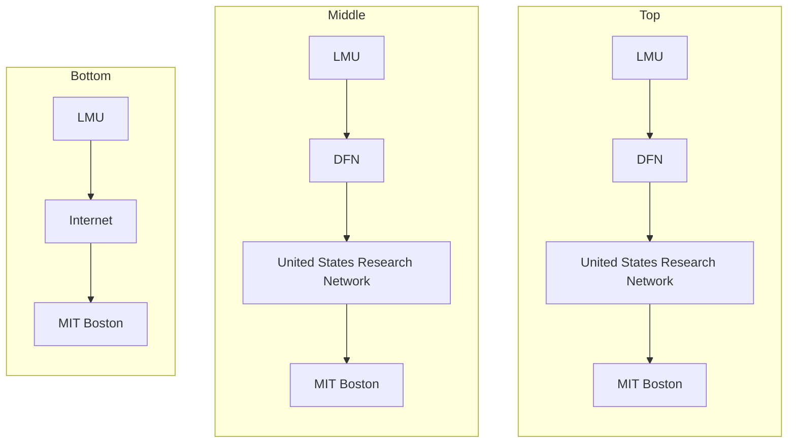
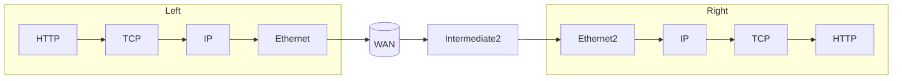
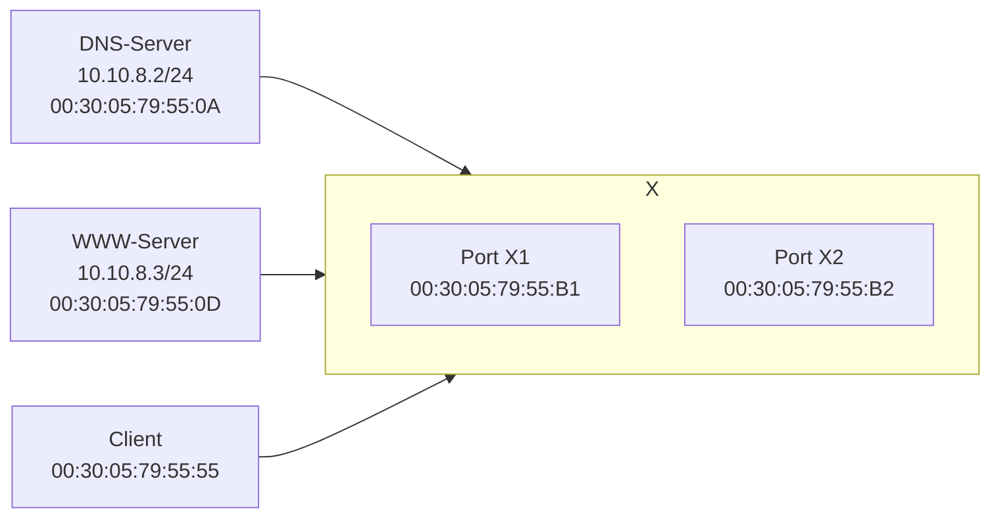
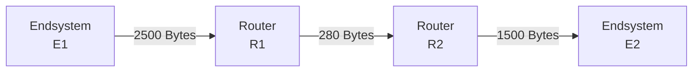
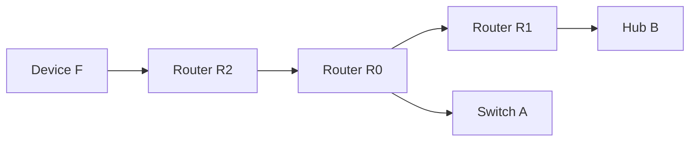
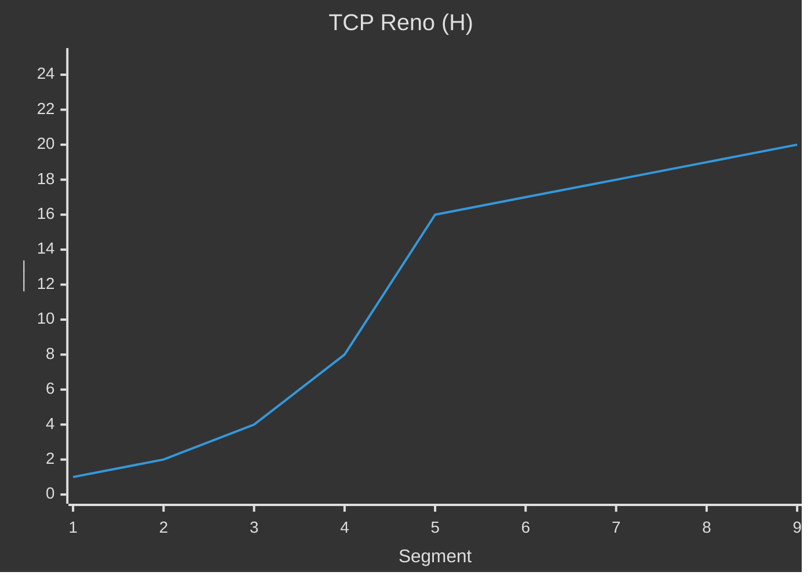
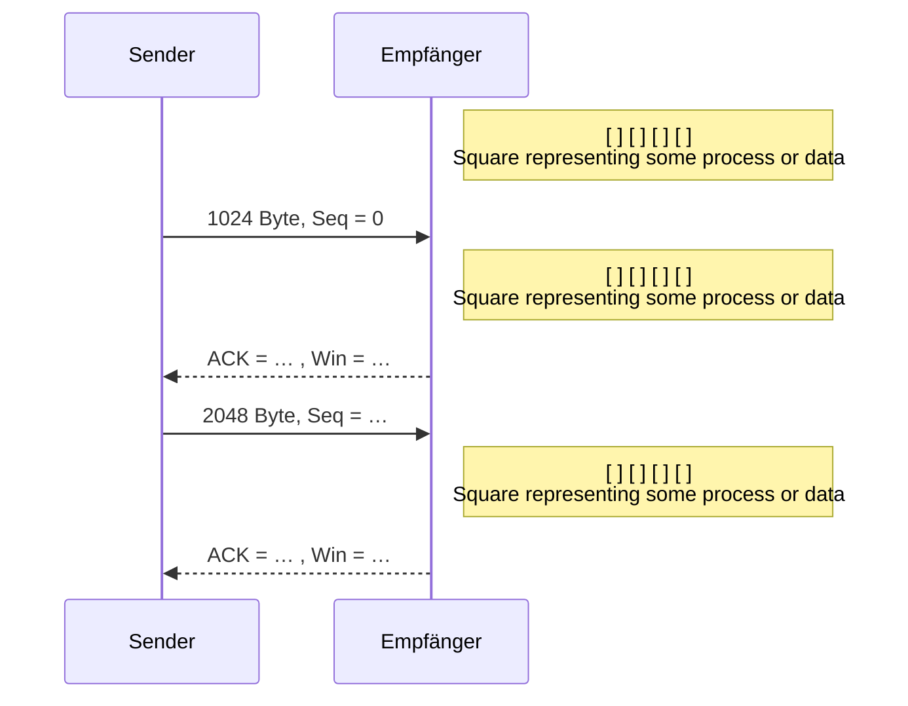
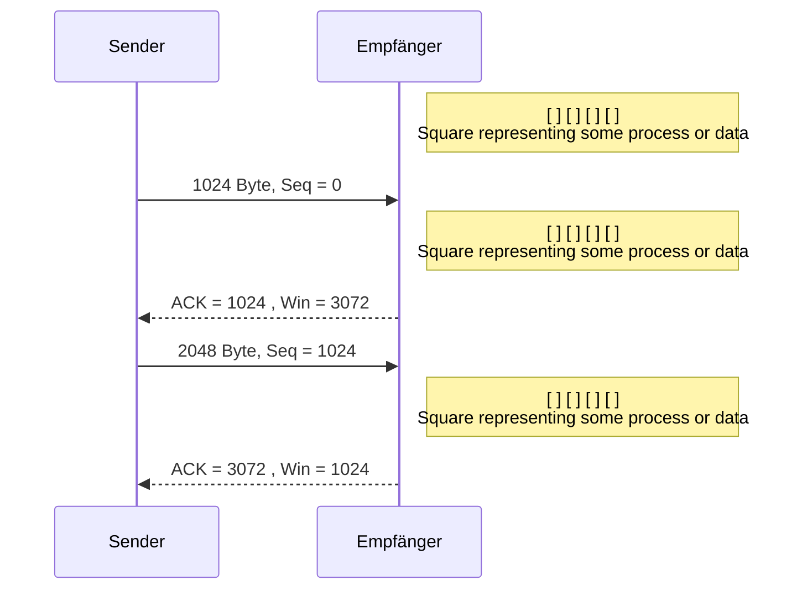
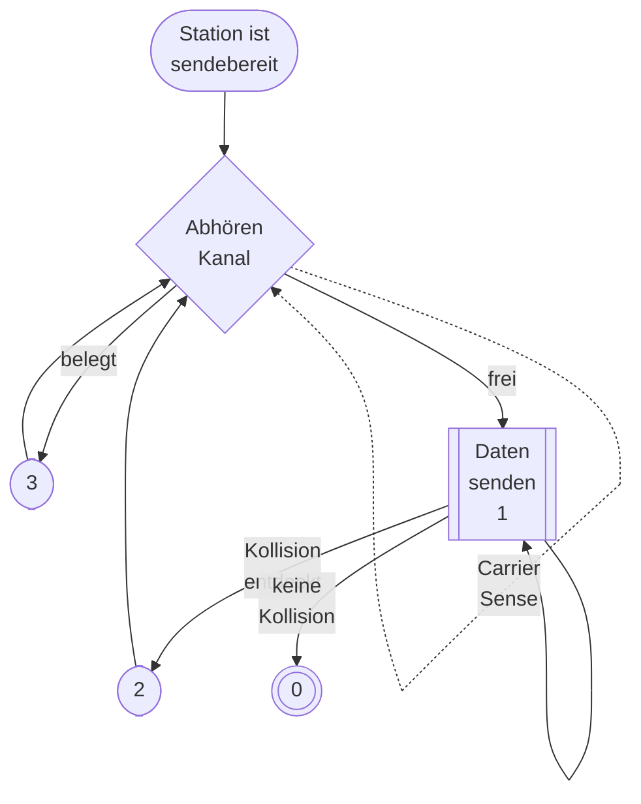
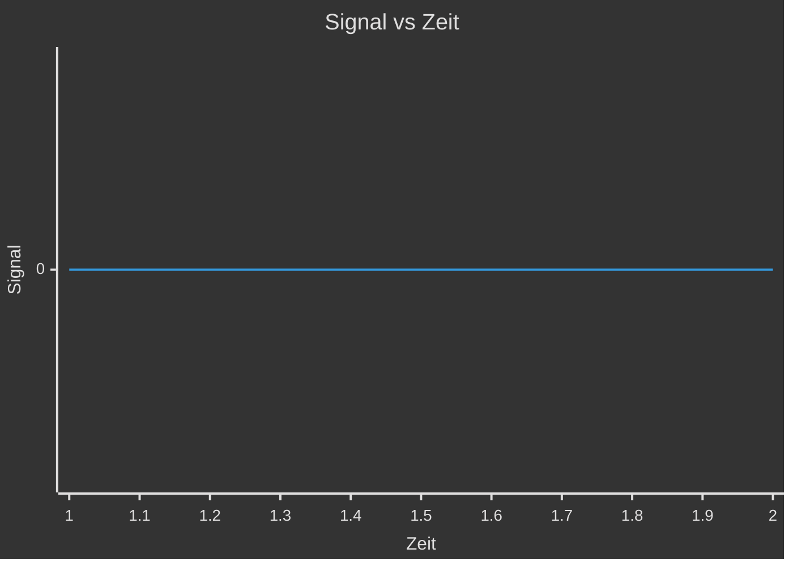

---
tags:
  - 4semester
  - informatik
  - RNVS
fach: "[[Rechnernetze und Verteilte Systeme (RNVS)]]"
Thema:
Benötigte Zeit:
date created: Sunday, 21. July 2024, 23:36
date modified: Wednesday, 24. July 2024, 18:50
---

# Rechnernetze und verteilte Systeme

## Klausur Sommersemester 2018

# Lösung der Aufgabe 1

## Teilaufgabe a

**Welche der folgenden Aussagen zum OSI-Referenzmodell sind korrekt?**

- [ ] Die ISO/OSI-Schichten 1 bis 4 enthalten anwendungsorientierte Protokolle.
- [ ] Aufgabe von Protokollen der Transportschicht ist es, eine Ende-zu-Ende-Kommunikation zu ermöglichen.
- [x] Für Wegwahl/Routing sind Protokolle der Vermittlungsschicht zuständig.
- [x] Für zwischengelagerte Transitsysteme sind die ISO/OSI-Schichten 1 bis 3 relevant.

**Erläuterung:**

- Die ISO/OSI-Schichten 1 bis 4 sind nicht anwendungsorientiert. Anwendungsorientierte Protokolle befinden sich in den Schichten 5 bis 7.
- Die Vermittlungsschicht (Schicht 3) ist für die Ende-zu-Ende-Kommunikation verantwortlich. (UDP zum Beispiel nicht Ende zu Ende)
- Die Vermittlungsschicht (Schicht 3) kümmert sich um das Routing der Datenpakete.
- Schichten 1 bis 3 sind relevant für Transitsysteme, die Daten von einem Netzwerk zum anderen weiterleiten.

## Teilaufgabe b

**Welche der folgenden Eigenschaften haben verbindungsorientierte Dienste immer?**

- [ ] Die maximale Zeit für die Zustellung einer Nachricht wird garantiert.
- [ ] Auf einen Verbindungsaufbau kann verzichtet werden.
- [ ] Die Dienste sind immer der Transportschicht zuzuordnen.
- [x] Es wird ein Kommunikationskanal zwischen zwei Endpunkten eingerichtet.

**Erläuterung:**

- Verbindungsorientierte Dienste garantieren nicht immer eine maximale Zustellzeit.
- Ein Verbindungsaufbau ist immer erforderlich.
- Verbindungsorientierte Dienste können auch in anderen Schichten existieren, nicht nur in der Transportschicht.
- Ein Kommunikationskanal zwischen zwei Endpunkten wird immer eingerichtet.

## Teilaufgabe c

**Zur Digitalisierung von analogen Daten sind folgende Schritte erforderlich:**

- [x] Quantisierung
- [x] Diskretisierung
- [ ] Modulation
- [x] Codierung

**Erläuterung:**

- Quantisierung: Der Prozess der Umwandlung kontinuierlicher Werte in diskrete Werte.
- Diskretisierung: Die Umwandlung kontinuierlicher Signale in diskrete Zeitpunkte.
- Modulation: Wird verwendet, um digitale Signale auf analoge Trägerwellen zu übertragen, nicht zur Digitalisierung.
- Codierung: Die Umwandlung von diskreten Werten in ein digitales Signal.

## Teilaufgabe d

**Welche Aussagen treffen auf Block Check Character zu?**

- [x] Es ist ein Verfahren zur Fehlererkennung.
- [ ] Es gehört zur Familie selbstkorrigierender Codes.
- [x] Es überträgt zusätzliche Paritätsbits.
- [ ] Es erkennt alle zusammenhängenden Fehler.

**Erläuterung:**

- Block Check Character (BCC) ist ein Fehlererkennungsverfahren.
- Es ist kein selbstkorrigierender Code.
- BCC verwendet zusätzliche Paritätsbits zur Fehlererkennung.
- Es kann nicht alle zusammenhängenden Fehler erkennen, sondern nur solche, die durch die Paritätsprüfung entdeckt werden können.

## Teilaufgabe e

**Beim CRC-Verfahren wird ein Generatorpolynom $G = x^5 + x^3 + x + 1$ verwendet. Welche ist die richtige Darstellung dieses Polynoms als Bitfolge?**

$$
\begin{aligned}
G&= 1x^{5}+0x^{4}+1x^{3}+0x^{2}+1x^{1}+1x^{0}\\
&\rightarrow 101 \ 011
\end{aligned}
$$

- [ ] 110 101
- [ ] 110 10
- [x] 101 011
- [ ] 110 011

## Teilaufgabe f

**Welche Aussagen über Network Address Translation (NAT) treffen zu?**

- [x] NAT betrifft Abläufe auf Vermittlungsschicht.
- [x] NAT kann die Ports in TCP und UDP verändern.
- [x] NAT maskiert private IP-Adressen.
- [ ] NAT verbessert die Leitungskodierung.

**Erläuterung:**

- NAT arbeitet auf der Vermittlungsschicht (Schicht 3).
- NAT kann TCP- und UDP-Ports verändern, um mehrere Geräte mit einer einzigen öffentlichen IP-Adresse zu unterstützen.
- NAT maskiert private IP-Adressen, indem es sie in eine öffentliche IP-Adresse übersetzt.
- NAT hat keinen Einfluss auf die Leitungskodierung.

## Teilaufgabe g

**Bei Ethernet (IEEE 802.3) wird eine Mindestrahmenlänge festgelegt, weil …**

- [ ] Ethernet einen hierarchischen Adressraum benutzt.
- [ ] bei zu kurzem Rahmen der Konfliktparameter zu hoch wird.
- [x] damit die Kollisionserkennung funktionieren kann.
- [ ] damit die Rahmengröße immer ein Vielfaches von 32 Bit ist.

**Erläuterung:**

- Eine Mindestrahmenlänge ist erforderlich, damit die Kollisionserkennung funktioniert. Bei zu kurzen Rahmen könnte eine Kollision nicht rechtzeitig erkannt werden.

## Teilaufgabe h

**Welche der folgenden Angaben stehen in jedem IPv4-Header?**

- [ ] Zielport
- [x] IP-Adresse des Senders
- [x] Ziel IP-Adresse
- [ ] IP-Adresse des nächsten Routers

**Erläuterung:**

- Im IPv4-Header sind die IP-Adresse des Senders und die Ziel-IP-Adresse immer enthalten.
- Der Zielport ist Teil des Transportschicht-Headers (z.B. TCP, UDP).
- Die IP-Adresse des nächsten Routers steht nicht im IPv4-Header.

## Teilaufgabe i

**Welche Aussagen über TCP-Flusssteuerung treffen zu?**

- [ ] Die Flusssteuerung entlastet den Sender.
- [x] Die Flusssteuerung entlastet den Empfänger.
- [ ] Die Flusssteuerung dient zur Begrenzung der Anzahl von Verbindungen in Transitznetzen.
- [ ] Der Tahoe-Algorithmus ist ein Verfahren zur Flusssteuerung.
- [x] TCP verwendet das Sliding-Window-Protokoll (Schiebefensterprotokoll) zur Flusssteuerung.

**Erläuterung:**

- Die Flusssteuerung ist dazu da, den Empfänger vor Überlastung zu schützen.
- Der Tahoe-Algorithmus ist ein Algorithmus zur Stauvermeidung (Congestion Control) in Netzwerken und nicht der Flusssteuerung.
- TCP verwendet das Sliding-Window-Protokoll, um den Datenfluss zu kontrollieren.

## Teilaufgabe j

**Welche Aussagen treffen auf DNS zu?**

- [ ] DNS bildet einen gegebenen Hostnamen auf höchstens eine IP-Adresse ab.
- [x] DNS ist ein Protokoll der Anwendungsschicht.
- [ ] DNS bildet IP-Adressen auf MAC-Adressen ab.

**Erläuterung:**

- DNS kann einen Hostnamen auf mehrere IP-Adressen abbilden (z.B. für Lastverteilung).
- DNS ist ein Protokoll der Anwendungsschicht.
- DNS bildet keine IP-Adressen auf MAC-Adressen ab. Dafür ist ARP (Address Resolution Protocol) zuständig.
- DNS ist dafür zuständig, Hostnamen auf IP-Adressen abzubilden.

---

# Aufgabe 3

## Wie entsteht eine Protocol Data Unit (PDU) aus einer Service Data Unit (SDU)?

> [!warning] Achtung!
> Falls das einer der ersten PDU Aufgaben in RNVS sind und du grad versuchst 4 gewinnt zu spielen kurz vor der Klausur, beachte das $N$ für die Ebene steht in der die PDU ist und du **NICHT** N minus PDU rechnen musst.
>
> If you feel called out by this clue I have a question for you: [this u?](https://www.youtube.com/watch?v=AR6eXWNJzoY)

$$
(N-PDU) = (N-PCI) + (N-SDU)
$$

> [!tip]- Erklärung (aufklappen)
> **Erläuterung:**
>
> - **Service Data Unit (SDU):** Eine SDU ist die Datenmenge, die eine Schicht von der nächsthöheren Schicht erhält. Sie enthält die eigentlichen Nutzdaten, die übertragen werden sollen.
> - **Protocol Control Information (PCI):** Die PCI ist die Protokollsteuerinformation, die von der Schicht hinzugefügt wird, um die Datenübertragung zu steuern. Diese Informationen können Adressinformationen, Fehlerkorrekturcodes, Sequenznummern usw. umfassen.
> - **Protocol Data Unit (PDU):** Eine PDU ist die Einheit von Daten, die zwischen den Peer-Entities derselben Schicht übertragen wird. Sie besteht aus der SDU und der PCI.
>
> Der Prozess der PDU-Bildung kann wie folgt dargestellt werden:
>
> $$
> \begin{aligned}
> \text{N-PDU} &= \text{N-PCI} + \text{N-SDU} \\
> \text{N-PDU} &= \text{N-PCI} + \text{N-SDU}
> \end{aligned}
> $$
>
> Dabei wird die SDU (N-SDU) mit der Protokollsteuerinformation (N-PCI) der entsprechenden Schicht ergänzt, um eine vollständige PDU (N-PDU) zu bilden.

## Eine Protokollinstanz der Schicht N tauscht PDUs mit ihrer Peer-Entity aus.

### 1. Auf welcher Schicht befindet sich die Peer-Entity?

$$
N
$$

> [!tip]- Erklärung (aufklappen)
>
> - Eine Peer-Entity ist die entsprechende Protokollinstanz auf der gleichen Schicht in einem anderen Netzwerkgerät.
> - In Schicht N kommuniziert eine Protokollinstanz mit der Peer-Entity ebenfalls auf Schicht N eines anderen Systems.
> - Dies bedeutet, dass beide Protokollinstanzen die gleiche Schicht verwenden, um miteinander zu kommunizieren.

### 2. An welche Schicht wird die PDU aus Schicht N übergeben?

$$
N-1
$$

> [!tip]- Erklärung (aufklappen)
>
> - Nachdem die **PDU auf Schicht N** gebildet wurde, wird sie zur Übertragung an die **nächsttiefere Schicht** übergeben, also **Schicht (N-1)**.
> - Jede Schicht in einem Netzwerkmodell ist dafür verantwortlich, **Daten von der darüber liegenden Schicht** zu empfangen, die nötigen **Steuerinformationen hinzuzufügen** und die resultierende **PDU an die darunter liegende Schicht weiterzugeben**.
> - Dieser Prozess setzt sich fort, bis die **physische Schicht** erreicht ist, von wo die **Daten über das Medium** übertragen werden.

## Schnittbildung: Ordnen Sie jeder der folgenden zwei Abbildungen einen der Begriffe `Dienstschnitt`, `Protokollschnitt` oder `Systemschnitt` zu.

> [!tip]- Erklärung `Dienstschnitt, Protokollschnitt ,Systemschnitt`
>
> **Systemschnitt:**
>
> - Der **Systemschnitt** bezeichnet die Schnittstelle oder den Punkt zwischen zwei Systemen, über den Informationen oder Daten ausgetauscht werden. In der Netzwerkkommunikation beschreibt der Systemschnitt die Grenze zwischen den Schichten eines Netzwerksystems, die miteinander kommunizieren, wie z.B. zwischen der Anwendungsschicht und der Transportschicht.
>
> **Protokollschnitt:**
>
> - Der **Protokollschnitt** ist die Schnittstelle innerhalb eines einzelnen Systems, an der zwei Protokollinstanzen miteinander kommunizieren. Dies erfolgt auf der gleichen Schicht innerhalb des Systems. Der Protokollschnitt beschreibt also den Austausch und die Zusammenarbeit von Protokollen innerhalb der gleichen Schicht zwischen unterschiedlichen Komponenten des Systems.
>
> **Systemschnitt und Protokollschnitt im Vergleich:**
>
> - Der **Systemschnitt** bezieht sich auf die Kommunikation zwischen unterschiedlichen Systemen, die durch verschiedene Schichten hinweg erfolgt.
> - Der **Protokollschnitt** betrifft die interne Kommunikation innerhalb eines Systems, die auf derselben Schicht stattfindet.

### (a)



**Lösung:**

(a) Diese Abbildung zeigt den **Systemschnitt**.

**Begründung:**

- Die Abbildung stellt Verbindungen zwischen verschiedenen Netzwerken dar (LMU, DFN, United States Research Network, MIT Boston).
- Es zeigt, wie diese Netzwerke miteinander verbunden sind, sei es direkt oder über das Internet.
- Ein Systemschnitt beschreibt die physische oder logische Verbindung zwischen unterschiedlichen Systemen oder Netzwerken.
- Die gezeigten Verbindungen ermöglichen die Interaktion und Kommunikation zwischen den Netzwerken.
- Daher handelt es sich bei dieser Abbildung um einen Systemschnitt.

### (b)

> [!warning] Genaues Bild bitte aus Blatt entnehmen



**Lösung:**

(b) Diese Abbildung zeigt den **Protokollschnitt**.

**Begründung:**

- Die Abbildung stellt verschiedene Schichten des Netzwerkprotokollstapels dar (HTTP, TCP, IP, Ethernet).
- Sie zeigt, wie diese Protokolle auf beiden Seiten der Kommunikation interagieren.
- Ein Protokollschnitt beschreibt die Kommunikation zwischen gleichen Schichten (Peer-Entities) auf unterschiedlichen Systemen.
- In der Abbildung kommunizieren die Protokolle (HTTP, TCP, IP, Ethernet) mit ihren entsprechenden Peer-Entities auf der anderen Seite des Netzwerks.
- Daher handelt es sich bei dieser Abbildung um einen Protokollschnitt.

---

# III. Domain Name System (DNS)

> [!tip]- Erklärung `DNS` und `dig` (aufklappen)
>
> **DNS (Domain Name System):**
>
> - **DNS** ist ein hierarchisches System zur Auflösung von Domainnamen in IP-Adressen. Es ermöglicht es Nutzern, Webadressen wie `www.example.com` einzugeben, die dann in die entsprechende numerische IP-Adresse übersetzt werden, die von Computern zur Identifikation und Kommunikation verwendet wird.
> - Das DNS-System besteht aus verschiedenen Komponenten, darunter **DNS-Server**, **Zonen** und **DNS-Resoulver**, die zusammenarbeiten, um die richtigen IP-Adressen für angeforderte Domainnamen bereitzustellen.
>
> **CLI-Befehl `dig`:**
>
> - Der **`dig`-Befehl** (Domain Information Groper) ist ein leistungsfähiges Kommandozeilenwerkzeug, das verwendet wird, um DNS-Anfragen zu stellen und DNS-Informationen zu analysieren.
> - Mit `dig` können Sie gezielt Abfragen an DNS-Server senden, um Informationen wie IP-Adressen, MX-Records (Mail-Exchange), und andere DNS-Datensätze zu erhalten.
> - Beispiel für eine `dig`-Abfrage: `dig example.com` zeigt die DNS-Daten für `example.com` an, einschließlich der IP-Adresse und der Antwortzeit.
>
> **Vergleich DNS und `dig`:**
>
> - **DNS** ist das gesamte System, das zur Namensauflösung im Internet verwendet wird.
> - **`dig`** ist ein spezifisches Werkzeug zur Interaktion mit dem DNS-System, das zur Diagnose und Abfrage von DNS-Daten dient.

Gegeben sei folgende Konsolenausgabe einer DNS-Anfrage mit dig +trace www.ifi.lmu.de:

```
;; global options: +cmd
. 218188 IN NS h.root-servers.net.
. 218188 IN NS a.root-servers.net.
. 218188 IN NS c.root-servers.net.
. 218188 IN NS b.root-servers.net.
. 218188 IN NS d.root-servers.net.
. 218188 IN NS j.root-servers.net.
. 218188 IN NS f.root-servers.net.
. 218188 IN NS k.root-servers.net.
. 218188 IN NS m.root-servers.net.
. 218188 IN NS l.root-servers.net.
. 218188 IN NS i.root-servers.net.
. 218188 IN NS g.root-servers.net.
. 218188 IN NS e.root-servers.net.
;; Received 811 bytes from 85.214.20.141#53(85.214.20.141) in 18 ms

de. 172800 IN NS a.nic.de.
de. 172800 IN NS f.nic.de.
de. 172800 IN NS l.de.net.
de. 172800 IN NS n.de.net.
de. 172800 IN NS s.de.net.
de. 172800 IN NS z.nic.de.
;; Received 385 bytes from 193.0.14.129#53(k.root-servers.net) in 10 ms

lmu.de. 86400 IN NS dns1.lrz.de.
lmu.de. 86400 IN NS dns2.lrz.bayern.
lmu.de. 86400 IN NS dns3.lrz.eu.
;; Received 164 bytes from 194.246.96.1#53(z.nic.de) in 10 ms

www.ifi.lmu.de. 86400 IN CNAME stellenbosch.tcs.ifi.lmu.de
stellenbosch.tcs.ifi.lmu.de. 86400 IN A 141.84.94.144
tcs.ifi.lmu.de. 86400 IN NS ipa-s1.tcs.ifi.lmu.de.
tcs.ifi.lmu.de. 86400 IN NS kokytos.rz.informatik.uni-muenchen.de.
tcs.ifi.lmu.de. 86400 IN NS acheron.informatik.uni-muenchen.de.
;; Received 286 bytes from 141.40.9.211#53(dns2.lrz.bayern) in 1 ms
```

## 14.

### (a) Wie viele DNS-Anfragen waren nötig, um den Hostnamen www.ifi.lmu.de wie oben abgebildet aufzulösen?

$$
4
$$

> [!tip]- Erklärung (aufklappen)
>
> Um den Hostnamen `www.ifi.lmu.de` aufzulösen, waren insgesamt vier DNS-Anfragen nötig. Der Ablauf der Anfragen war wie folgt:
>
> - **Anfrage an die Root-Nameserver:** Ermittelt die Nameserver für die Top-Level-Domain (TLD) **`.de`**.
> - **Anfrage an die TLD-Nameserver für `.de`:** Ermittelt die Nameserver für die Domain **`lmu.de`**.
> - **Anfrage an die Nameserver für `lmu.de`:** Ermittelt die Nameserver für die Subdomain **`ifi.lmu.de`**.
> - **Anfrage an die Nameserver für `ifi.lmu.de`:** Ermittelt die endgültige **IP-Adresse** für **`www.ifi.lmu.de`**.

### (b) Die URL http://www.ifi.lmu.de/ soll in einem Web-Browser angezeigt werden. Geben Sie die IPv4-Adresse des Rechners an, an den die http-Anfrage gestellt wird.

Die IPv4-Adresse des Rechners, an den die HTTP-Anfrage gestellt wird, ist `141.84.94.144`. Diese Adresse wurde als Ergebnis der DNS-Anfrage erhalten.

> [!unsure] Unsicher ob `141.84.94.144` oder `141.40.9.211`
>
> Gerne per Kommentar unten ausbessern falls falsch
>
> Im Kontext der DNS-Anfrage wird der Hostname `www.ifi.lmu.de` aufgelöst. Der relevante Teil der Konsolenausgabe zeigt Folgendes:
>
> ```
> www.ifi.lmu.de. 86400 IN CNAME stellenbosch.tcs.ifi.lmu.de
> stellenbosch.tcs.ifi.lmu.de. 86400 IN A 141.84.94.144
> ```
>
> Dies bedeutet:
>
> - **`www.ifi.lmu.de`** ist ein **CNAME (Alias)** für **`stellenbosch.tcs.ifi.lmu.de`**.
> - **`stellenbosch.tcs.ifi.lmu.de`** hat die **IPv4-Adresse** **`141.84.94.144`**.
>
> **Warum ist die IPv4-Adresse `141.40.9.211` nicht korrekt?**
>
> - **`141.40.9.211`** gehört zu einem der **Nameserver** (`dns2.lrz.bayern`), der während der DNS-Auflösung kontaktiert wurde, **nicht** zur Zieladresse des Web-Servers.

### (c) Ist die oben angeführte DNS-Anfrage rekursiv, iterativ oder hybrid? Warum?

> [!tldr]- Iterative und rekursive DNS-Abfragen (aufklappen)
>
> **Iterative DNS-Abfragen:**
>
> - Bei einer **iterativen Abfrage** sendet der Client eine Anfrage an einen DNS-Server, der dann die beste verfügbare Antwort zurückgibt. Wenn der DNS-Server die Antwort nicht kennt, verweist er den Client auf einen anderen Server, der möglicherweise die Information hat.
> - Der Client muss dann selbst die nächste DNS-Anfrage an den empfohlenen Server senden und den Prozess wiederholen, bis eine vollständige Antwort gefunden wird oder der Client die Anfrage aufgibt.
>
> **Rekursive DNS-Abfragen:**
>
> - Bei einer **rekursiven Abfrage** übernimmt der DNS-Server die gesamte Aufgabe der Auflösung des Domainnamens. Der Client gibt die Anfrage an den Server, und der Server führt die notwendigen Schritte durch, um die endgültige Antwort zu finden.
> - Der Server kann dabei andere DNS-Server konsultieren und die Anfragen weiterleiten, bis die endgültige Antwort gefunden und dem Client zurückgegeben wird. Der Client erhält also eine vollständige Antwort direkt vom Server, ohne selbst zusätzliche Abfragen durchführen zu müssen.

Iterativ, da die flag `+trace` bei `dig` verwendet wird und trace iterative abfragen durchführt. [(Cool Tool for CLI commands (ex[lainshell]))](https://explainshell.com/explain?cmd=dig+%2Btrace)

> [!tip] Erklärung Warum ist es iterativ?
> Man kann es auch anders erkennen
> Die Konsolenausgabe zeigt mehrere Schritte der DNS-Auflösung:
>
> - Die Nameserver der Root-DNS-Zone.
> - Die Nameserver für die `.de`-Zone.
> - Die Nameserver für die `lmu.de`-Zone.
> - Die CNAME- und A-Datensätze für `www.ifi.lmu.de`.

## 15. Welches Transportprotokoll wird auf Schicht 4 des ISO/OSI-Referenzmodells bei DNS …

### (a) … für Zonentransfer eingesetzt?

> [!tip]- Ehhhh Zonentransfer? (aufklappen)
>
> - Ein **Zonentransfer** überträgt die vollständigen DNS-Daten einer Zone von einem **Master-Server** zu einem oder mehreren **Slave-Servern**.
> - **AXFR (Full Zone Transfer):** Überträgt alle DNS-Datensätze einer Zone in einem einzelnen Vorgang, um sicherzustellen, dass die Slave-Server eine vollständige und aktuelle Kopie der Zonendaten haben.
> - **IXFR (Incremental Zone Transfer):** Überträgt nur die seit dem letzten Transfer geänderten DNS-Datensätze, um die Effizienz zu erhöhen und Bandbreite zu sparen.
> - **Zweck:** Dient der **Datenreplikation** und **Redundanz**, um sicherzustellen, dass alle Server, die die Zone verwalten, konsistente Daten haben und im Falle eines Serverausfalls weiterhin DNS-Anfragen beantworten können.
> - **Sicherheit:** Der Zugang zu Zonentransfers sollte **kontrolliert** werden, um **unbefugten Zugriff** auf sensible DNS-Daten zu verhindern.

$$
TCP
$$

- TCP stellt sicher, dass alle Datenpakete in der richtigen Reihenfolge ankommen und dass verlorene oder beschädigte Pakete erneut gesendet werden, was bei der Übertragung kompletter Zonendaten entscheidend ist.

### (b) … für DNS-Anfragen empfohlen?

$$
UDP
$$

- UDP ermöglicht schnelle Anfragen und Antworten, die in der Regel in einem einzigen Paket übertragen werden können. Dies macht es effizienter für die häufigen und meist kleinen DNS-Abfragen.

---

# IV. Zusammenspiel verschiedener Protokolle

> [!note] Aufgabenstellung
> Das in der Abbildung skizzierte Netz besteht aus zwei Ethernets, die so mit einer noch nicht näher definierten Komponente X verbunden sind, dass Daten zwischen den Netzen übertragen werden können. Auf dem Client wird ein Browser-Programm ausgeführt, das eine Verbindung zu einem Webserver namens www aufbaut, um ein HTML-Dokument abzurufen.
>
> Annahmen:
>
> - der Client kennt die IPv4-Adresse des DNS-Servers
> - der Client kennt lediglich den Hostname www, nicht dessen IPv4-Adresse
> - der DNS-Server kennt alle Hostnamen und die zugehörigen IPv4-Adressen

> [!warning] Genaues Bild bitte aus Blatt entnehmen



## 16. Gehen Sie im Folgenden davon aus, dass Komponente X ein `Switch` und die IPv4-Adresse des Clients `10.10.8.4` mit 24-Bit langer Netz-ID ist.

### (a) An welche MAC-Adresse sendet der Client Rahmen, die DNS-Anfragen enthalten?

$$
:0A
$$

> [!tip]- Erklärung (aufklappen)
> Die wichtige Info aus der Aufgabenstellung ist, dass `X` ein `Switch` ist daraus ergibt sich:
>
> - Der **Client** sendet DNS-Anfragen an den **DNS-Server**.
> - Da sich der Client und der DNS-Server im selben Netzwerk (**10.10.8.0/24**) befinden, muss der Client die **MAC-Adresse** des DNS-Servers kennen.
> - Die **MAC-Adresse** wird benötigt, um den **Rahmen** korrekt im lokalen Netzwerk zu adressieren und die Daten an den richtigen Server zu senden.
> - Daher wird die DNS-Anfrage an die **MAC-Adresse** des DNS-Servers geschickt, um sicherzustellen, dass sie ordnungsgemäß zugestellt wird.

### (b) An welche MAC-Adresse sendet der Client Rahmen, die DNS-Anfragen enthalten?

$$
:0A
$$

> [!info] Developers Notice
> Hier wird 2x nach `MAC` gefragt in dem Gedankenprotokoll. Ich gehe mal von aus es sollte einmal `IP-Adresse` sein.

### (b\*) An welche IP-Adresse sendet der Client Rahmen, die DNS-Anfragen enthalten?

$$
.8.2
$$

> [!tip]- Erklärung (aufklappen)
>
> **Erklärung:**
>
> - Da der **Client** die **IP-Adresse** des DNS-Servers kennt, sendet er die DNS-Anfrage direkt an diese **IP-Adresse**.
> - **IP-Adresse des DNS-Servers:** **10.10.8.2**
> - Obwohl der Client die IP-Adresse kennt, benötigt er die **MAC-Adresse** des DNS-Servers, um die Anfrage korrekt im lokalen Netzwerk zu adressieren.
> - Die Anfrage wird zunächst an die IP-Adresse geschickt, aber im Ethernet-Rahmen wird die MAC-Adresse für die tatsächliche Zustellung im lokalen Netzwerk verwendet.

## 17. Gehen Sie im Folgenden davon aus, dass Komponente `X ein Router` ist. Die IPv4-Adressen sind `192.168.1.2/28` für den Client, `192.168.1.1/28 für Port X1` des Routers und `10.10.8.1/24 für Port X2` des Routers.

### (a) An welche MAC-Adresse sendet der Client HTTP-Anfragen?

$$
B1
$$

> [!tip]- Erklärung (aufklappen)
>
> - Der **Client** sendet HTTP-Anfragen an den **WWW-Server** mit der IP-Adresse **10.10.8.3**.
> - Da der WWW-Server in einem anderen Subnetz liegt, wird die Anfrage zunächst an den **Router (X)** weitergeleitet.
> - Der **Client** und der **Router** befinden sich im Subnetz **192.168.1.0/28**.
> - Der Client benötigt die **MAC-Adresse** des Routers, um die Anfrage im lokalen Netzwerk korrekt zu adressieren.
> - Die **MAC-Adresse** des Routers für Port X1 (IP: 192.168.1.1) ist **00:30:05:79:55:B1**.

### (b) An welche IPv4-Adresse sendet der Client DNS-Anfragen?

$$
.8.2
$$

> [!tip]- Erklärung (aufklappen)
>
> **Erklärung:**
>
> - Der **Client** sendet DNS-Anfragen an den **DNS-Server**.
> - Wenn der **Router X** die Verbindung zwischen zwei Netzen bereitstellt, wird der Client die DNS-Anfragen an die IP-Adresse des DNS-Servers senden, die im selben Subnetz wie der Router sichtbar ist.
> - Da der DNS-Server im gleichen Subnetz wie der Router liegt und vom Router bereitgestellt wird, sind keine weiteren Router notwendig, um die Anfrage zuzustellen.
> - Die DNS-Anfragen werden direkt an die **IP-Adresse** des DNS-Servers im gleichen Subnetz gesendet.

### (c) An welche MAC-Adresse versendet der Router einen Rahmen, mit der Ziel-IP 10.10.8.3 und dem Ziel-UDP-Port 53 (Standardport für DNS)?

$$
DD
$$

## 18. Warum benötigen die Ports eines Routers IPv4-Adressen um Daten zwischen den Netzen übertragen zu können, die Ports eines Switches jedoch nicht?

Router benötigen IP-Adressen an ihren Ports, um Pakete zwischen verschiedenen Netzwerken zu routen, während Switches nur MAC-Adressen verwenden, um Datenpakete innerhalb desselben Netzwerks weiterzuleiten.

> [!tip] Detailliertere Antwort fürs Verständnis
>
> **Antwort:**
>
> - **Router:**
>   - **IPv4-Adressen:** Ein Router verwendet IPv4-Adressen an seinen Ports, um Pakete zwischen verschiedenen Netzwerken weiterzuleiten. Die IP-Adresse eines Routers dient dazu, das Routing der Pakete basierend auf den IP-Adressen zu ermöglichen. Der Router analysiert die Ziel-IP-Adresse eines Pakets und entscheidet, über welchen Port es weitergeleitet werden soll. Jeder Port des Routers muss eine IP-Adresse haben, um diese Routing-Funktionalität zu unterstützen.
> - **Switches:**
>   - **Keine IP-Adressen für Switching:** Ein Switch arbeitet auf der Data Link-Schicht (Schicht 2 des OSI-Modells) und verwendet MAC-Adressen, um die Weiterleitung von Rahmen innerhalb eines einzelnen Netzwerks (Broadcast-Domain) zu steuern. Ein Switch benötigt keine IP-Adressen, da er keine Routing-Funktionen durchführt. Die MAC-Adresse eines Geräts wird verwendet, um den Rahmen an den entsprechenden Port innerhalb desselben Netzwerks zu senden.

---

# V. Fragmentierung

> [!tip] Fragmentierung erklärt
>
> **Erklärung:**
>
> - **Fragmentierung** teilt große Datenpakete in kleinere Fragmente auf, um sie über Netzwerke mit begrenzter **Maximaler Übertragungsgröße (MTU)** zu senden.
> - Jedes Fragment enthält:
>   - Einen Teil der Nutzdaten
>   - Steuerinformationen zur Reassembly
> - Der **Empfänger** nutzt diese Informationen, um die Fragmente korrekt zusammenzusetzen.
> - **Zweck:** Gewährleistet, dass große Pakete durch Netzwerke mit unterschiedlichen MTU-Größen übertragen werden können.

> [!note] Aufgabenstellung
> Betrachten Sie ein Netz bestehend aus zwei Endsystemen und zwei Routern, die mittels dreier Kanäle A, B, C verbunden sind mit Maximum Transfer Units (MTU, in Bytes) wie folgt:
>
> - Kanal A: 2500 Bytes
> - Kanal B: 280 Bytes
> - Kanal C: 1500 Bytes
>
> Das Netz ist so konfiguriert, dass Fragmentierung in der Vermittlungsschicht durchgeführt wird. E1 schickt ein IPv4-Paket, das an E2 adressiert ist. (Hinweis: Byte = Oktett)



## 19. Nennen Sie die Komponenten, die das IP-Paket fragmentieren, wenn seine Gesamtlänge

### (a) 200 Byte beträgt.

Keine Fragmentierung nötig, da es durch alle Kanäle passt

$$
200 \le 2500\land280\land1500
$$

### (b) 1000 Byte beträgt.

$$
R1
$$

Fragmentierung hier ist nötig, da Kanal $B$ nur 280 Bytes schafft

$$
1000 \gt 280
$$

dementsprechend muss $R1$ das IP-Paket fragmentieren

### (c) 2000 Byte beträgt.

$$
R1
$$

Fragmentierung hier ist nötig, da Kanal $B$ nur 280 Bytes schafft

$$
2000 \gt 280
$$

dementsprechend muss $R1$ das IP-Paket fragmentieren

Durch Kanal C passt das Fragmentierte Paket dann auch

## 20. Angenommen R1 soll folgendes IPv4-Paket an R2 weiterleiten:

| Header (20 Byte) | Nutzdaten (600 Byte) |

$$
\begin{array}{|c|c|}
\hline
\text{Header (20 Byte)} & \text{Nutzdaten (600 Byte)} \\
\hline
\end{array}


$$

### (a) Zeichnen Sie die Fragmente unter Angabe von Kopf- und Nutzdatenlänge (wie in der Aufgabenstellung), in der Reihenfolge, in der sie von R1 versendet werden!

> [!info] Aufgabe wurde ausgebessert nach Input von Komillitonen. Danke! 🩵

- **Originalpaket:** | Header (20 Byte) | Nutzdaten (600 Byte) |
- **Kleinster Kanal:** 280 Bytes
- **Header:** 20 Bytes
- **Maximale Nutzdaten pro Fragment:** $280 - 20 = 260$ Bytes

Um sicherzustellen, dass die Nutzdatenlänge durch 8 teilbar ist, können wir maximal 256 Bytes Nutzdaten pro Fragment verwenden

Um sicherzustellen, dass die Nutzdatenlänge durch 8 teilbar ist, können wir maximal 256 Bytes Nutzdaten pro Fragment verwenden. Der Grund dafür ist die Offset-Fragmentierung

Um die größte mögliche Zahl kleiner oder gleich 260 zu finden, die durch 8 teilbar ist, gehen wir wie folgt vor:

$$
\begin{aligned}
&\text{Maximale Länge eines Fragments:} \ 280 \ \text{Bytes} \\
&\text{Header-Länge:} \ 20 \ \text{Bytes} \\
&\text{Maximale Nutzdaten pro Fragment:} \ 280 - 20 = 260 \ \text{Bytes} \\
&\text{Größte durch 8 teilbare Zahl } \leq 260: \ \left\lfloor \frac{260}{8} \right\rfloor \times 8 = 256
\end{aligned}
$$

Berechne:

$$
\begin{aligned}
\lfloor 600 \div 256 \rfloor &= 2 \\
600 - (2 \cdot 256) &=88 \\
\end{aligned}
$$

**Fragmente:**

1. **Erstes Fragment:**
   - Header-Länge: 20 Bytes
   - Nutzdatenlänge: 256 Bytes
2. **Zweites Fragment:**
   - Header-Länge: 20 Bytes
   - Nutzdatenlänge: 256 Bytes
3. **Drittes Fragment:**
   - Header-Länge: 20 Bytes
   - Nutzdatenlänge: 88 Bytes (der Rest der Nutzdaten: $600 - 512 = 88$)

**Korrigierte Tabelle der Fragmente:**

| Fragmentnummer | Header-Länge | Nutzdatenlänge |
| -------------- | ------------ | -------------- |
| 1              | 20           | 256            |
| 2              | 20           | 256            |
| 3              | 20           | 88             |

> [!fail]- Falsche alte Lösung
>
> - Kleinster Kanal ist 280 Bytes
> - 20 Bytes davon sind Header und nicht Nutzdaten also
>
> $$
> 280 \text{ Byte}-20 \text{ Byte}=260 \text{ Byte}
> $$
>
> Nun zum Paket selbst:
>
> - 20 wegen Header
>
> $$
> \begin{aligned}
> 600 -20 &= 580 \\
> \lfloor 580 \div 260 \rfloor &= 2 \\
> 580 - 520 &=60 \\
> \end{aligned}
> $$
>
> - $\lfloor 580 \div 260 \rfloor = 2$ berechnet wie viele Fragmente wir komplett füllen können
> - $580 - 520 =20$ Für die restlichen Byte
> - Header Länge ist immer 20
>
> | Fragmentnummer | Header-Länge | Nutzdatenlänge |
> | -------------- | ------------ | -------------- |
> | 1              | 20           | 260            |
> | 2              | 20           | 260            |
> | 3              | 20           | 60             |
>
> **Fehler:** In der alten Lösung wurde nicht berücksichtigt, dass die Nutzdatenlänge der Fragmente durch 8 teilbar sein muss. Dies ist notwendig, um die Anforderungen des Fragment-Offset-Felds im IPv4-Header zu erfüllen.
>
> **Grund:** Das Fragment-Offset-Feld im IPv4-Header gibt die Position des Fragments in Einheiten von 8-Byte-Blöcken (64 Bits) an. Daher muss die Nutzdatenlänge jedes Fragments (außer des letzten Fragments) durch 8 teilbar sein, um sicherzustellen, dass die Offsets korrekt berechnet und interpretiert werden können, um die Fragmente in der richtigen Reihenfolge wieder zusammenzusetzen.

### (b) Wie erkennt R2 beim ersten Fragment, dass es sich um ein Fragment handelt, dass es sich um ein Fragment handelt (und nicht um ein „vollständiges“ IPv4-Paket)?

$R1$ setzt das Flags-Feld "More Fragments" (MF) auf 1, was darauf hinweist, dass noch weitere Fragmente folgen werden. Im letzten Fragment wird dieses Flag wieder auf 0 gesetzt.

Zusätzlich wird die Reihenfolge der Fragmente durch das Fragment-Offset-Feld im IP-Header erkannt. Dieses Feld gibt an, an welcher Stelle die Nutzdaten des aktuellen Fragments innerhalb des ursprünglichen Pakets beginnen, und hilft dem empfangenden Router, die Fragmente korrekt zusammenzusetzen.

---

# VI. Adressierung

## 21. Angenommen der Block `141.84.0.0/16` wird mit der Subnetzmaske `255.255.255.192` aufgeteilt. Wie viele Subnetze lassen sich damit maximal realisieren?

> [!tip]- Subnetzmaske und Subnetz erklärt (aufklappen)
>
> **Erklärung:**
>
> - **Subnetzmaske:** Eine Subnetzmaske definiert, welcher Teil einer IP-Adresse das Netzwerk und welcher Teil die Hosts innerhalb dieses Netzwerks identifiziert. Sie trennt die IP-Adresse in zwei Bereiche:
>   - **Netzwerkanteil:** Bestimmt das Netzwerk, zu dem die IP-Adresse gehört.
>   - **Hostanteil:** Identifiziert individuelle Geräte innerhalb dieses Netzwerks.
>   - Beispiel: Für die IP-Adresse **192.168.1.10** und die Subnetzmaske **255.255.255.0** gibt die Subnetzmaske an, dass die ersten 24 Bits die Netzwerkadresse darstellen und die letzten 8 Bits die Host-Adresse.
> - **Subnetz:** Ein Subnetz ist eine logische Unterteilung eines größeren Netzwerks. Es ermöglicht die Aufteilung eines großen Netzwerks in kleinere, effizientere Segmente. Jedes Subnetz hat eine eigene Netzwerkadresse und Subnetzmaske.
>   - Beispiel: In einem Netzwerk mit der IP-Adresse **192.168.1.0/24** kann das Subnetz **192.168.1.0/25** erstellt werden, das die IP-Adressen **192.168.1.0** bis **192.168.1.127** umfasst.
>   - **Zweck:** Verbessert die Netzwerksicherheit und -verwaltung, optimiert den Datenverkehr und reduziert die Broadcast-Domänen.

$$
2^{26-16} = 2^{10} = 1024
$$

- Es lassen sich 1024 Subnetze realisieren
- `255.255.255.192` Subnetzmaske besteht aus 26 `1`-ern
- `141.84.0.0/16` aus 16 `1`-ern durch die `/16` angedeutet
- Diese einfach subtrahieren im Exponent

## 22. Bestimmen Sie die Broadcast-Adresse des Subnetzes `141.84.32.0/19`!

Subnetz ist gleich:

$$
11111111.11111111.11100000.00000000
$$

→ Die `0er` nun zu `1ern` machen:

$$
00000000.00000000.00011111.11111111
$$

in binär umrechnen:

| 16  | 8   | 4   | 2   | 1   |
| --- | --- | --- | --- | --- |
| 1   | 1   | 1   | 1   | 1   |
|     |     |     |     |     |

$$
16+8+4+2+1 = 31
$$

und

$$
255
$$

- Addiere diese nun auf die ursprüngliche Adresse

$$
141.84.32.0 + 0.0.31.255 = 141.84.63.255
$$

Die Broadcast-Adresse lautet `141.84.63.255`

## 23. Notieren Sie die IPv6-Adresse `1337:0000:0000:0000:1000:0000:0000:0001` maximal verkürzt, so dass keine kürzere vollständige Darstellung dieser Adresse in IPv6 existiert.

> [!tip]- Regeln zum Verkürzen von IPv6-Adressen (aufklappen)
>
> - **Führende Nullen entfernen:** Entfernen von führenden Nullen in jedem Block.
>   - Beispiel: `2001:0db8:0000:0042:0000:8a2e:0370:7334` wird zu `2001:db8:0:42:0:8a2e:370:7334`.
> - **Doppelte Kolons (`::`) verwenden:** Ersetzen einer oder mehrerer aufeinanderfolgender Blöcke von Nullen durch `::`. Dies kann nur einmal in einer Adresse verwendet werden.
>   - Beispiel: `2001:0db8:0000:0000:0000:0000:0000:0022` wird zu `2001:db8::22`.
> - **Kombination der beiden Regeln:** Führende Nullen entfernen und `::` verwenden, wenn mehrere Nullen in der Adresse vorhanden sind.
>   - Beispiel: `2001:0:0:0:0:0:0:2` wird zu `2001::2`.

$$
1337::1000:0:0:1
$$

## 24. Ein Internetanbieter erhält das Subnetz `2001:CDE0:0000:0000:0000:0000:0000:0000/27`. Dieses wird vollständig in vier gleich große Teilbereiche geteilt.

### (a) Geben Sie die Länge der Netz-ID der entstehenden Teilnetze in Anzahl der Bits an!

> [!tip]- Netz-ID erklärt (aufklappen)
>
> - Die **Netz-ID** ist der Teil einer IP-Adresse, der das Netzwerk identifiziert, zu dem ein Gerät gehört.
> - Sie wird durch die **Subnetzmaske** definiert und unterscheidet sich von der **Host-ID**, die das spezifische Gerät im Netzwerk identifiziert.
> - Bei IPv4 wird die Netz-ID durch die Bits vor der Netzmaske bestimmt; bei IPv6 durch die Präfixlänge.
> - Beispiel: In der IP-Adresse `192.168.1.10/24` ist `192.168.1.0` die Netz-ID, und `10` identifiziert den Host innerhalb dieses Netzwerks.

- 4 neue Subnetze benötigt
- Wie viel Bits benötigen diese 4 neuen Subnetze jetzt?

  - $log_{2}{(4)}=2$ → 4 neue Subnetze brauchen 2 Bits extra

- Addiere diese zu den 27 Bits
  $$
  27 +2 = 29
  $$

→ NetzID = 29 Bit Lang

(NetzID ist eigtl immer die `/<beliebige Zahl>` hinter der IP Adresse in diesem Fall nun +2 wegen den +4 Subnetzen)

### (b) Schreiben Sie die vier entstehenden Subnetze in CIDR-Notation auf!

> [!unsure] Bin mir hier unsicher, gerne Kommentar falls Lösung bekannt

|     | CIDR-Notation |
| --- | ------------- |
| 1   |               |
| 2   |               |
| 3   |               |
| 4   |               |

Die ursprüngliche Adresse ist `2001:CDE0:0000:0000:0000:0000:0000:0000/27`. Um dieses Subnetz in vier gleich große Teilnetze zu unterteilen, erweitern wir die Netz-ID von 27 auf 29 Bits. Das bedeutet, dass die ersten 29 Bits der Adresse unverändert bleiben und die verbleibenden Bits die spezifischen Subnetze bestimmen.

Da wir 2 zusätzliche Bits verwenden, um 4 Subnetze zu erstellen, erhöhen sich die Werte der letzten Bits um 2^3 Schritte (also in Schritten von 8 im Hexadezimal-Format).

Die vier Subnetze sind:

1. **Erstes Subnetz:**

   - **Netzwerkadresse:** `2001:CDE0:0000:0000:0000:0000:0000:0000/29`
   - Erklärung: Die zusätzlichen Bits sind 00, daher bleibt die Adresse unverändert.

2. **Zweites Subnetz:**

   - **Netzwerkadresse:** `2001:CDE0:0000:0000:0000:0000:0000:0020/29`
   - Erklärung: Die zusätzlichen Bits sind 01, was im letzten Segment (16er Stelle) eine Erhöhung um 8 (20 in Hex) ergibt.

3. **Drittes Subnetz:**

   - **Netzwerkadresse:** `2001:CDE0:0000:0000:0000:0000:0000:0040/29`
   - Erklärung: Die zusätzlichen Bits sind 10, was im letzten Segment (16er Stelle) eine Erhöhung um 16 (40 in Hex) ergibt.

4. **Viertes Subnetz:**
   - **Netzwerkadresse:** `2001:CDE0:0000:0000:0000:0000:0000:0060/29`
   - Erklärung: Die zusätzlichen Bits sind 11, was im letzten Segment (16er Stelle) eine Erhöhung um 24 (60 in Hex) ergibt.

**Zusammenfassung der vier Subnetze in CIDR-Notation:**

|     | CIDR-Notation                                |
| --- | -------------------------------------------- |
| 1   | `2001:CDE0:0000:0000:0000:0000:0000:0000/29` |
| 2   | `2001:CDE0:0000:0000:0000:0000:0000:0020/29` |
| 3   | `2001:CDE0:0000:0000:0000:0000:0000:0040/29` |
| 4   | `2001:CDE0:0000:0000:0000:0000:0000:0060/29` |

### Erklärung

Die ursprüngliche Netz-ID hat eine Länge von 27 Bits, was bedeutet, dass die ersten 27 Bits der IP-Adresse das Netzwerk identifizieren. Um vier Subnetze zu erstellen, benötigen wir 2 zusätzliche Bits, wodurch sich die Netz-ID auf 29 Bits verlängert. Jedes der vier Subnetze hat daher eine Netz-ID von 29 Bits, und die verbleibenden Bits in der Adresse identifizieren spezifische Subnetze. Die Adressen der Subnetze ändern sich in Schritten, die durch die zusätzlichen Bits bestimmt werden, was zu den spezifischen Adressen oben führt.

---

# VII. Ethernet-Topologie

## 25. Gegeben sei die abgebildete Ethernet-Topologie.



### (a) Wie viele Kollisionsdomänen zeigt die Abbildung?

> [!tip] Kollisionsdomänen erklärt
>
> **Erklärung:**
>
> - **Kollisionsdomäne:** Ein Netzwerksegment, in dem Datenpakete kollidieren können, wenn sie gleichzeitig gesendet werden.
> - **Moderne Netzwerke:** Switches und Router unterteilen Netzwerke in kleinere Kollisionsdomänen.

- **Rechner F mit Router R2:** Eine Kollisionsdomäne.
- **Router R1 mit Hub und Rechner B:** Eine Kollisionsdomäne (Hub teilt das Segment nicht weiter).
- **Router R0 mit Switch und Rechner A:** Eine Kollisionsdomäne (Switch teilt das Netzwerk in mehrere Kollisionsdomänen, aber hier nur eine benötigt).

  **Antwort:** Es gibt insgesamt **3 Kollisionsdomänen**.

### (b) Vergeben Sie für die Rechner A, B, F und für die drei Schnittstellen des Routers je eine IPv6-Adresse, so dass alle Rechner in unterschiedlichen Subnetzen liegen und jeder Rechner den Router erreichen kann.

Benutzen Sie hierfür die Subnetze `fd00::a:0/112`, `fd00::b:0/112` sowie `fd00::f:0/112`.

| Rechner | IP-Adresse | Schnittstelle | IP-Adresse Router |
| ------- | ---------- | ------------- | ----------------- |
| A       | fd00::a:1  | `R0`          | fd00::a:0         |
| B       | fd00::b:1  | `R1`          | fd00::b:0         |
| F       | fd00::f:1  | `R2`          | fd00::f:0         |

- Jeder Rechner liegt in einem eigenen Subnetz (`fd00::a:0/112`, `fd00::b:0/112`, `fd00::f:0/112`).
- Jeder Rechner kann den Router erreichen, da der Router für jedes Subnetz eine Schnittstelle mit der entsprechenden IP-Adresse hat.

### (c) Schreiben Sie eine default-Route für die Routingtabelle von Rechner F, so dass IP-Nachrichten an die Rechner A und B korrekt weitergeleitet werden!

$$
\begin{aligned}
\text{Ziel } \text{Subnetz}&: \quad :: \\
\text{Erreichbar } \text{über}&: \text{fd00::f:0}
\end{aligned}
$$

> [!tip]- Erklärung (aufklappen)
> **Default-Route in IPv6:**
>
> - **Destination Subnet (Ziel Subnetz): ::**
>   - Repräsentiert „alle Ziele“ in IPv6.
>   - Entspricht der Route 0.0.0.0/0 in IPv4.
> - **Reachable via (Erreichbar über): fd00::f:0**
>   - Adresse des nächsten Hops (Router oder Gateway).
>   - In diesem Fall Router R2.
>
> **Zweck:**
>
> - Weiterleitung von Paketen ohne spezifische Route.
> - Rechner F leitet nicht spezifizierte Pakete an R2.
> - R2 bestimmt die weitere Route zu Rechner A oder B.
>
> **Beispiel:**
>
> - Rechner F (fd00::f:0:1) sendet Paket an Rechner A (fd00::a:0:1).
> - Ohne spezifische Route wird das Paket über Default-Route an fd00::f:0 (R2) gesendet.
> - R2 leitet das Paket weiter an Router R0, der es an Rechner A sendet.
>
> **Zusammenfassung:**
>
> - Default-Route sorgt für Weiterleitung aller nicht spezifizierten Pakete an einen festgelegten nächsten Hop (Router R2).

---

# VII. Transmission Control Protocol (TCP) [[TCP]]

> [!summary]- Zusammenfassung TCP Überlastkontrolle (aufklappen)
> **Überlastkontrolle in TCP: Tahoe vs. Reno** [[Hauptunterschiede zwischen TCP Tahoe und TCP Reno]]
>
> **Überlastkontrolle:**
>
> - **Ziel:** Verhindern von Netzwerküberlastung und Paketverlust durch Anpassung der Sendegeschwindigkeit.
> - **Mechanismus:** Nutzung von Algorithmen zur Steuerung des Datenflusses basierend auf Netzwerklast und Verlustsignalen.
>
> **TCP Tahoe:**
>
> - **Kollaps bei Paketverlust:** Setzt den **Slow-Start**-Zähler auf 1, wenn ein Paketverlust erkannt wird.
> - **Verfahren:**
>   - **Slow Start:** Beginnt mit geringer Sendegeschwindigkeit, exponentielles Wachstum bis zum **SSTHRESH** (Slow-Start-Schwelle).
>   - **Kollaps:** Bei Verlust wird SSTHRESH auf die Hälfte des aktuellen Fenstergrößes gesetzt, der Sender kehrt in den Slow-Start zurück.
>   - **Kollaps-Strategie:** Verwendet **Timeouts** als Verlustindikator.
>
> **TCP Reno:**
>
> - **Verbesserung:** Fügt **Fast Retransmit** und **Fast Recovery** hinzu, um schneller auf Paketverluste zu reagieren.
> - **Verfahren:**
>   - **Fast Retransmit:** Sendet das verlorene Paket nach Empfang von drei doppelten ACKs (Acknowledgements), ohne auf Timeout zu warten.
>   - **Fast Recovery:** Reduziert das Fenster nicht auf 1, sondern setzt es auf SSTHRESH und wechselt in den **Congestion Avoidance**-Modus (Vermeidung von Überlastung) nach dem Verlust.
>   - **Verhalten:** Verwendet **Triple Duplicate ACKs** als Verlustindikator.
>
> **Zusammenfassung:**
>
> - **Tahoe:** Einfaches, konservatives Rückkehrverhalten bei Verlusten.
> - **Reno:** Schnelleres Reaktionsverhalten durch Fast Retransmit und Fast Recovery, effizientere Überlastkontrolle.

## 26. Überlastkontrolle

Die folgende Abbildung zeigt die zeitliche Entwicklung einer kritischen Kenngröße beim Tahoe-Algorithmus zur Überlastkontrolle. Der Ablauf ist in die Phasen a, b und c eingeteilt.



### (a) Wie lautet die korrekte Beschriftung für die y-Achse?

$$
\text{Congestion Window (ConWin)}
$$

> [!summary] Congestion Window (ConWin):
>
> - Wichtige Kenngröße in der TCP-Überlastkontrolle.
> - Bestimmt die maximale Anzahl an Bytes, die der Sender ohne Bestätigung senden darf.
> - Erhöhung des Fensters: Sender kann mehr Daten senden.
> - Reduzierung des Fensters: Hinweis auf Netzüberlastung.

### (b) Benennen Sie Phase a:

$$
\text{Slow Start}
$$

> [!summary] Slow Start
>
> - In der **Slow Start**-Phase beginnt der TCP-Algorithmus mit einem kleinen **Congestion Window**.
> - Das Fenster wächst exponentiell mit jedem empfangenen ACK, um die verfügbare Bandbreite schnell zu nutzen.
> - Das Wachstum wird fortgesetzt, bis eine bestimmte Schwelle erreicht oder ein Verlustsignal empfangen wird.

### (c) Benennen Sie Phase b:

$$
\text{Congestion Avoidance}
$$

> [!summary] Congestion Avoidance:
>
> - In der Congestion Avoidance-Phase wird das Wachstum des Congestion Window linear anstelle von exponentiell erhöht.
> - Diese Phase wird erreicht, wenn die Slow-Start-Schwelle überschritten wird.
> - Der Algorithmus versucht, die Netzwerklast zu vermeiden und gleichzeitig die verfügbare Bandbreite effizient zu nutzen.

### (d) Was ist ein frühzeitiger Indikator für Segmentverlust, noch bevor ein `timeout` für ein Segment auftritt?

- Drei Duplizierte ACKs

> [!summary] Drei Duplizierte ACKs:
>
> - Drei doppelte ACKs werden gesendet, wenn ein Paket verloren geht, aber der Empfänger weiterhin ACKs für die letzten korrekt empfangenen Pakete sendet.
> - Dies signalisiert dem Sender, dass ein Paket mit hoher Wahrscheinlichkeit verloren gegangen ist.
> - Im TCP Reno-Algorithmus wird das verlorene Paket sofort neu übertragen, und der Sender wechselt in die Fast Recovery-Phase.

### (e) Nennen Sie ein Verfahren zur Optimierung des Überlastkontrollalgorithmus nach Auftreten eines `timeouts`.

- Halbieren des Threshols nach dem Timeouts

> [!summary]
> Halbieren des Thresholds nach dem Timeout:
>
> - Nach einem Timeout wird die Slow-Start-Schwelle (SSTHRESH) auf die Hälfte der aktuellen Fenstergröße gesetzt.
> - Dies führt dazu, dass der Sender die Slow Start-Phase neu beginnt, jedoch mit einer reduzierten Fenstergröße.
> - Das Ziel ist es, die Überlastung zu reduzieren und sich allmählich wieder an die verfügbare Bandbreite anzupassen.

---

# VII. Transmission Control Protocol (TCP) [[TCP]]

## 26. Überlastkontrolle

Die folgende Abbildung zeigt die zeitliche Entwicklung einer kritischen Kenngröße beim Tahoe-Algorithmus zur Überlastkontrolle. Der Ablauf ist in die Phasen a, b und c eingeteilt.



### (a) Vervollständigen Sie die fünf fehlenden Angaben in der Abbildung mit Sequenznummern (Seq, 1x), Bestätigungsnummern (ACK. 2x) und Fenstergrößen (Win. 2x).



> [!tip]- Erklärung (aufklappen)
> In der gezeigten Abbildung werden die folgenden Sequenznummern, Bestätigungsnummern und Fenstergrößen verwendet:
>
> - Der Sender schickt 1024 Byte mit der Sequenznummer 0.
> - Der Empfänger bestätigt den Empfang dieser 1024 Byte mit der Bestätigungsnummer 1024 und hat ein Fenster von 3072 Byte.
> - Der Sender schickt dann weitere 2048 Byte, beginnend bei der Sequenznummer 1024.
> - Der Empfänger bestätigt den Empfang bis zur Sequenznummer 3072 und hat noch ein Fenster von 1024 Byte übrig.

### (b) Markieren Sie den belegten Pufferspeicher des Empfängers in oben stehender Abbildung. Nehmen Sie an, dass der Pufferspeicher des Empfängers zu Beginn der skizzierten Übertragung leer ist.

Hinweis: 1 Kästchen entspricht 1024 Byte.


### (c) Durch welches Ereignis wird der Pufferspeicher auf Empfängerseite wieder frei?

Wenn die Anwendung auf Empfängerseiten auf die Daten vom Pufferspeicher zugreift und diese verwendet, wird der Pufferspeicher wieder freigegeben

> [!tip]- Erklärung (aufklappen)
>
> - Der Pufferspeicher auf der Empfängerseite wird wieder frei, wenn die Anwendung auf der Empfängerseite die Daten aus dem Pufferspeicher liest und verarbeitet.
> - Das Lesen und Verarbeiten der Daten durch die Anwendung schafft Platz für neue Daten im Pufferspeicher.
> - Dies wird im TCP-Protokoll durch ein aktualisiertes Fensterfeld (ACK mit aktualisiertem Fensterwert) dem Sender angezeigt.
> - Der aktualisierte Fensterwert ermöglicht dem Sender, weitere Daten zu senden.

---

# VIII. Ethernet, CSMA

## 28. Vervollständigen Sie das CSMA/CD (1-persistent) Ablaufdiagramm.

> [!warning] Genaues Bild bitte aus Blatt entnehmen
> Doest ist nur ein Symbolbild



1. Kanal abhören
2. JAM-Signal schicken
3. Zufällige zeit abwarten und neuversuch

## 29. Sie wollen einen Rahmen mit einer Gesamtlänge von 128 Byte übertragen. Die effektive Übertragungsrate beträgt $10^7$ bit/sec. Die Ausbreitungsgeschwindigkeit des Signals im Medium beträgt $2 \cdot 10^8 \frac{m}{sec}$

> [!summary] **Themen dieser Aufgabe:**
>
> - **Rahmenübertragung:**
>   - Definition: Prozess der Übermittlung von Datenpaketen über ein Netzwerk.
>   - Bedeutung: Rahmen enthalten sowohl die Nutzdaten als auch Steuerinformationen (z.B. Header und Trailer), die für die korrekte Übertragung und Verarbeitung der Daten notwendig sind.
> - **Gesamtlänge des Rahmens:**
>   - Definition: Die vollständige Größe des zu übertragenden Datenrahmens, gemessen in Bytes oder Bits.
>   - Beispiel: In dieser Aufgabe beträgt die Gesamtlänge des Rahmens 128 Byte, was die Gesamtmenge der zu übertragenden Daten darstellt.
> - **Effektive Übertragungsrate:**
>   - Definition: Die tatsächliche Geschwindigkeit, mit der Daten über ein Netzwerk gesendet werden, angegeben in Bits pro Sekunde (bps).
>   - Bedeutung: Diese Rate bestimmt, wie schnell die Daten von einem Punkt zum anderen übertragen werden können.
>   - Beispiel: In dieser Aufgabe beträgt die effektive Übertragungsrate $10^7$ Bit pro Sekunde.
> - **Ausbreitungsgeschwindigkeit des Signals im Medium:**
>   - Definition: Die Geschwindigkeit, mit der ein Signal durch das Übertragungsmedium (z.B. Kupferkabel, Glasfaserkabel, Funkwellen) reist, angegeben in Metern pro Sekunde.
>   - Bedeutung: Diese Geschwindigkeit beeinflusst die Verzögerung, die das Signal beim Reisen durch das Medium erfährt.
>   - Beispiel: In dieser Aufgabe beträgt die Ausbreitungsgeschwindigkeit $2 \cdot 10^8 \frac{m}{sec}$.

### (a) Berechnung der maximalen Leitungslänge bei CSMA/CD

#### 1. Übertragungszeit eines Rahmens

- Länge des Rahmens: 128 Byte
- 1 Byte = 8 Bits
- Gesamtanzahl der Bits im Rahmen: $128 \, \text{Byte} \times 8 \, \text{Bits/Byte} = 1024 \, \text{Bits}$
- Effektive Übertragungsrate: $10^7 \, \text{Bit/sec}$

$$
\text{Übertragungszeit} = \frac{\text{Anzahl der Bits}}{\text{Übertragungsrate}} = \frac{1024 \, \text{Bits}}{10^7 \, \text{Bits/sec}} = 1.024 \times 10^{-4} \, \text{sec}
$$

#### 2. Maximale Leitungslänge

- Ausbreitungsgeschwindigkeit des Signals im Medium: $2 \times 10^8 \, \text{m/sec}$
- Round-Trip Time (RTT) ist die Zeit, die das Signal benötigt, um die maximale Entfernung hin und zurück zu durchlaufen.

$$
\begin{aligned}
\text{RTT} &= \text{Übertragungszeit} = 1.024 \times 10^{-4} \, \text{sec} \\
\text{RTT} &= \frac{2 \times \text{Leitungslänge}}{\text{Ausbreitungsgeschwindigkeit}}
\end{aligned}
$$

Setzen wir RTT gleich der Übertragungszeit und lösen nach der Leitungslänge auf:

$$
\begin{aligned}
1.024 \times 10^{-4} \, \text{sec} &= \frac{2 \times \text{Leitungslänge}}{2 \times 10^8 \, \text{m/sec}} \\
\text{Leitungslänge} &= \frac{1.024 \times 10^{-4} \, \text{sec} \times 2 \times 10^8 \, \text{m/sec}}{2} \\
\text{Leitungslänge} &= 10.24 \, \text{km}
\end{aligned}
$$

Maximale Leitungslänge: **10.24 km**

### (b) Auswirkung einer erhöhten Übertragungsrate auf die maximale Leitungslänge

Bei einer erhöhten Übertragungsrate wird die Übertragungszeit eines Rahmens kürzer. Betrachten wir diesen Effekt im Detail:

#### Beispiel: Verdopplung der Übertragungsrate

- Neue Übertragungsrate: $2 \times 10^7 \, \text{Bit/sec}$

Neue Übertragungszeit des Rahmens:

$$
\text{Neue Übertragungszeit} = \frac{1024 \, \text{Bits}}{2 \times 10^7 \, \text{Bits/sec}} = 0.512 \times 10^{-4} \, \text{sec} = 5.12 \times 10^{-5} \, \text{sec}
$$

Setzen wir diese neue Übertragungszeit in die Gleichung für die Leitungslänge ein:

$$
\begin{aligned}
\text{RTT} &= 5.12 \times 10^{-5} \, \text{sec} = \frac{2 \times \text{Leitungslänge}}{2 \times 10^8 \, \text{m/sec}} \\
\text{Leitungslänge} &= \frac{5.12 \times 10^{-5} \, \text{sec} \times 2 \times 10^8 \, \text{m/sec}}{2} \\
\text{Leitungslänge} &= 5.12 \, \text{km}
\end{aligned}
$$

Die maximale Leitungslänge halbiert sich in diesem Fall auf **5.12 km**.

### Zusammenfassung:

Wenn die effektive Übertragungsrate erhöht wird, wird die Übertragungszeit eines Rahmens kürzer, was zur Folge hat, dass die maximale Leitungslänge zur zuverlässigen Kollisionskennung kürzer wird. Das bedeutet, dass bei einer höheren Übertragungsrate die Netzwerksegmente kleiner sein müssen, um Kollisionen effektiv erkennen zu können.

---

# IX. Von Signalen zu Bitströmen

## 30. Im Folgenden finden Sie leere Koordinatensysteme zur Visualisierung von Signalmodulation. Zeichnen Sie in den Koordinatensystemen jeweils ein Beispiel der geforderten Modulationsart, sodass die Bitfolge `1001` übertragen wird.

Hinweis: Wie eine logische 1 bzw. 0 kodiert wird, ist für jedes Modulationsverfahren frei wählbar.



In vier Abschnitte geteilt 1 | 0 | 0 | 1

> [!info] Klappe Variablen und Funktion zur Seite und scrolle raus falls nötig im Iframe

### (a) Amplituden-Modulation

In der Amplitudenmodulation (AM) wird die Amplitude des Trägersignals verändert, um Informationen zu übertragen. Für die Bitfolge `1001` könnten wir beispielsweise definieren:

- Logische 1: Amplitude
- Logische 0: 0

<iframe src="https://www.geogebra.org/calculator/zvr2vryp?embed" width="800" height="600" allowfullscreen style="border: 1px solid #e4e4e4;border-radius: 4px;" frameborder="0" ></iframe>

### (b) Frequenz-Modulation

In der Frequenzmodulation (FM) wird die Frequenz des Trägersignals verändert, um Informationen zu übertragen. Für die Bitfolge `1001` könnten wir beispielsweise definieren:

- Logische 1: Hohe Frequenz
- Logische 0: Niedrige Frequenz

<iframe src="https://www.geogebra.org/calculator/y442mh5w?embed" width="800" height="600" allowfullscreen style="border: 1px solid #e4e4e4;border-radius: 4px;" frameborder="0" ></iframe>

### (c) Phasen-Modulation

In der Phasenmodulation (PM) wird die Phase des Trägersignals verändert, um Informationen zu übertragen. Für die Bitfolge `1001` könnten wir beispielsweise definieren:

- Logische 1: Phasensprung von 180°
- Logische 0: Keine Phasenänderung

<iframe src="https://www.geogebra.org/calculator/wmvwe7un?embed" width="800" height="600" allowfullscreen style="border: 1px solid #e4e4e4;border-radius: 4px;" frameborder="0" ></iframe>

## 31. Wie viele Bits pro Signalschritt werden übertragen, wenn 16 Signalzustände (Symbole) unterscheidbar sind? Wie verhalten sich somit Bit- und Baudrate?

Wenn 16 unterschiedliche Signalzustände (Symbole) verwendet werden, können wir die Anzahl der Bits pro Signalschritt berechnen, indem wir die Basis-2-Logarithmus von 16 berechnen:

$$
\log_2(16) = 4
$$

Das bedeutet, dass jeder Signalschritt 4 Bits repräsentiert.

### Bitrate und Baudrate

- **Bitrate** ist die Anzahl der Bits, die pro Sekunde übertragen werden.
- **Baudrate** ist die Anzahl der Symbols (Signalschritte), die pro Sekunde übertragen werden.

Da jeder Signalschritt 4 Bits enthält, ist die Bitrate viermal so hoch wie die Baudrate:

$$
Bitrate=4×Baudrate
$$

### Zusammenfassung

Wenn 16 unterscheidbare Signalzustände verwendet werden, entspricht jeder Signalschritt 4 Bits. Die Bitrate ist somit viermal so hoch wie die Baudrate.

---

# X. Von Signalen zu Bitströmen

## 32. Gegeben seien die obere Grenzfrequenz $f_o = 2,1 \, \text{GHz}$ sowie die untere Grenzfrequenz $f_u = 2,8 \, \text{GHz}$ eines idealen Mediums.

> [!summary] **Themen dieser Aufgabe:**
>
> - **Obere und untere Grenzfrequenz:**
>   - Definition: Die oberen und unteren Frequenzgrenzen eines Mediums, zwischen denen das Medium Signale übertragen kann.
>   - Beispiel: In dieser Aufgabe sind die obere Grenzfrequenz $f_o = 2,1 \, \text{GHz}$ und die untere Grenzfrequenz $f_u = 2,8 \, \text{GHz}$ gegeben.
> - **Bandbreite des Mediums:**
>   - Definition: Der Frequenzbereich, in dem ein Medium Signale übertragen kann. Sie wird durch die Differenz zwischen der oberen und unteren Grenzfrequenz bestimmt.
>   - Bedeutung: Die Bandbreite ist ein Maß für die Datenübertragungsfähigkeit des Mediums; größere Bandbreiten ermöglichen höhere Datenübertragungsraten.
> - **Abtasttheorem von Shannon und Nyquist:**
>   - Definition: Ein fundamentales Prinzip der Signalverarbeitung, das besagt, dass ein kontinuierliches Signal mindestens mit der doppelten Frequenz seiner höchsten Frequenzkomponente abgetastet werden muss, um es vollständig und fehlerfrei rekonstruieren zu können.
>   - Bedeutung: Bestimmt die Mindestabtastrate ($f_{\text{abtast}}$) für die Umwandlung eines kontinuierlichen Signals in ein zeitdiskretes Signal.
>   - Beispiel: Die Berechnung von $f_{\text{abtast}}$ in dieser Aufgabe basiert auf den gegebenen Grenzfrequenzen und dem Abtasttheorem.

## (a) Wie hoch ist die Bandbreite des Mediums?

Die Bandbreite eines Mediums ist definiert als die Differenz zwischen der oberen und der unteren Grenzfrequenz.

$$
\text{Bandbreite} = f_u - f_o
$$

Setzen wir die gegebenen Werte ein:

$$
\text{Bandbreite} = 2,8 \, \text{GHz} - 2,1 \, \text{GHz} = 0,7 \, \text{GHz}
$$

Die Bandbreite des Mediums beträgt **0,7 GHz** oder **700 MHz**.

## (b) Wie hoch muss $f_{\text{abtast}}$ gemäß dem Abtasttheorem von Shannon und Nyquist für zeitdiskrete Signale sein?

Das Abtasttheorem von Shannon und Nyquist besagt, dass die Abtastfrequenz mindestens doppelt so hoch sein muss wie die höchste Frequenz des Signals, um es vollständig rekonstruieren zu können.

Die höchste Frequenz des Signals in diesem Fall ist die obere Grenzfrequenz $f_u = 2,8 \, \text{GHz}$.

Die Abtastfrequenz $f_{\text{abtast}}$ muss daher mindestens

$$
f_{\text{abtast}} \geq 2 \times f_u
$$

sein.

Setzen wir den gegebenen Wert für $f_u$ ein:

$$
f_{\text{abtast}} \geq 2 \times 2,8 \, \text{GHz} = 5,6 \, \text{GHz}
$$

Die Abtastfrequenz muss also mindestens **5,6 GHz** betragen.

---

# XI. Cyclic Redundancy Check

## 33. Gegeben sei das Generatorpolynom $G = x^3 + x + 1$.

### (a) Durch wie viele Bits wird G bei CRC repräsentiert?

$$
4 \text{ Bits}
$$

Da:

$$
\begin{aligned}
G &= x^3 +x+ 1\\
&= 1x^{3}+ 0x^{2} + 1x^{1} + 1x^{0}
\end{aligned}
$$

**Antwort:** $G$ wird somit durch die 4 Bits $1011$ repräsentiert

### (b) Es soll die Nachricht `11 00 11` CRC-geschützt übertragen werden. Berechnen Sie die zu übertragende Bitfolge (inkl. CRC-Prüfsumme!) unter der Verwendung des Generatorpolynoms G.

> [!info] Aufgabe wurde ausgebessert nach Input von Komillitonen. Danke! 🩵
>
> - Uhrzeit hat mir nicht gut getan my bad

```plaintext
110011000 : 1011 =
1011
----
01111
 1011
 ----
 01001
  1011
  ----
  001000
    1011
    ----
    00110 → Rest ist 110
```

**zu übertragende Bitfolge:** $11 \ 00\ 11 \ 110$

> [!info] Devs Notice: 404 Sleep not found
>
> - Es ist gerade 04:36 Uhr und ich habe den CRC-Alg hier schon ausführlich durchgeführt [[RNVS-Probeklausur-2024#Cyclic Redundancy Check RNVS-Blatt-12]]
> - Das ganze Blatt hat mich mit Erklärungen und knapp 65.000 chars und 45-60min read time mehr Zeit gekostet als erwartet (~ 4-5hrs) und CRC ist relativ simpel aber nervig zum aufschreiben in ASCII Plaintext weswegen ich es jz auslasse
>   <br>
> - Es sollte als Ergebnis $11 00 11 110$ rauskommen
>   <br>
> - **EDIT**: Habe die Berechnung nun im Nachhinein hinzugefügt, da die CRC-Fehlerhaft war

$$
\begin{aligned}
110011 \cdot 2^{n} &= 110011000 \\
n&= Grad \ von  \ G =3
\end{aligned}
$$

```plaintext
110011000 : 1011 =
1011
----
01111
 1011
 ----
 01001
  1011
  ----
  001000
    1011
    ----
    00110 → Rest ist 110
```

### (c) Nehmen Sie an, dass Sie die CRC-geschützte Bitfolge `10 01 11 00` empfangen haben. Zeigen Sie, dass die empfangene Bitfolge unter Verwendung des Generatorpolynoms G korrekt ist (inkl. Rechnung). Markieren Sie in Ihrer Rechnung die Stelle, an der der Empfänger die Korrektheit ablesen kann.

$$
\text{Rest ist : } 0000
$$

$\Longrightarrow$ Somit ist die Bitfolge fehlerfrei

> [!info] Devs Notice: 404 Sleep not found
>
> - Analog verweise ich nochmal auf DevsNotice von b), dass die Berechnung fehlt
> - [[RNVS-Probeklausur-2024#Cyclic Redundancy Check RNVS-Blatt-12]]


<stle>

<!-- DISQUS SCRIPT COMMENT START -->

<!-- DISQUS RECOMMENDATION START -->

<div id="disqus_recommendations"></div>

<script> 
(function() { // REQUIRED CONFIGURATION VARIABLE: EDIT THE SHORTNAME BELOW
var d = document, s = d.createElement('script'); // IMPORTANT: Replace EXAMPLE with your forum shortname!
s.src = 'https://myuninotes.disqus.com/recommendations.js'; s.setAttribute('data-timestamp', +new Date());
(d.head || d.body).appendChild(s);
})();
</script>
<noscript>
Please enable JavaScript to view the 
<a href="https://disqus.com/?ref_noscript" rel="nofollow">
comments powered by Disqus.
</a>
</noscript>

<!-- DISQUS RECOMMENDATION END -->

<hr style="border: none; height: 2px; background: linear-gradient(to right, #f0f0f0, #ccc, #f0f0f0); margin-top: 4rem; margin-bottom: 5rem;">
<div id="disqus_thread"></div>
<script>
    /**
    * RECOMMENDED CONFIGURATION VARIABLES: EDIT AND UNCOMMENT THE SECTION BELOW TO INSERT DYNAMIC VALUES FROM YOUR PLATFORM OR CMS.
    * LEARN WHY DEFINING THESE VARIABLES IS IMPORTANT: https://disqus.com/admin/universalcode/#configuration-variables */
    /*
    var disqus_config = function () {
    this.page.url = PAGE_URL; // Replace PAGE_URL with your page's canonical URL variable
    this.page.identifier = PAGE_IDENTIFIER; // Replace PAGE_IDENTIFIER with your page's unique identifier variable
    };
    */
    (function() { // DON'T EDIT BELOW THIS LINE
    var d = document, s = d.createElement('script');
    s.src = 'https://myuninotes.disqus.com/embed.js';
    s.setAttribute('data-timestamp', +new Date());
    (d.head || d.body).appendChild(s);
    })();
</script>
<noscript>Please enable JavaScript to view the <a href="https://disqus.com/?ref_noscript">comments powered by Disqus.</a></noscript>

<!-- DISQUS SCRIPT COMMENT END -->
