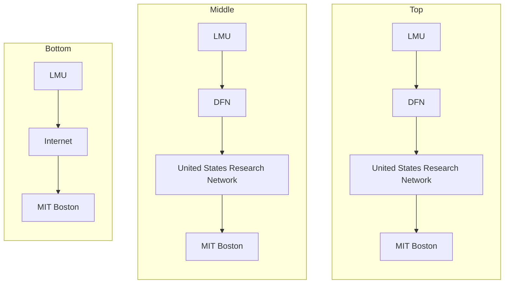
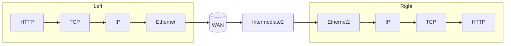
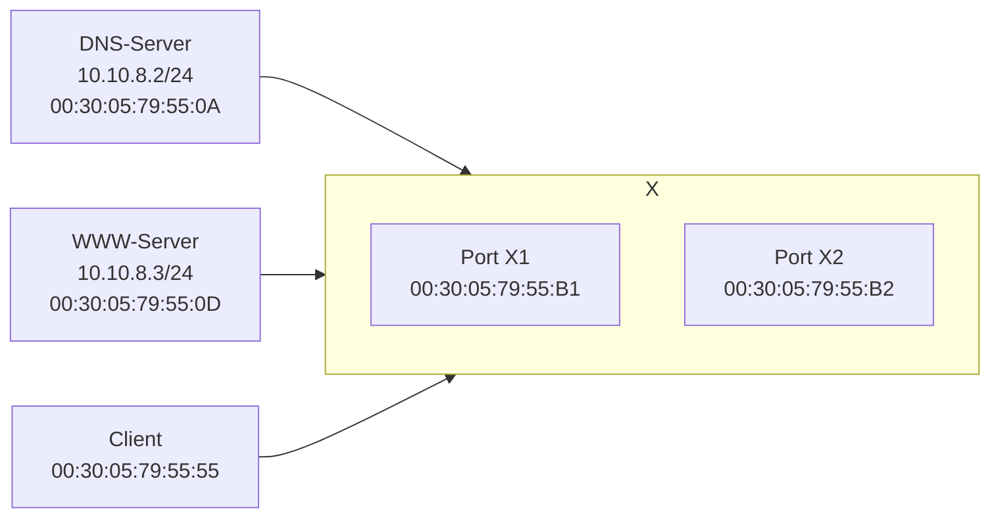
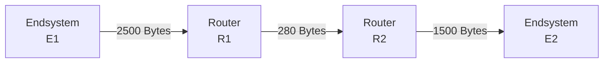
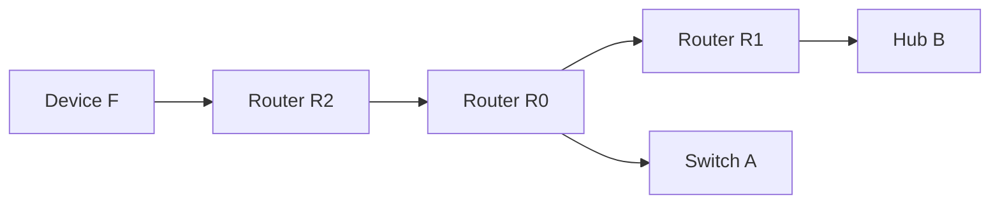
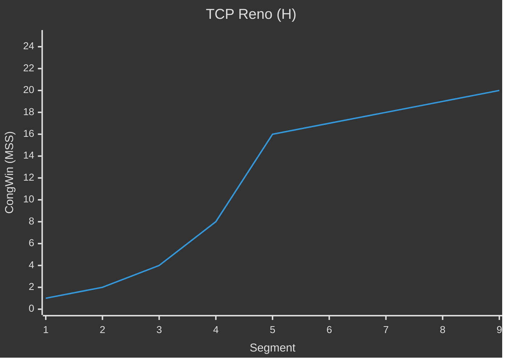

---
tags:
  - 4semester
  - informatik
  - RNVS
fach: "[[Rechnernetze und Verteilte Systeme (RNVS)]]"
Thema:
Benötigte Zeit:
date created: Sunday, 21. July 2024, 23:36
date modified: Monday, 22. July 2024, 00:33
---

# Rechnernetze und verteilte Systeme

## Klausur Sommersemester 2018

# Aufgabe 1

## Teilaufgabe a

**Welche der folgenden Aussagen zum OSI-Referenzmodell sind korrekt?**

- [ ] Die ISO/OSI-Schichten 1 bis 4 enthalten anwendungsorientierte Protokolle.
- [ ] Aufgabe von Protokollen der Transportschicht ist es, eine Ende-zu-Ende-Kommunikation zu ermöglichen.
- [ ] Für Wegwahl/Routing sind Protokolle der Vermittlungsschicht zuständig.
- [ ] Für zwischengelagerte Transitsysteme sind die ISO/OSI-Schichten 1 bis 3 relevant.

## Teilaufgabe b

**Welche der folgenden Eigenschaften haben verbindungsorientierte Dienste immer?**

- [ ] Die maximale Zeit für die Zustellung einer Nachricht wird garantiert.
- [ ] Auf einen Verbindungsaufbau kann verzichtet werden.
- [ ] Die Dienste sind immer der Transportschicht zuzuordnen.
- [ ] Es wird ein Kommunikationskanal zwischen zwei Endpunkten eingerichtet.

## Teilaufgabe c

**Zur Digitalisierung von analogen Daten sind folgende Schritte erforderlich:**

- [ ] Quantisierung
- [ ] Diskretisierung
- [ ] Modulation
- [ ] Codierung

## Teilaufgabe d

**Welche Aussagen treffen auf Block Check Character zu?**

- [ ] Es ist ein Verfahren zur Fehlererkennung.
- [ ] Es gehört zur Familie selbstkorrigierender Codes.
- [ ] Es überträgt zusätzliche Paritätsbits.
- [ ] Es erkennt alle zusammenhängenden Fehler.

## Teilaufgabe e

**Beim CRC-Verfahren wird ein Generatorpolynom $G = x^5 + x^3 + x + 1$ verwendet. Welche ist die richtige Darstellung dieses Polynoms als Bitfolge?**

- [ ] 110 101
- [ ] 110 10
- [ ] 101 011
- [ ] 110 011

## Teilaufgabe f

**Welche Aussagen über Network Adress Translation (NAT) treffen zu?**

- [ ] NAT betrifft Abläufe auf Vermittlungsschicht.
- [ ] NAT kann die Ports in TCP und UDP verändern.
- [ ] NAT maskiert private IP-Adressen.
- [ ] NAT verbessert die Leitungskodierung.

## Teilaufgabe g

**Bei Ethernet (IEEE 802.3) wird eine Mindestrahmenlänge festgelegt, weil …**

- [ ] Ethernet einen hierarchischen Adressraum benutzt.
- [ ] bei zu kurzem Rahmen der Konfliktparameter zu hoch wird.
- [ ] damit die Kollisionserkennung funktionieren kann.
- [ ] damit die Rahmengröße immer ein Vielfaches von 32 Bit ist.

## Teilaufgabe h

**Welche der folgenden Angaben stehen in jedem IPv4-Header?**

- [ ] Zielport
- [ ] IP-Adresse des Senders
- [ ] Ziel IP-Adresse
- [ ] IP-Adresse des nächsten Routers

## Teilaufgabe i

**Welche Aussagen über TCP-Flusssteuerung treffen zu?**

- [ ] Die Flusssteuerung entlastet den Sender.
- [ ] Die Flusssteuerung entlastet den Empfänger.
- [ ] Die Flusssteuerung dient zur Begrenzung der Anzahl von Verbindungen in Transitznetzen.
- [ ] Der Tahoe-Algorithmus ist ein Verfahren zur Flusssteuerung.
- [ ] TCP verwendet das Sliding-Window-Protokoll (Schiebefensterprotokoll) zur Flusssteuerung.

## Teilaufgabe j

**Welche Aussagen treffen auf DNS zu?**

- [ ] DNS bildet einen gegebenen Hostnamen auf höchstens eine IP-Adresse ab.
- [ ] DNS ist ein Protokoll der Anwendungsschicht.
- [ ] DNS bildet IP-Adressen auf MAC-Adressen ab.

---

# Aufgabe 3

## Wie entsteht eine Protocol Data Unit (PDU) aus einer Service Data Unit (SDU)?

## Eine Protokollinstanz der Schicht N tauscht PDUs mit ihrer Peer-Entity aus.

### 1. Auf welcher Schicht befindet sich die Peer-Entity?

### 2. An welche Schicht wird die PDU aus Schicht N übergeben?

## Schnittbildung: Ordnen Sie jeder der folgenden zwei Abbildungen einen der Begriffe `Dienstschnitt`, `Protokollschnitt` oder `Systemschnitt` zu.

### (a)



### (b)

> [!warning] Genaues Bild bitte aus Blatt entnehmen



# III. Domain Name System (DNS)

Gegeben sei folgende Konsolenausgabe einer DNS-Anfrage mit dig +trace www.ifi.lmu.de:

```
;; global options: +cmd
. 218188 IN NS h.root-servers.net.
. 218188 IN NS a.root-servers.net.
. 218188 IN NS c.root-servers.net.
. 218188 IN NS b.root-servers.net.
. 218188 IN NS d.root-servers.net.
. 218188 IN NS j.root-servers.net.
. 218188 IN NS f.root-servers.net.
. 218188 IN NS k.root-servers.net.
. 218188 IN NS m.root-servers.net.
. 218188 IN NS l.root-servers.net.
. 218188 IN NS i.root-servers.net.
. 218188 IN NS g.root-servers.net.
. 218188 IN NS e.root-servers.net.
;; Received 811 bytes from 85.214.20.141#53(85.214.20.141) in 18 ms

de. 172800 IN NS a.nic.de.
de. 172800 IN NS f.nic.de.
de. 172800 IN NS l.de.net.
de. 172800 IN NS n.de.net.
de. 172800 IN NS s.de.net.
de. 172800 IN NS z.nic.de.
;; Received 385 bytes from 193.0.14.129#53(k.root-servers.net) in 10 ms

lmu.de. 86400 IN NS dns1.lrz.de.
lmu.de. 86400 IN NS dns2.lrz.bayern.
lmu.de. 86400 IN NS dns3.lrz.eu.
;; Received 164 bytes from 194.246.96.1#53(z.nic.de) in 10 ms

www.ifi.lmu.de. 86400 IN CNAME stellenbosch.tcs.ifi.lmu.de
stellenbosch.tcs.ifi.lmu.de. 86400 IN A 141.84.94.144
tcs.ifi.lmu.de. 86400 IN NS ipa-s1.tcs.ifi.lmu.de.
tcs.ifi.lmu.de. 86400 IN NS kokytos.rz.informatik.uni-muenchen.de.
tcs.ifi.lmu.de. 86400 IN NS acheron.informatik.uni-muenchen.de.
;; Received 286 bytes from 141.40.9.211#53(dns2.lrz.bayern) in 1 ms
```

## 14.

### (a) Wie viele DNS-Anfragen waren nötig, um den Hostnamen www.ifi.lmu.de wie oben abgebildet aufzulösen?

### (b) Die URL http://www.ifi.lmu.de/ soll in einem Web-Browser angezeigt werden. Geben Sie die IPv4-Adresse des Rechners an, an den die http-Anfrage gestellt wird.

### (c) Ist die oben angeführte DNS-Anfrage rekursiv, iterativ oder hybrid? Warum?

## 15. Welches Transportprotokoll wird auf Schicht 4 des ISO/OSI-Referenzmodells bei DNS …

### (a) … für Zonentransfer eingesetzt?

### (b) … für DNS-Anfragen empfohlen?

---

# IV. Zusammenspiel verschiedener Protokolle

> [!note] Aufgabenstellung
> Das in der Abbildung skizzierte Netz besteht aus zwei Ethernets, die so mit einer noch nicht näher definierten Komponente X verbunden sind, dass Daten zwischen den Netzen übertragen werden können. Auf dem Client wird ein Browser-Programm ausgeführt, das eine Verbindung zu einem Webserver namens www aufbaut, um ein HTML-Dokument abzurufen.
>
> Annahmen:
>
> - der Client kennt die IPv4-Adresse des DNS-Servers
> - der Client kennt lediglich den Hostname www, nicht dessen IPv4-Adresse
> - der DNS-Server kennt alle Hostnamen und die zugehörigen IPv4-Adressen

> [!warning] Genaues Bild bitte aus Blatt entnehmen



## 16. Gehen Sie im Folgenden davon aus, dass Komponente X ein Switch und die IPv4-Adresse des Clients 10.10.8.4 mit 24-Bit langer Netz-ID ist.

### (a) An welche MAC-Adresse sendet der Client Rahmen, die DNS-Anfragen enthalten?

### (b) An welche MAC-Adresse sendet der Client Rahmen, die DNS-Anfragen enthalten?

> [!bug] Developers Notice
> Hier wird 2x nach `MAC` gefragt in dem Gedankenprotokoll. Ich gehe mal von aus es sollte einmal `IP-Adresse` sein.

### (b\*) An welche IP-Adresse sendet der Client Rahmen, die DNS-Anfragen enthalten?

## 17. Gehen Sie im Folgenden davon aus, dass Komponente X ein Router ist. Die IPv4-Adressen sind 192.168.1.2/28 für den Client, 192.168.1.1/28 für Port X1 des Routers und 10.10.8.1/24 für Port X2 des Routers.

### (a) An welche MAC-Adresse sendet der Client HTTP-Anfragen?

### (b) An welche IPv4-Adresse sendet der Client DNS-Anfragen?

### (c) An welche MAC-Adresse versendet der Router einen Rahmen, mit der Ziel-IP 10.10.8.3 und dem Ziel-UDP-Port 53 (Standardport für DNS)?

## 18. Warum benötigen die Ports eines Routers IPv4-Adressen um Daten zwischen den Netzen übertragen zu können, die Ports eines Switches jedoch nicht?

---

# V. Fragmentierung

> [!note] Aufgabenstellung
> Betrachten Sie ein Netz bestehend aus zwei Endsystemen und zwei Routern, die mittels dreier Kanäle A, B, C verbunden sind mit Maximum Transfer Units (MTU, in Bytes) wie folgt:
>
> - Kanal A: 2500 Bytes
> - Kanal B: 280 Bytes
> - Kanal C: 1500 Bytes
>
> Das Netz ist so konfiguriert, dass Fragmentierung in der Vermittlungsschicht durchgeführt wird. E1 schickt ein IPv4-Paket, das an E2 adressiert ist. (Hinweis: Byte = Oktett)



## 19. Nennen Sie die Komponenten, die das IP-Paket fragmentieren, wenn seine Gesamtlänge

### (a) 200 Byte beträgt.

### (b) 1000 Byte beträgt.

### (c) 2000 Byte beträgt.

## 20. Angenommen R1 soll folgendes IPv4-Paket an R2 weiterleiten:

| Header (20 Byte) | Nutzdaten (600 Byte) |

$$
\begin{array}{|c|c|}
\hline
\text{Header (20 Byte)} & \text{Nutzdaten (600 Byte)} \\
\hline
\end{array}


$$

### (a) Zeichnen Sie die Fragmente unter Angabe von Kopf- und Nutzdatenlänge (wie in der Aufgabenstellung), in der Reihenfolge, in der sie von R1 versendet werden!

| Fragmentnummer | Header-Länge | Nutzdatenlänge |
| -------------- | ------------ | -------------- |
|                |              |                |
|                |              |                |
|                |              |                |

### (b) Wie erkennt R2 beim ersten Fragment, dass es sich um ein Fragment handelt, dass es sich um ein Fragment handelt (und nicht um ein „vollständiges“ IPv4-Paket)?

---

# VI. Adressierung

## 21. Angenommen der Block `141.84.0.0/16` wird mit der Subnetzmaske `255.255.255.192` aufgeteilt. Wie viele Subnetze lassen sich damit maximal realisieren?

## 22. Bestimmen Sie die Broadcast-Adresse des Subnetzes `141.84.32.0/19`!

## 23. Notieren Sie die IPv6-Adresse `1337:0000:0000:0000:1000:0000:0000:0001` maximal verkürzt, so dass keine kürzere vollständige Darstellung dieser Adresse in IPv6 existiert.

## 24. Ein Internetanbieter erhält das Subnetz `2001:CDE0:0000:0000:0000:0000:0000:0000/27`. Dieses wird vollständig in vier gleich große Teilbereiche geteilt.

### (a) Geben Sie die Länge der Netz-ID der entstehenden Teilnetze in Anzahl der Bits an!

### (b) Schreiben Sie die vier entstehenden Subnetze in CIDR-Notation auf!

|     | CIDR-Notation |
| --- | ------------- |
| 1   |               |
| 2   |               |
| 3   |               |
| 4   |               |

---

# VII. Ethernet-Topologie

## 25. Gegeben sei die abgebildete Ethernet-Topologie.



### (a) Wie viele Kollisionsdomänen zeigt die Abbildung?

### (b) Vergeben Sie für die Rechner A, B, F und für die drei Schnittstellen des Routers je eine IPv6-Adresse, so dass alle Rechner in unterschiedlichen Subnetzen liegen und jeder Rechner den Router erreichen kann.

Benutzen Sie hierfür die Subnetze `fd00::a:0/112`, `fd00::b:0/112` sowie `fd00::f:0/112`.

| Rechner | IP-Adresse | Schnittstelle | IP-Adresse |
| ------- | ---------- | ------------- | ---------- |
| A       |            | `R0`          |            |
| B       |            | `R1`          |            |
| F       |            | `R2`          |            |

### (c) Schreiben Sie eine default-Route für die Routingtabelle von Rechner F, so dass IP-Nachrichten an die Rechner A und B korrekt weitergeleitet werden!

**Ziel Subnetz:**

**Erreichbar über:**

---

# VII. Transmission Control Protocol (TCP)

## 26. Überlastkontrolle

Die folgende Abbildung zeigt die zeitliche Entwicklung einer kritischen Kenngröße beim Tahoe-Algorithmus zur Überlastkontrolle. Der Ablauf ist in die Phasen a, b und c eingeteilt.



### (a) Wie lautet die korrekte Beschriftung für die y-Achse?

### (b) Benennen Sie Phase a:

### (c) Benennen Sie Phase b:

### (d) Was ist ein frühzeitiger Indikator für Segmentverlust, noch bevor ein `timeout` für ein Segment auftritt?

### (e) Nennen Sie ein Verfahren zur Optimierung des Überlastkontrollalgorithmus nach Auftreten eines `timeouts`.

<!-- Modal START -->
<div id="myModal" class="modal">
  <div class="modal-content">
    <span id="closeModal" class="close">&times;</span>
    <p class="modal-text">
      If MyUniNotes has been helpful and you’d like to support my efforts, <span class="modal-highlight"> you can contribute with a donation: <a class="modal-dono-link" href="https://paypal.me/myuninotes4u">Donate via PayPal</a> :) </span> Your support will help me continue improving the content, but there is no obligation to donate.
    </p>
    <p class="modal-text">
      <span class="modal-highlight">MyUniNotes is a personal, non-revenue project as I believe in accessible education for everyone.</span> I manage this project alongside my studies, with all materials handwritten by me trying to help others understand challenging concepts.
    </p>
  </div>
</div>

<script>
  // JavaScript to display the modal on page load
  document.addEventListener('DOMContentLoaded', function() {
    // Generate a random number between 1 and 1
    // Wanted it to load with a adjustable probability for every page load but did not work, as DOM is loaded only once. Therefore now loading it every time website is visited and DOM is loaded.
    const randomNumber = Math.floor(Math.random() * 1) + 1; 
    // console.log(randomNumber)
    if (randomNumber === 1) {
      setTimeout(function() {
        const modal = document.getElementById('myModal');
        if (modal) {
          modal.classList.add('show');
        }
      }, 1000); // Adjust the delay as needed

      const closeModal = document.getElementById('closeModal');
      if (closeModal) {
        closeModal.addEventListener('click', function() {
          const modal = document.getElementById('myModal');
          if (modal) {
            modal.classList.remove('show');
          }
        });
      }
    } else {
      // Ensure the modal is hidden if the random number is not 1
      const modal = document.getElementById('myModal');
      if (modal) {
        modal.style.display = 'none';
      }
    }
  });
</script>
<!-- Modal END -->

<!-- DISQUS SCRIPT COMMENT START -->

<!-- DISQUS RECOMMENDATION START -->

<div id="disqus_recommendations"></div>

<script> 
(function() { // REQUIRED CONFIGURATION VARIABLE: EDIT THE SHORTNAME BELOW
var d = document, s = d.createElement('script'); // IMPORTANT: Replace EXAMPLE with your forum shortname!
s.src = 'https://myuninotes.disqus.com/recommendations.js'; s.setAttribute('data-timestamp', +new Date());
(d.head || d.body).appendChild(s);
})();
</script>
<noscript>
Please enable JavaScript to view the 
<a href="https://disqus.com/?ref_noscript" rel="nofollow">
comments powered by Disqus.
</a>
</noscript>

<!-- DISQUS RECOMMENDATION END -->

<hr style="border: none; height: 2px; background: linear-gradient(to right, #f0f0f0, #ccc, #f0f0f0); margin-top: 4rem; margin-bottom: 5rem;">
<div id="disqus_thread"></div>
<script>
    /**
    *  RECOMMENDED CONFIGURATION VARIABLES: EDIT AND UNCOMMENT THE SECTION BELOW TO INSERT DYNAMIC VALUES FROM YOUR PLATFORM OR CMS.
    *  LEARN WHY DEFINING THESE VARIABLES IS IMPORTANT: https://disqus.com/admin/universalcode/#configuration-variables    */
    /*
    var disqus_config = function () {
    this.page.url = PAGE_URL;  // Replace PAGE_URL with your page's canonical URL variable
    this.page.identifier = PAGE_IDENTIFIER; // Replace PAGE_IDENTIFIER with your page's unique identifier variable
    };
    */
    (function() { // DON'T EDIT BELOW THIS LINE
    var d = document, s = d.createElement('script');
    s.src = 'https://myuninotes.disqus.com/embed.js';
    s.setAttribute('data-timestamp', +new Date());
    (d.head || d.body).appendChild(s);
    })();
</script>
<noscript>Please enable JavaScript to view the <a href="https://disqus.com/?ref_noscript">comments powered by Disqus.</a></noscript>

<!-- DISQUS SCRIPT COMMENT END -->
