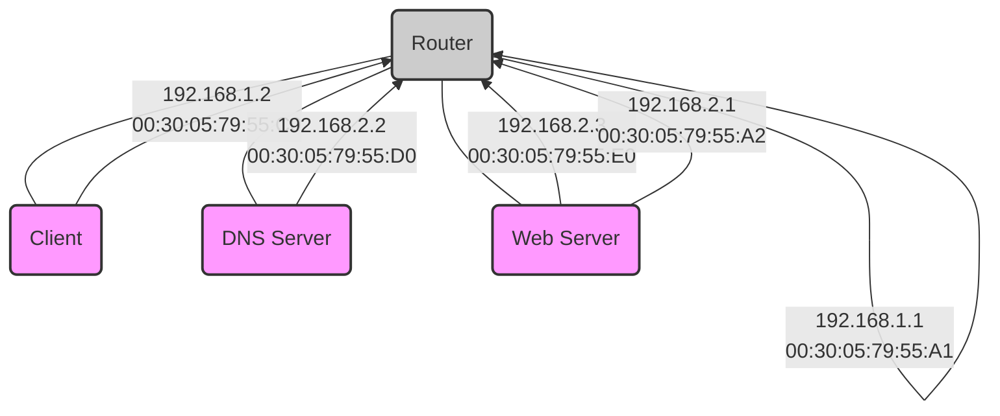
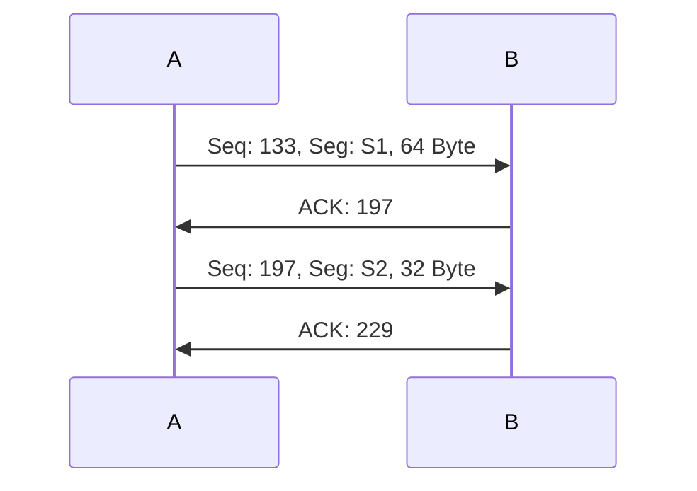
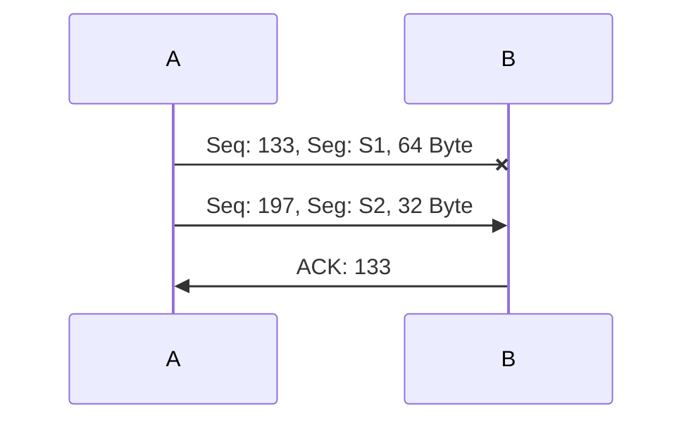

---
tags:
  - 4semester
  - informatik
  - RNVS
fach: "[[Rechnernetze und Verteilte Systeme (RNVS)]]"
Thema:
Benötigte Zeit:
date created: Thursday, 18. July 2024, 17:42
date modified: Saturday, 20. July 2024, 19:15
---

# ISO OSI-Schichtenmodell [[ISO-OSI-Modell]]

Ergänzen Sie die Namen der Schichten im ISO OSI-Schichtenmodell in Deutsch und Englisch und geben Sie je Schicht eine charakteristische Aufgabe an!

| Schicht | Name                                                 | Charakteristische Aufgabe                                             |
| ------- | ---------------------------------------------------- | --------------------------------------------------------------------- |
| 7       | + Anwendungsschicht<br>+ Application Layer           | Schnittstelle zwischen Anwendungen und dem Netzwerk                   |
| 6       | + Darstellungsschicht<br>+ Presentation Layer        | Stellt sicher, dass Daten für Anwendungsschicht verständlich sind     |
| 5       | + Kommunikationssteuerungsschicht<br>+ Session Layer | Verwaltet Sitzungen zwischen Anwendungen                              |
| 4       | + Transportschicht<br>+ Transport Layer              | sichere vollständige Datenübertragung zwischen Endsystemen            |
| 3       | + Vermittlungsschicht <br>+ Network Layer            | logische Addressierung und Bestimmung des Pfades zur Datenübertragung |
| 2       | + Sicherungsschicht<br>+ Data-Link Layer             | Sichere Datenübertragung zwischen zwei direkt verbundenen Geräten     |
| 1       | + Bitübertragungsschicht<br>+ Physical Layer         | Darstellen von Daten auf physikalischem Medium                        |

---

# Kommunikationsablauf

> [!bug] Hab keine Ahnung tbh
> Falls du mehr zu weisst schreib gerne einen Kommentar

<center>

</center>

Das in der Abbildung skizzierte Netz besteht aus zwei Ethernets, die so mit einem Router verbunden sind, dass IPv4-Pakete zwischen ihnen vermittelt werden. Auf dem Client wird ein Browser-Programm ausgeführt, das eine Verbindung zu einem Webserver namens www aufbaut, um ein HTML-Dokument abzurufen.

**GENAUES BILD BITTE AUS BLATT ENTNEHMEN**

```
Client (192.168.1.2)
  |
  | 00:30:05:79:55:C0
  |
Router (192.168.1.1)
  |
  | 00:30:05:79:55:A1
  |
DNS Server (192.168.2.2)
  |
  | 00:30:05:79:55:D0
  |
Web-Server (192.168.2.3)
  |
  | 00:30:05:79:55:E0
```



These representations provide a visual breakdown of the network communication flow as described in your document.

## Hinweise:

- DNS-Server ist autoritativ für alle Teilnehmer in der Abbildung.
- Caches (ARP, DNS):
  - Empfängeradressen und die letzten 2 Byte der IPv4-Adressen nur die letzten 2 Byte.
  - Die direkt angebundenen Adressen werden aggressiv gespeichert.
  - Nicht auf jeder Schicht N passt immer in eine PDU der Schicht N+1.
  - Verwaltung des Übertragungsfehlers, Verhältnis der verwerften Nachrichten.
- Der Client kennt:
  - Die Adresse eines lokalen DNS-Servers,
  - Die URL des aufzurufenden Web-Objekts und die Default-Route über 1.1.

---

Vervollständigen Sie in der folgenden Tabelle die Kommunikation aller Teilnehmer auf den OSI-Schichten 2, 3 und 4, bis eine TCP-Verbindung zwischen Client und Webserver vollständig aufgebaut ist (heißt: alle relevanten Pakete wurden zugestellt).

| Pkt | MAC-Adr von | MAC-Adr zu | IP-Adr von | IP-Adr zu | Port von | Port zu | TCP Flags | Payload/Erklärung       |
| --- | ----------- | ---------- | ---------- | --------- | -------- | ------- | --------- | ----------------------- |
| 1   | :C0         | B-Cast     | -          | -         | -        | -       | -         | ARP: wer hat .1?        |
| 2   |             |            | -          | -         | -        | -       | -         | ARP: ich habe .1!       |
| 3   |             |            |            |           | 12345    | -       | -         | DNS Query: www?         |
| 4   |             |            |            |           |          |         |           | ARP: wer hat .2?        |
| 5   |             |            |            |           |          |         |           | ARP: ich habe .2!       |
| 6   |             |            |            |           |          |         |           |                         |
| 7   |             |            |            |           | 12345    | -       |           |                         |
| 8   |             |            |            |           |          |         |           |                         |
| 9   |             | 4711       |            |           |          |         |           | Verbindungsaufbauwunsch |
| 10  |             | B-Cast     |            |           |          |         |           |                         |
| 11  | :E0         |            |            |           |          |         |           |                         |
| 12  |             | 4711       |            |           |          |         |           |                         |
| 13  |             | 4711       |            |           |          |         |           |                         |
| 14  |             |            |            |           |          |         | ACK       |                         |
| 15  |             |            |            |           |          |         |           |                         |
| 16  |             | 4711       |            |           |          |         |           |                         |

---

# Transmission Control Protocol (TCP)

## (a) Zwei Hosts A und B kommunizieren über eine bereits bestehende TCP Verbindung.

- Host B hat bereits 132 Bytes von Host A vollständig empfangen.
- Host A sendet zwei weitere Segmente S<sub>1</sub> (Länge: 64 Bytes) sowie S<sub>2</sub> (Länge 32 Bytes).
- Die Sequenznummer von S<sub>1</sub> ist 133.
- Host B bestätigt jedes von Host A empfangene Segment mit einem Acknowledgement (ACK).

### i. Wie lautet die Sequenznummer bei S<sub>2</sub> von Host A an B?

- Host $B$ hat schon 132 Bytes erhalten
- Dementsprechend beginnt die nächste Sequenz von S1 mit 133
- Da S1 64 Byte groß ist schickt B eine ACK mit 197, da $133+64=197$
- S2 beginnt nun mit Seq 197 und schickt 32 Byte
- $197+32=229$

**Antwort:** $S_2$ hat die Sequenznummer $197$



(1)

### ii. Falls S<sub>1</sub> vor S<sub>2</sub> bei B eintrifft: Wie lautet die ACK-Nummer in der Quittung auf S<sub>1</sub>?

**Antwort:** $Seq_{ACK}$ lautet $197$


(1)

### iii. Falls S<sub>1</sub> nach S<sub>2</sub> bei B eintrifft: Wie lautet in der entsprechenden Quittung die ACK-Nummer?

**Antwort:** $133$ da B Seq 133 erwartet und da diese nicht in der richtigen Reihenfolge angekommen ist, dies bemerkbar macht, indem es 133 als ACK schickt

> [!abstract]- detaillierte Erklärung
> In der TCP-Kommunikation hat jedes Segment eine Sequenznummer, die die Byte-Nummer des ersten Bytes in diesem Segment angibt. Der Empfänger bestätigt den Empfang von Bytes, indem er eine Bestätigungsnummer (ACK) sendet, die das nächste erwartete Byte angibt.
>
> Hier ist eine detaillierte Übersicht des Szenarios:
>
> 1. **Anfangszustand**:
>    - Host B hat 132 Bytes von Host A empfangen.
>    - Das nächste erwartete Byte hat die Sequenznummer 133.
> 2. **Von Host A gesendete Segmente**:
>    - Segment $S_1$ hat eine Länge von 64 Bytes und beginnt mit der Sequenznummer 133.
>    - Segment $S_2$ hat eine Länge von 32 Bytes und beginnt mit der Sequenznummer 197 (da 133 + 64 = 197).
> 3. **Reihenfolge des Empfangs**:
>    - Segment $S_2$ wird zuerst von Host B empfangen.
>    - Die Sequenznummer von $S_2$ ist 197 und seine Länge beträgt 32 Bytes. Es deckt die Bytes 197 bis 228 ab.
>
> Da $S_2$ zuerst empfangen wird, aber Host B die Bytes 133 bis 196 (die Daten in $S_1$) noch nicht empfangen hat, kann Host B die Daten in $S_2$ nicht sofort bestätigen. TCP-Bestätigungen sind kumulativ, das bedeutet, Host B kann nur bis zum höchsten in Reihenfolge empfangenen Byte bestätigen.
>
> 4. **ACK-Nummer nach Empfang von $S_2$ vor $S_1$**:
>    - Das zuletzt bestätigte Byte von Host B vor dem Empfang von $S_2$ war 132.
>    - Trotz des Empfangs von $S_2$ wartet Host B immer noch auf die fehlenden Daten von $S_1$.
>    - Daher wird Host B eine Bestätigung (ACK) senden, die angibt, dass das nächste erwartete Byte 133 ist.
>
> Daher lautet die ACK-Nummer, die Host B nach dem Empfang von $S_2$ vor $S_1$ sendet, **133**



(1)

## (b) Das Diagramm zeigt die Zustände und Zustandsübergänge in einem TCP-basierten Client. Ergänzen Sie den Text in den weißen Flächen!

**GENAUES BILD BITTE AUS BLATT ENTNEHMEN**

### Zustände und Übergänge:

1. **CLOSED** -> **SYN_SENT**: "\_\_\_ senden" (send)
2. **SYN_SENT** -> **SYN-ACK empfangen**: "\_\_\_ empfangen" (receive)
3. **SYN_SENT** -> **ESTABLISHED**: "\_\_\_ senden" (send)
4. **ESTABLISHED** -> **FIN_WAIT_1**: "FIN senden" (send FIN)
5. **FIN_WAIT_1** -> **FIN_WAIT_2**: "ACK empfangen (nichts senden)" (ACK received, send nothing)
6. **FIN_WAIT_2** -> **TIME_WAIT**: "\_\_\_ empfangen" (receive)
7. **TIME_WAIT** -> **CLOSED**: "warten" (wait)

Lassen Sie uns die Lücken basierend auf dem Diagramm und den typischen TCP-Zustandsübergängen ausfüllen:

1. **CLOSED** -> **SYN_SENT**: "SYN senden"
2. **SYN_SENT** -> **SYN-ACK empfangen**: "SYN-ACK empfangen"
3. **SYN_SENT** -> **ESTABLISHED**: "ACK senden"
4. **ESTABLISHED** -> **FIN_WAIT_1**: "FIN senden"
5. **FIN_WAIT_1** -> **FIN_WAIT_2**: "ACK empfangen (nichts senden)"
6. **FIN_WAIT_2** -> **TIME_WAIT**: "FIN empfangen"
7. **TIME_WAIT** -> **CLOSED**: "warten"

---

# Internet Protocol

## (a) Beantworten Sie folgende Fragen zu Subnetzen.

### i. Wie lang (in Bits) darf eine Netz-ID für ein IPv4-basiertes Subnetz mit 58 Hosts höchstens sein?

$$
\begin{aligned}
\text{Bits die für Hosts benötigt werden}&: \ 2^{n}-2\\
\text{Für welches n gilt}&: 2^{n}-2 \geq 58 \ ?\\
\text{Für n = 6 }&: 2^{6}-2 \geq 58 \ \\
&= 62 \geq 58 \ \\
\end{aligned}
$$

Dadurch:

$$
\begin{aligned}
\text{6 von den 32 Bits von IPv4 } &werden \text{ für die Hosts benötigt.}\\
\\
&{32-6 = 26}\\
\\
\text{Die restlichen } &26 \text{ sind für die Netz-ID}
\end{aligned}
$$

(1)

### ii. Wie lautet die Netzmaske für das Subnetz 192.168.218.48/28? Machen Sie ihre Angabe in der Form r.s.p.q mit r, s, p, q ∈ {0, …, 255}, d.h. in dezimaler Schreibweise.

- Beachte die 28 am Ende `192.168.218.48/28`
- Die 28 stehen prinzipiell für die Anzahl an `1`-ern
- Schreiben das nun in Binär um

$$
11111111.11111111.11111111.11110000
$$

- Das nun wieder in Dezimal umgerechnet ist:

| 128 | 64  | 32  | 16  | 8   | 4   | 2   | 1   |
| --- | --- | --- | --- | --- | --- | --- | --- |
| 1   | 1   | 1   | 1   | 0   | 0   | 0   | 0   |

$$
255.255.255.240
$$

**Anwort:** Die Subnetzmaske lautet $255.255.255.240$

(1)

### iii. Wie lautet die Broadcast-Adresse für das Subnetz 192.168.218.48/28?

- Beachte die 28 am Ende `192.168.218.48/28`
- Die 28 stehen prinzipiell für die Anzahl an `1`-ern
- Schreiben das nun in Binär um

$$
11111111.11111111.11111111.11110000
$$

- Zähle nun die `0`-er hinten beginnend
- **DIESE WERDEN NUN AUFADDIERT! NICHT DIE** `1er` **TERME**

| 128 | 64  | 32  | 16  | 8   | 4   | 2   | 1   |
| --- | --- | --- | --- | --- | --- | --- | --- |
| 0   | 0   | 0   | 0   | 1   | 1   | 1   | 1   |

$$
1+2+4+8=15
$$

**Als nächstes:**

- Nehme das Subnetz `192.168.218.48` ohne die `/28`
- Addiere die davor zusammenaddierten `O`-er Terme auf das Ende des Subnetzes

$$
\begin{array}{r@{}l}
   & 192.168.218.48 \\
+ & \hspace{5.4em}15 \\
\hline
   & 192.168.218.63
\end{array}
$$

**Antwort:** Die Broadcast Adresse lautet $192.168.218.63$

(1)

## (b) Nennen Sie einen Fall, in dem IPv4-Pakete fragmentiert werden müssen!

**Antwort:** Wenn die Paketgröße größer ist als die maximale Übertragungseinheit (MTU) des Netzwerkes

(1)

## (c) Im Internet kann mittels des Internet Control Message Protocol (ICMP) signalisiert werden, dass kein Weg zum Ziel eines IP-Paketes ermittelt werden kann (destination unreachable). Nennen Sie zwei weitere Meldungen, die mittels ICMP gesendet bzw. empfangen werden können!

- Time Exceeded (Zeitablauf)
- Echo Reply

_Weitere:_

- Destination unreachable (Aufgabenstellung genannt)
- Echo Request
- Source Quench
- Redirect
- Router Advertisement
- Router Solicitation
- Address Mask Request
- Address Mask Reply
- Timestamp Request
- Timestamp Reply

(2)

---

# Wegewahl

<center>
<a href="https://imgflip.com/i/8xh0bt"></a>
</center>

Der in der Grafik dargestellte Router 0 hat folgende Routingtabelle:

| Ziel/Maske     | Next Hop        |
| -------------- | --------------- |
| 135.46.56.0/22 | Schnittstelle A |
| 135.46.60.0/22 | Schnittstelle B |
| 192.53.40.0/23 | Router 1        |
| default        | Router 2        |

## (a) Wie leitet Router 0 IPv4 Pakete anhand ihrer Ziel-Adressen weiter? Vervollständigen Sie die folgende Tabelle!

(4)

| Ziel-IP-Adresse | Schnittstelle / Nexthop |
| --------------- | ----------------------- |
| 135.46.63.10    | Schnittstelle B         |
| 135.46.57.14    | Schnittstelle A         |
| 135.46.52.2     | Router 2                |
| 192.53.40.7     | Router 1                |

### Erklärung:

1. **135.46.63.10**

   - **Netzwerk:** 135.46.60.0/22
   - **Entscheidung:** Schnittstelle B (135.46.60.0/22 deckt 135.46.60.0 - 135.46.63.255 ab)

2. **135.46.57.14**

   - **Netzwerk:** 135.46.56.0/22
   - **Entscheidung:** Schnittstelle A (135.46.56.0/22 deckt 135.46.56.0 - 135.46.59.255 ab)

3. **135.46.52.2**

   - **Netzwerk:** 135.46.56.0/22
   - **Entscheidung:** Schnittstelle A (135.46.56.0/22 deckt 135.46.52.0 - 135.46.55.255 ab)

4. **192.53.40.7**
   - **Netzwerk:** 192.53.40.0/23
   - **Entscheidung:** Router 1 (192.53.40.0/23 deckt 192.53.40.0 - 192.53.41.255 ab)

## (b) Router 0 empfängt ein IPv4-Paket von 135.46.56.2 an 141.84.111.7 mit einer TTL von 2 weiter.

### i. An welche IPv4 Adresse wird die ICMP Fehlermachricht geschickt?

(2)

Die ICMP-Fehlermeldung wird an die Quell-IP-Adresse des empfangenen Pakets geschickt.

- **Antwort:** 135.46.56.2

### ii. Ist anhand der vorliegenden Informationen entscheidbar, ob bzw. an welcher Schnittstelle Router 0 die Fehlermeldung empfängt? Begründen Sie Ihre Antwort!

(2)

Nein, es ist nicht entscheidbar, an welcher Schnittstelle Router 0 die Fehlermeldung empfängt. Die Information über die Schnittstelle, an der das Paket empfangen wurde, fehlt.

- **Antwort:** Es ist nicht entscheidbar, da die spezifische Eingangs-Schnittstelle für das Paket 135.46.56.2 an 141.84.111.7 nicht angegeben ist.

## (c) Zwischen autonomen Systemen werden andere Routing-Protokolle eingesetzt als innerhalb. Nennen Sie einen Grund dafür (mit kurzer Erklärung)!

(1)

Ein Grund dafür ist die **Skalierbarkeit**:

- **Erklärung:** Innerhalb eines autonomen Systems (AS) können Routing-Protokolle wie OSPF oder EIGRP verwendet werden, die auf detaillierte Informationen und häufige Updates setzen. Zwischen autonomen Systemen ist die Anzahl der Netzwerke viel größer, sodass Protokolle wie BGP (Border Gateway Protocol) verwendet werden, die effizienter mit großen Mengen an Routing-Informationen umgehen können und stabilere Pfade wählen.

---

# Cyclic Redundancy Check [[RNVS-Blatt-12]]

## (a) Gegeben sei das Generatorpolynom $G = x^3 + 1$

### i. Durch wie viele Bits wird $G$ bei CRC repräsentiert?

(1)

$$
4 \ Bits
$$

Da:

$$
\begin{aligned}
G &= x^3 + 1\\
&= 1x^{3}+ 0x^{2} + 0x^{1} + 1x^{0}
\end{aligned}
$$

**Antwort:** $G$ wird somit durch die 4 Bits $1001$ repräsentiert

### ii. Es soll die Nachricht $110011$ CRC-geschützt übertragen werden. Berechnen Sie die zu übertragende Bitfolge (inkl. CRC-Prüfsumme) unter Verwendung des Generatorpolynoms $G$.

- Nachricht zunächst um den Grad von $G$ erweitern
- Der Grad (höchster Exponent) ist 3

$$
110011  \cdot2^{3} = 110011000
$$

- Es werden einfach `0`-er entsprechend des Grades angereiht

- Nun dividieren wir mit dem $XOR \ (\oplus)$ - Operator und den Bits welche $G$ repräsentieren
- Zur Erinnerung:

| A   | B   | A ⊕ B |
| --- | --- | ----- |
| 0   | 0   | 0     |
| 0   | 1   | 1     |
| 1   | 0   | 1     |
| 1   | 1   | 0     |

- Erster Schritt

```plaintext

110011000 : 1001 =
1001
------
0101


```

- Ziehe die Nächste Zahl von `110011000` mit runter

```plaintext

\\\\11000 : 1001 =
1001
------
01011
 1001
------
 0010


```

- Ziehe die Nächste Zahl von `110011000` mit runter, die hinten stehenden `0`-er müssen nicht mitgezogen werden

```plaintext

\\\\\1000 : 1001 =
1001
------
01011
 1001
------
000101
  1001
 -----
001100
  1001
 -----
  0101

→ 101 ist das Restergebnis
```

$\Longrightarrow$ $101$ ist der Rest der $XOR$ - Division und gleichzeitig auch die $CRC-Prüfsumme$
**Rest = CRC-Prüfsumme**

- Die zu übertragende Bitfolge berechnet sich nun wie folgt:

$$
\begin{aligned}
\text{Nachricht} + \text{CRC} &= \text{CRC-Geschützte Nachricht}\\
110011000 + 101 &= 110011101
\end{aligned}
$$

**Antwort:** Die zu übertragende Bitfolge lautet: $110011101$
(3)

### iii. Nehmen Sie an, dass Sie die CRC-geschützte Bitfolge $10011001$ empfangen haben. Zeigen Sie, dass die empfangene Bitfolge unter Verwendung des Generatorpolynoms $G$ korrekt ist (inkl. Rechnung). Markieren Sie in Ihrer Rechnung die Stelle, an der der Empfänger die Korrektheit ablesen kann.

- Die CRC geschütze Bitfolge ist korrekt, falls die $XOR$- Divison mit $G$ den Rest $0$ ergibt

```plaintext

10011001 : 1001 =
1001
----
00001001 → Ignoriere alle vorangestellten 0-er
	1001
	----
	0000 → REST IST NULL

```

- Die Division ergibt $Rest = 0$

**Antwort:** Da die Division Rest Null ergibt, ist die Empfagene Bitfolge unter Verwendung des Generatorpolynoms $G$ korrekt
(3)

Seite 8 von 8

<!-- Modal START -->
<div id="myModal" class="modal">
  <div class="modal-content">
    <span id="closeModal" class="close">&times;</span>
    <p class="modal-text">
      If MyUniNotes has been helpful and you’d like to support my efforts, <span class="modal-highlight"> you can contribute with a donation: <a class="modal-dono-link" href="https://paypal.me/myuninotes4u">Donate via PayPal</a> :) </span> Your support will help me continue improving the content, but there is no obligation to donate.
    </p>
    <p class="modal-text">
      <span class="modal-highlight">MyUniNotes is a personal, non-revenue project as I believe in accessible education for everyone.</span> I manage this project alongside my studies, with all materials handwritten by me trying to help others understand challenging concepts.
    </p>
  </div>
</div>

<script>
  // JavaScript to display the modal on page load
  document.addEventListener('DOMContentLoaded', function() {
    // Generate a random number between 1 and 1
    // Wanted it to load with a adjustable probability for every page load but did not work, as DOM is loaded only once. Therefore now loading it every time website is visited and DOM is loaded.
    const randomNumber = Math.floor(Math.random() * 1) + 1; 
    // console.log(randomNumber)
    if (randomNumber === 1) {
      setTimeout(function() {
        const modal = document.getElementById('myModal');
        if (modal) {
          modal.classList.add('show');
        }
      }, 1000); // Adjust the delay as needed

      const closeModal = document.getElementById('closeModal');
      if (closeModal) {
        closeModal.addEventListener('click', function() {
          const modal = document.getElementById('myModal');
          if (modal) {
            modal.classList.remove('show');
          }
        });
      }
    } else {
      // Ensure the modal is hidden if the random number is not 1
      const modal = document.getElementById('myModal');
      if (modal) {
        modal.style.display = 'none';
      }
    }
  });
</script>
<!-- Modal END -->

<!-- DISQUS SCRIPT COMMENT START -->

<!-- DISQUS RECOMMENDATION START -->

<div id="disqus_recommendations"></div>

<script> 
(function() { // REQUIRED CONFIGURATION VARIABLE: EDIT THE SHORTNAME BELOW
var d = document, s = d.createElement('script'); // IMPORTANT: Replace EXAMPLE with your forum shortname!
s.src = 'https://myuninotes.disqus.com/recommendations.js'; s.setAttribute('data-timestamp', +new Date());
(d.head || d.body).appendChild(s);
})();
</script>
<noscript>
Please enable JavaScript to view the 
<a href="https://disqus.com/?ref_noscript" rel="nofollow">
comments powered by Disqus.
</a>
</noscript>

<!-- DISQUS RECOMMENDATION END -->

<hr style="border: none; height: 2px; background: linear-gradient(to right, #f0f0f0, #ccc, #f0f0f0); margin-top: 4rem; margin-bottom: 5rem;">
<div id="disqus_thread"></div>
<script>
    /**
    * RECOMMENDED CONFIGURATION VARIABLES: EDIT AND UNCOMMENT THE SECTION BELOW TO INSERT DYNAMIC VALUES FROM YOUR PLATFORM OR CMS.
    * LEARN WHY DEFINING THESE VARIABLES IS IMPORTANT: https://disqus.com/admin/universalcode/#configuration-variables */
    /*
    var disqus_config = function () {
    this.page.url = PAGE_URL; // Replace PAGE_URL with your page's canonical URL variable
    this.page.identifier = PAGE_IDENTIFIER; // Replace PAGE_IDENTIFIER with your page's unique identifier variable
    };
    */
    (function() { // DON'T EDIT BELOW THIS LINE
    var d = document, s = d.createElement('script');
    s.src = 'https://myuninotes.disqus.com/embed.js';
    s.setAttribute('data-timestamp', +new Date());
    (d.head || d.body).appendChild(s);
    })();
</script>
<noscript>Please enable JavaScript to view the <a href="https://disqus.com/?ref_noscript">comments powered by Disqus.</a></noscript>

<!-- DISQUS SCRIPT COMMENT END -->

<!-- Modal START -->
<div id="myModal" class="modal">
  <div class="modal-content">
    <span id="closeModal" class="close">&times;</span>
    <p class="modal-text">
      If MyUniNotes has been helpful and you’d like to support my efforts, <span class="modal-highlight"> you can contribute with a donation: <a class="modal-dono-link" href="https://paypal.me/myuninotes4u">Donate via PayPal</a> :) </span> Your support will help me continue improving the content, but there is no obligation to donate.
    </p>
    <p class="modal-text">
      <span class="modal-highlight">MyUniNotes is a personal, non-revenue project as I believe in accessible education for everyone.</span> I manage this project alongside my studies, with all materials handwritten by me trying to help others understand challenging concepts.
    </p>
  </div>
</div>

<script>
  // JavaScript to display the modal on page load
  document.addEventListener('DOMContentLoaded', function() {
    // Generate a random number between 1 and 1
    // Wanted it to load with a adjustable probability for every page load but did not work, as DOM is loaded only once. Therefore now loading it every time website is visited and DOM is loaded.
    const randomNumber = Math.floor(Math.random() * 1) + 1; 
    // console.log(randomNumber)
    if (randomNumber === 1) {
      setTimeout(function() {
        const modal = document.getElementById('myModal');
        if (modal) {
          modal.classList.add('show');
        }
      }, 1000); // Adjust the delay as needed

      const closeModal = document.getElementById('closeModal');
      if (closeModal) {
        closeModal.addEventListener('click', function() {
          const modal = document.getElementById('myModal');
          if (modal) {
            modal.classList.remove('show');
          }
        });
      }
    } else {
      // Ensure the modal is hidden if the random number is not 1
      const modal = document.getElementById('myModal');
      if (modal) {
        modal.style.display = 'none';
      }
    }
  });
</script>
<!-- Modal END -->

<!-- Modal START -->
<div id="myModal" class="modal">
  <div class="modal-content">
    <span id="closeModal" class="close">&times;</span>
    <p class="modal-text">
      If MyUniNotes has been helpful and you’d like to support my efforts, <span class="modal-highlight"> you can contribute with a donation: <a class="modal-dono-link" href="https://paypal.me/myuninotes4u">Donate via PayPal</a> :) </span> Your support will help me continue improving the content, but there is no obligation to donate.
    </p>
    <p class="modal-text">
      <span class="modal-highlight">MyUniNotes is a personal, non-revenue project as I believe in accessible education for everyone.</span> I manage this project alongside my studies, with all materials handwritten by me trying to help others understand challenging concepts.
    </p>
  </div>
</div>

<script>
  // JavaScript to display the modal on page load
  document.addEventListener('DOMContentLoaded', function() {
    // Generate a random number between 1 and 1
    // Wanted it to load with a adjustable probability for every page load but did not work, as DOM is loaded only once. Therefore now loading it every time website is visited and DOM is loaded.
    const randomNumber = Math.floor(Math.random() * 1) + 1; 
    // console.log(randomNumber)
    if (randomNumber === 1) {
      setTimeout(function() {
        const modal = document.getElementById('myModal');
        if (modal) {
          modal.classList.add('show');
        }
      }, 1000); // Adjust the delay as needed

      const closeModal = document.getElementById('closeModal');
      if (closeModal) {
        closeModal.addEventListener('click', function() {
          const modal = document.getElementById('myModal');
          if (modal) {
            modal.classList.remove('show');
          }
        });
      }
    } else {
      // Ensure the modal is hidden if the random number is not 1
      const modal = document.getElementById('myModal');
      if (modal) {
        modal.style.display = 'none';
      }
    }
  });
</script>
<!-- Modal END -->

<!-- Modal START -->
<div id="myModal" class="modal">
  <div class="modal-content">
    <span id="closeModal" class="close">&times;</span>
    <p class="modal-text">
      If MyUniNotes has been helpful and you’d like to support my efforts, <span class="modal-highlight"> you can contribute with a donation: <a class="modal-dono-link" href="https://paypal.me/myuninotes4u">Donate via PayPal</a> :) </span> Your support will help me continue improving the content, but there is no obligation to donate.
    </p>
    <p class="modal-text">
      <span class="modal-highlight">MyUniNotes is a personal, non-revenue project as I believe in accessible education for everyone.</span> I manage this project alongside my studies, with all materials handwritten by me trying to help others understand challenging concepts.
    </p>
  </div>
</div>

<script>
  // JavaScript to display the modal on page load
  document.addEventListener('DOMContentLoaded', function() {
    // Generate a random number between 1 and 1
    // Wanted it to load with a adjustable probability for every page load but did not work, as DOM is loaded only once. Therefore now loading it every time website is visited and DOM is loaded.
    const randomNumber = Math.floor(Math.random() * 1) + 1; 
    // console.log(randomNumber)
    if (randomNumber === 1) {
      setTimeout(function() {
        const modal = document.getElementById('myModal');
        if (modal) {
          modal.classList.add('show');
        }
      }, 1000); // Adjust the delay as needed

      const closeModal = document.getElementById('closeModal');
      if (closeModal) {
        closeModal.addEventListener('click', function() {
          const modal = document.getElementById('myModal');
          if (modal) {
            modal.classList.remove('show');
          }
        });
      }
    } else {
      // Ensure the modal is hidden if the random number is not 1
      const modal = document.getElementById('myModal');
      if (modal) {
        modal.style.display = 'none';
      }
    }
  });
</script>
<!-- Modal END -->

<!-- Modal START -->
<div id="myModal" class="modal">
  <div class="modal-content">
    <span id="closeModal" class="close">&times;</span>
    <p class="modal-text">
      If MyUniNotes has been helpful and you’d like to support my efforts, <span class="modal-highlight"> you can contribute with a donation: <a class="modal-dono-link" href="https://paypal.me/myuninotes4u">Donate via PayPal</a> :) </span> Your support will help me continue improving the content, but there is no obligation to donate.
    </p>
    <p class="modal-text">
      <span class="modal-highlight">MyUniNotes is a personal, non-revenue project as I believe in accessible education for everyone.</span> I manage this project alongside my studies, with all materials handwritten by me trying to help others understand challenging concepts.
    </p>
  </div>
</div>

<script>
  // JavaScript to display the modal on page load
  document.addEventListener('DOMContentLoaded', function() {
    // Generate a random number between 1 and 1
    // Wanted it to load with a adjustable probability for every page load but did not work, as DOM is loaded only once. Therefore now loading it every time website is visited and DOM is loaded.
    const randomNumber = Math.floor(Math.random() * 1) + 1; 
    // console.log(randomNumber)
    if (randomNumber === 1) {
      setTimeout(function() {
        const modal = document.getElementById('myModal');
        if (modal) {
          modal.classList.add('show');
        }
      }, 1000); // Adjust the delay as needed

      const closeModal = document.getElementById('closeModal');
      if (closeModal) {
        closeModal.addEventListener('click', function() {
          const modal = document.getElementById('myModal');
          if (modal) {
            modal.classList.remove('show');
          }
        });
      }
    } else {
      // Ensure the modal is hidden if the random number is not 1
      const modal = document.getElementById('myModal');
      if (modal) {
        modal.style.display = 'none';
      }
    }
  });
</script>
<!-- Modal END -->

<!-- Modal START -->
<div id="myModal" class="modal">
  <div class="modal-content">
    <span id="closeModal" class="close">&times;</span>
    <p class="modal-text">
      If MyUniNotes has been helpful and you’d like to support my efforts, <span class="modal-highlight"> you can contribute with a donation: <a class="modal-dono-link" href="https://paypal.me/myuninotes4u">Donate via PayPal</a> :) </span> Your support will help me continue improving the content, but there is no obligation to donate.
    </p>
    <p class="modal-text">
      <span class="modal-highlight">MyUniNotes is a personal, non-revenue project as I believe in accessible education for everyone.</span> I manage this project alongside my studies, with all materials handwritten by me trying to help others understand challenging concepts.
    </p>
  </div>
</div>

<script>
  // JavaScript to display the modal on page load
  document.addEventListener('DOMContentLoaded', function() {
    // Generate a random number between 1 and 1
    // Wanted it to load with a adjustable probability for every page load but did not work, as DOM is loaded only once. Therefore now loading it every time website is visited and DOM is loaded.
    const randomNumber = Math.floor(Math.random() * 1) + 1; 
    // console.log(randomNumber)
    if (randomNumber === 1) {
      setTimeout(function() {
        const modal = document.getElementById('myModal');
        if (modal) {
          modal.classList.add('show');
        }
      }, 1000); // Adjust the delay as needed

      const closeModal = document.getElementById('closeModal');
      if (closeModal) {
        closeModal.addEventListener('click', function() {
          const modal = document.getElementById('myModal');
          if (modal) {
            modal.classList.remove('show');
          }
        });
      }
    } else {
      // Ensure the modal is hidden if the random number is not 1
      const modal = document.getElementById('myModal');
      if (modal) {
        modal.style.display = 'none';
      }
    }
  });
</script>
<!-- Modal END -->

<!-- Modal START -->
<div id="myModal" class="modal">
  <div class="modal-content">
    <span id="closeModal" class="close">&times;</span>
    <p class="modal-text">
      If MyUniNotes has been helpful and you’d like to support my efforts, <span class="modal-highlight"> you can contribute with a donation: <a class="modal-dono-link" href="https://paypal.me/myuninotes4u">Donate via PayPal</a> :) </span> Your support will help me continue improving the content, but there is no obligation to donate.
    </p>
    <p class="modal-text">
      <span class="modal-highlight">MyUniNotes is a personal, non-revenue project as I believe in accessible education for everyone.</span> I manage this project alongside my studies, with all materials handwritten by me trying to help others understand challenging concepts.
    </p>
  </div>
</div>

<script>
  // JavaScript to display the modal on page load
  document.addEventListener('DOMContentLoaded', function() {
    // Generate a random number between 1 and 1
    // Wanted it to load with a adjustable probability for every page load but did not work, as DOM is loaded only once. Therefore now loading it every time website is visited and DOM is loaded.
    const randomNumber = Math.floor(Math.random() * 1) + 1; 
    // console.log(randomNumber)
    if (randomNumber === 1) {
      setTimeout(function() {
        const modal = document.getElementById('myModal');
        if (modal) {
          modal.classList.add('show');
        }
      }, 1000); // Adjust the delay as needed

      const closeModal = document.getElementById('closeModal');
      if (closeModal) {
        closeModal.addEventListener('click', function() {
          const modal = document.getElementById('myModal');
          if (modal) {
            modal.classList.remove('show');
          }
        });
      }
    } else {
      // Ensure the modal is hidden if the random number is not 1
      const modal = document.getElementById('myModal');
      if (modal) {
        modal.style.display = 'none';
      }
    }
  });
</script>
<!-- Modal END -->
