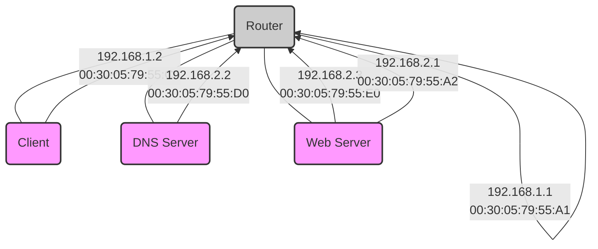

---
tags:
  - 4semester
  - informatik
  - RNVS
fach: "[[Rechnernetze und Verteilte Systeme (RNVS)]]"
Thema:
Benötigte Zeit:
date created: Thursday, 18. July 2024, 17:42
date modified: Thursday, 18. July 2024, 18:02
---

# ISO OSI-Schichtenmodell

Ergänzen Sie die Namen der Schichten im ISO OSI-Schichtenmodell in Deutsch und Englisch und geben Sie je Schicht eine charakteristische Aufgabe an!

| Schicht | Name | Charakteristische Aufgabe |
| ------- | ---- | ------------------------- |
| 7       |      |                           |
| 6       |      |                           |
| 5       |      |                           |
| 4       |      |                           |
| 3       |      |                           |
| 2       |      |                           |
| 1       |      |                           |

---

# Kommunikationsablauf

Das in der Abbildung skizzierte Netz besteht aus zwei Ethernets, die so mit einem Router verbunden sind, dass IPv4-Pakete zwischen ihnen vermittelt werden. Auf dem Client wird ein Browser-Programm ausgeführt, das eine Verbindung zu einem Webserver namens www aufbaut, um ein HTML-Dokument abzurufen.

**GENAUES BILD BITTE AUS BLATT ENTNEHMEN**

```
Client (192.168.1.2)
  |
  | 00:30:05:79:55:C0
  |
Router (192.168.1.1)
  |
  | 00:30:05:79:55:A1
  |
DNS Server (192.168.2.2)
  |
  | 00:30:05:79:55:D0
  |
Web-Server (192.168.2.3)
  |
  | 00:30:05:79:55:E0
```



These representations provide a visual breakdown of the network communication flow as described in your document.

## Hinweise:

- DNS-Server ist autoritativ für alle Teilnehmer in der Abbildung.
- Caches (ARP, DNS):
  - Empfängeradressen und die letzten 2 Byte der IPv4-Adressen nur die letzten 2 Byte.
  - Die direkt angebundenen Adressen werden aggressiv gespeichert.
  - Nicht auf jeder Schicht N passt immer in eine PDU der Schicht N+1.
  - Verwaltung des Übertragungsfehlers, Verhältnis der verwerften Nachrichten.
- Der Client kennt:
  - Die Adresse eines lokalen DNS-Servers,
  - Die URL des aufzurufenden Web-Objekts und die Default-Route über 1.1.

---

Vervollständigen Sie in der folgenden Tabelle die Kommunikation aller Teilnehmer auf den OSI-Schichten 2, 3 und 4, bis eine TCP-Verbindung zwischen Client und Webserver vollständig aufgebaut ist (heißt: alle relevanten Pakete wurden zugestellt).

| Pkt | MAC-Adr von | MAC-Adr zu | IP-Adr von | IP-Adr zu | Port von | Port zu | TCP Flags | Payload/Erklärung       |
| --- | ----------- | ---------- | ---------- | --------- | -------- | ------- | --------- | ----------------------- |
| 1   | :C0         | B-Cast     | -          | -         | -        | -       | -         | ARP: wer hat .1?        |
| 2   |             |            | -          | -         | -        | -       | -         | ARP: ich habe .1!       |
| 3   |             |            |            |           | 12345    | -       | -         | DNS Query: www?         |
| 4   |             |            |            |           |          |         |           | ARP: wer hat .2?        |
| 5   |             |            |            |           |          |         |           | ARP: ich habe .2!       |
| 6   |             |            |            |           |          |         |           |                         |
| 7   |             |            |            |           | 12345    | -       |           |                         |
| 8   |             |            |            |           |          |         |           |                         |
| 9   |             | 4711       |            |           |          |         |           | Verbindungsaufbauwunsch |
| 10  |             | B-Cast     |            |           |          |         |           |                         |
| 11  | :E0         |            |            |           |          |         |           |                         |
| 12  |             | 4711       |            |           |          |         |           |                         |
| 13  |             | 4711       |            |           |          |         |           |                         |
| 14  |             |            |            |           |          |         | ACK       |                         |
| 15  |             |            |            |           |          |         |           |                         |
| 16  |             | 4711       |            |           |          |         |           |                         |

---

# Transmission Control Protocol (TCP)

## (a) Zwei Hosts A und B kommunizieren über eine bereits bestehende TCP Verbindung.

- Host B hat bereits 132 Bytes von Host A vollständig empfangen.
- Host A sendet zwei weitere Segmente S<sub>1</sub> (Länge: 64 Bytes) sowie S<sub>2</sub> (Länge 32 Bytes).
- Die Sequenznummer von S<sub>1</sub> ist 133.
- Host B bestätigt jedes von Host A empfangene Segment mit einem Acknowledgement (ACK).

### i. Wie lautet die Sequenznummer bei S<sub>2</sub> von Host A an B?

(1)

### ii. Falls S<sub>1</sub> vor S<sub>2</sub> bei B eintrifft: Wie lautet die ACK-Nummer in der Quittung auf S<sub>1</sub>?

(1)

### iii. Falls S<sub>1</sub> nach S<sub>2</sub> bei B eintrifft: Wie lautet in der entsprechenden Quittung die ACK-Nummer?

(1)

## (b) Das Diagramm zeigt die Zustände und Zustandsübergänge in einem TCP-basierten Client. Ergänzen Sie den Text in den weißen Flächen!

```mermaid
stateDiagram
    [*] --> CLOSED
    CLOSED --> "SYN_SENT": senden
    "SYN_SENT" --> "SYN_RCVD": empfangen
    "SYN_RCVD" --> "ESTABLISHED": senden
    "ESTABLISHED" --> "FIN_WAIT_1": FIN senden
    "FIN_WAIT_1" --> "FIN_WAIT_2": empfangen
    "FIN_WAIT_2" --> "TIME_WAIT": ACK empfangen (nichts senden)
    "TIME_WAIT" --> CLOSED: warten
    "TIME_WAIT" --> [*]: ACK senden
```

---

# Internet Protocol

## (a) Beantworten Sie folgende Fragen zu Subnetzen.

### i. Wie lang (in Bits) darf eine Netz-ID für ein IPv4-basiertes Subnetz mit 58 Hosts höchstens sein?

(1)

### ii. Wie lautet die Netzmaske für das Subnetz 192.168.218.48/28? Machen Sie ihre Angabe in der Form r.s.p.q mit r, s, p, q ∈ {0, …, 255}, d.h. in dezimaler Schreibweise.

(1)

### iii. Wie lautet die Broadcast-Adresse für das Subnetz 192.168.218.48/28?

(1)

## (b) Nennen Sie einen Fall, in dem IPv4-Pakete fragmentiert werden müssen!

(1)

## (c) Im Internet kann mittels des Internet Control Message Protocol (ICMP) signalisiert werden, dass kein Weg zum Ziel eines IP-Paketes ermittelt werden kann (destination unreachable). Nennen Sie zwei weitere Meldungen, die mittels ICMP gesendet bzw. empfangen werden können!

(2)

---

# Wegewahl

Der in der Grafik dargestellte Router 0 hat folgende Routingtabelle:

| Ziel/Maske     | Next Hop        |
| -------------- | --------------- |
| 135.46.56.0/22 | Schnittstelle A |
| 135.46.60.0/22 | Schnittstelle B |
| 192.53.40.0/23 | Router 1        |
| default        | Router 2        |

## (a) Wie leitet Router 0 IPv4 Pakete anhand ihrer Ziel-Adressen weiter? Vervollständigen Sie die folgende Tabelle!

(4)

| Ziel-IP-Adresse | Schnittstelle / Nexthop |
| --------------- | ----------------------- |
| 135.46.63.10    |                         |
| 135.46.57.14    |                         |
| 135.46.52.2     |                         |
| 192.53.40.7     |                         |

## (b) Router 0 empfängt ein IPv4-Paket von 135.46.56.2 an 141.84.111.7 mit einer TTL von 2 weiter.

### i. An welche IPv4 Adresse wird die ICMP Fehlermachricht geschickt?

(2)

### ii. Ist anhand der vorliegenden Informationen entscheidbar, ob bzw. an welcher Schnittstelle Router 0 die Fehlermeldung empfängt? Begründen Sie Ihre Antwort!

## (c) Zwischen autonomen Systemen werden andere Routing-Protokolle eingesetzt als innerhalb. Nennen Sie einen Grund dafür (mit kurzer Erklärung)!

(1)

---

# Cyclic Redundancy Check

## (a) Gegeben sei das Generatorpolynom $G = x^3 + 1$

### i. Durch wie viele Bits wird \( G \) bei CRC repräsentiert?

(1)

### ii. Es soll die Nachricht 110011 CRC-geschützt übertragen werden. Berechnen Sie die zu übertragende Bitfolge (inkl. CRC-Prüfsumme) unter Verwendung des Generatorpolynoms \( G \).

(3)

### iii. Nehmen Sie an, dass Sie die CRC-geschützte Bitfolge 10011001 empfangen haben. Zeigen Sie, dass die empfangene Bitfolge unter Verwendung des Generatorpolynoms \( G \) korrekt ist (inkl. Rechnung). Markieren Sie in Ihrer Rechnung die Stelle, an der der Empfänger die Korrektheit ablesen kann.

(3)

Seite 8 von 8

<!-- Modal START -->
<div id="myModal" class="modal">
  <div class="modal-content">
    <span id="closeModal" class="close">&times;</span>
    <p class="modal-text">
      If MyUniNotes has been helpful and you’d like to support my efforts, <span class="modal-highlight"> you can contribute with a donation: <a class="modal-dono-link" href="https://paypal.me/myuninotes4u">Donate via PayPal</a> :) </span> Your support will help me continue improving the content, but there is no obligation to donate.
    </p>
    <p class="modal-text">
      <span class="modal-highlight">MyUniNotes is a personal, non-revenue project as I believe in accessible education for everyone.</span> I manage this project alongside my studies, with all materials handwritten by me trying to help others understand challenging concepts.
    </p>
  </div>
</div>

<script>
  // JavaScript to display the modal on page load
  document.addEventListener('DOMContentLoaded', function() {
    // Generate a random number between 1 and 1
    // Wanted it to load with a adjustable probability for every page load but did not work, as DOM is loaded only once. Therefore now loading it every time website is visited and DOM is loaded.
    const randomNumber = Math.floor(Math.random() * 1) + 1; 
    // console.log(randomNumber)
    if (randomNumber === 1) {
      setTimeout(function() {
        const modal = document.getElementById('myModal');
        if (modal) {
          modal.classList.add('show');
        }
      }, 1000); // Adjust the delay as needed

      const closeModal = document.getElementById('closeModal');
      if (closeModal) {
        closeModal.addEventListener('click', function() {
          const modal = document.getElementById('myModal');
          if (modal) {
            modal.classList.remove('show');
          }
        });
      }
    } else {
      // Ensure the modal is hidden if the random number is not 1
      const modal = document.getElementById('myModal');
      if (modal) {
        modal.style.display = 'none';
      }
    }
  });
</script>
<!-- Modal END -->

<!-- DISQUS SCRIPT COMMENT START -->

<!-- DISQUS RECOMMENDATION START -->

<div id="disqus_recommendations"></div>

<script> 
(function() { // REQUIRED CONFIGURATION VARIABLE: EDIT THE SHORTNAME BELOW
var d = document, s = d.createElement('script'); // IMPORTANT: Replace EXAMPLE with your forum shortname!
s.src = 'https://myuninotes.disqus.com/recommendations.js'; s.setAttribute('data-timestamp', +new Date());
(d.head || d.body).appendChild(s);
})();
</script>
<noscript>
Please enable JavaScript to view the 
<a href="https://disqus.com/?ref_noscript" rel="nofollow">
comments powered by Disqus.
</a>
</noscript>

<!-- DISQUS RECOMMENDATION END -->

<hr style="border: none; height: 2px; background: linear-gradient(to right, #f0f0f0, #ccc, #f0f0f0); margin-top: 4rem; margin-bottom: 5rem;">
<div id="disqus_thread"></div>
<script>
    /**
    *  RECOMMENDED CONFIGURATION VARIABLES: EDIT AND UNCOMMENT THE SECTION BELOW TO INSERT DYNAMIC VALUES FROM YOUR PLATFORM OR CMS.
    *  LEARN WHY DEFINING THESE VARIABLES IS IMPORTANT: https://disqus.com/admin/universalcode/#configuration-variables    */
    /*
    var disqus_config = function () {
    this.page.url = PAGE_URL;  // Replace PAGE_URL with your page's canonical URL variable
    this.page.identifier = PAGE_IDENTIFIER; // Replace PAGE_IDENTIFIER with your page's unique identifier variable
    };
    */
    (function() { // DON'T EDIT BELOW THIS LINE
    var d = document, s = d.createElement('script');
    s.src = 'https://myuninotes.disqus.com/embed.js';
    s.setAttribute('data-timestamp', +new Date());
    (d.head || d.body).appendChild(s);
    })();
</script>
<noscript>Please enable JavaScript to view the <a href="https://disqus.com/?ref_noscript">comments powered by Disqus.</a></noscript>

<!-- DISQUS SCRIPT COMMENT END -->

<!-- Modal START -->
<div id="myModal" class="modal">
  <div class="modal-content">
    <span id="closeModal" class="close">&times;</span>
    <p class="modal-text">
      If MyUniNotes has been helpful and you’d like to support my efforts, <span class="modal-highlight"> you can contribute with a donation: <a class="modal-dono-link" href="https://paypal.me/myuninotes4u">Donate via PayPal</a> :) </span> Your support will help me continue improving the content, but there is no obligation to donate.
    </p>
    <p class="modal-text">
      <span class="modal-highlight">MyUniNotes is a personal, non-revenue project as I believe in accessible education for everyone.</span> I manage this project alongside my studies, with all materials handwritten by me trying to help others understand challenging concepts.
    </p>
  </div>
</div>

<script>
  // JavaScript to display the modal on page load
  document.addEventListener('DOMContentLoaded', function() {
    // Generate a random number between 1 and 1
    // Wanted it to load with a adjustable probability for every page load but did not work, as DOM is loaded only once. Therefore now loading it every time website is visited and DOM is loaded.
    const randomNumber = Math.floor(Math.random() * 1) + 1; 
    // console.log(randomNumber)
    if (randomNumber === 1) {
      setTimeout(function() {
        const modal = document.getElementById('myModal');
        if (modal) {
          modal.classList.add('show');
        }
      }, 1000); // Adjust the delay as needed

      const closeModal = document.getElementById('closeModal');
      if (closeModal) {
        closeModal.addEventListener('click', function() {
          const modal = document.getElementById('myModal');
          if (modal) {
            modal.classList.remove('show');
          }
        });
      }
    } else {
      // Ensure the modal is hidden if the random number is not 1
      const modal = document.getElementById('myModal');
      if (modal) {
        modal.style.display = 'none';
      }
    }
  });
</script>
<!-- Modal END -->

<!-- Modal START -->
<div id="myModal" class="modal">
  <div class="modal-content">
    <span id="closeModal" class="close">&times;</span>
    <p class="modal-text">
      If MyUniNotes has been helpful and you’d like to support my efforts, <span class="modal-highlight"> you can contribute with a donation: <a class="modal-dono-link" href="https://paypal.me/myuninotes4u">Donate via PayPal</a> :) </span> Your support will help me continue improving the content, but there is no obligation to donate.
    </p>
    <p class="modal-text">
      <span class="modal-highlight">MyUniNotes is a personal, non-revenue project as I believe in accessible education for everyone.</span> I manage this project alongside my studies, with all materials handwritten by me trying to help others understand challenging concepts.
    </p>
  </div>
</div>

<script>
  // JavaScript to display the modal on page load
  document.addEventListener('DOMContentLoaded', function() {
    // Generate a random number between 1 and 1
    // Wanted it to load with a adjustable probability for every page load but did not work, as DOM is loaded only once. Therefore now loading it every time website is visited and DOM is loaded.
    const randomNumber = Math.floor(Math.random() * 1) + 1; 
    // console.log(randomNumber)
    if (randomNumber === 1) {
      setTimeout(function() {
        const modal = document.getElementById('myModal');
        if (modal) {
          modal.classList.add('show');
        }
      }, 1000); // Adjust the delay as needed

      const closeModal = document.getElementById('closeModal');
      if (closeModal) {
        closeModal.addEventListener('click', function() {
          const modal = document.getElementById('myModal');
          if (modal) {
            modal.classList.remove('show');
          }
        });
      }
    } else {
      // Ensure the modal is hidden if the random number is not 1
      const modal = document.getElementById('myModal');
      if (modal) {
        modal.style.display = 'none';
      }
    }
  });
</script>
<!-- Modal END -->
