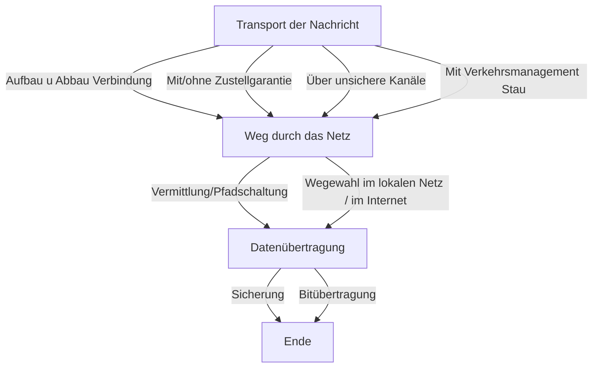
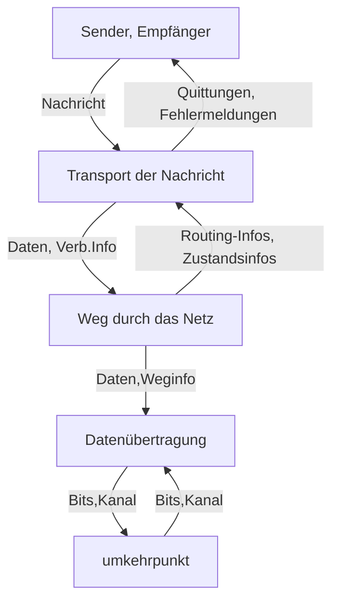

---
tags:
  - 4semester
  - RNVS
  - vorlesung
  - informatik
fach: "[[RNVS]]"
Thema:
  - "[[Modularität]]"
  - "[[Rechnernetze]]"
Benötigte Zeit: 
date created: Friday, 26. April 2024, 09:13
date modified: Friday, 26. April 2024, 11:37
---

*Geht weiter ab Kapitel 2-S.31*
**Ende:** 96
# TODOs

- [ ] tim berners lee documentary
- [ ] djkstra docu
# Themen der 2VL

- Modularität
- Rechnernetze

# Grobe Zusammenfassung im Voraus Kapitel 2: Rechnernetze und verteilte Systeme

## Grundbegriffe und Definitionen

- **Rechnernetz** vs. **verteiltes System**: Rechnernetze sind Netzwerke von Computern, die über Kommunikationsverbindungen miteinander verbunden sind. Verteilte Systeme nutzen diese Netzwerke, um Ressourcen zwischen Computern zu teilen, wobei das System selbst den Datentransfer initiiert, nicht der Benutzer.

- **Modularität**: Aufteilung eines Systems in Module oder Komponenten, die über Schnittstellen interagieren können. Modularität vereinfacht das Verständnis und die Wartung komplexer Systeme (Barbara Liskov, MIT).

- **Separation of Concerns**: Prinzip der Trennung der Verantwortlichkeiten innerhalb eines Systems oder Projekts, um die Komplexität zu verwalten. Dies fördert die Fokussierung auf einzelne Aspekte eines Systems für eine konsistente Behandlung (Edsger W. Dijkstra).

## Dienst, Schnittstelle, Protokoll

- **Dienst**: Eine Reihe von Operationen, die eine Schicht bereitstellt und die von der darüber liegenden Schicht genutzt werden können.

- **Schnittstelle**: Definiert, wie auf Dienste zugegriffen wird, unabhängig von der Implementierung dieser Dienste.

- **Protokoll**: Spezifikation der Regeln für den Informationsaustausch, einschließlich Syntax, Semantik und Synchronisationsverhalten.

## Protokollfunktionen

- **Verbindungsmanagement**: Aufbau und Abbau von Verbindungen, Multiplexing, Protokollauswahl.

- **Datenhandhabung**: Segmentierung und Reassemblierung von Daten, Routing und Flusskontrolle.

- **Fehlerbehandlung**: Umgang mit Datenverfälschung, Datenverlust, Datenreihenfolgefehlern und Verbindungsabbrüchen.

## Architektur und Philosophie des Internets

- **KISS-Prinzip** ("Keep It Simple, Stupid"): Eine einfache Lösung wird bevorzugt, um die Effektivität und Anpassungsfähigkeit des Internets zu maximieren.

- **RFC (Request for Comment)**: Dokumente, die technische und organisatorische Ideen zur Internetentwicklung enthalten, mit einem eindeutigen Nummerierungssystem und unterschiedlichen Gültigkeitsstatus.

## Konstruktionsprinzipien

- **Schichtung**: Aufteilung der Funktionalität in Schichten, die jeweils spezifische Dienste anbieten.

- **Ende-zu-Ende-Prinzip**: Implementierung von Funktionen am Endpunkt einer Kommunikation, um Effizienz und Leistung zu optimieren.

- **Zustandsspeicherung und gemeinsames Schicksal**: Wo und wie Zustandsinformationen innerhalb des Netzwerks gespeichert werden.

## Herausforderungen und Lösungsansätze

- **Komplexität**: Umgang mit der steigenden Komplexität durch Modularität und klare Trennung der Funktionen.

- **Skalierung und Heterogenität**: Anpassung an eine große Anzahl von Benutzern und unterschiedliche Systeme und Anforderungen.

### S.40 Update

- Top & Second Level Goals sind die Grundideen des Internets 
	- Top level goal of the DARPA Internet Architecture: *to develop an effective technique for multiplexed utilization of existing interconnected networks* 
	- Second Level Goals: 
		1. Internet communication must continue despite loss of networks or gateways. 
		2. The Internet must support multiple types of communications service.
			- verschiedene Arten der Kommunikation, zoom,moodle,email etc.
		3. The Internet architecture must accommodate a variety of networks. 
			- bis zu einem bestimmten punkt organisieren, zb lrz bis in den Saal ab da wird es frei und man muss entscheiden wie es danach zusammenspielt
		4. The Internet architecture must permit distributed management of its resources. 
			- verschiedene Arten der Kommunikation, zoom,moodle,email etc.
		5. The Internet architecture must be cost effective. 
		6. The Internet architecture must permit host attachment with a low level of effort. 
		7. The resources used in the internet architecture must be accountable.
			- es muss klar sein, wer wie sehr das INternet benutzt, z.B damit ein Physiker an der Uni für seine Forschung nicht das kompleette Internet ausnutzt und andere blockiert

## Herausforderung im RN (S.41)

- Skalierung: Viele Nutzer, weit verteilt
- Heterogenität: Unterschiedliche End-und Transitsysteme (z.B alte Systeme in neuer Umgebung Windows 3.11 hat garching lahm gelegt)
- Flexibilität und gemeinsame gleichzeitige Nutzung
	- $\Longrightarrow$ Modularität als Lösung für diese Probleme
		- Schichtenarchitektur
		- Modularität abstrahiert das komplexe komplette System
		- wir unterteilen es in kleiner Häppchen wie in einem React Projekt in Komponente

## Modularität

- Schichtenarchitektur
- Modularität abstrahiert das komplexe komplette System
- wir unterteilen es in kleiner Häppchen wie in einem React Projekt in Komponente
- Der Programmierer muss mehrere Dinge gleichzeitig tun, nämlich:
	- beschreiben, was berechnet werden soll
	- den Ablauf der Berechnung in kleinen Schritten organisieren
	- die Speicherverwaltung während der Berechnung organisieren

### Wann entscheidet man, das etwas in ein Modul kommt? **(Seperation of Concerns : Dijkstra)**
- Was zusammen gehört (leicht gesagt)
- Teile, die man öfters benutzt machen, sollte man eventuell in ein Modul unterteilen 

## Benötigte Funktionalität

läuft von oben nach unten ab *(Dieser Ablauf wird immer durchlaufen im Internet)*

- **Transport der Nachricht**
	- Aufbau und Abbau der Verbindung *(wie kommunizeren wir? leitung? wlan?)*
	- Mit/ohne Zustellgarantie *(interessert uns ob angekommen?)*
	- Über unsichere Kanäle 
	- Mit Verkehrsmanagement (Stau, …) *(Was machen wir bei vieen Anfragen?)*
- **Weg durch das Netz**
	- Vermittlung/Pfadschaltung *(In welche Richtung schickt er die Nachricht? Z.B die Router im Saal. schicken diese in den saal oder ins lrz)*
	- Wegewahl im lokalen Netz / im Internet
- **Datenübertragung** *(Wie schicken wir Nachrichten durch die Luft?)*
	- Sicherung *(Wie sichern wir diese Nachricht?)*
	- Bitübertragung

$\Longrightarrow$ Diese 3 Schichten sind unsere Module *(Seperation of Concerns)*

## Wie gestalten wir die Lösung? KISS-Prinzip

- immer möglichst einfache Lösung
- Dinge so einfach wie möglich, aber nicht einfacher

### Zusammenfassung:

Komplexität als Herausforderung bei der Entwicklung des Internets
Deswegen Modularität

# Dienst, Schnittstelle, Protokoll

## Definitionen

**Dienst:**
- Menge von Operationen
- einfache Operationen
- diese Dienste führt jemand aus, für jemand anderen
	- z.B. Transport der Nachricht, Datenübertragung, Finde den Weg durchs Internet
	- verschiedene Ausprägungen: schnellster Weg, längster Weg etc.
- Können Dienste in verschiedenen Wegen implementieren *(Jeder kann seinen Code schreiben wie er will,solang es funktioniert)*
	- z.B Beispiel aus VL-1 welchen Weg die Nachricht nimmt *(Diagonal durch Saal, zickzack, linienartig etc.)*

**Protokoll:**
- Erklärung des Dienstes meist auf Englisch um es allen zugänglich zu machen
- Vereinbarung der Regeln
- Syntax, Semantik, Synchronisationsverhalten
- Protokoll $\approx$ Documentation
	- Protokollfunktion
		- Verbindungsmanagement
			- Aufbau, Abbau
			- Multiplex, Splitting
			- Protokoll Selektion für die verschiedenen Schichten
			- **ACHTUNG!:** Transporteinheiten haben schichtspezifische verschiedene Bezeichnungen *(z.B.: Nachricht, Segment,Paket, Block,Frame)*
		- Datenhandhabung
			- Zerlegung, Segmentierung
			- Versehen von Nutzdaten mit Steuerinformation
			- Wegwahl *(routing)*
				- bspw. Streaminganbieter liegt jemanden immer an nächstgelegenen Server
			- Flusssteuerung *(flow control)*
				- Zur Behandlung von Staus im Internet
		- Fehlerbehandlung
			- Verfälschung der Daten
				- Prüfnummern, Paritätsbits *(Rechnerarchitektur VL)*
			- Verlust der Daten
				- Sequenznummern, Quittungen, Timeout
			- Duplikate
				- Sequenznummer, uuid
			- Falsche Reihenfolge
				- Sequenzdiagramm
			- Verbindungsabbruch
				- Reset, Wiederaufsatzpunkte
- Protokollspezifikation:
	- Ablaufdiagramme, Perinetze
		- Einfach wie man Code etc. dokumentiert
	- Protokollverifikation und Validierung
		- Korrektheit
		- Verklemmungsfreiheit *(Deadlocks)*
	- Protokolltests
		- mit Partner (man testet ob Kommunikation funktioniert)
		- gegen Standard, erfüllt meine Implementierung dem Standard?

**Schnittstelle:**
- Spezifikation, die den Zugriff auf den jeweiligen Dienst regelt 

## Diagramme

- Sequenzdiagramm
- Flussdiagramm

## RFC (Request for Comment)
- Bitte um Kommentare
- IETF und Internet Society
- Enthalten technische und organisatorische Ideen für die Entwicklung des Internets
- Community diskutiert, ob Dokument passier
- RFC [Humor](<https://de.wikipedia.org/wiki/Request_for_Comments#Humor_in_RFC:~:text=(HTTP)%20genannt.-,Humor%20in%20RFC,-%5BBearbeiten%20%7C>)
 - [ ] RFC 1958 [lesen](https://datatracker.ietf.org/doc/html/rfc1958)
 - RFC und Internet ist demokratisch entstanden
 - Konstruktionsprinzip des Internets
	 - Schichtung
		 - Wie wird das System (=Rechnernetze) aufgeteilt
	 - Ende-zu-Ende-Prinzip
	 - Gemeinsmes "Schicksal"

### Zusammenfassung: S.78

**Hinweise**
- Themen und Konzepte können:
  - Schichtspezifisch,
  - Protokollspezifisch,
  - Internetspezifisch, oder
  - Schichtunabhängig sein.
- Reihenfolge wird durch die Struktur der Vorlesung bestimmt.

**Lesempfehlung:** Mark Handley, Why the Internet just works
- Das Internet wurde nicht aus einem use-case erschaffen
- Erfüllt nicht oft was man möchtet, zb netflix 4k abo, aber das Internet reicht nicht für 4k 

# Datenfluss

- [ ] Richtiges diagramm aus S.88

graph TD;
    A[Nachricht, Ziel] -->|Daten, Verb.Info| B[Transport der Nachricht]
    B -->|Daten, Verb.Info| C[Weg durch das Netz]
    C -->|Daten,Weginfo| D[Datenübertragung]
    D -->|Empfang der Daten| E[Nachricht, Ursprung]

    E -->|Bits,Kanal| D
    D -->|Routing-Infos, Zustandsinfos| C
    B -->|Quittungen, Fehlermeldungen| A

## Horizontale und Vertikale Kommunikation

- vertikale
	- mit einer benachbarten Schicht
- horizontale
	- zwischen Instanzen der gleichen Schichte

## Nutzdaten & Steuerinformation

- innerhalb des Schichtenmodells
	- Nutzdaten
	- Steuerinformation
- Welcher Teil Nutzdaten und welcher Steuerinformation
	- auf welcher Schicht wir uns befinden
	- ob Kommunikation nach oben, nach unten oder zur Peer-Entität

## Ablauf des Datenflusses (S.93-97)

## Zusammenfassung Dateneinheiten (S.98)

## Klausurrelevant : "Schnitte definieren" S.(101)

## Protokollschnitt vs Systemschnitt

- Protokollschnitt zwischen Peer-Entitäten zb. Kunde und Weinhändler
- Systemschnitt ist eine konkrete Verbindung zwischen zwei Expliziten Geräten z.B. mein Handy und dem WiFi-Access-Point im Saal