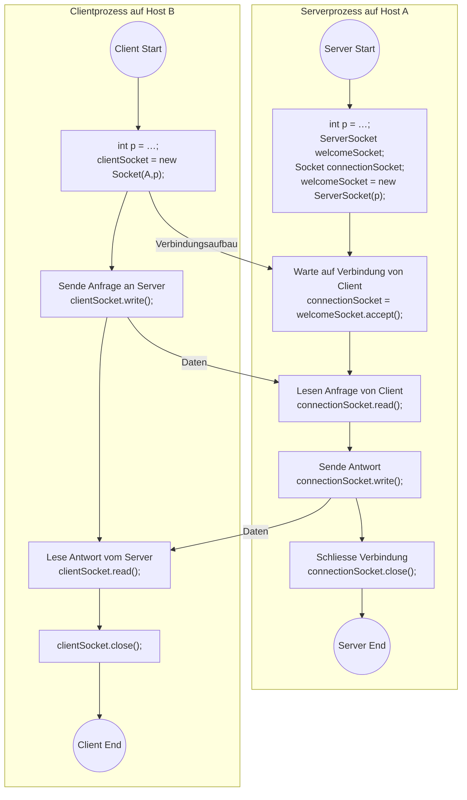
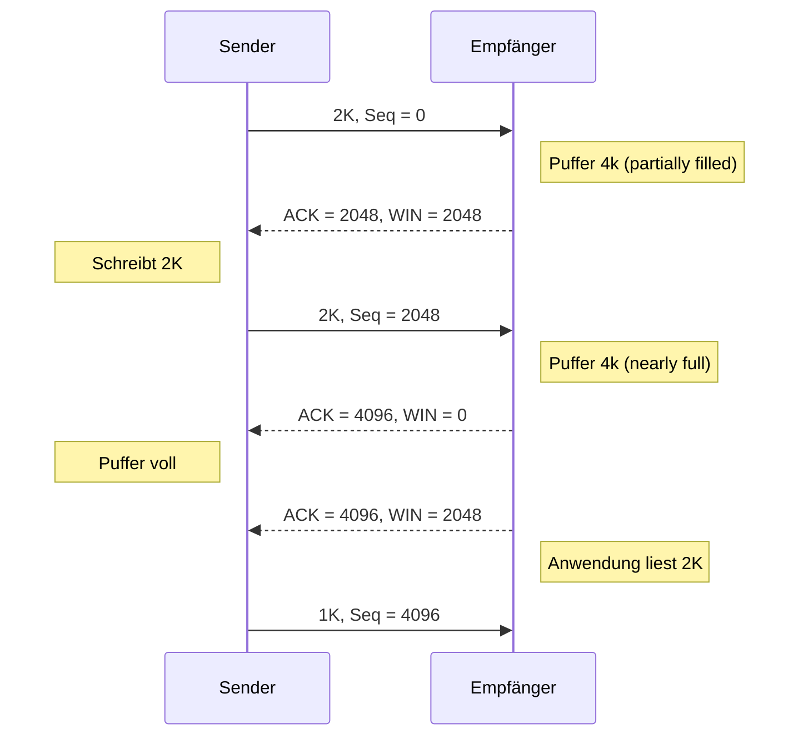

---
tags:
  - 4semester
  - informatik
  - RNVS
  - vorlesung
fach: "[[Rechnernetze und Verteilte Systeme (RNVS)]]"
Thema:
Benötigte Zeit:
date created: Friday, 24. May 2024, 09:19
date modified: Friday, 7. June 2024, 09:25
---

Kapitel 3
Ende S.127

# Wiederholung von letzter VL (~S.60)

- Ports [[RNVS-5VL-17-05-2024#Ports zur Adressierung des Kommunikationsendpunkts (Seite 65-67)]]
- Sockets (S.73)
- Client Server Paradigma
- Zusammenfassung S.77

# UDP - User Datagram Protocol (S.79)

Man kann in UDP in der Anwendungsschicht Sequenznummern und Quittungen implementieren

**Frage:**
Wenn man bei UDP in der Anwendungsschicht Sequenznummern und Quittungen implementieren kann, ist dieses UDP dann nicht besser / effizienter als das standard TCP Protokoll? Bzw. warum sollte man das Standard TCP überhaupt benutzen wenn UDP es nachahmen kann?

**Antwort:**
TCP ist ein sehr komplexes Protokoll und bietet noch deutlich mehr als nur Quittungen und Sequenznummern. Zum einen bedeutet eine Erweiterung in der Anwendungsschicht, dass Sie selbst für die Implementierung verantwortlich sind, zum anderen ist die Implementierung im Kernel effizienter/schneller, da Sie damit Kontextwechsel vermeiden.

UDP: 8 Bytes

# [[TCP]] - Transmission Control Protocol (S.85)

- Ende zu Ende (voll Duplex)
- hat Fehlerbehandlung (Verlust, Duplikat)
- Flusssteuerung und Staukontrolle
- Kommunikationsaufbau per Three-Way-Handshake
- Byte-Strom-orientiert

## TCP-Header

- Der TCP-Header ist insgesamt **20 Byte** lang.
- **Sequenznummern** haben **32 Bit** (S.88)
- **NB** 6 Bit (werden nicht benutzt)
- **Flags** (Quittungen) sind **6 Bits** je **1 Bit** pro Flag
  - **Quellport** und **Zielport**: Identifizieren die Endpunkte der Verbindung.
  - **Sequenznummer**: Zur Identifikation der Datenbytes innerhalb der Verbindung.
  - **Quittungsnummer**: Bestätigt den Erhalt von Daten.
  - **Hdr Länge** (Header Length): Zeigt die Länge des TCP-Headers in **32-Bit-Wörtern** an.
  - **Flags**: Verschiedene Kontrollbits für die Steuerung der Verbindung (**URG, ACK, PSH, RST, SYN, FIN**).
  - **Fenstergröße**: Steuert den Fluss der Daten.
  - **Prüfsumme**: Zur Fehlerüberprüfung.
  - **Urgent Pointer**: Zeigt an, wenn bestimmte Daten dringend verarbeitet werden müssen.
- **Optionen und Padding**: Für zusätzliche Funktionen; Länge kann variieren, was auch die Gesamtlänge des Headers beeinflusst.

Das **NB** im TCP-Header steht für "Nicht benutzt" und bezieht sich auf Bits, die derzeit keine definierte Funktion haben und deshalb nicht verwendet werden. Diese Bits sind reserviert und sollen zukünftige Erweiterungen oder spezielle Anwendungen ermöglichen, ohne dass das Protokoll grundlegend geändert werden muss.

## TCP-Eigenschaften (S.91)

- TCP-PDU wird "_Segment_" genannt
- TCP-Port: Unterstützten Multiplexen von Anwendungen
- TCP-Sockets: zur Adressierung von Anwendungen
- Puffern: Dienstdaten werden zwischengespeichert
- Protokolle die TCP verwenden:
  - HTTP (Hypertext Transfer Protocol)
  - SMTP (Simple Mail Transfer Protocol)
  - IMAP (Internet Message Access Protocol)
  - FTP (File Transfer Protocol)

## TCP-Socket-Programm

Client braucht Adresse und Port zum kommunizieren mit Server

> [!warning] **Nach Server End geht der Server wieder in den Zusatnd "Warten"**

Typische TCP-Zustände im Client S.(93)
Typische TCP-Zustände im Server S.(94)

## Beispiel: Verbindungssocket

> [!danger] Falsche Interpretation von sockets
> Port 80 muss immer so kurz wie möglich belegt sein, damit andere Web browser darauf zugreifen können. Wir sprechen den Server auf port 80 an, und verlegen den Datentransfer nach dem Verbindungsaufbau direkt zu einem anderen Port z.B (11024)
>
> **Vorsicht Port != Socket**

> [!success] Korrekte Interpretation
> In HTTP-Verbindungen verwendet der Webbrowser für den Verbindungsaufbau zum Server standardmäßig Port 80. Nach der Verbindungsetablierung bleibt der Datentransfer auf demselben Port, wobei jede Verbindung durch einen individuellen Socket repräsentiert wird, der eine einzigartige Kombination aus IP-Adresse und Portnummer des Clients und des Servers umfasst. Die Verwaltung verschiedener Client-Anfragen erfolgt durch den Einsatz verschiedener Sockets, nicht durch die Zuweisung unterschiedlicher Server-Ports für jede Anfrage.

> [!question] Frage
> Bekommt jede Anfrage aus dem WebBrowser nach dem Verbindungsaufbau mit Port 80 einen eigenen Port zum Datentransfer?

> [!note] Antwort
> Nein, Anfragen laufen alle auf den selben Port am Server. Die Clients benutzen allerdings zum Senden in der Regel zufällige Ports.Es gibt aber einen eigenen Socket pro Anfrage.

> [!summary] Zusammenfassung
> **Korrekte Erklärung:**
>
> **Verbindungsaufbau:** Ein Webbrowser initiiert eine Verbindung zum Webserver, indem er eine Anfrage an Port 80 sendet (oder Port 443 für HTTPS). Dieser Port ist auf dem Server als "Listening Port" konfiguriert, um eingehende HTTP-Anfragen zu akzeptieren.
>
> **Verwendung von Port 80:** Der Server behält diesen Port für die gesamte Dauer der HTTP-Kommunikation bei. Es gibt keinen Wechsel zu einem anderen Port nach dem initialen Handshake. Stattdessen wird der Datentransfer über denselben Port fortgesetzt.
>
> **Sockets:** Jede neue Anfrage von einem Client (Browser) wird in der Regel durch einen neuen Socket gehandhabt, auch wenn sie denselben Port verwendet. Ein Socket ist eine End-to-End-Verbindung, die aus einer Kombination der IP-Adresse und des Ports sowohl des Clients als auch des Servers besteht. Der Unterschied zwischen verschiedenen Anfragen und Sessions wird durch unterschiedliche Sockets verwaltet, nicht durch den Wechsel von Ports.

## Multiplexen von Anwendungen

## Zusammenfassung (S.98)

- **UDP** und **TCP** sind Protokolle der **Transportschicht**
- Beide bieten **Ende-zu-Ende Kommunikation**
- **UDP** ist verbindungslos, daher unzuverlässig, aber schnell
- **TCP** ist verbindungsorientiert, daher zuverlässig, aber langsam
- **Programmierung** in beiden Fällen über **Sockets**
- **Ports** erlauben **Multiplexen** von **Anwendungen/Diensten**

# Ausblick

- **UDP** mit hoher Kommunikationsleistung, aber unzuverlässig
- **TCP** mit Zuverlässigkeitsgarantien und weniger Kommunikationsleistung

- **UDP** kann genutzt werden, um (Teile von) **TCP** nachzubilden
- **Overhead** kann verbessert werden, wenn nicht alle Features von **TCP** benötigt werden

⇒ **QUIC**: **UDP-Based Multiplexed and Secure Transport**

- Designed 2012 von **Jim Roskind (Google)**
- Inzwischen standardisiert von der **IETF** als **RFCs (8999-9002, 2021)**

## Zur Erinnerung

**Im Beispiel:**

- Es wird jeweils ein Zeichen als Nutzlast übertragen
- Der **Header** (=**Overhead**) ist ein Zeichen (Seq.Nr)
- Im Fall von **TCP** nennt man die **PDU** => **Segment**
- **Verbesserung:**
  - Mehr als ein Zeichen je Segment
  - Verhältnis **Header** / **Nutzlast** dadurch besser
- Ansatz wird als **„Stop-and-Wait“** bezeichnet.

# Beispiel: Erreichbarer Durchsatz bei Stop-and-Wait

> [!info]
> Der Kanal ist die Leitung zwischen Sender und Empfänger, theoretisch könnten hier 1 GBit/s übertragen werden. Wenn wir allerdings nach jeder Nachricht erst auf die Quittung warten, dann können wir nur 0,008 ms senden und 30 ms passiert nichts bis die Quittung zurück ist.

## 1)

- Nachricht von **Lissabon ➔ Helsinki**
- Ca. **4400 km** Leitung
- Signalausbreitung mit **Lichtgeschwindigkeit**
- Rundlaufausbreitungsverzögerung: ca. **30 ms**
- **1 Gbit/s** Übertragungsgeschwindigkeit

## 2)

- Nachricht mit ca. **1000 Byte** (= **8000 Bit**)
  $$
    d_{trans} = \frac{8000 \text{ Bit/Nachricht}}{10^9 \text{ Bit/s}} = 8 \mu\text{s/Nachricht}
  $$
- Wenn die Nachricht bei t=0 verschickt wird:
  - $t=8 µs$: das letzte Bit verlässt den Sender
  - $t=15,008$ ms: das letzte Bit erreicht den Empfänger
- Annahme: **ACK** sehr klein, daher ignorieren wir die Übertragungszeit für die Nachricht
- $t=30,008$ ms: Bestätigung des Erhalts beim Sender

## 3)

**Problem:**

- In **30,008 ms** wurde eine Nachricht mit der Länge von **1000 Bytes** übertragen. Der Kanal war dabei **0,008 ms** lang belegt.
- Auslastung:
  $$
    U_{Sender} = \frac{0,008}{30,008} = 0,000267
  $$
- Effektiver Durchsatz: **267 kbit/s**

**Ursache:** Stop-and-Wait Protokoll

# Verbesserungsmöglichkeiten

- **Anstelle von Stop-and-Wait:**

  - Absender darf mehrere Nachrichten senden, ohne auf die jeweilige Bestätigung warten zu müssen

- **Konsequenzen:**

  - Wertebereich der Sequenznummern muss angepasst werden
  - Sender und Empfänger müssen mehr als eine Nachricht zwischenspeichern können ➔ Sende-/Empfangspuffer

- **Im Beispiel:**
  - 3 Nachrichten anstatt 1 ➔ 3-facher Durchsatz

# Fenstertechnik („Sliding Window“) ~~~

- **Festlegung eines Teilbereiches des SeqNr-Raumes als:**

  - **Sendefenster (Sendepuffer)**

    - Größe w
    - Beginn Sendefenster: zuletzt (lückenlos) quittierte SeqNr snq
    - Sender sendet nur Nachrichten mit SeqNr innerhalb Sendefensters

  - **Empfangsfenster (Empfangspuffer)**
    - Größe w\*
    - Beginn Empfangsfenster: nächste erwartete SeqNr (sne)
    - Nachrichten mit SeqNr außerhalb Empfangsfenster werden verworfen

- **Fenster werden verschoben, wenn Nachrichten quittiert oder empfangen werden**

## Vorteile der Fenstertechnik

- Allgemein einsetzbar, auch außerhalb RNVS
- Flexibel an Bedürfnisse konkreter Protokolle anpassbar
- **Fenstergröße = 1:** „Stop-and-Wait“ Protokoll
- Je nach Protokoll: dynamische Anpassung von Fenstergrößen, u.a. zur Flusskontrolle
- **Grundlegende Verfahren:**
  - Go-Back N
  - Selective Repeat

> [!summary] Zusammenfassung Fenstertechnik
>
> - **Sequenznummer**: fortlaufende Nummerierung (von Bytes) in Segmenten.
> - **Acknowledgement (ACK)**: Quittungen über erfolgreich erhaltene Pakete.
> - **Timer**: Wird verwendet, um ggf. verloren gegangene Segmente erneut zu übertragen.
> - **Fenstertechnik (Pipelining)**: maximale Anzahl unbestätigter Segmente auf dem Sendekanal.

> [!summary] Ausführliche Zusammenfassung Fenstertechnik
>
> ## Warum gibt es sie?
>
> Die **Fenstertechnik**, auch als „Sliding Window“ bezeichnet, wurde entwickelt, um die Effizienz der Datenübertragung in Netzwerken zu verbessern. Sie überwindet die Einschränkungen des Stop-and-Wait-Protokolls, bei dem nach jeder gesendeten Nachricht auf eine Bestätigung gewartet werden muss, bevor die nächste Nachricht gesendet werden kann. Dies führt zu einer erheblichen Unterauslastung der verfügbaren Bandbreite, insbesondere bei Verbindungen mit hoher Latenz.
>
> ## Wie funktioniert sie?
>
> Die Fenstertechnik ermöglicht es dem Sender, mehrere Datenpakete ohne sofortige Bestätigung zu versenden. Dabei werden zwei Arten von Fenstern definiert:
>
> 1. **Sendefenster (Sendepuffer)**:
>    - **Größe w**: Die Anzahl der Datenpakete, die der Sender ohne Bestätigung senden darf.
>    - **Beginn Sendefenster**: Das letzte lückenlos quittierte Paket bestimmt den Anfang des Sendefensters.
>    - Der Sender darf nur Pakete mit Sequenznummern innerhalb des Sendefensters senden.
> 2. **Empfangsfenster (Empfangspuffer)**:
>    - **Größe w\***: Die Anzahl der Datenpakete, die der Empfänger puffern kann.
>    - **Beginn Empfangsfenster**: Das nächste erwartete Paket bestimmt den Anfang des Empfangsfensters.
>    - Pakete mit Sequenznummern außerhalb des Empfangsfensters werden verworfen.
>
> ## Funktionsweise
>
> - Der Sender schickt mehrere Pakete innerhalb des Sendefensters, ohne auf eine Bestätigung (ACK) jedes Pakets zu warten.
> - Der Empfänger bestätigt den Empfang von Paketen und kann auch mehrere Pakete gleichzeitig bestätigen.
> - Nach Erhalt der Bestätigung verschiebt der Sender das Sendefenster nach vorne und kann neue Pakete senden.
> - Ähnlich verschiebt der Empfänger sein Empfangsfenster nach vorne, wenn die erwarteten Pakete eintreffen.
>
> ## Vorteile
>
> - **Effizienzsteigerung**: Durch die Möglichkeit, mehrere Pakete gleichzeitig zu senden, wird die verfügbare Bandbreite besser ausgenutzt.
> - **Reduzierung der Wartezeiten**: Weniger Zeit wird mit Warten auf einzelne Bestätigungen verbracht, was die Gesamtübertragungszeit verkürzt.
>
> ## Grundlegende Verfahren
>
> - **Go-Back-N**: Bei Verlust eines Pakets müssen alle nachfolgenden Pakete erneut gesendet werden.
> - **Selective Repeat**: Nur die fehlenden oder fehlerhaften Pakete werden erneut gesendet, was zu einer effizienteren Nutzung der Bandbreite führt.
>
> Die **Fenstertechnik** ist daher ein fundamentales Konzept in der Datenkommunikation, das die Leistungsfähigkeit und Zuverlässigkeit von Netzwerken erheblich verbessert.

# Flusskontrolle vs. Staukontrolle (S.120) [[Flusssteuerung und Staukontrolle|(Flusssteuerung und Staukontrolle)]]

- **Flusskontrolle/Flusssteuerung** (schützt den Empfänger)

  - Maßnahmen beim Sender gegen Überlastung des Empfängers

- **Staukontrolle/Überlastkontrolle** (schützt Transit)
  - Maßnahmen gegen die Überlastung der Transitnetze bei gemeinsamer Nutzung durch mehrere individuelle Kommunikationsbeziehungen

## Lösungsansätze Flusskontrolle

- **Stop and Wait–Technik** ➔ Oszillierendes Verhalten, schlecht bei großer RTD
- **Fenstertechnik (mit festem oder dynamischem Fenster)** ➔ Problem bei Fensterverkleinerung
- **Sender verlangt Pufferreservierung vor Sendung, Senden nach Bestätigung** ➔ zusätzliche Nachrichten und Verzögerung
- **Empfänger stellt Credit über Allokationsnachrichten (z.B. TCP)** ➔ Verfahren nicht robust
- **Zeitrasterabhängiges Senden**

> [!tip] Erklärung der Lösungsansätze
>
> - **Stop and Wait–Technik** ➔ Oszillierendes Verhalten, schlecht bei großer RTD
>   - **Erklärung**: Bei der Stop-and-Wait-Technik sendet der Sender ein Paket und wartet auf die Bestätigung (ACK), bevor das nächste Paket gesendet wird. Dies führt zu ineffizienter Nutzung der Bandbreite, insbesondere bei hohen Round-Trip Delays (RTD), da der Sender oft untätig ist und auf Bestätigungen wartet.
> - **Fenstertechnik (mit festem oder dynamischem Fenster)** ➔ Problem bei Fensterverkleinerung
>   - **Erklärung**: Die Fenstertechnik erlaubt es dem Sender, mehrere Pakete zu senden, bevor eine Bestätigung erforderlich ist. Das Sendefenster kann fest oder dynamisch sein. Bei dynamischen Fenstern kann die Größe des Fensters angepasst werden, was zu Problemen führen kann, wenn das Fenster verkleinert wird und der Sender nicht sofort davon erfährt.
> - **Sender verlangt Pufferreservierung vor Sendung, Senden nach Bestätigung** ➔ zusätzliche Nachrichten und Verzögerung
>   - **Erklärung**: Hierbei muss der Sender zuerst Speicherplatz (Puffer) beim Empfänger reservieren, bevor er Daten sendet. Nach jeder Sendung wartet der Sender auf eine Bestätigung, bevor er fortfährt. Dies führt zu zusätzlichem Overhead durch die Reservierungsanfragen und erhöht die Latenz.
> - **Empfänger stellt Credit über Allokationsnachrichten (z.B. TCP)** ➔ Verfahren nicht robust
>   - **Erklärung**: Der Empfänger teilt dem Sender mit, wie viel Daten er empfangen kann (Credit), durch spezielle Allokationsnachrichten. Dieses Verfahren ist in TCP implementiert, jedoch kann es bei unvorhersehbaren Netzwerkbedingungen oder fehlerhaften Nachrichtenübermittlungen zu Ineffizienzen und Instabilitäten führen.
> - **Zeitrasterabhängiges Senden**
>   - **Erklärung**: Bei zeitabhängigem Senden wird die Datenübertragung nach einem festen Zeitraster gesteuert. Der Sender sendet Datenpakete in festgelegten Zeitintervallen, unabhängig von Bestätigungen. Dies kann die Synchronisation zwischen Sender und Empfänger verbessern, aber auch zu Ineffizienzen führen, wenn die Netzwerkauslastung variiert.

## Flusskontrolle (1/2)

## Flusskontrolle (2/2)

- **Variablen des Senders:**

  - RcvWindow
  - LastByteSent
  - LastByteAcked

- **Variablen des Empfängers:**

  - RcvBuffer
  - LastByteRcvd: angekommen, aber noch nicht gelesen (im Puffer)
  - LastByteRead: bereits vom Anwendungsprozess gelesen

- **RcvWindow = RcvBuffer – (LastByteRcvd – LastByteRead)**
- **LastByteSent – LastByteAcked ≤ RcvWindow**
- **Summenquittungen über mehrere Segmente**

# Überlastung der Netze

Zu viele Transportinstanzen auf zu vielen Endsystemen speisen gleichzeitig zu viele Pakete ins Netz ein.

➔ Überlastung der Router auf der Vermittlungsschicht

- Wie kann auf Transportschicht festgestellt werden, dass eine Überlastung der Transitnetze besteht?
- Wie kann man darauf reagieren?

<!-- DISQUS SCRIPT COMMENT START -->

<noscript>Please enable JavaScript to view the <a href="https://disqus.com/?ref_noscript">comments powered by Disqus.</a></noscript>

<!-- DISQUS SCRIPT COMMENT END -->

<!-- Modal START -->

  

    &times;
    

      MyUniNotes is a personal, non-revenue project as I believe in accessible education for everyone. I manage this project alongside my studies, with all materials handwritten by me trying to help others understand challenging concepts.
    

    

      If MyUniNotes has been helpful and you’d like to support my efforts,  you can contribute with a donation: <a class="modal-dono-link" href="https://paypal.me/myuninotes4u">Donate via PayPal</a> :)  Your support will help me continue improving the content, but there is no obligation to donate.
    

  

<!-- Modal END -->
