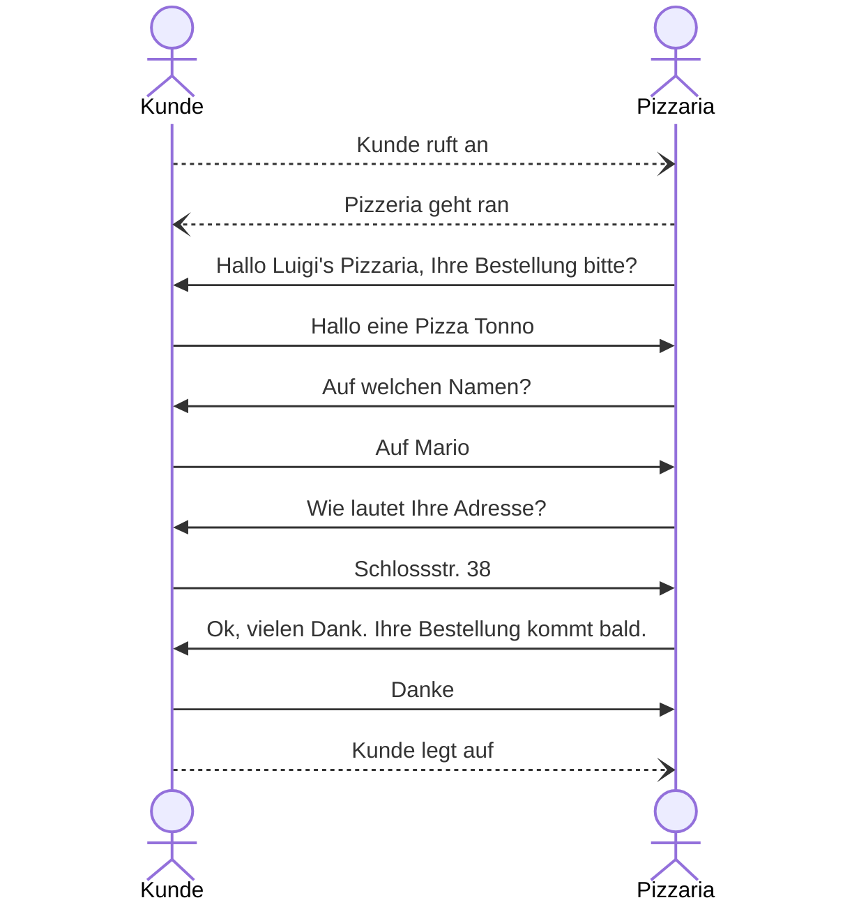
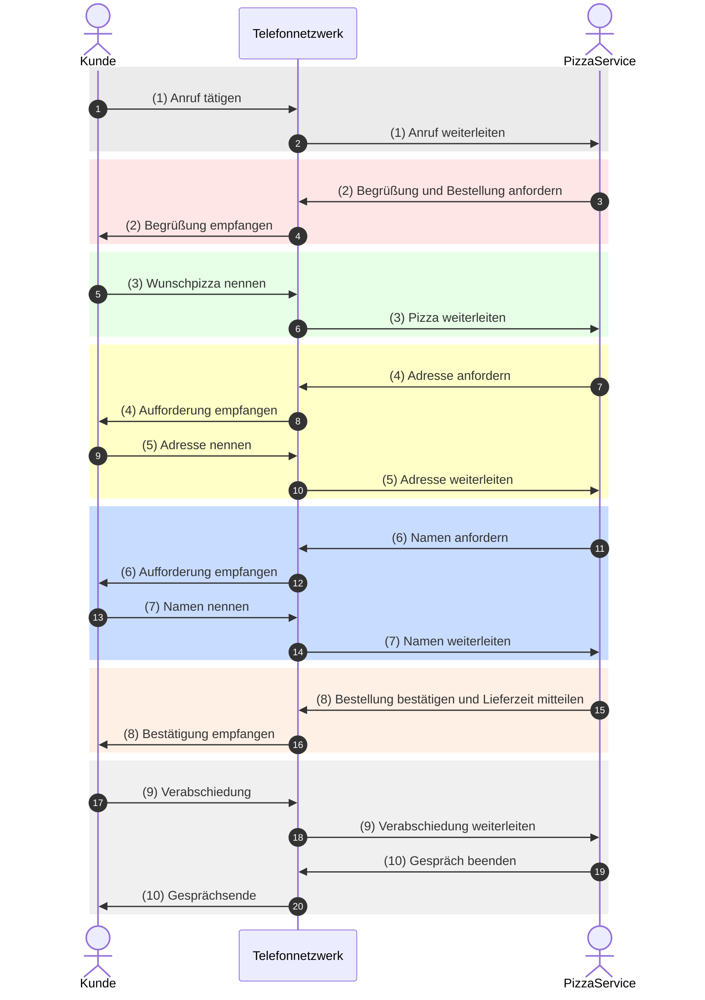
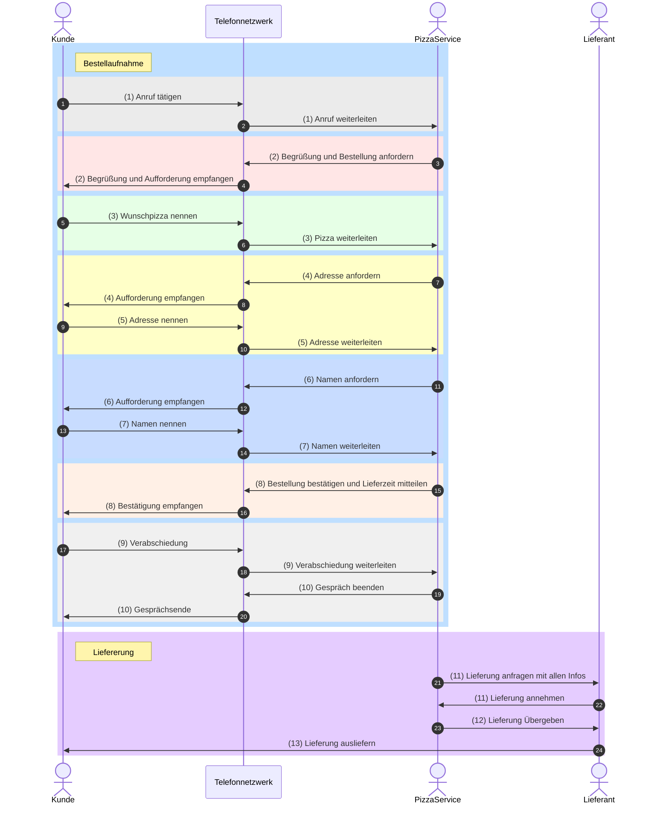

---
tags:
  - 4semester
  - informatik
  - RNVS
  - Übungsblatt
fach: "[[RNVS]]"
Thema: 
Benötigte Zeit:
date created: Friday, 3. May 2024, 20:08
date modified: Friday, 3. May 2024, 21:14
---

# 1. Der Pizzadienst (H)

>[!note] Aufgabenstellung
>Ein Protokoll ist eine Spezifikation von Vorschriften zum Informationsaustausch. Beschreiben Sie im Folgenden ein Protokoll zur Bestellung einer Pizza (Pizzaprotokoll), beim Pizza-Service Ihres Vertrauens! Indem Sie auf die Technologie „Telefon“ zurückgreifen, haben Sie eine Möglichkeit gefunden Nachrichten mit Ihrem Pizza-Service auszutauschen.

## (a) Ohne ein Bestellprotokoll herrscht Stille im Hörer. Damit Ihre Bestellung erfolgreich abgeschlossen werden kann, müssen Sie dem Pizza-Service Ihren Namen, Ihre Adresse und Ihre Wunschpizza mitteilen.

>[!note] Aufgabenstellung
Zeichnen Sie ein Sequenzdiagramm, das einen vollständigen Bestellvorgang am Telefon darstellt! Beachten Sie dabei:
> - Markieren Sie das Ende jeder Phase der Kommunikation!
> - Der Kunde übermittelt bestimmte Informationen genau dann, wenn er danach gefragt wird!

Welche der beiden Optionen ist "korrekter" bzw. wären beide Korrekt in der Klausur?

### Erste Option:

### Zweite Option:

## (b) Leider kommt die Pizza nicht durch die Telefonleitung. Erweitern Sie das Modell um einen zugrunde liegenden Dienst, mit dem der Lieferprozess realisiert wird. Berücksichtigen Sie hierbei das aus der Vorlesung bekannte Prinzip der Schichtung.

## (c) In der Vorlesung wurde die Unterscheidung in Steuerdaten und Nutzdaten diskutiert. Finden Sie hierzu Beispiele im Pizza-Service-Modell.

**Nutzdaten**: Pizza
**Steuerdaten:** Name und Adresse
## (d) Wie wirkt es sich auf die anderen Schichten aus, wenn Sie über einen Messengerdienst wie Signal oder WhatsApp statt einem Telefonanruf bestellen? Erläutern Sie außerdem kurz, inwiefern die Schichtentrennung hiervon betroffen ist.

**Anwendungsschicht:** Keine  a