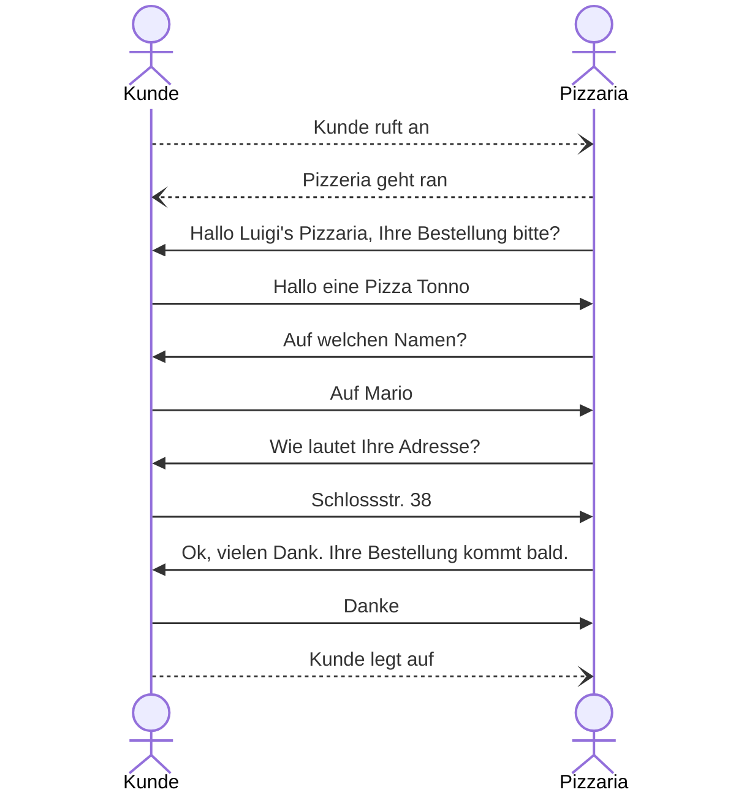
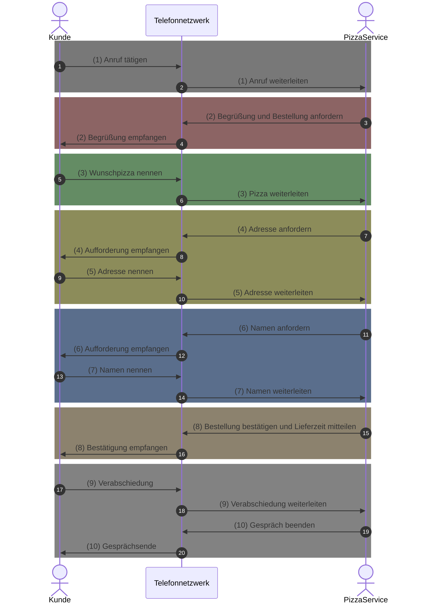
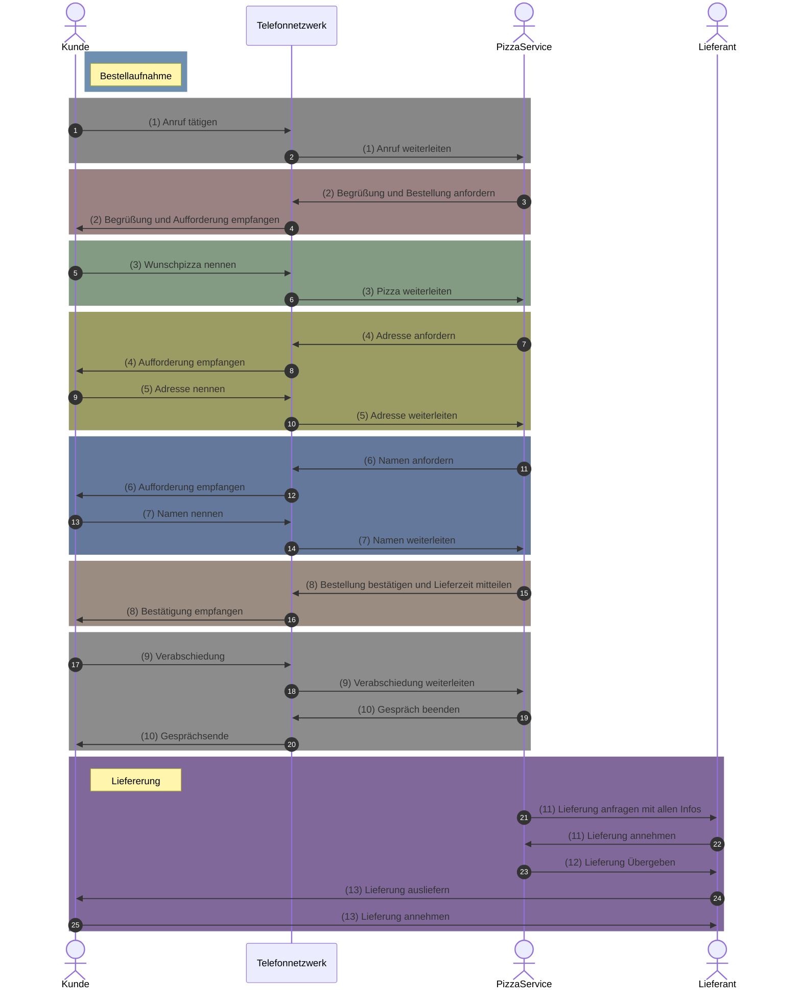
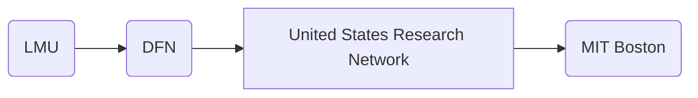
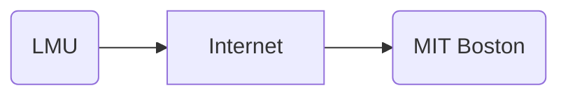

---
tags:
  - 4semester
  - informatik
  - RNVS
  - Übungsblatt
fach: "[[Rechnernetze und Verteilte Systeme (RNVS)]]"
Thema:
Benötigte Zeit: 3h
date created: Friday, 3. May 2024, 20:08
date modified: Friday, 14. June 2024, 12:39
---

# 1. Der Pizzadienst (H)

> [!note] Aufgabenstellung
> Ein Protokoll ist eine Spezifikation von Vorschriften zum Informationsaustausch. Beschreiben Sie im Folgenden ein Protokoll zur Bestellung einer Pizza (Pizzaprotokoll), beim Pizza-Service Ihres Vertrauens! Indem Sie auf die Technologie „Telefon“ zurückgreifen, haben Sie eine Möglichkeit gefunden Nachrichten mit Ihrem Pizza-Service auszutauschen.

## (a) Ohne ein Bestellprotokoll herrscht Stille im Hörer. Damit Ihre Bestellung erfolgreich abgeschlossen werden kann, müssen Sie dem Pizza-Service Ihren Namen, Ihre Adresse und Ihre Wunschpizza mitteilen.

> [!note] Aufgabenstellung
> Zeichnen Sie ein Sequenzdiagramm, das einen vollständigen Bestellvorgang am Telefon darstellt! Beachten Sie dabei:
>
> - Markieren Sie das Ende jeder Phase der Kommunikation!
> - Der Kunde übermittelt bestimmte Informationen genau dann, wenn er danach gefragt wird!

Welche der beiden Optionen ist "korrekter" bzw. wären beide Korrekt in der Klausur?

### Erste Option:

### Zweite Option:

## (b) Leider kommt die Pizza nicht durch die Telefonleitung. Erweitern Sie das Modell um einen zugrunde liegenden Dienst, mit dem der Lieferprozess realisiert wird. Berücksichtigen Sie hierbei das aus der Vorlesung bekannte Prinzip der Schichtung.

## (c) In der Vorlesung wurde die Unterscheidung in Steuerdaten und Nutzdaten diskutiert. Finden Sie hierzu Beispiele im Pizza-Service-Modell.

**Nutzdaten**: Pizza
**Steuerdaten:** Name und Adresse

## (d) Wie wirkt es sich auf die anderen Schichten aus, wenn Sie über einen Messengerdienst wie Signal oder WhatsApp statt einem Telefonanruf bestellen? Erläutern Sie außerdem kurz, inwiefern die Schichtentrennung hiervon betroffen ist.

> [!success] Lösung
> Das wirkt sich nicht aus, da das Dienstkonzept unabhängig von der Implementierung ist. Genau darauf zielt die Schichtentrennung

> [!fail] Falsch
> **Anwendungsschicht:** Änderung von Telefonprotkoll zu Nachrichtenprotokoll
> **Transport der Nachricht:**
>
> - Telefone verwenden (PSTN) Protokoll
> - Messenger verwenden Internetprotokoll
>
> **Datenübertragung:** Findet verschlüsselt statt zwischen dem Absender und Empfänger nicht wie beim Telefonat

---

# 2. Bestandteile des Schichtenmodells (H)

Der Kommunikationsaustausch zwischen den Schichten in Rechnernetzen erfolgt über verschiedene Daten-Einheiten.

## (a) Wie entsteht eine Protocol Data Unit (PDU) aus einer Service Data Unit (SDU)?

$$
\text{ICI} + \text{ID} = \text{IDU}
$$

→ Nach Schnittstelle wird IDU zu wird ID von IDU zu SDU

$$
\text{SDU}= \text{UD}
$$

→ $PCI + UD = PDU$

Eine Protocol Data Unit (PDU) entsteht aus einer Service Data Unit (SDU) durch den Prozess der Encapsulation, bei dem die SDU von einer höheren Schicht an eine niedrigere Schicht übergeben und mit zusätzlichen Steuerungsinformationen, wie Headern und Trailern, ergänzt wird. Diese zusätzlichen Informationen sind notwendig, um die Daten korrekt nach den Anforderungen des verwendeten Netzwerkprotokolls zu übertragen und zu verarbeiten.

## (b) Eine Protokollinstanz auf Schicht N tauscht PDUs mit ihrer Peer-Entity aus.

1.  Auf welcher Schicht befindet sich die Peer-Entity?
    - Schicht N
2.  Wie ist der Zusammenhang zwischen PDU und SDU auf den Schichten N und N – 1?
    2.1: (N-1)-SDU = (N)-PDU, daraus ergibt sich
    2.2: (N-1)-PDU = (N)-PDU + (N-1)-PCI
3.  Beschreiben Sie den Weg einer Nutzlast jeweils vertikal durch die Schichten in eigenen Worten.
    - Nutzlast beinhaltet Nutzerdaten oder Informationen
    - Jede Schicht wie TCP/IP fügt ihre eigene Steuerungsinformationen zu den Nutzdaten hinzu bevor diese an die nächste Schicht weitergegeben werden, damit die nächste Schicht weiß was mit der Nutzlast (=Payload) zu tun ist
    - Nutzlast ist der Hauptgrund für die Datenübertragung

## (c) Schnittbildung: Ordnen Sie jeder der folgenden zwei Abbildungen einen der Begriffe Dienstschnitt, Protokollschnitt oder Systemschnitt zu. Begründen Sie Ihre Wahl kurz.

### i)

DFN und USRN grouped

- Systemschnitt
  - Das Internet dient hier als ein Dienstschnittstelle, die allen beteiligten Parteien, unabhängig von ihren individuellen Netzwerken, eine standardisierte Schnittstelle bietet. Diese Schnittstelle erleichtert die Interoperabilität, indem sie ein gemeinsames Set von Diensten bereitstellt, wie zum Beispiel die Übertragung auf Basis des Internetprotokolls (IP), das von allen Parteien genutzt werden kann.

### ii)

- Protokollschnitt
  - zwischen Peer-Entitäten zweier kommunizierender Endsysteme

# 3. RFC 768 (H)

> [!note] Aufgabenstellung
> Um eine Standardisierung der Techniken und Entwicklungen des Internets (ursprünglich Arpanet) zu ermöglichen, organisiert die IETF (Internet Engineering Task Force) eine Standardisierungsform, die RFCs (Request for Comments). Ein RFC beginnt mit dem Aufruf ein Architekturproblem bei Rechnernetzen zu lösen, als Aufforderung zur Einreichung von Kommentaren.
>
> Durch Entwicklung, Prüfung und Implementierung der RFCs wird dieser vom Entwurf zum Standard. Über RFCs werden Technologien wie TCP, IP, HTTP als offene Standards definiert.
>
> RFC 768 aus dem Jahr 1980 ist ein einfaches aber oft implementiertes RFC. Es wird später in der Vorlesung noch genauer beleuchtet. Verschaffen Sie sich einen Überblick zum RFC 768 (https://tools.ietf.org/html/rfc768) und beantworten Sie folgende Fragen:

## (a) Erklären Sie was RFC 768 beschreibt und wofür es verwendet wird.

- Beschreibt UDP
  - als extra zum IP
  - **Ziel** Nachrichten an andere Programme mit so wenig Protokollmechanismen wie möglich
    - Transaktion orientiert
    - empfang und duplikat sicherheit sind nicht gegeben

> [!summary]
> RFC 768 definiert das User Datagram Protocol (UDP), das eine Methode bietet, um Datenpakete über ein IP-Netzwerk zu senden, ohne dass eine Verbindung aufgebaut werden muss. UDP wird genutzt, um Nachrichten mit minimalem Protokollaufwand zu senden. Das Protokoll ist transaktionsorientiert, jedoch sind weder die Zustellung noch die Duplikatfreiheit der Daten garantiert.

## (b) Welches für das Protokoll zentrale Merkmal erwähnt das Dokument?

> [!summary]
> Das zentrale Merkmal von UDP, das im RFC 768 hervorgehoben wird, ist die Einfachheit und Effizienz des Protokolls, das keine garantierte Zustellung bietet. Dies ermöglicht schnelle und effiziente Kommunikation, besonders nützlich in Anwendungen, bei denen Geschwindigkeit wichtiger ist als absolute Zuverlässigkeit.

## (c) Angenommen Sie möchten nun eine Pizza wie in Aufgabe 1 über RFC 768 statt per Telefon bestellen. Die technischen Einzelheiten können dabei vernachlässigt werden. Welche Schwierigkeiten ergeben sich nun durch die Eigenschaften des Protokolls gegenüber einer Telefonverbindung?

> [!summary]
> Die Nutzung von UDP für die Bestellung einer Pizza könnte einige Probleme mit sich bringen:
>
> - **Unzuverlässige Zustellung:** Da UDP keine Zustellungsgarantie bietet, könnte die Bestellung verloren gehen, ohne dass Sender oder Empfänger davon erfahren.
> - **Reihenfolge der Lieferung:** UDP garantiert nicht, dass Pakete in der Reihenfolge ihres Sendens ankommen. Bestelldetails könnten in falscher Reihenfolge ankommen und Verwirrung stiften.
> - **Fehlende Bestätigung:** Es erfolgt keine automatische Bestätigung des Empfangs einer Nachricht, was bedeutet, dass der Kunde nicht sicher sein kann, ob die Bestellung erfolgreich war.
>
> Diese Eigenschaften machen UDP weniger geeignet für kritische Kommunikationsaufgaben wie das Bestellen einer Pizza, bei denen Zuverlässigkeit und Bestätigung wichtig sind.

<!-- DISQUS SCRIPT COMMENT START -->

<!-- DISQUS RECOMMENDATION START -->

<noscript>
Please enable JavaScript to view the 
<a href="https://disqus.com/?ref_noscript" rel="nofollow">
comments powered by Disqus.
</a>
</noscript>

<!-- DISQUS RECOMMENDATION END -->

<noscript>Please enable JavaScript to view the <a href="https://disqus.com/?ref_noscript">comments powered by Disqus.</a></noscript>

<!-- DISQUS SCRIPT COMMENT END -->

<!-- Modal START -->

  

    &times;
    

      If MyUniNotes has been helpful and you’d like to support my efforts,  you can contribute with a donation: <a class="modal-dono-link" href="https://paypal.me/myuninotes4u">Donate via PayPal</a> :)  Your support will help me continue improving the content, but there is no obligation to donate.
    

    

      MyUniNotes is a personal, non-revenue project as I believe in accessible education for everyone. I manage this project alongside my studies, with all materials handwritten by me trying to help others understand challenging concepts.
    

  

<!-- Modal END -->
