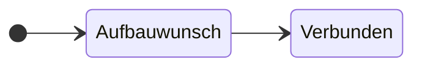
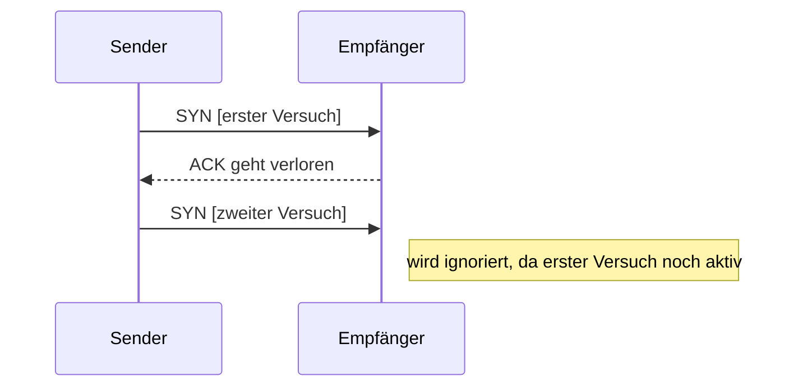
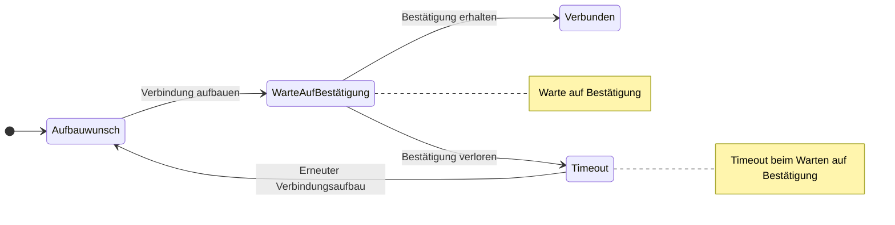
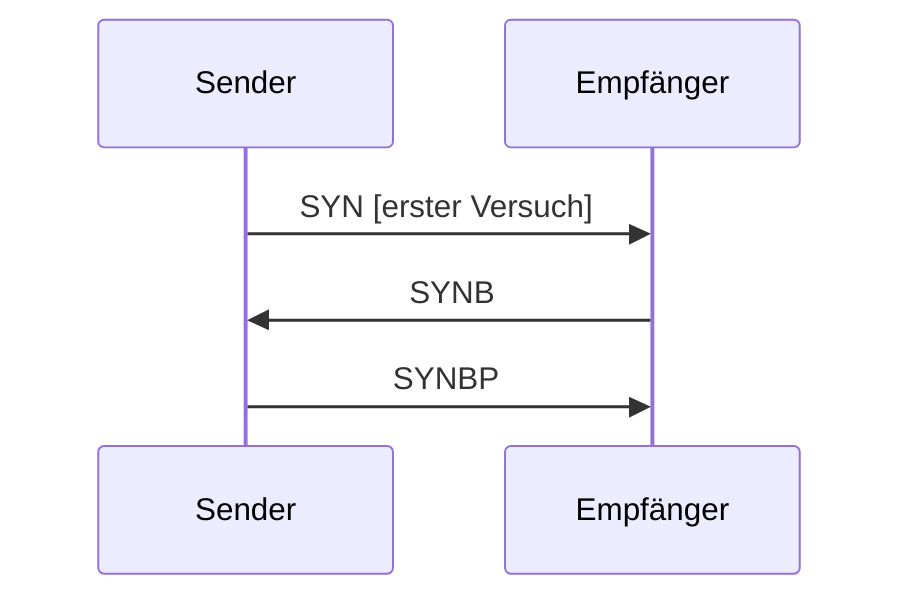
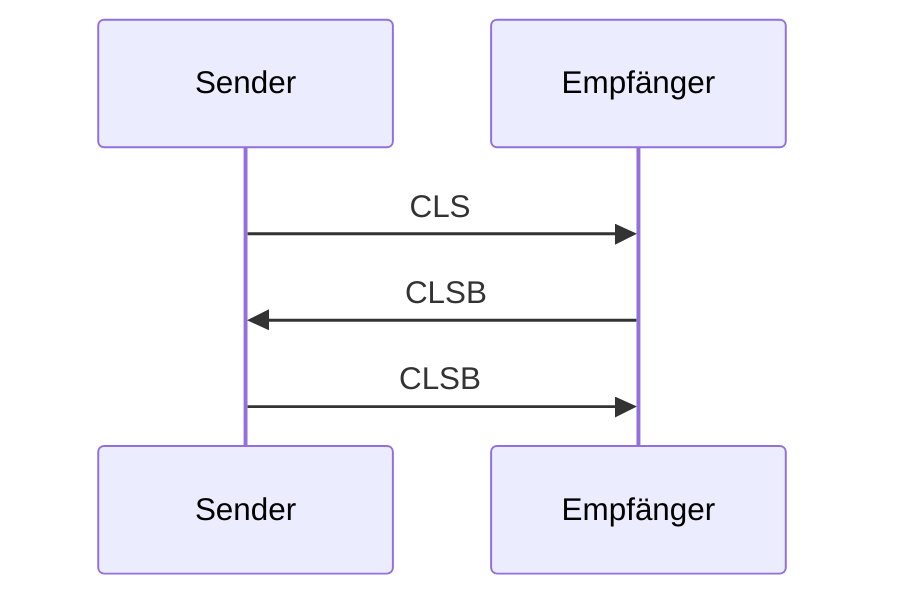
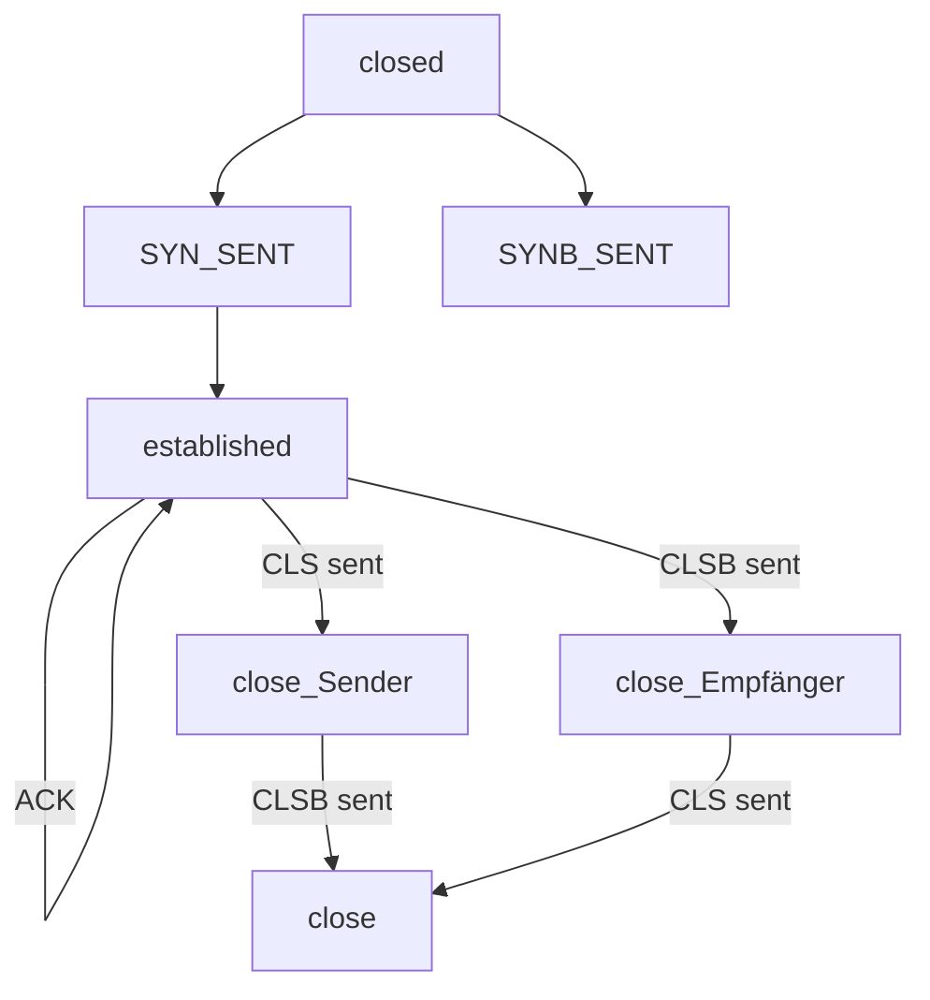
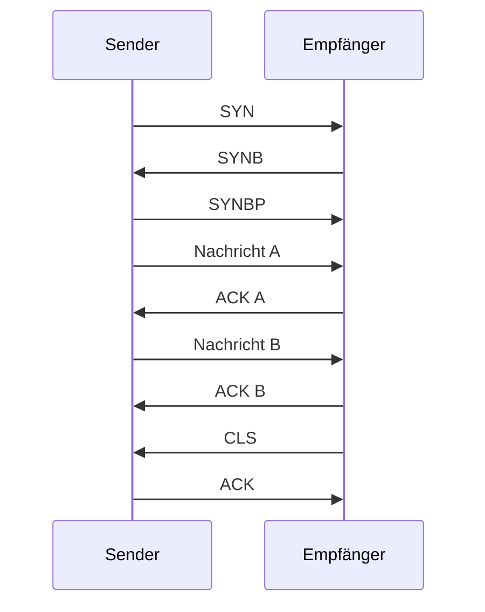
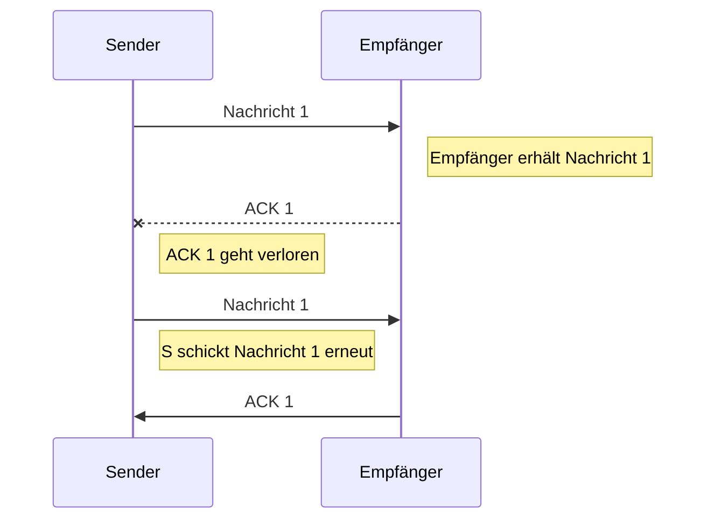
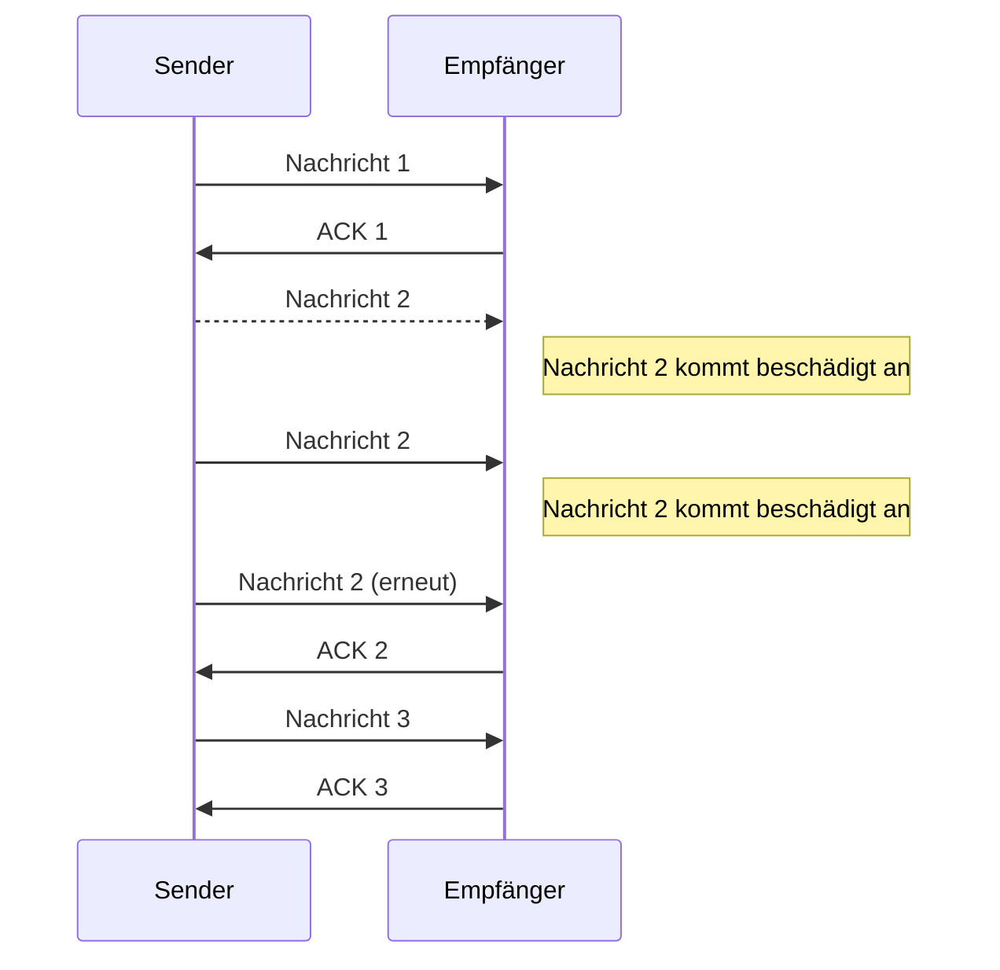

---
tags:
  - 4semester
  - FSK
  - informatik
  - Übungsblatt
fach: "[[Rechnernetze und Verteilte Systeme (RNVS)]]"
Thema:
Benötigte Zeit:
date created: Wednesday, 15. May 2024, 19:25
date modified: Wednesday, 24. July 2024, 19:13
---

# 1. Verbindungslose und verbindungsorientierte Kommunikation (H)

> [!note] Aufgabenstellung
> Ein Kriterium, um eine Kommunikationsbeziehung genauer zu charakterisieren, ist die Einteilung in verbindungslose und verbindungsorientierte Kommunikation. Beispiele aus dem Alltag wären z.B. die Briefpost und ein Telefongespräch.

## Erläutern Sie kurz den konzeptionellen Unterschied zwischen verbindungsloser und verbindungsorientierter Kommunikation!

- **Verbindungslose**
  - Keine feste Verbindung zwischen Absender und Empfänger
  - Daten werden in einzelnen Paketen abgeschickt, die unabhängig voneinander das Ziel erreichen können in möglicherweise unterschiedlicher Reihenfolge
- **Verbindungsorientiert**
  - feste Verbindung zwischen Sender und Empfänger
  - Verbindung muss erstmal hergestellt werden
  - Bestätigung über Erhalt der Nachricht

## Nennen Sie je zwei Beispieldienste!

- **Verbindungslose** (UDP)
  - DNS
  - SNMP
- **Verbindungsorientiert** (TCP)
  - HTTP
  - FTP

## Unter welchen Bedingungen ist eine verbindungslose Kommunikation von Vorteil?

Bei Services, bei denen der Verlust von einzelnen Datenpaketen nicht kritisch ist, wie z.B. Streaming-Diensten, wo Geschwindigkeit wichtiger ist als vollständige Datenintegrität.

> [!info]- Warum Datenpaketverluste bei Streamingdiensten tolerierbar sind
> Bei Streaming-Diensten wie Video- oder Audio-Streaming ist es oft akzeptabel, wenn einzelne Datenpakete verloren gehen, da die Priorität auf der Kontinuität und Geschwindigkeit der Übertragung liegt. Hier sind einige Gründe, warum diese Verluste meist tolerierbar sind:
>
> 1. **Echtzeitanforderungen**: Streaming-Dienste müssen Inhalte in Echtzeit oder nahezu in Echtzeit liefern. Eine Wartezeit für das erneute Senden verlorener Pakete würde zu spürbaren Verzögerungen führen, was den Genuss von Live-Übertragungen oder interaktiven Anwendungen wie Online-Spielen beeinträchtigen würde.
> 2. **Fehlerresilienz durch Kodierung**: Viele moderne Audio- und Video-Streaming-Technologien nutzen fortschrittliche Kodierungsverfahren, die gegenüber Datenverlusten bis zu einem gewissen Grad resilient sind. Sie können Informationen über mehrere Pakete verteilen, sodass der Verlust einzelner Pakete kompensiert werden kann, ohne die Gesamtqualität erheblich zu beeinträchtigen.
> 3. **Pufferung und Anpassung der Qualität**: Streaming-Client-Anwendungen nutzen Puffer, um Daten für einige Sekunden im Voraus zu speichern. Dies hilft, kleinere Unterbrechungen in der Datenübertragung ohne Unterbrechung der Wiedergabe zu überbrücken. Außerdem können viele Streaming-Dienste die Übertragungsqualität dynamisch anpassen, je nach der Qualität der Netzwerkverbindung.
> 4. **Benutzererfahrung**: In vielen Fällen wird ein kurzer Verlust der Bild- oder Tonqualität als weniger störend empfunden als eine Unterbrechung oder ein Einfrieren des Streams. Benutzer bevorzugen in der Regel eine kontinuierliche Wiedergabe gegenüber einer perfekten Wiedergabe.
>
> Ruckeln kann auftreten, wenn Datenpakete in größerem Umfang oder kontinuierlich verloren gehen, insbesondere wenn die Netzwerkbedingungen schlecht sind. In solchen Fällen können jedoch Technologien wie adaptive Bitratensteuerung dazu beitragen, die Qualität des Streams so anzupassen, dass das Ruckeln minimiert wird.

---

# 2. Verbindungsaufbau und -abbau (H)

> [!note] Aufgabenstellung
> in der Vorlesung wurde der Verbindungsaufbau und -abbau zur sicheren Kommunikation über einen unzuverlässigen Kanal vorgestellt. Im Folgenden sehen Sie ein Zustandsdiagramm für den 2-Wege-Handshake.

(Zustandsdiagramm)

## (a) Ein möglicher Fehler während des 2-Wege-Handshake ist bereits bekannt: der Verlust der zweiten Nachricht, der Bestätigung des Verbindungsaufbaus, führt zu einem Problem. Zeigen Sie anhand des Zustandsdiagramms in welchem Zustand die Teilnehmer sich befinden.

Im Zustand Aufbauwunsch

(Sequenzdiagramm)

## (b) Skizzieren Sie ein weiteres Szenario, in dem die Verbindung beim 2-Wege-Handshake nicht erfolgreich aufgebaut wird.

- Kann zudem sein, dass beide gleichzeitig ein `SYN` senden

## (c) In der Vorlesung wurde das vorgestellte Protokoll zu einem 3-Wege-Handshake und um einen Verbindungsabbau erweitert. Zeichnen Sie dazu ein Zustandsdiagramm.

**Verbindungsabbau**:

## (d) Auch der 3-Wege-Handshake kann den erfolgreichen Verbindungsaufbau nicht garantieren. Um genau zu sein, gibt es keinen Handshake der eine vollständige Garantie gibt. Begründen Sie warum es keinen solchen Handshake geben kann.

Handshakes sind nur ein Protokoll um die Kommunikation miteinander aufzustellen, bei nicht aufstellen dieser Kommunikation(z.B. schickt der Sender immer wieder Anfragen (SYN) aber bekommt keine Antwort drauf (SYNB) kann nie ein erfolgreicher Verbindungsaufbau stattfinden). Das Protokoll ist da, um die Parteien von einem erfolgreichen gegenseitigen Verbindungsaufbau zu informieren, nicht um direkt einen herzustellen.

## (e) Der 3-Wege-Handshake ist trotzdem weit verbreitet. Warum ist dieser in der Realität ausreichend für einen Verbindungsaufbau?

- Er ist zuverlässig genug, da sich Sender und Empfänger darauf einigen, nun Daten auszutauschen, wenn das Protokoll erfolgreich abgeschlossen wird.
- Er hilft bei der Initialisierung und Synchronisation der Sequenznummern, die notwendig sind, um die Pakete in der richtigen Reihenfolge zu empfangen und sicherzustellen, dass keine Daten verloren gehen.
- Er ist relativ einfach zu implementieren und verursacht nur wenig Overhead.
- Er hat sich als Standard durchgesetzt und ist daher weit verbreitet.

---

# Sequenznummern 1 (ohne Sendefenster) (H)

> [!note] Aufgabenstellung
> In vielen Protokollen werden zur Erkennung von Duplikaten, Reihenfolgeänderungen und Nachrichtenverlust Sequenznummern eingesetzt. Für diese Aufgabe gelten die folgenden Festlegungen:
>
> - Der Sender benutzt einen Zeitgeber/Timer, um die Zeit bis zum Erhalt der Quittung zu messen. Er wiederholt die Nachricht, wenn innerhalb eines Zeitintervalls (Timeout) von 800 ms keine Quittung eingetroffen ist.
> - Der Empfänger sendet nur positive Einzelquittungen.
> - Der Empfänger kann Nachrichten nur verarbeiten, wenn sie in der richtigen Reihenfolge eintreffen.
> - Alle Nachrichten (mit Nutzdaten, bzw. nur Quittung) sind gleich groß.
> - Die Netzverzögerung beträgt 20 ms und ist konstant für alle Nachrichten.
> - Der Sender wartet nach dem Senden jeder Nachricht, bis diese vom Empfänger quittiert wurde.

## (a) Unter welchen Bedingungen ist es akzeptabel, nach jeder einzeln gesendeten Nachricht auf eine Bestätigung/Quittung zu warten? Begründen Sie Ihre Antwort.

- Bei einer niedrigen Nachrichtenfrequenz
- Hohe Zuverlässigkeitsanforderung
  - wenn die Reihenfolge und Erhalt der Nachricht sehr wichtig sind
- Eindeutige Zustellung erforderlich
  - In Szenarien, wo jede Nachricht genau einmal ankommen soll
  - Szenaren wo keine Nachricht verloren oder dupliziert ankommen soll

> [!tip] Beispiel
> Ein Beispiel für eine Anwendung, bei der es akzeptabel ist, nach jeder Nachricht auf eine Bestätigung zu warten, könnte die Terminvergabe bei einer Behörde wie dem KVR (Kreisverwaltungsreferat) per E-Mail sein. Hier möchte man vermeiden, dass der gleiche Termin mehrfach vergeben wird oder dass ein Benutzer durch das wiederholte Senden von E-Mails versucht, einen Termin schneller zu bekommen. Durch das Warten auf eine Bestätigung wird sichergestellt, dass jeder Terminwunsch individuell verarbeitet und quittiert wird, bevor der nächste bearbeitet wird. Dies verhindert Spam und sorgt dafür, dass die Anfragen in der richtigen Reihenfolge bearbeitet werden.

## (b) Zeichnen Sie ein Sequenzdiagramm, in dem 2 Nachrichten fehlerfrei übertragen werden.

## (c) Zeichnen Sie ein Sequenzdiagramm, in dem der Sender 3 weitere Nachrichten sendet, aber die folgenden Fehlerfälle eintreten:

> [!info] Aufgabe wurde ausgebessert nach Input von Komillitonen. Danke L! 🩵

> [!danger] Fehler in Lösung welcher noch ausgebessert werden muss!
> **EDIT:** Fehler ausgebessert und sollte nun passen
>  
> Der Sender wartet 800ms (Timeout Länge) auf ACK 1, welches verloren gegangen ist. Wenn das nicht ankommt, sendet der Sender erneut Nachricht 1 (nicht 2). Ebenfalls steht in der Aufgabenstellung, dass der Empfänger nur positive Einzelquittungen schickt, weshalb er nicht NAK 2 zurückschicken kann. Der Sender muss dort ebenfalls 800ms warten, bis er Nachricht 2 erneut sendet.
>
> Sender erkennt den Fehler am Timout, da er nicht weiß, ob das ACK 1 verloren gegangen ist oder seine Nachricht beschädigt ankam. Empfänger erkennt es an doppelten Nachrichten

> [!note] Aufgabenstellung
>
> - Die Quittung für die erste Nachricht geht auf dem Weg zum Sender verloren.
> - Die zweite Nachricht kommt beim Empfänger beschädigt an und wird deswegen verworfen.
>
> Geben Sie für jeden dieser Fehlerfälle an, wie der Fehler jeweils auf Sender- und Empfängerseite erkannt wird!

---

# 4. Rollenwechsel

> [!note] Aufgabenstellung
> Die Kapitel 1 und 2 der Vorlesung wurden nun vollständig behandelt. Entwerfen Sie für den Stoff der beiden Kapitel **drei Quizfragen**, die Ihre Kommilitoninnen und Kommilitonen beantworten können sollten, nachdem sie die Kapitel bearbeitet haben. Geben Sie auch jeweils eine richtige und mindestens zwei falsche Antwortalternativen an.
>
> Achten Sie dabei besonders auf die richtige Wortwahl, so dass die Fragen nicht missverstanden werden können.

## Frage 1: Grundlagen von Netzwerken

**Frage:** Was ist der Unterschied zwischen einem Rechnernetz und einem verteilten System?

- **Richtige Antwort:** Ein Rechnernetz ist ein Zusammenschluss von Computern, die Informationen austauschen können, während ein verteiltes System darüber hinaus Dienste über diese Netzwerkverbindung anbietet.
- **Falsche Antwort 1:** In einem verteilten System können keine Informationen zwischen Computern ausgetauscht werden.
- **Falsche Antwort 2:** Ein Rechnernetz kann keine Verbindung zu anderen Computern herstellen, es dient nur der internen Datenverarbeitung.

## Frage 2: Datenübertragung und Protokolle

**Frage:** Welche der folgenden Aussagen beschreibt die Funktion eines Protokolls in einem Computernetzwerk?

- **Richtige Antwort:** Ein Protokoll definiert die Regeln für den Datenaustausch, einschließlich der Datenstrukturierung und Synchronisation.
- **Falsche Antwort 1:** Ein Protokoll ist eine physische Verbindung zwischen zwei Computern, die den Datenaustausch ermöglicht.
- **Falsche Antwort 2:** Protokolle sind ausschließlich für die Speicherung von Daten auf einem einzelnen Computer verantwortlich, nicht für die Übertragung.

## Frage 3: Konzepte der Internetarchitektur

**Frage:** Was versteht man unter dem Ende-zu-Ende-Prinzip im Kontext der Internetkommunikation?

- **Richtige Antwort:** Funktionen sollten am Endpunkt einer Kommunikation implementiert werden, um die Effizienz und Leistung zu optimieren.
- **Falsche Antwort 1:** Alle Daten müssen über einen zentralen Knoten laufen, bevor sie ihr Ziel erreichen.
- **Falsche Antwort 2:** Jeder Knoten im Netzwerk muss sämtliche Daten verarbeiten, die durch ihn hindurchgehen.

<!-- DISQUS SCRIPT COMMENT START -->

<!-- DISQUS RECOMMENDATION START -->

<noscript>
Please enable JavaScript to view the 
<a href="https://disqus.com/?ref_noscript" rel="nofollow">
comments powered by Disqus.
</a>
</noscript>

<!-- DISQUS RECOMMENDATION END -->

<noscript>Please enable JavaScript to view the <a href="https://disqus.com/?ref_noscript">comments powered by Disqus.</a></noscript>

<!-- DISQUS SCRIPT COMMENT END -->
