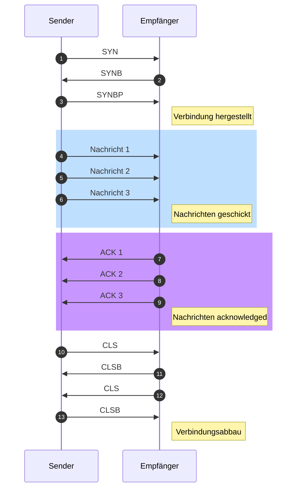
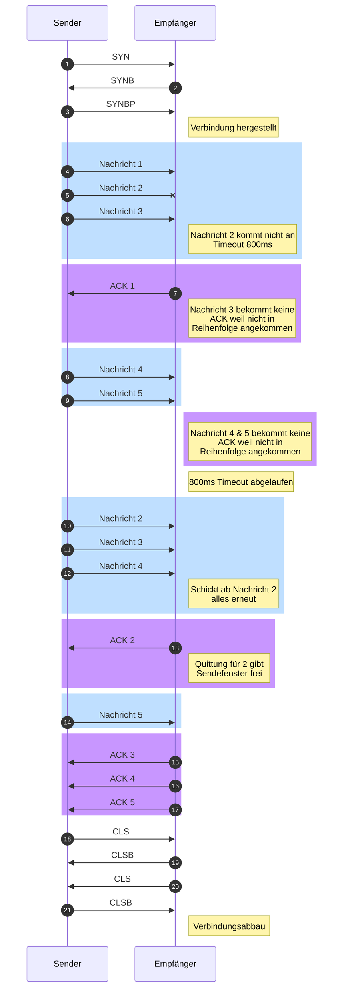
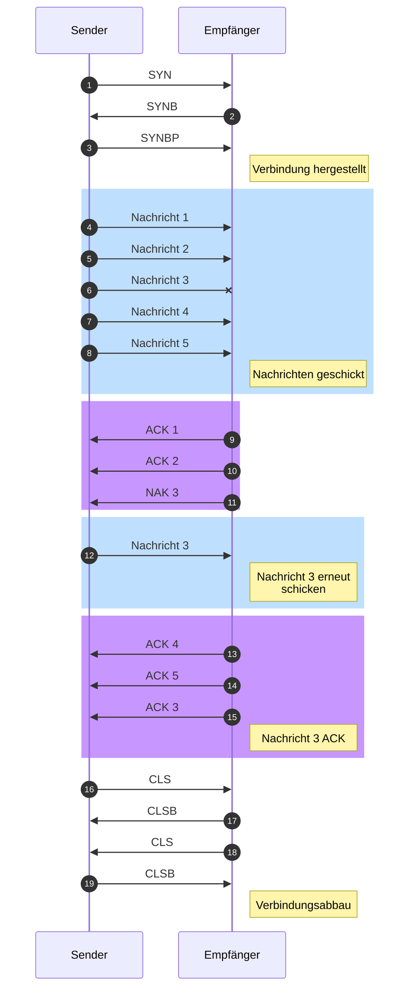
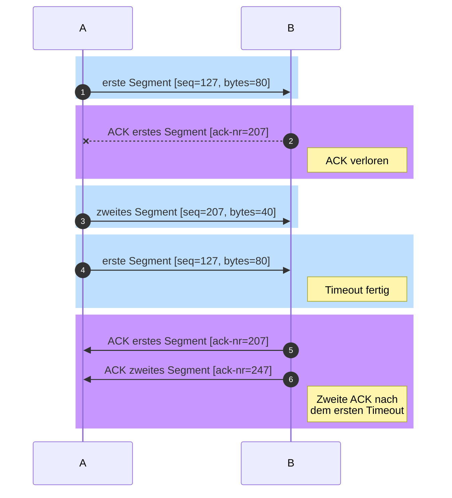
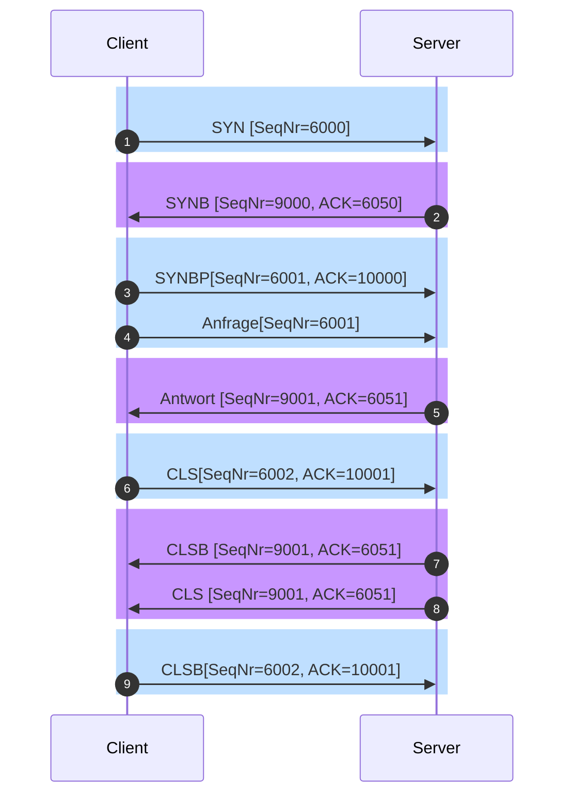
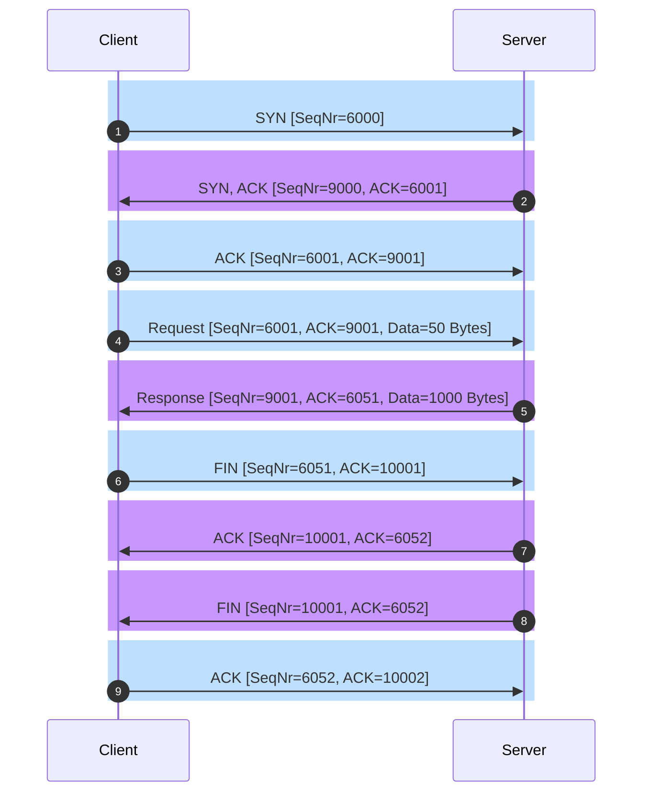

---
tags:
  - 4semester
  - informatik
  - RNVS
  - Übungsblatt
fach: "[[Rechnernetze und Verteilte Systeme (RNVS)]]"
Thema: 
Benötigte Zeit:
date created: Thursday, 30. May 2024, 16:06
date modified: Friday, 31. May 2024, 00:12
---

# 1. Fenstergröße beim Sliding-Window-Verfahren (H)

>[!note] Aufgabenstellung
> Eine Sendestation verschickt PDUs an Satelliten, mit einer maximalen Übertragungsrate von 64 kBit/s (1 kBit sind $10^3$ Bits). Die Größe der PDUs beträgt 512 Byte und jede PDU, die der Satellit empfängt, wird einzeln mit einer 8 Byte langen Antwort über einen separaten Rückkanal bestätigt (Quittung), ebenfalls mit einer maximalen Übertragungsrate von 64 kBit/s. In diesem Szenario soll das Sliding-Window-Verfahren (Fenstertechnik) eingesetzt werden, um Flusssteuerung (Flow Control) zu ermöglichen.
>
> Es sollen folgende Annahmen gelten:
>
> - Die Signalverzögerung zwischen Sender und Satellit beträgt 270 ms.
> - Es handelt sich um einen idealen Satellitenkanal, d.h. keine Nachricht geht verloren.

>[!tip] Eigenschaften des Sliding-Window-Verfahrens:
> - **Flusssteuerung**: Das Sliding-Window-Verfahren ermöglicht es einem Sender, mehrere Frames zu versenden, bevor eine Bestätigung vom Empfänger erforderlich ist. Dies optimiert den Datendurchsatz und die Effizienz des Netzwerks.
> - **Fenstergröße**: Die Anzahl der Frames, die gesendet werden können, ohne auf eine Quittung warten zu müssen, wird durch die Fenstergröße bestimmt. Diese kann dynamisch angepasst werden, um auf Netzwerkbedingungen zu reagieren.
> - **Fehlerkontrolle**: Das Verfahren unterstützt eine zuverlässige Datenübertragung, da verlorene oder fehlerhafte Frames erneut gesendet werden, wenn keine Bestätigung innerhalb eines bestimmten Zeitraums empfangen wird.
> - **Sequenznummern**: Jeder Frame wird mit einer Sequenznummer versehen, die dem Empfänger hilft, die richtige Reihenfolge der Frames wiederherzustellen und Duplikate zu erkennen.

## (a) Berechnen Sie jeweils die maximale effektive Übertragungsrate in kBit/s, wenn die Fenstergröße folgende Werte annimmt:

Geben Sie zusätzlich die Nutzungseffizienz des Kanals in Prozent an!

>[!summary] Formelsammlung
>1. **Berechnung der Round-Trip Time (RTT)**:
> $$
> \text{RTT} = 2 \times \text{Signalverzögerung}
> $$
>
>2. **Berechnung der Übertragungszeit für eine PDU**:
> $$
> \text{Übertragungszeit für eine PDU} = \frac{(\text{Größe der PDU in Bits})}{(\text{Übertragungsrate})}
> $$
>
>3. **Berechnung der Übertragungszeit für eine Quittung**:
> $$
> \text{Übertragungszeit für eine Quittung} = \frac{(\text{Größe der Quittung in Bits})}{(\text{Übertragungsrate})}
> $$
>
>4. **Berechnung der Gesamtzeit für den Versand und Empfang von $N$ PDUs**:
> $$
> \text{Gesamtzeit} = N \times \text{Übertragungszeit für eine PDU} + \text{RTT} + N \times \text{Übertragungszeit für eine Quittung}
> $$
>
>5. **Berechnung der effektiven Übertragungsrate für $N$ PDUs**:
> $$
> \text{Effektive Übertragungsrate} = \frac{N \times (\text{Größe der PDU in Bits})}{\text{Gesamtzeit}}
> $$
>
>6. **Berechnung der Nutzungseffizienz des Kanals**:
> $$
> \text{Nutzungseffizienz (\%)} = \left( \frac{\text{Effektive Übertragungsrate}}{\text{Maximale Übertragungsrate}} \right) \times 100
> $$
>
>7. **Berechnung der minimalen Fenstergröße für 100\% Effizienz**:
> $$
> \text{Minimale Fenstergröße} = \left( \frac{\text{RTT}}{\text{Übertragungszeit für eine PDU}} \right) + 1
> $$

### 1. 1 PDU

#### Benötigte Formeln:

5. **Berechnung der effektiven Übertragungsrate für $N$ PDUs**:
 $$
\text{Effektive Übertragungsrate} = \frac{N \times (\text{Größe der PDU in Bits})}{\text{Gesamtzeit}}
$$

4. **Berechnung der Gesamtzeit für den Versand und Empfang von $N$ PDUs**:
$$
 \text{Gesamtzeit} = N \times \text{Übertragungszeit für eine PDU} + \text{RTT} + N \times \text{Übertragungszeit für eine Quittung}
$$

2. **Berechnung der Übertragungszeit für eine PDU**:
$$
 \text{Übertragungszeit für eine PDU} = \frac{(\text{Größe der PDU in Bits})}{(\text{Übertragungsrate})}
$$

1. **Berechnung der Round-Trip Time (RTT)**:
 $$
\text{RTT} = 2 \times \text{Signalverzögerung}
$$

3. **Berechnung der Übertragungszeit für eine Quittung**:
$$
\text{Übertragungszeit für eine Quittung} = \frac{(\text{Größe der Quittung in Bits})}{(\text{Übertragungsrate})}
$$

- $1 \ PDU = 512 \ Bytes  \overset{\cdot 8}{=} 4096 \ Bits$ 
- $\text{Signalverzögerung} = 270ms$
- $\text{Übertragungsrate} = 64\frac{kBit}{s} \overset{\cdot 1000}{=} 64000\frac{Bits}{s}$
- $\text{Grösse der Quittung} = 8 \ Bytes \overset{\cdot 8}{=} 64 \ Bit$

#### Einsetzen in Formeln

3. **Berechnung der Übertragungszeit für eine Quittung**:
$$
\text{Übertragungszeit für eine Quittung} = \frac{64 \ Bits}{64000 \frac{Bits}{s}} =0.001s
$$

1. **Berechnung der Round-Trip Time (RTT)**:
 $$
\text{RTT} = 2 \times 270ms = 540ms
$$

2. **Berechnung der Übertragungszeit für eine PDU**:
$$
 \text{Übertragungszeit für eine PDU} = \frac{4096 \ Bits}{64000 \ \frac{Bits}{s}} = 0.064s
$$

4. **Berechnung der Gesamtzeit für den Versand und Empfang von $N$ PDUs**:
$$
 \text{Gesamtzeit} = 1 \times 0.064s + 0.54s + 1 \times 0.001s = 0.605s 
$$

5. **Berechnung der effektiven Übertragungsrate für $N$ PDUs**:
 $$
\text{Effektive Übertragungsrate} = \frac{1 \times 4096 \ Bits}{0.605s} = 6770.2479\frac{Bits}{s}
$$

$$
\lfloor 6770.2479\frac{Bits}{s}\rfloor = 6770\frac{Bits}{s} 
$$

#### Zur Berechnung der Nutzungseffiziens

#### Benötigte Formel

6. **Berechnung der Nutzungseffizienz des Kanals**:
$$
\text{Nutzungseffizienz (\%)} = \left( \frac{\text{Effektive Übertragungsrate}}{\text{Maximale Übertragungsrate}} \right) \times 100
$$
#### Einsetzen

6. **Berechnung der Nutzungseffizienz des Kanals**:
$$
\text{Nutzungseffizienz (\%)} = \left( \frac{6770\frac{Bits}{s} }{64000\frac{Bits}{s}} \right) \times 100 = 10.58 \ \%
$$
### 2. 7 PDUs

Trivial zu $1 \ PDU$ es wird nur $N$ angepasst

- $1 \ PDU = 512 \ Bytes  \overset{\cdot 8}{=} 4096 \ Bits$ 
- $\text{Signalverzögerung} = 270ms$
- $\text{Übertragungsrate} = 64\frac{kBit}{s} \overset{\cdot 1000}{=} 64000\frac{Bits}{s}$
- $\text{Grösse der Quittung} = 8 \ Bytes \overset{\cdot 8}{=} 64 \ Bit$

$$
\text{Übertragungszeit für eine Quittung} = \frac{64 \ Bits}{64000 \frac{Bits}{s}} =0.001s
$$

$$
\text{RTT} = 2 \times 270ms = 540ms
$$
$$
 \text{Übertragungszeit für eine PDU} = \frac{4096 \ Bits}{64000 \ \frac{Bits}{s}} = 0.064s
$$

  ↓ Musterlösung verwendet N = 1 für Gesamtzeit? ↓ Aber N = 7 für Effektive Übertragungsrate ↓ 

>[!question] Frage:: #Frage
>warum nehmen wir aber direkt das erste ACK vom Sender und warten nicht auf alle 7?

$$
 \text{Gesamtzeit} = 1 \times 0.064s + 0.54s + 1 \times 0.001s = 0.605s 
$$

 $$
\text{Effektive Übertragungsrate} = \frac{7 \times 4096 \ Bits}{0.605s} = 47391.7355\frac{Bits}{s}
$$

$$
\lfloor 47391.7355\frac{Bits}{s}\rfloor = 47391\frac{Bits}{s} 
$$
$$
\text{Nutzungseffizienz (\%)} = \left( \frac{47391\frac{Bits}{s} }{64000\frac{Bits}{s}} \right) \times 100 = \ 74.05  \ \%
$$

  ↑ Musterlösung ende ↑

  ↓ Meine Lösung mit N=7 für gesamtzeit ↓ 

$$
 \text{Gesamtzeit} = 7 \times 0.064s + 0.54s + 7 \times 0.001s = 0.995s 
$$

 $$
\text{Effektive Übertragungsrate} = \frac{7 \times 4096 \ Bits}{0.995} = 28816\frac{Bits}{s}
$$

$$
\text{Nutzungseffizienz (\%)} = \left( \frac{28816\frac{Bits}{s} }{64000\frac{Bits}{s}} \right) \times 100 = \ 45.03 \ \%
$$

  ↑ Meine Lösung ende ↑

### 3. 15 PDUs

- $1 \ PDU = 512 \ Bytes  \overset{\cdot 8}{=} 4096 \ Bits$ 
- $\text{Signalverzögerung} = 270ms$
- $\text{Übertragungsrate} = 64\frac{kBit}{s} \overset{\cdot 1000}{=} 64000\frac{Bits}{s}$
- $\text{Grösse der Quittung} = 8 \ Bytes \overset{\cdot 8}{=} 64 \ Bit$

$$
\text{Übertragungszeit für eine Quittung} = \frac{64 \ Bits}{64000 \frac{Bits}{s}} =0.001s
$$

$$
\text{RTT} = 2 \times 270ms = 540ms
$$
$$
 \text{Übertragungszeit für eine PDU} = \frac{4096 \ Bits}{64000 \ \frac{Bits}{s}} = 0.064s
$$
$$
 \text{Gesamtzeit} = 1 \times 0.064s + 0.54s + 1 \times 0.001s = 0.605s 
$$

>[!danger] Wichtig
- [ ] FORMEL FÜR GESAMTZEIT EVENTUELL AUSBESSERN UND N ENTFERNEN!

 $$
\text{Effektive Übertragungsrate} = \frac{15 \times 4096 \ Bits}{0.605s} = 101553\frac{Bits}{s}
$$
$$
\text{Nutzungseffizienz (\%)} = \left( \frac{101553\frac{Bits}{s} }{64000\frac{Bits}{s}} \right) \times 100 = \ 158.68 \ \%
$$

## (b) Berechnen Sie die minimale Fenstergröße, mit der die Nutzungseffizienz des Kommunikationskanals zum Satelliten 100% erreicht!

### Nutzungseffizienz umformen für Effektive Übertragungsrate
$$
\begin{aligned}
\text{Nutzungseffizienz (\%)} = \left( \frac{x \ \frac{Bits}{s} }{64000\frac{Bits}{s}} \right)  &=  1 \mid \cdot \ 64000\frac{Bits}{s}\\
x &= 64000\frac{Bits}{s}\\
\text{Effektive Übertragungsrate} &= 64000\frac{Bits}{s}
\end{aligned}
$$

### Effektive Übertragungsrate umformen für PDU-Anzahl
 $$
 \begin{aligned}
\text{Effektive Übertragungsrate} = \frac{N \times 4096 \ Bits}{0.605s} &= 64000\frac{Bits}{s} \mid \ \cdot0.605s\\
N \times 4096 \ Bits&= 38720\ Bits \mid \div \ 4096 \ Bits \\
N &= \lceil9.4531\rceil \\ 
N &= 10 \\ 
\end{aligned}
$$

---

# 2. Sequenznummern 2 (mit Sendefenster) (H)

>[!note] Aufgabenstellung
> Im Übungsblatt der vorletzten Woche wurden *Sequenznummern* im Fall betrachtet, dass nach jeder Nachricht auf die Quittung gewartet werden muss. In dieser Aufgabe können mehrere Nachrichten auf einmal gesendet werden. Ansonsten gelten die selben Festlegungen, sofern nicht anders angegeben:
> 
> - Der Sender benutzt einen Zeitgeber/Timer, um die Zeit bis zum Erhalt der Quittung zu messen. Er wiederholt die Nachricht, wenn innerhalb eines Zeitintervalls (Timeout) von 800 ms keine Quittung eingetroffen ist.
> - Der Empfänger sendet nur positive Einzelquittungen.
> - Der Empfänger kann Nachrichten nur verarbeiten, wenn sie in der richtigen Reihenfolge eintreffen.
> - Alle Nachrichten (mit Nutzdaten, bzw. nur Quittung) sind gleich groß.
> - Die Netzverzögerung beträgt 20 ms und ist konstant für alle Nachrichten.
> - Der Sender verwendet ein Sendefenster $w = 3$, das ihm erlaubt 3 Nachrichten auf einmal abzusenden, bevor die erste Quittung zurück ist.

## (a) Geben Sie ein Sequenzdiagramm für die fehlerfreie Übertragung dreier Nachrichten an. Hinweis: Bedenken Sie das festgelegte Sendefenster!

## (b) Zeichnen Sie ein Sequenzdiagramm, in dem der Sender fünf Nachrichten sendet, aber die zweite Nachricht auf dem Weg zum Empfänger verloren geht. Führen Sie das Diagramm fort, bis alle Nachrichten erfolgreich übertragen wurden.

>[!attention] Aufgabenstellung
> Für die folgenden Teilaufgaben gelten neue Festlegungen:
> - Der Sender verwendet ein größeres Sendefenster von $w = 5$.
> - Der Empfänger sendet nun auch negative Quittungen, sollte eine Nachricht fehlerhaft ankommen.
> - Der Empfänger kann korrekte Nachrichten, die in der falschen Reihenfolge ankommen, speichern und später verarbeiten.

## (c) Zeichnen Sie ein Sequenzdiagramm, in dem der Sender fünf Nachrichten sendet, aber die dritte Nachricht fehlerhaft beim Empfänger ankommt.

## (d) Welchen Vorteil haben negative Quittungen?

- Schneller Abhandlung von fehlerhaften Nachrichten, da auf kein Timeout gewartet werden muss
- Auf fehlerhafte Nachricht folgende Nachrichten müssen nicht erneut abgeschickt werden (keine doppelten Nachrichten) 

## (e) Wie könnte man den Umgang mit positiven Quittungen optimieren, wenn der Empfänger mehrere Nachrichten quittieren soll?

- **Sammelquittungen**:
  - für mehrere aufeinander folgende PDUs: PDUs bis Sequenznummer N sind angekommen
	  - z.B. Quittung für alle PDUs bis 3

- **Selektive Quittungen**:
  - selektive Auswahl an PDUs die angekommen sind, z.B. 1,3,5 

---

# 3. 3-Way-Handshake und Sequenznummern bei TCP

>[!note] Aufgabenstellung
> Protokollkonzepte wie 3-Way-Handshaking und Sequenznummern sind Mechanismen für das Verbindungsmanagement und für die zuverlässige Kommunikation. Diese Mechanismen werden z.B. im Transmission Control Protocol (TCP) eingesetzt. Zur Bearbeitung dieser Aufgabe wird die Trace-Datei `trace3.pcap` bereitgestellt, die mitgeschnittenen TCP-Verkehr enthält.
> 
> Die Datei lässt sich z.B. mit dem freien Programm Wireshark^1 öffnen, das den mitgeschnittenen TCP-Verkehr grafisch aufbereitet anzeigen und filtern kann.
>
> Wireshark stellt die PDUs verschiedener Schichten tabellarisch dar. In dieser Aufgabe soll es um TCP-PDUs (Segmente) gehen. Sie sind daran zu erkennen, dass in der Protocol-Spalte TCP steht. Die Informationen der TCP-PCI werden von Wireshark übersichtlich aufbereitet und je Segment dargestellt.

## (a) Identifizieren Sie die zum 3-Way-Handshake Vorgang gehörenden Segmente in `trace3.pcap`.

| No. | Time     | Source        | Destination   | Protocol | Length | Info                                                     |
| --- | -------- | ------------- | ------------- | -------- | ------ | -------------------------------------------------------- |
| 1   | 0.000000 | 192.168.0.101 | 128.153.4.131 | TCP      | 62     | 1226 → 22 [SYN] Seq=0 Win=64240 Len=0 MSS=1460 SACK_PERM |
| 2   | 0.049886 | 128.153.4.131 | 192.168.0.101 | TCP      | 60     | 22 → 1226 [SYN, ACK] Seq=0 Ack=1 Win=1460 Len=0 MSS=1460 |
| 3   | 0.049935 | 192.168.0.101 | 128.153.4.131 | TCP      | 54     | 1226 → 22 [ACK] Seq=1 Ack=1 Win=64240 Len=0              |
## (b) Identifizieren Sie die zum Verbindungsabbau gehörigen Segmente.

| No. | Time       | Source          | Destination     | Protocol | Length | Info                                      |
|-----|------------|-----------------|-----------------|----------|--------|-------------------------------------------|
| 171 | 25.968266  | 192.168.0.101   | 128.153.4.131   | TCP      | 54     | 1226 → 22 [FIN, ACK] Seq=2974 Ack=5634 Win=63496 Len=0 |
| 172 | 26.024317  | 128.153.4.131   | 192.168.0.101   | TCP      | 60     | 22 → 1226 [ACK] Seq=5634 Ack=2975 Win=8760 Len=0      |
| 173 | 26.031474  | 128.153.4.131   | 192.168.0.101   | TCP      | 60     | 22 → 1226 [FIN, ACK] Seq=5634 Ack=2975 Win=8760 Len=0 |
| 174 | 26.031492  | 192.168.0.101   | 128.153.4.131   | TCP      | 54     | 1226 → 22 [ACK] Seq=2975 Ack=5635 Win=63496 Len=0     |

## (c) Berechnen Sie aus den Paketen des 3-Way-Handshake das so genannte Round Trip Delay (RTD). Das ist die Zeit, die vom Versenden eines Segments bis zum Erhalt einer Antwort vergeht.

Um das Round Trip Delay (RTD) aus den Paketen des 3-Way-Handshake zu berechnen, betrachten wir die Zeitdifferenzen zwischen den gesendeten und empfangenen Segmenten. Das RTD ist die Zeit, die vom Versenden eines Segments bis zum Erhalt einer Antwort vergeht.

1. **SYN-Segment gesendet:**
   - Zeitpunkt: 0.000000 Sekunden (Paket Nr. 1)

2. **SYN-ACK-Segment empfangen:**
   - Zeitpunkt: 0.049886 Sekunden (Paket Nr. 2)
   - Zeitdifferenz: 0.049886 - 0.000000 = 0.049886 Sekunden

3. **ACK-Segment gesendet:**
   - Zeitpunkt: 0.049935 Sekunden (Paket Nr. 3)

Das Round Trip Delay (RTD) wird anhand der Zeitdifferenz zwischen dem SYN-Segment und dem Empfang des SYN-ACK-Segments berechnet:

$$
\text{RTD} = 0.049886 \text{ Sekunden}
$$

## (d) Welche absoluten und relativen TCP-Sequenznummern besitzen diese Segmente?

>[!tip] Absolute und relative TCP-Sequenznummern:
> - **Absolute Sequenznummern**: Diese Nummern beziehen sich auf die tatsächlichen, im TCP-Segment enthaltenen Zahlen, die den Datenbytes zugeordnet sind. Sie beginnen mit einer zufälligen Nummer zu Beginn der Verbindung und erhöhen sich mit jedem gesendeten Byte.
> - **Relative Sequenznummern**: Diese sind eine vereinfachte Darstellung der Sequenznummern, die relativ zur ersten übertragenen Sequenznummer als Null gesetzt sind. Sie helfen, die Kommunikation und Analyse von TCP-Verbindungen zu vereinfachen, indem die tatsächlichen Startsequenzen ausgeblendet werden.
> - **Zweck**: Beide Sequenznummern dienen dazu, die Reihenfolge der gesendeten Daten zu verfolgen und sicherzustellen, dass alle Daten in der richtigen Reihenfolge beim Empfänger ankommen. Sie sind zentral für das zuverlässige Protokoll von TCP, indem sie eine Grundlage für Bestätigungen und mögliche Neuübertragungen bieten.

Um die absoluten und relativen TCP-Sequenznummern der Segmente im 3-Way-Handshake zu klären, ist es hilfreich, ihre Werte direkt aus der TCP-Transaktionsbeschreibung zu analysieren.

### Segmente im 3-Way-Handshake:
1. **SYN-Segment** (von Host A zu B):
   - **Absolute Sequenznummer**: 0 (typisch für den Beginn eines SYN-Segments)
   - **Relative Sequenznummer**: 0 (relative Nummerierung beginnt hier)

2. **SYN-ACK-Segment** (von Host B zu A):
   - **Absolute Sequenznummer**: 0 (Antwort auf das erste SYN)
   - **Relative Sequenznummer**: 0 (Startpunkt der Sequenznummern für Host B)
   - **ACK-Nummer**: 1 (bestätigt den Empfang des SYN-Segments von Host A, Sequenznummer wird um eins erhöht)

3. **ACK-Segment** (von Host A zu B, schließt den Handshake ab):
   - **Absolute Sequenznummer**: 1 (nach dem ersten SYN, welches die Sequenz bei 0 startete)
   - **Relative Sequenznummer**: 1 (weil die erste relative Sequenznummer, die 0 ist, das SYN war und dieses ACK die nächste übertragene Einheit ist)
   - **ACK-Nummer**: 1 (bestätigt den Empfang des SYN-ACK von Host B)

Diese Segmentbeschreibungen zeigen, wie die Sequenznummern im Rahmen des TCP 3-Way-Handshakes fortschreiten. Die absolute Sequenznummer ist die tatsächliche Nummer auf den Paketen, während die relative Sequenznummer im Kontext von Analysetools wie Wireshark verwendet wird, um die Lesbarkeit und Analyse zu erleichtern.
## (e) In dem Mitschnitt werden (in der Standardkonfiguration von Wireshark) auch PDUs vom Protokoll der Anwendungsschicht (SSHv2) angezeigt. Nutzt dieses Protokoll auch TCP? Begründen Sie Ihre Vermutung kurz.

>[!tip] SSHv2 (Secure Shell Version 2):
> - **Sicherheit**: SSHv2 bietet eine verschlüsselte Verbindung zwischen zwei Computern, um Daten sicher zu übertragen und Befehle auszuführen.
> - **Authentifizierung**: Es unterstützt verschiedene Authentifizierungsmethoden, wie Passwort- und Schlüssel-basierte Authentifizierung, um die Identität der Benutzer zu überprüfen.
> - **Verwendungszweck**: SSHv2 wird häufig für den sicheren Remote-Zugriff auf Server, das Durchführen von Remote-Befehlen und die sichere Übertragung von Dateien verwendet.
> - **Port**: Standardmäßig verwendet SSHv2 den TCP-Port 22, um eine Verbindung aufzubauen und Daten zu übertragen.

Ja, SSHv2 nutzt TCP.

**Begründung**:

- **Zuverlässigkeit**: SSHv2 benötigt eine zuverlässige Verbindung, die TCP bietet.
- **Sequenznummern und ACKs**: Die im Mitschnitt sichtbaren TCP-Sequenznummern und ACKs zeigen, dass eine verbindungsorientierte Kommunikation stattfindet.
- **Standardport**: SSH verwendet standardmäßig TCP-Port 22.

Kurz gesagt: SSHv2 verwendet TCP wegen der Zuverlässigkeit und der verbindungsorientierten Kommunikation, was im Wireshark-Mitschnitt ersichtlich ist.

---

# 4. TCP Sequenznummern (H)

>[!note] Aufgabenstellung
> Zwei Hosts A und B kommunizieren über eine TCP Verbindung. Host B hat bereits 126 Bytes von Host A vollständig empfangen und Host A sendet zwei weitere Segmente der Größen 80 sowie 40 Bytes. Die Sequenznummer des ersten Segments ist 127, der Quellport ist 302 und der Zielport ist 80. Host B sendet ein Acknowledgement immer, sobald es ein Segment von Host A empfangen hat.

## (a) Wie lauten Sequenznummer, Quell- sowie Zielport des zweiten Segments von Host A an B?

- Sequenznummer: $127+80 = 207$
- Quellport : 302
- Zielport: 80

## (b) Falls das erste Segment vor dem zweiten Segment bei B eintritt, wie lauten im ACK (Quittung) die ACK-Nr., Quell- und Zielport?

$$
\text(ACK-NUMMER) = \text{(Sequenznummer)}+\text{(Bytes die versendet werden)}
$$
- Sequenznummer: $127$
- ACK-Nummer: $127+80 = 207$
- Quellport : 302
- Zielport: 80

## (c) Falls das erste Segment nach dem zweiten Segment bei B eintritt, wie lauten im ACK (Quittung) die ACK-Nr., Quell- und Zielport?
### Für das erste Segment
- Sequenznummer: $127$
- ACK-Nummer: $127+80 =207$
- Quellport : 302
- Zielport: 80

### Für das zweite Segment
- Sequenznummer: $207$
- ACK-Nummer: $207+40 =247$
- Quellport : 302
- Zielport: 80

## (d) Angenommen, beide Segmente kommen in der richtigen Reihenfolge von A zu B. Das erste ACK von B geht verloren und das zweite ACK erreicht A nach dem ersten Timeout-Intervall. Zeichnen Sie ein Sequenzdiagramm und beschriften Sie jedes versendete Segment vollständig mit Sequenznummer, Anzahl der Nutzdaten-Bytes. Beschriften Sie des Weiteren alle Quittungen (ACKs) mit der korrekten ACK Nummer.

---

# 5. TCP-Verbindung (H)

>[!note] Aufgabenstellung
> Ein Protokoll der Anwendungsschicht (z.B. HTTP) führt einen Anfrage-Antwort-Dialog aus, der über eine TCP-Verbindung zwischen einem Client- und einem Serverprozess transportiert werden soll. Die Netzverzögerung zwischen Client und Server beträgt 150 ms, unabhängig von der Nachrichtenlänge. Ferner betragen die Größe der Anfrage (Request) 50 Byte und die Größe der Antwort (Response) 1000 Byte.

## (a) Zeichnen Sie ein Sequenzdiagramm des gesamten TCP-Austausches zwischen Client und Server! Beschriften Sie dabei die Pfeile mit den dabei relevanten Teilen der TCP-Segmentstruktur (relevante Flags, Sequenznummer, ACK-Nummer). Initiale Sequenznummern seien 6000 für den Client und 9000 für den Server.

### ODER SO?

## (b) Zeitverhältnisse
### i. Wie lange dauert es, bis die Antwort (Response) beim Client angekommen ist?

- Handshake besteht aus 3 Nachrichten : $3 \cdot 150ms =450ms$
- Anfrage $450ms+150ms =600ms$ 
- Response: $600ms+150ms=750ms$

$\Longrightarrow \text{Gesamtzeit bis die Antwort beim Client ankommt: } 750ms$
### ii. Um welchen Faktor schneller wäre der Austausch von Anfrage/Antwort mittels eines verbindungslosen Protokolls?

- Sparen uns den Handshake
- Anfrage = $150ms$
- Respose = $150ms$
- Insgesamt = $150ms+150ms=300ms$
$$
\begin{aligned}
\text{(Zeit Faktor)} &= \frac{verbindungsorientiert}{verbindunglos}\\
&=\frac{750ms}{300ms}\\
&=2.5
\end{aligned}
$$
$\Longrightarrow$ verbindungslos ist $2.5$x schneller als verbindungsorientiert 
### iii. Wie viel Zeit vergeht vom Versand des ersten bis zum Empfang des letzten Segments?

#### Verbindungsaufbau (Three-Way Handshake)
1. **SYN**: 150 ms
2. **SYN-ACK**: 150 ms
3. **ACK**: 150 ms

Gesamtzeit: 
$$
 150 \, \text{ms} + 150 \, \text{ms} + 150 \, \text{ms} = 450 \, \text{ms} 
$$

#### Versand der Anfrage (Request) und Empfang der Antwort (Response)
4. **Request**: 150 ms
5. **Response**: 150 ms

Gesamtzeit: 
$$
 150 \, \text{ms} + 150 \, \text{ms} = 300 \, \text{ms} 
$$

#### Gesamte Zeit
Verbindungsaufbau + Versand der Anfrage + Empfang der Antwort:
$$
 450 \, \text{ms} + 300 \, \text{ms} = 750 \, \text{ms} 
$$

Die gesamte Zeit beträgt also:
$$
 750 \, \text{ms} 
$$