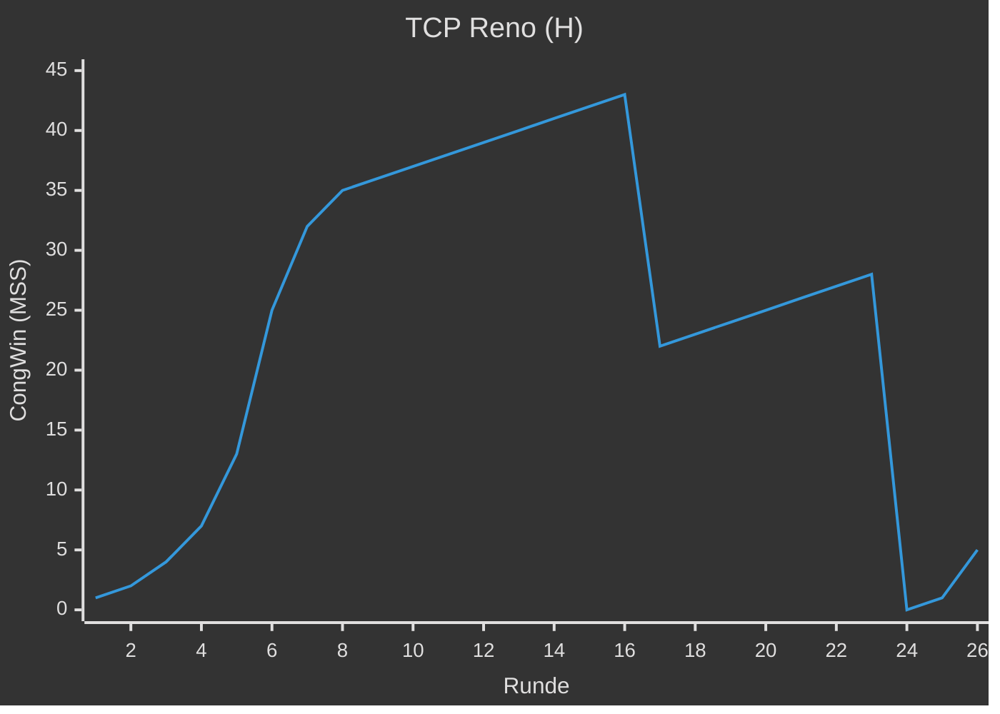
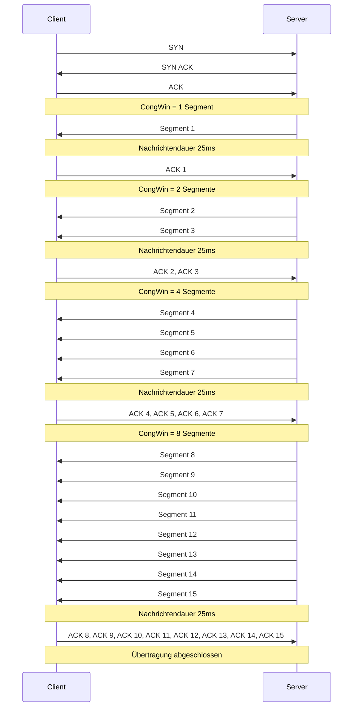

---
tags:
  - 4semester
  - informatik
  - RNVS
fach: "[[Rechnernetze und Verteilte Systeme (RNVS)]]"
Thema:
Benötigte Zeit:
date created: Sunday, 9. June 2024, 22:36
date modified: Sunday, 9. June 2024, 23:57
---

# 1. TCP Reno (H)

> [!note] Aufgabenstellung
> In Abbildung 1 ist das Verhalten von TCP-Reno nach RFC 2581 zu sehen. TCP-Reno verhält
> sich ähnlich wie TCP-Tahoe, jedoch mit Unterstützung für Fast Recovery:
>
> Empfängt der Sender 3 ACK-Duplikate, geht er – anstelle von Slow Start – in den Fast Recovery Zustand über. Dabei wird zwar auch $Threshold = \frac{CongWin}{2}$ gesetzt, allerdings wird anschließend `CongWin = Threshold + 3 MSS` gesetzt. In der Fast Recovery Phase wird `CongWin` für jedes empfangene ACK-Duplikat um 1 MSS erhöht. Erreichen den Sender wieder neue Quittungen (also keine ACK-Duplikate), geht Reno in die lineare Phase (Congestion Avoidance) über.
>
> In dieser Aufgabe nehmen wir an, dass während Fast Recovery keine weiteren Duplikate auftreten. Das heißt, dass das erneut übertragene Segment – die Ursache für die ACK-Duplikate – erfolgreich quittiert wird.

## 1. Identifizieren Sie die Intervalle, in denen TCP Slow Start aktiv ist.

- Einmal von Runde `1-6`
- Einmal von Runde `23-26`

## 2. Identifizieren Sie die Intervalle, in denen TCP Congestion Avoidance aktiv ist.

- Einmal von `7-16`
- Einmal von `17-22`

## 3. Wurde der Paketverlust nach der 16. Runde durch duplizierte ACKs oder durch die Überschreitung des Timeouts erkannt? Warum?

- duplizierte ACKs weil er danach in den Fast Recovery Modus übergeht und nicht in den Slow Start

## 4. Wurde der Paketverlust nach der 22. Runde durch duplizierte ACKs oder durch die Überschreitung des Timeouts ausgelöst? Warum?

- Überschreitung des Timeouts, da er danach in den Slow Start übergeht und nicht in den Fast Recovery Modus

## 5. Welchen Wert hat `Threshold` zu Beginn (in der 1. Runde)?

- 32

## 6. Welchen Wert hat `Threshold` in der 18. Runde?

> [!tip] Tipp
> Man benutzt das CongWin bevor der Dop kommt. Bei Runde 18 schauen wir also das CongWin von Runde 16 an um zu verstehen was das Threshold in Runde 18 ist

$$
\begin{aligned}
\text{Threshold} &= \frac{CongWin}{2}\\
&= \frac{42}{2}\\
&= 21
\end{aligned}
$$

## 7. Welchen Wert hat `Threshold` in der 24. Runde?

$$
\begin{aligned}
\text{Threshold} &= \frac{CongWin}{2}\\
&= \frac{29}{2}\\
&\approx 14
\end{aligned}
$$

## 8. In welcher Runde wird das 70. Segment gesendet?

$$
\begin{aligned}
&\text{Runde 1} &&= 1 \\
&\text{Runde 2} &&= 1 + 2 = 3 \\
&\text{Runde 3} &&= 1 + 2 + 4 = 7 \\
&\text{Runde 4} &&= 1 + 2 + 4 + 8 = 15 \\
&\text{Runde 5} &&= 1 + 2 + 4 + 8 + 16 = 31 \\
&\text{Runde 6} &&= 1 + 2 + 4 + 8 + 16 + 32 = 63 \\
&\text{Runde 7} &&= 1 + 2 + 4 + 8 + 16 + 32 + 33 = 96 \\
\end{aligned}
$$

$\Longrightarrow$ In Runde 7 wird Paket 70 abgeschickt

## 9. Angenommen in der 26. Runde wird ein Paketverlust durch ein (dreifaches) ACK-Duplikat festgestellt. Wie werden die Werte von `CongWin` und `Threshold` anschließend sein?

$$
\begin{aligned}
\text{Threshold} &= \frac{\text{CongWin}}{2}\\
&=\frac{8}{2}\\
&=4\\
\end{aligned}
$$

$$
\begin{aligned}
\text{CongWin} &= \text{Threshold + 3 MSS}\\
&=7
\end{aligned}
$$

## 10. Angenommen es würde TCP Tahoe statt Reno genutzt und in der 16. Runde wird durch ein (dreifaches) ACK-Duplikat ein Paketverlust festgestellt. Welche Werte haben `Threshold` und `CongWin` in der 17. Runde?

$$
\begin{aligned}
\text{Threshold} &= \frac{\text{CongWin aus Runde 15}}{2} \\
&= \frac{42}{2}\\
&=21
\end{aligned}
$$

$$
\begin{aligned}
\text{Runde 17: CongWin} &= 1\\
\text{Runde 18: CongWin} &= 2\\
\text{Runde 19: CongWin} &= 4\\
\end{aligned}
$$

---

# 2. Staukontrolle bei TCP (H)

> [!note] **Aufgabenstellung**
> Bei TCP kommt Slow-Start als Mechanismus zur Staukontrolle zum Einsatz. Es sollen über eine
> TCP-Verbindung mit Netzverzögerung von 100 ms (d.h. $RTD = 200$ ms) 7500 B Nutzdaten in
> 15 Segmenten gleicher Größe $S = 500$ B vom Server zum Client übertragen werden.
>
> **Hinweis:** Nehmen Sie einen nicht erreichbaren Wert für Threshold an, und vernachlässigen
> Sie Verluste, Empfangspuffergröße, Verarbeitungsverzögerung, die Übertragungszeit für
> Protokollheader sowie den Verbindungsabbau. Gehen Sie also davon aus, dass die beiden TCP
> Instanzen sofort nach dem Verbindungsaufbau die Übertragung beginnen und danach die
> Slow-Start-Phase nicht verlassen.

## (a) Sei die Übertragungsrate R = 20 kB/s. Erstellen Sie ein Sequenzdiagramm für die Übertragung und tragen Sie die Größe des jeweils aktuellen Überlastfensters (CongWin) in das Diagramm ein!

## (b) Bestimmen Sie die Übertragungsdauer gemessen vom Abenden des SYN des Clients bis alle Nutzdaten empfangen wurden:

1.  mit Slow-Start.
2.  ohne Slow-Start mit fester Fenstergröße von 20.

## (c)

Wie lange würde die Übertragung jeweils mit und ohne Slow-Start für R = 500 kB/s dauern?

<!-- DISQUS SCRIPT COMMENT START -->

<noscript>Please enable JavaScript to view the <a href="https://disqus.com/?ref_noscript">comments powered by Disqus.</a></noscript>

<!-- DISQUS SCRIPT COMMENT END -->
