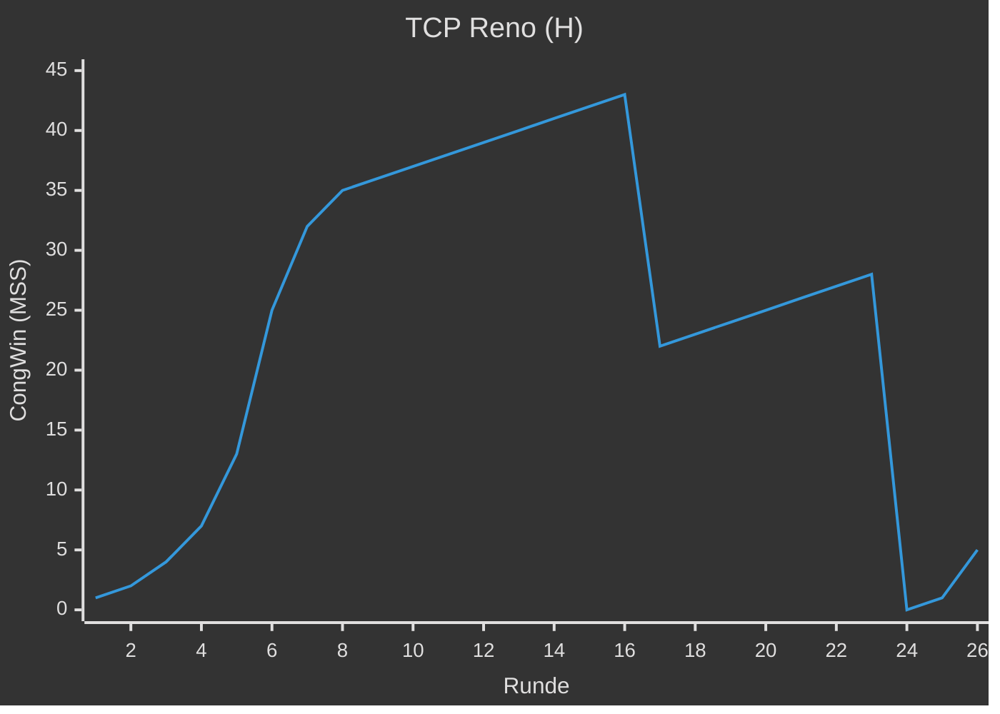

---
tags:
  - 4semester
  - informatik
  - RNVS
fach: "[[Rechnernetze und Verteilte Systeme (RNVS)]]"
Thema:
Benötigte Zeit:
date created: Sunday, 9. June 2024, 22:36
date modified: Sunday, 9. June 2024, 22:42
---

# 1. TCP Reno (H)

> [!note] Aufgabenstellung
> In Abbildung 1 ist das Verhalten von TCP-Reno nach RFC 2581 zu sehen. TCP-Reno verhält
> sich ähnlich wie TCP-Tahoe, jedoch mit Unterstützung für Fast Recovery:
>
> Empfängt der Sender 3 ACK-Duplikate, geht er – anstelle von Slow Start – in den Fast Recovery Zustand über. Dabei wird zwar auch $Threshold = \frac{CongWin}{2}$ gesetzt, allerdings wird anschließend `CongWin = Threshold + 3 MSS` gesetzt. In der Fast Recovery Phase wird `CongWin` für jedes empfangene ACK-Duplikat um 1 MSS erhöht. Erreichen den Sender wieder neue Quittungen (also keine ACK-Duplikate), geht Reno in die lineare Phase (Congestion Avoidance) über.
>
> In dieser Aufgabe nehmen wir an, dass während Fast Recovery keine weiteren Duplikate auftreten. Das heißt, dass das erneut übertragene Segment – die Ursache für die ACK-Duplikate – erfolgreich quittiert wird.

## 1. Identifizieren Sie die Intervalle, in denen TCP Slow Start aktiv ist.

## 2. Identifizieren Sie die Intervalle, in denen TCP Congestion Avoidance aktiv ist.

## 3. Wurde der Paketverlust nach der 16. Runde durch duplizierte ACKs oder durch die Überschreitung des Timeouts erkannt? Warum?

## 4. Wurde der Paketverlust nach der 22. Runde durch duplizierte ACKs oder durch die Überschreitung des Timeouts ausgelöst? Warum?

## 5. Welchen Wert hat `Threshold` zu Beginn (in der 1. Runde)?

## 6. Welchen Wert hat `Threshold` in der 18. Runde?

## 7. Welchen Wert hat `Threshold` in der 24. Runde?

## 8. In welcher Runde wird das 70. Segment gesendet?

## 9. Angenommen in der 26. Runde wird ein Paketverlust durch ein (dreifaches) ACK-Duplikat festgestellt. Wie werden die Werte von `CongWin` und `Threshold` anschließend sein?

## 10. Angenommen es würde TCP Tahoe statt Reno genutzt und in der 16. Runde wird durch ein (dreifaches) ACK-Duplikat ein Paketverlust festgestellt. Welche Werte haben `Threshold` und `CongWin` in der 17. Runde?

<!-- DISQUS SCRIPT COMMENT START -->

<noscript>Please enable JavaScript to view the <a href="https://disqus.com/?ref_noscript">comments powered by Disqus.</a></noscript>

<!-- DISQUS SCRIPT COMMENT END -->
