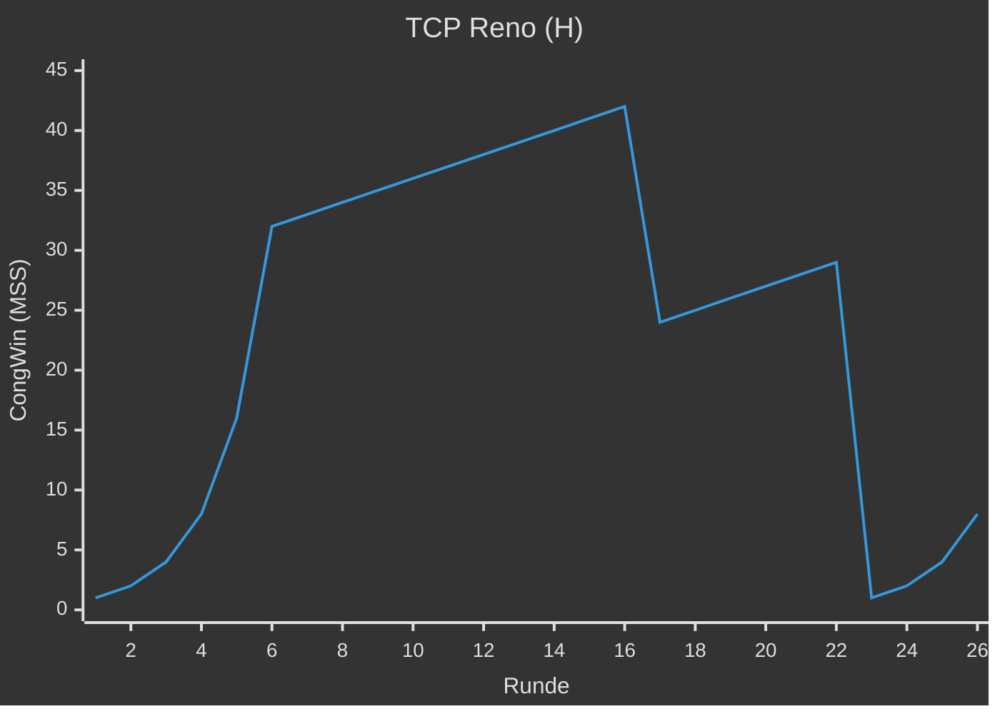
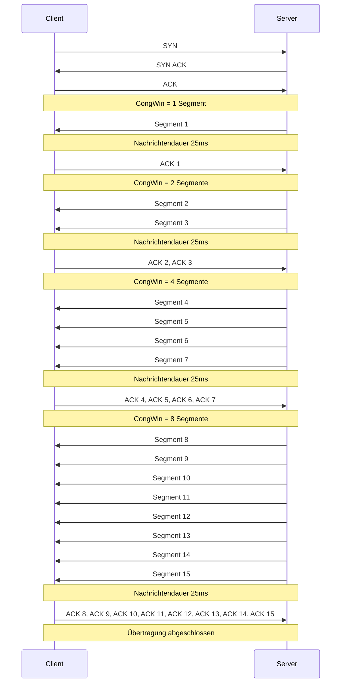

---
tags:
  - 4semester
  - informatik
  - RNVS
fach: "[[Rechnernetze und Verteilte Systeme (RNVS)]]"
Thema:
Benötigte Zeit:
date created: Sunday, 9. June 2024, 22:36
date modified: Wednesday, 12. June 2024, 20:15
---

# 1. TCP Reno (H)

> [!note] Aufgabenstellung
> In Abbildung 1 ist das Verhalten von TCP-Reno nach RFC 2581 zu sehen. TCP-Reno verhält
> sich ähnlich wie TCP-Tahoe, jedoch mit Unterstützung für Fast Recovery:
>
> Empfängt der Sender 3 ACK-Duplikate, geht er – anstelle von Slow Start – in den Fast Recovery Zustand über. Dabei wird zwar auch $Threshold = \frac{CongWin}{2}$ gesetzt, allerdings wird anschließend `CongWin = Threshold + 3 MSS` gesetzt. In der Fast Recovery Phase wird `CongWin` für jedes empfangene ACK-Duplikat um 1 MSS erhöht. Erreichen den Sender wieder neue Quittungen (also keine ACK-Duplikate), geht Reno in die lineare Phase (Congestion Avoidance) über.
>
> In dieser Aufgabe nehmen wir an, dass während Fast Recovery keine weiteren Duplikate auftreten. Das heißt, dass das erneut übertragene Segment – die Ursache für die ACK-Duplikate – erfolgreich quittiert wird.

## Skizze des Graphen

## 1. Identifizieren Sie die Intervalle, in denen TCP Slow Start aktiv ist.

- Einmal von Runde `1-6`
- Einmal von Runde `23-26`

## 2. Identifizieren Sie die Intervalle, in denen TCP Congestion Avoidance aktiv ist.

- Einmal von `7-16`
- Einmal von `17-22`

## 3. Wurde der Paketverlust nach der 16. Runde durch duplizierte ACKs oder durch die Überschreitung des Timeouts erkannt? Warum?

- duplizierte ACKs weil er danach in den Fast Recovery Modus übergeht und nicht in den Slow Start

## 4. Wurde der Paketverlust nach der 22. Runde durch duplizierte ACKs oder durch die Überschreitung des Timeouts ausgelöst? Warum?

- Überschreitung des Timeouts, da er danach in den Slow Start übergeht und nicht in den Fast Recovery Modus

## 5. Welchen Wert hat `Threshold` zu Beginn (in der 1. Runde)?

- 32

## 6. Welchen Wert hat `Threshold` in der 18. Runde?

> [!tip] Tipp
> Man benutzt das CongWin bevor der Dop kommt. Bei Runde 18 schauen wir also das CongWin von Runde 16 an um zu verstehen was das Threshold in Runde 18 ist

$$
\begin{aligned}
\text{Threshold} &= \frac{CongWin}{2}\\
&= \frac{42}{2}\\
&= 21
\end{aligned}
$$

## 7. Welchen Wert hat `Threshold` in der 24. Runde?

$$
\begin{aligned}
\text{Threshold} &= \frac{CongWin}{2}\\
&= \frac{29}{2}\\
&\approx 14
\end{aligned}
$$

## 8. In welcher Runde wird das 70. Segment gesendet?

$$
\begin{aligned}
&\text{Runde 1} &&= 1 \\
&\text{Runde 2} &&= 1 + 2 = 3 \\
&\text{Runde 3} &&= 1 + 2 + 4 = 7 \\
&\text{Runde 4} &&= 1 + 2 + 4 + 8 = 15 \\
&\text{Runde 5} &&= 1 + 2 + 4 + 8 + 16 = 31 \\
&\text{Runde 6} &&= 1 + 2 + 4 + 8 + 16 + 32 = 63 \\
&\text{Runde 7} &&= 1 + 2 + 4 + 8 + 16 + 32 + 33 = 96 \\
\end{aligned}
$$

$\Longrightarrow$ In Runde 7 wird Paket 70 abgeschickt

## 9. Angenommen in der 26. Runde wird ein Paketverlust durch ein (dreifaches) ACK-Duplikat festgestellt. Wie werden die Werte von `CongWin` und `Threshold` anschließend sein?

$$
\begin{aligned}
\text{Threshold} &= \frac{\text{CongWin}}{2}\\
&=\frac{8}{2}\\
&=4\\
\end{aligned}
$$

$$
\begin{aligned}
\text{CongWin} &= \text{Threshold + 3 MSS}\\
&=7
\end{aligned}
$$

## 10. Angenommen es würde TCP Tahoe statt Reno genutzt und in der 16. Runde wird durch ein (dreifaches) ACK-Duplikat ein Paketverlust festgestellt. Welche Werte haben `Threshold` und `CongWin` in der 17. Runde?

$$
\begin{aligned}
\text{Threshold} &= \frac{\text{CongWin aus Runde 15}}{2} \\
&= \frac{42}{2}\\
&=21
\end{aligned}
$$

$$
\begin{aligned}
\text{Runde 17: CongWin} &= 1\\
\text{Runde 18: CongWin} &= 2\\
\text{Runde 19: CongWin} &= 4\\
\end{aligned}
$$

---

# 2. Staukontrolle bei TCP (H)

> [!note] **Aufgabenstellung**
> Bei TCP kommt Slow-Start als Mechanismus zur Staukontrolle zum Einsatz. Es sollen über eine
> TCP-Verbindung mit Netzverzögerung von 100 ms (d.h. $RTD = 200$ ms) 7500 B Nutzdaten in
> 15 Segmenten gleicher Größe $S = 500$ B vom Server zum Client übertragen werden.
>
> **Hinweis:** Nehmen Sie einen nicht erreichbaren Wert für Threshold an, und vernachlässigen
> Sie Verluste, Empfangspuffergröße, Verarbeitungsverzögerung, die Übertragungszeit für
> Protokollheader sowie den Verbindungsabbau. Gehen Sie also davon aus, dass die beiden TCP
> Instanzen sofort nach dem Verbindungsaufbau die Übertragung beginnen und danach die
> Slow-Start-Phase nicht verlassen.

## (a) Sei die Übertragungsrate R = 20 kB/s. Erstellen Sie ein Sequenzdiagramm für die Übertragung und tragen Sie die Größe des jeweils aktuellen Überlastfensters (CongWin) in das Diagramm ein!

- [ ] Verstehen

## (b) Bestimmen Sie die Übertragungsdauer gemessen vom Abenden des SYN des Clients bis alle Nutzdaten empfangen wurden:

### Mit Slow-Start

**Nachrichtendauer (Segmentgröße durch Übertragungsrate):**

$$
500 \text{ Byte} / 20 \text{ kByte/s} = 0.5 \text{ kByte} / 20 \text{ kByte/s} = 0.025 \text{ s} = 25 \text{ ms}
$$

**Verbindungsaufbau:**

$$
3 \times 100 \text{ ms} = 300 \text{ ms}
$$ (3-Wege-Handschlag)

**Quittungen aus dem 4. Fenster bleiben unberücksichtigt:**
$$

3.5 \text{ RTTs} = 200 \text{ ms} \times 3.5 = 700 \text{ ms}

$$
(bis alle Nutzdaten beim Empfänger ankamen und nicht dessen Quittungen zurück)

**Insgesamt:**
$$

1 + 1 + 1 + 8 = 11 \text{ Nachrichtendauern}

$$
(also bis das Segment im Netz ist, dauert es 25 ms)
bei den ersten 3 Fenstern wird nach dem ersten Segment geantwortet
beim 4. Fenster werden 8 Segmente abgewartet (bis alle weg sind)

$$

300 \text{ ms} + 700 \text{ ms} + 11 \times 25 \text{ ms} = 1275 \text{ ms}

$$

### Ohne Slow-Start mit fester Fenstergröße von 20

**Verbindungsaufbau:**
$$

3 \times 100 \text{ ms} = 300 \text{ ms}

$$

**Netzverzögerung des ersten Segments:**
$$

100 \text{ ms}

$$
(Übertragung zwischen beiden Endgeräten)

**Nachrichtendauer der 15 Segmente (bis der Sender die ganze Nachricht abgeschickt hat):**
$$

15 \times 25 \text{ ms}

$$
$$

15 < 20

$$
, d.h., Quittungen werden nicht abgewartet, weil die Fenstergröße nicht voll ist

$$

300 \text{ ms} + 100 \text{ ms} + 15 \times 25 \text{ ms} = 775 \text{ ms}

$$

## (c) Wie lange würde die Übertragung jeweils mit und ohne Slow-Start für R = 500 kB/s dauern?

Der Sender kann schneller senden, d.h. bis die Nachricht komplett losgeschickt wurde. Nur die Nachrichtendauer wird von der neuen Übertragungsrate beeinflusst:

$$

500 \text{ Byte} / 500 \text{ kByte/s} = 0.5 \text{ kByte} / 500 \text{ kByte/s} = 0.0001 \text{ s} = 1 \text{ ms}

$$

### Mit Slow-Start

Ergebnisse aus (b) mit angepasster Nachrichtendauer:

**Verbindungsaufbau:**
$$

3 \times 100 \text{ ms} = 300 \text{ ms}

$$

**Quittungen aus dem 4. Fenster bleiben unberücksichtigt:**
$$

3.5 \text{ RTTs} = 200 \text{ ms} \times 3.5 = 700 \text{ ms}

$$

**Insgesamt:**
$$

1 + 1 + 1 + 8 = 11 \text{ Nachrichtendauern}

$$

$$

300 \text{ ms} + 700 \text{ ms} + 11 \times 1 \text{ ms} = 1011 \text{ ms}

$$

### Ohne Slow-Start mit fester Fenstergröße von 20

Ergebnisse aus (b) mit angepasster Nachrichtendauer:

**Verbindungsaufbau:**
$$

3 \times 100 \text{ ms} = 300 \text{ ms}

$$

**Netzverzögerung des ersten Segments:**
$$

100 \text{ ms}

$$

**Nachrichtendauer der 15 Segmente:**
$$

15 \times 1 \text{ ms}

$$
$$

300 \text{ ms} + 100 \text{ ms} + 15 \times 1 \text{ ms} = 415 \text{ ms}

$$

---

# 3. Selektive Quittungen (H)

>[!note] Aufgabenstellung
>Der Verlust einzelner Segmente kann zur unnötigen Wiederholung großer Datenmengen führen, insbesondere bei Pfaden mit hoher Netzverzögerung. Durch die Einführung selektiver Quittungen (SACK, siehe RFC 2018) kann dieses Problem gemildert werden.
>
>Statt wie bei den „normalen” kumulativen TCP-Quittungen den bis dahin korrekt empfangenen zusammenhängenden Byte-Strom zu quittieren, kann ein Empfänger mit selektiven Quittungen zusätzliche Segmente (oder zusammenhängende Folgen von Segmenten, sogenannte Blöcke) im Options-Feld des TCP-Headers als empfangen notieren. Hierzu wird ein Bereich des Byte-Stroms mit Anfangs- und End-Byte notiert. Auf Grundlage der obigen Abbildung würde etwa eine Quittung mit AckNr=501 und SACK-Block=(1001,2001) gesendet; das verlorene Segment mit Bytes 501–1000 (schraffiert) wird so ausgespart. Es können mehrere solche Blöcke in den Optionen angegeben werden.
>
>Gehen Sie von einem Sender mit aktueller SeqNr=5000 aus. Der Sender sendet 8 Segmente von jeweils 500 Byte Länge. Wie werden kumulative und selektive Quittungen benutzt, wenn:

## (a) die ersten vier Segmente empfangen werden, die letzten vier aber verloren gehen?

In diesem Fall gehen die Segmente mit SeqNr 7000, 7500, 8000 und 8500 verloren. Die kumulative Quittung zeigt die höchste vollständig empfangene SeqNr an. SACK wird verwendet, um den Empfang der übrigen Blöcke anzuzeigen.

| Empfangenes Segment | Kumulative Quittung | SACK-Block(s)            |
|---------------------|---------------------|--------------------------|
| 5000-5499           | 5500                | -                        |
| 5500-5999           | 6000                | -                        |
| 6000-6499           | 6500                | -                        |
| 6500-6999           | 7000                | -                        |

## (b) das zweite, vierte und sechste und achte Segment verloren gehen?

In diesem Fall gehen die Segmente mit SeqNr 5500, 6500, 7500 und 8500 verloren. Die kumulative Quittung zeigt die höchste vollständig empfangene SeqNr an. SACK wird verwendet, um den Empfang der übrigen Blöcke anzuzeigen.

| Empfangenes Segment | Kumulative Quittung | SACK-Block(s)            |
|---------------------|---------------------|--------------------------|
| 5000-5499           | 5500                | -                        |
| (5500 verloren)     | 5500                | -                        |
| 6000-6499           | 5500                | (6000, 6500)             |
| (6500 verloren)     | 5500                | (6000, 6500)             |
| 7000-7499           | 5500                | (6000, 6500), (7000, 7500)|
| (7500 verloren)     | 5500                | (6000, 6500), (7000, 7500)|
| 8000-8499           | 5500                | (6000, 6500), (7000, 7500), (8000, 8500)|
| (8500 verloren)     | 5500                | (6000, 6500), (7000, 7500), (8000, 8500)|

---

# 4. Approximerung von TCP Durchsatz und Verlustrate

Aus den Vorlesungsfolien geht hervor, dass der TCP Throughput während einer bestehenden Verbindung immer im Intervall zwischen $\frac{W}{2 \cdot RTD}$ bis $\frac{W}{RTD}$ pendelt. Während jeder Congestion-Avoidance-Phase geht 1 Paket verloren.

## (a) Zeigen Sie, dass die Verlustrate $L$ (Anteil verloren gegangener Segmente) dem folgenden Term entspricht:
$$

L = \frac{1}{\frac{3}{8}W^2 + \frac{3}{4}W}

$$

Die Verlustrate entspricht der Ratio verlorener Pakete zur Anzahl gesendeter Pakete in einem Timeout-Intervall. In jedem Intervall geht durchschnittlich ein Paket verloren. Die Anzahl insgesamt versendeter Pakete ist:

$$

\frac{W}{2} + \left(\frac{W}{2} + 1\right) + \left(\frac{W}{2} + 2\right) + \ldots + W = \sum\_{n=0}^{W/2} \left(\frac{W}{2} + n\right)

$$

$$

\begin{aligned}
= & \left(\frac{W}{2} + 1\right) + \frac{W}{2} + \sum\_{n=0}^{W/2} n \\
= & \left(\frac{W}{2} + 1\right) \frac{W}{2} + \frac{W}{2} \left(\frac{W}{2} + 1\right) \frac{1}{2} \\
= & \frac{W^2}{4} + \frac{W}{2} + \frac{W^2}{8} + \frac{W}{4} \\
= & \frac{3}{8}W^2 + \frac{3}{4}W
\end{aligned}

$$

Die daraus resultierende Verlustrate ist daher:

$$

L = \frac{1}{\frac{3}{8}W^2 + \frac{3}{4}W}

$$

## (b) Zeigen Sie, dass mit gegebener Verlustrate $L$ während einer TCP-Verbindung die durchschnittliche Übertragungsrate^1 mit dem folgenden Term approximiert werden kann:
$$

R \approx \frac{1.22 \cdot MSS}{RTD \cdot \sqrt{L}}

$$

(b) Zeige, dass mit gegebener Verlustrate die durchschnittliche Übertragungsrate

$$

\frac{1.22 \cdot MSS}{RTD \cdot \sqrt{L}}

$$

approximiert werden kann.

$$

L = \frac{1}{\frac{3}{8} W^2 + \frac{3}{4} W}

$$

Es gilt:

$$

\frac{3}{8} W^2 \gg \frac{3}{4} W

$$

$$

\begin{aligned}
L &\approx \frac{8}{3W^2} \\
W &\approx \sqrt{\frac{8}{3L}}
\end{aligned}

$$

$$

\begin{aligned}
R &= \frac{3}{4} \sqrt{\frac{8}{3L}} \cdot \frac{1}{RTD} \\
&= \frac{1.22 \cdot MSS}{RTD \cdot \sqrt{L}}
\end{aligned}

$$

<!-- DISQUS SCRIPT COMMENT START -->

<noscript>Please enable JavaScript to view the <a href="https://disqus.com/?ref_noscript">comments powered by Disqus.</a></noscript>

<!-- DISQUS SCRIPT COMMENT END -->

<!-- Modal START -->

  

    &times;
    

      MyUniNotes is a personal, non-revenue project as I believe in accessible education for everyone. I manage this project alongside my studies, with all materials handwritten by me trying to help others understand challenging concepts.
    

    

      If MyUniNotes has been helpful and you’d like to support my efforts,  you can contribute with a donation: <a class="modal-dono-link" href="https://paypal.me/myuninotes4u">Donate via PayPal</a> :)  Your support will help me continue improving the content, but there is no obligation to donate.
    

  

<!-- Modal END -->

$$
