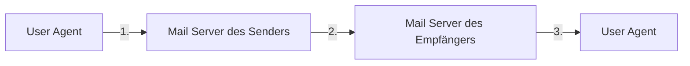

---
tags:
  - 4semester
  - informatik
  - RNVS
fach: "[[Rechnernetze und Verteilte Systeme (RNVS)]]"
Thema:
Benötigte Zeit:
date created: Sunday, 14. July 2024, 17:32
date modified: Monday, 15. July 2024, 00:04
---

# Interpretation einer DNS-Antwort (H)

> [!note] Aufgabenstellung
> Ein nützliches Diagnosewerkzeug für den DNS ist das Programm `dig` (1), das auf vielen Unix-Derivaten (z.B. GNU/Linux Installationen) vorhanden ist. Nachfolgend sehen Sie die aus einer Anfrage resultierenden Resource Records. Beziehen Sie sich beim Bearbeiten der Aufgabe auf die relevanten Zeilnummern!

```bash
bash$ dig +trace +nodnssec mail.nm.ifi.lmu.de

; <<>> DiG 9.2.3 <<>> +trace mail.nm.ifi.lmu.de
;; global options: printcmd
.			80298	IN	NS	d.root-servers.net.
.			80298	IN	NS	e.root-servers.net.
.			80298	IN	NS	f.root-servers.net.
.			80298	IN	NS	g.root-servers.net.
.			80298	IN	NS	h.root-servers.net.
.			80298	IN	NS	i.root-servers.net.
.			80298	IN	NS	j.root-servers.net.
.			80298	IN	NS	k.root-servers.net.
.			80298	IN	NS	l.root-servers.net.
.			80298	IN	NS	m.root-servers.net.
;; Received 500 bytes from 192.168.218.30#53(192.168.218.30) in 0 ms

de.			172800	IN	NS	C.DE.NET.
de.			172800	IN	NS	L.DE.NET.
de.			172800	IN	NS	F.NIC.de.
de.			172800	IN	NS	S.DE.NET.
de.			172800	IN	NS	A.NIC.de.
de.			172800	IN	NS	Z.NIC.de.
;; Received 294 bytes from 128.8.10.90#53(d.root-servers.net) in 104 ms

lmu.de.			86400	IN	NS	dns3.lrz-muenchen.de.
lmu.de.			86400	IN	NS	dns1.lrz-muenchen.de.
lmu.de.			86400	IN	NS	dns2.lrz-muenchen.de.
;; Received 210 bytes from 208.48.81.43#53(C.DE.NET) in 200 ms

mail.nm.ifi.lmu.de.	86400	IN	CNAME	pcheggo.nm.ifi.lmu.de.
pcheggo.nm.ifi.lmu.de.	86400	IN	A	141.84.218.30
nm.ifi.lmu.de.		86400	IN	NS	acheron.ifi.lmu.de.
nm.ifi.lmu.de.		86400	IN	NS	dns3.lrz-muenchen.de.
nm.ifi.lmu.de.		86400	IN	NS	acheron.ifi.lmu.de.
nm.ifi.lmu.de.		86400	IN	NS	dns1.nm.ifi.lmu.de.
nm.ifi.lmu.de.		86400	IN	NS	dns2.lrz-muenchen.de.
nm.ifi.lmu.de.		86400	IN	NS	dns0.nm.ifi.lmu.de.
;; Received 357 bytes from 129.187.5.245#53(dns3.lrz-muenchen.de) in 1 ms
```

## (a) Zeichnen Sie eine Skizze, die den DNS-Verkehr zur Anfrage darstellt, mit mindestens:

> [!note] Aufgabenstellung
>
> - dem anfragenden Host
> - dem für diesen Host zuständigen DNS-Server (lokaler DNS-Server)
> - dem DNS-Server, der die richtige IP-Adresse für `mail.nm.ifi.lmu.de` liefert
> - eventuellen weiteren DNS-Servern, die Teile der Antwort liefern.
> - den Nachrichten, die ausgetauscht wurden.
>
> Geben Sie bei jedem Host in Ihrer Skizze, falls vorhanden, IP-Adresse und Hostname an.

```text
[Anfragender Host (192.168.218.30)]
        |
        v
[Root-Server (z.B. d.root-servers.net)]
        |
        v
[TLD-Server (z.B. C.DE.NET)]
        |
        v
[Namenserver für lmu.de (z.B. dns3.lrz-muenchen.de)]
        |
        v
[Autoritativer Server für nm.ifi.lmu.de (z.B. acheron.ifi.lmu.de)]
        |
        v
[Endgültige IP-Adresse: 141.84.218.30]

```

## b) Ist die Anfrage rekursiv oder iterativ?

`dig` funktioniert normalerweise rekursiv, aber der `+trace` Flag macht `dig` iterativ

> [!tip] Erklärung
> Die Anfrage ist **iterativ**.
>
> #### Erklärung:
>
> - **Iterative Anfrage**: Der anfragende DNS-Resolver fragt nacheinander mehrere DNS-Server. Jeder Server gibt einen Verweis auf den nächsten Server, den der Resolver selbst kontaktieren muss.
> - **Rekursive Anfrage**: Der Resolver fragt nur einen DNS-Server, der dann die gesamte Arbeit der Auflösung übernimmt und die endgültige Antwort zurückgibt.
> - In der `dig`-Ausgabe sehen wir, dass der Resolver schrittweise verschiedene Server kontaktiert und Verweise erhält, was typisch für eine iterative Anfrage ist.

## (c) Die Ausgabe enthält eine Anfrage an einer der DNS-Root-Server. Wonach wird er gefragt?

Der DNS-Root-Server wird nach den zuständigen Nameservern für die Top-Level-Domain `.de` gefragt

> [!tip]- Ausschnitte aus dem `dig`
> In der Ausgabe der `dig`-Anfrage wird einer der DNS-Root-Server nach den zuständigen Nameservern für die Top-Level-Domain (TLD) `.de` gefragt.
>
> #### Details aus der Ausgabe:
>
> ```bash
> .			80298	IN	NS	d.root-servers.net.
> .			80298	IN	NS	e.root-servers.net.
> .			80298	IN	NS	f.root-servers.net.
> …
> ;; Received 500 bytes from 192.168.218.30#53(192.168.218.30) in 0 ms
> ```
>
> Diese Zeilen zeigen die Nameserver, die für die Root-Zone zuständig sind. Der Root-Server gibt die zuständigen Nameserver für `.de` zurück:
>
> ```bash
> de.			172800	IN	NS	C.DE.NET.
> de.			172800	IN	NS	L.DE.NET.
> de.			172800	IN	NS	F.NIC.de.
> …
> ;>; Received 294 bytes from 128.8.10.90#53(d.root-servers.net) in 104 ms
>
> ```
>
> Diese Zeilen zeigen die Antwort des Root-Servers, der die Nameserver für die TLD `.de` zurückgibt. Der Root-Server wurde also nach den Nameservern für die TLD `.de` gefragt.

## d) Der gesuchte Rechnername `mail.nm.ifi.lmu.de` ist ein Alias.

### i. Wie heisst die Maschine wirklich?

Die Maschine heißt in Wirklichkeit `pcheggo.nm.ifi.lmu.de`. `mail.nm.ifi.lmu.de` ist nur ein CNAME. Das sehen wir hier: `mail.nm.ifi.lmu.de.	86400	IN	CNAME	pcheggo.nm.ifi.lmu.de.`

### ii. Welche IP-Adresse hat sie?

Die IP-Adresse lautet: `141.84.218.30`

## (e) Anhand der Ausgabe können weitere Aussagen bezüglich der DNS-Server gemacht werden:

### i. Wer betreibt die DNS-Server, die für Anfragen über die Domäne lmu.de zuständig sind?

Das Leibniz-Rechenzentrum das erkennt man hier:

```bash
lmu.de.			86400	IN	NS	dns3.lrz-muenchen.de.
lmu.de.			86400	IN	NS	dns1.lrz-muenchen.de.
lmu.de.			86400	IN	NS	dns2.lrz-muenchen.de.
;; Received 210 bytes from 208.48.81.43#53(C.DE.NET) in 200 ms
```

### ii. Welche DNS-Server können Anfragen für die Domäne der gesuchten Maschine liefern?

Für die Domäne `nm.ifi.lmu.de` zeigen die folgenden Zeilen der `dig`-Ausgabe die zuständigen DNS-Server:

```bash
nm.ifi.lmu.de.		86400	IN	NS	acheron.ifi.lmu.de.
nm.ifi.lmu.de.		86400	IN	NS	dns3.lrz-muenchen.de.
nm.ifi.lmu.de.		86400	IN	NS	dns1.nm.ifi.lmu.de.
nm.ifi.lmu.de.		86400	IN	NS	dns2.lrz-muenchen.de.
nm.ifi.lmu.de.		86400	IN	NS	dns0.nm.ifi.lmu.de.
;; Received 357 bytes from 129.187.5.245#53(dns3.lrz-muenchen.de) in 1 ms
```

Die DNS-Server, die Anfragen für die Domäne `nm.ifi.lmu.de` beantworten können, sind:

1. `acheron.ifi.lmu.de`
2. `dns3.lrz-muenchen.de`
3. `dns1.nm.ifi.lmu.de`
4. `dns2.lrz-muenchen.de`
5. `dns0.nm.ifi.lmu.de`

Diese Server sind autoritativ für die Domäne `nm.ifi.lmu.de` und können somit die Anfragen für die gesuchte Maschine `mail.nm.ifi.lmu.de` beantworten.

> [!tip]- Tiefgründige Erklärung
>
> ### Erklärung der DNS-Server
>
> #### 📝 Erklärung der DNS-Server für die Domäne `nm.ifi.lmu.de`
>
> **acheron.ifi.lmu.de, dns3.lrz-muenchen.de, dns1.nm.ifi.lmu.de, dns2.lrz-muenchen.de, dns0.nm.ifi.lmu.de**
>
> Diese DNS-Server sind autoritative Nameserver für die Domäne `nm.ifi.lmu.de`. Das bedeutet, dass sie die endgültige Autorität über die DNS-Einträge dieser Domäne haben. Hier ist eine Erklärung, warum sie existieren und wie sie funktionieren:
>
> - **acheron.ifi.lmu.de**:
>   - Ein Nameserver, der speziell für die `ifi.lmu.de` Subdomäne konfiguriert ist.
>   - Verantwortlich für die Verwaltung und Beantwortung von DNS-Anfragen für Hosts unter dieser Subdomäne.
> - **dns3.lrz-muenchen.de**:
>   - Ein Nameserver, der vom Leibniz-Rechenzentrum (LRZ) betrieben wird.
>   - Zuständig für mehrere Domänen, einschließlich `lmu.de` und ihrer Subdomänen.
>   - Bietet Redundanz und Lastverteilung für die DNS-Auflösung.
> - **dns1.nm.ifi.lmu.de**:
>   - Ein primärer Nameserver für die Subdomäne `nm.ifi.lmu.de`.
>   - Speichert die DNS-Einträge und beantwortet Anfragen für diese spezifische Subdomäne.
> - **dns2.lrz-muenchen.de**:
>   - Ein weiterer Nameserver, der vom Leibniz-Rechenzentrum betrieben wird.
>   - Unterstützt die Lastverteilung und Redundanz, um die Verfügbarkeit und Zuverlässigkeit der DNS-Dienste zu erhöhen.
> - **dns0.nm.ifi.lmu.de**:
>   - Ein zusätzlicher Nameserver für die Subdomäne `nm.ifi.lmu.de`.
>   - Hilft bei der Lastverteilung und stellt sicher, dass DNS-Anfragen auch bei Ausfall eines Servers beantwortet werden können.
>
> #### Warum existieren diese Server?
>
> - **Redundanz**: Mehrere Nameserver stellen sicher, dass die DNS-Dienste auch dann verfügbar sind, wenn einer der Server ausfällt.
> - **Lastverteilung**: Durch die Verteilung der Anfragen auf mehrere Server wird die Last gleichmäßig verteilt, was die Performance verbessert.
> - **Zuverlässigkeit und Verfügbarkeit**: Durch die Nutzung mehrerer Server wird die Zuverlässigkeit und Verfügbarkeit der DNS-Dienste für die Domäne erhöht.
>
> #### Wie funktionieren sie?
>
> - **DNS-Zonendateien**: Jeder dieser Servers hat eine Kopie der DNS-Zonendateien für die Domäne `nm.ifi.lmu.de`, die die Informationen über die DNS-Einträge enthalten.
> - **Autoritative Antworten**: Sie geben autoritative Antworten auf DNS-Anfragen für die Domäne `nm.ifi.lmu.de`, was bedeutet, dass ihre Antworten als endgültig und zuverlässig gelten.
> - **Synchronisierung**: Die DNS-Zonendateien werden regelmäßig zwischen den Servers synchronisiert, um Konsistenz zu gewährleisten.
>
> Diese DNS-Server spielen eine entscheidende Rolle bei der Sicherstellung der Erreichbarkeit und Zuverlässigkeit der Domäne `nm.ifi.lmu.de`.

### iii. Wurde die gesuchte IP-Adresse von einem autoritativen Server geliefert?

Ja, die gesuchte IP-Adresse wurde von einem autoritativen Server geliefert.

> [!tip]- Erklärung
>
> #### 📝 Erklärung:
>
> In der Ausgabe des `dig`-Befehls sehen wir, dass die endgültige Antwort für die Anfrage `mail.nm.ifi.lmu.de` von einem autoritativen Server für die Domäne `nm.ifi.lmu.de` geliefert wurde.
>
> Die autoritativen Nameserver für `nm.ifi.lmu.de` sind:
>
> ```bash
> nm.ifi.lmu.de.		86400	IN	NS	acheron.ifi.lmu.de.
> nm.ifi.lmu.de.		86400	IN	NS	dns3.lrz-muenchen.de.
> nm.ifi.lmu.de.		86400	IN	NS	dns1.nm.ifi.lmu.de.
> nm.ifi.lmu.de.		86400	IN	NS	dns2.lrz-muenchen.de.
> nm.ifi.lmu.de.		86400	IN	NS	dns0.nm.ifi.lmu.de.
> ;; Received 357 bytes from 129.187.5.245#53(dns3.lrz-muenchen.de) in 1 ms
> ```
>
> Diese Zeilen zeigen die autoritativen Nameserver für `nm.ifi.lmu.de`, darunter `dns3.lrz-muenchen.de`.
>
> Die tatsächliche IP-Adresse für `mail.nm.ifi.lmu.de` wird in den folgenden Zeilen angezeigt:
>
> ```bash
> mail.nm.ifi.lmu.de.	86400	IN	CNAME	pcheggo.nm.ifi.lmu.de.
> pcheggo.nm.ifi.lmu.de.	86400	IN	A	141.84.218.30
> ```
>
> Dies zeigt, dass `mail.nm.ifi.lmu.de` ein CNAME (Canonical Name) für `pcheggo.nm.ifi.lmu.de` ist und die IP-Adresse `141.84.218.30` für `pcheggo.nm.ifi.lmu.de` zurückgegeben wurde.
>
> Da die Antwort von `dns3.lrz-muenchen.de` kam, einem der autoritativen Nameserver für `nm.ifi.lmu.de`, wurde die IP-Adresse von einem autoritativen Server geliefert.
>
> **Zusammenfassung**:
>
> - Die Anfrage nach `mail.nm.ifi.lmu.de` wurde an `dns3.lrz-muenchen.de` gesendet.
> - `dns3.lrz-muenchen.de`, ein autoritativer Server für `nm.ifi.lmu.de`, lieferte die IP-Adresse `141.84.218.30` zurück.
> - Somit stammt die IP-Adresse von einem autoritativen Server.

## (f) Angenommen Sie haben als Administrator Zugriff auf den DNS-Cache der lokalen DNS-Server im LRZ. Gibt es für Sie damit eine Möglichkeit, die von Nutzern meist besuchten Web-Server im Internet ausfindig zu machen? Fassen Sie sich kurz.

Ja, indem man die Einträge im DNS-Cache analysiert, kann man feststellen, welche Domains und IP-Adressen am häufigsten aufgelöst werden, was auf die meistbesuchten Web-Server hinweist.

---

# HTTP Requests und Response (H)

Die folgende ASCII-Zeichentabelle wurde mit Hilfe des Wireshark-Programms aufgezeichnet, als ein Web-Browser einen HTTP GET-Request sendete. Zu sehen ist also der komplette Request. Die Zeichen `<cr><lf>` stehen dabei für Carriage Return und Line Feed, wie es im Nachrichtenformat in der Vorlesung gekennzeichnet war.

```
GET /gnu/gnu.html HTTP/1.1<cr><lf>Host: www.gnu.org<cr><lf>User-Agent: Mozilla/5.0 (X11; Ubuntu; Linux x86_64; rv:67.0) Gecko/20100101 Firefox/67.0<cr><lf>Accept: text/html,application/xhtml+xml,application/xml;q=0.9,*/*;q=0.8<cr><lf>Accept-Language: de-DE,en-US;q=0.7,en;q=0.3<cr><lf>Accept-Encoding: gzip, deflate, br<cr><lf>Connection: keep-alive<cr><lf><cr><lf>
```

Beantworten Sie die folgenden Fragen zum Mitschnitt des GET-Requests.

## (a) Wie lautet die URL des Dokuments, das vom Browser angefragt wurde?

`www.gnu.org/gnu/gnu.html`

## (b) Welche HTTP-Version nutzt der Browser?

`HTTP/1.1`

## (c) Fragt der Browser eine persistente oder nicht-persistente Verbindung an?

Persistent, da `Connection: keep-alive`

## (d) Welche IP hat der Host, auf dem der Browser ausgeführt wird?

Unbekannt

## (e) Welcher Browser-Typ hat den Request abgeschickt? Wozu dient die Übermittlung des Typs und ist sie notwendig?

Der Server antwortet nun mit der folgenden HTTP-Response auf die oben gezeigte Anfrage.

```
HTTP/1.1 200 OK<cr><lf>Date: Thu, 23 May 2019 08:27:34 GMT<cr><lf>Server: Apache/2.4.7<cr><lf>Content-Location: gnu.html<cr><lf>Accept-Ranges: bytes<cr><lf>Content-Encoding: gzip<cr><lf>Content-Length: 5751<cr><lf>Keep-Alive: timeout=3, max=98<cr><lf>Connection: Keep-Alive<cr><lf>Content-Type: text/html<cr><lf>Content-Language: en<cr><lf><cr><lf><!DOCTYPE html PUBLIC "-//W3C//DTD XHTML 1.0 Strict//EN" "http://www.w3.org/TR/xhtml1/DTD/xhtml1-strict.dtd"><cr><lf><html xmlns="http://www.w3.org/1999/xhtml" xml:lang="en" lang="en"><cr><lf><head><cr><lf><!-- start of server/head-include -1.html -->
<... weitere Zeichen der Antwort wurden entfernt ...>
```

Beantworten Sie die folgenden Fragen.

## (f) Konnte der Server das Angefragte Dokument erfolgreich finden? Zu welcher Zeit wurde die Antwort generiert?

Ja konnte er, da Status `200 OK`, wurde um `Date: Thu, 23 May 2019 08:27:34 GMT` behandelt

## (g) In welcher Sprache ist die Antwort formuliert?

In Englisch.

- `lang="en"`
- `Content-Language: en`

## (h) Wie viele Bytes enthält das zurück gegebende Dokument?

5751 Bytes `Content-Length: 5751`

## (i) Wie lauten die ersten 5 Bytes des zurück gegebenen Dokuments? Hat der Server die Anfrage nach einer persistenten Verbindung bestätigt?

Die ersten 5 Bytes des zurückgegebenen Dokuments sind `<!DOC`. Ja, der Server hat die Anfrage nach einer persistenten Verbindung bestätigt (`Connection: Keep-Alive`)

---

# Was ist es, was kann es? (H)

> [!note] Aufgabenstellung
> Sie finden in einem Büroschrank eine unbeschriftete Komponente mit 5 RJ45-Ports, von der Sie nur wissen, dass diese entweder ein Hub oder ein Switch ist. Sie haben außerdem drei Rechner mit je einer Netzschnittstelle und ausreichend Twisted-Pair-Kabel. Auf den Rechnern können Sie das Programm `ping` und/oder einen Protokoll-Analysator (z.B. `wireshark`) einsetzen, mit dem Sie sich alle eingehenden und ausgehenden Rahmen vollständig anzeigen lassen können.
>
> Bei allen folgenden Untersuchungen soll das Ergebnis nur durch funktionale Tests und logisches Schlussfolgern bestimmt werden. Erstellen Sie eine Skizze Ihres Versuchsaufbaus und geben Sie die Sequenz der Aktionen (z.B. Programmaufrufe) an. Begründen Sie, warum Ihr Test das richtige Ergebnis liefert!

## (a) Wie finden Sie heraus, ob das unbekannte Gerät ein Switch oder ein Hub ist?

> [!tip] Unterschied zwischen Switch und Hub
>
> **Hub**:
>
> - Ein Hub leitet alle empfangenen Pakete an alle Ports weiter, unabhängig vom Ziel.
> - Alle angeschlossenen Geräte empfangen denselben Datenverkehr, was zu mehr Kollisionsdomänen führt.
>
> **Switch**:
>
> - Ein Switch leitet Pakete nur an den spezifischen Zielport weiter, basierend auf der MAC-Adresse.
> - Reduziert unnötigen Datenverkehr und Kollisionsdomänen, wodurch die Netzwerkleistung verbessert wird.

### Versuchsaufbau

1. Die drei Rechner R1, R2 und R3 sind mit dem Gerät verbunden.
2. Wireshark ist auf allen Rechnern gestartet, um den Netzwerkverkehr zu überwachen.
3. Ein Ping wird von R1 zu R2 gesendet.

```java
       +---------------------+
       | Unbekanntes Gerät   |
       | (Hub/Switch)        |
       +---------------------+
         |       |       |
         |       |       |
  +------|-------|-------|------+
  |      |       |       |      |
  |      |       |       |      |
  |  +---+--+ +--+---+ +--+---+ |
  |  |  R1  | |  R2  | |  R3  | |
  |  |      | |      | |      | |
  |  +------+ +------+ +------+ |
  +-----------------------------+

Wireshark auf R1, R2 und R3
```

### Aktionen

1. R3 kann den Ping-Verkehr zwischen R1 und R2 sehen. Das Gerät ist ein Hub, da Hubs alle empfangenen Pakete an alle Ports weiterleiten.
2. R3 kann den Ping-Verkehr zwischen R1 und R2 nicht sehen. Das Gerät ist ein Switch, da Switches Pakete gezielt an den entsprechenden Port weiterleiten.

### Begründung

Ein Hub leitet alle eingehenden Pakete an alle Ports weiter, während ein Switch Pakete nur an den Zielport weiterleitet.

## (b) Nehmen Sie an, es sei ein Switch. Wie bestimmen Sie möglichst genau und effizient die Zeit, nach der der Switch Einträge aus der Forwarding-Tabelle löscht?

> [!tip] Was ist eine Forwarding-Tabelle
>
> ###
>
> Eine **Forwarding-Tabelle**, auch als **MAC-Adresstabelle** bezeichnet, ist eine Datenstruktur in einem Switch, die MAC-Adressen und die zugehörigen Ports speichert. Wenn ein Switch ein Paket empfängt, nutzt er diese Tabelle, um zu bestimmen, an welchen Port das Paket weitergeleitet werden soll. Dadurch kann der Switch Pakete gezielt und effizient an den richtigen Empfänger senden, anstatt sie an alle Ports zu übertragen, wie es ein Hub tun würde. Dies reduziert den Datenverkehr im Netzwerk und verbessert die Gesamtleistung.

### Versuchsaufbau

1. Die drei Rechner sind mit dem Switch verbunden (R1, R2, R3).
2. Wireshark ist auf allen Rechnern gestartet.
3. Pings werden zwischen R1 und R2 gesendet, und die Zeitpunkte werden notiert.
4. Der Verkehr wird für eine bestimmte Zeit gestoppt, dann werden erneut Pings zwischen R1 und R2 gesendet.

### Aktionen

1. Die Zeitpunkte der letzten und der ersten Pings nach der Pause werden notiert.
2. Der Test wird mit verschiedenen Pausenlängen wiederholt (z.B. 1 Minute, 5 Minuten, 10 Minuten).

### Begründung

Die Zeitspanne, nach der der Switch die Einträge aus der Forwarding-Tabelle löscht, ist die längste Pause, nach der die Pings zwischen R1 und R2 zunächst keine Antwort erhalten und danach wieder erfolgreich sind. Dies zeigt, dass der Switch die MAC-Adressen neu lernen musste.

---

# [[Zyklische Redundanzprüfung (CRC)|CRC]] (H)

## (a) Gegeben sei das [[Generatorpolynom]] $G = x^3 + 1$.

### i. Durch wie viele Bits wird $G$ bei CRC repräsentiert?

Das Generatorpolynom $G = x^3 + 1$ wird durch 4 Bits repräsentiert (die Koeffizienten von $x^3, x^2, x^1$, und $x^0$), also `1001`.

### ii. Es soll die Nachricht 11 00 11 CRC-geschützt übertragen werden. Berechnen Sie die zu übertragende Bitfolge (inkl. CRC-Prüfsumme) unter Verwendung des Generatorpolynoms $G$.

### Berechnung der CRC-Prüfsumme für die Nachricht \(110011\)

1. **Nachricht vorbereiten**:

   - Nachricht: `110011`
   - Anhängen von 3 Nullen (Grad von $G(x) = 1001$ minus 1): `110011000`

2. **Polynomdivision von `110011000` durch `1001`**:

```
110011000
1001
-----
01010
1001
-----
01110
1001
-----
0011
```

- Der Rest der Division ist `011`.

3. **CRC-Prüfsumme anhängen**:
   - CRC-Prüfsumme: `011`
   - Zu übertragende Bitfolge: `110011011`

### Zusammenfassung

Die zu übertragende Bitfolge (inkl. CRC-Prüfsumme) lautet:

$$
\boxed{110011011}
$$

### iii. Nehmen Sie an, dass Sie die CRC-geschützte Bitfolge 10 01 10 01 empfangen haben. Zeigen Sie, dass die empfangene Bitfolge unter Verwendung des Generatorpolynoms $G$ korrekt ist (inkl. Rechnung). Markieren Sie in Ihrer Rechnung die Stelle, an der der Empfänger die Korrektheit ablesen kann.

### iii. Überprüfung der empfangenen Bitfolge 10011001 unter Verwendung des Generatorpolynoms $G$

#### Schritt 1: Empfangene Nachricht prüfen

Empfangene Bitfolge: 10011001

#### Schritt 2: Polynomdivision von 10011001 durch 1001

Hier ist die detaillierte Polynomdivision:

1. **Initiale Nachricht:** 10011001
2. **Generatorpolynom:** 1001

$$
\begin{array}{r}
10011001 \\
1001 \\
\hline
00000000 \quad (\text{erste Division}) \\
\underline{1001} \quad (\text{Subtract 1001 from 1001}) \\
\hline
00011001 \\
0000 \quad (\text{next part of the message, bring down the next bit}) \\
\underline{0000} \quad (\text{Subtract 0000 from 0001, as it is the only divisor less than 1001}) \\
\hline
00000000 \\
\end{array}
$$

3. **Der Rest der Division ist 000**.

#### Schritt 3: Korrektheit prüfen

Der Rest der Division ist 000, was bedeutet, dass die empfangene Bitfolge korrekt ist, da der Rest 0 ist.

### Zusammenfassung der zu übertragenden und empfangenen Bitfolgen

- **Zu übertragende Bitfolge (inkl. CRC-Prüfsumme) lautet:**

$$
\boxed{110011011}
$$

- **Empfangene Bitfolge:** 10011001

Da der Rest der Polynomdivision 000 ist, zeigt dies an, dass die empfangene Bitfolge korrekt ist.

### Schlussfolgerung

Die empfangene Bitfolge 10011001 ist korrekt, da der Rest der Polynomdivision durch das Generatorpolynom $G = 1001$ 0 ist. Die Stelle, an der der Empfänger die Korrektheit ablesen kann, ist das Endergebnis der Polynomdivision, das 000 ergibt.

---

# Email (H)



## (a) Die Abbildung skizziert den Weg einer Email vom Verfasser zum Adressaten. Welche Protokolle der Anwendungsschicht können auf den drei eingezeichneten Übertragungswegen eingesetzt werden?

- User Agent zu Mail Server des Senders:

  - SMTP
  - IMAP
  - POP3

- Mail Server des Senders zu Mail Server des Empfängers:

  - SMTP

- Mail Server des Empfängers zu User Agent des Empfängers:
  - IMAP
  - POP3

## (b) Nehmen Sie nun an, dass der Sender mit einem webbasierten E-Mail Account (bspw. GMail oder GMX) eine E-Mail an den Empfänger verschickt. Welche (zusätzlichen) Protokolle im Vergleich zu Teilaufgabe (a) sind involviert?

- HTTP
- HTTPS

## (c) Welche dargestellten Systeme sind Teil des Message Transfer Systems?

- Mail Server des Senders
- Mail Server des Empfängers

## (d) Internet E-Mail ist empfindlich gegen den Dienstgüteparameter "Datenverlust" des Transportnetzes. Gibt es allgemeine Dienstgüteparameter, gegen die E-Mail unempfindlich ist? Begründen Sie Ihre Antwort!

- Latenz (Verzögerung)
- Jitter (Schwankungen in der Verzögerung)
- Bandbreite

E-Mails sind unempfindlich gegenüber diesen Parametern, da sie asynchron sind und keine Echtzeitanforderungen haben.

<!-- Modal START -->
<div id="myModal" class="modal">
  <div class="modal-content">
    <span id="closeModal" class="close">&times;</span>
    <p class="modal-text">
      If MyUniNotes has been helpful and you’d like to support my efforts, <span class="modal-highlight"> you can contribute with a donation: <a class="modal-dono-link" href="https://paypal.me/myuninotes4u">Donate via PayPal</a> :) </span> Your support will help me continue improving the content, but there is no obligation to donate.
    </p>
    <p class="modal-text">
      <span class="modal-highlight">MyUniNotes is a personal, non-revenue project as I believe in accessible education for everyone.</span> I manage this project alongside my studies, with all materials handwritten by me trying to help others understand challenging concepts.
    </p>
  </div>
</div>

<script>
  // JavaScript to display the modal on page load
  document.addEventListener('DOMContentLoaded', function() {
    // Generate a random number between 1 and 1
    // Wanted it to load with a adjustable probability for every page load but did not work, as DOM is loaded only once. Therefore now loading it every time website is visited and DOM is loaded.
    const randomNumber = Math.floor(Math.random() * 1) + 1; 
    // console.log(randomNumber)
    if (randomNumber === 1) {
      setTimeout(function() {
        const modal = document.getElementById('myModal');
        if (modal) {
          modal.classList.add('show');
        }
      }, 1000); // Adjust the delay as needed

      const closeModal = document.getElementById('closeModal');
      if (closeModal) {
        closeModal.addEventListener('click', function() {
          const modal = document.getElementById('myModal');
          if (modal) {
            modal.classList.remove('show');
          }
        });
      }
    } else {
      // Ensure the modal is hidden if the random number is not 1
      const modal = document.getElementById('myModal');
      if (modal) {
        modal.style.display = 'none';
      }
    }
  });
</script>
<!-- Modal END -->

<!-- DISQUS SCRIPT COMMENT START -->

<!-- DISQUS RECOMMENDATION START -->

<div id="disqus_recommendations"></div>

<script> 
(function() { // REQUIRED CONFIGURATION VARIABLE: EDIT THE SHORTNAME BELOW
var d = document, s = d.createElement('script'); // IMPORTANT: Replace EXAMPLE with your forum shortname!
s.src = 'https://myuninotes.disqus.com/recommendations.js'; s.setAttribute('data-timestamp', +new Date());
(d.head || d.body).appendChild(s);
})();
</script>
<noscript>
Please enable JavaScript to view the 
<a href="https://disqus.com/?ref_noscript" rel="nofollow">
comments powered by Disqus.
</a>
</noscript>

<!-- DISQUS RECOMMENDATION END -->

<hr style="border: none; height: 2px; background: linear-gradient(to right, #f0f0f0, #ccc, #f0f0f0); margin-top: 4rem; margin-bottom: 5rem;">
<div id="disqus_thread"></div>
<script>
    /**
    *  RECOMMENDED CONFIGURATION VARIABLES: EDIT AND UNCOMMENT THE SECTION BELOW TO INSERT DYNAMIC VALUES FROM YOUR PLATFORM OR CMS.
    *  LEARN WHY DEFINING THESE VARIABLES IS IMPORTANT: https://disqus.com/admin/universalcode/#configuration-variables    */
    /*
    var disqus_config = function () {
    this.page.url = PAGE_URL;  // Replace PAGE_URL with your page's canonical URL variable
    this.page.identifier = PAGE_IDENTIFIER; // Replace PAGE_IDENTIFIER with your page's unique identifier variable
    };
    */
    (function() { // DON'T EDIT BELOW THIS LINE
    var d = document, s = d.createElement('script');
    s.src = 'https://myuninotes.disqus.com/embed.js';
    s.setAttribute('data-timestamp', +new Date());
    (d.head || d.body).appendChild(s);
    })();
</script>
<noscript>Please enable JavaScript to view the <a href="https://disqus.com/?ref_noscript">comments powered by Disqus.</a></noscript>

<!-- DISQUS SCRIPT COMMENT END -->

<!-- Modal START -->
<div id="myModal" class="modal">
  <div class="modal-content">
    <span id="closeModal" class="close">&times;</span>
    <p class="modal-text">
      If MyUniNotes has been helpful and you’d like to support my efforts, <span class="modal-highlight"> you can contribute with a donation: <a class="modal-dono-link" href="https://paypal.me/myuninotes4u">Donate via PayPal</a> :) </span> Your support will help me continue improving the content, but there is no obligation to donate.
    </p>
    <p class="modal-text">
      <span class="modal-highlight">MyUniNotes is a personal, non-revenue project as I believe in accessible education for everyone.</span> I manage this project alongside my studies, with all materials handwritten by me trying to help others understand challenging concepts.
    </p>
  </div>
</div>

<script>
  // JavaScript to display the modal on page load
  document.addEventListener('DOMContentLoaded', function() {
    // Generate a random number between 1 and 1
    // Wanted it to load with a adjustable probability for every page load but did not work, as DOM is loaded only once. Therefore now loading it every time website is visited and DOM is loaded.
    const randomNumber = Math.floor(Math.random() * 1) + 1; 
    // console.log(randomNumber)
    if (randomNumber === 1) {
      setTimeout(function() {
        const modal = document.getElementById('myModal');
        if (modal) {
          modal.classList.add('show');
        }
      }, 1000); // Adjust the delay as needed

      const closeModal = document.getElementById('closeModal');
      if (closeModal) {
        closeModal.addEventListener('click', function() {
          const modal = document.getElementById('myModal');
          if (modal) {
            modal.classList.remove('show');
          }
        });
      }
    } else {
      // Ensure the modal is hidden if the random number is not 1
      const modal = document.getElementById('myModal');
      if (modal) {
        modal.style.display = 'none';
      }
    }
  });
</script>
<!-- Modal END -->

<!-- Modal START -->
<div id="myModal" class="modal">
  <div class="modal-content">
    <span id="closeModal" class="close">&times;</span>
    <p class="modal-text">
      If MyUniNotes has been helpful and you’d like to support my efforts, <span class="modal-highlight"> you can contribute with a donation: <a class="modal-dono-link" href="https://paypal.me/myuninotes4u">Donate via PayPal</a> :) </span> Your support will help me continue improving the content, but there is no obligation to donate.
    </p>
    <p class="modal-text">
      <span class="modal-highlight">MyUniNotes is a personal, non-revenue project as I believe in accessible education for everyone.</span> I manage this project alongside my studies, with all materials handwritten by me trying to help others understand challenging concepts.
    </p>
  </div>
</div>

<script>
  // JavaScript to display the modal on page load
  document.addEventListener('DOMContentLoaded', function() {
    // Generate a random number between 1 and 1
    // Wanted it to load with a adjustable probability for every page load but did not work, as DOM is loaded only once. Therefore now loading it every time website is visited and DOM is loaded.
    const randomNumber = Math.floor(Math.random() * 1) + 1; 
    // console.log(randomNumber)
    if (randomNumber === 1) {
      setTimeout(function() {
        const modal = document.getElementById('myModal');
        if (modal) {
          modal.classList.add('show');
        }
      }, 1000); // Adjust the delay as needed

      const closeModal = document.getElementById('closeModal');
      if (closeModal) {
        closeModal.addEventListener('click', function() {
          const modal = document.getElementById('myModal');
          if (modal) {
            modal.classList.remove('show');
          }
        });
      }
    } else {
      // Ensure the modal is hidden if the random number is not 1
      const modal = document.getElementById('myModal');
      if (modal) {
        modal.style.display = 'none';
      }
    }
  });
</script>
<!-- Modal END -->

<!-- Modal START -->
<div id="myModal" class="modal">
  <div class="modal-content">
    <span id="closeModal" class="close">&times;</span>
    <p class="modal-text">
      If MyUniNotes has been helpful and you’d like to support my efforts, <span class="modal-highlight"> you can contribute with a donation: <a class="modal-dono-link" href="https://paypal.me/myuninotes4u">Donate via PayPal</a> :) </span> Your support will help me continue improving the content, but there is no obligation to donate.
    </p>
    <p class="modal-text">
      <span class="modal-highlight">MyUniNotes is a personal, non-revenue project as I believe in accessible education for everyone.</span> I manage this project alongside my studies, with all materials handwritten by me trying to help others understand challenging concepts.
    </p>
  </div>
</div>

<script>
  // JavaScript to display the modal on page load
  document.addEventListener('DOMContentLoaded', function() {
    // Generate a random number between 1 and 1
    // Wanted it to load with a adjustable probability for every page load but did not work, as DOM is loaded only once. Therefore now loading it every time website is visited and DOM is loaded.
    const randomNumber = Math.floor(Math.random() * 1) + 1; 
    // console.log(randomNumber)
    if (randomNumber === 1) {
      setTimeout(function() {
        const modal = document.getElementById('myModal');
        if (modal) {
          modal.classList.add('show');
        }
      }, 1000); // Adjust the delay as needed

      const closeModal = document.getElementById('closeModal');
      if (closeModal) {
        closeModal.addEventListener('click', function() {
          const modal = document.getElementById('myModal');
          if (modal) {
            modal.classList.remove('show');
          }
        });
      }
    } else {
      // Ensure the modal is hidden if the random number is not 1
      const modal = document.getElementById('myModal');
      if (modal) {
        modal.style.display = 'none';
      }
    }
  });
</script>
<!-- Modal END -->
