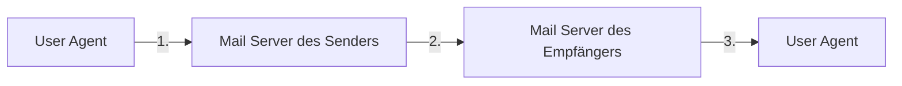

---
tags:
  - 4semester
  - informatik
  - RNVS
fach: "[[Rechnernetze und Verteilte Systeme (RNVS)]]"
Thema:
Benötigte Zeit:
date created: Sunday, 14. July 2024, 17:32
date modified: Sunday, 14. July 2024, 18:15
---

# Interpretation einer DNS-Antwort (H)

Ein nützliches Diagnosewerkzeug für den DNS ist das Programm `dig` (1), das auf vielen Unix-Derivaten (z.B. GNU/Linux Installationen) vorhanden ist. Nachfolgend sehen Sie die aus einer Anfrage resultierenden Resource Records. Beziehen Sie sich beim Bearbeiten der Aufgabe auf die relevanten Zeilnummern!

```bash
bash$ dig +trace +nodnssec mail.nm.ifi.lmu.de

; <<>> DiG 9.2.3 <<>> +trace mail.nm.ifi.lmu.de
;; global options: printcmd
.			80298	IN	NS	d.root-servers.net.
.			80298	IN	NS	e.root-servers.net.
.			80298	IN	NS	f.root-servers.net.
.			80298	IN	NS	g.root-servers.net.
.			80298	IN	NS	h.root-servers.net.
.			80298	IN	NS	i.root-servers.net.
.			80298	IN	NS	j.root-servers.net.
.			80298	IN	NS	k.root-servers.net.
.			80298	IN	NS	l.root-servers.net.
.			80298	IN	NS	m.root-servers.net.
;; Received 500 bytes from 192.168.218.30#53(192.168.218.30) in 0 ms

de.			172800	IN	NS	C.DE.NET.
de.			172800	IN	NS	L.DE.NET.
de.			172800	IN	NS	F.NIC.de.
de.			172800	IN	NS	S.DE.NET.
de.			172800	IN	NS	A.NIC.de.
de.			172800	IN	NS	Z.NIC.de.
;; Received 294 bytes from 128.8.10.90#53(d.root-servers.net) in 104 ms

lmu.de.			86400	IN	NS	dns3.lrz-muenchen.de.
lmu.de.			86400	IN	NS	dns1.lrz-muenchen.de.
lmu.de.			86400	IN	NS	dns2.lrz-muenchen.de.
;; Received 210 bytes from 208.48.81.43#53(C.DE.NET) in 200 ms

mail.nm.ifi.lmu.de.	86400	IN	CNAME	pcheggo.nm.ifi.lmu.de.
pcheggo.nm.ifi.lmu.de.	86400	IN	A	141.84.218.30
nm.ifi.lmu.de.		86400	IN	NS	acheron.ifi.lmu.de.
nm.ifi.lmu.de.		86400	IN	NS	dns3.lrz-muenchen.de.
nm.ifi.lmu.de.		86400	IN	NS	acheron.ifi.lmu.de.
nm.ifi.lmu.de.		86400	IN	NS	dns1.nm.ifi.lmu.de.
nm.ifi.lmu.de.		86400	IN	NS	dns2.lrz-muenchen.de.
nm.ifi.lmu.de.		86400	IN	NS	dns0.nm.ifi.lmu.de.
;; Received 357 bytes from 129.187.5.245#53(dns3.lrz-muenchen.de) in 1 ms
```

# (a) Zeichnen Sie eine Skizze, die den DNS-Verkehr zur Anfrage darstellt, mit mindestens:

- dem anfragenden Host
- dem für diesen Host zuständigen DNS-Server (lokaler DNS-Server)
- dem DNS-Server, der die richtige IP-Adresse für `mail.nm.ifi.lmu.de` liefert
- eventuellen weiteren DNS-Servern, die Teile der Antwort liefern.
- den Nachrichten, die ausgetauscht wurden.

Geben Sie bei jedem Host in Ihrer Skizze, falls vorhanden, IP-Adresse und Hostname an.

**Lösung:**

```
Anfragender Host (192.168.218.30) --> Lokaler DNS-Server (192.168.218.30)
Lokaler DNS-Server (192.168.218.30) --> Root-Server (z.B. d.root-servers.net, 128.8.10.90)
Root-Server (z.B. d.root-servers.net, 128.8.10.90) --> TLD-Server (C.DE.NET, 208.48.81.43)
TLD-Server (C.DE.NET, 208.48.81.43) --> Autoritativer Server (dns3.lrz-muenchen.de, 129.187.5.245)
Autoritativer Server (dns3.lrz-muenchen.de, 129.187.5.245) --> Finale IP (141.84.218.30)
```

# b) Ist die Anfrage rekursiv oder iterativ?

**Lösung:** Die Anfrage ist iterativ, da `dig +trace` die einzelnen Schritte der DNS-Auflösung zeigt und der Client die Antworten der DNS-Server direkt verwendet, um den nächsten Server zu fragen.

# (c) Die Ausgabe enthält eine Anfrage an einer der DNS-Root-Server. Wonach wird er gefragt?

**Lösung:** Der Root-Server wird nach den NS-Records für die Top-Level-Domain (TLD) `.de` gefragt.

# d) Der gesuchte Rechnername `mail.nm.ifi.lmu.de` ist ein Alias.

## i. Wie heisst die Maschine wirklich?

**Lösung:** Die Maschine heißt `pcheggo.nm.ifi.lmu.de`.

## ii. Welche IP-Adresse hat sie?

**Lösung:** Die IP-Adresse ist `141.84.218.30`.

# (e) Anhand der Ausgabe können weitere Aussagen bezüglich der DNS-Server gemacht werden:

## i. Wer betreibt die DNS-Server, die für Anfragen über die Domäne lmu.de zuständig sind?

**Lösung:** Die DNS-Server für die Domäne `lmu.de` werden von `lrz-muenchen.de` betrieben.

## ii. Welche DNS-Server können Anfragen für die Domäne der gesuchten Maschine liefern?

**Lösung:** Die DNS-Server `dns3.lrz-muenchen.de`, `dns1.nm.ifi.lmu.de`, `dns2.lrz-muenchen.de`, `acheron.ifi.lmu.de`, und `dns0.nm.ifi.lmu.de` können Anfragen für die Domäne `nm.ifi.lmu.de` liefern.

## iii. Wurde die gesuchte IP-Adresse von einem autoritativen Server geliefert?

**Lösung:** Ja, die gesuchte IP-Adresse wurde von einem autoritativen Server geliefert (`dns3.lrz-muenchen.de`).

# (f) Angenommen Sie haben als Administrator Zugriff auf den DNS-Cache der lokalen DNS-Server im LRZ. Gibt es für Sie damit eine Möglichkeit, die von Nutzern meist besuchten Web-Server im Internet ausfindig zu machen? Fassen Sie sich kurz.

**Lösung:** Ja, indem man die Einträge im DNS-Cache analysiert, kann man feststellen, welche Domains und IP-Adressen am häufigsten aufgelöst werden, was auf die meistbesuchten Web-Server hinweist.

---

# HTTP Requests und Response (H)

Die folgende ASCII-Zeichentabelle wurde mit Hilfe des Wireshark-Programms aufgezeichnet, als ein Web-Browser einen HTTP GET-Request sendete. Zu sehen ist also der komplette Request. Die Zeichen `<cr><lf>` stehen dabei für Carriage Return und Line Feed, wie es im Nachrichtenformat in der Vorlesung gekennzeichnet war.

```
GET /gnu/gnu.html HTTP/1.1<cr><lf>Host: www.gnu.org<cr><lf>User-Agent: Mozilla/5.0 (X11; Ubuntu; Linux x86_64; rv:67.0) Gecko/20100101 Firefox/67.0<cr><lf>Accept: text/html,application/xhtml+xml,application/xml;q=0.9,*/*;q=0.8<cr><lf>Accept-Language: de-DE,en-US;q=0.7,en;q=0.3<cr><lf>Accept-Encoding: gzip, deflate, br<cr><lf>Connection: keep-alive<cr><lf><cr><lf>
```

Beantworten Sie die folgenden Fragen zum Mitschnitt des GET-Requests.

## (a) Wie lautet die URL des Dokuments, das vom Browser angefragt wurde?

**Lösung:** Die URL des Dokuments lautet `http://www.gnu.org/gnu/gnu.html`.

## (b) Welche HTTP-Version nutzt der Browser?

**Lösung:** Der Browser nutzt die HTTP-Version `HTTP/1.1`.

## (c) Fragt der Browser eine persistente oder nicht-persistente Verbindung an?

**Lösung:** Der Browser fragt eine persistente Verbindung an (`Connection: keep-alive`).

## (d) Welche IP hat der Host, auf dem der Browser ausgeführt wird?

**Lösung:** Diese Information ist im gegebenen Mitschnitt nicht enthalten.

## (e) Welcher Browser-Typ hat den Request abgeschickt? Wozu dient die Übermittlung des Typs und ist sie notwendig?

**Lösung:** Der Browser-Typ ist Mozilla Firefox 67.0 (`User-Agent: Mozilla/5.0 (X11; Ubuntu; Linux x86_64; rv:67.0) Gecko/20100101 Firefox/67.0`). Die Übermittlung des Typs dient dazu, dem Server Informationen über den verwendeten Browser und dessen Fähigkeiten zu geben. Sie ist nicht zwingend notwendig, aber hilfreich für die Optimierung der Server-Ant

wort.

Der Server antwortet nun mit der folgenden HTTP-Response auf die oben gezeigte Anfrage.

```
HTTP/1.1 200 OK<cr><lf>Date: Thu, 23 May 2019 08:27:34 GMT<cr><lf>Server: Apache/2.4.7<cr><lf>Content-Location: gnu.html<cr><lf>Accept-Ranges: bytes<cr><lf>Content-Encoding: gzip<cr><lf>Content-Length: 5751<cr><lf>Keep-Alive: timeout=3, max=98<cr><lf>Connection: Keep-Alive<cr><lf>Content-Type: text/html<cr><lf>Content-Language: en<cr><lf><cr><lf><!DOCTYPE html PUBLIC "-//W3C//DTD XHTML 1.0 Strict//EN" "http://www.w3.org/TR/xhtml1/DTD/xhtml1-strict.dtd"><cr><lf><html xmlns="http://www.w3.org/1999/xhtml" xml:lang="en" lang="en"><cr><lf><head><cr><lf><!-- start of server/head-include -1.html -->
<... weitere Zeichen der Antwort wurden entfernt ...>
```

Beantworten Sie die folgenden Fragen.

## (f) Konnte der Server das angefragte Dokument erfolgreich finden? Zu welcher Zeit wurde die Antwort generiert?

**Lösung:** Ja, der Server konnte das angefragte Dokument erfolgreich finden (`HTTP/1.1 200 OK`). Die Antwort wurde am `Thu, 23 May 2019 08:27:34 GMT` generiert.

## (g) In welcher Sprache ist die Antwort formuliert?

**Lösung:** Die Antwort ist in Englisch formuliert (`Content-Language: en`).

## (h) Wie viele Bytes enthält das zurückgegebene Dokument?

**Lösung:** Das zurückgegebene Dokument enthält `5751` Bytes (`Content-Length: 5751`).

## (i) Wie lauten die ersten 5 Bytes des zurück gegebenen Dokuments? Hat der Server die Anfrage nach einer persistenten Verbindung bestätigt?

**Lösung:** Die ersten 5 Bytes des zurückgegebenen Dokuments sind `<!DOC`. Ja, der Server hat die Anfrage nach einer persistenten Verbindung bestätigt (`Connection: Keep-Alive`).

---

# Was ist es, was kann es? (H)

Sie finden in einem Büroschrank eine unbeschriftete Komponente mit 5 RJ45-Ports, von der Sie nur wissen, dass diese entweder ein Hub oder ein Switch ist. Sie haben außerdem drei Rechner mit je einer Netzschnittstelle und ausreichend Twisted-Pair-Kabel. Auf den Rechnern können Sie das Programm `ping` und/oder einen Protokoll-Analysator (z.B. `wireshark`) einsetzen, mit dem Sie sich alle eingehenden und ausgehenden Rahmen vollständig anzeigen lassen können.

Bei allen folgenden Untersuchungen soll das Ergebnis nur durch funktionale Tests und logisches Schlussfolgern bestimmt werden. Erstellen Sie eine Skizze Ihres Versuchsaufbaus und geben Sie die Sequenz der Aktionen (z.B. Programmaufrufe) an. Begründen Sie, warum Ihr Test das richtige Ergebnis liefert!

## (a) Wie finden Sie heraus, ob das unbekannte Gerät ein Switch oder ein Hub ist?

**Lösung:**

**Versuchsaufbau:**

1. Verbinden Sie die drei Rechner mit dem Gerät (R1, R2, R3).
2. Starten Sie `wireshark` auf allen Rechnern, um den Netzwerkverkehr zu überwachen.
3. Senden Sie einen `ping` von R1 zu R2.

**Aktionen:**

1. Wenn R3 auch den `ping`-Verkehr zwischen R1 und R2 sehen kann, handelt es sich um einen Hub (da Hubs alle empfangenen Pakete an alle Ports weiterleiten).
2. Wenn R3 den `ping`-Verkehr zwischen R1 und R2 nicht sehen kann, handelt es sich um einen Switch (da Switches Pakete gezielt an den entsprechenden Port weiterleiten).

**Begründung:**
Ein Hub leitet alle eingehenden Pakete an alle Ports weiter, während ein Switch Pakete nur an den Zielport weiterleitet.

## (b) Nehmen Sie an, es sei ein Switch. Wie bestimmen Sie möglichst genau und effizient die Zeit, nach der der Switch Einträge aus der Forwarding-Tabelle löscht?

**Lösung:**

**Versuchsaufbau:**

1. Verbinden Sie die drei Rechner mit dem Switch (R1, R2, R3).
2. Starten Sie `wireshark` auf allen Rechnern.
3. Senden Sie `pings` zwischen R1 und R2 und notieren Sie die Zeitpunkte.
4. Stoppen Sie den Verkehr für eine bestimmte Zeit und starten Sie dann erneut `pings` zwischen R1 und R2.

**Aktionen:**

1. Notieren Sie die Zeitpunkte der letzten und der ersten `pings` nach der Pause.
2. Wiederholen Sie den Test mit verschiedenen Pausenlängen (z.B. 1 Minute, 5 Minuten, 10 Minuten).

**Begründung:**
Die Zeitspanne, nach der der Switch die Einträge aus der Forwarding-Tabelle löscht, ist die längste Pause, nach der die `pings` zwischen R1 und R2 zunächst keine Antwort erhalten und danach wieder erfolgreich sind. Dies zeigt, dass der Switch die MAC-Adressen neu lernen musste.

---

# CRC (H)

## (a) Gegeben sei das Generatorpolynom $G = x^3 + 1$.

### i. Durch wie viele Bits wird $G$ bei CRC repräsentiert?

**Lösung:** Das Generatorpolynom $G = x^3 + 1$ wird durch 4 Bits repräsentiert (die Koeffizienten von $x^3, x^2, x^1$, und $x^0$), also `1001`.

### ii. Es soll die Nachricht 11 00 11 CRC-geschützt übertragen werden. Berechnen Sie die zu übertragende Bitfolge (inkl. CRC-Prüfsumme) unter Verwendung des Generatorpolynoms $G$.

**Lösung:**

1. Nachricht: `110011`
2. Anhängen von 3 Nullen (Grad von G minus 1): `110011000`
3. Polynomdivision von `110011000` durch `1001`:

```
110011000
1001
-----
10110
1001
-----
11110
1001
-----
01110
1001
-----
01110
1001
-----
```

Der Rest ist `011`, also lautet die CRC-Prüfsumme `011`.

Die zu übertragende Bitfolge ist: `110011011`.

### iii. Nehmen Sie an, dass Sie die CRC-geschützte Bitfolge 10 01 10 01 empfangen haben. Zeigen Sie, dass die empfangene Bitfolge unter Verwendung des Generatorpolynoms $G$ korrekt ist (inkl. Rechnung). Markieren Sie in Ihrer Rechnung die Stelle, an der der Empfänger die Korrektheit ablesen kann.

**Lösung:**

1. Empfangene Bitfolge: `10011001`
2. Polynomdivision von `10011001` durch `1001`:

```
10011001
1001
-----
000000
0000
-----
```

Der Rest ist `000`, was bedeutet, dass die empfangene Bitfolge korrekt ist, da der Rest `0` ist.

Die Stelle, an der der Empfänger die Korrektheit ablesen kann, ist das Endergebnis der Polynomdivision, das `000` ergibt.

---

# Email (H)



## (a) Die Abbildung skizziert den Weg einer Email vom Verfasser zum Adressaten. Welche Protokolle der Anwendungsschicht können auf den drei eingezeichneten Übertragungswegen eingesetzt werden?

**Lösung:**

1. Vom User Agent zum Mail Server des Senders: SMTP (Simple Mail Transfer Protocol)
2. Vom Mail Server des Senders zum Mail Server des Empfängers: SMTP
3. Vom Mail Server des Empfängers zum User Agent: IMAP (Internet Message Access Protocol) oder POP3 (Post Office Protocol 3)

## (b) Nehmen Sie nun an, dass der Sender mit einem webbasierten E-Mail Account (bspw. GMail oder GMX) eine E-Mail an den Empfänger verschickt. Welche (zusätzlichen) Protokolle im Vergleich zu Teilaufgabe (a) sind involviert?

**Lösung:**

Zusätzlich zu SMTP, IMAP oder POP3 wird HTTP (Hypertext Transfer Protocol) oder HTTPS (Hypertext Transfer Protocol Secure) für den Zugriff auf das webbasierte E-Mail-Konto verwendet.

## (c) Welche dargestellten Systeme sind Teil des Message Transfer Systems?

**Lösung:** Die Mail-Server des Senders und des Empfängers (C und D) sind Teil des Message Transfer Systems.

## (d) Internet E-Mail ist empfindlich gegen den Dienstgüteparameter "Datenverlust" des Transportnetzes. Gibt es allgemeine Dienstgüteparameter, gegen die E-Mail unempfindlich ist? Begründen Sie Ihre Antwort!

**Lösung:** E-Mail ist relativ unempfindlich gegenüber Dienstgüteparametern wie Latenzzeit (Verzögerung) und Bandbreite, da E-Mail nicht in Echtzeit zugestellt werden muss und die Größe von E-Mails im Allgemeinen gering genug ist, um keine hohen Bandbreitenanforderungen zu stellen.

<!-- DISQUS SCRIPT COMMENT START -->

<hr style="border: none; height: 2px; background: linear-gradient(to right, #f0f0f0, #ccc, #f0f0f0); margin-top: 4rem; margin-bottom: 5rem;">
<div id="disqus_thread"></div>
<script>
    /**
    *  RECOMMENDED CONFIGURATION VARIABLES: EDIT AND UNCOMMENT THE SECTION BELOW TO INSERT DYNAMIC VALUES FROM YOUR PLATFORM OR CMS.
    *  LEARN WHY DEFINING THESE VARIABLES IS IMPORTANT: https://disqus.com/admin/universalcode/#configuration-variables    */
    /*
    var disqus_config = function () {
    this.page.url = PAGE_URL;  // Replace PAGE_URL with your page's canonical URL variable
    this.page.identifier = PAGE_IDENTIFIER; // Replace PAGE_IDENTIFIER with your page's unique identifier variable
    };
    */
    (function() { // DON'T EDIT BELOW THIS LINE
    var d = document, s = d.createElement('script');
    s.src = 'https://myuninotes.disqus.com/embed.js';
    s.setAttribute('data-timestamp', +new Date());
    (d.head || d.body).appendChild(s);
    })();
</script>
<noscript>Please enable JavaScript to view the <a href="https://disqus.com/?ref_noscript">comments powered by Disqus.</a></noscript>

<!-- DISQUS SCRIPT COMMENT END -->
