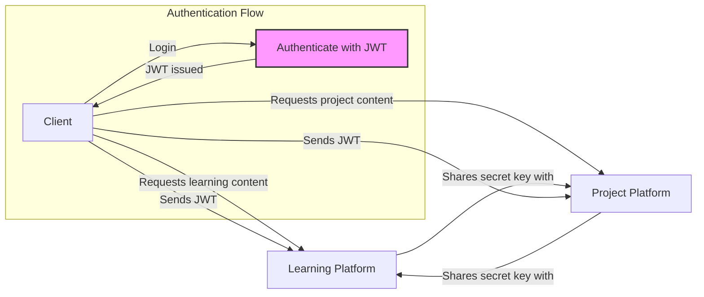
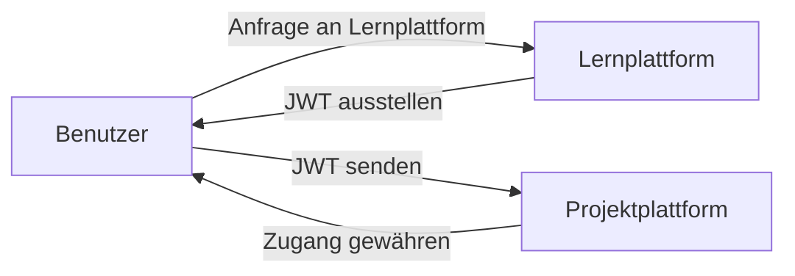

---
tags:
  - 4semester
  - Seminar
  - informatik
fach: "[[Bachelorseminar-Software Security]]"
Thema:
Benötigte Zeit:
date created: Wednesday, 12. June 2024, 00:01
date modified: Thursday, 4. July 2024, 20:38
---

# Beispiel mit Online-Bildungsplattform

1. **Zwei Plattformen:**

   - **Lernplattform:** Verwaltung von Lernmaterialien, Videos und Kursinformationen.
   - **Projektplattform:** Verwaltung von Studentenprojekten und -aufgaben.

2. **Ziel:**

   - Benutzer sollen sich nicht erneut einloggen müssen, wenn sie zwischen den Plattformen wechseln.

3. **Session-basiertes System:**

   - Sitzung wird auf dem Server der Lernplattform gespeichert.
   - Sitzung wird auf dem Server der Projektplattform nicht gefunden.
   - Benutzer muss sich erneut einloggen, wenn er zur Projektplattform wechselt.

4. **JWT-basiertes System:**

   - Beide Server (Lernplattform und Projektplattform) teilen denselben geheimen Schlüssel.
   - JWT wird vom Client an beide Server gesendet.
   - Benutzer muss sich nicht erneut einloggen.

5. **Vorteile von JWT:**

   - Benutzerinformationen werden auf dem Client gespeichert, nicht auf dem Server.
   - Ein JWT-Token kann von beiden Servern erkannt werden, solange sie denselben geheimen Schlüssel haben.

6. **Beispiel 1:**

   - **Lernplattform:** Benutzer tätigt Anfragen und erhält Lerninformationen.
   - **Wechsel zur Projektplattform:** Benutzer bleibt eingeloggt, da das JWT-Token verwendet wird.

7. **Beispiel 2:**

   - Zwei Lernplattform-Server mit Lastverteilung.
   - **Serverwechsel:** Client wechselt von Server A zu Server B.
   - **JWT:** Benutzerinformationen sind auf dem Client gespeichert, kein erneutes Einloggen notwendig.

8. **Schlüsselpunkt:**
   - Benutzerinformationen sind im JWT-Token auf dem Client gespeichert.
   - JWT ermöglicht nahtlose Authentifizierung über mehrere Server hinweg, solange der geheime Schlüssel geteilt wird.

> [!tip] Ausgeschriebenes Beispiel
> Stellen Sie sich vor, wir haben zwei verschiedene Server. Wir haben ein Unternehmen, das eine Plattform für Online-Bildung betreibt, die alle ihre Lernmaterialien, Videos und Kursinformationen verwaltet. Dieses Unternehmen betreibt jedoch auch eine separate Plattform für die Verwaltung von Studentenprojekten und -aufgaben. Sie ermöglichen es den Studenten, ihre Projekte einzureichen und Feedback zu erhalten, auf einer komplett separaten Webanwendung.
>
> Nun möchten sie, dass die Benutzer, die sich in die Lernplattform einloggen, auch automatisch in die Projektplattform eingeloggt werden können. Wenn sie also von der Lernplattform zur Projektplattform wechseln, sollen die Benutzer sich nicht erneut einloggen müssen, besonders wenn dieser Übergang für die Benutzer sehr nahtlos aussieht, sodass es so wirkt, als wären sie auf derselben Anwendung. Dies ist in vielen größeren Unternehmen und Anwendungen sehr üblich.
>
> Was also passiert, ist, dass der Client eine Anfrage an die Lernplattform stellt. Sie sagen zum Beispiel: "Okay, ich möchte einige Lerninformationen, Lerninformationen, bla, bla, bla." Sie erledigen all ihre Lernaktivitäten. Und schließlich kommen sie an den Punkt, an dem sie tatsächlich auf die Projektinformationen zugreifen möchten. Wenn Sie einen normalen sessionbasierten Server haben, was passiert, ist, dass Ihre Sitzung hier innerhalb der Lernplattform gespeichert ist und nicht innerhalb der Projektplattform.
>
> Das bedeutet, dass der Benutzer sich erneut einloggen muss, weil seine Sitzung auf der Projektplattform nicht gefunden werden kann, wenn der Sitzungs-ID vom Client gesendet wird. Aber wenn Sie JWT verwenden und den gleichen geheimen Schlüssel sowohl zwischen Ihrer Lernplattform als auch Ihrer Projektplattform teilen, dann müssen Sie nur das gleiche JWT vom Client an beide senden, und Sie sind beide Male authentifiziert, ohne sich erneut einloggen zu müssen.
>
> Ich weiß, dass es anfangs ein wenig verwirrend ist, dies zu verstehen, aber im Wesentlichen speichern wir die Benutzerinformationen auf dem Client. Während in der alten Cookie-Sessions-Version, wir sie auf dem Server speichern. Und da wir zwei separate Server haben, müssen wir die Informationen auf beiden speichern. Aber das ist nicht sehr einfach oder sogar möglich. Normalerweise muss es also an einem Ort gespeichert werden und der Benutzer muss sich erneut einloggen, wenn er an den anderen Ort wechselt.
>
> Aber mit JWT, da die Benutzerinformationen in diesem Token auf dem Client gespeichert sind, spielt es keine Rolle, ob sie auf die Lernplattform, die Projektplattform oder auf einen anderen Server, den dieses Unternehmen betreibt, zugreifen, sie bleiben eingeloggt, weil sie das gleiche Token haben und alle Server dieses Token erkennen können, solange sie den gleichen geheimen Schlüssel auf dem Server haben. Ein weiteres Beispiel, wo dies sehr nützlich ist, ist, wenn wir zwei Lernplattform-Server hätten. Das Unternehmen ist sehr groß und benötigt zwei verschiedene Server, um alle Benutzer, die auf die Plattform zugreifen, zu verwalten.
>
> Wenn der Client eine Weile auf Server A zugreift und dann dieser Server A sehr beschäftigt wird, wird dieser Client zu Server B verschoben. Ihre Sitzung wird nicht auf Server B gespeichert, nur auf Server A. Der Benutzer muss sich erneut einloggen, wenn dies passiert. Mit JWT müssen Sie sich darüber keine Sorgen machen, weil, wie ich bereits erwähnt habe, die Benutzerinformationen auf dem Client gespeichert sind. Das ist wirklich das Wichtige an JWT: Die Benutzerinformationen sind auf dem Client gespeichert. Egal wie viele verschiedene Server Sie haben, egal wie viele verschiedene Anwendungen, Lastverteiler oder was auch immer Sie haben, es spielt keine Rolle. Der Benutzer kann sich immer bei jedem dieser Server authentifizieren, solange Sie denselben geheimen Schlüssel zwischen ihnen haben.

Simpliefied:

<!-- DISQUS SCRIPT COMMENT START -->

<noscript>Please enable JavaScript to view the <a href="https://disqus.com/?ref_noscript">comments powered by Disqus.</a></noscript>

<!-- DISQUS SCRIPT COMMENT END -->
