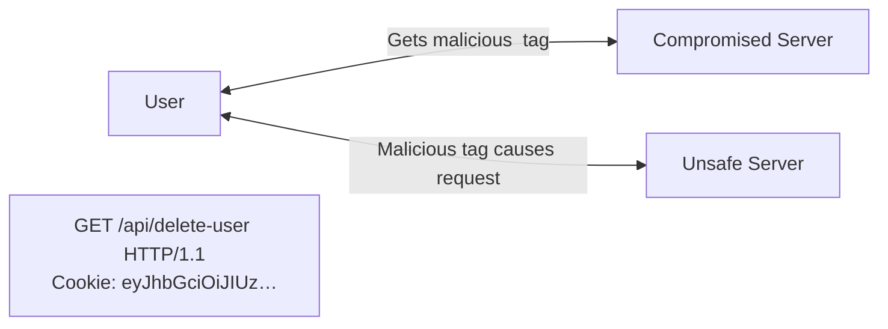

---
tags:
  - 4semester
  - Seminar
  - informatik
fach: "[[Bachelorseminar-Software Security]]"
Thema:
Benötigte Zeit:
date created: Monday, 3. June 2024, 23:06
date modified: Friday, 28. June 2024, 11:23
---

# 2 Practical Applications

## 2.1 Client-side/Stateless Sessions

- _Stateless sessions_ are just client-side data.
- Key aspect is _signing and encrypting_ to authenticate and protect the contents of the session.
- Client-side data is vulnerable to tampering/manipulation.
- JWTs can use [JWS](https://en.wikipedia.org/wiki/JSON_Web_Signature) and [JWE](https://en.wikipedia.org/wiki/JSON_Web_Encryption) to provide different types of signatures and encryption.
  - Signatures help ensure the data hasn't been tampered with.
  - Encryption helps keep the data from being read by third parties.
- Most of the time, sessions only need to be signed.
  - There is no security or privacy concern if third parties read the data stored in signed sessions.
  - A common example of data that can usually be safely read by third parties is the `sub` claim (`subject`).
    - The subject claim usually identifies one party to the other (e.g., user IDs or emails).
    - This claim does not need to be unique.
    - Additional information may be required to uniquely identify a user.
    - The decision on additional claims is left to the users.
- An "items" claim representing a user's shopping cart may not be appropriate to leave open.
  - The cart contains items the user is about to purchase, linked to their session.
  - A third party (e.g., a client-side script) could potentially access these items if stored in an unencrypted JWT.

## 2.1.1 Security Considerations

### 2.1.1.1 Signature Stripping

- common method for attacking JWT is to simply remove the signature
  - signed JWT are constructed from three diffrent parts
    - header
    - payload
    - signature
    - all are encoded seperately
  - it is possible to remove the signature and then change the header to claim the JWT is _unsigned_
- bad JWT libraries can lead to unsigned tokens being accepted as signed tokens
  - easily solved by making sure that the server does not consider unsigned JWTs valid

![[Pasted image 20240603235305.png]]
[Whiteboard](https://wbd.ms/share/v2/aHR0cHM6Ly93aGl0ZWJvYXJkLm1pY3Jvc29mdC5jb20vYXBpL3YxLjAvd2hpdGVib2FyZHMvcmVkZWVtL2FjMjM0NGY4NWQxYTQxOWI4ZmUwOWQyNWE2MTliYjFjX0JCQTcxNzYyLTEyRTAtNDJFMS1CMzI0LTVCMTMxRjQyNEUzRF82ZDY1YjA2YS1jOGUyLTQxNjQtYTdiNS1kNWY5MDY4ODZkNWQ=)-Link

## 2.1.1.2 Cross-Site Request Forgery (CSRFCSRF)

- Cross-site request forgery (CSRF) attacks attempt to perform requests against sites where the user is logged in by tricking the user’s browser into sending a request from a different site.
- To accomplish this, a specially crafted site or item must contain the URL to the target.
- A common example is an `` tag embedded in a malicious page with the `src` pointing to the attack’s target.
  - Example: ``
- The above `` tag will send a request to target.site.com every time the page that contains it is loaded.
- If the user had previously logged in to target.site.com and the site used a cookie to keep the session active, this cookie will be sent as well.
- If the target site does not implement any CSRF mitigation techniques, the request will be handled as a valid request on behalf of the user.
- JWTs, like any other client-side data, can be stored as cookies.

- Short-lived JWTs can help mitigate CSRF attacks.
- Common CSRF mitigation techniques include:
  - _Special headers that are added to requests only when they are performed from the right origin._
  - _Per session cookies._
  - _Per request tokens._
- If JWTs (and session data) are not stored as cookies, CSRF attacks are not possible.
- Cross-site scripting (XSS) attacks are still possible, even if CSRF is mitigated.

## 2.1.1.3 Cross-Site Scripting (XSS)

- [ ] Seminar XSS weiterlesen

<!-- DISQUS SCRIPT COMMENT START -->

<noscript>Please enable JavaScript to view the <a href="https://disqus.com/?ref_noscript">comments powered by Disqus.</a></noscript>

<!-- DISQUS SCRIPT COMMENT END -->

<!-- Modal START -->

  

    &times;
    

      MyUniNotes is a personal, non-revenue project as I believe in accessible education for everyone. I manage this project alongside my studies, with all materials handwritten by me trying to help others understand challenging concepts.
    

    

      If MyUniNotes has been helpful and you’d like to support my efforts,  you can contribute with a donation: <a class="modal-dono-link" href="https://paypal.me/myuninotes4u">Donate via PayPal</a> :)  Your support will help me continue improving the content, but there is no obligation to donate.
    

  

<!-- Modal END -->

<!-- Modal START -->

  

    &times;
    

      MyUniNotes is a personal, non-revenue project as I believe in accessible education for everyone. I manage this project alongside my studies, with all materials handwritten by me trying to help others understand challenging concepts.
    

    

      If MyUniNotes has been helpful and you’d like to support my efforts,  you can contribute with a donation: <a class="modal-dono-link" href="https://paypal.me/myuninotes4u">Donate via PayPal</a> :)  Your support will help me continue improving the content, but there is no obligation to donate.
    

  

<!-- Modal END -->

<!-- Modal START -->

  

    &times;
    

      MyUniNotes is a personal, non-revenue project as I believe in accessible education for everyone. I manage this project alongside my studies, with all materials handwritten by me trying to help others understand challenging concepts.
    

    

      If MyUniNotes has been helpful and you’d like to support my efforts,  you can contribute with a donation: <a class="modal-dono-link" href="https://paypal.me/myuninotes4u">Donate via PayPal</a> :)  Your support will help me continue improving the content, but there is no obligation to donate.
    

  

<!-- Modal END -->
