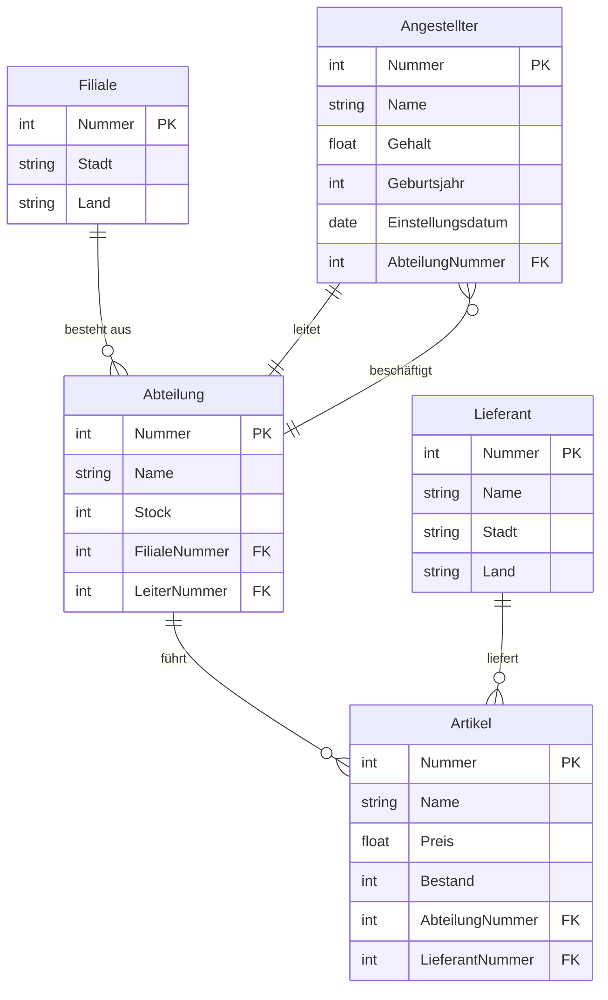
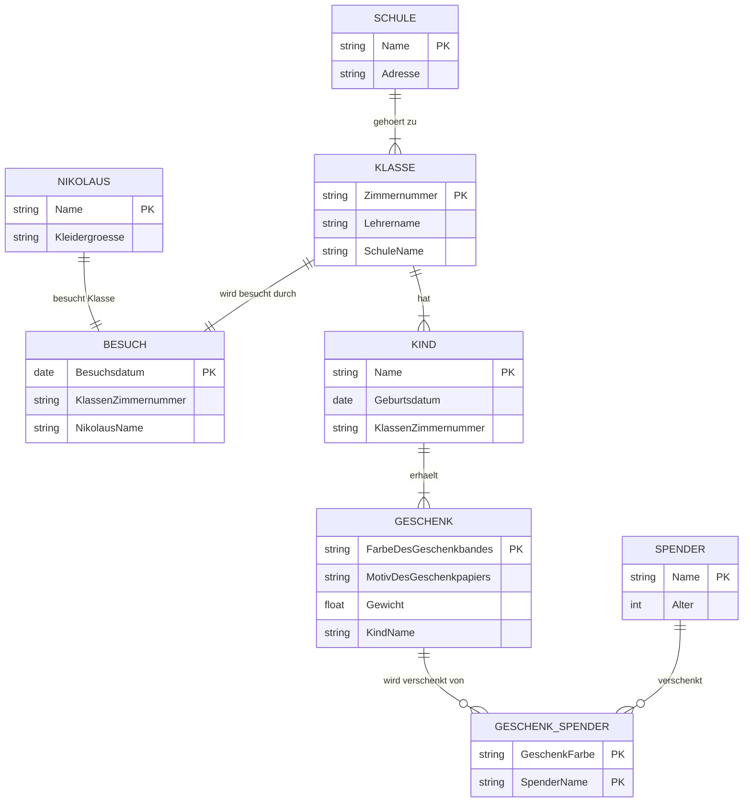

# Aufgabe 1-1 _Relationships_

> [!note] Geben Sie für jeden der folgenden Relationship-Typen (= Beziehungs-Typen) mindestens ein Beispiel an.

## a) 1:1

- Jeder Student besitzt genau eine Matrikelnummer

## b) 1:n

- Eine Mutter kann mehrere Kinder haben

## c) m:n

- Ein Student kann mehrere Kurse besuchen, in diesen Kursen können mehrere Studenten eingeschrieben sein

## d) 1:n rekursiv, d.h eine 1: n-Entity-Sets zu sich selbst

- Mitarbeiter ist Chef von Mitarbeiter

## e) m:n rekursiv

- Person ist Nachkomme von Person

# Aufgabe 1-2 _Ableitung eines ER-Diagramms_

> [!note] Aufgabenstellung
> Gegeben sei die folgende relationale „Geschäftsdatenbank“ einer Kaufhauskette:
>
> $$
> \begin{aligned}
> \textbf{Angestellter} & \ (\underline{\text{Nummer}}, \ \text{Name}, \ \text{Gehalt}, \ \text{Abteilung}, \ \text{Geburtsjahr}, \ \text{Einstellungsdatum}) \\
> \textbf{Abteilung} & \ (\underline{\text{Nummer}}, \ \text{Name}, \ \text{Filiale}, \ \text{Stock}, \ \text{Leiter}) \\
> \textbf{Filiale} & \ (\underline{\text{Nummer}}, \ \text{Stadt}, \ \text{Land}) \\
> \textbf{Lieferant} & \ (\underline{\text{Nummer}}, \ \text{Name}, \ \text{Stadt}, \ \text{Land}) \\
> \textbf{Artikel} & \ (\underline{\text{Nummer}}, \ \text{Name}, \ \text{Abteilung}, \ \text{Preis}, \ \text{Bestand}, \ \text{Lieferant}) \\
> \end{aligned}
> $$
>
> Leiten Sie für die „Geschäftsdatenbank“ aus den Relationen ein vollständiges ER-Diagramm mit Entities, Relationships und Attributen ab.
>
> ## Hinweise:
>
> Um die Bearbeitung der Aufgabe zu erleichtern, gehen Sie die folgenden Schritte zunächst durch:

## a) Identifizieren Sie die Entitäten:

- Bestimmen Sie, welche Entitäten aus den gegebenen Tabellen der „Geschäftsdatenbank“ abgeleitet werden können.

**Entitäten:**

- Angestellter
- Abteilung
- Filliale
- Lieferant
- Artikel

## b) Bestimmen Sie die Attribute:

- Ordnen Sie den Entitäten die entsprechenden Attribute zu, wie sie in den Tabellen beschrieben sind.

- **Angestellter**:
  - Attribute: Nummer, Name, Gehalt, Geburtsjahr, Einstellungsdatum
- **Abteilung**:
  - Attribute: Nummer, Name, Stock. Leiter ist ein Angestellter
- **Filiale**:
  - Attribute: Nummer, Stadt, Land
- **Lieferant**:
  - Attribute: Nummer, Name, Stadt, Land
- **Artikel**:
  - Attribute: Nummer, Name, Abteilung,Preis, Bestand, Lieferant

## c) Definieren Sie die Beziehungen zwischen den Entitäten:

> [!note] Aufabenstellung
>
> - Analysieren Sie, wie die Entitäten miteinander in Beziehung stehen. Verwenden Sie dabei die folgenden Hilfestellungen, um die Kardinalitäten (z. B. 1:1, 1:N, N:M) zu bestimmen:
> - Überlegen Sie, ob eine Instanz einer Entität immer genau einer Instanz der anderen Entität zugeordnet ist.
>   - Überlegen Sie, ob eine Instanz einer Entität mit mehreren Instanzen der anderen Entität verbunden sein kann, aber die andere Entität nur mit einer Instanz der ersten Entität.
>   - Überprüfen Sie, ob beide Entitäten mehrfach miteinander verknüpft sein können.

- Angesteller $\leftrightarrow$ Abteilung: Jeder Angestellter ist zugehörig zu einer Abteilung, aber eine Abteilung kann mehrere Angestellte haben (1:n)
- Abteilung $\leftrightarrow$ Filliale: Eine Abteilung gehört zu einer Filliale aber eine Filliale besteht aus mehreren Abteilungen (1:n)
- Lieferant $\leftrightarrow$ Artikel: Ein Lieferant liefert beliebige Artikel und Artikel können nur von genau einem Lieferanten stammen (1:n)

### Aufbauend auf den vorherigen Schritten:

- Erstellen Sie auf Basis Ihrer bisherigen Analyse ein vollständiges ER-Diagramm, das die Entitäten, deren Attribute und die definierten Beziehungen visualisiert. Verwenden Sie die in der Vorlesung gezeigte Notation.
- Kennzeichnen Sie die Kardinalitäten und stellen Sie sicher, dass alle Entitäten und Beziehungen korrekt miteinander verbunden sind

- **Kardinalitätsnotationen:**

  - `||--||` : 1:1 Beziehung
  - `||--|{` : 1:n Beziehung
  - `||--o{` : 1:optional n Beziehung
  - `o{--|{` : m:n Beziehung

- **Primärschlüssel (PK)**: Eindeutige Identifikation einer Entität.
- **Fremdschlüssel (FK)**: Verbindet Entitäten durch Referenz.

# Aufgabe 1-3: _Ableitung eines E/R-Diagramms_

> [!note] Aufgabenstellung
>
> Für eine Nikolaus-Geschenkeaktion, die an unterschiedlichen Schulen stattfindet, wird ein E/R-Diagramm zur besseren Übersicht benötigt. Bei dieser Aktion können sich Nikoläuse anmelden, um eine oder mehrere Klassen zu besuchen, in denen Kinder gespendete Geschenke erhalten.
>
> Folgende Informationen sollen im Diagramm enthalten sein:
>
> - Jeder angemeldete Nikolaus gibt seinen **Namen** und seine **Kleidergröße** an.
> - Eine Klasse wird durch den **Namen des Klassenlehrers** und eine für die jeweilige Schule eindeutige **Zimmernummer** beschrieben.
> - Zusätzlich wird gespeichert, zu welcher Schule eine Klasse gehört. Eine Schule definiert sich durch einen **Namen** und eine **Adresse**.
> - Jede Klasse wird nur von einem Nikolaus an einem bestimmten **Datum** besucht.
> - Innerhalb der Klassen gibt es mehrere Kinder, die jeweils einen **Namen** und ein **Geburtsdatum** haben.
> - Die vorhandenen Geschenke können eindeutig durch die **Farbe des Geschenkbandes** und das **Motiv des Geschenkpapiers** zugeordnet werden. Außerdem besitzt jedes Geschenk ein **Gewicht**.
> - Ein Geschenk wird von einem oder mehreren Spendern, welche einen **Namen** und ein **Alter** haben, an ein bestimmtes Kind verschenkt.
> - Ein Spender kann mehrere Geschenke verschenken und Kinder können mehrere Geschenke erhalten.
> - Es soll angenommen werden, dass alle verwendeten **Namen** innerhalb einer Entity eindeutig sind.
>
> Geben Sie das entsprechende E/R-Diagramm mit den Funktionalitäten an. Unterstreichen Sie dabei Attribute, die zum Primärschlüssel gehören. Verwenden Sie für die Beziehungen die aus der Vorlesung bekannte Pfeilnotation.

- **Kardinalitätsnotationen:**

  - `||--||` : 1:1 Beziehung
  - `||--|{` : 1:n Beziehung
  - `||--o{` : 1:optional n Beziehung
  - `o{--|{` : m:n Beziehung

- **Primärschlüssel (PK)**: Eindeutige Identifikation einer Entität.
- **Fremdschlüssel (FK)**: Verbindet Entitäten durch Referenz.

---

# Aufgabe 9-4 **Ableitung eines Relationenschemas**

_Erzeugen Sie entsprechend der Vorlesung (Kapitel 6 Folien 16-24) aus dem gegebenen E/R-Diagramm eines Christkindlmarktes ein vollständiges Relationenschema. Unterstreichen Sie dabei in jeder Relation den Primärschlüssel und überstreichen Sie die Fremdschlüssel. Begründen Sie Ihre Umsetzung der Relationship ‘freier Eintritt’._

<!-- DISQUS SCRIPT COMMENT START -->

<!-- DISQUS RECOMMENDATION START -->

<noscript>
Please enable JavaScript to view the 
<a href="https://disqus.com/?ref_noscript" rel="nofollow">
comments powered by Disqus.
</a>
</noscript>

<!-- DISQUS RECOMMENDATION END -->

<noscript>Please enable JavaScript to view the <a href="https://disqus.com/?ref_noscript">comments powered by Disqus.</a></noscript>

<!-- DISQUS SCRIPT COMMENT END -->
