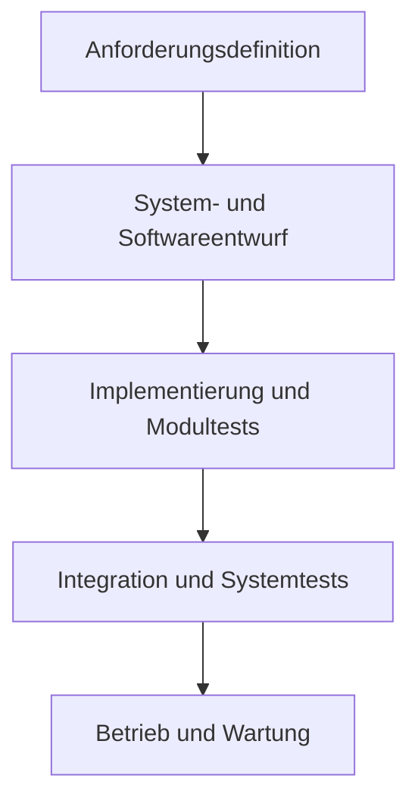
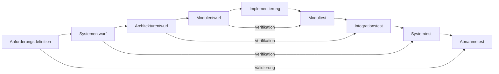

> [!info] Dies Informationen hier bestehen aus meiner ersten Seite [hustle-swt](https://hustle-swt.vercel.app/)
> Ich überführe die Notizen sofern ich Zeit habe hier auf [myuninotes.com](https://myuninotes.com/) rüber :)
> _Started at the bottom now we here,right?_

# ❓ Was ist das Wasserfallmodell?

- Wird gebraucht um Projekte in der IT zu managen, Aufgaben werden hierbei nacheinander abgeschlossen
- Es bestseht aus `5` aufeinanderfolgenden Phasen, die nacheinander durchlaufen werden.
- Die nächste Projektphase kann nicht beginnen, bevor die vorherige nicht abgeschlossen wurde

**Die 5 Phasen des Wasserfallmodells**

- _Anforderungsdefiniton_
  - Bedürfnisse und Erwartungen der Nutzer erfasst und dokumentiert
- _System und Softwareentwurf_
  - Architektur des Systems und der Software geplant und entworfen
- _Implementierung und Modutests_
  - Code wird geschrieben und einzelne Module getestet
- _Integration und Systemtests_
  - einzelnen Module werden zusammengefügt und werden getestet
- _Betrieb und Wartung_
  - System wird in Betrieb genommen und im Laufe der Zeit gewartet und aktualisiert

**Vor und Nachteile**

| Vorteile                                                | Nachteile                                                  |
| ------------------------------------------------------- | ---------------------------------------------------------- |
| ❇️ Klare Struktur und Planung                           | 🔴 Wenig Flexibilität für Änderungen während des Prozesses |
| ❇️ Gut geeignet für Projekte mit stabilen Anforderungen | 🔴 Risiko, dass Fehler erst spät erkannt werden            |
| ❇️ Einfache Verwaltung und Kontrolle                    |                                                            |

→ Eignet sich für Projekte bei denen die Anforderungen von Beginn an klar und vollständig sind und keine Änderungen erwartet werden

# 1 Software Life Cycle

## (a) Erläutern Sie, wieso das Wasserfall-Modell kaum mit moderner Softwareentwicklung vereinbar ist!

- _Mangelnde Flexibilität_
  - WF-Modell ist streng sequenziell, jede Phase kann nur einmal durchlaufen werden und baut auf den Ergebnissen der vorherigen Phase auf
  - → Kein Raum für Änderungen
- _Späte Fehlererkennung_
  - Testen findet relativ spät im WF-Modell statt, kann zu erheblichen Kosten und Verzögerungen führen
- _Widerspricht modernen agilen Methoden_
  - moderene Software benötigt ständiges Feedback und die Fähigkeit schnell auf Änderungen zu reagieren
- _Annahme von vollständigen und unveränderlichen Anforderungen_
  - Anforderungen ändern sich in der Realität ständig

## (b) Erklären Sie, warum Änderungen in komplexen Systemen unvermeidlich sind und geben Sie Beispiele von Softwareprozessaktivitäten (abgesehen von Prototypen und inkrementeller Auslieferung), die helfen, mögliche Änderungen vorherzusagen und die die zu entwickelnde Software robuster gegenüber Änderungen zu machen.

- _Anforderungen ändern sich durch äußere Faktoren ständig_
  - z.B durch wechselnde Unternehmensziele
  - Kunde will neue Features oder Änderung eines Features
- _Änderungen vorhersagen, robuster gegenüber Änderungen machen, indem:_
  - Aufzeichnen der Gründe für eine Anforderung
  - Nachvollziehbarkeit der Anforderungen, sodass Abhängigkeiten zwischen Anforderungen erkannt werden können
  - Code Refactoring: Verbesserung der Codequalität; Code wird zugänglicher für Veränderungen

## (c) Erklären Sie, warum es wichtig ist, während der Anforderungsanalyse zwischen der Entwicklung der Benutzeranforderungen und der Entwicklung der Systemanforderungen zu unterscheiden.

- _Benutzeranforderungen_
  - Beschreibt die Funktionalität des Systems aus Sicht des Nutzers
  - in natürlicher Sprache formuliert
  - Erlaubt Flexibilität in der Umsetzung
- _Systemanforderungen_
  - Beschreibt die Funktionalität des Systems präzise
  - in technischer Sprache formuliert, da für Entwickler gedacht
  - werden nach Benutzeranforderungen gestellt

> [!example] Beispiele für Benutzer- und Systemanforderungen
>
> **Beispiel 1:**
>
> **Benutzeranforderung:** „Ich möchte in der Lage sein, die Farbe des Hintergrunds der Anwendung zu ändern.“
>
> **Systemanforderung:** „Das System muss eine Option in den Einstellungen bereitstellen, die es dem Benutzer ermöglicht, aus einer Palette von mindestens 16 Millionen Farben eine auszuwählen und als Hintergrundfarbe festzulegen.“
>
> **Beispiel 2:**
>
> **Benutzeranforderung:** „Ich möchte eine Benachrichtigung erhalten, wenn ein neuer Artikel veröffentlicht wird.“
>
> **Systemanforderung:** „Das System muss einen Mechanismus implementieren, der den Zustand der Artikel überwacht und eine Benachrichtigung an den Benutzer sendet, sobald ein neuer Artikel hinzugefügt wird. Die Benachrichtigung muss den Titel des Artikels und einen Link zur vollständigen Ansicht enthalten.“

# K Softwareprozesse

## 1. Nennen Sie die drei Testphasen, die im Prozess der Verifikation und Validierung durchlaufen werden.

- _Komponentenests_

  - Softwarekomponenten werden isoliert und mit Testdaten überprüft
  - **Ziel:** Fehler in der Implementierung und im Entwurf der Komponenten zu finden

- _Systemtests_

  - integrierten Softwareprozesse werden als Gesamtsystem getestet um Fehler in den Schnittstellen und in der Funktionalität zu finden
  - **Ziel:** Zeigen, dass das System die Anforderungen und die erwartete Leistung bringt

- _Kundentest_
  - fertige Softwareprodukt wird mit realen Daten des Kunden oder der Benutzer getestet, um zu überprüfen, ob es die Kundenerwartungen und die Nutzungsziele erfüllt
  - **Ziel:** Akzeptanz und die Zufriedenheit des Kunden oder der Benutzer zu gewährleisten

## 2. Nennen Sie die Phasen des Wasserfallmodells.

- Anforderungsdefiniton
- System und Softwareentwurf
- Implementierung und Modutests
- Integration und Systemtests
- Betrieb und Wartung

## 3. Welche der Phasen des Wasserfallmodells finden sich nicht im V-Modell wieder?

- Das V-Modell erweitert das Wasserfallmodell durch zusätzliche Testphasen in jeder Entwicklungsphase, wobei alle Wasserfallphasen integriert und um Verifizierungs- und Validierungsaspekte ergänzt werden. Es ist detaillierter und stärker auf Tests fokussiert.

<!-- DISQUS SCRIPT COMMENT START -->

<!-- DISQUS RECOMMENDATION START -->

<noscript>
Please enable JavaScript to view the 
<a href="https://disqus.com/?ref_noscript" rel="nofollow">
comments powered by Disqus.
</a>
</noscript>

<!-- DISQUS RECOMMENDATION END -->

<noscript>Please enable JavaScript to view the <a href="https://disqus.com/?ref_noscript">comments powered by Disqus.</a></noscript>

<!-- DISQUS SCRIPT COMMENT END -->
