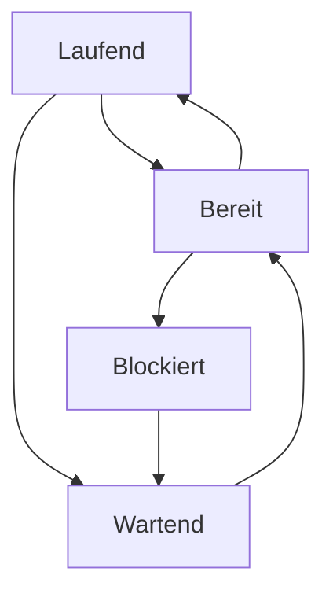
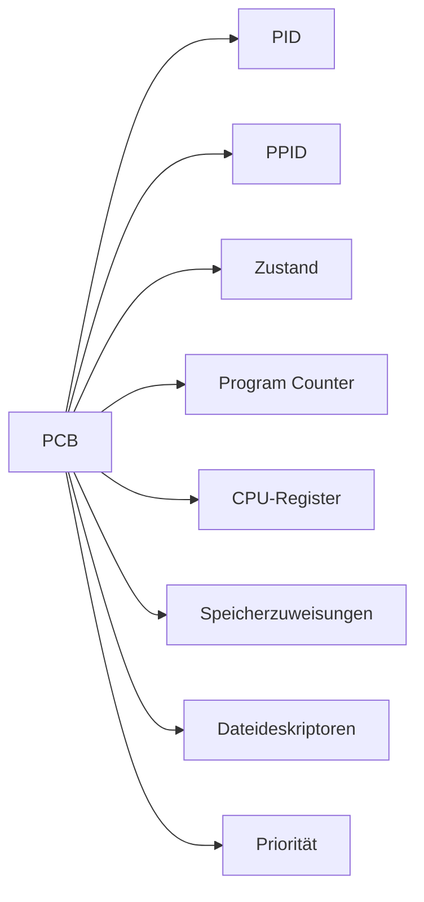

---
tags:
  - 5semester
  - Sysprak
  - informatik
fach: "[[Systempraktikum]]"
Thema:
Benötigte Zeit:
date created: Monday, 21. October 2024, 16:48
date modified: Thursday, 31. October 2024, 12:30
---

# Systempraktikum C - Prozesse und Inter-Prozess-Kommunikation

## Einführung

In diesem Leitfaden werden grundlegende Konzepte zu Prozessen in C, deren Verwaltung sowie Methoden der Inter-Prozess-Kommunikation (IPC) behandelt. Ziel ist es, ein klares Verständnis für die Funktionsweise von Prozessen, deren Hierarchie und die verschiedenen Kommunikationsmethoden zu vermitteln. Dies ist essenziell für die Entwicklung effizienter und stabiler Anwendungen in C.

---

## Prozess und Prozessbaum

### Was ist ein Prozess?

Ein **Prozess** ist ein laufendes Programm, das vom Betriebssystem verwaltet wird. Jeder Prozess erhält eine eindeutige Prozess-ID (PID) und besitzt einen eigenen Adressraum sowie Ressourcen wie Speicher und Dateideskriptoren. Prozesse sind die Grundbausteine für die Ausführung von Programmen und bilden die Grundlage für Multitasking in modernen Betriebssystemen.

#### Wichtige Eigenschaften eines Prozesses:

- **Eindeutige PID**: Jeder Prozess wird durch eine eindeutige Prozess-ID identifiziert.
- **Adressraum**: Jeder Prozess hat seinen eigenen virtuellen Speicherbereich, der von anderen Prozessen isoliert ist.
- **Ressourcen**: Prozesse verwalten Ressourcen wie Dateien, Netzwerkverbindungen und Hardwarezugriffe.
- **Status**: Prozesse können unterschiedliche Zustände haben, z.B. laufend, wartend oder blockiert.

### Prozessbaum

Prozesse sind in einer hierarchischen Struktur organisiert, die als **Prozessbaum** bezeichnet wird. Diese Struktur verdeutlicht die Beziehungen zwischen Eltern- und Kind-Prozessen.

- **Wurzelprozess**: Der erste Prozess beim Hochfahren des Systems, häufig der `init`-Prozess (in modernen Systemen oft `systemd`), ist der Stamm des Prozessbaums.
- **Eltern-Prozesse und Kind-Prozesse**: Jeder Prozess (außer dem Wurzelprozess) hat einen Eltern-Prozess. Durch die Verwendung der `fork()`-Funktion können Eltern-Prozesse neue Kind-Prozesse erstellen. Diese Hierarchie ermöglicht eine strukturierte Verwaltung und Nachverfolgung von Prozessen.

#### Beispiel:

Stellen Sie sich vor, der `init`-Prozess startet einen Webserver. Dieser Webserver kann weitere Prozesse für jede eingehende Verbindung erstellen. Diese Struktur ermöglicht es dem Betriebssystem, die Ressourcen effizient zu verwalten und den Überblick über die laufenden Prozesse zu behalten.

### Zombies und Verwaiste Prozesse

- **Zombie-Prozesse**: Wenn ein Kind-Prozess beendet wird, bleibt ein Zombie-Prozess zurück, bis der Eltern-Prozess seine Beendigung mit `wait()` abfragt. Ein Zombie-Prozess hält Informationen über den beendeten Prozess bereit, damit der Eltern-Prozess dessen Beendigung korrekt registrieren kann.
- **Verwaiste Prozesse**: Wenn der Eltern-Prozess vor dem Kind-Prozess beendet wird, übernimmt der `init`-Prozess (oder ein anderer festgelegter Ersatzprozess) die Elternschaft, wodurch der Kind-Prozess verwaist wird. Der verwaiste Prozess wird dann von `init` verwaltet, um sicherzustellen, dass seine Ressourcen freigegeben werden.

#### Warum sind Zombies und verwaiste Prozesse problematisch?

- **Ressourcenverschwendung**: Zombies behalten Informationen im System, was langfristig zu Ressourcenlecks führen kann.
- **Systemstabilität**: Viele Zombies können das System destabilisieren, indem sie die Prozess-Tabelle füllen.

---

## Eigenschaften von Prozessen

### Zustände eines Prozesses

Prozesse durchlaufen verschiedene Zustände während ihrer Lebensdauer:

- **Laufend (Running)**: Der Prozess wird aktuell vom CPU ausgeführt.
- **Bereit (Ready)**: Der Prozess wartet darauf, vom CPU ausgeführt zu werden.
- **Wartend (Waiting)**: Der Prozess wartet auf ein Ereignis oder eine Ressource (z.B. I/O).
- **Blockiert (Blocked)**: Der Prozess kann nicht fortfahren, bis eine bestimmte Bedingung erfüllt ist.

#### Diagramm der Prozesszustände:



### Nebenläufigkeit

Prozesse können auf zwei Arten ausgeführt werden:

- **Parallel**: Prozesse laufen wirklich gleichzeitig ab, was in Mehrkernprozessoren möglich ist.
- **Nebenläufig (Concurrency)**: Prozesse werden schnell nacheinander ausgeführt, sodass es so erscheint, als würden sie gleichzeitig laufen. Dies wird durch Zeitmultiplexing erreicht, bei dem die CPU zwischen den Prozessen wechselt.

#### Beispiel:

Stellen Sie sich vor, zwei Studenten arbeiten gleichzeitig an unterschiedlichen Aufgaben an ihrem Computer. Auf einem Single-Core-Prozessor wird die CPU schnell zwischen den Aufgaben wechseln, sodass beide Studenten ihre Aufgaben parallel erledigen können, obwohl tatsächlich nur eine Aufgabe zur Zeit ausgeführt wird.

---

## Ressourcenverwaltung

Prozesse verwalten verschiedene Ressourcen wie:

- **Speicher**: Jeder Prozess hat einen eigenen virtuellen Speicherbereich.
- **Rechenzeit**: Die CPU-Zeit wird den laufenden Prozessen zugewiesen.
- **Dateideskriptoren**: Ressourcen, die den Zugriff auf Dateien und andere I/O-Streams ermöglichen.

Eine effiziente Ressourcenverwaltung ist entscheidend, um Konflikte und Engpässe zu vermeiden. Das Betriebssystem überwacht und steuert den Zugriff auf diese Ressourcen, um sicherzustellen, dass alle Prozesse fair behandelt werden und keine Ressource monopolisiert wird.

---

## Prozesskontrollblock (PCB)

Der **Prozesskontrollblock (PCB)** ist eine Datenstruktur, die vom Betriebssystem verwendet wird, um alle relevanten Informationen über einen Prozess zu speichern. Der PCB ermöglicht es dem Betriebssystem, den Zustand jedes Prozesses zu überwachen und zu verwalten.

### Inhalt eines PCB:

- **Prozess-ID (PID)**: Eindeutige Kennung des Prozesses.
- **Eltern-Prozess-ID (PPID)**: PID des Eltern-Prozesses.
- **Zustand des Prozesses**: Aktueller Status (laufend, bereit, wartend, etc.).
- **Program Counter (PC)**: Adresse der nächsten auszuführenden Instruktion.
- **CPU-Register**: Inhalt der CPU-Register für den Prozess.
- **Speicherzuweisungen**: Informationen über den zugewiesenen Speicherbereich.
- **Dateideskriptoren**: Offene Dateien und I/O-Streams.
- **Priorität**: Prioritätsstufe des Prozesses.

### Visualisierung eines PCB:



---

## Prozess-Erzeugung mit `fork()`

### Fork-Funktion

Die `fork()`-Funktion wird verwendet, um einen neuen Prozess zu erstellen. Dieser neue Prozess wird als **Kind-Prozess** bezeichnet und ist eine exakte Kopie des **Eltern-Prozesses**, der die `fork()`-Funktion aufruft.

#### Funktionsweise:

- **Eltern-Prozess**: Der ursprüngliche Prozess, der `fork()` aufruft.
- **Kind-Prozess**: Der neue Prozess, der eine Kopie des Eltern-Prozesses ist.

#### Rückgabewerte:

- **Im Eltern-Prozess**: Die PID des Kind-Prozesses.
- **Im Kind-Prozess**: `0`.
- **Fehlerfall**: `-1` (wenn der Fork fehlschlägt).

#### Beispiel:

```c
#include <stdio.h>
#include <unistd.h>

int main() {
    pid_t pid = fork();

    if (pid < 0) {
        // Fehler beim Fork
        perror("fork");
        return 1;
    } else if (pid == 0) {
        // Kind-Prozess
        printf("Dies ist der Kind-Prozess. PID: %d\n", getpid());
    } else {
        // Eltern-Prozess
        printf("Dies ist der Eltern-Prozess. Kind PID: %d\n", pid);
    }

    return 0;
}
```

#### Erklärung:

- **Fehlerbehandlung**: Wenn `fork()` einen Wert kleiner als `0` zurückgibt, ist ein Fehler aufgetreten.
- **Kind-Prozess**: Wenn `fork()` `0` zurückgibt, handelt es sich um den Kind-Prozess.
- **Eltern-Prozess**: Andernfalls gibt `fork()` die PID des Kind-Prozesses zurück.

### Wait-Funktion

Der Eltern-Prozess kann mit der `wait()`-Funktion auf die Beendigung des Kind-Prozesses warten. Dies ist wichtig, um Zombie-Prozesse zu vermeiden.

#### Beispiel:

```c
#include <stdio.h>
#include <unistd.h>
#include <sys/wait.h>

int main() {
    pid_t pid = fork();

    if (pid < 0) {
        perror("fork");
        return 1;
    } else if (pid == 0) {
        // Kind-Prozess
        printf("Kind-Prozess läuft. PID: %d\n", getpid());
        sleep(2); // Simuliert eine laufende Aufgabe
        printf("Kind-Prozess beendet.\n");
        return 0;
    } else {
        // Eltern-Prozess
        printf("Eltern-Prozess wartet auf Kind-Prozess. PID: %d\n", pid);
        wait(NULL); // Warten auf Beendigung des Kind-Prozesses
        printf("Kind-Prozess wurde beendet.\n");
    }

    return 0;
}
```

#### Erklärung:

- **Warten auf das Kind**: Der Eltern-Prozess ruft `wait(NULL)` auf, um auf die Beendigung des Kind-Prozesses zu warten.
- **Vermeidung von Zombies**: Durch das Warten auf das Kind wird dessen PCB freigegeben, wodurch Zombies vermieden werden.

---

## Ersetzen von Prozessen mit `exec()`

Die `exec()`-Familie von Funktionen ersetzt den aktuellen Prozess durch ein neues Programm. Dies ist nützlich, um ein bestehendes Programm zu starten, ohne einen neuen Prozess mit `fork()` zu erstellen.

### Funktionsweise:

- Nach einem erfolgreichen Aufruf von `exec()` wird der aktuelle Prozess durch das neue Programm ersetzt. Der Code nach `exec()` wird nicht mehr ausgeführt, es sei denn, `exec()` schlägt fehl.

### Beispiel:

```c
#include <stdio.h>
#include <unistd.h>

int main() {
    printf("Vor exec.\n");
    execlp("/bin/ls", "ls", "-l", NULL);
    // Wenn exec erfolgreich ist, wird dieser Code nicht mehr ausgeführt
    perror("execlp");
    return 1;
}
```

#### Erklärung:

- **Vor `exec()`**: Der Eltern-Prozess druckt "Vor exec.".
- **`execlp()` Aufruf**: Ersetzt das aktuelle Programm durch das `ls`-Programm mit dem Argument `-l`.
- **Nach `exec()`**: Wenn `exec()` erfolgreich ist, wird der nachfolgende Code nicht ausgeführt. Bei einem Fehler wird eine Fehlermeldung ausgegeben.

---

## Inter-Prozess-Kommunikation (IPC)

Die Inter-Prozess-Kommunikation ermöglicht es Prozessen, Daten und Informationen auszutauschen. Es gibt verschiedene Methoden der IPC, die jeweils für unterschiedliche Anwendungsfälle geeignet sind.

### Überblick über IPC-Methoden:

- **Pipes**
- **Shared Memory**
- **Semaphoren**
- **Nachrichtenwarteschlangen**
- **Sockets**

In diesem Leitfaden konzentrieren wir uns auf Pipes, Shared Memory und Semaphoren, da diese am häufigsten verwendet werden.

---

### Pipes

Pipes sind eine einfache Methode zur Kommunikation zwischen verwandten Prozessen, meist zwischen einem Eltern- und einem Kind-Prozess. Sie ermöglichen das Senden von Daten in eine Richtung (einseitig).

#### Arten von Pipes:

- **Unnamed Pipes (unnamen Pipes)**: Werden durch den Aufruf von `pipe()` erstellt und sind nur zwischen verwandten Prozessen nutzbar.
- **Named Pipes (benannte Pipes)**: Werden durch den Aufruf von `mkfifo()` erstellt und können von nicht verwandten Prozessen verwendet werden.

#### Unnamed Pipe Beispiel:

```c
#include <stdio.h>
#include <unistd.h>
#include <string.h>

int main() {
    int fd[2];
    if (pipe(fd) == -1) {
        perror("pipe");
        return 1;
    }

    pid_t pid = fork();

    if (pid < 0) {
        perror("fork");
        return 1;
    } else if (pid == 0) {
        // Kind-Prozess: schreibt in die Pipe
        close(fd[0]); // Leseende schließen
        char msg[] = "Hallo vom Kind!";
        write(fd[1], msg, strlen(msg) + 1);
        close(fd[1]);
    } else {
        // Eltern-Prozess: liest aus der Pipe
        close(fd[1]); // Schreibende schließen
        char buffer[100];
        read(fd[0], buffer, sizeof(buffer));
        printf("Eltern-Prozess erhielt: %s\n", buffer);
        close(fd[0]);
    }

    return 0;
}
```

#### Erklärung:

- **Pipe erstellen**: `pipe(fd)` erstellt eine Pipe und gibt zwei Dateideskriptoren zurück: `fd[0]` für das Lesen und `fd[1]` für das Schreiben.
- **Prozessaufteilung**: Durch `fork()` entstehen ein Eltern- und ein Kind-Prozess.
- **Kind-Prozess**: Schließt das Leseende (`fd[0]`), schreibt eine Nachricht in die Pipe und schließt dann das Schreibende (`fd[1]`).
- **Eltern-Prozess**: Schließt das Schreibende (`fd[1]`), liest die Nachricht aus der Pipe und schließt dann das Leseende (`fd[0]`).

### Named Pipe Beispiel:

```c
#include <stdio.h>
#include <stdlib.h>
#include <unistd.h>
#include <sys/stat.h>
#include <fcntl.h>
#include <string.h>

int main() {
    const char *fifo = "/tmp/myfifo";

    // Named Pipe erstellen
    mkfifo(fifo, 0666);

    pid_t pid = fork();

    if (pid < 0) {
        perror("fork");
        return 1;
    } else if (pid == 0) {
        // Kind-Prozess: schreibt in die benannte Pipe
        int fd = open(fifo, O_WRONLY);
        char msg[] = "Hallo über benannte Pipe!";
        write(fd, msg, strlen(msg) + 1);
        close(fd);
    } else {
        // Eltern-Prozess: liest aus der benannten Pipe
        int fd = open(fifo, O_RDONLY);
        char buffer[100];
        read(fd, buffer, sizeof(buffer));
        printf("Eltern-Prozess erhielt: %s\n", buffer);
        close(fd);
        unlink(fifo); // Pipe löschen
    }

    return 0;
}
```

#### Erklärung:

- **Named Pipe erstellen**: `mkfifo()` erstellt eine benannte Pipe unter `/tmp/myfifo`.
- **Prozessaufteilung**: Durch `fork()` entstehen ein Eltern- und ein Kind-Prozess.
- **Kind-Prozess**: Öffnet die Pipe zum Schreiben, sendet eine Nachricht und schließt die Pipe.
- **Eltern-Prozess**: Öffnet die Pipe zum Lesen, empfängt die Nachricht, druckt sie und löscht die Pipe mit `unlink()`.

---

### Shared Memory

Shared Memory ermöglicht mehreren Prozessen den direkten Zugriff auf denselben Speicherbereich, was eine schnelle Kommunikation ohne Kopieren von Daten ermöglicht. Diese Methode ist effizient, erfordert jedoch Synchronisationsmechanismen, um Datenkonsistenz zu gewährleisten.

#### Beispiel:

```c
#include <stdio.h>
#include <stdlib.h>
#include <sys/shm.h>
#include <sys/stat.h>
#include <string.h>
#include <unistd.h>

int main() {
    // Shared Memory erstellen
    int segment_id = shmget(IPC_PRIVATE, 4096, S_IRUSR | S_IWUSR);
    if (segment_id < 0) {
        perror("shmget");
        return 1;
    }

    // Shared Memory anhängen
    char *shared_memory = (char *)shmat(segment_id, NULL, 0);
    if (shared_memory == (char *) -1) {
        perror("shmat");
        return 1;
    }

    pid_t pid = fork();

    if (pid < 0) {
        perror("fork");
        return 1;
    } else if (pid == 0) {
        // Kind-Prozess schreibt in den Shared Memory
        strcpy(shared_memory, "Nachricht vom Kind.");
        shmdt(shared_memory); // Shared Memory trennen
    } else {
        // Eltern-Prozess liest aus dem Shared Memory
        sleep(1); // Sicherstellen, dass das Kind schreibt
        printf("Eltern-Prozess liest: %s\n", shared_memory);
        shmdt(shared_memory); // Shared Memory trennen
        shmctl(segment_id, IPC_RMID, NULL); // Shared Memory löschen
    }

    return 0;
}
```

#### Erklärung:

- **Shared Memory erstellen**: `shmget()` erstellt einen Shared Memory-Bereich mit einer Größe von 4096 Bytes und gibt eine Segment-ID zurück.
- **Shared Memory anhängen**: `shmat()` verbindet den Shared Memory mit dem Adressraum des Prozesses.
- **Prozessaufteilung**: Durch `fork()` entstehen ein Eltern- und ein Kind-Prozess.
- **Kind-Prozess**: Schreibt eine Nachricht in den Shared Memory und trennt die Verbindung.
- **Eltern-Prozess**: Wartet kurz, liest die Nachricht aus dem Shared Memory, trennt die Verbindung und löscht den Shared Memory mit `shmctl()`.

#### Vorteile von Shared Memory:

- **Geschwindigkeit**: Direkter Zugriff auf den Speicher ist schneller als andere IPC-Methoden.
- **Effizienz**: Keine Notwendigkeit zum Kopieren von Daten zwischen Prozessen.

#### Nachteile:

- **Synchronisation erforderlich**: Prozesse müssen sicherstellen, dass sie nicht gleichzeitig auf den Shared Memory zugreifen, um Datenkorruption zu vermeiden.

---

### Semaphoren

Semaphoren sind Synchronisationsmechanismen, die dazu verwendet werden, den Zugriff auf gemeinsame Ressourcen zu steuern und Race Conditions zu vermeiden. Sie können als Zähler betrachtet werden, die anzeigen, wie viele Prozesse gleichzeitig auf eine Ressource zugreifen dürfen.

#### Arten von Semaphoren:

- **Binäre Semaphoren**: Haben nur zwei Zustände (0 und 1) und werden oft zur gegenseitigen Ausschließung (Mutex) verwendet.
- **Zählende Semaphoren**: Können Werte größer als 1 annehmen und werden verwendet, um den Zugriff auf eine begrenzte Anzahl von Ressourcen zu steuern.

#### Beispiel mit zählenden Semaphoren:

```c
#include <stdio.h>
#include <stdlib.h>
#include <semaphore.h>
#include <pthread.h>
#include <unistd.h>

sem_t semaphore;

void* thread_func(void* arg) {
    sem_wait(&semaphore); // Semaphore warten (down)
    // Kritischer Bereich
    printf("Thread %ld betritt den kritischen Bereich.\n", (long)arg);
    sleep(1); // Simuliert eine Aufgabe
    printf("Thread %ld verlässt den kritischen Bereich.\n", (long)arg);
    sem_post(&semaphore); // Semaphore freigeben (up)
    return NULL;
}

int main() {
    pthread_t t1, t2, t3;
    sem_init(&semaphore, 0, 2); // Initialwert 2: Maximal zwei Threads im kritischen Bereich

    pthread_create(&t1, NULL, thread_func, (void*)1);
    pthread_create(&t2, NULL, thread_func, (void*)2);
    pthread_create(&t3, NULL, thread_func, (void*)3);

    pthread_join(t1, NULL);
    pthread_join(t2, NULL);
    pthread_join(t3, NULL);

    sem_destroy(&semaphore);
    return 0;
}
```

#### Erklärung:

- **Semaphore initialisieren**: `sem_init(&semaphore, 0, 2)` initialisiert das Semaphore mit einem Wert von 2, was bedeutet, dass maximal zwei Threads gleichzeitig in den kritischen Bereich eintreten dürfen.
- **Warten auf Semaphore**: `sem_wait(&semaphore)` verringert den Semaphore-Wert und blockiert den Thread, wenn der Wert `0` ist.
- **Freigeben der Semaphore**: `sem_post(&semaphore)` erhöht den Semaphore-Wert und ermöglicht anderen wartenden Threads den Eintritt.
- **Kritischer Bereich**: Der Bereich, in dem Threads auf gemeinsame Ressourcen zugreifen. Die Semaphore stellt sicher, dass nicht mehr als zwei Threads gleichzeitig darauf zugreifen.

#### Anwendung:

Semaphoren werden häufig verwendet, um den gleichzeitigen Zugriff auf Ressourcen wie Datenbanken, Drucker oder Speicherbereiche zu steuern.

---

## Signale und Signalhandler

Signale sind eine Form der asynchronen Kommunikation zwischen Prozessen, um Ereignisse wie Interrupts oder spezielle Benachrichtigungen zu signalisieren. Sie ermöglichen es einem Prozess, auf bestimmte Ereignisse zu reagieren, ohne dass diese Ereignisse explizit vom Prozess abgefragt werden müssen.

### Grundlagen:

- **Signalarten**: Verschiedene Signale haben unterschiedliche Bedeutungen, z.B. `SIGINT` (Interrupt, oft durch Strg+C ausgelöst), `SIGTERM` (Beendigung), `SIGKILL` (unmittelbare Beendigung).
- **Signalhandler**: Funktionen, die definiert werden, um auf bestimmte Signale zu reagieren.

### Beispiel: Einfacher Signalhandler

```c
#include <stdio.h>
#include <stdlib.h>
#include <signal.h>
#include <unistd.h>

// Signalhandler-Funktion
void handler(int signum) {
    printf("Signal %d empfangen.\n", signum);
}

int main() {
    // Signalhandler für SIGINT setzen (z.B. Strg+C)
    signal(SIGINT, handler);

    printf("Programm läuft. Drücken Sie Strg+C, um ein Signal zu senden.\n");

    while (1) {
        sleep(1); // Endlosschleife
    }

    return 0;
}
```

#### Erklärung:

- **`signal(SIGINT, handler)`**: Setzt die Funktion `handler` als Signalhandler für das Signal `SIGINT`.
- **Endlosschleife**: Das Programm wartet in einer Endlosschleife und reagiert auf `SIGINT`.
- **Signalhandler**: Wenn das Signal empfangen wird (z.B. durch Drücken von Strg+C), wird die `handler`-Funktion aufgerufen, die eine Meldung ausgibt.

### Anwendung von Signalen:

- **Beenden von Prozessen**: Ein Prozess kann durch Signale wie `SIGTERM` oder `SIGKILL` beendet werden.
- **Zwischenprozess-Kommunikation**: Prozesse können Signale verwenden, um Ereignisse zu signalisieren, z.B. dass eine Datei fertig geschrieben wurde.
- **Fehlerbehandlung**: Signale können verwendet werden, um auf unerwartete Ereignisse wie Segmentation Faults (`SIGSEGV`) zu reagieren.

#### Wichtige Funktionen:

- **`signal()`**: Setzt einen Signalhandler für ein bestimmtes Signal.
- **`kill()`**: Sendet ein Signal an einen Prozess.
- **`raise()`**: Sendet ein Signal an den eigenen Prozess.

### Beispiel: Signalhandler zur Beendigung

```c
#include <stdio.h>
#include <stdlib.h>
#include <signal.h>
#include <unistd.h>

// Signalhandler zur sauberen Beendigung
void cleanup(int signum) {
    printf("Empfangenes Signal %d. Sauberes Beenden...\n", signum);
    // Ressourcen freigeben, Dateien schließen etc.
    exit(0);
}

int main() {
    // Signalhandler für SIGINT und SIGTERM setzen
    signal(SIGINT, cleanup);
    signal(SIGTERM, cleanup);

    printf("Programm läuft. Senden Sie SIGINT oder SIGTERM, um es zu beenden.\n");

    while (1) {
        sleep(1);
    }

    return 0;
}
```

#### Erklärung:

- **Sauberes Beenden**: Der `cleanup`-Handler führt notwendige Aufräumarbeiten durch, bevor das Programm beendet wird.
- **Mehrere Signale**: Der Handler wird für mehrere Signale registriert (`SIGINT` und `SIGTERM`), um auf verschiedene Beendigungsanforderungen zu reagieren.

---

## Sockets

Sockets ermöglichen die Kommunikation zwischen Prozessen über Netzwerke hinweg. Sie sind die Grundlage für Netzwerkprotokolle wie TCP/IP und ermöglichen die Erstellung von Client-Server-Anwendungen.

### Arten von Sockets:

- **Stream-Sockets (TCP)**: Bieten eine zuverlässige, verbindungsorientierte Kommunikation.
- **Datagram-Sockets (UDP)**: Bieten eine unzuverlässige, verbindungslose Kommunikation.
- **Raw-Sockets**: Ermöglichen den Zugriff auf niedrigere Netzwerkebenen, werden selten verwendet und erfordern erhöhte Berechtigungen.

### TCP-Server Beispiel

Ein TCP-Server wartet auf eingehende Verbindungen von Clients und kommuniziert mit ihnen.

```c
#include <stdio.h>
#include <stdlib.h>
#include <string.h>
#include <unistd.h>
#include <arpa/inet.h>

int main() {
    int server_fd, new_socket;
    struct sockaddr_in address;
    int addrlen = sizeof(address);
    char buffer[1024] = {0};
    char *hello = "Hallo vom Server";

    // Socket erstellen
    if ((server_fd = socket(AF_INET, SOCK_STREAM, 0)) == 0) {
        perror("socket fehlgeschlagen");
        exit(EXIT_FAILURE);
    }

    // Adresse konfigurieren
    address.sin_family = AF_INET;
    address.sin_addr.s_addr = INADDR_ANY; // Alle verfügbaren Schnittstellen
    address.sin_port = htons(8080); // Portnummer

    // Socket binden
    if (bind(server_fd, (struct sockaddr *)&address, sizeof(address)) < 0) {
        perror("bind fehlgeschlagen");
        close(server_fd);
        exit(EXIT_FAILURE);
    }

    // Lauschen auf eingehende Verbindungen
    if (listen(server_fd, 3) < 0) {
        perror("listen fehlgeschlagen");
        close(server_fd);
        exit(EXIT_FAILURE);
    }

    printf("Server wartet auf Verbindungen...\n");

    // Akzeptieren einer Verbindung
    if ((new_socket = accept(server_fd, (struct sockaddr *)&address, (socklen_t*)&addrlen)) < 0) {
        perror("accept fehlgeschlagen");
        close(server_fd);
        exit(EXIT_FAILURE);
    }

    // Daten senden
    send(new_socket, hello, strlen(hello), 0);
    printf("Hallo-Nachricht gesendet.\n");
    close(new_socket);
    close(server_fd);
    return 0;
}
```

#### Erklärung:

- **Socket erstellen**: `socket(AF_INET, SOCK_STREAM, 0)` erstellt einen TCP-Socket.
- **Adresse konfigurieren**: Die Server-Adresse wird auf alle verfügbaren Schnittstellen (`INADDR_ANY`) und Port `8080` gesetzt.
- **Socket binden**: `bind()` verbindet den Socket mit der angegebenen Adresse und dem Port.
- **Lauschen**: `listen()` setzt den Socket in den Lauschen-Modus und ermöglicht eingehende Verbindungen.
- **Verbindung akzeptieren**: `accept()` akzeptiert eine eingehende Verbindung und gibt einen neuen Socket für die Kommunikation zurück.
- **Daten senden**: `send()` sendet eine Nachricht an den verbundenen Client.

### TCP-Client Beispiel

Ein TCP-Client verbindet sich mit einem TCP-Server und empfängt Daten.

```c
#include <stdio.h>
#include <stdlib.h>
#include <string.h>
#include <unistd.h>
#include <arpa/inet.h>

int main() {
    int sock = 0;
    struct sockaddr_in serv_addr;
    char buffer[1024] = {0};

    // Socket erstellen
    if ((sock = socket(AF_INET, SOCK_STREAM, 0)) < 0) {
        printf("\n Socket creation error \n");
        return -1;
    }

    serv_addr.sin_family = AF_INET;
    serv_addr.sin_port = htons(8080);

    // IP-Adresse konvertieren
    if(inet_pton(AF_INET, "127.0.0.1", &serv_addr.sin_addr)<=0) {
        printf("\nInvalid address/ Address not supported \n");
        return -1;
    }

    // Verbindung herstellen
    if (connect(sock, (struct sockaddr *)&serv_addr, sizeof(serv_addr)) < 0) {
        printf("\nConnection Failed \n");
        return -1;
    }

    // Nachricht empfangen
    read(sock, buffer, 1024);
    printf("Nachricht vom Server: %s\n", buffer);
    close(sock);
    return 0;
}
```

#### Erklärung:

- **Socket erstellen**: `socket(AF_INET, SOCK_STREAM, 0)` erstellt einen TCP-Socket.
- **Adresse konfigurieren**: Die Server-Adresse wird auf `127.0.0.1` (localhost) und Port `8080` gesetzt.
- **IP-Adresse konvertieren**: `inet_pton()` konvertiert die IP-Adresse von Textform in binäre Form.
- **Verbindung herstellen**: `connect()` stellt eine Verbindung zum Server her.
- **Daten empfangen**: `read()` liest die vom Server gesendete Nachricht.
- **Socket schließen**: Der Socket wird nach dem Empfang geschlossen.

#### Erweiterte Nutzung von Sockets:

- **Mehrere Clients**: Ein Server kann mehrere Clients gleichzeitig bedienen, indem er für jede Verbindung einen neuen Prozess oder Thread erstellt.
- **Bidirektionale Kommunikation**: Sockets ermöglichen den Austausch von Daten in beide Richtungen.
- **Protokoll-Implementierung**: Benutzerdefinierte Protokolle können auf Basis von Sockets implementiert werden.

---

## Zusammenfassung

In diesem Leitfaden wurden die grundlegenden Konzepte von Prozessen in C, deren Verwaltung und die verschiedenen Methoden der Inter-Prozess-Kommunikation erläutert. Durch die bereitgestellten Beispiele können Sie diese Konzepte praktisch anwenden und besser verstehen.

### Wichtige Punkte:

- **Prozesse** sind laufende Programme, die vom Betriebssystem verwaltet werden.
- **Fork()** erzeugt einen neuen Kind-Prozess.
- **Exec()** ersetzt den aktuellen Prozess durch ein neues Programm.
- **Pipes, Shared Memory und Semaphoren** sind Methoden der Inter-Prozess-Kommunikation.
- **Signale** ermöglichen die asynchrone Kommunikation zwischen Prozessen.
- **Sockets** ermöglichen die Kommunikation über Netzwerke hinweg.

### Weiterführende Ressourcen:

- **Man-Pages**: Nutzen Sie die Man-Pages (`man fork`, `man exec`, `man pipe`, etc.), um detaillierte Informationen zu den Funktionen zu erhalten.
- **Übungen**: Implementieren Sie die Beispiele selbst und experimentieren Sie mit verschiedenen Szenarien, um ein tieferes Verständnis zu entwickeln.
- **Bücher und Online-Kurse**: Vertiefen Sie Ihr Wissen mit weiterführender Literatur und Kursen zum Thema Betriebssysteme und Systemprogrammierung in C.

### Tipps für das Lernen:

1. **Praktische Anwendung**: Schreiben Sie eigene Programme, die Prozesse erstellen, kommunizieren und synchronisieren.
2. **Debugging**: Nutzen Sie Debugging-Tools wie `gdb`, um die Ausführung Ihrer Programme zu verfolgen und den Zustand von Prozessen zu verstehen.
3. **Projekterfahrung**: Arbeiten Sie an kleinen Projekten, die mehrere IPC-Methoden kombinieren, um ein umfassendes Verständnis zu entwickeln.
4. **Diskussion und Austausch**: Tauschen Sie sich mit Kommilitonen und Dozenten aus, um Unklarheiten zu beseitigen und von anderen zu lernen.

Viel Erfolg beim Lernen und Anwenden dieser wichtigen Konzepte in Ihrem Systempraktikum C!

---

## Beispielaufgaben

### Aufgabe 1: Prozessbaum Visualisieren

Erstellen Sie ein Programm, das einen Prozessbaum mit mehreren Kind-Prozessen darstellt. Jeder Kind-Prozess sollte eine eindeutige Nachricht ausgeben und dann beendet werden.

#### Lösungshinweise:

- Verwenden Sie `fork()`, um mehrere Kind-Prozesse zu erstellen.
- Jeder Kind-Prozess gibt eine Nachricht mit seiner PID aus.
- Der Eltern-Prozess wartet auf alle Kind-Prozesse mit `wait()`.

### Aufgabe 2: Kommunikation über Pipes

Schreiben Sie ein Programm, bei dem ein Eltern-Prozess eine Liste von Zahlen an einen Kind-Prozess sendet, der die Zahlen quadriert und die Ergebnisse zurück an den Eltern-Prozess sendet.

#### Lösungshinweise:

- Erstellen Sie zwei ungenannte Pipes: eine für die Kommunikation Eltern -> Kind und eine für Kind -> Eltern.
- Der Eltern-Prozess schreibt die Zahlen in die erste Pipe und liest die Ergebnisse aus der zweiten Pipe.
- Der Kind-Prozess liest die Zahlen aus der ersten Pipe, quadriert sie und schreibt die Ergebnisse in die zweite Pipe.

### Aufgabe 3: Shared Memory und Semaphoren

Implementieren Sie ein Programm, bei dem zwei Prozesse über Shared Memory auf einen gemeinsamen Zähler zugreifen. Verwenden Sie Semaphoren, um den Zugriff zu synchronisieren und Race Conditions zu vermeiden.

#### Lösungshinweise:

- Erstellen Sie einen Shared Memory-Bereich für den Zähler.
- Initialisieren Sie ein Semaphore mit `sem_init()`.
- Jeder Prozess erhöht den Zähler mehrere Male und verwendet `sem_wait()` und `sem_post()`, um den Zugriff zu synchronisieren.

---

## Häufig gestellte Fragen (FAQ)

### Was passiert, wenn `fork()` fehlschlägt?

Wenn `fork()` fehlschlägt, gibt es einen negativen Wert zurück und das Programm sollte entsprechend auf den Fehler reagieren, z.B. durch eine Fehlermeldung und das Beenden des Prozesses.

### Wie kann man Zombie-Prozesse vermeiden?

Zombie-Prozesse können vermieden werden, indem der Eltern-Prozess sicherstellt, dass er die Beendigung aller Kind-Prozesse mit `wait()` oder `waitpid()` abfragt.

### Was ist der Unterschied zwischen einem Stream-Socket und einem Datagram-Socket?

- **Stream-Sockets (TCP)** bieten eine zuverlässige, verbindungsorientierte Kommunikation, bei der Daten in der Reihenfolge ankommen, in der sie gesendet wurden.
- **Datagram-Sockets (UDP)** bieten eine unzuverlässige, verbindungslose Kommunikation, bei der Datenpakete unabhängig voneinander gesendet und empfangen werden.

### Wie implementiert man einen sicheren Zugriff auf Shared Memory?

Um einen sicheren Zugriff auf Shared Memory zu gewährleisten, sollten Semaphoren oder Mutexes verwendet werden, um den gleichzeitigen Zugriff mehrerer Prozesse zu synchronisieren und Datenkorruption zu vermeiden.

---

## Glossar

- **Prozess-ID (PID)**: Eindeutige Kennung eines Prozesses im Betriebssystem.
- **Eltern-Prozess (Parent Process)**: Der Prozess, der einen neuen Kind-Prozess erstellt.
- **Kind-Prozess (Child Process)**: Der durch `fork()` erstellte Prozess.
- **Zombie-Prozess**: Ein beendeter Prozess, dessen PCB noch vom Eltern-Prozess abgefragt werden muss.
- **Verwaister Prozess (Orphan Process)**: Ein Kind-Prozess ohne aktiven Eltern-Prozess, der von `init` übernommen wird.
- **Inter-Prozess-Kommunikation (IPC)**: Methoden zur Kommunikation und Synchronisation zwischen Prozessen.
- **Pipe**: Ein IPC-Mechanismus zur Einweg-Kommunikation zwischen verwandten Prozessen.
- **Shared Memory**: Ein IPC-Mechanismus, bei dem mehrere Prozesse auf denselben Speicherbereich zugreifen.
- **Semaphore**: Ein Synchronisationsmechanismus zur Steuerung des Zugriffs auf gemeinsame Ressourcen.
- **Signal**: Eine asynchrone Benachrichtigung an einen Prozess über ein bestimmtes Ereignis.
- **Socket**: Eine Schnittstelle zur Netzwerkkommunikation zwischen Prozessen, auch über verschiedene Maschinen hinweg.

---

## Nützliche Befehle und Funktionen

### Prozessverwaltung

- **`fork()`**: Erstellt einen neuen Prozess.
- **`exec()`**: Ersetzt den aktuellen Prozess durch ein neues Programm.
- **`wait()`**: Wartet auf die Beendigung eines Kind-Prozesses.
- **`getpid()`**: Gibt die PID des aktuellen Prozesses zurück.
- **`getppid()`**: Gibt die PID des Eltern-Prozesses zurück.

### Inter-Prozess-Kommunikation

- **`pipe()`**: Erstellt eine ungenannte Pipe.
- **`mkfifo()`**: Erstellt eine benannte Pipe.
- **`shmget()`**: Erstellt oder erhält einen Shared Memory-Segment.
- **`shmat()`**: Bindet ein Shared Memory-Segment an den Adressraum eines Prozesses.
- **`shmdt()`**: Trennt ein Shared Memory-Segment.
- **`sem_init()`**: Initialisiert ein Semaphore.
- **`sem_wait()`**: Wartet auf ein Semaphore (down).
- **`sem_post()`**: Gibt ein Semaphore frei (up).

### Signalbehandlung

- **`signal()`**: Setzt einen Signalhandler für ein bestimmtes Signal.
- **`kill()`**: Sendet ein Signal an einen Prozess.
- **`raise()`**: Sendet ein Signal an den eigenen Prozess.

### Sockets

- **`socket()`**: Erstellt einen neuen Socket.
- **`bind()`**: Bindet einen Socket an eine Adresse.
- **`listen()`**: Setzt einen Socket in den Lauschen-Modus.
- **`accept()`**: Akzeptiert eine eingehende Verbindung auf einem Socket.
- **`connect()`**: Stellt eine Verbindung zu einem Server-Socket her.
- **`send()`**: Sendet Daten über einen Socket.
- **`recv()`**: Empfängt Daten von einem Socket.

---

## Praktische Tipps

1. **Verstehen Sie die Hierarchie von Prozessen**: Ein gutes Verständnis des Prozessbaums hilft Ihnen, die Beziehungen zwischen verschiedenen Prozessen besser zu verstehen und effizient zu verwalten.

2. **Nutzen Sie Debugging-Tools**: Werkzeuge wie `gdb` ermöglichen es Ihnen, den Zustand von Prozessen und deren Ressourcen zu überwachen und Fehler zu identifizieren.

3. **Experimentieren Sie mit Beispielen**: Implementieren Sie die bereitgestellten Codebeispiele selbst und passen Sie sie an, um ein tieferes Verständnis der Konzepte zu entwickeln.

4. **Lesen Sie die Dokumentation**: Die Man-Pages (`man <funktion>`) bieten detaillierte Informationen und Beispiele zur Verwendung der verschiedenen Funktionen.

5. **Verwenden Sie Kommentare**: Kommentieren Sie Ihren Code ausführlich, um den Überblick über die Funktionsweise und den Ablauf zu behalten.

6. **Synchronisieren Sie richtig**: Achten Sie bei der Verwendung von Shared Memory und Semaphoren darauf, dass der Zugriff auf gemeinsame Ressourcen korrekt synchronisiert ist, um Datenkorruption zu vermeiden.

7. **Testen Sie auf verschiedenen Systemen**: Unterschiedliche Betriebssysteme können unterschiedliche Implementierungen und Eigenheiten haben. Testen Sie Ihre Programme auf verschiedenen Plattformen, um deren Portabilität zu gewährleisten.

---

## Weiterführende Literatur und Ressourcen

- **Bücher**:

  - "Advanced Programming in the UNIX Environment" von W. Richard Stevens
  - "The Linux Programming Interface" von Michael Kerrisk

- **Online-Ressourcen**:

  - [GNU C Library Documentation](https://www.gnu.org/software/libc/manual/)
  - [Beej's Guide to Network Programming](https://beej.us/guide/bgnet/)

- **Kurse und Tutorials**:
  - [Coursera - Betriebssysteme und Systemprogrammierung](https://www.coursera.org/courses?query=operating%20systems)
  - [edX - Introduction to Computer Networking](https://www.edx.org/course/introduction-to-computer-networking)

---

## Schlusswort

Das Verständnis von Prozessen und Inter-Prozess-Kommunikation ist essenziell für die Entwicklung effizienter und stabiler Anwendungen in C. Durch die praktische Anwendung der vorgestellten Konzepte und die Auseinandersetzung mit den bereitgestellten Beispielen werden Sie in der Lage sein, komplexe Systeme zu entwickeln und die Performance Ihrer Programme zu optimieren.

Bleiben Sie neugierig, üben Sie regelmäßig und scheuen Sie sich nicht, tiefer in die Materie einzutauchen. Viel Erfolg in Ihrem Systempraktikum C!

<!-- DISQUS SCRIPT COMMENT START -->

<!-- DISQUS RECOMMENDATION START -->

<div id="disqus_recommendations"></div>

<script> 
(function() { // REQUIRED CONFIGURATION VARIABLE: EDIT THE SHORTNAME BELOW
var d = document, s = d.createElement('script'); // IMPORTANT: Replace EXAMPLE with your forum shortname!
s.src = 'https://myuninotes.disqus.com/recommendations.js'; s.setAttribute('data-timestamp', +new Date());
(d.head || d.body).appendChild(s);
})();
</script>
<noscript>
Please enable JavaScript to view the 
<a href="https://disqus.com/?ref_noscript" rel="nofollow">
comments powered by Disqus.
</a>
</noscript>

<!-- DISQUS RECOMMENDATION END -->

<hr style="border: none; height: 2px; background: linear-gradient(to right, #f0f0f0, #ccc, #f0f0f0); margin-top: 4rem; margin-bottom: 5rem;">
<div id="disqus_thread"></div>
<script>
    /**
    *  RECOMMENDED CONFIGURATION VARIABLES: EDIT AND UNCOMMENT THE SECTION BELOW TO INSERT DYNAMIC VALUES FROM YOUR PLATFORM OR CMS.
    *  LEARN WHY DEFINING THESE VARIABLES IS IMPORTANT: https://disqus.com/admin/universalcode/#configuration-variables    */
    /*
    var disqus_config = function () {
    this.page.url = PAGE_URL;  // Replace PAGE_URL with your page's canonical URL variable
    this.page.identifier = PAGE_IDENTIFIER; // Replace PAGE_IDENTIFIER with your page's unique identifier variable
    };
    */
    (function() { // DON'T EDIT BELOW THIS LINE
    var d = document, s = d.createElement('script');
    s.src = 'https://myuninotes.disqus.com/embed.js';
    s.setAttribute('data-timestamp', +new Date());
    (d.head || d.body).appendChild(s);
    })();
</script>
<noscript>Please enable JavaScript to view the <a href="https://disqus.com/?ref_noscript">comments powered by Disqus.</a></noscript>

<!-- DISQUS SCRIPT COMMENT END -->
