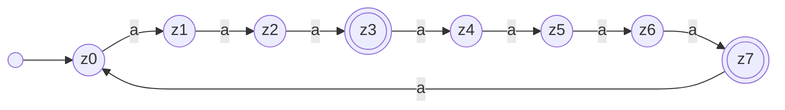
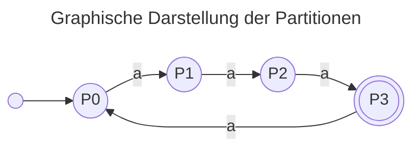

---
tags:
  - 4semester
  - FSK
  - informatik
fach: "[[FSK]]"
Thema: 
Benötigte Zeit:
date created: Wednesday, 1. May 2024, 07:33
date modified: Wednesday, 1. May 2024, 07:37
---

# Kochrezept

>[!tip] Ablauf für die Minimierung von DFAs
>
> 1. **Identifizieren Sie das Alphabet**: Bestätigen Sie das Alphabet $\Sigma$, das der DFA verwendet. Dies definiert die möglichen Eingaben für den Automaten.
> 
> 2. **Erstellen Sie die Zustandstabelle**: Notieren Sie alle Zustände des DFAs und ihre Übergänge für jedes Symbol in $\Sigma$. Dies ist Ihre Ausgangstabelle für den Minimierungsprozess.
> 
> 3. **Initialisieren Sie die Partitionen**: Trennen Sie die Zustände in zwei anfängliche Gruppen - Endzustände und Nicht-Endzustände. Dies sind Ihre ersten Partitionen.
> 
> 4. **Verfeinern Sie die Partitionen**: Untersuchen Sie die Zustände innerhalb jeder Partition. Zustände, die unter einem Eingabesymbol zu unterschiedlichen Partitionen führen, müssen in separate Partitionen aufgeteilt werden. Diesen Prozess wiederholen Sie, bis keine weiteren Verfeinerungen mehr möglich sind.
> 
> 5. **Übertragen Sie die Partitionen in den neuen DFA**: Jede Partition wird zu einem Zustand im neuen, minimierten DFA. Zeichnen Sie die Übergänge zwischen diesen neuen Zuständen basierend auf den Übergängen der ursprünglichen Zustände, die sie repräsentieren.
> 
> 6. **Definieren Sie den Start- und Endzustand**: Bestimmen Sie den Startzustand des minimierten DFA, der dem Startzustand des ursprünglichen DFA entspricht. Alle Partitionen, die Endzustände enthalten, werden zu Endzuständen im neuen DFA.
> 
> 7. **Überprüfen Sie die Vollständigkeit und Korrektheit**: Stellen Sie sicher, dass der neue DFA alle Übergänge korrekt abbildet und jede Eingabe aus $\Sigma$ behandelt wird. Überprüfen Sie, ob der minimierte DFA dieselbe Sprache akzeptiert wie der ursprüngliche DFA.
> 
> 8. **Visualisieren Sie den minimierten DFA**: Erstellen Sie eine grafische Darstellung des neuen DFAs, um die Übersichtlichkeit und das Verständnis zu verbessern.
> 
> 9. **Dokumentieren und überprüfen Sie den Prozess**: Halten Sie die Schritte Ihrer Minimierung fest, insbesondere die Bildung der Partitionen und die Logik der Zustandsvereinigung. Überprüfen Sie den minimierten DFA auf Redundanzen oder mögliche weitere Vereinfachungen.

# [[FSK-ÜB-2#FSK2-2 DFAs und Minimierung (2 Punkte)#b) Minimieren Sie die folgenden DFAs. Verwenden Sie die tabellarische Variante des Algorithmus zur Minimierung von DFAs aus der Vorlesung (nicht die grafische Variante und nicht den Algorithmus von letztem Jahr!). Geben Sie die Partitionstabelle und den minimalen DFA an.|Beispiel FSK-2-2]] 

## b) Minimieren Sie die folgenden DFAs. Verwenden Sie die tabellarische Variante des Algorithmus zur Minimierung von DFAs aus der Vorlesung (nicht die grafische Variante und nicht den Algorithmus von letztem Jahr!). Geben Sie die Partitionstabelle und den minimalen DFA an.

### i) DFA A1 über dem Alphabet $Σ = \{a\}$:

- Endzustände $z_3$ und $z_7$ werden getrennt

$$
z_0 \quad z_1 \quad z_2  \quad z_4 \quad z_5 \quad z_{6}\quad |\quad z_3 \quad z_7
$$ 
- $z_2$ und $z_6$ führen in Klasse 2 bzw. in andere Partition, deswegen teilen wird diese

$$
z_0 \quad z_1  \quad z_4 \quad z_{5}\quad | \quad z_{2} \quad z_{6}\quad |\quad z_3 \quad z_7
$$

- Jetzt führen aber $z_{1}$ und $z_{5}$ auch in andere Partitionen und müssen geteilt werden 

$$
z_0  \quad z_{4}\quad| \quad z_{1} \quad z_{5}\quad | \quad z_{2} \quad z_{6}\quad |\quad z_3 \quad z_7
$$

