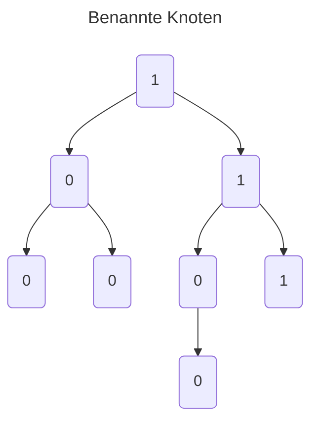
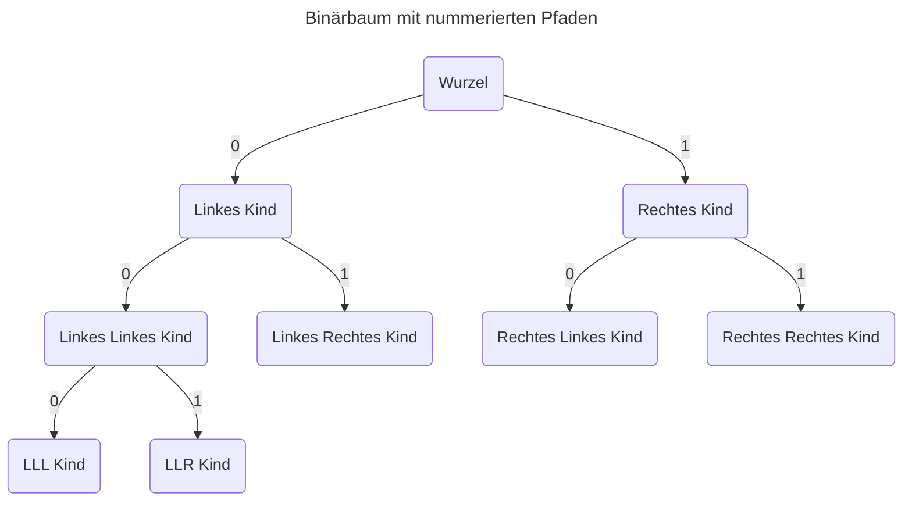
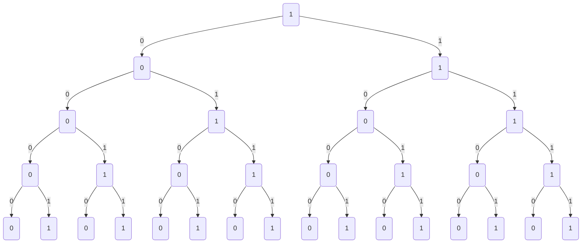

---
tags:
  - RNVS
  - informatik
  - 4semester
  - Übungsblatt
fach: "[[RNVS]]"
Thema:
Benötigte Zeit: 2h 15m (spät nachts geworden)
date created: Friday, 26. April 2024, 21:46
date modified: Monday, 29. April 2024, 10:38
---

# 1. Rechnernetze und verteilte Systeme (H)

> [!note]
> In der Vorlesung haben wir die Begriffe Rechnernetz und verteiltes System kennen gelernt. Ein Rechnernetz ist immer die Voraussetzung für ein verteiltes System.
>
> Ordnen Sie die folgenden Systeme als Rechnernetz oder als verteiltes System ein. Begründen Sie ihre Antwort kurz.
>
> Hinweis: ein System kann – abhängig von der Sichtweise – durchaus sowohl ein Rechnernetz als auch ein verteiltes System sein.

## (a) Das MWN (Münchner Wissenschaftsnetz)

- Rechnernetz:
  - keine gemeinsame Aufgabe
  - unabhängige Endgeräte voneinander

## (b) Ein Messenger wie Signal, Threema oder WhatsApp

- Verteiltes System:
  - gemeinsame Aufgabe: Kommunikation
  - abhängig voneinander: Kommunikationsaustausch

## (c) Das World Wide Web

- Verteiltes System:
  - gemeinsame Aufgabe: Informationsaustausch
  - abhängig voneinander: Informationsaustausch
- Rechnernetz:
  - keine gemeinsame Aufgabe: Internet hat im Grunde keinen "use-case"
  - alle Rechner unabhängig voneinander
    $\Longrightarrow$ Das Internet ist beides

## (d) Der SuperMUC-NG

- Verteiltes System:
  - gemeinsame Aufgabe: Berechnungen
  - abhängig voneinander: Rechenleistung entsteht durch Zusammenarbeit der einzelnen Rechner
- Eventuell auch rechnernetz
  - viele verschiedene verbundene Knoten

## (e) Ihr eigenes Beispiel

- Instagram
  - verteiltes System
    - gemeinsame Aufgabe: Medienaustausch
    - Abhängigkeit alleine, da Medienaustausch nur im kollektiv funktioniert

**Rechnernetz:** Ein Rechnernetz ist eine Sammlung von Computern, Servern, Hauptrechnern oder anderen Geräten, die miteinander verbunden sind, um Ressourcen auszutauschen und Kommunikation zu ermöglichen. Die Verbindungen können über Kabel, Telefonleitungen, Funkwellen, Satelliten oder andere Übertragungsmedien erfolgen. Ein Rechnernetz ermöglicht den Austausch von Daten und Ressourcen zwischen den angeschlossenen Geräten.

**Verteiltes System:** Ein verteiltes System ist eine Gruppe von unabhängigen Computern, die dem Benutzer gegenüber als ein kohärentes System erscheinen. Diese Systeme arbeiten zusammen, um gemeinsame Ziele zu erreichen, und teilen sich dabei Ressourcen oder Aufgaben über ein Netzwerk. Verteilte Systeme sind darauf ausgelegt, Effizienz, Skalierbarkeit und Zuverlässigkeit zu verbessern, indem sie Aufgaben und Ressourcen über mehrere Knoten verteilen, die geografisch getrennt sein können.

# 2. Grundlagen (H)

> [!note]
> Zwei Gelehrte der Antike spielen gerne Schach miteinander. Weil sie nicht in der selben Stadt wohnen,teilen sie einander die Spielzüge über Brieftauben mit. Gegenüber dem Spiel an einem gemeinsamen Spielbrett ergeben sich ähnliche Herausforderungen, wie in verteilten Systemen.

## (a) Nennen Sie fünf Probleme (z. B. plausible Vorfälle, oder Wissenslücken), die einen reibungslosen Spielverlauf stören können! Nennen Sie auch ihre Folge.

- Keine Zustellgarantie $\rightarrow$ Spiel endet nie
- Wegwahl der Taube $\rightarrow$ Verzögerung des Spielverlaufs bei unnötiger langen Routenwahl
- Verfälschung der Daten $\rightarrow$ Jemand ändert, dass was auf dem Zettel steht (Sabotage)
- Aufbau $\rightarrow$ unbekannt wer anfängt bzw. weiße Figuren hat
- Falscher Empfänger $\rightarrow$ Spiel endet nie

## (b) Geben Sie für jeden der Störfälle einen Vorschlag zu seiner Vermeidung an!

- Keine Zustellgarantie $\rightarrow$ Empfangstaube bei Empfang sonst periodische Entsendung einer Spielzugtaube
- Wegwahl der Taube $\rightarrow$ trainierte Taube die nur diesen weg kennt
- Aufbau $\rightarrow$ Person A beginnt immer
- Verfälschung der Daten $\rightarrow$ Verschlüsselung des Spielzuges, damit sie nicht sabotiert werden kann
- Falscher Empfänger $\rightarrow$ Taube fliegt zurück zum Absender mit gleicher Nachricht am Fuss, was darauf hinweist, dass sie den Empfänger nicht erreicht hat

# 3. Von Netzen und Bäumen

> [!note]
> Im letzten Arbeitsblatt haben wir schon einige Berechnungen über die Anzahl an Verbindungen in Netzenangestellt. Hier konzentrieren wir uns weiter auf Bäume als Struktur.
>
> Ein Netz bzw. Graph besteht aus einer Menge von Knoten und Kanten zwischen zwei Knoten. Der Grad eines Knotens ist die Anzahl der Kanten die in ihm enden. Ein Pfad zwischen zwei Knoten ist eine Menge von Kanten und beschreibt einen Weg zwischen zwei Knoten.
>
> Ein Baum ist ein Graph in dem es von jedem Knoten zu jedem Knoten einen Pfad gibt und man keine reise mit den vorhandenen Kanten bilden kann. Die Knoten eines Baumes mit Grad 1 heißen Blatt, alle anderen innere Knoten. Benutzt man Bäume um eine Struktur darzustellen, so wird meistens ein Knoten des Baums als Wurzel bezeichnet. Die Anzahl der Kanten im Pfad von einem Knoten zur Wurzel ist der Abstand des Knotens zur Wurzel. Die Höhe eines Baums ist der größte Abstand. Zwischen den Knoten spricht man von Verwandschaftsbeziehungen: Von den beiden Knoten einer Kante ist der mit dem (um 1) längeren Pfad zur Wurzel ein Nachfahre, Nachfolger oder auch Kind des anderen Knotens.
>
> Der Knoten mit dem kürzeren Abstand heißt Vorfahre, Vorfahrer oder auch Vater.

## (a) Zeichnen Sie einen vollvermaschten Graphen mit 4 Knoten!

<svg xmlns="http://www.w3.org/2000/svg" xmlns:xlink="http://www.w3.org/1999/xlink" version="1.1" width="318px" viewBox="-0.5 -0.5 318 211" content="&lt;mxfile host=&quot;app.diagrams.net&quot; modified=&quot;2024-04-26T21:49:23.604Z&quot; agent=&quot;Mozilla/5.0 (Windows NT 10.0; Win64; x64) AppleWebKit/537.36 (KHTML, like Gecko) Chrome/124.0.0.0 Safari/537.36 Edg/124.0.0.0&quot; etag=&quot;0UWebbyXXqEORPcvkty9&quot; version=&quot;24.3.0&quot; type=&quot;device&quot;&gt;&#10; &lt;diagram name=&quot;Seite-1&quot; id=&quot;7xefCbKZlvEVXV9F9RP8&quot;&gt;&#10; &lt;mxGraphModel dx=&quot;770&quot; dy=&quot;827&quot; grid=&quot;1&quot; gridSize=&quot;10&quot; guides=&quot;1&quot; tooltips=&quot;1&quot; connect=&quot;1&quot; arrows=&quot;1&quot; fold=&quot;1&quot; page=&quot;1&quot; pageScale=&quot;1&quot; pageWidth=&quot;1169&quot; pageHeight=&quot;827&quot; math=&quot;0&quot; shadow=&quot;0&quot;&gt;&#10; &lt;root&gt;&#10; &lt;mxCell id=&quot;0&quot; /&gt;&#10; &lt;mxCell id=&quot;1&quot; parent=&quot;0&quot; /&gt;&#10; &lt;mxCell id=&quot;vohiegmmYF5ZNcTezvNU-1&quot; value=&quot;&quot; style=&quot;ellipse;whiteSpace=wrap;html=1;aspect=fixed;sketch=1;hachureGap=4;jiggle=2;curveFitting=1;fontFamily=Architects Daughter;fontSource=https%3A%2F%2Ffonts.googleapis.com%2Fcss%3Ffamily%3DArchitects%2BDaughter;&quot; vertex=&quot;1&quot; parent=&quot;1&quot;&gt;&#10; &lt;mxGeometry x=&quot;180&quot; y=&quot;390&quot; width=&quot;80&quot; height=&quot;80&quot; as=&quot;geometry&quot; /&gt;&#10; &lt;/mxCell&gt;&#10; &lt;mxCell id=&quot;vohiegmmYF5ZNcTezvNU-2&quot; value=&quot;&quot; style=&quot;ellipse;whiteSpace=wrap;html=1;aspect=fixed;sketch=1;hachureGap=4;jiggle=2;curveFitting=1;fontFamily=Architects Daughter;fontSource=https%3A%2F%2Ffonts.googleapis.com%2Fcss%3Ffamily%3DArchitects%2BDaughter;&quot; vertex=&quot;1&quot; parent=&quot;1&quot;&gt;&#10; &lt;mxGeometry x=&quot;180&quot; y=&quot;260&quot; width=&quot;80&quot; height=&quot;80&quot; as=&quot;geometry&quot; /&gt;&#10; &lt;/mxCell&gt;&#10; &lt;mxCell id=&quot;vohiegmmYF5ZNcTezvNU-3&quot; value=&quot;&quot; style=&quot;ellipse;whiteSpace=wrap;html=1;aspect=fixed;sketch=1;hachureGap=4;jiggle=2;curveFitting=1;fontFamily=Architects Daughter;fontSource=https%3A%2F%2Ffonts.googleapis.com%2Fcss%3Ffamily%3DArchitects%2BDaughter;&quot; vertex=&quot;1&quot; parent=&quot;1&quot;&gt;&#10; &lt;mxGeometry x=&quot;370&quot; y=&quot;260&quot; width=&quot;80&quot; height=&quot;80&quot; as=&quot;geometry&quot; /&gt;&#10; &lt;/mxCell&gt;&#10; &lt;mxCell id=&quot;vohiegmmYF5ZNcTezvNU-4&quot; value=&quot;&quot; style=&quot;ellipse;whiteSpace=wrap;html=1;aspect=fixed;sketch=1;hachureGap=4;jiggle=2;curveFitting=1;fontFamily=Architects Daughter;fontSource=https%3A%2F%2Ffonts.googleapis.com%2Fcss%3Ffamily%3DArchitects%2BDaughter;&quot; vertex=&quot;1&quot; parent=&quot;1&quot;&gt;&#10; &lt;mxGeometry x=&quot;370&quot; y=&quot;390&quot; width=&quot;80&quot; height=&quot;80&quot; as=&quot;geometry&quot; /&gt;&#10; &lt;/mxCell&gt;&#10; &lt;mxCell id=&quot;vohiegmmYF5ZNcTezvNU-6&quot; value=&quot;&quot; style=&quot;endArrow=classic;html=1;rounded=0;sketch=1;hachureGap=4;jiggle=2;curveFitting=1;fontFamily=Architects Daughter;fontSource=https%3A%2F%2Ffonts.googleapis.com%2Fcss%3Ffamily%3DArchitects%2BDaughter;entryX=0;entryY=0.5;entryDx=0;entryDy=0;exitX=1;exitY=0.5;exitDx=0;exitDy=0;&quot; edge=&quot;1&quot; parent=&quot;1&quot; source=&quot;vohiegmmYF5ZNcTezvNU-1&quot; target=&quot;vohiegmmYF5ZNcTezvNU-4&quot;&gt;&#10; &lt;mxGeometry width=&quot;50&quot; height=&quot;50&quot; relative=&quot;1&quot; as=&quot;geometry&quot;&gt;&#10; &lt;mxPoint x=&quot;250&quot; y=&quot;450&quot; as=&quot;sourcePoint&quot; /&gt;&#10; &lt;mxPoint x=&quot;300&quot; y=&quot;400&quot; as=&quot;targetPoint&quot; /&gt;&#10; &lt;/mxGeometry&gt;&#10; &lt;/mxCell&gt;&#10; &lt;mxCell id=&quot;vohiegmmYF5ZNcTezvNU-7&quot; value=&quot;&quot; style=&quot;endArrow=classic;html=1;rounded=0;sketch=1;hachureGap=4;jiggle=2;curveFitting=1;fontFamily=Architects Daughter;fontSource=https%3A%2F%2Ffonts.googleapis.com%2Fcss%3Ffamily%3DArchitects%2BDaughter;entryX=0.5;entryY=1;entryDx=0;entryDy=0;exitX=0.5;exitY=0;exitDx=0;exitDy=0;&quot; edge=&quot;1&quot; parent=&quot;1&quot; source=&quot;vohiegmmYF5ZNcTezvNU-1&quot; target=&quot;vohiegmmYF5ZNcTezvNU-2&quot;&gt;&#10; &lt;mxGeometry width=&quot;50&quot; height=&quot;50&quot; relative=&quot;1&quot; as=&quot;geometry&quot;&gt;&#10; &lt;mxPoint x=&quot;220&quot; y=&quot;389&quot; as=&quot;sourcePoint&quot; /&gt;&#10; &lt;mxPoint x=&quot;330&quot; y=&quot;389&quot; as=&quot;targetPoint&quot; /&gt;&#10; &lt;/mxGeometry&gt;&#10; &lt;/mxCell&gt;&#10; &lt;mxCell id=&quot;vohiegmmYF5ZNcTezvNU-8&quot; value=&quot;&quot; style=&quot;endArrow=classic;html=1;rounded=0;sketch=1;hachureGap=4;jiggle=2;curveFitting=1;fontFamily=Architects Daughter;fontSource=https%3A%2F%2Ffonts.googleapis.com%2Fcss%3Ffamily%3DArchitects%2BDaughter;entryX=0;entryY=1;entryDx=0;entryDy=0;exitX=1;exitY=0;exitDx=0;exitDy=0;&quot; edge=&quot;1&quot; parent=&quot;1&quot; source=&quot;vohiegmmYF5ZNcTezvNU-1&quot; target=&quot;vohiegmmYF5ZNcTezvNU-3&quot;&gt;&#10; &lt;mxGeometry width=&quot;50&quot; height=&quot;50&quot; relative=&quot;1&quot; as=&quot;geometry&quot;&gt;&#10; &lt;mxPoint x=&quot;250&quot; y=&quot;400&quot; as=&quot;sourcePoint&quot; /&gt;&#10; &lt;mxPoint x=&quot;250&quot; y=&quot;350&quot; as=&quot;targetPoint&quot; /&gt;&#10; &lt;/mxGeometry&gt;&#10; &lt;/mxCell&gt;&#10; &lt;mxCell id=&quot;vohiegmmYF5ZNcTezvNU-9&quot; value=&quot;&quot; style=&quot;endArrow=classic;html=1;rounded=0;sketch=1;hachureGap=4;jiggle=2;curveFitting=1;fontFamily=Architects Daughter;fontSource=https%3A%2F%2Ffonts.googleapis.com%2Fcss%3Ffamily%3DArchitects%2BDaughter;entryX=0;entryY=0.5;entryDx=0;entryDy=0;exitX=1;exitY=0.5;exitDx=0;exitDy=0;fillColor=#f8cecc;strokeColor=#b85450;&quot; edge=&quot;1&quot; parent=&quot;1&quot; source=&quot;vohiegmmYF5ZNcTezvNU-2&quot; target=&quot;vohiegmmYF5ZNcTezvNU-3&quot;&gt;&#10; &lt;mxGeometry width=&quot;50&quot; height=&quot;50&quot; relative=&quot;1&quot; as=&quot;geometry&quot;&gt;&#10; &lt;mxPoint x=&quot;258&quot; y=&quot;304&quot; as=&quot;sourcePoint&quot; /&gt;&#10; &lt;mxPoint x=&quot;392&quot; y=&quot;230&quot; as=&quot;targetPoint&quot; /&gt;&#10; &lt;/mxGeometry&gt;&#10; &lt;/mxCell&gt;&#10; &lt;mxCell id=&quot;vohiegmmYF5ZNcTezvNU-10&quot; value=&quot;&quot; style=&quot;endArrow=classic;html=1;rounded=0;sketch=1;hachureGap=4;jiggle=2;curveFitting=1;fontFamily=Architects Daughter;fontSource=https%3A%2F%2Ffonts.googleapis.com%2Fcss%3Ffamily%3DArchitects%2BDaughter;entryX=0;entryY=0.5;entryDx=0;entryDy=0;exitX=1;exitY=0.5;exitDx=0;exitDy=0;fillColor=#f8cecc;strokeColor=#b85450;&quot; edge=&quot;1&quot; parent=&quot;1&quot; target=&quot;vohiegmmYF5ZNcTezvNU-1&quot;&gt;&#10; &lt;mxGeometry width=&quot;50&quot; height=&quot;50&quot; relative=&quot;1&quot; as=&quot;geometry&quot;&gt;&#10; &lt;mxPoint x=&quot;180&quot; y=&quot;310&quot; as=&quot;sourcePoint&quot; /&gt;&#10; &lt;mxPoint x=&quot;290&quot; y=&quot;310&quot; as=&quot;targetPoint&quot; /&gt;&#10; &lt;Array as=&quot;points&quot;&gt;&#10; &lt;mxPoint x=&quot;140&quot; y=&quot;370&quot; /&gt;&#10; &lt;/Array&gt;&#10; &lt;/mxGeometry&gt;&#10; &lt;/mxCell&gt;&#10; &lt;mxCell id=&quot;vohiegmmYF5ZNcTezvNU-11&quot; value=&quot;&quot; style=&quot;endArrow=classic;html=1;rounded=0;sketch=1;hachureGap=4;jiggle=2;curveFitting=1;fontFamily=Architects Daughter;fontSource=https%3A%2F%2Ffonts.googleapis.com%2Fcss%3Ffamily%3DArchitects%2BDaughter;entryX=0.13;entryY=0.24;entryDx=0;entryDy=0;exitX=1;exitY=0.5;exitDx=0;exitDy=0;fillColor=#f8cecc;strokeColor=#b85450;entryPerimeter=0;&quot; edge=&quot;1&quot; parent=&quot;1&quot; target=&quot;vohiegmmYF5ZNcTezvNU-4&quot;&gt;&#10; &lt;mxGeometry width=&quot;50&quot; height=&quot;50&quot; relative=&quot;1&quot; as=&quot;geometry&quot;&gt;&#10; &lt;mxPoint x=&quot;250&quot; y=&quot;330&quot; as=&quot;sourcePoint&quot; /&gt;&#10; &lt;mxPoint x=&quot;360&quot; y=&quot;330&quot; as=&quot;targetPoint&quot; /&gt;&#10; &lt;/mxGeometry&gt;&#10; &lt;/mxCell&gt;&#10; &lt;mxCell id=&quot;vohiegmmYF5ZNcTezvNU-12&quot; value=&quot;&quot; style=&quot;endArrow=classic;html=1;rounded=0;sketch=1;hachureGap=4;jiggle=2;curveFitting=1;fontFamily=Architects Daughter;fontSource=https%3A%2F%2Ffonts.googleapis.com%2Fcss%3Ffamily%3DArchitects%2BDaughter;entryX=0.5;entryY=0;entryDx=0;entryDy=0;exitX=0.5;exitY=1;exitDx=0;exitDy=0;fillColor=#d5e8d4;strokeColor=#82b366;&quot; edge=&quot;1&quot; parent=&quot;1&quot; source=&quot;vohiegmmYF5ZNcTezvNU-3&quot; target=&quot;vohiegmmYF5ZNcTezvNU-4&quot;&gt;&#10; &lt;mxGeometry width=&quot;50&quot; height=&quot;50&quot; relative=&quot;1&quot; as=&quot;geometry&quot;&gt;&#10; &lt;mxPoint x=&quot;355&quot; y=&quot;360&quot; as=&quot;sourcePoint&quot; /&gt;&#10; &lt;mxPoint x=&quot;465&quot; y=&quot;360&quot; as=&quot;targetPoint&quot; /&gt;&#10; &lt;/mxGeometry&gt;&#10; &lt;/mxCell&gt;&#10; &lt;mxCell id=&quot;vohiegmmYF5ZNcTezvNU-13&quot; value=&quot;&quot; style=&quot;endArrow=classic;html=1;rounded=0;sketch=1;hachureGap=4;jiggle=2;curveFitting=1;fontFamily=Architects Daughter;fontSource=https%3A%2F%2Ffonts.googleapis.com%2Fcss%3Ffamily%3DArchitects%2BDaughter;entryX=0.995;entryY=0.32;entryDx=0;entryDy=0;exitX=0.31;exitY=0.985;exitDx=0;exitDy=0;fillColor=#d5e8d4;strokeColor=#82b366;exitPerimeter=0;entryPerimeter=0;&quot; edge=&quot;1&quot; parent=&quot;1&quot; source=&quot;vohiegmmYF5ZNcTezvNU-3&quot; target=&quot;vohiegmmYF5ZNcTezvNU-1&quot;&gt;&#10; &lt;mxGeometry width=&quot;50&quot; height=&quot;50&quot; relative=&quot;1&quot; as=&quot;geometry&quot;&gt;&#10; &lt;mxPoint x=&quot;420&quot; y=&quot;350&quot; as=&quot;sourcePoint&quot; /&gt;&#10; &lt;mxPoint x=&quot;420&quot; y=&quot;400&quot; as=&quot;targetPoint&quot; /&gt;&#10; &lt;/mxGeometry&gt;&#10; &lt;/mxCell&gt;&#10; &lt;mxCell id=&quot;vohiegmmYF5ZNcTezvNU-14&quot; value=&quot;&quot; style=&quot;endArrow=classic;html=1;rounded=0;sketch=1;hachureGap=4;jiggle=2;curveFitting=1;fontFamily=Architects Daughter;fontSource=https%3A%2F%2Ffonts.googleapis.com%2Fcss%3Ffamily%3DArchitects%2BDaughter;entryX=0.995;entryY=0.315;entryDx=0;entryDy=0;exitX=0.11;exitY=0.285;exitDx=0;exitDy=0;fillColor=#d5e8d4;strokeColor=#82b366;entryPerimeter=0;exitPerimeter=0;&quot; edge=&quot;1&quot; parent=&quot;1&quot; source=&quot;vohiegmmYF5ZNcTezvNU-3&quot; target=&quot;vohiegmmYF5ZNcTezvNU-2&quot;&gt;&#10; &lt;mxGeometry width=&quot;50&quot; height=&quot;50&quot; relative=&quot;1&quot; as=&quot;geometry&quot;&gt;&#10; &lt;mxPoint x=&quot;360&quot; y=&quot;275&quot; as=&quot;sourcePoint&quot; /&gt;&#10; &lt;mxPoint x=&quot;360&quot; y=&quot;325&quot; as=&quot;targetPoint&quot; /&gt;&#10; &lt;/mxGeometry&gt;&#10; &lt;/mxCell&gt;&#10; &lt;mxCell id=&quot;vohiegmmYF5ZNcTezvNU-15&quot; value=&quot;&quot; style=&quot;endArrow=classic;html=1;rounded=0;sketch=1;hachureGap=4;jiggle=2;curveFitting=1;fontFamily=Architects Daughter;fontSource=https%3A%2F%2Ffonts.googleapis.com%2Fcss%3Ffamily%3DArchitects%2BDaughter;entryX=1;entryY=1;entryDx=0;entryDy=0;exitX=0;exitY=1;exitDx=0;exitDy=0;fillColor=#e1d5e7;strokeColor=#9673a6;&quot; edge=&quot;1&quot; parent=&quot;1&quot; source=&quot;vohiegmmYF5ZNcTezvNU-4&quot; target=&quot;vohiegmmYF5ZNcTezvNU-1&quot;&gt;&#10; &lt;mxGeometry width=&quot;50&quot; height=&quot;50&quot; relative=&quot;1&quot; as=&quot;geometry&quot;&gt;&#10; &lt;mxPoint x=&quot;300&quot; y=&quot;500&quot; as=&quot;sourcePoint&quot; /&gt;&#10; &lt;mxPoint x=&quot;410&quot; y=&quot;500&quot; as=&quot;targetPoint&quot; /&gt;&#10; &lt;/mxGeometry&gt;&#10; &lt;/mxCell&gt;&#10; &lt;mxCell id=&quot;vohiegmmYF5ZNcTezvNU-16&quot; value=&quot;&quot; style=&quot;endArrow=classic;html=1;rounded=0;sketch=1;hachureGap=4;jiggle=2;curveFitting=1;fontFamily=Architects Daughter;fontSource=https%3A%2F%2Ffonts.googleapis.com%2Fcss%3Ffamily%3DArchitects%2BDaughter;entryX=0.8;entryY=1.005;entryDx=0;entryDy=0;exitX=1;exitY=0;exitDx=0;exitDy=0;fillColor=#e1d5e7;strokeColor=#9673a6;entryPerimeter=0;&quot; edge=&quot;1&quot; parent=&quot;1&quot; source=&quot;vohiegmmYF5ZNcTezvNU-4&quot; target=&quot;vohiegmmYF5ZNcTezvNU-3&quot;&gt;&#10; &lt;mxGeometry width=&quot;50&quot; height=&quot;50&quot; relative=&quot;1&quot; as=&quot;geometry&quot;&gt;&#10; &lt;mxPoint x=&quot;392&quot; y=&quot;468&quot; as=&quot;sourcePoint&quot; /&gt;&#10; &lt;mxPoint x=&quot;258&quot; y=&quot;468&quot; as=&quot;targetPoint&quot; /&gt;&#10; &lt;/mxGeometry&gt;&#10; &lt;/mxCell&gt;&#10; &lt;mxCell id=&quot;vohiegmmYF5ZNcTezvNU-17&quot; value=&quot;&quot; style=&quot;endArrow=classic;html=1;rounded=0;sketch=1;hachureGap=4;jiggle=2;curveFitting=1;fontFamily=Architects Daughter;fontSource=https%3A%2F%2Ffonts.googleapis.com%2Fcss%3Ffamily%3DArchitects%2BDaughter;entryX=0.935;entryY=0.735;entryDx=0;entryDy=0;exitX=1;exitY=0;exitDx=0;exitDy=0;fillColor=#e1d5e7;strokeColor=#9673a6;entryPerimeter=0;&quot; edge=&quot;1&quot; parent=&quot;1&quot; target=&quot;vohiegmmYF5ZNcTezvNU-2&quot;&gt;&#10; &lt;mxGeometry width=&quot;50&quot; height=&quot;50&quot; relative=&quot;1&quot; as=&quot;geometry&quot;&gt;&#10; &lt;mxPoint x=&quot;384&quot; y=&quot;402&quot; as=&quot;sourcePoint&quot; /&gt;&#10; &lt;mxPoint x=&quot;380&quot; y=&quot;340&quot; as=&quot;targetPoint&quot; /&gt;&#10; &lt;/mxGeometry&gt;&#10; &lt;/mxCell&gt;&#10; &lt;/root&gt;&#10; &lt;/mxGraphModel&gt;&#10; &lt;/diagram&gt;&#10;&lt;/mxfile&gt;&#10;" onclick="(function(svg){var src=window.event.target||window.event.srcElement;while (src!=null&amp;&amp;src.nodeName.toLowerCase()!='a'){src=src.parentNode;}if(src==null){if(svg.wnd!=null&amp;&amp;!svg.wnd.closed){svg.wnd.focus();}else{var r=function(evt){if(evt.data=='ready'&amp;&amp;evt.source==svg.wnd){svg.wnd.postMessage(decodeURIComponent(svg.getAttribute('content')),'*');window.removeEventListener('message',r);}};window.addEventListener('message',r);svg.wnd=window.open('https://viewer.diagrams.net/?client=1&amp;page=0&amp;edit=_blank');}}})(this);" style="cursor:pointer;max-width:100%;max-height:211px;"><defs></defs><g><g><ellipse cx="87" cy="170" rx="40" ry="40" fill="none" stroke="none" pointer-events="all"/><path d="M 78.65 129.78 C 85.08 127.83 93.87 129.02 100.78 131.75 C 107.68 134.48 115.69 139.77 120.1 146.16 C 124.51 152.55 127.05 162.93 127.22 170.1 C 127.39 177.28 124.96 183.3 121.11 189.21 C 117.25 195.12 110.34 202.15 104.06 205.56 C 97.78 208.97 90.74 210.63 83.41 209.64 C 76.07 208.65 65.87 203.97 60.05 199.61 C 54.23 195.25 50.34 190.08 48.5 183.46 C 46.66 176.84 47 166.77 49.01 159.88 C 51.03 153 52.9 147.12 60.59 142.14 C 68.27 137.15 87.13 130.93 95.11 129.99 C 103.09 129.05 108.71 135.73 108.47 136.5 M 68.43 132.23 C 74.07 128.05 83.12 126.88 90.61 128.45 C 98.11 130.01 107.87 137.12 113.37 141.65 C 118.87 146.17 121.78 148.78 123.62 155.58 C 125.46 162.38 125.87 174.68 124.41 182.44 C 122.96 190.2 120.13 197.55 114.89 202.13 C 109.64 206.71 100.63 208.66 92.92 209.92 C 85.21 211.19 75.29 212.3 68.62 209.75 C 61.94 207.19 56.68 200.61 52.87 194.59 C 49.05 188.57 45.32 181.04 45.72 173.62 C 46.12 166.21 51.29 156.6 55.27 150.1 C 59.24 143.61 67.44 137.51 69.54 134.64 C 71.64 131.78 67.93 132.81 67.88 132.93" fill="rgb(255, 255, 255)" stroke="none" pointer-events="all"/><path d="M 86.63 129.34 C 92.92 128.98 101.53 133.85 107.83 138.27 C 114.13 142.7 121.34 149.59 124.41 155.87 C 127.48 162.15 127.65 169 126.24 175.95 C 124.83 182.91 121.08 192.06 115.95 197.59 C 110.81 203.12 102.24 207.41 95.43 209.13 C 88.63 210.86 81.99 210.23 75.14 207.94 C 68.28 205.65 58.66 200.97 54.31 195.39 C 49.96 189.8 49.32 181.31 49.03 174.46 C 48.73 167.61 49.94 161.07 52.54 154.3 C 55.14 147.52 56.5 137.42 64.65 133.81 C 72.8 130.2 92.65 130.93 101.43 132.62 C 110.21 134.3 117.3 142.85 117.31 143.92 M 118.08 140.38 C 123.48 145.17 127.82 154.39 128.47 161.78 C 129.11 169.17 124.48 177.67 121.96 184.69 C 119.43 191.7 119.19 199.46 113.31 203.87 C 107.42 208.28 94.08 210.69 86.63 211.14 C 79.19 211.59 74.57 209.99 68.65 206.55 C 62.74 203.11 55.02 197.16 51.15 190.51 C 47.27 183.86 45.05 174.47 45.4 166.63 C 45.74 158.8 48.25 149.64 53.2 143.5 C 58.16 137.35 68.01 132.1 75.1 129.77 C 82.2 127.43 88.53 127.1 95.78 129.49 C 103.02 131.88 114.98 141.63 118.56 144.1 C 122.14 146.57 117.92 144.33 117.26 144.3" fill="none" stroke="rgb(0, 0, 0)" stroke-linejoin="round" stroke-linecap="round" stroke-miterlimit="10" pointer-events="all"/></g><g><ellipse cx="87" cy="40" rx="40" ry="40" fill="none" stroke="none" pointer-events="all"/><path d="M 116.48 10.79 C 121.63 14.98 124.53 24.49 125.69 31.48 C 126.86 38.48 125.9 46.02 123.47 52.78 C 121.05 59.54 116.54 67.37 111.15 72.05 C 105.77 76.73 98.37 80.27 91.16 80.87 C 83.96 81.47 74.13 78.91 67.92 75.64 C 61.71 72.37 57.62 67.28 53.9 61.25 C 50.17 55.23 45.56 46.65 45.57 39.47 C 45.58 32.28 49.84 24.41 53.98 18.15 C 58.11 11.88 63.51 4.79 70.38 1.86 C 77.24 -1.07 86.19 -4.04 95.17 0.56 C 104.15 5.16 118.88 21.97 124.25 29.45 C 129.62 36.93 127.79 45.6 127.41 45.43 M 116.36 13.31 C 121.12 16.99 124.08 21.91 125.78 29.15 C 127.47 36.39 129.48 49.69 126.53 56.76 C 123.58 63.82 113.8 67.53 108.08 71.55 C 102.37 75.57 98.59 80.28 92.23 80.86 C 85.86 81.44 76.22 78.76 69.9 75.01 C 63.57 71.27 58.13 65.19 54.28 58.38 C 50.43 51.57 46.72 41.38 46.81 34.14 C 46.89 26.91 50.72 20.66 54.77 14.99 C 58.82 9.31 64.49 2.04 71.1 0.12 C 77.7 -1.81 86.74 1.21 94.39 3.44 C 102.03 5.68 113.16 12.37 116.95 13.52 C 120.74 14.66 118.33 10.11 117.13 10.33" fill="rgb(255, 255, 255)" stroke="none" pointer-events="all"/><path d="M 68.12 4.29 C 73.92 0.45 82.36 -0.67 89.72 -0.18 C 97.09 0.3 106.7 2.81 112.3 7.21 C 117.89 11.61 121.36 19.39 123.31 26.24 C 125.27 33.1 125.08 41.51 124.01 48.33 C 122.93 55.16 121.87 61.93 116.89 67.19 C 111.9 72.46 101.16 78.16 94.08 79.91 C 87.01 81.67 81.17 80.73 74.42 77.75 C 67.66 74.76 57.97 68.18 53.57 62 C 49.18 55.81 48.06 47.35 48.05 40.64 C 48.03 33.93 47.05 28.6 53.49 21.76 C 59.94 14.92 78.5 2.94 86.72 -0.4 C 94.93 -3.75 102.86 0.85 102.77 1.69 M 58.67 10.41 C 62.82 5.83 68.06 5.28 75.41 3.65 C 82.76 2.02 95.98 -1.3 102.8 0.61 C 109.61 2.53 112.7 9.12 116.29 15.15 C 119.88 21.18 123.65 29.42 124.31 36.79 C 124.97 44.16 122.88 52.6 120.26 59.37 C 117.64 66.15 114.54 74.04 108.57 77.45 C 102.59 80.86 91.95 81.17 84.41 79.82 C 76.88 78.48 69.53 73.53 63.35 69.38 C 57.16 65.23 49.92 61.05 47.3 54.92 C 44.69 48.8 45.86 39.86 47.67 32.62 C 49.48 25.39 56 15.13 58.16 11.51 C 60.33 7.89 59.85 10.03 60.66 10.9" fill="none" stroke="rgb(0, 0, 0)" stroke-linejoin="round" stroke-linecap="round" stroke-miterlimit="10" pointer-events="all"/></g><g><ellipse cx="277" cy="40" rx="40" ry="40" fill="none" stroke="none" pointer-events="all"/><path d="M 266.31 1.9 C 273.22 -0.72 282.12 -1.52 289.11 0.47 C 296.09 2.45 303.83 8.29 308.2 13.81 C 312.57 19.33 314.22 26.61 315.31 33.58 C 316.39 40.55 317.54 48.9 314.72 55.64 C 311.9 62.37 304.88 70.1 298.4 73.96 C 291.91 77.83 283.1 78.76 275.79 78.81 C 268.48 78.86 260.43 77.6 254.52 74.29 C 248.6 70.97 243.23 65.81 240.3 58.91 C 237.36 52.01 235.82 40.66 236.9 32.89 C 237.97 25.11 240.63 17.59 246.74 12.26 C 252.86 6.93 267.3 2.88 273.56 0.89 C 279.82 -1.1 284.36 -0.12 284.32 0.34 M 281.43 -1.45 C 288.69 -1.66 295.37 4.98 300.37 9.77 C 305.38 14.57 308.43 20.94 311.47 27.35 C 314.5 33.75 319.34 41.58 318.56 48.23 C 317.77 54.87 312.44 62.52 306.75 67.21 C 301.06 71.91 291.54 74.87 284.41 76.4 C 277.28 77.93 270.08 78.69 263.96 76.39 C 257.85 74.09 252.14 67.61 247.71 62.6 C 243.29 57.58 237.99 53.31 237.4 46.32 C 236.81 39.33 240.81 27.79 244.16 20.65 C 247.51 13.51 251.26 6.5 257.49 3.49 C 263.71 0.47 277.92 3.42 281.5 2.55 C 285.08 1.68 279.12 -2.36 278.97 -1.71" fill="rgb(255, 255, 255)" stroke="none" pointer-events="all"/><path d="M 311.86 18 C 316.01 23.18 317.6 30.48 317.66 37.79 C 317.72 45.11 315.93 55.41 312.22 61.91 C 308.52 68.41 302.11 74.13 295.43 76.8 C 288.74 79.47 279.27 78.87 272.12 77.93 C 264.98 77 257.87 75.34 252.54 71.2 C 247.22 67.07 242.3 60.03 240.18 53.12 C 238.06 46.21 238.11 36.83 239.83 29.77 C 241.56 22.71 245.23 15.92 250.52 10.77 C 255.8 5.63 264.31 0.03 271.54 -1.1 C 278.76 -2.22 286.61 0 293.86 4.03 C 301.11 8.05 311.47 19.03 315.04 23.03 C 318.62 27.02 316.44 27.83 315.31 27.99 M 259.95 1.87 C 265.31 -1.1 274.98 -1.38 282.45 0.52 C 289.93 2.42 299.59 8.76 304.8 13.28 C 310.01 17.8 312.47 21.26 313.7 27.63 C 314.93 34 314.05 44.37 312.17 51.49 C 310.3 58.6 307.86 65.13 302.46 70.34 C 297.05 75.54 286.71 81.9 279.75 82.71 C 272.78 83.52 266.46 78.56 260.66 75.2 C 254.86 71.83 248.87 69.01 244.94 62.51 C 241.01 56.02 237.16 44.24 237.07 36.21 C 236.98 28.18 239.84 20.3 244.4 14.32 C 248.97 8.34 261.3 1.88 264.45 0.34 C 267.61 -1.2 263.23 4.19 263.33 5.09" fill="none" stroke="rgb(0, 0, 0)" stroke-linejoin="round" stroke-linecap="round" stroke-miterlimit="10" pointer-events="all"/></g><g><ellipse cx="277" cy="170" rx="40" ry="40" fill="none" stroke="none" pointer-events="all"/><path d="M 301.18 138.5 C 306.91 142.15 310.81 150.22 313.28 157.06 C 315.75 163.9 317.65 172.86 316.01 179.54 C 314.37 186.23 308.21 191.95 303.44 197.19 C 298.68 202.43 294.24 209.07 287.42 210.97 C 280.59 212.87 269.72 211.33 262.49 208.56 C 255.26 205.79 248.45 200.41 244.04 194.35 C 239.63 188.3 236.49 179.76 236.03 172.24 C 235.57 164.71 237.5 155.21 241.28 149.19 C 245.05 143.16 252.26 139.21 258.69 136.09 C 265.12 132.96 271.68 129.04 279.83 130.42 C 287.98 131.79 302.04 140.61 307.61 144.33 C 313.19 148.06 313.56 152.38 313.29 152.78 M 249.46 141.04 C 254.56 136.05 265.4 132.58 272.6 131.71 C 279.8 130.83 286.05 132.62 292.64 135.81 C 299.23 139 308.28 145.33 312.15 150.84 C 316.03 156.35 316.27 161.82 315.9 168.86 C 315.53 175.91 314.15 187.21 309.94 193.11 C 305.73 199.02 297.39 201.85 290.63 204.32 C 283.87 206.79 275.93 208.7 269.36 207.92 C 262.79 207.15 256.09 204.16 251.21 199.67 C 246.34 195.18 241.78 187.91 240.11 180.96 C 238.44 174.01 239.71 165.32 241.19 157.97 C 242.68 150.61 247.57 140.31 249 136.83 C 250.43 133.34 248.86 136.35 249.79 137.06" fill="rgb(255, 255, 255)" stroke="none" pointer-events="all"/><path d="M 294.08 134.55 C 300.95 137.47 309.36 144.52 313.48 150.42 C 317.6 156.31 319.38 162.58 318.8 169.91 C 318.23 177.24 314.67 187.99 310.04 194.39 C 305.4 200.78 297.56 205.98 290.99 208.29 C 284.42 210.6 277.57 210.06 270.64 208.25 C 263.71 206.44 254.69 202.02 249.4 197.41 C 244.12 192.8 240.48 187.47 238.94 180.61 C 237.4 173.75 237.96 163.47 240.18 156.25 C 242.4 149.03 246.85 141.68 252.27 137.3 C 257.7 132.92 261.78 125.57 272.74 129.94 C 283.69 134.32 312.52 152.3 318 163.55 C 323.47 174.79 306.51 197.03 305.59 197.41 M 279.68 129.46 C 286.23 129.6 292.82 135.66 298.24 139.87 C 303.67 144.08 309.5 148.42 312.24 154.72 C 314.98 161.01 316.1 170.11 314.7 177.65 C 313.29 185.2 308.82 195.27 303.8 200.01 C 298.78 204.75 290.83 205.21 284.58 206.1 C 278.33 207 273.08 207.29 266.31 205.39 C 259.53 203.49 248.94 199.55 243.94 194.71 C 238.93 189.88 236.34 183.17 236.26 176.36 C 236.18 169.54 240.06 160.57 243.43 153.82 C 246.81 147.07 250.88 139.61 256.5 135.86 C 262.13 132.11 273.54 132.39 277.19 131.3 C 280.84 130.21 278.05 128.46 278.4 129.3" fill="none" stroke="rgb(0, 0, 0)" stroke-linejoin="round" stroke-linecap="round" stroke-miterlimit="10" pointer-events="all"/></g><g><path d="M 127 170 L 230.63 170" fill="none" stroke="none" pointer-events="stroke"/><path d="M 235.88 170 L 228.88 173.5 L 230.63 170 L 228.88 166.5 Z" fill="none" stroke="none" pointer-events="all"/><path d="M 127 170 C 149.28 169.4 171.2 173.75 230.63 170 M 127 170 C 168.08 168.41 207.81 167.86 230.63 170" fill="none" stroke="rgb(0, 0, 0)" stroke-linejoin="round" stroke-linecap="round" stroke-miterlimit="10" pointer-events="stroke"/><path d="M 229.17 166.16 C 229.17 166.16 229.17 166.16 229.17 166.16 M 229.17 166.16 C 229.17 166.16 229.17 166.16 229.17 166.16 M 230.88 170.3 C 231.78 170.03 231.43 169.35 232.85 168.03 M 230.88 170.3 C 231.54 169.76 232.42 168.51 232.85 168.03" fill="none" stroke="rgb(0, 0, 0)" stroke-width="0.5" stroke-linejoin="round" stroke-linecap="round" stroke-miterlimit="10" pointer-events="all"/><path d="M 235.88 170 C 233.62 169.82 231.18 172.33 228.88 173.5 M 235.88 170 C 233.7 170.86 230.97 171.98 228.88 173.5 M 228.88 173.5 C 229.44 172.44 230.06 171.93 230.63 170 M 228.88 173.5 C 229.36 172.33 229.68 171.83 230.63 170 M 230.63 170 C 229.81 168.76 229.35 168.18 228.88 166.5 M 230.63 170 C 230.29 168.7 229.26 166.93 228.88 166.5 M 228.88 166.5 C 232.46 166.27 233.57 170.29 235.88 170 M 228.88 166.5 C 231.57 167.41 232.76 168.9 235.88 170" fill="none" stroke="rgb(0, 0, 0)" stroke-linejoin="round" stroke-linecap="round" stroke-miterlimit="10" pointer-events="all"/></g><g><path d="M 87 130 L 87 86.37" fill="none" stroke="none" pointer-events="stroke"/><path d="M 87 81.12 L 90.5 88.12 L 87 86.37 L 83.5 88.12 Z" fill="none" stroke="none" pointer-events="all"/><path d="M 87 130 C 90.44 123.58 86.01 110.22 87 86.37 M 87 130 C 86.23 117.94 85.29 108.64 87 86.37" fill="none" stroke="rgb(0, 0, 0)" stroke-linejoin="round" stroke-linecap="round" stroke-miterlimit="10" pointer-events="stroke"/><path d="M 87.06 81.05 C 87.06 81.05 87.06 81.05 87.06 81.05 M 87.06 81.05 C 87.06 81.05 87.06 81.05 87.06 81.05 M 87.46 86.69 C 87.7 86.32 87.93 86.06 88.77 85.18 M 87.46 86.69 C 87.83 86.01 88.44 85.73 88.77 85.18" fill="none" stroke="rgb(0, 0, 0)" stroke-width="0.5" stroke-linejoin="round" stroke-linecap="round" stroke-miterlimit="10" pointer-events="all"/><path d="M 87 81.12 C 89.46 84.15 88.54 84.5 90.5 88.12 M 87 81.12 C 87.82 82.52 88.35 85.05 90.5 88.12 M 90.5 88.12 C 89.6 88.3 88.43 87.62 87 86.37 M 90.5 88.12 C 89.34 87.4 88.57 87.37 87 86.37 M 87 86.37 C 85.06 86.99 84.44 88.39 83.5 88.12 M 87 86.37 C 86.3 86.89 85.56 87.21 83.5 88.12 M 83.5 88.12 C 84.5 84.82 84.67 84.11 87 81.12 M 83.5 88.12 C 83.92 85.93 85.53 84.31 87 81.12" fill="none" stroke="rgb(0, 0, 0)" stroke-linejoin="round" stroke-linecap="round" stroke-miterlimit="10" pointer-events="all"/></g><g><path d="M 115.28 141.72 L 243.14 71.35" fill="none" stroke="none" pointer-events="stroke"/><path d="M 247.74 68.82 L 243.29 75.26 L 243.14 71.35 L 239.92 69.13 Z" fill="none" stroke="none" pointer-events="all"/><path d="M 115.28 141.72 C 145.47 128.03 176.3 108.87 243.14 71.35 M 115.28 141.72 C 154.45 119.84 198.63 97.05 243.14 71.35" fill="none" stroke="rgb(0, 0, 0)" stroke-linejoin="round" stroke-linecap="round" stroke-miterlimit="10" pointer-events="stroke"/><path d="M 239.74 69.34 C 239.74 69.34 239.74 69.34 239.74 69.34 M 239.74 69.34 C 239.74 69.34 239.74 69.34 239.74 69.34 M 243.41 71.21 C 244.73 69.84 245 69.28 245.38 68.95 M 243.41 71.21 C 243.88 70.37 244.83 69.59 245.38 68.95" fill="none" stroke="rgb(0, 0, 0)" stroke-width="0.5" stroke-linejoin="round" stroke-linecap="round" stroke-miterlimit="10" pointer-events="all"/><path d="M 247.74 68.82 C 247.48 70.91 246.93 71.28 243.29 75.26 M 247.74 68.82 C 245.59 70.7 244.99 72.94 243.29 75.26 M 243.29 75.26 C 243.07 73.94 243.9 73.59 243.14 71.35 M 243.29 75.26 C 243.53 73.97 243.22 73.38 243.14 71.35 M 243.14 71.35 C 242.72 71.03 241.54 70.05 239.92 69.13 M 243.14 71.35 C 242.1 70.95 241.69 69.85 239.92 69.13 M 239.92 69.13 C 240.48 67.61 241.76 70.12 247.74 68.82 M 239.92 69.13 C 241.51 68.69 244.03 68.76 247.74 68.82" fill="none" stroke="rgb(0, 0, 0)" stroke-linejoin="round" stroke-linecap="round" stroke-miterlimit="10" pointer-events="all"/></g><g><path d="M 127 40 L 230.63 40" fill="none" stroke="none" pointer-events="stroke"/><path d="M 235.88 40 L 228.88 43.5 L 230.63 40 L 228.88 36.5 Z" fill="none" stroke="none" pointer-events="all"/><path d="M 127 40 C 150.43 37.85 173.29 35.39 230.63 40 M 127 40 C 148.19 40.09 170.3 38.84 230.63 40" fill="none" stroke="#b85450" stroke-linejoin="round" stroke-linecap="round" stroke-miterlimit="10" pointer-events="stroke"/><path d="M 229.1 36.25 C 229.1 36.25 229.1 36.25 229.1 36.25 M 229.1 36.25 C 229.1 36.25 229.1 36.25 229.1 36.25 M 230.81 40.38 C 231.5 39.92 232.48 38.44 232.78 38.12 M 230.81 40.38 C 231.19 39.73 231.56 39.19 232.78 38.12" fill="none" stroke="#b85450" stroke-width="0.5" stroke-linejoin="round" stroke-linecap="round" stroke-miterlimit="10" pointer-events="all"/><path d="M 235.88 40 C 234.1 40.74 232.03 40.59 228.88 43.5 M 235.88 40 C 234.7 40.69 233.83 40.9 228.88 43.5 M 228.88 43.5 C 229.2 43.04 230.23 40.6 230.63 40 M 228.88 43.5 C 229.21 43.11 229.67 41.84 230.63 40 M 230.63 40 C 230.53 38.18 229.12 37.49 228.88 36.5 M 230.63 40 C 230.32 39.16 229.85 37.92 228.88 36.5 M 228.88 36.5 C 232.28 36.23 234.79 38.32 235.88 40 M 228.88 36.5 C 231.78 37.34 233.75 38.65 235.88 40" fill="none" stroke="#b85450" stroke-linejoin="round" stroke-linecap="round" stroke-miterlimit="10" pointer-events="all"/></g><g><path d="M 47 50 L 7 110 L 43.47 164.7" fill="none" stroke="none" pointer-events="stroke"/><path d="M 46.38 169.07 L 39.58 165.19 L 43.47 164.7 L 45.41 161.3 Z" fill="none" stroke="none" pointer-events="all"/><path d="M 47 50 C 31.27 73.41 19.51 92.32 7 110 M 47 50 C 37.32 60.56 28.66 75.34 7 110 M 7 110 C 17.17 119.09 22.51 138.24 43.47 164.7 M 7 110 C 14.39 122.27 24.96 137.57 43.47 164.7" fill="none" stroke="#b85450" stroke-linejoin="round" stroke-linecap="round" stroke-miterlimit="10" pointer-events="stroke"/><path d="M 39.35 165.45 C 39.35 165.45 39.35 165.45 39.35 165.45 M 39.35 165.45 C 39.35 165.45 39.35 165.45 39.35 165.45 M 43.03 167.32 C 44.45 166.59 44.6 166.02 45.65 164.3 M 43.03 167.32 C 43.68 166.43 44.69 165.34 45.65 164.3" fill="none" stroke="#b85450" stroke-width="0.5" stroke-linejoin="round" stroke-linecap="round" stroke-miterlimit="10" pointer-events="all"/><path d="M 46.38 169.07 C 43.49 167.73 42.25 164.74 39.58 165.19 M 46.38 169.07 C 44.49 167.45 42.97 167.46 39.58 165.19 M 39.58 165.19 C 40.67 164.34 40.96 165.5 43.47 164.7 M 39.58 165.19 C 40.35 164.78 41.61 165.02 43.47 164.7 M 43.47 164.7 C 44.07 164.59 45.16 162.2 45.41 161.3 M 43.47 164.7 C 43.95 163.49 44.76 162.11 45.41 161.3 M 45.41 161.3 C 44.85 162.3 45.4 165.07 46.38 169.07 M 45.41 161.3 C 45.86 162.67 45.78 164.32 46.38 169.07" fill="none" stroke="#b85450" stroke-linejoin="round" stroke-linecap="round" stroke-miterlimit="10" pointer-events="all"/></g><g><path d="M 117 70 L 241.96 145.89" fill="none" stroke="none" pointer-events="stroke"/><path d="M 246.44 148.62 L 238.64 147.98 L 241.96 145.89 L 242.28 141.99 Z" fill="none" stroke="none" pointer-events="all"/><path d="M 117 70 C 161.9 97.1 210.39 130.45 241.96 145.89 M 117 70 C 153.76 88.95 188.12 110.99 241.96 145.89" fill="none" stroke="#b85450" stroke-linejoin="round" stroke-linecap="round" stroke-miterlimit="10" pointer-events="stroke"/><path d="M 242.38 141.87 C 242.38 141.87 242.38 141.87 242.38 141.87 M 242.38 141.87 C 242.38 141.87 242.38 141.87 242.38 141.87 M 241.47 149.02 C 242.2 147.49 243.58 147.26 244.75 145.25 M 241.47 149.02 C 242.28 148.21 243.6 147.25 244.75 145.25" fill="none" stroke="#b85450" stroke-width="0.5" stroke-linejoin="round" stroke-linecap="round" stroke-miterlimit="10" pointer-events="all"/><path d="M 246.44 148.62 C 242.28 147.58 239.74 149.12 238.64 147.98 M 246.44 148.62 C 244.71 147.9 242.08 147.93 238.64 147.98 M 238.64 147.98 C 239.58 147.44 240.98 146.06 241.96 145.89 M 238.64 147.98 C 239.68 147.88 240.29 146.9 241.96 145.89 M 241.96 145.89 C 241.89 144.67 241.77 144.45 242.28 141.99 M 241.96 145.89 C 242.42 144.38 242.3 143.02 242.28 141.99 M 242.28 141.99 C 244.31 142.28 242.85 145.73 246.44 148.62 M 242.28 141.99 C 244.34 144.08 245.67 146.38 246.44 148.62" fill="none" stroke="#b85450" stroke-linejoin="round" stroke-linecap="round" stroke-miterlimit="10" pointer-events="all"/></g><g><path d="M 277 80 L 277 123.63" fill="none" stroke="none" pointer-events="stroke"/><path d="M 277 128.88 L 273.5 121.88 L 277 123.63 L 280.5 121.88 Z" fill="none" stroke="none" pointer-events="all"/><path d="M 277 80 C 280.12 100.5 278.83 114 277 123.63 M 277 80 C 276.81 94.39 278.9 112.87 277 123.63" fill="none" stroke="#82b366" stroke-linejoin="round" stroke-linecap="round" stroke-miterlimit="10" pointer-events="stroke"/><path d="M 273.83 121.5 C 273.83 121.5 273.83 121.5 273.83 121.5 M 273.83 121.5 C 273.83 121.5 273.83 121.5 273.83 121.5 M 275.53 125.64 C 275.73 125.33 276.22 124.33 276.85 124.13 M 275.53 125.64 C 275.8 125.44 275.95 125.21 276.85 124.13" fill="none" stroke="#82b366" stroke-width="0.5" stroke-linejoin="round" stroke-linecap="round" stroke-miterlimit="10" pointer-events="all"/><path d="M 277 128.88 C 276.64 127.7 274.81 123.85 273.5 121.88 M 277 128.88 C 275.57 125.89 275.15 124.56 273.5 121.88 M 273.5 121.88 C 274.43 121.75 275.56 122.5 277 123.63 M 273.5 121.88 C 274.86 122.81 276.48 122.91 277 123.63 M 277 123.63 C 277.99 123.03 279.89 122.01 280.5 121.88 M 277 123.63 C 277.87 123.3 278.84 122.61 280.5 121.88 M 280.5 121.88 C 279.25 123.15 279.02 125.95 277 128.88 M 280.5 121.88 C 279.06 123.67 277.96 125.63 277 128.88" fill="none" stroke="#82b366" stroke-linejoin="round" stroke-linecap="round" stroke-miterlimit="10" pointer-events="all"/></g><g><path d="M 261.8 78.8 L 132.14 152.45" fill="none" stroke="none" pointer-events="stroke"/><path d="M 127.57 155.05 L 131.93 148.55 L 132.14 152.45 L 135.39 154.63 Z" fill="none" stroke="none" pointer-events="all"/><path d="M 261.8 78.8 C 213.99 109.38 161.14 134.67 132.14 152.45 M 261.8 78.8 C 230.85 93.85 202.62 112 132.14 152.45" fill="none" stroke="#82b366" stroke-linejoin="round" stroke-linecap="round" stroke-miterlimit="10" pointer-events="stroke"/><path d="M 131.61 148.92 C 131.61 148.92 131.61 148.92 131.61 148.92 M 131.61 148.92 C 131.61 148.92 131.61 148.92 131.61 148.92 M 132 154.57 C 132.58 154.01 132.74 153.2 133.31 153.06 M 132 154.57 C 132.47 154.13 132.89 153.37 133.31 153.06" fill="none" stroke="#82b366" stroke-width="0.5" stroke-linejoin="round" stroke-linecap="round" stroke-miterlimit="10" pointer-events="all"/><path d="M 127.57 155.05 C 129.29 153.29 129.51 149.78 131.93 148.55 M 127.57 155.05 C 127.73 153.34 129.21 152.41 131.93 148.55 M 131.93 148.55 C 131.8 150.08 131.49 151.1 132.14 152.45 M 131.93 148.55 C 131.69 150.16 132.34 151.71 132.14 152.45 M 132.14 152.45 C 132.72 153.68 133.61 154.65 135.39 154.63 M 132.14 152.45 C 132.78 153.16 134.22 153.83 135.39 154.63 M 135.39 154.63 C 131.75 153.36 130.77 155.07 127.57 155.05 M 135.39 154.63 C 133.38 154.33 131.47 154.13 127.57 155.05" fill="none" stroke="#82b366" stroke-linejoin="round" stroke-linecap="round" stroke-miterlimit="10" pointer-events="all"/></g><g><path d="M 245.8 22.8 L 132.97 25.07" fill="none" stroke="none" pointer-events="stroke"/><path d="M 127.72 25.18 L 134.65 21.54 L 132.97 25.07 L 134.79 28.54 Z" fill="none" stroke="none" pointer-events="all"/><path d="M 245.8 22.8 C 201.12 22.32 160.3 20.92 132.97 25.07 M 245.8 22.8 C 212.44 23.71 179.07 24.23 132.97 25.07" fill="none" stroke="#82b366" stroke-linejoin="round" stroke-linecap="round" stroke-miterlimit="10" pointer-events="stroke"/><path d="M 127.82 25.06 C 127.82 25.06 127.82 25.06 127.82 25.06 M 127.82 25.06 C 127.82 25.06 127.82 25.06 127.82 25.06 M 131.5 26.93 C 131.66 26.13 132.29 26.31 132.81 25.42 M 131.5 26.93 C 131.91 26.62 132.35 26.01 132.81 25.42" fill="none" stroke="#82b366" stroke-width="0.5" stroke-linejoin="round" stroke-linecap="round" stroke-miterlimit="10" pointer-events="all"/><path d="M 127.72 25.18 C 129.54 23.79 132.96 21.52 134.65 21.54 M 127.72 25.18 C 129.91 23.96 132.14 22.81 134.65 21.54 M 134.65 21.54 C 133.62 22.33 133.73 24.39 132.97 25.07 M 134.65 21.54 C 134.24 22.82 133.8 24.06 132.97 25.07 M 132.97 25.07 C 134.34 25.48 133.88 27.34 134.79 28.54 M 132.97 25.07 C 133.75 26.33 134.49 27.05 134.79 28.54 M 134.79 28.54 C 133.84 26.27 130.81 25.26 127.72 25.18 M 134.79 28.54 C 133.78 27.38 132.53 27.8 127.72 25.18" fill="none" stroke="#82b366" stroke-linejoin="round" stroke-linecap="round" stroke-miterlimit="10" pointer-events="all"/></g><g><path d="M 248.72 198.28 L 121.65 198.28" fill="none" stroke="none" pointer-events="stroke"/><path d="M 116.4 198.28 L 123.4 194.78 L 121.65 198.28 L 123.4 201.78 Z" fill="none" stroke="none" pointer-events="all"/><path d="M 248.72 198.28 C 204.31 197.78 155.73 203.92 121.65 198.28 M 248.72 198.28 C 200.32 200.53 152.69 198.81 121.65 198.28" fill="none" stroke="#9673a6" stroke-linejoin="round" stroke-linecap="round" stroke-miterlimit="10" pointer-events="stroke"/><path d="M 116.55 198.11 C 116.55 198.11 116.55 198.11 116.55 198.11 M 116.55 198.11 C 116.55 198.11 116.55 198.11 116.55 198.11 M 120.22 199.98 C 120.76 199.78 121.07 199.36 121.54 198.47 M 120.22 199.98 C 120.57 199.34 121.03 198.89 121.54 198.47" fill="none" stroke="#9673a6" stroke-width="0.5" stroke-linejoin="round" stroke-linecap="round" stroke-miterlimit="10" pointer-events="all"/><path d="M 116.4 198.28 C 120.62 195.97 123.14 197.04 123.4 194.78 M 116.4 198.28 C 118.48 196.93 120.91 194.96 123.4 194.78 M 123.4 194.78 C 122.58 195.88 122.51 196.83 121.65 198.28 M 123.4 194.78 C 122.72 195.89 122.65 196.95 121.65 198.28 M 121.65 198.28 C 122.68 199 122.91 199.76 123.4 201.78 M 121.65 198.28 C 122.13 199.74 122.54 200.97 123.4 201.78 M 123.4 201.78 C 120.23 198.99 116.65 198.87 116.4 198.28 M 123.4 201.78 C 120.35 200.02 118.19 199.76 116.4 198.28" fill="none" stroke="#9673a6" stroke-linejoin="round" stroke-linecap="round" stroke-miterlimit="10" pointer-events="all"/></g><g><path d="M 305.28 141.72 L 301.44 86.75" fill="none" stroke="none" pointer-events="stroke"/><path d="M 301.08 81.52 L 305.06 88.25 L 301.44 86.75 L 298.07 88.74 Z" fill="none" stroke="none" pointer-events="all"/><path d="M 305.28 141.72 C 306.23 124.51 302.07 102.18 301.44 86.75 M 305.28 141.72 C 304.69 128.9 302.46 116.24 301.44 86.75" fill="none" stroke="#9673a6" stroke-linejoin="round" stroke-linecap="round" stroke-miterlimit="10" pointer-events="stroke"/><path d="M 301.04 81.56 C 301.04 81.56 301.04 81.56 301.04 81.56 M 301.04 81.56 C 301.04 81.56 301.04 81.56 301.04 81.56 M 301.44 87.2 C 301.62 86.54 302.79 86.2 303.41 84.94 M 301.44 87.2 C 301.87 86.43 302.59 86 303.41 84.94" fill="none" stroke="#9673a6" stroke-width="0.5" stroke-linejoin="round" stroke-linecap="round" stroke-miterlimit="10" pointer-events="all"/><path d="M 301.08 81.52 C 303.08 85.51 303.53 87.49 305.06 88.25 M 301.08 81.52 C 302.61 83.44 303.07 85.36 305.06 88.25 M 305.06 88.25 C 303.5 87.53 304.04 86.87 301.44 86.75 M 305.06 88.25 C 304.3 87.73 302.51 87.13 301.44 86.75 M 301.44 86.75 C 301 87.53 299.23 88.4 298.07 88.74 M 301.44 86.75 C 299.75 87.88 298.6 88.22 298.07 88.74 M 298.07 88.74 C 297.63 84.86 301.41 85.09 301.08 81.52 M 298.07 88.74 C 298.9 85.84 300.34 84.45 301.08 81.52" fill="none" stroke="#9673a6" stroke-linejoin="round" stroke-linecap="round" stroke-miterlimit="10" pointer-events="all"/></g><g><path d="M 251 142 L 127.15 62.25" fill="none" stroke="none" pointer-events="stroke"/><path d="M 122.74 59.41 L 130.52 60.25 L 127.15 62.25 L 126.73 66.14 Z" fill="none" stroke="none" pointer-events="all"/><path d="M 251 142 C 204.25 111.09 160.18 79.76 127.15 62.25 M 251 142 C 210.09 117.94 172.89 91.94 127.15 62.25" fill="none" stroke="#9673a6" stroke-linejoin="round" stroke-linecap="round" stroke-miterlimit="10" pointer-events="stroke"/><path d="M 122.91 59.21 C 122.91 59.21 122.91 59.21 122.91 59.21 M 122.91 59.21 C 122.91 59.21 122.91 59.21 122.91 59.21 M 124.62 63.35 C 126.52 61.01 126.32 60.16 127.9 59.57 M 124.62 63.35 C 125.33 62.37 125.59 62.05 127.9 59.57" fill="none" stroke="#9673a6" stroke-width="0.5" stroke-linejoin="round" stroke-linecap="round" stroke-miterlimit="10" pointer-events="all"/><path d="M 122.74 59.41 C 125.39 60.49 129.49 60.39 130.52 60.25 M 122.74 59.41 C 125.04 60.07 128.22 60.01 130.52 60.25 M 130.52 60.25 C 130.31 61.26 128.78 61 127.15 62.25 M 130.52 60.25 C 129.66 60.53 128.38 61.62 127.15 62.25 M 127.15 62.25 C 127.07 64.46 126.66 65.4 126.73 66.14 M 127.15 62.25 C 127.14 63.53 126.84 64.34 126.73 66.14 M 126.73 66.14 C 126.2 62.85 125.12 61.93 122.74 59.41 M 126.73 66.14 C 126.2 63.74 124.21 62.71 122.74 59.41" fill="none" stroke="#9673a6" stroke-linejoin="round" stroke-linecap="round" stroke-miterlimit="10" pointer-events="all"/></g></g></svg>

## (b) Ein Baum mit insgesamt 4 Knoten kann vier verschiedene Formen haben. Eine mit Höhe 3, zwei mit Höhe 2 und eine mit Höhe 1. Zeichnen Sie für jede Art ein Beispiel!

<svg xmlns="http://www.w3.org/2000/svg" xmlns:xlink="http://www.w3.org/1999/xlink" version="1.1" width="811px" viewBox="-0.5 -0.5 811 281" content="&lt;mxfile host=&quot;app.diagrams.net&quot; modified=&quot;2024-04-26T22:10:46.312Z&quot; agent=&quot;Mozilla/5.0 (Windows NT 10.0; Win64; x64) AppleWebKit/537.36 (KHTML, like Gecko) Chrome/124.0.0.0 Safari/537.36 Edg/124.0.0.0&quot; etag=&quot;Nv6K-l4D6ZwV1pz6Rc_4&quot; version=&quot;24.3.0&quot; type=&quot;device&quot;&gt;&#10; &lt;diagram name=&quot;Seite-1&quot; id=&quot;7xefCbKZlvEVXV9F9RP8&quot;&gt;&#10; &lt;mxGraphModel dx=&quot;1349&quot; dy=&quot;1565&quot; grid=&quot;1&quot; gridSize=&quot;10&quot; guides=&quot;1&quot; tooltips=&quot;1&quot; connect=&quot;1&quot; arrows=&quot;1&quot; fold=&quot;1&quot; page=&quot;1&quot; pageScale=&quot;1&quot; pageWidth=&quot;1169&quot; pageHeight=&quot;827&quot; math=&quot;0&quot; shadow=&quot;0&quot;&gt;&#10; &lt;root&gt;&#10; &lt;mxCell id=&quot;0&quot; /&gt;&#10; &lt;mxCell id=&quot;1&quot; parent=&quot;0&quot; /&gt;&#10; &lt;mxCell id=&quot;vohiegmmYF5ZNcTezvNU-18&quot; value=&quot;&quot; style=&quot;ellipse;whiteSpace=wrap;html=1;aspect=fixed;sketch=1;hachureGap=4;jiggle=2;curveFitting=1;fontFamily=Architects Daughter;fontSource=https%3A%2F%2Ffonts.googleapis.com%2Fcss%3Ffamily%3DArchitects%2BDaughter;fillColor=#21C0A5;strokeColor=#006658;labelBackgroundColor=#ffa500;fontColor=#F7F7F7;&quot; vertex=&quot;1&quot; parent=&quot;1&quot;&gt;&#10; &lt;mxGeometry x=&quot;270&quot; y=&quot;320&quot; width=&quot;50&quot; height=&quot;50&quot; as=&quot;geometry&quot; /&gt;&#10; &lt;/mxCell&gt;&#10; &lt;mxCell id=&quot;vohiegmmYF5ZNcTezvNU-19&quot; value=&quot;&quot; style=&quot;ellipse;whiteSpace=wrap;html=1;aspect=fixed;sketch=1;hachureGap=4;jiggle=2;curveFitting=1;fontFamily=Architects Daughter;fontSource=https%3A%2F%2Ffonts.googleapis.com%2Fcss%3Ffamily%3DArchitects%2BDaughter;fillColor=#21C0A5;strokeColor=#006658;labelBackgroundColor=none;fontColor=#F7F7F7;&quot; vertex=&quot;1&quot; parent=&quot;1&quot;&gt;&#10; &lt;mxGeometry x=&quot;190&quot; y=&quot;400&quot; width=&quot;50&quot; height=&quot;50&quot; as=&quot;geometry&quot; /&gt;&#10; &lt;/mxCell&gt;&#10; &lt;mxCell id=&quot;vohiegmmYF5ZNcTezvNU-20&quot; value=&quot;&quot; style=&quot;ellipse;whiteSpace=wrap;html=1;aspect=fixed;sketch=1;hachureGap=4;jiggle=2;curveFitting=1;fontFamily=Architects Daughter;fontSource=https%3A%2F%2Ffonts.googleapis.com%2Fcss%3Ffamily%3DArchitects%2BDaughter;fillColor=#21C0A5;strokeColor=#006658;labelBackgroundColor=none;fontColor=#F7F7F7;&quot; vertex=&quot;1&quot; parent=&quot;1&quot;&gt;&#10; &lt;mxGeometry x=&quot;110&quot; y=&quot;480&quot; width=&quot;50&quot; height=&quot;50&quot; as=&quot;geometry&quot; /&gt;&#10; &lt;/mxCell&gt;&#10; &lt;mxCell id=&quot;vohiegmmYF5ZNcTezvNU-21&quot; value=&quot;&quot; style=&quot;ellipse;whiteSpace=wrap;html=1;aspect=fixed;sketch=1;hachureGap=4;jiggle=2;curveFitting=1;fontFamily=Architects Daughter;fontSource=https%3A%2F%2Ffonts.googleapis.com%2Fcss%3Ffamily%3DArchitects%2BDaughter;fillColor=#21C0A5;strokeColor=#006658;labelBackgroundColor=none;fontColor=#F7F7F7;&quot; vertex=&quot;1&quot; parent=&quot;1&quot;&gt;&#10; &lt;mxGeometry x=&quot;350&quot; y=&quot;250&quot; width=&quot;50&quot; height=&quot;50&quot; as=&quot;geometry&quot; /&gt;&#10; &lt;/mxCell&gt;&#10; &lt;mxCell id=&quot;vohiegmmYF5ZNcTezvNU-22&quot; value=&quot;&quot; style=&quot;endArrow=classic;html=1;rounded=0;sketch=1;hachureGap=4;jiggle=2;curveFitting=1;fontFamily=Architects Daughter;fontSource=https%3A%2F%2Ffonts.googleapis.com%2Fcss%3Ffamily%3DArchitects%2BDaughter;exitX=0;exitY=1;exitDx=0;exitDy=0;entryX=1;entryY=0;entryDx=0;entryDy=0;fillColor=#21C0A5;strokeColor=#006658;labelBackgroundColor=none;fontColor=#F7F7F7;&quot; edge=&quot;1&quot; parent=&quot;1&quot; source=&quot;vohiegmmYF5ZNcTezvNU-21&quot; target=&quot;vohiegmmYF5ZNcTezvNU-18&quot;&gt;&#10; &lt;mxGeometry width=&quot;50&quot; height=&quot;50&quot; relative=&quot;1&quot; as=&quot;geometry&quot;&gt;&#10; &lt;mxPoint x=&quot;380&quot; y=&quot;460&quot; as=&quot;sourcePoint&quot; /&gt;&#10; &lt;mxPoint x=&quot;430&quot; y=&quot;410&quot; as=&quot;targetPoint&quot; /&gt;&#10; &lt;/mxGeometry&gt;&#10; &lt;/mxCell&gt;&#10; &lt;mxCell id=&quot;vohiegmmYF5ZNcTezvNU-23&quot; value=&quot;&quot; style=&quot;endArrow=classic;html=1;rounded=0;sketch=1;hachureGap=4;jiggle=2;curveFitting=1;fontFamily=Architects Daughter;fontSource=https%3A%2F%2Ffonts.googleapis.com%2Fcss%3Ffamily%3DArchitects%2BDaughter;exitX=0;exitY=1;exitDx=0;exitDy=0;entryX=1;entryY=0;entryDx=0;entryDy=0;fillColor=#21C0A5;strokeColor=#006658;labelBackgroundColor=none;fontColor=#F7F7F7;&quot; edge=&quot;1&quot; parent=&quot;1&quot; source=&quot;vohiegmmYF5ZNcTezvNU-18&quot; target=&quot;vohiegmmYF5ZNcTezvNU-19&quot;&gt;&#10; &lt;mxGeometry width=&quot;50&quot; height=&quot;50&quot; relative=&quot;1&quot; as=&quot;geometry&quot;&gt;&#10; &lt;mxPoint x=&quot;274&quot; y=&quot;370&quot; as=&quot;sourcePoint&quot; /&gt;&#10; &lt;mxPoint x=&quot;230&quot; y=&quot;404&quot; as=&quot;targetPoint&quot; /&gt;&#10; &lt;/mxGeometry&gt;&#10; &lt;/mxCell&gt;&#10; &lt;mxCell id=&quot;vohiegmmYF5ZNcTezvNU-24&quot; value=&quot;&quot; style=&quot;endArrow=classic;html=1;rounded=0;sketch=1;hachureGap=4;jiggle=2;curveFitting=1;fontFamily=Architects Daughter;fontSource=https%3A%2F%2Ffonts.googleapis.com%2Fcss%3Ffamily%3DArchitects%2BDaughter;exitX=0;exitY=1;exitDx=0;exitDy=0;entryX=1;entryY=0;entryDx=0;entryDy=0;fillColor=#21C0A5;strokeColor=#006658;labelBackgroundColor=none;fontColor=#F7F7F7;&quot; edge=&quot;1&quot; parent=&quot;1&quot; source=&quot;vohiegmmYF5ZNcTezvNU-19&quot; target=&quot;vohiegmmYF5ZNcTezvNU-20&quot;&gt;&#10; &lt;mxGeometry width=&quot;50&quot; height=&quot;50&quot; relative=&quot;1&quot; as=&quot;geometry&quot;&gt;&#10; &lt;mxPoint x=&quot;194&quot; y=&quot;450&quot; as=&quot;sourcePoint&quot; /&gt;&#10; &lt;mxPoint x=&quot;150&quot; y=&quot;490&quot; as=&quot;targetPoint&quot; /&gt;&#10; &lt;/mxGeometry&gt;&#10; &lt;/mxCell&gt;&#10; &lt;mxCell id=&quot;vohiegmmYF5ZNcTezvNU-25&quot; value=&quot;1&quot; style=&quot;text;html=1;align=center;verticalAlign=middle;resizable=0;points=[];autosize=1;strokeColor=#006658;fillColor=#21C0A5;fontFamily=Architects Daughter;fontSource=https%3A%2F%2Ffonts.googleapis.com%2Fcss%3Ffamily%3DArchitects%2BDaughter;fontSize=32;labelBackgroundColor=none;fontColor=#F7F7F7;&quot; vertex=&quot;1&quot; parent=&quot;1&quot;&gt;&#10; &lt;mxGeometry x=&quot;300&quot; y=&quot;250&quot; width=&quot;30&quot; height=&quot;50&quot; as=&quot;geometry&quot; /&gt;&#10; &lt;/mxCell&gt;&#10; &lt;mxCell id=&quot;vohiegmmYF5ZNcTezvNU-26&quot; value=&quot;2&quot; style=&quot;text;html=1;align=center;verticalAlign=middle;resizable=0;points=[];autosize=1;strokeColor=#006658;fillColor=#21C0A5;fontFamily=Architects Daughter;fontSource=https%3A%2F%2Ffonts.googleapis.com%2Fcss%3Ffamily%3DArchitects%2BDaughter;fontSize=32;labelBackgroundColor=none;fontColor=#F7F7F7;&quot; vertex=&quot;1&quot; parent=&quot;1&quot;&gt;&#10; &lt;mxGeometry x=&quot;215&quot; y=&quot;330&quot; width=&quot;40&quot; height=&quot;50&quot; as=&quot;geometry&quot; /&gt;&#10; &lt;/mxCell&gt;&#10; &lt;mxCell id=&quot;vohiegmmYF5ZNcTezvNU-27&quot; value=&quot;3&quot; style=&quot;text;html=1;align=center;verticalAlign=middle;resizable=0;points=[];autosize=1;strokeColor=#006658;fillColor=#21C0A5;fontFamily=Architects Daughter;fontSource=https%3A%2F%2Ffonts.googleapis.com%2Fcss%3Ffamily%3DArchitects%2BDaughter;fontSize=32;labelBackgroundColor=none;fontColor=#F7F7F7;&quot; vertex=&quot;1&quot; parent=&quot;1&quot;&gt;&#10; &lt;mxGeometry x=&quot;130&quot; y=&quot;414&quot; width=&quot;40&quot; height=&quot;50&quot; as=&quot;geometry&quot; /&gt;&#10; &lt;/mxCell&gt;&#10; &lt;mxCell id=&quot;vohiegmmYF5ZNcTezvNU-28&quot; value=&quot;&quot; style=&quot;ellipse;whiteSpace=wrap;html=1;aspect=fixed;sketch=1;hachureGap=4;jiggle=2;curveFitting=1;fontFamily=Architects Daughter;fontSource=https%3A%2F%2Ffonts.googleapis.com%2Fcss%3Ffamily%3DArchitects%2BDaughter;fillColor=#21C0A5;strokeColor=#006658;labelBackgroundColor=none;fontColor=#F7F7F7;&quot; vertex=&quot;1&quot; parent=&quot;1&quot;&gt;&#10; &lt;mxGeometry x=&quot;470&quot; y=&quot;320&quot; width=&quot;50&quot; height=&quot;50&quot; as=&quot;geometry&quot; /&gt;&#10; &lt;/mxCell&gt;&#10; &lt;mxCell id=&quot;vohiegmmYF5ZNcTezvNU-29&quot; value=&quot;&quot; style=&quot;ellipse;whiteSpace=wrap;html=1;aspect=fixed;sketch=1;hachureGap=4;jiggle=2;curveFitting=1;fontFamily=Architects Daughter;fontSource=https%3A%2F%2Ffonts.googleapis.com%2Fcss%3Ffamily%3DArchitects%2BDaughter;fillColor=#21C0A5;strokeColor=#006658;labelBackgroundColor=none;fontColor=#F7F7F7;&quot; vertex=&quot;1&quot; parent=&quot;1&quot;&gt;&#10; &lt;mxGeometry x=&quot;390&quot; y=&quot;400&quot; width=&quot;50&quot; height=&quot;50&quot; as=&quot;geometry&quot; /&gt;&#10; &lt;/mxCell&gt;&#10; &lt;mxCell id=&quot;vohiegmmYF5ZNcTezvNU-30&quot; value=&quot;&quot; style=&quot;ellipse;whiteSpace=wrap;html=1;aspect=fixed;sketch=1;hachureGap=4;jiggle=2;curveFitting=1;fontFamily=Architects Daughter;fontSource=https%3A%2F%2Ffonts.googleapis.com%2Fcss%3Ffamily%3DArchitects%2BDaughter;fillColor=#21C0A5;strokeColor=#006658;labelBackgroundColor=none;fontColor=#F7F7F7;&quot; vertex=&quot;1&quot; parent=&quot;1&quot;&gt;&#10; &lt;mxGeometry x=&quot;515&quot; y=&quot;406&quot; width=&quot;50&quot; height=&quot;50&quot; as=&quot;geometry&quot; /&gt;&#10; &lt;/mxCell&gt;&#10; &lt;mxCell id=&quot;vohiegmmYF5ZNcTezvNU-31&quot; value=&quot;&quot; style=&quot;ellipse;whiteSpace=wrap;html=1;aspect=fixed;sketch=1;hachureGap=4;jiggle=2;curveFitting=1;fontFamily=Architects Daughter;fontSource=https%3A%2F%2Ffonts.googleapis.com%2Fcss%3Ffamily%3DArchitects%2BDaughter;fillColor=#21C0A5;strokeColor=#006658;labelBackgroundColor=none;fontColor=#F7F7F7;&quot; vertex=&quot;1&quot; parent=&quot;1&quot;&gt;&#10; &lt;mxGeometry x=&quot;550&quot; y=&quot;250&quot; width=&quot;50&quot; height=&quot;50&quot; as=&quot;geometry&quot; /&gt;&#10; &lt;/mxCell&gt;&#10; &lt;mxCell id=&quot;vohiegmmYF5ZNcTezvNU-32&quot; value=&quot;&quot; style=&quot;endArrow=classic;html=1;rounded=0;sketch=1;hachureGap=4;jiggle=2;curveFitting=1;fontFamily=Architects Daughter;fontSource=https%3A%2F%2Ffonts.googleapis.com%2Fcss%3Ffamily%3DArchitects%2BDaughter;exitX=0;exitY=1;exitDx=0;exitDy=0;entryX=1;entryY=0;entryDx=0;entryDy=0;fillColor=#21C0A5;strokeColor=#006658;labelBackgroundColor=none;fontColor=#F7F7F7;&quot; edge=&quot;1&quot; parent=&quot;1&quot; source=&quot;vohiegmmYF5ZNcTezvNU-31&quot; target=&quot;vohiegmmYF5ZNcTezvNU-28&quot;&gt;&#10; &lt;mxGeometry width=&quot;50&quot; height=&quot;50&quot; relative=&quot;1&quot; as=&quot;geometry&quot;&gt;&#10; &lt;mxPoint x=&quot;580&quot; y=&quot;460&quot; as=&quot;sourcePoint&quot; /&gt;&#10; &lt;mxPoint x=&quot;630&quot; y=&quot;410&quot; as=&quot;targetPoint&quot; /&gt;&#10; &lt;/mxGeometry&gt;&#10; &lt;/mxCell&gt;&#10; &lt;mxCell id=&quot;vohiegmmYF5ZNcTezvNU-33&quot; value=&quot;&quot; style=&quot;endArrow=classic;html=1;rounded=0;sketch=1;hachureGap=4;jiggle=2;curveFitting=1;fontFamily=Architects Daughter;fontSource=https%3A%2F%2Ffonts.googleapis.com%2Fcss%3Ffamily%3DArchitects%2BDaughter;exitX=0;exitY=1;exitDx=0;exitDy=0;entryX=1;entryY=0;entryDx=0;entryDy=0;fillColor=#21C0A5;strokeColor=#006658;labelBackgroundColor=none;fontColor=#F7F7F7;&quot; edge=&quot;1&quot; parent=&quot;1&quot; source=&quot;vohiegmmYF5ZNcTezvNU-28&quot; target=&quot;vohiegmmYF5ZNcTezvNU-29&quot;&gt;&#10; &lt;mxGeometry width=&quot;50&quot; height=&quot;50&quot; relative=&quot;1&quot; as=&quot;geometry&quot;&gt;&#10; &lt;mxPoint x=&quot;474&quot; y=&quot;370&quot; as=&quot;sourcePoint&quot; /&gt;&#10; &lt;mxPoint x=&quot;430&quot; y=&quot;404&quot; as=&quot;targetPoint&quot; /&gt;&#10; &lt;/mxGeometry&gt;&#10; &lt;/mxCell&gt;&#10; &lt;mxCell id=&quot;vohiegmmYF5ZNcTezvNU-34&quot; value=&quot;&quot; style=&quot;endArrow=classic;html=1;rounded=0;sketch=1;hachureGap=4;jiggle=2;curveFitting=1;fontFamily=Architects Daughter;fontSource=https%3A%2F%2Ffonts.googleapis.com%2Fcss%3Ffamily%3DArchitects%2BDaughter;exitX=1;exitY=1;exitDx=0;exitDy=0;entryX=1;entryY=0;entryDx=0;entryDy=0;fillColor=#21C0A5;strokeColor=#006658;labelBackgroundColor=none;fontColor=#F7F7F7;&quot; edge=&quot;1&quot; parent=&quot;1&quot; source=&quot;vohiegmmYF5ZNcTezvNU-28&quot; target=&quot;vohiegmmYF5ZNcTezvNU-30&quot;&gt;&#10; &lt;mxGeometry width=&quot;50&quot; height=&quot;50&quot; relative=&quot;1&quot; as=&quot;geometry&quot;&gt;&#10; &lt;mxPoint x=&quot;394&quot; y=&quot;450&quot; as=&quot;sourcePoint&quot; /&gt;&#10; &lt;mxPoint x=&quot;350&quot; y=&quot;490&quot; as=&quot;targetPoint&quot; /&gt;&#10; &lt;/mxGeometry&gt;&#10; &lt;/mxCell&gt;&#10; &lt;mxCell id=&quot;vohiegmmYF5ZNcTezvNU-38&quot; value=&quot;1&quot; style=&quot;text;html=1;align=center;verticalAlign=middle;resizable=0;points=[];autosize=1;strokeColor=#006658;fillColor=#21C0A5;fontFamily=Architects Daughter;fontSource=https%3A%2F%2Ffonts.googleapis.com%2Fcss%3Ffamily%3DArchitects%2BDaughter;fontSize=32;labelBackgroundColor=none;fontColor=#F7F7F7;&quot; vertex=&quot;1&quot; parent=&quot;1&quot;&gt;&#10; &lt;mxGeometry x=&quot;500&quot; y=&quot;260&quot; width=&quot;30&quot; height=&quot;50&quot; as=&quot;geometry&quot; /&gt;&#10; &lt;/mxCell&gt;&#10; &lt;mxCell id=&quot;vohiegmmYF5ZNcTezvNU-39&quot; value=&quot;2&quot; style=&quot;text;html=1;align=center;verticalAlign=middle;resizable=0;points=[];autosize=1;strokeColor=#006658;fillColor=#21C0A5;fontFamily=Architects Daughter;fontSource=https%3A%2F%2Ffonts.googleapis.com%2Fcss%3Ffamily%3DArchitects%2BDaughter;fontSize=32;labelBackgroundColor=none;fontColor=#F7F7F7;&quot; vertex=&quot;1&quot; parent=&quot;1&quot;&gt;&#10; &lt;mxGeometry x=&quot;400&quot; y=&quot;340&quot; width=&quot;40&quot; height=&quot;50&quot; as=&quot;geometry&quot; /&gt;&#10; &lt;/mxCell&gt;&#10; &lt;mxCell id=&quot;vohiegmmYF5ZNcTezvNU-40&quot; value=&quot;&quot; style=&quot;ellipse;whiteSpace=wrap;html=1;aspect=fixed;sketch=1;hachureGap=4;jiggle=2;curveFitting=1;fontFamily=Architects Daughter;fontSource=https%3A%2F%2Ffonts.googleapis.com%2Fcss%3Ffamily%3DArchitects%2BDaughter;fillColor=#21C0A5;strokeColor=#006658;labelBackgroundColor=none;fontColor=#F7F7F7;&quot; vertex=&quot;1&quot; parent=&quot;1&quot;&gt;&#10; &lt;mxGeometry x=&quot;710&quot; y=&quot;340&quot; width=&quot;50&quot; height=&quot;50&quot; as=&quot;geometry&quot; /&gt;&#10; &lt;/mxCell&gt;&#10; &lt;mxCell id=&quot;vohiegmmYF5ZNcTezvNU-41&quot; value=&quot;&quot; style=&quot;ellipse;whiteSpace=wrap;html=1;aspect=fixed;sketch=1;hachureGap=4;jiggle=2;curveFitting=1;fontFamily=Architects Daughter;fontSource=https%3A%2F%2Ffonts.googleapis.com%2Fcss%3Ffamily%3DArchitects%2BDaughter;fillColor=#21C0A5;strokeColor=#006658;labelBackgroundColor=none;fontColor=#F7F7F7;&quot; vertex=&quot;1&quot; parent=&quot;1&quot;&gt;&#10; &lt;mxGeometry x=&quot;870&quot; y=&quot;340&quot; width=&quot;50&quot; height=&quot;50&quot; as=&quot;geometry&quot; /&gt;&#10; &lt;/mxCell&gt;&#10; &lt;mxCell id=&quot;vohiegmmYF5ZNcTezvNU-42&quot; value=&quot;&quot; style=&quot;ellipse;whiteSpace=wrap;html=1;aspect=fixed;sketch=1;hachureGap=4;jiggle=2;curveFitting=1;fontFamily=Architects Daughter;fontSource=https%3A%2F%2Ffonts.googleapis.com%2Fcss%3Ffamily%3DArchitects%2BDaughter;fillColor=#21C0A5;strokeColor=#006658;labelBackgroundColor=none;fontColor=#F7F7F7;&quot; vertex=&quot;1&quot; parent=&quot;1&quot;&gt;&#10; &lt;mxGeometry x=&quot;790&quot; y=&quot;340&quot; width=&quot;50&quot; height=&quot;50&quot; as=&quot;geometry&quot; /&gt;&#10; &lt;/mxCell&gt;&#10; &lt;mxCell id=&quot;vohiegmmYF5ZNcTezvNU-43&quot; value=&quot;&quot; style=&quot;ellipse;whiteSpace=wrap;html=1;aspect=fixed;sketch=1;hachureGap=4;jiggle=2;curveFitting=1;fontFamily=Architects Daughter;fontSource=https%3A%2F%2Ffonts.googleapis.com%2Fcss%3Ffamily%3DArchitects%2BDaughter;fillColor=#21C0A5;strokeColor=#006658;labelBackgroundColor=none;fontColor=#F7F7F7;&quot; vertex=&quot;1&quot; parent=&quot;1&quot;&gt;&#10; &lt;mxGeometry x=&quot;780&quot; y=&quot;262&quot; width=&quot;50&quot; height=&quot;50&quot; as=&quot;geometry&quot; /&gt;&#10; &lt;/mxCell&gt;&#10; &lt;mxCell id=&quot;vohiegmmYF5ZNcTezvNU-44&quot; value=&quot;&quot; style=&quot;endArrow=classic;html=1;rounded=0;sketch=1;hachureGap=4;jiggle=2;curveFitting=1;fontFamily=Architects Daughter;fontSource=https%3A%2F%2Ffonts.googleapis.com%2Fcss%3Ffamily%3DArchitects%2BDaughter;exitX=0;exitY=1;exitDx=0;exitDy=0;entryX=1;entryY=0;entryDx=0;entryDy=0;fillColor=#21C0A5;strokeColor=#006658;labelBackgroundColor=none;fontColor=#F7F7F7;&quot; edge=&quot;1&quot; parent=&quot;1&quot; source=&quot;vohiegmmYF5ZNcTezvNU-43&quot; target=&quot;vohiegmmYF5ZNcTezvNU-40&quot;&gt;&#10; &lt;mxGeometry width=&quot;50&quot; height=&quot;50&quot; relative=&quot;1&quot; as=&quot;geometry&quot;&gt;&#10; &lt;mxPoint x=&quot;810&quot; y=&quot;472&quot; as=&quot;sourcePoint&quot; /&gt;&#10; &lt;mxPoint x=&quot;860&quot; y=&quot;422&quot; as=&quot;targetPoint&quot; /&gt;&#10; &lt;/mxGeometry&gt;&#10; &lt;/mxCell&gt;&#10; &lt;mxCell id=&quot;vohiegmmYF5ZNcTezvNU-45&quot; value=&quot;&quot; style=&quot;endArrow=classic;html=1;rounded=0;sketch=1;hachureGap=4;jiggle=2;curveFitting=1;fontFamily=Architects Daughter;fontSource=https%3A%2F%2Ffonts.googleapis.com%2Fcss%3Ffamily%3DArchitects%2BDaughter;exitX=1;exitY=1;exitDx=0;exitDy=0;entryX=0.5;entryY=0;entryDx=0;entryDy=0;fillColor=#21C0A5;strokeColor=#006658;labelBackgroundColor=none;fontColor=#F7F7F7;&quot; edge=&quot;1&quot; parent=&quot;1&quot; source=&quot;vohiegmmYF5ZNcTezvNU-43&quot; target=&quot;vohiegmmYF5ZNcTezvNU-41&quot;&gt;&#10; &lt;mxGeometry width=&quot;50&quot; height=&quot;50&quot; relative=&quot;1&quot; as=&quot;geometry&quot;&gt;&#10; &lt;mxPoint x=&quot;704&quot; y=&quot;382&quot; as=&quot;sourcePoint&quot; /&gt;&#10; &lt;mxPoint x=&quot;895&quot; y=&quot;340&quot; as=&quot;targetPoint&quot; /&gt;&#10; &lt;/mxGeometry&gt;&#10; &lt;/mxCell&gt;&#10; &lt;mxCell id=&quot;vohiegmmYF5ZNcTezvNU-46&quot; value=&quot;&quot; style=&quot;endArrow=classic;html=1;rounded=0;sketch=1;hachureGap=4;jiggle=2;curveFitting=1;fontFamily=Architects Daughter;fontSource=https%3A%2F%2Ffonts.googleapis.com%2Fcss%3Ffamily%3DArchitects%2BDaughter;exitX=0.5;exitY=1;exitDx=0;exitDy=0;fillColor=#21C0A5;strokeColor=#006658;labelBackgroundColor=none;fontColor=#F7F7F7;&quot; edge=&quot;1&quot; parent=&quot;1&quot; source=&quot;vohiegmmYF5ZNcTezvNU-43&quot; target=&quot;vohiegmmYF5ZNcTezvNU-42&quot;&gt;&#10; &lt;mxGeometry width=&quot;50&quot; height=&quot;50&quot; relative=&quot;1&quot; as=&quot;geometry&quot;&gt;&#10; &lt;mxPoint x=&quot;624&quot; y=&quot;462&quot; as=&quot;sourcePoint&quot; /&gt;&#10; &lt;mxPoint x=&quot;580&quot; y=&quot;502&quot; as=&quot;targetPoint&quot; /&gt;&#10; &lt;/mxGeometry&gt;&#10; &lt;/mxCell&gt;&#10; &lt;mxCell id=&quot;vohiegmmYF5ZNcTezvNU-47&quot; value=&quot;1&quot; style=&quot;text;html=1;align=center;verticalAlign=middle;resizable=0;points=[];autosize=1;strokeColor=#006658;fillColor=#21C0A5;fontFamily=Architects Daughter;fontSource=https%3A%2F%2Ffonts.googleapis.com%2Fcss%3Ffamily%3DArchitects%2BDaughter;fontSize=32;labelBackgroundColor=none;fontColor=#F7F7F7;&quot; vertex=&quot;1&quot; parent=&quot;1&quot;&gt;&#10; &lt;mxGeometry x=&quot;730&quot; y=&quot;272&quot; width=&quot;30&quot; height=&quot;50&quot; as=&quot;geometry&quot; /&gt;&#10; &lt;/mxCell&gt;&#10; &lt;/root&gt;&#10; &lt;/mxGraphModel&gt;&#10; &lt;/diagram&gt;&#10;&lt;/mxfile&gt;&#10;" onclick="(function(svg){var src=window.event.target||window.event.srcElement;while (src!=null&amp;&amp;src.nodeName.toLowerCase()!='a'){src=src.parentNode;}if(src==null){if(svg.wnd!=null&amp;&amp;!svg.wnd.closed){svg.wnd.focus();}else{var r=function(evt){if(evt.data=='ready'&amp;&amp;evt.source==svg.wnd){svg.wnd.postMessage(decodeURIComponent(svg.getAttribute('content')),'*');window.removeEventListener('message',r);}};window.addEventListener('message',r);svg.wnd=window.open('https://viewer.diagrams.net/?client=1&amp;page=0&amp;edit=_blank');}}})(this);" style="cursor:pointer;max-width:100%;max-height:281px;"><defs></defs><g><g><ellipse cx="185" cy="95" rx="25" ry="25" fill="none" stroke="none" pointer-events="all"/><path d="M 165.57 76.87 C 165.57 76.87 165.57 76.87 165.57 76.87 M 165.57 76.87 C 165.57 76.87 165.57 76.87 165.57 76.87 M 162.03 87.04 C 163.85 80.55 172.06 76.86 174.49 72.71 M 162.03 87.04 C 165.39 80.48 170.16 74.94 174.49 72.71 M 159.8 95.71 C 163.54 84.45 171.11 83.31 183.42 68.54 M 159.8 95.71 C 163.51 88.23 171.02 82.32 183.42 68.54 M 160.85 100.59 C 167.66 93.02 172.65 89.7 187.09 70.41 M 160.85 100.59 C 169.49 92.29 175.86 82.31 187.09 70.41 M 162.56 104.73 C 173.94 96.96 176.36 85.89 190.77 72.28 M 162.56 104.73 C 172.72 94.45 183.49 80.52 190.77 72.28 M 164.26 108.86 C 176.26 101.08 181.25 89.62 194.44 74.15 M 164.26 108.86 C 174.61 96.39 185.42 86.05 194.44 74.15 M 167.28 111.49 C 180.19 97.86 189.29 82.48 198.77 75.26 M 167.28 111.49 C 175.17 100.3 180.35 91.49 198.77 75.26 M 170.96 113.36 C 179.69 103.71 185.94 92.12 201.79 77.88 M 170.96 113.36 C 176.13 106.32 186.95 96.62 201.79 77.88 M 174.63 115.23 C 190.44 104.72 199.37 84.31 204.81 80.51 M 174.63 115.23 C 183.31 103.85 192.71 93.91 204.81 80.51 M 178.31 117.09 C 190.47 103.28 193.71 94.73 207.17 83.89 M 178.31 117.09 C 188.54 105.76 200.67 91.09 207.17 83.89 M 181.33 119.72 C 189.33 111.48 192.49 106.48 210.19 86.51 M 181.33 119.72 C 191.74 107.52 202.14 97.4 210.19 86.51 M 188.28 117.82 C 199.24 107.63 207.82 99.14 209.93 92.91 M 188.28 117.82 C 195.84 111.26 199.15 104.88 209.93 92.91 M 194.58 116.67 C 194.57 112.7 196.59 114.34 208.36 100.82 M 194.58 116.67 C 201.57 110.64 204.38 103.78 208.36 100.82" fill="none" stroke="#21c0a5" stroke-width="0.5" stroke-linejoin="round" stroke-linecap="round" stroke-miterlimit="10" pointer-events="all"/><path d="M 183.71 68.25 C 189.13 67.74 195.43 72.93 199.88 76 C 204.32 79.07 209.16 81.83 210.36 86.67 C 211.56 91.51 209.13 100.25 207.05 105.03 C 204.97 109.8 202.25 113.03 197.89 115.32 C 193.53 117.62 186.56 119.66 180.89 118.77 C 175.23 117.89 167.54 113.93 163.89 110.03 C 160.24 106.14 158.69 100.99 159.01 95.41 C 159.33 89.84 161.44 81.05 165.82 76.58 C 170.21 72.12 180.91 69.35 185.32 68.64 C 189.73 67.92 192.03 71.9 192.28 72.29 M 178.07 69.95 C 183.7 67.89 194.56 68.28 199.33 70.36 C 204.09 72.44 205.05 77.26 206.67 82.43 C 208.29 87.6 210.79 95.49 209.03 101.37 C 207.28 107.25 200.44 114.87 196.16 117.72 C 191.88 120.58 188.73 119.54 183.35 118.51 C 177.97 117.48 167.44 115.69 163.86 111.55 C 160.27 107.41 161.53 98.53 161.83 93.67 C 162.13 88.81 163.11 86.7 165.65 82.39 C 168.19 78.08 174.66 69.75 177.06 67.8 C 179.47 65.85 179.76 69.65 180.1 70.69" fill="none" stroke="#006658" stroke-linejoin="round" stroke-linecap="round" stroke-miterlimit="10" pointer-events="all"/></g><g><ellipse cx="105" cy="175" rx="25" ry="25" fill="none" stroke="none" pointer-events="all"/><path d="M 89.08 153.48 C 89.08 153.48 89.08 153.48 89.08 153.48 M 89.08 153.48 C 89.08 153.48 89.08 153.48 89.08 153.48 M 82.26 167.43 C 86.44 158.18 92.96 155.89 95.38 152.33 M 82.26 167.43 C 85.46 163.1 88.97 159.87 95.38 152.33 M 81.34 174.58 C 90.07 164.64 95.08 157.46 101.68 151.19 M 81.34 174.58 C 89.61 164.49 95.57 157.14 101.68 151.19 M 81.08 180.98 C 88.18 172.71 93.9 170.4 106.67 151.55 M 81.08 180.98 C 87.36 171.44 95.75 164.08 106.67 151.55 M 82.13 185.87 C 85.13 175.27 92.55 170.39 111 152.66 M 82.13 185.87 C 88.92 178.19 95.15 169.1 111 152.66 M 85.15 188.49 C 99.73 179.67 108.21 165.75 115.33 153.77 M 85.15 188.49 C 94.5 174.4 106.77 162.15 115.33 153.77 M 88.17 191.12 C 96.72 182.05 107.49 170.18 119 155.64 M 88.17 191.12 C 100.9 179.13 111.03 164.46 119 155.64 M 91.19 193.74 C 99.17 184.69 110.14 175.55 123.34 156.76 M 91.19 193.74 C 99.98 186.59 105.91 175.94 123.34 156.76 M 94.21 196.36 C 104.09 185.55 113.44 177.91 125.7 160.14 M 94.21 196.36 C 108.23 184.55 119.49 169.31 125.7 160.14 M 97.23 198.99 C 102.92 186.7 111.81 175.97 127.41 164.27 M 97.23 198.99 C 107.43 183.47 121.76 170.48 127.41 164.27 M 101.56 200.1 C 105.5 195.15 113.23 189.14 129.11 168.41 M 101.56 200.1 C 111.13 189.07 122.66 176.76 129.11 168.41 M 106.54 200.46 C 112.37 198.35 117.43 192.56 131.47 171.78 M 106.54 200.46 C 112.45 191.92 117.82 184.07 131.47 171.78 M 111.53 200.82 C 116.86 192.38 119.35 186.64 130.56 178.94 M 111.53 200.82 C 118.81 192.99 124.82 184.73 130.56 178.94" fill="none" stroke="#21c0a5" stroke-width="0.5" stroke-linejoin="round" stroke-linecap="round" stroke-miterlimit="10" pointer-events="all"/><path d="M 89.26 153.28 C 92.82 150.28 99.12 149.73 104.92 150.4 C 110.71 151.07 119.56 153.55 124.03 157.33 C 128.5 161.11 131.42 167.66 131.74 173.05 C 132.06 178.44 129.03 185.08 125.96 189.66 C 122.89 194.24 118.24 199.02 113.32 200.54 C 108.4 202.06 101.81 201.5 96.44 198.79 C 91.08 196.08 83.74 189.04 81.14 184.3 C 78.54 179.55 77.14 176.24 80.85 170.33 C 84.57 164.42 96.88 151.22 103.43 148.83 C 109.98 146.43 119.82 155.53 120.14 155.95 M 94.95 153.95 C 99.29 151.24 104.78 148.14 110.03 148.54 C 115.28 148.95 122.95 151.64 126.44 156.37 C 129.93 161.11 131.02 171.22 130.96 176.95 C 130.9 182.68 129.33 186.57 126.07 190.76 C 122.81 194.95 117.46 201.42 111.41 202.1 C 105.35 202.79 94.99 197.6 89.76 194.86 C 84.53 192.12 81.86 190.88 80.02 185.66 C 78.18 180.44 76.75 168.42 78.73 163.53 C 80.71 158.64 89.09 158.13 91.89 156.32 C 94.7 154.52 95.05 153.09 95.57 152.68" fill="none" stroke="#006658" stroke-linejoin="round" stroke-linecap="round" stroke-miterlimit="10" pointer-events="all"/></g><g><ellipse cx="25" cy="255" rx="25" ry="25" fill="none" stroke="none" pointer-events="all"/><path d="M 8.16 235.51 C 8.16 235.51 8.16 235.51 8.16 235.51 M 8.16 235.51 C 8.16 235.51 8.16 235.51 8.16 235.51 M 1.99 248.7 C 7.7 241.04 8.03 237.07 15.77 232.86 M 1.99 248.7 C 5.72 242.78 11.65 237.34 15.77 232.86 M 1.73 255.1 C 8.08 245.23 10.06 240.9 23.38 230.2 M 1.73 255.1 C 7.36 248.65 11.83 244.94 23.38 230.2 M 2.78 259.99 C 10.17 253.99 18.88 246.36 27.06 232.07 M 2.78 259.99 C 7.82 255.8 13.03 245.94 27.06 232.07 M 4.49 264.12 C 13.52 251.79 21.62 241.53 31.39 233.18 M 4.49 264.12 C 9.73 257.3 16.99 249.32 31.39 233.18 M 5.54 269.01 C 11.14 259.96 25.94 246.41 35.72 234.3 M 5.54 269.01 C 15.48 256.48 27.73 244.3 35.72 234.3 M 8.56 271.64 C 17.81 262.75 34.3 244.24 39.39 236.17 M 8.56 271.64 C 15.12 266.44 21.21 256.99 39.39 236.17 M 11.58 274.26 C 21.04 262.34 34.63 246.57 43.07 238.04 M 11.58 274.26 C 23.88 262.74 35.49 251 43.07 238.04 M 14.6 276.89 C 18.7 267.2 26.1 260.31 45.43 241.41 M 14.6 276.89 C 25.68 264.67 40.27 248.74 45.43 241.41 M 17.62 279.51 C 31.05 263.01 36.59 250.5 47.79 244.79 M 17.62 279.51 C 25.12 272.12 30.84 263.82 47.79 244.79 M 20.63 282.13 C 33.3 269.39 45.81 253.45 49.5 248.93 M 20.63 282.13 C 26.99 271.84 36.01 261.92 49.5 248.93 M 26.28 281.74 C 34.68 270.79 36.38 265.48 49.24 255.32 M 26.28 281.74 C 35.17 274.21 40.8 267.45 49.24 255.32 M 34.54 278.33 C 41.18 275.76 43.32 272.33 48.98 261.72 M 34.54 278.33 C 38.74 275.01 44.68 268.72 48.98 261.72" fill="none" stroke="#21c0a5" stroke-width="0.5" stroke-linejoin="round" stroke-linecap="round" stroke-miterlimit="10" pointer-events="all"/><path d="M 22.93 230.29 C 27.94 229.92 37.05 233.27 41.35 236.25 C 45.64 239.24 47.6 243.07 48.71 248.22 C 49.82 253.36 50.43 262.06 48 267.1 C 45.57 272.13 39.09 276.24 34.13 278.42 C 29.18 280.6 23.32 281.99 18.28 280.18 C 13.25 278.38 6.99 272.06 3.91 267.59 C 0.84 263.12 -0.86 258.69 -0.16 253.36 C 0.53 248.02 1.84 238.87 8.09 235.59 C 14.34 232.31 30.91 232.48 37.36 233.68 C 43.8 234.87 47.05 242.65 46.76 242.75 M 41.68 234.61 C 45.72 237.73 51.55 246 52.27 251.85 C 52.99 257.71 49.33 265.58 46.01 269.75 C 42.69 273.91 37.75 275.68 32.34 276.86 C 26.93 278.04 18.43 278.35 13.52 276.81 C 8.61 275.28 4.56 271.82 2.85 267.65 C 1.14 263.49 2.42 257.3 3.24 251.83 C 4.06 246.35 3.38 238.18 7.78 234.79 C 12.19 231.41 24.04 231.56 29.67 231.52 C 35.29 231.49 39.22 233.45 41.55 234.59 C 43.87 235.73 44.15 237.68 43.61 238.37" fill="none" stroke="#006658" stroke-linejoin="round" stroke-linecap="round" stroke-miterlimit="10" pointer-events="all"/></g><g><ellipse cx="265" cy="25" rx="25" ry="25" fill="none" stroke="none" pointer-events="all"/><path d="M 252.41 3.96 C 252.41 3.96 252.41 3.96 252.41 3.96 M 252.41 3.96 C 252.41 3.96 252.41 3.96 252.41 3.96 M 243.62 20.17 C 244.9 17.33 251.79 6.18 259.37 2.06 M 243.62 20.17 C 247.53 16.83 252.45 9.41 259.37 2.06 M 243.36 26.57 C 248.18 23.46 257.06 11.42 266.98 -0.6 M 243.36 26.57 C 251.18 15.54 259.77 8.47 266.98 -0.6 M 242.45 33.72 C 252.64 25.47 263.44 17.29 270.66 1.27 M 242.45 33.72 C 251.75 20.76 265.57 9.93 270.66 1.27 M 244.81 37.1 C 255.4 29.19 261.18 16.34 274.33 3.14 M 244.81 37.1 C 254.21 26.84 263.18 16.51 274.33 3.14 M 247.17 40.48 C 255.59 30.1 266.13 13.81 278.01 5.01 M 247.17 40.48 C 254.21 33.11 258.02 25.82 278.01 5.01 M 249.53 43.86 C 256.26 37.82 266.84 22.36 281.02 7.63 M 249.53 43.86 C 259.88 33.43 271.3 21.68 281.02 7.63 M 251.9 47.24 C 262.16 35.79 272.57 22.35 284.7 9.5 M 251.9 47.24 C 262.51 35.41 273.39 18.54 284.7 9.5 M 256.88 47.6 C 269.8 38.22 274.97 29.94 286.41 13.64 M 256.88 47.6 C 262.37 38.93 271.86 29.71 286.41 13.64 M 261.87 47.96 C 268.38 35.09 277.79 30.43 288.11 17.77 M 261.87 47.96 C 267.99 42.04 274.52 33.03 288.11 17.77 M 266.2 49.07 C 271.98 42.54 279.46 27.43 289.82 21.9 M 266.2 49.07 C 274.51 41.35 283.44 30.63 289.82 21.9 M 271.19 49.43 C 278.14 42.63 286.96 36.98 290.87 26.79 M 271.19 49.43 C 276.73 41.94 282.66 35.75 290.87 26.79" fill="none" stroke="#21c0a5" stroke-width="0.5" stroke-linejoin="round" stroke-linecap="round" stroke-miterlimit="10" pointer-events="all"/><path d="M 252.12 4.3 C 256.13 1.35 261.57 -1.04 266.77 -0.36 C 271.97 0.31 279.5 4.06 283.33 8.34 C 287.16 12.63 289.82 20.12 289.75 25.32 C 289.68 30.53 286.07 35.64 282.9 39.6 C 279.72 43.55 275.89 47.77 270.7 49.03 C 265.51 50.3 256.73 49.94 251.76 47.17 C 246.8 44.4 242.5 37.15 240.9 32.42 C 239.3 27.69 239.65 23.86 242.19 18.79 C 244.72 13.72 252.93 5.28 256.11 2 C 259.29 -1.27 261.16 -1 261.26 -0.86 M 273.44 1.44 C 278.65 3.01 285.99 9.8 288.25 15.11 C 290.5 20.42 288.35 28.03 286.98 33.31 C 285.62 38.59 283.69 44.52 280.03 46.78 C 276.38 49.04 270.46 47.73 265.06 46.88 C 259.66 46.03 251.39 44.83 247.63 41.68 C 243.87 38.53 242.93 33.46 242.5 27.96 C 242.07 22.46 242.34 12.9 245.06 8.67 C 247.78 4.45 253.45 4.06 258.81 2.61 C 264.18 1.16 274.73 -0.17 277.25 -0.05 C 279.77 0.07 274.31 2.98 273.94 3.35" fill="none" stroke="#006658" stroke-linejoin="round" stroke-linecap="round" stroke-miterlimit="10" pointer-events="all"/></g><g><path d="M 247.32 42.68 L 207.71 73.42" fill="none" stroke="none" pointer-events="stroke"/><path d="M 203.56 76.64 L 206.95 69.58 L 207.71 73.42 L 211.24 75.11 Z" fill="none" stroke="none" pointer-events="all"/><path d="M 247.32 42.68 C 235.97 58.35 218.67 63.32 207.71 73.42 M 247.32 42.68 C 234.01 54.48 218.45 64.88 207.71 73.42" fill="none" stroke="#006658" stroke-linejoin="round" stroke-linecap="round" stroke-miterlimit="10" pointer-events="stroke"/><path d="M 207.18 69.32 C 207.18 69.32 207.18 69.32 207.18 69.32 M 207.18 69.32 C 207.18 69.32 207.18 69.32 207.18 69.32 M 204.95 77.98 C 206.65 77.82 205.91 76.46 208.23 74.2 M 204.95 77.98 C 205.6 76.94 206.37 76.2 208.23 74.2" fill="none" stroke="#006658" stroke-width="0.5" stroke-linejoin="round" stroke-linecap="round" stroke-miterlimit="10" pointer-events="all"/><path d="M 203.56 76.64 C 206.37 75.39 206.77 70.08 206.95 69.58 M 203.56 76.64 C 205.51 73.98 206.74 70.66 206.95 69.58 M 206.95 69.58 C 207.36 71.78 207.99 72.98 207.71 73.42 M 206.95 69.58 C 207.08 70.27 207.41 71.04 207.71 73.42 M 207.71 73.42 C 209.18 73.79 210.06 75.05 211.24 75.11 M 207.71 73.42 C 208.98 74.12 210.08 74.16 211.24 75.11 M 211.24 75.11 C 207.24 76.96 206.08 77.68 203.56 76.64 M 211.24 75.11 C 210.46 74.78 208.21 75.73 203.56 76.64" fill="none" stroke="#006658" stroke-linejoin="round" stroke-linecap="round" stroke-miterlimit="10" pointer-events="all"/></g><g><path d="M 167.32 112.68 L 127.18 152.82" fill="none" stroke="none" pointer-events="stroke"/><path d="M 123.47 156.53 L 125.94 149.11 L 127.18 152.82 L 130.89 154.06 Z" fill="none" stroke="none" pointer-events="all"/><path d="M 167.32 112.68 C 153.58 129.21 133.72 146.15 127.18 152.82 M 167.32 112.68 C 157.52 123.88 146.05 135.23 127.18 152.82" fill="none" stroke="#006658" stroke-linejoin="round" stroke-linecap="round" stroke-miterlimit="10" pointer-events="stroke"/><path d="M 125.62 149.47 C 125.62 149.47 125.62 149.47 125.62 149.47 M 125.62 149.47 C 125.62 149.47 125.62 149.47 125.62 149.47 M 124.05 157.38 C 124.71 156.74 125.15 155.86 127.33 153.61 M 124.05 157.38 C 125.2 155.77 126.68 154.67 127.33 153.61" fill="none" stroke="#006658" stroke-width="0.5" stroke-linejoin="round" stroke-linecap="round" stroke-miterlimit="10" pointer-events="all"/><path d="M 123.47 156.53 C 125.01 154.37 124.15 152.22 125.94 149.11 M 123.47 156.53 C 124.09 154.81 124.32 153.25 125.94 149.11 M 125.94 149.11 C 126.13 149.9 126.3 151.49 127.18 152.82 M 125.94 149.11 C 125.86 149.59 126.62 150.93 127.18 152.82 M 127.18 152.82 C 128.34 153.4 129.92 153.46 130.89 154.06 M 127.18 152.82 C 128.4 153.47 130.11 153.78 130.89 154.06 M 130.89 154.06 C 129.36 156.08 126.02 155.26 123.47 156.53 M 130.89 154.06 C 127.93 155.81 126.31 155.65 123.47 156.53" fill="none" stroke="#006658" stroke-linejoin="round" stroke-linecap="round" stroke-miterlimit="10" pointer-events="all"/></g><g><path d="M 87.32 192.68 L 47.18 232.82" fill="none" stroke="none" pointer-events="stroke"/><path d="M 43.47 236.53 L 45.94 229.11 L 47.18 232.82 L 50.89 234.06 Z" fill="none" stroke="none" pointer-events="all"/><path d="M 87.32 192.68 C 71.43 208.1 57.22 225.44 47.18 232.82 M 87.32 192.68 C 73.13 207.69 61.92 220.35 47.18 232.82" fill="none" stroke="#006658" stroke-linejoin="round" stroke-linecap="round" stroke-miterlimit="10" pointer-events="stroke"/><path d="M 46.19 228.82 C 46.19 228.82 46.19 228.82 46.19 228.82 M 46.19 228.82 C 46.19 228.82 46.19 228.82 46.19 228.82 M 43.96 237.49 C 44.27 235.07 47.01 233.69 47.9 232.96 M 43.96 237.49 C 45.16 235.92 46.99 235.07 47.9 232.96" fill="none" stroke="#006658" stroke-width="0.5" stroke-linejoin="round" stroke-linecap="round" stroke-miterlimit="10" pointer-events="all"/><path d="M 43.47 236.53 C 44.1 233.5 45.43 231.51 45.94 229.11 M 43.47 236.53 C 43.62 234.41 45.26 231.71 45.94 229.11 M 45.94 229.11 C 46.12 229.33 45.89 230.52 47.18 232.82 M 45.94 229.11 C 46.57 230.14 47.12 232.04 47.18 232.82 M 47.18 232.82 C 47.95 233.78 50.16 232.81 50.89 234.06 M 47.18 232.82 C 48.23 233.56 49.71 233.48 50.89 234.06 M 50.89 234.06 C 48.62 235.94 46.13 236.39 43.47 236.53 M 50.89 234.06 C 48.83 235.36 46.13 234.95 43.47 236.53" fill="none" stroke="#006658" stroke-linejoin="round" stroke-linecap="round" stroke-miterlimit="10" pointer-events="all"/></g><g><rect x="190" y="0" width="30" height="50" fill="#21c0a5" stroke="#006658" pointer-events="all"/></g><g><g transform="translate(-0.5 -0.5)"><switch><foreignObject pointer-events="none" width="100%" height="100%" requiredFeatures="http://www.w3.org/TR/SVG11/feature#Extensibility" style="overflow: visible; text-align: left;">

1

</foreignObject><text x="205" y="35" fill="#F7F7F7" font-family="Architects Daughter" font-size="32px" text-anchor="middle">1</text></switch></g></g><g><rect x="105" y="80" width="40" height="50" fill="#21c0a5" stroke="#006658" pointer-events="all"/></g><g><g transform="translate(-0.5 -0.5)"><switch><foreignObject pointer-events="none" width="100%" height="100%" requiredFeatures="http://www.w3.org/TR/SVG11/feature#Extensibility" style="overflow: visible; text-align: left;">

2

</foreignObject><text x="125" y="115" fill="#F7F7F7" font-family="Architects Daughter" font-size="32px" text-anchor="middle">2</text></switch></g></g><g><rect x="20" y="164" width="40" height="50" fill="#21c0a5" stroke="#006658" pointer-events="all"/></g><g><g transform="translate(-0.5 -0.5)"><switch><foreignObject pointer-events="none" width="100%" height="100%" requiredFeatures="http://www.w3.org/TR/SVG11/feature#Extensibility" style="overflow: visible; text-align: left;">

3

</foreignObject><text x="40" y="199" fill="#F7F7F7" font-family="Architects Daughter" font-size="32px" text-anchor="middle">3</text></switch></g></g><g><ellipse cx="385" cy="95" rx="25" ry="25" fill="none" stroke="none" pointer-events="all"/><path d="M 366.28 77.77 C 366.28 77.77 366.28 77.77 366.28 77.77 M 366.28 77.77 C 366.28 77.77 366.28 77.77 366.28 77.77 M 362.08 88.7 C 365.93 84.14 374.25 77.1 379.14 69.07 M 362.08 88.7 C 368.1 81.6 374.84 74.67 379.14 69.07 M 360.51 96.6 C 367.92 90.82 373.35 85.11 383.47 70.19 M 360.51 96.6 C 368.12 85.16 378.92 77.26 383.47 70.19 M 362.21 100.74 C 368.98 92.3 377.15 82.84 387.8 71.3 M 362.21 100.74 C 370.95 89.65 380.36 82.86 387.8 71.3 M 364.58 104.11 C 372.41 95.7 377.21 89.53 392.13 72.42 M 364.58 104.11 C 375.44 90.71 387.14 79.66 392.13 72.42 M 366.28 108.25 C 378.61 98.82 387.18 86.42 396.46 73.53 M 366.28 108.25 C 376.88 95.74 386.75 83.29 396.46 73.53 M 368.65 111.63 C 376.94 101.71 379.04 96.04 398.83 76.91 M 368.65 111.63 C 374.51 102.46 382.52 96.22 398.83 76.91 M 372.32 113.5 C 387.13 99.47 393.11 84.23 401.84 79.54 M 372.32 113.5 C 384.54 100.57 393.88 88.87 401.84 79.54 M 376 115.37 C 389.91 99.37 401.5 92.92 404.86 82.16 M 376 115.37 C 386.25 104.46 398.86 89.55 404.86 82.16 M 379.67 117.24 C 393.71 104.49 397.97 96.7 407.23 85.54 M 379.67 117.24 C 385.06 109.92 391.77 100.43 407.23 85.54 M 383.35 119.11 C 391.73 109.43 394.19 107.86 407.62 91.18 M 383.35 119.11 C 388.65 111.12 397.81 101.8 407.62 91.18 M 389.65 117.96 C 395.74 111.94 396.51 106.07 408.02 96.82 M 389.65 117.96 C 394.35 113.97 397.07 107.42 408.02 96.82 M 395.94 116.81 C 399.21 115.67 405.05 112.83 409.07 101.71 M 395.94 116.81 C 401.14 113.23 401.49 109.18 409.07 101.71" fill="none" stroke="#21c0a5" stroke-width="0.5" stroke-linejoin="round" stroke-linecap="round" stroke-miterlimit="10" pointer-events="all"/><path d="M 378.87 68.84 C 383.78 67.38 391.29 70.68 396 73.39 C 400.71 76.1 405.06 80.43 407.12 85.1 C 409.18 89.77 409.95 96.29 408.36 101.42 C 406.77 106.54 401.86 113.02 397.6 115.85 C 393.34 118.69 388.08 119.53 382.81 118.42 C 377.53 117.32 369.81 112.99 365.95 109.22 C 362.09 105.44 359.61 100.99 359.65 95.76 C 359.69 90.53 361.62 82.41 366.21 77.85 C 370.8 73.29 382.54 69.23 387.2 68.42 C 391.87 67.62 393.97 72.06 394.2 73.02 M 393.98 72.74 C 398.99 73.98 401.34 76.33 403.98 80.37 C 406.61 84.41 410.09 91.67 409.8 97 C 409.52 102.33 405.91 108.27 402.26 112.35 C 398.61 116.42 393.74 120.76 387.92 121.44 C 382.11 122.12 371.57 120.44 367.36 116.42 C 363.16 112.4 363.24 102.84 362.69 97.31 C 362.13 91.79 361.7 87.69 364.02 83.29 C 366.34 78.89 371.37 72.64 376.61 70.91 C 381.85 69.19 392.27 72.59 395.45 72.94 C 398.64 73.3 396.56 72.45 395.7 73.02" fill="none" stroke="#006658" stroke-linejoin="round" stroke-linecap="round" stroke-miterlimit="10" pointer-events="all"/></g><g><ellipse cx="305" cy="175" rx="25" ry="25" fill="none" stroke="none" pointer-events="all"/><path d="M 288.62 154.69 C 288.62 154.69 288.62 154.69 288.62 154.69 M 288.62 154.69 C 288.62 154.69 288.62 154.69 288.62 154.69 M 284.42 165.62 C 289.23 160.15 294.14 156.09 296.89 151.28 M 284.42 165.62 C 288.56 162.83 292.27 156.35 296.89 151.28 M 282.85 173.52 C 287.89 168.35 291.38 163.9 304.5 148.62 M 282.85 173.52 C 291.19 163.85 296.61 158.94 304.5 148.62 M 282.59 179.92 C 289.8 169.6 298.84 160.97 308.18 150.49 M 282.59 179.92 C 289.17 171.36 296.79 162.97 308.18 150.49 M 282.98 185.56 C 290.63 174.07 300.61 165.87 311.85 152.36 M 282.98 185.56 C 290.73 178.48 298.14 167.97 311.85 152.36 M 284.69 189.7 C 295.1 184.8 301.26 176.72 315.53 154.23 M 284.69 189.7 C 294.53 176.51 306.1 165.89 315.53 154.23 M 287.71 192.32 C 299.81 177.98 310.31 168.07 319.2 156.1 M 287.71 192.32 C 297.55 181.73 311.05 165 319.2 156.1 M 290.73 194.95 C 306.64 181 317.76 167.73 322.22 158.72 M 290.73 194.95 C 302.99 181.4 315.89 168.23 322.22 158.72 M 294.4 196.82 C 303.78 187.32 307.79 177.65 323.93 162.85 M 294.4 196.82 C 298.45 188.57 306.71 183.5 323.93 162.85 M 298.73 197.93 C 305.96 187.16 315.49 177.62 326.29 166.23 M 298.73 197.93 C 303.62 191.03 312.02 183.82 326.29 166.23 M 303.72 198.29 C 312.34 185.61 324.89 176.7 328.65 169.61 M 303.72 198.29 C 312.71 190.88 319.48 178.81 328.65 169.61 M 308.71 198.65 C 313.26 195.83 322 188.65 327.08 177.52 M 308.71 198.65 C 310.26 194.31 314.34 191.11 327.08 177.52 M 313.7 199.01 C 319.97 195.67 324.16 188.18 325.5 185.43 M 313.7 199.01 C 316.97 195.54 318.5 192.55 325.5 185.43" fill="none" stroke="#21c0a5" stroke-width="0.5" stroke-linejoin="round" stroke-linecap="round" stroke-miterlimit="10" pointer-events="all"/><path d="M 288.72 154.57 C 292.3 150.7 299.58 148.25 304.82 148.52 C 310.06 148.79 316.24 152.71 320.15 156.18 C 324.07 159.66 327.45 164.45 328.28 169.36 C 329.12 174.26 327.33 180.63 325.15 185.64 C 322.97 190.65 320.22 197.47 315.19 199.42 C 310.16 201.38 300.41 199.18 294.96 197.36 C 289.52 195.53 284.7 192.7 282.52 188.46 C 280.35 184.23 275.94 177.9 281.92 171.94 C 287.91 165.97 310.66 150.96 318.42 152.69 C 326.18 154.42 328.42 181.41 328.49 182.32 M 304.46 152.62 C 310.01 152.07 319.17 152.27 323.02 155.14 C 326.87 158 326.74 164.08 327.57 169.83 C 328.39 175.59 330.29 184.91 327.96 189.64 C 325.64 194.37 319.22 196.82 313.62 198.22 C 308.03 199.62 299.12 199.56 294.39 198.03 C 289.65 196.5 287.94 193.88 285.22 189.04 C 282.5 184.19 277.82 174.6 278.07 168.95 C 278.32 163.3 282.43 158.08 286.73 155.15 C 291.03 152.22 300.87 152.04 303.88 151.34 C 306.89 150.65 304.44 150.78 304.78 150.97" fill="none" stroke="#006658" stroke-linejoin="round" stroke-linecap="round" stroke-miterlimit="10" pointer-events="all"/></g><g><ellipse cx="430" cy="181" rx="25" ry="25" fill="none" stroke="none" pointer-events="all"/><path d="M 413.55 162.58 C 413.55 162.58 413.55 162.58 413.55 162.58 M 413.55 162.58 C 413.55 162.58 413.55 162.58 413.55 162.58 M 406.73 176.53 C 413.56 172.05 412.81 165.78 421.82 159.17 M 406.73 176.53 C 412.03 172.05 418.79 166.53 421.82 159.17 M 407.12 182.17 C 409.39 177.5 417.47 168.31 428.77 157.27 M 407.12 182.17 C 413.65 175.76 421.39 166.09 428.77 157.27 M 408.17 187.06 C 410.79 177.59 417.98 177.22 433.1 158.38 M 408.17 187.06 C 413.64 179.7 422.22 172.66 433.1 158.38 M 409.88 191.19 C 417.24 177.52 428.34 171.46 438.09 158.74 M 409.88 191.19 C 416.38 180.57 425.14 174.81 438.09 158.74 M 410.93 196.08 C 425.29 184.87 436.13 169.86 442.42 159.86 M 410.93 196.08 C 421.61 182.93 433.43 168.06 442.42 159.86 M 413.95 198.71 C 419.08 191.71 429.07 182.33 445.44 162.48 M 413.95 198.71 C 427.8 183.78 439.45 173.16 445.44 162.48 M 416.97 201.33 C 428.03 193.03 435.46 180.4 447.8 165.86 M 416.97 201.33 C 426.4 190.7 434.64 179.73 447.8 165.86 M 420.64 203.2 C 423.22 194.41 433.64 185.05 450.82 168.48 M 420.64 203.2 C 427.52 195.33 435.5 189.14 450.82 168.48 M 424.32 205.07 C 431.91 189.33 446.73 177.29 453.84 171.11 M 424.32 205.07 C 431.62 194.83 441.92 184.84 453.84 171.11 M 428.65 206.19 C 440.53 193.08 444.42 188.48 454.89 176 M 428.65 206.19 C 433.39 199.3 441.86 193.4 454.89 176 M 434.29 205.79 C 442.18 193.19 448.42 185.5 454.63 182.39 M 434.29 205.79 C 439.45 200.76 444.51 193.8 454.63 182.39 M 439.93 205.4 C 442.18 197.27 448.49 196.96 455.02 188.04 M 439.93 205.4 C 445.57 200.26 452.29 193.06 455.02 188.04" fill="none" stroke="#21c0a5" stroke-width="0.5" stroke-linejoin="round" stroke-linecap="round" stroke-miterlimit="10" pointer-events="all"/><path d="M 427.08 156.75 C 431.6 156.1 437.95 156.89 442.54 159.53 C 447.13 162.18 452.61 167.61 454.59 172.61 C 456.58 177.61 457.04 184.13 454.43 189.54 C 451.81 194.95 443.78 202.32 438.91 205.06 C 434.03 207.8 429.84 207.33 425.17 205.96 C 420.5 204.59 414.18 201.23 410.88 196.85 C 407.57 192.47 404.93 185.37 405.35 179.69 C 405.77 174.01 407.47 166.4 413.39 162.77 C 419.3 159.14 434.95 157.64 440.86 157.92 C 446.76 158.2 449.07 163.77 448.81 164.45 M 415.9 161.12 C 419.18 158.01 422.22 155.63 427.62 156.1 C 433.01 156.57 443.57 160.86 448.29 163.93 C 453 167.01 455.78 169.75 455.89 174.54 C 456 179.34 451.43 187.85 448.95 192.71 C 446.46 197.56 445.38 201.61 440.96 203.68 C 436.55 205.76 427.5 206.46 422.44 205.18 C 417.38 203.89 412.95 201.14 410.61 196 C 408.26 190.85 408.11 179.73 408.38 174.31 C 408.65 168.88 411.56 165.09 412.24 163.45 C 412.92 161.81 411.4 164.21 412.45 164.47" fill="none" stroke="#006658" stroke-linejoin="round" stroke-linecap="round" stroke-miterlimit="10" pointer-events="all"/></g><g><ellipse cx="465" cy="25" rx="25" ry="25" fill="none" stroke="none" pointer-events="all"/><path d="M 451.21 5.84 C 451.21 5.84 451.21 5.84 451.21 5.84 M 451.21 5.84 C 451.21 5.84 451.21 5.84 451.21 5.84 M 440.45 24.32 C 443.12 16.4 449.16 10.7 458.16 3.94 M 440.45 24.32 C 445.96 17.8 447.72 14.28 458.16 3.94 M 441.5 29.2 C 450.16 23.37 449.06 14.57 465.12 2.04 M 441.5 29.2 C 449.81 23.36 457.22 15.45 465.12 2.04 M 441.89 34.85 C 445.56 30.67 454.3 22.37 470.1 2.4 M 441.89 34.85 C 451.56 22.82 464.65 10.92 470.1 2.4 M 444.26 38.23 C 451.5 29.39 459.86 13.21 473.78 4.26 M 444.26 38.23 C 454.63 28.54 464.78 16.8 473.78 4.26 M 447.27 40.85 C 451.29 34.66 459.28 24.49 478.11 5.38 M 447.27 40.85 C 454.57 34.66 461.44 25.26 478.11 5.38 M 450.29 43.48 C 459.18 32.09 469.52 18.55 482.44 6.49 M 450.29 43.48 C 461.7 33.21 468.44 19.46 482.44 6.49 M 453.97 45.34 C 465.38 36.78 469.18 26.99 484.8 9.87 M 453.97 45.34 C 461.27 34.97 472.32 23.4 484.8 9.87 M 458.3 46.46 C 469.66 38.04 477.83 27.34 487.17 13.25 M 458.3 46.46 C 464.3 39.09 473.29 28.57 487.17 13.25 M 463.29 46.82 C 470.64 34.82 481.22 22.75 488.87 17.39 M 463.29 46.82 C 470.26 38.27 477.14 31.81 488.87 17.39 M 467.62 47.93 C 474.66 38.99 482.38 34.24 490.58 21.52 M 467.62 47.93 C 476.16 42.78 481.21 35.3 490.58 21.52 M 472.6 48.29 C 474.04 45.38 483.24 42.12 488.35 30.18 M 472.6 48.29 C 474.36 44.19 479.65 41.86 488.35 30.18 M 484.15 41.11 C 485.23 40.69 486.15 38.06 486.78 38.09 M 484.15 41.11 C 484.82 40.19 486.28 39.07 486.78 38.09" fill="none" stroke="#21c0a5" stroke-width="0.5" stroke-linejoin="round" stroke-linecap="round" stroke-miterlimit="10" pointer-events="all"/><path d="M 451.51 5.49 C 455.56 2.32 461.34 1.36 466.68 1.63 C 472.02 1.9 479.58 3.78 483.54 7.11 C 487.5 10.44 489.98 16.19 490.43 21.61 C 490.87 27.04 489.16 35.24 486.19 39.64 C 483.22 44.04 477.93 47.01 472.6 48.04 C 467.28 49.08 459.3 47.75 454.23 45.85 C 449.16 43.95 444.69 40.89 442.17 36.64 C 439.65 32.39 435.57 26.39 439.14 20.36 C 442.7 14.33 457.73 3.67 463.57 0.48 C 469.42 -2.72 474.23 1.14 474.21 1.2 M 443.72 11.94 C 446.16 7.62 453.84 2.97 458.99 1.69 C 464.13 0.41 469.54 2.16 474.61 4.28 C 479.68 6.39 486.66 9.47 489.41 14.39 C 492.15 19.3 493.11 28.16 491.07 33.75 C 489.03 39.35 481.54 45.35 477.17 47.96 C 472.79 50.57 469.86 49.96 464.82 49.4 C 459.77 48.83 451.08 48.4 446.91 44.56 C 442.73 40.72 440.25 31.66 439.76 26.36 C 439.28 21.07 443.17 14.99 444.01 12.8 C 444.85 10.61 444.62 13.47 444.82 13.23" fill="none" stroke="#006658" stroke-linejoin="round" stroke-linecap="round" stroke-miterlimit="10" pointer-events="all"/></g><g><path d="M 447.32 42.68 L 407.71 73.42" fill="none" stroke="none" pointer-events="stroke"/><path d="M 403.56 76.64 L 406.95 69.58 L 407.71 73.42 L 411.24 75.11 Z" fill="none" stroke="none" pointer-events="all"/><path d="M 447.32 42.68 C 428.67 57.55 418.39 66.87 407.71 73.42 M 447.32 42.68 C 438.94 51.1 431.74 55.86 407.71 73.42" fill="none" stroke="#006658" stroke-linejoin="round" stroke-linecap="round" stroke-miterlimit="10" pointer-events="stroke"/><path d="M 407.04 69.48 C 407.04 69.48 407.04 69.48 407.04 69.48 M 407.04 69.48 C 407.04 69.48 407.04 69.48 407.04 69.48 M 406.12 76.63 C 407.16 76.53 407.13 74.75 408.09 74.36 M 406.12 76.63 C 406.5 76.21 407.22 75.65 408.09 74.36" fill="none" stroke="#006658" stroke-width="0.5" stroke-linejoin="round" stroke-linecap="round" stroke-miterlimit="10" pointer-events="all"/><path d="M 403.56 76.64 C 403.79 75.34 406.94 71.74 406.95 69.58 M 403.56 76.64 C 404.19 75.6 405.51 73.28 406.95 69.58 M 406.95 69.58 C 407.39 71.09 406.64 71.34 407.71 73.42 M 406.95 69.58 C 407.24 70.71 407.52 71.3 407.71 73.42 M 407.71 73.42 C 409.66 73.46 411.07 74.13 411.24 75.11 M 407.71 73.42 C 408.64 74.35 410.66 74.31 411.24 75.11 M 411.24 75.11 C 409.25 76.2 405.61 76.9 403.56 76.64 M 411.24 75.11 C 409.39 75.9 407.3 76.28 403.56 76.64" fill="none" stroke="#006658" stroke-linejoin="round" stroke-linecap="round" stroke-miterlimit="10" pointer-events="all"/></g><g><path d="M 367.32 112.68 L 327.18 152.82" fill="none" stroke="none" pointer-events="stroke"/><path d="M 323.47 156.53 L 325.94 149.11 L 327.18 152.82 L 330.89 154.06 Z" fill="none" stroke="none" pointer-events="all"/><path d="M 367.32 112.68 C 354.14 130.01 333.3 143.3 327.18 152.82 M 367.32 112.68 C 354.55 125.36 343.49 133.5 327.18 152.82" fill="none" stroke="#006658" stroke-linejoin="round" stroke-linecap="round" stroke-miterlimit="10" pointer-events="stroke"/><path d="M 326.14 148.88 C 326.14 148.88 326.14 148.88 326.14 148.88 M 326.14 148.88 C 326.14 148.88 326.14 148.88 326.14 148.88 M 323.91 157.54 C 324.72 156.75 326.08 156.18 327.85 153.01 M 323.91 157.54 C 325.28 156.16 326.35 154.62 327.85 153.01" fill="none" stroke="#006658" stroke-width="0.5" stroke-linejoin="round" stroke-linecap="round" stroke-miterlimit="10" pointer-events="all"/><path d="M 323.47 156.53 C 325.57 154.22 324.32 150.64 325.94 149.11 M 323.47 156.53 C 323.43 155.12 324.39 151.58 325.94 149.11 M 325.94 149.11 C 326.51 150.01 327.05 151.41 327.18 152.82 M 325.94 149.11 C 326.03 150.02 326.76 151.17 327.18 152.82 M 327.18 152.82 C 328.81 153.06 329.36 154.1 330.89 154.06 M 327.18 152.82 C 328.11 153.42 328.44 153.37 330.89 154.06 M 330.89 154.06 C 328.23 155.3 328.66 154.42 323.47 156.53 M 330.89 154.06 C 328.37 154.98 326.85 155.4 323.47 156.53" fill="none" stroke="#006658" stroke-linejoin="round" stroke-linecap="round" stroke-miterlimit="10" pointer-events="all"/></g><g><path d="M 402.68 112.68 L 443.45 158.56" fill="none" stroke="none" pointer-events="stroke"/><path d="M 446.94 162.49 L 439.67 159.58 L 443.45 158.56 L 444.9 154.93 Z" fill="none" stroke="none" pointer-events="all"/><path d="M 402.68 112.68 C 418.01 129.38 433.55 145.25 443.45 158.56 M 402.68 112.68 C 418.99 127.87 433.55 147.42 443.45 158.56" fill="none" stroke="#006658" stroke-linejoin="round" stroke-linecap="round" stroke-miterlimit="10" pointer-events="stroke"/><path d="M 439.4 159.89 C 439.4 159.89 439.4 159.89 439.4 159.89 M 439.4 159.89 C 439.4 159.89 439.4 159.89 439.4 159.89 M 443.74 161 C 444.71 160.24 444.9 160.24 445.7 158.74 M 443.74 161 C 444.33 160.5 444.89 159.36 445.7 158.74" fill="none" stroke="#006658" stroke-width="0.5" stroke-linejoin="round" stroke-linecap="round" stroke-miterlimit="10" pointer-events="all"/><path d="M 446.94 162.49 C 444.37 161.13 441.63 159.42 439.67 159.58 M 446.94 162.49 C 444.53 160.68 441.8 160.76 439.67 159.58 M 439.67 159.58 C 440.96 159.75 441.99 159.09 443.45 158.56 M 439.67 159.58 C 440.72 159.24 441.53 159.2 443.45 158.56 M 443.45 158.56 C 443.99 157.64 444.45 156.11 444.9 154.93 M 443.45 158.56 C 443.63 157.29 443.95 156.42 444.9 154.93 M 444.9 154.93 C 446.95 158.54 447.23 161.36 446.94 162.49 M 444.9 154.93 C 445.27 156.73 446.18 157.94 446.94 162.49" fill="none" stroke="#006658" stroke-linejoin="round" stroke-linecap="round" stroke-miterlimit="10" pointer-events="all"/></g><g><rect x="390" y="10" width="30" height="50" fill="#21c0a5" stroke="#006658" pointer-events="all"/></g><g><g transform="translate(-0.5 -0.5)"><switch><foreignObject pointer-events="none" width="100%" height="100%" requiredFeatures="http://www.w3.org/TR/SVG11/feature#Extensibility" style="overflow: visible; text-align: left;">

1

</foreignObject><text x="405" y="45" fill="#F7F7F7" font-family="Architects Daughter" font-size="32px" text-anchor="middle">1</text></switch></g></g><g><rect x="290" y="90" width="40" height="50" fill="#21c0a5" stroke="#006658" pointer-events="all"/></g><g><g transform="translate(-0.5 -0.5)"><switch><foreignObject pointer-events="none" width="100%" height="100%" requiredFeatures="http://www.w3.org/TR/SVG11/feature#Extensibility" style="overflow: visible; text-align: left;">

2

</foreignObject><text x="310" y="125" fill="#F7F7F7" font-family="Architects Daughter" font-size="32px" text-anchor="middle">2</text></switch></g></g><g><ellipse cx="625" cy="115" rx="25" ry="25" fill="none" stroke="none" pointer-events="all"/><path d="M 604.63 98.14 C 604.63 98.14 604.63 98.14 604.63 98.14 M 604.63 98.14 C 604.63 98.14 604.63 98.14 604.63 98.14 M 603.06 106.05 C 604.51 103.42 610.59 95.33 612.9 94.73 M 603.06 106.05 C 607.4 101.3 609.27 98.05 612.9 94.73 M 601.49 113.95 C 611.27 102.34 613.02 100.2 621.17 91.31 M 601.49 113.95 C 607.06 109.15 613.21 103.11 621.17 91.31 M 601.88 119.6 C 612.12 108.63 614.18 102.48 625.5 92.43 M 601.88 119.6 C 606.18 113.6 613.66 105.91 625.5 92.43 M 602.93 124.49 C 614.43 111.61 619.61 102.79 629.83 93.54 M 602.93 124.49 C 610.02 114.88 619.6 108.14 629.83 93.54 M 603.98 129.37 C 619.62 115.81 625.6 100.38 634.16 94.66 M 603.98 129.37 C 614.42 116.76 628.79 100.37 634.16 94.66 M 607 132 C 615.53 121.17 625.08 113.95 638.49 95.77 M 607 132 C 617.71 118.74 628.48 106.35 638.49 95.77 M 610.68 133.87 C 620.32 120.57 635.99 103.7 641.51 98.4 M 610.68 133.87 C 617.48 123.86 626.58 117.41 641.51 98.4 M 614.35 135.74 C 623.66 127.51 629.39 123.37 645.19 100.27 M 614.35 135.74 C 622.08 128.81 629.9 120.93 645.19 100.27 M 618.03 137.61 C 622.24 128.97 632.82 123.74 648.2 102.89 M 618.03 137.61 C 626.87 128.09 638.09 116 648.2 102.89 M 621.7 139.48 C 628.09 130.52 641.44 118.88 651.22 105.51 M 621.7 139.48 C 633.26 127.75 644.36 113.58 651.22 105.51 M 627.34 139.08 C 631.89 128.88 639.84 122.05 649.65 113.42 M 627.34 139.08 C 633.98 132 635.71 127.41 649.65 113.42 M 634.3 137.18 C 640.25 132.13 642.16 127.59 648.08 121.33 M 634.3 137.18 C 637.82 134.32 641.74 126.31 648.08 121.33" fill="none" stroke="#21c0a5" stroke-width="0.5" stroke-linejoin="round" stroke-linecap="round" stroke-miterlimit="10" pointer-events="all"/><path d="M 621.23 91.31 C 625.91 90.37 632.82 92.6 637.68 94.89 C 642.54 97.18 648.87 100.19 650.39 105.03 C 651.9 109.87 648.9 118.85 646.77 123.94 C 644.65 129.04 641.75 133.01 637.64 135.62 C 633.52 138.24 627.7 140.57 622.08 139.64 C 616.46 138.72 607.43 134.32 603.91 130.06 C 600.39 125.79 600.82 119.38 600.96 114.04 C 601.1 108.7 597.73 100.6 604.75 98.01 C 611.76 95.42 635.74 94.56 643.06 98.52 C 650.38 102.48 649.09 121.33 648.65 121.79 M 619.76 91.84 C 624.63 90.73 631.95 91.68 636.36 94.78 C 640.77 97.87 643.96 104.93 646.22 110.41 C 648.48 115.89 651.15 123.41 649.91 127.64 C 648.67 131.87 643.95 133.43 638.78 135.77 C 633.61 138.11 624.44 142.81 618.9 141.67 C 613.36 140.52 608.42 133.57 605.54 128.9 C 602.66 124.22 600.95 118.6 601.63 113.6 C 602.31 108.59 605.8 102.7 609.62 98.86 C 613.45 95.01 622.51 92.19 624.57 90.52 C 626.64 88.86 622.15 88.96 622.02 88.85" fill="none" stroke="#006658" stroke-linejoin="round" stroke-linecap="round" stroke-miterlimit="10" pointer-events="all"/></g><g><ellipse cx="785" cy="115" rx="25" ry="25" fill="none" stroke="none" pointer-events="all"/><path d="M 770.85 96.88 C 770.85 96.88 770.85 96.88 770.85 96.88 M 770.85 96.88 C 770.85 96.88 770.85 96.88 770.85 96.88 M 760.75 114.6 C 764.54 109.94 769.43 102.01 779.77 92.71 M 760.75 114.6 C 763.62 109.89 769.97 106.57 779.77 92.71 M 761.8 119.48 C 771.75 104.62 782.17 100.75 787.38 90.05 M 761.8 119.48 C 765.94 114.34 772.6 105.1 787.38 90.05 M 762.85 124.37 C 774.93 110.91 779.26 103.99 791.06 91.92 M 762.85 124.37 C 771.24 119.78 773.96 113.3 791.06 91.92 M 765.21 127.75 C 777.11 119.16 788.04 107.67 794.73 93.79 M 765.21 127.75 C 775.2 117.47 786.54 104.31 794.73 93.79 M 768.23 130.38 C 772.42 122.71 783.85 111.76 798.41 95.66 M 768.23 130.38 C 775.64 124.29 781.43 116.94 798.41 95.66 M 771.25 133 C 781.39 118.59 790.6 108 801.43 98.28 M 771.25 133 C 778.94 121.1 788.23 114.24 801.43 98.28 M 774.27 135.62 C 783.77 122.65 795.33 109.18 803.79 101.66 M 774.27 135.62 C 783.99 126.28 791.56 119.63 803.79 101.66 M 776.63 139 C 786.81 132.28 790.34 118.72 806.15 105.04 M 776.63 139 C 783.48 127.38 792.3 119.17 806.15 105.04 M 782.93 137.85 C 792.53 126.47 804.52 114.71 808.51 108.42 M 782.93 137.85 C 789.72 126.5 801.11 118.42 808.51 108.42 M 788.57 137.46 C 796.89 126.07 804.88 123.65 810.88 111.8 M 788.57 137.46 C 792.37 130.79 797.61 126.45 810.88 111.8 M 794.21 137.06 C 795.16 132.53 800.96 126.83 809.3 119.71 M 794.21 137.06 C 800.16 131.12 804.8 124.1 809.3 119.71" fill="none" stroke="#21c0a5" stroke-width="0.5" stroke-linejoin="round" stroke-linecap="round" stroke-miterlimit="10" pointer-events="all"/><path d="M 770.96 96.75 C 775.02 93.36 781.8 89.85 786.59 89.71 C 791.38 89.58 795.62 92.23 799.69 95.93 C 803.76 99.63 810.06 106.3 811.01 111.91 C 811.97 117.53 808.16 125.46 805.41 129.63 C 802.65 133.81 799.26 135.49 794.48 136.96 C 789.7 138.43 781.9 140.15 776.74 138.46 C 771.58 136.77 766.28 131.24 763.52 126.82 C 760.76 122.41 757.5 118.02 760.17 111.96 C 762.84 105.9 774.14 94.02 779.53 90.47 C 784.93 86.92 792.57 90.03 792.55 90.65 M 776.4 95.14 C 781.13 93.32 788.29 91.79 793.33 92.27 C 798.37 92.74 803.44 93.81 806.64 98 C 809.85 102.18 813.15 111.13 812.57 117.36 C 811.99 123.6 807.43 131.61 803.16 135.39 C 798.89 139.16 792.3 140.44 786.93 140.01 C 781.57 139.57 775.59 136.15 770.95 132.76 C 766.31 129.38 760.55 124.22 759.07 119.69 C 757.59 115.17 759.72 110.16 762.07 105.61 C 764.42 101.05 770.63 94.92 773.17 92.34 C 775.7 89.77 777.2 89.7 777.26 90.15" fill="none" stroke="#006658" stroke-linejoin="round" stroke-linecap="round" stroke-miterlimit="10" pointer-events="all"/></g><g><ellipse cx="705" cy="115" rx="25" ry="25" fill="none" stroke="none" pointer-events="all"/><path d="M 691.38 94.05 C 691.38 94.05 691.38 94.05 691.38 94.05 M 691.38 94.05 C 691.38 94.05 691.38 94.05 691.38 94.05 M 681.28 111.76 C 686.78 105.22 689.12 99.4 697.68 92.9 M 681.28 111.76 C 686.21 106.81 693.45 99.31 697.68 92.9 M 682.33 116.65 C 688.78 102.88 696.08 93.62 703.98 91.75 M 682.33 116.65 C 691.13 108.69 696.36 97.88 703.98 91.75 M 682.72 122.3 C 686.83 115.37 699.64 101.74 709.62 91.35 M 682.72 122.3 C 693.98 109.34 703.96 99.43 709.62 91.35 M 684.43 126.43 C 695.55 115.45 703.09 102.58 713.29 93.22 M 684.43 126.43 C 691.91 120.44 698.25 112.64 713.29 93.22 M 687.45 129.05 C 693.79 119.67 708.24 106.79 716.31 95.85 M 687.45 129.05 C 693.56 121.73 700.5 112.83 716.31 95.85 M 689.81 132.43 C 697.3 121.01 708.47 113.59 719.99 97.72 M 689.81 132.43 C 696.37 126.57 704.65 116.7 719.99 97.72 M 692.83 135.06 C 702.93 122.74 711.12 111.81 723.01 100.34 M 692.83 135.06 C 700.62 126.99 707.16 115.54 723.01 100.34 M 695.85 137.68 C 706.91 123.21 716.28 116.19 724.71 104.47 M 695.85 137.68 C 707.29 126.45 713.22 113.82 724.71 104.47 M 700.18 138.8 C 712.46 129.06 722.02 115.21 726.42 108.61 M 700.18 138.8 C 706.69 127.62 716 117.56 726.42 108.61 M 704.51 139.91 C 708.59 130.69 722.16 126.12 728.78 111.99 M 704.51 139.91 C 712.19 132.63 719.26 125.29 728.78 111.99 M 709.5 140.27 C 718.5 129.98 725.06 122.04 727.21 119.89 M 709.5 140.27 C 714.14 132.73 721.17 127.88 727.21 119.89 M 719.08 135.35 C 720.21 132.21 722.34 130.3 724.98 128.56 M 719.08 135.35 C 721.25 134.14 722.35 131.29 724.98 128.56" fill="none" stroke="#21c0a5" stroke-width="0.5" stroke-linejoin="round" stroke-linecap="round" stroke-miterlimit="10" pointer-events="all"/><path d="M 722.07 99.25 C 725.37 102.62 727.88 106.16 728.16 111.46 C 728.44 116.76 726.61 126.16 723.76 131.03 C 720.92 135.9 715.81 139.52 711.1 140.67 C 706.4 141.82 700.18 140.46 695.53 137.93 C 690.88 135.41 685.76 130.34 683.23 125.52 C 680.69 120.7 679.01 114.2 680.32 109.02 C 681.63 103.83 686.38 97.49 691.07 94.4 C 695.77 91.31 702.54 88.41 708.48 90.48 C 714.42 92.55 723.47 102.13 726.71 106.81 C 729.95 111.49 727.67 118.19 727.9 118.56 M 688 94.53 C 691.16 91.23 698.49 92.25 703.69 91.98 C 708.88 91.71 715.3 90.41 719.17 92.89 C 723.04 95.37 725.81 101.12 726.93 106.87 C 728.06 112.62 727.94 122.5 725.92 127.36 C 723.9 132.23 719.5 133.82 714.79 136.05 C 710.09 138.28 702.7 141.57 697.69 140.76 C 692.69 139.95 687.27 135.78 684.75 131.21 C 682.23 126.64 681.93 119.17 682.59 113.35 C 683.25 107.52 687.91 98.57 688.72 96.26 C 689.52 93.95 687.2 99.53 687.43 99.51" fill="none" stroke="#006658" stroke-linejoin="round" stroke-linecap="round" stroke-miterlimit="10" pointer-events="all"/></g><g><ellipse cx="695" cy="37" rx="25" ry="25" fill="none" stroke="none" pointer-events="all"/><path d="M 671.82 26.69 C 671.82 26.69 671.82 26.69 671.82 26.69 M 671.82 26.69 C 671.82 26.69 671.82 26.69 671.82 26.69 M 672.21 32.33 C 677.62 26.25 682.8 25.52 688.61 13.46 M 672.21 32.33 C 676.55 26.24 682.02 21.64 688.61 13.46 M 672.6 37.98 C 676.79 32.69 690.22 16.59 693.6 13.82 M 672.6 37.98 C 678.39 31.46 686.52 23.3 693.6 13.82 M 672.34 44.37 C 677.68 37.08 690.98 24.74 697.93 14.94 M 672.34 44.37 C 680.95 34.52 688.66 23.57 697.93 14.94 M 674.71 47.75 C 686.41 42.33 690.61 28.05 702.92 15.3 M 674.71 47.75 C 684.17 38.2 691.33 29.06 702.92 15.3 M 677.07 51.13 C 681.62 47.27 693.84 38.52 706.59 17.17 M 677.07 51.13 C 686.33 43.21 690.86 32.25 706.59 17.17 M 680.09 53.76 C 689.32 39.86 700.25 28.96 709.61 19.79 M 680.09 53.76 C 689.93 43.24 699.02 31.67 709.61 19.79 M 683.11 56.38 C 691.96 45.25 704.33 37.39 712.63 22.42 M 683.11 56.38 C 689.99 48.78 699.16 36.95 712.63 22.42 M 686.78 58.25 C 693.13 51.64 702.75 41.59 715.65 25.04 M 686.78 58.25 C 698.98 47.2 710.21 33.93 715.65 25.04 M 691.11 59.36 C 696.39 52.88 711.03 37.5 716.7 29.93 M 691.11 59.36 C 700.92 48.86 707.7 41.32 716.7 29.93 M 694.79 61.23 C 702.75 55.32 704.92 49.7 717.75 34.82 M 694.79 61.23 C 702.6 51.28 710.64 45.92 717.75 34.82 M 702.4 58.57 C 706.16 56.46 708.97 51.49 719.46 38.95 M 702.4 58.57 C 708.55 50.87 712.75 45.58 719.46 38.95" fill="none" stroke="#21c0a5" stroke-width="0.5" stroke-linejoin="round" stroke-linecap="round" stroke-miterlimit="10" pointer-events="all"/><path d="M 702.58 14.85 C 707.68 15.78 712.57 19.75 715.28 23.71 C 717.99 27.68 719.54 33.73 718.87 38.65 C 718.19 43.57 714.92 49.46 711.21 53.24 C 707.5 57.02 701.67 60.93 696.61 61.34 C 691.55 61.76 684.86 58.48 680.84 55.7 C 676.82 52.92 673.95 49.55 672.49 44.66 C 671.04 39.77 669.71 31.65 672.11 26.35 C 674.51 21.05 678.77 12.07 686.89 12.85 C 695.02 13.63 716.28 24.04 720.88 31.04 C 725.48 38.05 714.9 55.2 714.5 54.88 M 713.18 22.05 C 716.31 26.15 717.02 36.69 717.35 41.81 C 717.67 46.92 718.79 49.35 715.13 52.73 C 711.47 56.1 701.63 61.49 695.39 62.06 C 689.15 62.62 681.62 58.96 677.68 56.12 C 673.73 53.29 672.56 49.92 671.74 45.06 C 670.92 40.2 671.03 31.81 672.76 26.94 C 674.49 22.07 677.49 17.79 682.12 15.83 C 686.76 13.87 694.64 14.09 700.59 15.17 C 706.54 16.26 715.23 20.67 717.85 22.31 C 720.47 23.95 716.65 24.49 716.32 25" fill="none" stroke="#006658" stroke-linejoin="round" stroke-linecap="round" stroke-miterlimit="10" pointer-events="all"/></g><g><path d="M 677.32 54.68 L 646.69 92.38" fill="none" stroke="none" pointer-events="stroke"/><path d="M 643.38 96.45 L 645.08 88.81 L 646.69 92.38 L 650.51 93.23 Z" fill="none" stroke="none" pointer-events="all"/><path d="M 677.32 54.68 C 667.74 67.68 655.18 84.81 646.69 92.38 M 677.32 54.68 C 663.39 69.21 652.75 86.52 646.69 92.38" fill="none" stroke="#006658" stroke-linejoin="round" stroke-linecap="round" stroke-miterlimit="10" pointer-events="stroke"/><path d="M 645.36 88.49 C 645.36 88.49 645.36 88.49 645.36 88.49 M 645.36 88.49 C 645.36 88.49 645.36 88.49 645.36 88.49 M 643.78 96.4 C 645.43 95.12 646.44 93.51 647.06 92.62 M 643.78 96.4 C 644.75 94.89 646.11 93.82 647.06 92.62" fill="none" stroke="#006658" stroke-width="0.5" stroke-linejoin="round" stroke-linecap="round" stroke-miterlimit="10" pointer-events="all"/><path d="M 643.38 96.45 C 644.53 93.21 644.81 91.41 645.08 88.81 M 643.38 96.45 C 643.76 93.21 645 91.15 645.08 88.81 M 645.08 88.81 C 645.56 90 645.92 90.03 646.69 92.38 M 645.08 88.81 C 645.76 89.97 646.08 90.73 646.69 92.38 M 646.69 92.38 C 648.45 92.55 648.63 93.41 650.51 93.23 M 646.69 92.38 C 647.94 92.52 649.01 92.63 650.51 93.23 M 650.51 93.23 C 647.83 94.59 645.23 95.67 643.38 96.45 M 650.51 93.23 C 647.93 94.17 645.62 95.64 643.38 96.45" fill="none" stroke="#006658" stroke-linejoin="round" stroke-linecap="round" stroke-miterlimit="10" pointer-events="all"/></g><g><path d="M 712.68 54.68 L 779.28 87.21" fill="none" stroke="none" pointer-events="stroke"/><path d="M 784 89.51 L 776.17 89.58 L 779.28 87.21 L 779.24 83.29 Z" fill="none" stroke="none" pointer-events="all"/><path d="M 712.68 54.68 C 737.8 63.33 767.82 78.89 779.28 87.21 M 712.68 54.68 C 731.19 62.02 749.56 71.57 779.28 87.21" fill="none" stroke="#006658" stroke-linejoin="round" stroke-linecap="round" stroke-miterlimit="10" pointer-events="stroke"/><path d="M 779.4 83.11 C 779.4 83.11 779.4 83.11 779.4 83.11 M 779.4 83.11 C 779.4 83.11 779.4 83.11 779.4 83.11 M 779.14 89.51 C 779.61 87.99 779.77 88.69 781.76 86.49 M 779.14 89.51 C 779.91 88.55 781.04 88.01 781.76 86.49" fill="none" stroke="#006658" stroke-width="0.5" stroke-linejoin="round" stroke-linecap="round" stroke-miterlimit="10" pointer-events="all"/><path d="M 784 89.51 C 780.74 88.45 779.61 89.73 776.17 89.58 M 784 89.51 C 782.41 89.63 780.56 89.98 776.17 89.58 M 776.17 89.58 C 776.99 88.49 777.37 88.06 779.28 87.21 M 776.17 89.58 C 776.78 89.21 777.75 88.47 779.28 87.21 M 779.28 87.21 C 779.49 86.38 779.21 84.88 779.24 83.29 M 779.28 87.21 C 779.02 85.65 779.25 84.43 779.24 83.29 M 779.24 83.29 C 779.17 85.17 780.78 88.32 784 89.51 M 779.24 83.29 C 780.42 84.72 781.59 86.67 784 89.51" fill="none" stroke="#006658" stroke-linejoin="round" stroke-linecap="round" stroke-miterlimit="10" pointer-events="all"/></g><g><path d="M 695 62 L 699.49 84.12" fill="none" stroke="none" pointer-events="stroke"/><path d="M 700.53 89.27 L 695.71 83.1 L 699.49 84.12 L 702.57 81.71 Z" fill="none" stroke="none" pointer-events="all"/><path d="M 695 62 C 693.25 73.37 697.32 77.37 699.49 84.12 M 695 62 C 695.88 69.85 697.16 76.64 699.49 84.12" fill="none" stroke="#006658" stroke-linejoin="round" stroke-linecap="round" stroke-miterlimit="10" pointer-events="stroke"/><path d="M 695.64 83.18 C 695.64 83.18 695.64 83.18 695.64 83.18 M 695.64 83.18 C 695.64 83.18 695.64 83.18 695.64 83.18 M 698.01 86.56 C 699.33 85.88 699.35 85.03 699.97 84.29 M 698.01 86.56 C 698.5 86.02 699.37 85.26 699.97 84.29" fill="none" stroke="#006658" stroke-width="0.5" stroke-linejoin="round" stroke-linecap="round" stroke-miterlimit="10" pointer-events="all"/><path d="M 700.53 89.27 C 697.64 88.05 696.73 83.99 695.71 83.1 M 700.53 89.27 C 698.85 87.25 697.12 84.89 695.71 83.1 M 695.71 83.1 C 696.73 83.86 698.55 83.87 699.49 84.12 M 695.71 83.1 C 696.87 83.54 699.01 83.65 699.49 84.12 M 699.49 84.12 C 700.25 84.28 701.51 82.32 702.57 81.71 M 699.49 84.12 C 700.37 83.57 700.86 82.85 702.57 81.71 M 702.57 81.71 C 702.58 83.59 702.8 84.96 700.53 89.27 M 702.57 81.71 C 702.74 82.93 702.42 84.73 700.53 89.27" fill="none" stroke="#006658" stroke-linejoin="round" stroke-linecap="round" stroke-miterlimit="10" pointer-events="all"/></g><g><rect x="620" y="22" width="30" height="50" fill="#21c0a5" stroke="#006658" pointer-events="all"/></g><g><g transform="translate(-0.5 -0.5)"><switch><foreignObject pointer-events="none" width="100%" height="100%" requiredFeatures="http://www.w3.org/TR/SVG11/feature#Extensibility" style="overflow: visible; text-align: left;">

1

</foreignObject><text x="635" y="57" fill="#F7F7F7" font-family="Architects Daughter" font-size="32px" text-anchor="middle">1</text></switch></g></g></g><switch><g requiredFeatures="http://www.w3.org/TR/SVG11/feature#Extensibility"/><a transform="translate(0,-5)" xlink:href="https://www.drawio.com/doc/faq/svg-export-text-problems" target="_blank"><text text-anchor="middle" font-size="10px" x="50%" y="100%">Text is not SVG - cannot display</text></a></switch></svg>

## (c) Binärbäume zeichnen sich dadurch aus, dass jeder Knoten höchstens 2 Kinder hat.

### I. Aus wievielen Knoten besteht ein Binärbaum der Höhe 5 mindestens?

- $6$

### Ii. Aus wievielen Knoten besteht ein Binärbaum der Höhe 2 höchstens?

- $7$

# 4. Adressierung in Bäumen

> [!note] ASufgabenstellung
> Abbildung 1 zeigt zwei Binärbäume mit unterschiedlichen Namensschemata. Einmal sind die Knoten und einmal die Kanten benannt. Den Schemata gemein ist, dass sie lediglich die Verzweigungsmöglichkeiten berücksichtigen. Um einen Knoten eindeutig zu identifizieren, muss man den Pfad von der Wurzel bis zum gesuchten Knoten aufschreiben. Während die Wurzel bei benannten Knoten dementsprechend mit 1 eindeutig identifizierbar wird, ist der Pfad bei benannten Kanten e (das leere Wort). In einem vollständigen Baum haben die Wurzel und jeder innere Knoten die maximale Anzahl Kinder.

-

## (a) Wieviele Blätter hat jeder der Bäume im Beispiel?

$$
4
$$

## (b) Wie lauten in beiden Beispielen die Pfade zu den Knoten mit Abstand 3?

- Links: $1100$

- Rechts: $100$

## (c) Kann man aus dem Pfad “11” ablesen ob es sich um einen inneren Knoten oder ein Blatt handelt? Begründen Sie Ihre Antwort.

Nein, da 11 nur die Koordinate eines Knotens ist, und man daraus nicht herleiten kann, ob danach noch ein Knoten folgt oder nicht

## (d) Schreiben Sie analog zum hier behandelten Beispiel mit benannten Kanten einen Pfad für einen beliebigen Knoten mit Abstand 8 in einem Binärbaum auf.

$$
11111111
$$

## (e) Was haben die Pfade aller Nachfahren eines Knotens mit Abstand 8 im Hinblick auf die Pfadstruktur gemein? (Baum mit benannten Kanten)

- 8 stellen vor der letzten Zahl ist gleich

## (f) In einem vollständigen Binärbaum der Höhe 16 mit benannten Kanten gibt es ein Blatt, das mit dem Pfad 1100000010101000 adressiert wird. Interpretieren Sie diesen Pfad als Zahl im Binärsystem und wandeln Sie diese um in:

### I. eine Dezimalzahl,

$$
   2^{15}+2^{14}+2^{7}+2^{5}+2^{3}
$$

$$
= 49320
$$

### Ii. eine Hexadezimalzahl und

$$
\begin{aligned}
49320 \div 16 &= 3082 \quad R \quad 8 \\
3082 \div 16 &= 192 \quad R \quad 10 \\
192 \div 16 &= 12 \quad R \quad 0 \\
12 \div 16 &= 0 \quad R \quad 12 \\
\end{aligned}
\quad\Bigg\uparrow
$$

$$
\text{= C0A8}
$$

### Iii. ein Tupel aus zwei Dezimalzahlen wobei jede Dezimalzahl eine Hälfte des Pfads darstellt.

- Splitten der Binärzahl
  $$
  11000000\quad| \quad10101000
  $$
  $$
     2^{7}+2^{6} = 192
  $$
  $$
     2^{7}+2^{5}+2^{3} = 168
  $$

$$
\Rightarrow T(192,168)
$$

# 5. Zahlen sind auch nur Bäume

> [!note]
> Man kann eine Menge von Binärzahlen als Baum darstellen. Abbildung 2 zeigt einen vollständigen Binärbaum der Höhe 4. Jeder Pfad von der Wurzel zu einem Blatt kann eindeutig durch die Namen der traversierten Kanten beschrieben werden. Zum Beispiel beschreibt 0011 den Pfad von der Wurzel zum vierten Blatt von links.
>
> Der Präfix eines Pfades beschreibt dabei die ersten n Namen der Kanten. Beispielsweise hat 0100 den Präfix 0 der Länge 1 und 01 der Länge 2.

## (a) Wie viele Pfade von der Wurzel zu einem Blatt mit dem Präfix 0 gibt es in dem in Abbildung 2 dargestellten Baum?

$$
8
$$

## (b) Wie viele Pfade von der Wurzel zu einem Blatt gibt es mit dem Präfix 0, wenn man den in der Abbildung dargestellten Binärbaum bis auf Höhe n fortführt?

$$
2^{n} \div 2
$$

Berechnet die Hälfte eines vollständigen Binärbaumes ohne Wurzelknoten

## (c) Um einen gemeinsamen Präfix für einen Teilbaum anzugeben verwenden wir die Notation (Binärzahl mit Höhe des Baums vielen Stellen)/(Präfixlänge).

### I. Wieviele Blätter hängen an dem Teilbaum 1111/1?

- 8

### Ii. Wieviele Blätter hängen an dem Teilbaum 0000/2?

- 4

### Iii. Wieviele Blätter hängen an dem Teilbaum 1010/3?

- 2

### Iv. Wieviele Blätter hängen an dem Teilbaum 0101/4?

- 1

### V. Wieviele Blätter hängen an dem Teilbaum 0110/0?

- 16

> [!note] #### Wie man die Aufgabe löst:

**Beispiel an i:**

_Gesamtbaum betrachten:_

<svg xmlns="http://www.w3.org/2000/svg" xmlns:xlink="http://www.w3.org/1999/xlink" version="1.1" width="1129px" viewBox="-0.5 -0.5 1129 442" content="&lt;mxfile host=&quot;app.diagrams.net&quot; modified=&quot;2024-04-26T23:32:31.122Z&quot; agent=&quot;Mozilla/5.0 (Windows NT 10.0; Win64; x64) AppleWebKit/537.36 (KHTML, like Gecko) Chrome/124.0.0.0 Safari/537.36 Edg/124.0.0.0&quot; etag=&quot;CNjD7PCF7-7P42jV5c3G&quot; version=&quot;24.3.0&quot; type=&quot;device&quot;&gt;&#10; &lt;diagram name=&quot;Seite-1&quot; id=&quot;7xefCbKZlvEVXV9F9RP8&quot;&gt;&#10; &lt;mxGraphModel dx=&quot;1673&quot; dy=&quot;1565&quot; grid=&quot;1&quot; gridSize=&quot;10&quot; guides=&quot;1&quot; tooltips=&quot;1&quot; connect=&quot;1&quot; arrows=&quot;1&quot; fold=&quot;1&quot; page=&quot;1&quot; pageScale=&quot;1&quot; pageWidth=&quot;1169&quot; pageHeight=&quot;827&quot; math=&quot;0&quot; shadow=&quot;0&quot;&gt;&#10; &lt;root&gt;&#10; &lt;mxCell id=&quot;0&quot; /&gt;&#10; &lt;mxCell id=&quot;1&quot; parent=&quot;0&quot; /&gt;&#10; &lt;mxCell id=&quot;vohiegmmYF5ZNcTezvNU-49&quot; value=&quot;1&quot; style=&quot;rounded=1;absoluteArcSize=1;arcSize=14;whiteSpace=wrap;strokeWidth=2;sketch=1;hachureGap=4;jiggle=2;curveFitting=1;fontFamily=Architects Daughter;fontSource=https%3A%2F%2Ffonts.googleapis.com%2Fcss%3Ffamily%3DArchitects%2BDaughter;fillColor=#fad7ac;strokeColor=#b46504;&quot; vertex=&quot;1&quot; parent=&quot;1&quot;&gt;&#10; &lt;mxGeometry x=&quot;573&quot; y=&quot;260&quot; width=&quot;23&quot; height=&quot;33&quot; as=&quot;geometry&quot; /&gt;&#10; &lt;/mxCell&gt;&#10; &lt;mxCell id=&quot;vohiegmmYF5ZNcTezvNU-50&quot; value=&quot;0&quot; style=&quot;rounded=1;absoluteArcSize=1;arcSize=14;whiteSpace=wrap;strokeWidth=2;sketch=1;hachureGap=4;jiggle=2;curveFitting=1;fontFamily=Architects Daughter;fontSource=https%3A%2F%2Ffonts.googleapis.com%2Fcss%3Ffamily%3DArchitects%2BDaughter;fillColor=#fad7ac;strokeColor=#b46504;&quot; vertex=&quot;1&quot; parent=&quot;1&quot;&gt;&#10; &lt;mxGeometry x=&quot;279&quot; y=&quot;362&quot; width=&quot;24&quot; height=&quot;33&quot; as=&quot;geometry&quot; /&gt;&#10; &lt;/mxCell&gt;&#10; &lt;mxCell id=&quot;vohiegmmYF5ZNcTezvNU-51&quot; value=&quot;1&quot; style=&quot;rounded=1;absoluteArcSize=1;arcSize=14;whiteSpace=wrap;strokeWidth=2;sketch=1;hachureGap=4;jiggle=2;curveFitting=1;fontFamily=Architects Daughter;fontSource=https%3A%2F%2Ffonts.googleapis.com%2Fcss%3Ffamily%3DArchitects%2BDaughter;fillColor=#fad7ac;strokeColor=#b46504;&quot; vertex=&quot;1&quot; parent=&quot;1&quot;&gt;&#10; &lt;mxGeometry x=&quot;868&quot; y=&quot;362&quot; width=&quot;23&quot; height=&quot;33&quot; as=&quot;geometry&quot; /&gt;&#10; &lt;/mxCell&gt;&#10; &lt;mxCell id=&quot;vohiegmmYF5ZNcTezvNU-52&quot; value=&quot;0&quot; style=&quot;rounded=1;absoluteArcSize=1;arcSize=14;whiteSpace=wrap;strokeWidth=2;sketch=1;hachureGap=4;jiggle=2;curveFitting=1;fontFamily=Architects Daughter;fontSource=https%3A%2F%2Ffonts.googleapis.com%2Fcss%3Ffamily%3DArchitects%2BDaughter;fillColor=#fad7ac;strokeColor=#b46504;&quot; vertex=&quot;1&quot; parent=&quot;1&quot;&gt;&#10; &lt;mxGeometry x=&quot;131&quot; y=&quot;464&quot; width=&quot;24&quot; height=&quot;33&quot; as=&quot;geometry&quot; /&gt;&#10; &lt;/mxCell&gt;&#10; &lt;mxCell id=&quot;vohiegmmYF5ZNcTezvNU-53&quot; value=&quot;1&quot; style=&quot;rounded=1;absoluteArcSize=1;arcSize=14;whiteSpace=wrap;strokeWidth=2;sketch=1;hachureGap=4;jiggle=2;curveFitting=1;fontFamily=Architects Daughter;fontSource=https%3A%2F%2Ffonts.googleapis.com%2Fcss%3Ffamily%3DArchitects%2BDaughter;fillColor=#fad7ac;strokeColor=#b46504;&quot; vertex=&quot;1&quot; parent=&quot;1&quot;&gt;&#10; &lt;mxGeometry x=&quot;426&quot; y=&quot;464&quot; width=&quot;23&quot; height=&quot;33&quot; as=&quot;geometry&quot; /&gt;&#10; &lt;/mxCell&gt;&#10; &lt;mxCell id=&quot;vohiegmmYF5ZNcTezvNU-54&quot; value=&quot;0&quot; style=&quot;rounded=1;absoluteArcSize=1;arcSize=14;whiteSpace=wrap;strokeWidth=2;sketch=1;hachureGap=4;jiggle=2;curveFitting=1;fontFamily=Architects Daughter;fontSource=https%3A%2F%2Ffonts.googleapis.com%2Fcss%3Ffamily%3DArchitects%2BDaughter;fillColor=#fad7ac;strokeColor=#b46504;&quot; vertex=&quot;1&quot; parent=&quot;1&quot;&gt;&#10; &lt;mxGeometry x=&quot;720&quot; y=&quot;464&quot; width=&quot;24&quot; height=&quot;33&quot; as=&quot;geometry&quot; /&gt;&#10; &lt;/mxCell&gt;&#10; &lt;mxCell id=&quot;vohiegmmYF5ZNcTezvNU-55&quot; value=&quot;1&quot; style=&quot;rounded=1;absoluteArcSize=1;arcSize=14;whiteSpace=wrap;strokeWidth=2;sketch=1;hachureGap=4;jiggle=2;curveFitting=1;fontFamily=Architects Daughter;fontSource=https%3A%2F%2Ffonts.googleapis.com%2Fcss%3Ffamily%3DArchitects%2BDaughter;fillColor=#fad7ac;strokeColor=#b46504;&quot; vertex=&quot;1&quot; parent=&quot;1&quot;&gt;&#10; &lt;mxGeometry x=&quot;1015&quot; y=&quot;464&quot; width=&quot;23&quot; height=&quot;33&quot; as=&quot;geometry&quot; /&gt;&#10; &lt;/mxCell&gt;&#10; &lt;mxCell id=&quot;vohiegmmYF5ZNcTezvNU-56&quot; value=&quot;0&quot; style=&quot;rounded=1;absoluteArcSize=1;arcSize=14;whiteSpace=wrap;strokeWidth=2;sketch=1;hachureGap=4;jiggle=2;curveFitting=1;fontFamily=Architects Daughter;fontSource=https%3A%2F%2Ffonts.googleapis.com%2Fcss%3Ffamily%3DArchitects%2BDaughter;fillColor=#fad7ac;strokeColor=#b46504;&quot; vertex=&quot;1&quot; parent=&quot;1&quot;&gt;&#10; &lt;mxGeometry x=&quot;58&quot; y=&quot;565&quot; width=&quot;24&quot; height=&quot;33&quot; as=&quot;geometry&quot; /&gt;&#10; &lt;/mxCell&gt;&#10; &lt;mxCell id=&quot;vohiegmmYF5ZNcTezvNU-57&quot; value=&quot;1&quot; style=&quot;rounded=1;absoluteArcSize=1;arcSize=14;whiteSpace=wrap;strokeWidth=2;sketch=1;hachureGap=4;jiggle=2;curveFitting=1;fontFamily=Architects Daughter;fontSource=https%3A%2F%2Ffonts.googleapis.com%2Fcss%3Ffamily%3DArchitects%2BDaughter;fillColor=#fad7ac;strokeColor=#b46504;&quot; vertex=&quot;1&quot; parent=&quot;1&quot;&gt;&#10; &lt;mxGeometry x=&quot;205&quot; y=&quot;565&quot; width=&quot;23&quot; height=&quot;33&quot; as=&quot;geometry&quot; /&gt;&#10; &lt;/mxCell&gt;&#10; &lt;mxCell id=&quot;vohiegmmYF5ZNcTezvNU-58&quot; value=&quot;0&quot; style=&quot;rounded=1;absoluteArcSize=1;arcSize=14;whiteSpace=wrap;strokeWidth=2;sketch=1;hachureGap=4;jiggle=2;curveFitting=1;fontFamily=Architects Daughter;fontSource=https%3A%2F%2Ffonts.googleapis.com%2Fcss%3Ffamily%3DArchitects%2BDaughter;fillColor=#fad7ac;strokeColor=#b46504;&quot; vertex=&quot;1&quot; parent=&quot;1&quot;&gt;&#10; &lt;mxGeometry x=&quot;352&quot; y=&quot;565&quot; width=&quot;24&quot; height=&quot;33&quot; as=&quot;geometry&quot; /&gt;&#10; &lt;/mxCell&gt;&#10; &lt;mxCell id=&quot;vohiegmmYF5ZNcTezvNU-59&quot; value=&quot;1&quot; style=&quot;rounded=1;absoluteArcSize=1;arcSize=14;whiteSpace=wrap;strokeWidth=2;sketch=1;hachureGap=4;jiggle=2;curveFitting=1;fontFamily=Architects Daughter;fontSource=https%3A%2F%2Ffonts.googleapis.com%2Fcss%3Ffamily%3DArchitects%2BDaughter;fillColor=#fad7ac;strokeColor=#b46504;&quot; vertex=&quot;1&quot; parent=&quot;1&quot;&gt;&#10; &lt;mxGeometry x=&quot;500&quot; y=&quot;565&quot; width=&quot;23&quot; height=&quot;33&quot; as=&quot;geometry&quot; /&gt;&#10; &lt;/mxCell&gt;&#10; &lt;mxCell id=&quot;vohiegmmYF5ZNcTezvNU-60&quot; value=&quot;0&quot; style=&quot;rounded=1;absoluteArcSize=1;arcSize=14;whiteSpace=wrap;strokeWidth=2;sketch=1;hachureGap=4;jiggle=2;curveFitting=1;fontFamily=Architects Daughter;fontSource=https%3A%2F%2Ffonts.googleapis.com%2Fcss%3Ffamily%3DArchitects%2BDaughter;fillColor=#fad7ac;strokeColor=#b46504;&quot; vertex=&quot;1&quot; parent=&quot;1&quot;&gt;&#10; &lt;mxGeometry x=&quot;647&quot; y=&quot;565&quot; width=&quot;24&quot; height=&quot;33&quot; as=&quot;geometry&quot; /&gt;&#10; &lt;/mxCell&gt;&#10; &lt;mxCell id=&quot;vohiegmmYF5ZNcTezvNU-61&quot; value=&quot;1&quot; style=&quot;rounded=1;absoluteArcSize=1;arcSize=14;whiteSpace=wrap;strokeWidth=2;sketch=1;hachureGap=4;jiggle=2;curveFitting=1;fontFamily=Architects Daughter;fontSource=https%3A%2F%2Ffonts.googleapis.com%2Fcss%3Ffamily%3DArchitects%2BDaughter;fillColor=#fad7ac;strokeColor=#b46504;&quot; vertex=&quot;1&quot; parent=&quot;1&quot;&gt;&#10; &lt;mxGeometry x=&quot;794&quot; y=&quot;565&quot; width=&quot;23&quot; height=&quot;33&quot; as=&quot;geometry&quot; /&gt;&#10; &lt;/mxCell&gt;&#10; &lt;mxCell id=&quot;vohiegmmYF5ZNcTezvNU-62&quot; value=&quot;0&quot; style=&quot;rounded=1;absoluteArcSize=1;arcSize=14;whiteSpace=wrap;strokeWidth=2;sketch=1;hachureGap=4;jiggle=2;curveFitting=1;fontFamily=Architects Daughter;fontSource=https%3A%2F%2Ffonts.googleapis.com%2Fcss%3Ffamily%3DArchitects%2BDaughter;fillColor=#fad7ac;strokeColor=#b46504;&quot; vertex=&quot;1&quot; parent=&quot;1&quot;&gt;&#10; &lt;mxGeometry x=&quot;941&quot; y=&quot;565&quot; width=&quot;24&quot; height=&quot;33&quot; as=&quot;geometry&quot; /&gt;&#10; &lt;/mxCell&gt;&#10; &lt;mxCell id=&quot;vohiegmmYF5ZNcTezvNU-63&quot; value=&quot;1&quot; style=&quot;rounded=1;absoluteArcSize=1;arcSize=14;whiteSpace=wrap;strokeWidth=2;sketch=1;hachureGap=4;jiggle=2;curveFitting=1;fontFamily=Architects Daughter;fontSource=https%3A%2F%2Ffonts.googleapis.com%2Fcss%3Ffamily%3DArchitects%2BDaughter;fillColor=#fad7ac;strokeColor=#b46504;&quot; vertex=&quot;1&quot; parent=&quot;1&quot;&gt;&#10; &lt;mxGeometry x=&quot;1088&quot; y=&quot;565&quot; width=&quot;23&quot; height=&quot;33&quot; as=&quot;geometry&quot; /&gt;&#10; &lt;/mxCell&gt;&#10; &lt;mxCell id=&quot;vohiegmmYF5ZNcTezvNU-64&quot; value=&quot;0&quot; style=&quot;rounded=1;absoluteArcSize=1;arcSize=14;whiteSpace=wrap;strokeWidth=2;sketch=1;hachureGap=4;jiggle=2;curveFitting=1;fontFamily=Architects Daughter;fontSource=https%3A%2F%2Ffonts.googleapis.com%2Fcss%3Ffamily%3DArchitects%2BDaughter;fillColor=#fad7ac;strokeColor=#b46504;&quot; vertex=&quot;1&quot; parent=&quot;1&quot;&gt;&#10; &lt;mxGeometry x=&quot;21&quot; y=&quot;667&quot; width=&quot;24&quot; height=&quot;33&quot; as=&quot;geometry&quot; /&gt;&#10; &lt;/mxCell&gt;&#10; &lt;mxCell id=&quot;vohiegmmYF5ZNcTezvNU-65&quot; value=&quot;1&quot; style=&quot;rounded=1;absoluteArcSize=1;arcSize=14;whiteSpace=wrap;strokeWidth=2;sketch=1;hachureGap=4;jiggle=2;curveFitting=1;fontFamily=Architects Daughter;fontSource=https%3A%2F%2Ffonts.googleapis.com%2Fcss%3Ffamily%3DArchitects%2BDaughter;fillColor=#fad7ac;strokeColor=#b46504;&quot; vertex=&quot;1&quot; parent=&quot;1&quot;&gt;&#10; &lt;mxGeometry x=&quot;95&quot; y=&quot;667&quot; width=&quot;23&quot; height=&quot;33&quot; as=&quot;geometry&quot; /&gt;&#10; &lt;/mxCell&gt;&#10; &lt;mxCell id=&quot;vohiegmmYF5ZNcTezvNU-66&quot; value=&quot;0&quot; style=&quot;rounded=1;absoluteArcSize=1;arcSize=14;whiteSpace=wrap;strokeWidth=2;sketch=1;hachureGap=4;jiggle=2;curveFitting=1;fontFamily=Architects Daughter;fontSource=https%3A%2F%2Ffonts.googleapis.com%2Fcss%3Ffamily%3DArchitects%2BDaughter;fillColor=#fad7ac;strokeColor=#b46504;&quot; vertex=&quot;1&quot; parent=&quot;1&quot;&gt;&#10; &lt;mxGeometry x=&quot;168&quot; y=&quot;667&quot; width=&quot;24&quot; height=&quot;33&quot; as=&quot;geometry&quot; /&gt;&#10; &lt;/mxCell&gt;&#10; &lt;mxCell id=&quot;vohiegmmYF5ZNcTezvNU-67&quot; value=&quot;1&quot; style=&quot;rounded=1;absoluteArcSize=1;arcSize=14;whiteSpace=wrap;strokeWidth=2;sketch=1;hachureGap=4;jiggle=2;curveFitting=1;fontFamily=Architects Daughter;fontSource=https%3A%2F%2Ffonts.googleapis.com%2Fcss%3Ffamily%3DArchitects%2BDaughter;fillColor=#fad7ac;strokeColor=#b46504;&quot; vertex=&quot;1&quot; parent=&quot;1&quot;&gt;&#10; &lt;mxGeometry x=&quot;242&quot; y=&quot;667&quot; width=&quot;23&quot; height=&quot;33&quot; as=&quot;geometry&quot; /&gt;&#10; &lt;/mxCell&gt;&#10; &lt;mxCell id=&quot;vohiegmmYF5ZNcTezvNU-68&quot; value=&quot;0&quot; style=&quot;rounded=1;absoluteArcSize=1;arcSize=14;whiteSpace=wrap;strokeWidth=2;sketch=1;hachureGap=4;jiggle=2;curveFitting=1;fontFamily=Architects Daughter;fontSource=https%3A%2F%2Ffonts.googleapis.com%2Fcss%3Ffamily%3DArchitects%2BDaughter;fillColor=#fad7ac;strokeColor=#b46504;&quot; vertex=&quot;1&quot; parent=&quot;1&quot;&gt;&#10; &lt;mxGeometry x=&quot;315&quot; y=&quot;667&quot; width=&quot;24&quot; height=&quot;33&quot; as=&quot;geometry&quot; /&gt;&#10; &lt;/mxCell&gt;&#10; &lt;mxCell id=&quot;vohiegmmYF5ZNcTezvNU-69&quot; value=&quot;1&quot; style=&quot;rounded=1;absoluteArcSize=1;arcSize=14;whiteSpace=wrap;strokeWidth=2;sketch=1;hachureGap=4;jiggle=2;curveFitting=1;fontFamily=Architects Daughter;fontSource=https%3A%2F%2Ffonts.googleapis.com%2Fcss%3Ffamily%3DArchitects%2BDaughter;fillColor=#fad7ac;strokeColor=#b46504;&quot; vertex=&quot;1&quot; parent=&quot;1&quot;&gt;&#10; &lt;mxGeometry x=&quot;389&quot; y=&quot;667&quot; width=&quot;23&quot; height=&quot;33&quot; as=&quot;geometry&quot; /&gt;&#10; &lt;/mxCell&gt;&#10; &lt;mxCell id=&quot;vohiegmmYF5ZNcTezvNU-70&quot; value=&quot;0&quot; style=&quot;rounded=1;absoluteArcSize=1;arcSize=14;whiteSpace=wrap;strokeWidth=2;sketch=1;hachureGap=4;jiggle=2;curveFitting=1;fontFamily=Architects Daughter;fontSource=https%3A%2F%2Ffonts.googleapis.com%2Fcss%3Ffamily%3DArchitects%2BDaughter;fillColor=#fad7ac;strokeColor=#b46504;&quot; vertex=&quot;1&quot; parent=&quot;1&quot;&gt;&#10; &lt;mxGeometry x=&quot;463&quot; y=&quot;667&quot; width=&quot;24&quot; height=&quot;33&quot; as=&quot;geometry&quot; /&gt;&#10; &lt;/mxCell&gt;&#10; &lt;mxCell id=&quot;vohiegmmYF5ZNcTezvNU-71&quot; value=&quot;1&quot; style=&quot;rounded=1;absoluteArcSize=1;arcSize=14;whiteSpace=wrap;strokeWidth=2;sketch=1;hachureGap=4;jiggle=2;curveFitting=1;fontFamily=Architects Daughter;fontSource=https%3A%2F%2Ffonts.googleapis.com%2Fcss%3Ffamily%3DArchitects%2BDaughter;fillColor=#fad7ac;strokeColor=#b46504;&quot; vertex=&quot;1&quot; parent=&quot;1&quot;&gt;&#10; &lt;mxGeometry x=&quot;536&quot; y=&quot;667&quot; width=&quot;23&quot; height=&quot;33&quot; as=&quot;geometry&quot; /&gt;&#10; &lt;/mxCell&gt;&#10; &lt;mxCell id=&quot;vohiegmmYF5ZNcTezvNU-72&quot; value=&quot;0&quot; style=&quot;rounded=1;absoluteArcSize=1;arcSize=14;whiteSpace=wrap;strokeWidth=2;sketch=1;hachureGap=4;jiggle=2;curveFitting=1;fontFamily=Architects Daughter;fontSource=https%3A%2F%2Ffonts.googleapis.com%2Fcss%3Ffamily%3DArchitects%2BDaughter;fillColor=#fad7ac;strokeColor=#b46504;&quot; vertex=&quot;1&quot; parent=&quot;1&quot;&gt;&#10; &lt;mxGeometry x=&quot;610&quot; y=&quot;667&quot; width=&quot;24&quot; height=&quot;33&quot; as=&quot;geometry&quot; /&gt;&#10; &lt;/mxCell&gt;&#10; &lt;mxCell id=&quot;vohiegmmYF5ZNcTezvNU-73&quot; value=&quot;1&quot; style=&quot;rounded=1;absoluteArcSize=1;arcSize=14;whiteSpace=wrap;strokeWidth=2;sketch=1;hachureGap=4;jiggle=2;curveFitting=1;fontFamily=Architects Daughter;fontSource=https%3A%2F%2Ffonts.googleapis.com%2Fcss%3Ffamily%3DArchitects%2BDaughter;fillColor=#fad7ac;strokeColor=#b46504;&quot; vertex=&quot;1&quot; parent=&quot;1&quot;&gt;&#10; &lt;mxGeometry x=&quot;684&quot; y=&quot;667&quot; width=&quot;23&quot; height=&quot;33&quot; as=&quot;geometry&quot; /&gt;&#10; &lt;/mxCell&gt;&#10; &lt;mxCell id=&quot;vohiegmmYF5ZNcTezvNU-74&quot; value=&quot;0&quot; style=&quot;rounded=1;absoluteArcSize=1;arcSize=14;whiteSpace=wrap;strokeWidth=2;sketch=1;hachureGap=4;jiggle=2;curveFitting=1;fontFamily=Architects Daughter;fontSource=https%3A%2F%2Ffonts.googleapis.com%2Fcss%3Ffamily%3DArchitects%2BDaughter;fillColor=#fad7ac;strokeColor=#b46504;&quot; vertex=&quot;1&quot; parent=&quot;1&quot;&gt;&#10; &lt;mxGeometry x=&quot;757&quot; y=&quot;667&quot; width=&quot;24&quot; height=&quot;33&quot; as=&quot;geometry&quot; /&gt;&#10; &lt;/mxCell&gt;&#10; &lt;mxCell id=&quot;vohiegmmYF5ZNcTezvNU-75&quot; value=&quot;1&quot; style=&quot;rounded=1;absoluteArcSize=1;arcSize=14;whiteSpace=wrap;strokeWidth=2;sketch=1;hachureGap=4;jiggle=2;curveFitting=1;fontFamily=Architects Daughter;fontSource=https%3A%2F%2Ffonts.googleapis.com%2Fcss%3Ffamily%3DArchitects%2BDaughter;fillColor=#fad7ac;strokeColor=#b46504;&quot; vertex=&quot;1&quot; parent=&quot;1&quot;&gt;&#10; &lt;mxGeometry x=&quot;831&quot; y=&quot;667&quot; width=&quot;23&quot; height=&quot;33&quot; as=&quot;geometry&quot; /&gt;&#10; &lt;/mxCell&gt;&#10; &lt;mxCell id=&quot;vohiegmmYF5ZNcTezvNU-76&quot; value=&quot;0&quot; style=&quot;rounded=1;absoluteArcSize=1;arcSize=14;whiteSpace=wrap;strokeWidth=2;sketch=1;hachureGap=4;jiggle=2;curveFitting=1;fontFamily=Architects Daughter;fontSource=https%3A%2F%2Ffonts.googleapis.com%2Fcss%3Ffamily%3DArchitects%2BDaughter;fillColor=#fad7ac;strokeColor=#b46504;&quot; vertex=&quot;1&quot; parent=&quot;1&quot;&gt;&#10; &lt;mxGeometry x=&quot;904&quot; y=&quot;667&quot; width=&quot;24&quot; height=&quot;33&quot; as=&quot;geometry&quot; /&gt;&#10; &lt;/mxCell&gt;&#10; &lt;mxCell id=&quot;vohiegmmYF5ZNcTezvNU-77&quot; value=&quot;1&quot; style=&quot;rounded=1;absoluteArcSize=1;arcSize=14;whiteSpace=wrap;strokeWidth=2;sketch=1;hachureGap=4;jiggle=2;curveFitting=1;fontFamily=Architects Daughter;fontSource=https%3A%2F%2Ffonts.googleapis.com%2Fcss%3Ffamily%3DArchitects%2BDaughter;fillColor=#fad7ac;strokeColor=#b46504;&quot; vertex=&quot;1&quot; parent=&quot;1&quot;&gt;&#10; &lt;mxGeometry x=&quot;978&quot; y=&quot;667&quot; width=&quot;23&quot; height=&quot;33&quot; as=&quot;geometry&quot; /&gt;&#10; &lt;/mxCell&gt;&#10; &lt;mxCell id=&quot;vohiegmmYF5ZNcTezvNU-78&quot; value=&quot;0&quot; style=&quot;rounded=1;absoluteArcSize=1;arcSize=14;whiteSpace=wrap;strokeWidth=2;sketch=1;hachureGap=4;jiggle=2;curveFitting=1;fontFamily=Architects Daughter;fontSource=https%3A%2F%2Ffonts.googleapis.com%2Fcss%3Ffamily%3DArchitects%2BDaughter;fillColor=#fad7ac;strokeColor=#b46504;&quot; vertex=&quot;1&quot; parent=&quot;1&quot;&gt;&#10; &lt;mxGeometry x=&quot;1051&quot; y=&quot;667&quot; width=&quot;24&quot; height=&quot;33&quot; as=&quot;geometry&quot; /&gt;&#10; &lt;/mxCell&gt;&#10; &lt;mxCell id=&quot;vohiegmmYF5ZNcTezvNU-79&quot; value=&quot;1&quot; style=&quot;rounded=1;absoluteArcSize=1;arcSize=14;whiteSpace=wrap;strokeWidth=2;sketch=1;hachureGap=4;jiggle=2;curveFitting=1;fontFamily=Architects Daughter;fontSource=https%3A%2F%2Ffonts.googleapis.com%2Fcss%3Ffamily%3DArchitects%2BDaughter;fillColor=#fad7ac;strokeColor=#b46504;&quot; vertex=&quot;1&quot; parent=&quot;1&quot;&gt;&#10; &lt;mxGeometry x=&quot;1125&quot; y=&quot;667&quot; width=&quot;23&quot; height=&quot;33&quot; as=&quot;geometry&quot; /&gt;&#10; &lt;/mxCell&gt;&#10; &lt;mxCell id=&quot;vohiegmmYF5ZNcTezvNU-80&quot; value=&quot;0&quot; style=&quot;curved=1;startArrow=none;endArrow=block;exitX=0.00869545729263969;exitY=0.5673594188720482;entryX=0.47916656732559204;entryY=-0.0060605713815400095;rounded=0;sketch=1;hachureGap=4;jiggle=2;curveFitting=1;fontFamily=Architects Daughter;fontSource=https%3A%2F%2Ffonts.googleapis.com%2Fcss%3Ffamily%3DArchitects%2BDaughter;fillColor=#fad7ac;strokeColor=#b46504;&quot; edge=&quot;1&quot; parent=&quot;1&quot; source=&quot;vohiegmmYF5ZNcTezvNU-49&quot; target=&quot;vohiegmmYF5ZNcTezvNU-50&quot;&gt;&#10; &lt;mxGeometry relative=&quot;1&quot; as=&quot;geometry&quot;&gt;&#10; &lt;Array as=&quot;points&quot;&gt;&#10; &lt;mxPoint x=&quot;290&quot; y=&quot;328&quot; /&gt;&#10; &lt;/Array&gt;&#10; &lt;/mxGeometry&gt;&#10; &lt;/mxCell&gt;&#10; &lt;mxCell id=&quot;vohiegmmYF5ZNcTezvNU-81&quot; value=&quot;1&quot; style=&quot;curved=1;startArrow=none;endArrow=block;exitX=1.0260867450548254;exitY=0.5673594188720482;entryX=0.49130404513815173;entryY=-0.0060605713815400095;rounded=0;sketch=1;hachureGap=4;jiggle=2;curveFitting=1;fontFamily=Architects Daughter;fontSource=https%3A%2F%2Ffonts.googleapis.com%2Fcss%3Ffamily%3DArchitects%2BDaughter;fillColor=#fad7ac;strokeColor=#b46504;&quot; edge=&quot;1&quot; parent=&quot;1&quot; source=&quot;vohiegmmYF5ZNcTezvNU-49&quot; target=&quot;vohiegmmYF5ZNcTezvNU-51&quot;&gt;&#10; &lt;mxGeometry relative=&quot;1&quot; as=&quot;geometry&quot;&gt;&#10; &lt;Array as=&quot;points&quot;&gt;&#10; &lt;mxPoint x=&quot;879&quot; y=&quot;328&quot; /&gt;&#10; &lt;/Array&gt;&#10; &lt;/mxGeometry&gt;&#10; &lt;/mxCell&gt;&#10; &lt;mxCell id=&quot;vohiegmmYF5ZNcTezvNU-82&quot; value=&quot;0&quot; style=&quot;curved=1;startArrow=none;endArrow=block;exitX=-0.016666750113169353;exitY=0.6246933203358135;entryX=0.5124999483426412;entryY=-0.012121142763080019;rounded=0;sketch=1;hachureGap=4;jiggle=2;curveFitting=1;fontFamily=Architects Daughter;fontSource=https%3A%2F%2Ffonts.googleapis.com%2Fcss%3Ffamily%3DArchitects%2BDaughter;fillColor=#fad7ac;strokeColor=#b46504;&quot; edge=&quot;1&quot; parent=&quot;1&quot; source=&quot;vohiegmmYF5ZNcTezvNU-50&quot; target=&quot;vohiegmmYF5ZNcTezvNU-52&quot;&gt;&#10; &lt;mxGeometry relative=&quot;1&quot; as=&quot;geometry&quot;&gt;&#10; &lt;Array as=&quot;points&quot;&gt;&#10; &lt;mxPoint x=&quot;143&quot; y=&quot;429&quot; /&gt;&#10; &lt;/Array&gt;&#10; &lt;/mxGeometry&gt;&#10; &lt;/mxCell&gt;&#10; &lt;mxCell id=&quot;vohiegmmYF5ZNcTezvNU-83&quot; value=&quot;1&quot; style=&quot;curved=1;startArrow=none;endArrow=block;exitX=0.9749998847643534;exitY=0.6246933203358135;entryX=0.5086954987567404;entryY=-0.012121142763080019;rounded=0;sketch=1;hachureGap=4;jiggle=2;curveFitting=1;fontFamily=Architects Daughter;fontSource=https%3A%2F%2Ffonts.googleapis.com%2Fcss%3Ffamily%3DArchitects%2BDaughter;fillColor=#fad7ac;strokeColor=#b46504;&quot; edge=&quot;1&quot; parent=&quot;1&quot; source=&quot;vohiegmmYF5ZNcTezvNU-50&quot; target=&quot;vohiegmmYF5ZNcTezvNU-53&quot;&gt;&#10; &lt;mxGeometry relative=&quot;1&quot; as=&quot;geometry&quot;&gt;&#10; &lt;Array as=&quot;points&quot;&gt;&#10; &lt;mxPoint x=&quot;438&quot; y=&quot;429&quot; /&gt;&#10; &lt;/Array&gt;&#10; &lt;/mxGeometry&gt;&#10; &lt;/mxCell&gt;&#10; &lt;mxCell id=&quot;vohiegmmYF5ZNcTezvNU-84&quot; value=&quot;0&quot; style=&quot;curved=1;startArrow=none;endArrow=block;exitX=-0.01739159874294115;exitY=0.622597637182573;entryX=0.5041664242744446;entryY=-0.012121142763080019;rounded=0;sketch=1;hachureGap=4;jiggle=2;curveFitting=1;fontFamily=Architects Daughter;fontSource=https%3A%2F%2Ffonts.googleapis.com%2Fcss%3Ffamily%3DArchitects%2BDaughter;fillColor=#fad7ac;strokeColor=#b46504;&quot; edge=&quot;1&quot; parent=&quot;1&quot; source=&quot;vohiegmmYF5ZNcTezvNU-51&quot; target=&quot;vohiegmmYF5ZNcTezvNU-54&quot;&gt;&#10; &lt;mxGeometry relative=&quot;1&quot; as=&quot;geometry&quot;&gt;&#10; &lt;Array as=&quot;points&quot;&gt;&#10; &lt;mxPoint x=&quot;732&quot; y=&quot;429&quot; /&gt;&#10; &lt;/Array&gt;&#10; &lt;/mxGeometry&gt;&#10; &lt;/mxCell&gt;&#10; &lt;mxCell id=&quot;vohiegmmYF5ZNcTezvNU-85&quot; value=&quot;1&quot; style=&quot;curved=1;startArrow=none;endArrow=block;exitX=0.9999996890192446;exitY=0.622597637182573;entryX=0.4999996475551439;entryY=-0.012121142763080019;rounded=0;sketch=1;hachureGap=4;jiggle=2;curveFitting=1;fontFamily=Architects Daughter;fontSource=https%3A%2F%2Ffonts.googleapis.com%2Fcss%3Ffamily%3DArchitects%2BDaughter;fillColor=#fad7ac;strokeColor=#b46504;&quot; edge=&quot;1&quot; parent=&quot;1&quot; source=&quot;vohiegmmYF5ZNcTezvNU-51&quot; target=&quot;vohiegmmYF5ZNcTezvNU-55&quot;&gt;&#10; &lt;mxGeometry relative=&quot;1&quot; as=&quot;geometry&quot;&gt;&#10; &lt;Array as=&quot;points&quot;&gt;&#10; &lt;mxPoint x=&quot;1026&quot; y=&quot;429&quot; /&gt;&#10; &lt;/Array&gt;&#10; &lt;/mxGeometry&gt;&#10; &lt;/mxCell&gt;&#10; &lt;mxCell id=&quot;vohiegmmYF5ZNcTezvNU-86&quot; value=&quot;0&quot; style=&quot;curved=1;startArrow=none;endArrow=block;exitX=0.016666630903879803;exitY=0.7433260114916435;entryX=0.4874999721844991;entryY=0.012121316158410275;rounded=0;sketch=1;hachureGap=4;jiggle=2;curveFitting=1;fontFamily=Architects Daughter;fontSource=https%3A%2F%2Ffonts.googleapis.com%2Fcss%3Ffamily%3DArchitects%2BDaughter;fillColor=#fad7ac;strokeColor=#b46504;&quot; edge=&quot;1&quot; parent=&quot;1&quot; source=&quot;vohiegmmYF5ZNcTezvNU-52&quot; target=&quot;vohiegmmYF5ZNcTezvNU-56&quot;&gt;&#10; &lt;mxGeometry relative=&quot;1&quot; as=&quot;geometry&quot;&gt;&#10; &lt;Array as=&quot;points&quot;&gt;&#10; &lt;mxPoint x=&quot;70&quot; y=&quot;531&quot; /&gt;&#10; &lt;/Array&gt;&#10; &lt;/mxGeometry&gt;&#10; &lt;/mxCell&gt;&#10; &lt;mxCell id=&quot;vohiegmmYF5ZNcTezvNU-87&quot; value=&quot;1&quot; style=&quot;curved=1;startArrow=none;endArrow=block;exitX=1.0083332657814026;exitY=0.7433260114916435;entryX=0.5173912255660348;entryY=0.012121316158410275;rounded=0;sketch=1;hachureGap=4;jiggle=2;curveFitting=1;fontFamily=Architects Daughter;fontSource=https%3A%2F%2Ffonts.googleapis.com%2Fcss%3Ffamily%3DArchitects%2BDaughter;fillColor=#fad7ac;strokeColor=#b46504;&quot; edge=&quot;1&quot; parent=&quot;1&quot; source=&quot;vohiegmmYF5ZNcTezvNU-52&quot; target=&quot;vohiegmmYF5ZNcTezvNU-57&quot;&gt;&#10; &lt;mxGeometry relative=&quot;1&quot; as=&quot;geometry&quot;&gt;&#10; &lt;Array as=&quot;points&quot;&gt;&#10; &lt;mxPoint x=&quot;217&quot; y=&quot;531&quot; /&gt;&#10; &lt;/Array&gt;&#10; &lt;/mxGeometry&gt;&#10; &lt;/mxCell&gt;&#10; &lt;mxCell id=&quot;vohiegmmYF5ZNcTezvNU-88&quot; value=&quot;0&quot; style=&quot;curved=1;startArrow=none;endArrow=block;exitX=-1.4512435249660327e-7;exitY=0.7391346451851625;entryX=0.5041665434837341;entryY=0.012121316158410275;rounded=0;sketch=1;hachureGap=4;jiggle=2;curveFitting=1;fontFamily=Architects Daughter;fontSource=https%3A%2F%2Ffonts.googleapis.com%2Fcss%3Ffamily%3DArchitects%2BDaughter;fillColor=#fad7ac;strokeColor=#b46504;&quot; edge=&quot;1&quot; parent=&quot;1&quot; source=&quot;vohiegmmYF5ZNcTezvNU-53&quot; target=&quot;vohiegmmYF5ZNcTezvNU-58&quot;&gt;&#10; &lt;mxGeometry relative=&quot;1&quot; as=&quot;geometry&quot;&gt;&#10; &lt;Array as=&quot;points&quot;&gt;&#10; &lt;mxPoint x=&quot;364&quot; y=&quot;531&quot; /&gt;&#10; &lt;/Array&gt;&#10; &lt;/mxGeometry&gt;&#10; &lt;/mxCell&gt;&#10; &lt;mxCell id=&quot;vohiegmmYF5ZNcTezvNU-89&quot; value=&quot;1&quot; style=&quot;curved=1;startArrow=none;endArrow=block;exitX=1.0173911426378333;exitY=0.7391346451851625;entryX=0.4913041695304539;entryY=0.012121316158410275;rounded=0;sketch=1;hachureGap=4;jiggle=2;curveFitting=1;fontFamily=Architects Daughter;fontSource=https%3A%2F%2Ffonts.googleapis.com%2Fcss%3Ffamily%3DArchitects%2BDaughter;fillColor=#fad7ac;strokeColor=#b46504;&quot; edge=&quot;1&quot; parent=&quot;1&quot; source=&quot;vohiegmmYF5ZNcTezvNU-53&quot; target=&quot;vohiegmmYF5ZNcTezvNU-59&quot;&gt;&#10; &lt;mxGeometry relative=&quot;1&quot; as=&quot;geometry&quot;&gt;&#10; &lt;Array as=&quot;points&quot;&gt;&#10; &lt;mxPoint x=&quot;511&quot; y=&quot;531&quot; /&gt;&#10; &lt;/Array&gt;&#10; &lt;/mxGeometry&gt;&#10; &lt;/mxCell&gt;&#10; &lt;mxCell id=&quot;vohiegmmYF5ZNcTezvNU-90&quot; value=&quot;0&quot; style=&quot;curved=1;startArrow=none;endArrow=block;exitX=0.008333106835683187;exitY=0.7433260114916435;entryX=0.4791664481163025;entryY=0.012121316158410275;rounded=0;sketch=1;hachureGap=4;jiggle=2;curveFitting=1;fontFamily=Architects Daughter;fontSource=https%3A%2F%2Ffonts.googleapis.com%2Fcss%3Ffamily%3DArchitects%2BDaughter;fillColor=#fad7ac;strokeColor=#b46504;&quot; edge=&quot;1&quot; parent=&quot;1&quot; source=&quot;vohiegmmYF5ZNcTezvNU-54&quot; target=&quot;vohiegmmYF5ZNcTezvNU-60&quot;&gt;&#10; &lt;mxGeometry relative=&quot;1&quot; as=&quot;geometry&quot;&gt;&#10; &lt;Array as=&quot;points&quot;&gt;&#10; &lt;mxPoint x=&quot;658&quot; y=&quot;531&quot; /&gt;&#10; &lt;/Array&gt;&#10; &lt;/mxGeometry&gt;&#10; &lt;/mxCell&gt;&#10; &lt;mxCell id=&quot;vohiegmmYF5ZNcTezvNU-91&quot; value=&quot;1&quot; style=&quot;curved=1;startArrow=none;endArrow=block;exitX=0.9999997417132059;exitY=0.7433260114916435;entryX=0.5086953743644382;entryY=0.012121316158410275;rounded=0;sketch=1;hachureGap=4;jiggle=2;curveFitting=1;fontFamily=Architects Daughter;fontSource=https%3A%2F%2Ffonts.googleapis.com%2Fcss%3Ffamily%3DArchitects%2BDaughter;fillColor=#fad7ac;strokeColor=#b46504;&quot; edge=&quot;1&quot; parent=&quot;1&quot; source=&quot;vohiegmmYF5ZNcTezvNU-54&quot; target=&quot;vohiegmmYF5ZNcTezvNU-61&quot;&gt;&#10; &lt;mxGeometry relative=&quot;1&quot; as=&quot;geometry&quot;&gt;&#10; &lt;Array as=&quot;points&quot;&gt;&#10; &lt;mxPoint x=&quot;806&quot; y=&quot;531&quot; /&gt;&#10; &lt;/Array&gt;&#10; &lt;/mxGeometry&gt;&#10; &lt;/mxCell&gt;&#10; &lt;mxCell id=&quot;vohiegmmYF5ZNcTezvNU-92&quot; value=&quot;0&quot; style=&quot;curved=1;startArrow=none;endArrow=block;exitX=-0.008695996325948963;exitY=0.7391346451851625;entryX=0.49583301941553753;entryY=0.012121316158410275;rounded=0;sketch=1;hachureGap=4;jiggle=2;curveFitting=1;fontFamily=Architects Daughter;fontSource=https%3A%2F%2Ffonts.googleapis.com%2Fcss%3Ffamily%3DArchitects%2BDaughter;fillColor=#fad7ac;strokeColor=#b46504;&quot; edge=&quot;1&quot; parent=&quot;1&quot; source=&quot;vohiegmmYF5ZNcTezvNU-55&quot; target=&quot;vohiegmmYF5ZNcTezvNU-62&quot;&gt;&#10; &lt;mxGeometry relative=&quot;1&quot; as=&quot;geometry&quot;&gt;&#10; &lt;Array as=&quot;points&quot;&gt;&#10; &lt;mxPoint x=&quot;953&quot; y=&quot;531&quot; /&gt;&#10; &lt;/Array&gt;&#10; &lt;/mxGeometry&gt;&#10; &lt;/mxCell&gt;&#10; &lt;mxCell id=&quot;vohiegmmYF5ZNcTezvNU-93&quot; value=&quot;1&quot; style=&quot;curved=1;startArrow=none;endArrow=block;exitX=1.0086952914362368;exitY=0.7391346451851625;entryX=0.5260865791984226;entryY=0.012121316158410275;rounded=0;sketch=1;hachureGap=4;jiggle=2;curveFitting=1;fontFamily=Architects Daughter;fontSource=https%3A%2F%2Ffonts.googleapis.com%2Fcss%3Ffamily%3DArchitects%2BDaughter;fillColor=#fad7ac;strokeColor=#b46504;&quot; edge=&quot;1&quot; parent=&quot;1&quot; source=&quot;vohiegmmYF5ZNcTezvNU-55&quot; target=&quot;vohiegmmYF5ZNcTezvNU-63&quot;&gt;&#10; &lt;mxGeometry relative=&quot;1&quot; as=&quot;geometry&quot;&gt;&#10; &lt;Array as=&quot;points&quot;&gt;&#10; &lt;mxPoint x=&quot;1100&quot; y=&quot;531&quot; /&gt;&#10; &lt;/Array&gt;&#10; &lt;/mxGeometry&gt;&#10; &lt;/mxCell&gt;&#10; &lt;mxCell id=&quot;vohiegmmYF5ZNcTezvNU-94&quot; value=&quot;0&quot; style=&quot;curved=1;startArrow=none;endArrow=block;exitX=-0.008333345254262289;exitY=1.0169549954878738;entryX=0.4958333174387614;entryY=0.006060744776870265;rounded=0;sketch=1;hachureGap=4;jiggle=2;curveFitting=1;fontFamily=Architects Daughter;fontSource=https%3A%2F%2Ffonts.googleapis.com%2Fcss%3Ffamily%3DArchitects%2BDaughter;fillColor=#fad7ac;strokeColor=#b46504;&quot; edge=&quot;1&quot; parent=&quot;1&quot; source=&quot;vohiegmmYF5ZNcTezvNU-56&quot; target=&quot;vohiegmmYF5ZNcTezvNU-64&quot;&gt;&#10; &lt;mxGeometry relative=&quot;1&quot; as=&quot;geometry&quot;&gt;&#10; &lt;Array as=&quot;points&quot;&gt;&#10; &lt;mxPoint x=&quot;33&quot; y=&quot;633&quot; /&gt;&#10; &lt;/Array&gt;&#10; &lt;/mxGeometry&gt;&#10; &lt;/mxCell&gt;&#10; &lt;mxCell id=&quot;vohiegmmYF5ZNcTezvNU-95&quot; value=&quot;1&quot; style=&quot;curved=1;startArrow=none;endArrow=block;exitX=0.9833332896232605;exitY=1.0169549954878738;entryX=0.4999999585358993;entryY=0.006060744776870265;rounded=0;sketch=1;hachureGap=4;jiggle=2;curveFitting=1;fontFamily=Architects Daughter;fontSource=https%3A%2F%2Ffonts.googleapis.com%2Fcss%3Ffamily%3DArchitects%2BDaughter;fillColor=#fad7ac;strokeColor=#b46504;&quot; edge=&quot;1&quot; parent=&quot;1&quot; source=&quot;vohiegmmYF5ZNcTezvNU-56&quot; target=&quot;vohiegmmYF5ZNcTezvNU-65&quot;&gt;&#10; &lt;mxGeometry relative=&quot;1&quot; as=&quot;geometry&quot;&gt;&#10; &lt;Array as=&quot;points&quot;&gt;&#10; &lt;mxPoint x=&quot;106&quot; y=&quot;633&quot; /&gt;&#10; &lt;/Array&gt;&#10; &lt;/mxGeometry&gt;&#10; &lt;/mxCell&gt;&#10; &lt;mxCell id=&quot;vohiegmmYF5ZNcTezvNU-96&quot; value=&quot;0&quot; style=&quot;curved=1;startArrow=none;endArrow=block;exitX=0.008695581684941832;exitY=1.0085722628749119;entryX=0.5041666030883789;entryY=0.006060744776870265;rounded=0;sketch=1;hachureGap=4;jiggle=2;curveFitting=1;fontFamily=Architects Daughter;fontSource=https%3A%2F%2Ffonts.googleapis.com%2Fcss%3Ffamily%3DArchitects%2BDaughter;fillColor=#fad7ac;strokeColor=#b46504;&quot; edge=&quot;1&quot; parent=&quot;1&quot; source=&quot;vohiegmmYF5ZNcTezvNU-57&quot; target=&quot;vohiegmmYF5ZNcTezvNU-66&quot;&gt;&#10; &lt;mxGeometry relative=&quot;1&quot; as=&quot;geometry&quot;&gt;&#10; &lt;Array as=&quot;points&quot;&gt;&#10; &lt;mxPoint x=&quot;180&quot; y=&quot;633&quot; /&gt;&#10; &lt;/Array&gt;&#10; &lt;/mxGeometry&gt;&#10; &lt;/mxCell&gt;&#10; &lt;mxCell id=&quot;vohiegmmYF5ZNcTezvNU-97&quot; value=&quot;1&quot; style=&quot;curved=1;startArrow=none;endArrow=block;exitX=1.0260868694471277;exitY=1.0085722628749119;entryX=0.5086955609528915;entryY=0.006060744776870265;rounded=0;sketch=1;hachureGap=4;jiggle=2;curveFitting=1;fontFamily=Architects Daughter;fontSource=https%3A%2F%2Ffonts.googleapis.com%2Fcss%3Ffamily%3DArchitects%2BDaughter;fillColor=#fad7ac;strokeColor=#b46504;&quot; edge=&quot;1&quot; parent=&quot;1&quot; source=&quot;vohiegmmYF5ZNcTezvNU-57&quot; target=&quot;vohiegmmYF5ZNcTezvNU-67&quot;&gt;&#10; &lt;mxGeometry relative=&quot;1&quot; as=&quot;geometry&quot;&gt;&#10; &lt;Array as=&quot;points&quot;&gt;&#10; &lt;mxPoint x=&quot;254&quot; y=&quot;633&quot; /&gt;&#10; &lt;/Array&gt;&#10; &lt;/mxGeometry&gt;&#10; &lt;/mxCell&gt;&#10; &lt;mxCell id=&quot;vohiegmmYF5ZNcTezvNU-98&quot; value=&quot;0&quot; style=&quot;curved=1;startArrow=none;endArrow=block;exitX=0.008333226044972738;exitY=1.0169549954878738;entryX=0.5124998887379965;entryY=0.006060744776870265;rounded=0;sketch=1;hachureGap=4;jiggle=2;curveFitting=1;fontFamily=Architects Daughter;fontSource=https%3A%2F%2Ffonts.googleapis.com%2Fcss%3Ffamily%3DArchitects%2BDaughter;fillColor=#fad7ac;strokeColor=#b46504;&quot; edge=&quot;1&quot; parent=&quot;1&quot; source=&quot;vohiegmmYF5ZNcTezvNU-58&quot; target=&quot;vohiegmmYF5ZNcTezvNU-68&quot;&gt;&#10; &lt;mxGeometry relative=&quot;1&quot; as=&quot;geometry&quot;&gt;&#10; &lt;Array as=&quot;points&quot;&gt;&#10; &lt;mxPoint x=&quot;327&quot; y=&quot;633&quot; /&gt;&#10; &lt;/Array&gt;&#10; &lt;/mxGeometry&gt;&#10; &lt;/mxCell&gt;&#10; &lt;mxCell id=&quot;vohiegmmYF5ZNcTezvNU-99&quot; value=&quot;1&quot; style=&quot;curved=1;startArrow=none;endArrow=block;exitX=0.9999998609224955;exitY=1.0169549954878738;entryX=0.5173911633698837;entryY=0.006060744776870265;rounded=0;sketch=1;hachureGap=4;jiggle=2;curveFitting=1;fontFamily=Architects Daughter;fontSource=https%3A%2F%2Ffonts.googleapis.com%2Fcss%3Ffamily%3DArchitects%2BDaughter;fillColor=#fad7ac;strokeColor=#b46504;&quot; edge=&quot;1&quot; parent=&quot;1&quot; source=&quot;vohiegmmYF5ZNcTezvNU-58&quot; target=&quot;vohiegmmYF5ZNcTezvNU-69&quot;&gt;&#10; &lt;mxGeometry relative=&quot;1&quot; as=&quot;geometry&quot;&gt;&#10; &lt;Array as=&quot;points&quot;&gt;&#10; &lt;mxPoint x=&quot;401&quot; y=&quot;633&quot; /&gt;&#10; &lt;/Array&gt;&#10; &lt;/mxGeometry&gt;&#10; &lt;/mxCell&gt;&#10; &lt;mxCell id=&quot;vohiegmmYF5ZNcTezvNU-100&quot; value=&quot;0&quot; style=&quot;curved=1;startArrow=none;endArrow=block;exitX=-0.01739147435063901;exitY=1.0085722628749119;entryX=0.47916650772094727;entryY=0.006060744776870265;rounded=0;sketch=1;hachureGap=4;jiggle=2;curveFitting=1;fontFamily=Architects Daughter;fontSource=https%3A%2F%2Ffonts.googleapis.com%2Fcss%3Ffamily%3DArchitects%2BDaughter;fillColor=#fad7ac;strokeColor=#b46504;&quot; edge=&quot;1&quot; parent=&quot;1&quot; source=&quot;vohiegmmYF5ZNcTezvNU-59&quot; target=&quot;vohiegmmYF5ZNcTezvNU-70&quot;&gt;&#10; &lt;mxGeometry relative=&quot;1&quot; as=&quot;geometry&quot;&gt;&#10; &lt;Array as=&quot;points&quot;&gt;&#10; &lt;mxPoint x=&quot;474&quot; y=&quot;633&quot; /&gt;&#10; &lt;/Array&gt;&#10; &lt;/mxGeometry&gt;&#10; &lt;/mxCell&gt;&#10; &lt;mxCell id=&quot;vohiegmmYF5ZNcTezvNU-101&quot; value=&quot;1&quot; style=&quot;curved=1;startArrow=none;endArrow=block;exitX=0.9999998134115468;exitY=1.0085722628749119;entryX=0.5260867657868759;entryY=0.006060744776870265;rounded=0;sketch=1;hachureGap=4;jiggle=2;curveFitting=1;fontFamily=Architects Daughter;fontSource=https%3A%2F%2Ffonts.googleapis.com%2Fcss%3Ffamily%3DArchitects%2BDaughter;fillColor=#fad7ac;strokeColor=#b46504;&quot; edge=&quot;1&quot; parent=&quot;1&quot; source=&quot;vohiegmmYF5ZNcTezvNU-59&quot; target=&quot;vohiegmmYF5ZNcTezvNU-71&quot;&gt;&#10; &lt;mxGeometry relative=&quot;1&quot; as=&quot;geometry&quot;&gt;&#10; &lt;Array as=&quot;points&quot;&gt;&#10; &lt;mxPoint x=&quot;548&quot; y=&quot;633&quot; /&gt;&#10; &lt;/Array&gt;&#10; &lt;/mxGeometry&gt;&#10; &lt;/mxCell&gt;&#10; &lt;mxCell id=&quot;vohiegmmYF5ZNcTezvNU-102&quot; value=&quot;0&quot; style=&quot;curved=1;startArrow=none;endArrow=block;exitX=-0.016666869322458904;exitY=1.0169549954878738;entryX=0.48749979337056476;entryY=0.006060744776870265;rounded=0;sketch=1;hachureGap=4;jiggle=2;curveFitting=1;fontFamily=Architects Daughter;fontSource=https%3A%2F%2Ffonts.googleapis.com%2Fcss%3Ffamily%3DArchitects%2BDaughter;fillColor=#fad7ac;strokeColor=#b46504;&quot; edge=&quot;1&quot; parent=&quot;1&quot; source=&quot;vohiegmmYF5ZNcTezvNU-60&quot; target=&quot;vohiegmmYF5ZNcTezvNU-72&quot;&gt;&#10; &lt;mxGeometry relative=&quot;1&quot; as=&quot;geometry&quot;&gt;&#10; &lt;Array as=&quot;points&quot;&gt;&#10; &lt;mxPoint x=&quot;622&quot; y=&quot;633&quot; /&gt;&#10; &lt;/Array&gt;&#10; &lt;/mxGeometry&gt;&#10; &lt;/mxCell&gt;&#10; &lt;mxCell id=&quot;vohiegmmYF5ZNcTezvNU-103&quot; value=&quot;1&quot; style=&quot;curved=1;startArrow=none;endArrow=block;exitX=0.9749997655550638;exitY=1.0169549954878738;entryX=0.4913041073343028;entryY=0.006060744776870265;rounded=0;sketch=1;hachureGap=4;jiggle=2;curveFitting=1;fontFamily=Architects Daughter;fontSource=https%3A%2F%2Ffonts.googleapis.com%2Fcss%3Ffamily%3DArchitects%2BDaughter;fillColor=#fad7ac;strokeColor=#b46504;&quot; edge=&quot;1&quot; parent=&quot;1&quot; source=&quot;vohiegmmYF5ZNcTezvNU-60&quot; target=&quot;vohiegmmYF5ZNcTezvNU-73&quot;&gt;&#10; &lt;mxGeometry relative=&quot;1&quot; as=&quot;geometry&quot;&gt;&#10; &lt;Array as=&quot;points&quot;&gt;&#10; &lt;mxPoint x=&quot;695&quot; y=&quot;633&quot; /&gt;&#10; &lt;/Array&gt;&#10; &lt;/mxGeometry&gt;&#10; &lt;/mxCell&gt;&#10; &lt;mxCell id=&quot;vohiegmmYF5ZNcTezvNU-104&quot; value=&quot;0&quot; style=&quot;curved=1;startArrow=none;endArrow=block;exitX=-2.695166546365489e-7;exitY=1.0085722628749119;entryX=0.4958330790201823;entryY=0.006060744776870265;rounded=0;sketch=1;hachureGap=4;jiggle=2;curveFitting=1;fontFamily=Architects Daughter;fontSource=https%3A%2F%2Ffonts.googleapis.com%2Fcss%3Ffamily%3DArchitects%2BDaughter;fillColor=#fad7ac;strokeColor=#b46504;&quot; edge=&quot;1&quot; parent=&quot;1&quot; source=&quot;vohiegmmYF5ZNcTezvNU-61&quot; target=&quot;vohiegmmYF5ZNcTezvNU-74&quot;&gt;&#10; &lt;mxGeometry relative=&quot;1&quot; as=&quot;geometry&quot;&gt;&#10; &lt;Array as=&quot;points&quot;&gt;&#10; &lt;mxPoint x=&quot;769&quot; y=&quot;633&quot; /&gt;&#10; &lt;/Array&gt;&#10; &lt;/mxGeometry&gt;&#10; &lt;/mxCell&gt;&#10; &lt;mxCell id=&quot;vohiegmmYF5ZNcTezvNU-105&quot; value=&quot;1&quot; style=&quot;curved=1;startArrow=none;endArrow=block;exitX=1.0173910182455312;exitY=1.0085722628749119;entryX=0.499999709751295;entryY=0.006060744776870265;rounded=0;sketch=1;hachureGap=4;jiggle=2;curveFitting=1;fontFamily=Architects Daughter;fontSource=https%3A%2F%2Ffonts.googleapis.com%2Fcss%3Ffamily%3DArchitects%2BDaughter;fillColor=#fad7ac;strokeColor=#b46504;&quot; edge=&quot;1&quot; parent=&quot;1&quot; source=&quot;vohiegmmYF5ZNcTezvNU-61&quot; target=&quot;vohiegmmYF5ZNcTezvNU-75&quot;&gt;&#10; &lt;mxGeometry relative=&quot;1&quot; as=&quot;geometry&quot;&gt;&#10; &lt;Array as=&quot;points&quot;&gt;&#10; &lt;mxPoint x=&quot;842&quot; y=&quot;633&quot; /&gt;&#10; &lt;/Array&gt;&#10; &lt;/mxGeometry&gt;&#10; &lt;/mxCell&gt;&#10; &lt;mxCell id=&quot;vohiegmmYF5ZNcTezvNU-106&quot; value=&quot;0&quot; style=&quot;curved=1;startArrow=none;endArrow=block;exitX=-2.980232238769531e-7;exitY=1.0169549954878738;entryX=0.5041663646697998;entryY=0.006060744776870265;rounded=0;sketch=1;hachureGap=4;jiggle=2;curveFitting=1;fontFamily=Architects Daughter;fontSource=https%3A%2F%2Ffonts.googleapis.com%2Fcss%3Ffamily%3DArchitects%2BDaughter;fillColor=#fad7ac;strokeColor=#b46504;&quot; edge=&quot;1&quot; parent=&quot;1&quot; source=&quot;vohiegmmYF5ZNcTezvNU-62&quot; target=&quot;vohiegmmYF5ZNcTezvNU-76&quot;&gt;&#10; &lt;mxGeometry relative=&quot;1&quot; as=&quot;geometry&quot;&gt;&#10; &lt;Array as=&quot;points&quot;&gt;&#10; &lt;mxPoint x=&quot;916&quot; y=&quot;633&quot; /&gt;&#10; &lt;/Array&gt;&#10; &lt;/mxGeometry&gt;&#10; &lt;/mxCell&gt;&#10; &lt;mxCell id=&quot;vohiegmmYF5ZNcTezvNU-107&quot; value=&quot;1&quot; style=&quot;curved=1;startArrow=none;endArrow=block;exitX=0.991666336854299;exitY=1.0169549954878738;entryX=0.5086953121682872;entryY=0.006060744776870265;rounded=0;sketch=1;hachureGap=4;jiggle=2;curveFitting=1;fontFamily=Architects Daughter;fontSource=https%3A%2F%2Ffonts.googleapis.com%2Fcss%3Ffamily%3DArchitects%2BDaughter;fillColor=#fad7ac;strokeColor=#b46504;&quot; edge=&quot;1&quot; parent=&quot;1&quot; source=&quot;vohiegmmYF5ZNcTezvNU-62&quot; target=&quot;vohiegmmYF5ZNcTezvNU-77&quot;&gt;&#10; &lt;mxGeometry relative=&quot;1&quot; as=&quot;geometry&quot;&gt;&#10; &lt;Array as=&quot;points&quot;&gt;&#10; &lt;mxPoint x=&quot;990&quot; y=&quot;633&quot; /&gt;&#10; &lt;/Array&gt;&#10; &lt;/mxGeometry&gt;&#10; &lt;/mxCell&gt;&#10; &lt;mxCell id=&quot;vohiegmmYF5ZNcTezvNU-108&quot; value=&quot;0&quot; style=&quot;curved=1;startArrow=none;endArrow=block;exitX=0.01739093531732974;exitY=1.0085722628749119;entryX=0.5124996503194174;entryY=0.006060744776870265;rounded=0;sketch=1;hachureGap=4;jiggle=2;curveFitting=1;fontFamily=Architects Daughter;fontSource=https%3A%2F%2Ffonts.googleapis.com%2Fcss%3Ffamily%3DArchitects%2BDaughter;fillColor=#fad7ac;strokeColor=#b46504;&quot; edge=&quot;1&quot; parent=&quot;1&quot; source=&quot;vohiegmmYF5ZNcTezvNU-63&quot; target=&quot;vohiegmmYF5ZNcTezvNU-78&quot;&gt;&#10; &lt;mxGeometry relative=&quot;1&quot; as=&quot;geometry&quot;&gt;&#10; &lt;Array as=&quot;points&quot;&gt;&#10; &lt;mxPoint x=&quot;1063&quot; y=&quot;633&quot; /&gt;&#10; &lt;/Array&gt;&#10; &lt;/mxGeometry&gt;&#10; &lt;/mxCell&gt;&#10; &lt;mxCell id=&quot;vohiegmmYF5ZNcTezvNU-109&quot; value=&quot;1&quot; style=&quot;curved=1;startArrow=none;endArrow=block;exitX=1.0347822230795156;exitY=1.0085722628749119;entryX=0.5173909145852794;entryY=0.006060744776870265;rounded=0;sketch=1;hachureGap=4;jiggle=2;curveFitting=1;fontFamily=Architects Daughter;fontSource=https%3A%2F%2Ffonts.googleapis.com%2Fcss%3Ffamily%3DArchitects%2BDaughter;fillColor=#fad7ac;strokeColor=#b46504;&quot; edge=&quot;1&quot; parent=&quot;1&quot; source=&quot;vohiegmmYF5ZNcTezvNU-63&quot; target=&quot;vohiegmmYF5ZNcTezvNU-79&quot;&gt;&#10; &lt;mxGeometry relative=&quot;1&quot; as=&quot;geometry&quot;&gt;&#10; &lt;Array as=&quot;points&quot;&gt;&#10; &lt;mxPoint x=&quot;1137&quot; y=&quot;633&quot; /&gt;&#10; &lt;/Array&gt;&#10; &lt;/mxGeometry&gt;&#10; &lt;/mxCell&gt;&#10; &lt;/root&gt;&#10; &lt;/mxGraphModel&gt;&#10; &lt;/diagram&gt;&#10;&lt;/mxfile&gt;&#10;" onclick="(function(svg){var src=window.event.target||window.event.srcElement;while (src!=null&amp;&amp;src.nodeName.toLowerCase()!='a'){src=src.parentNode;}if(src==null){if(svg.wnd!=null&amp;&amp;!svg.wnd.closed){svg.wnd.focus();}else{var r=function(evt){if(evt.data=='ready'&amp;&amp;evt.source==svg.wnd){svg.wnd.postMessage(decodeURIComponent(svg.getAttribute('content')),'*');window.removeEventListener('message',r);}};window.addEventListener('message',r);svg.wnd=window.open('https://viewer.diagrams.net/?client=1&amp;page=0&amp;edit=_blank');}}})(this);" style="cursor:pointer;max-width:100%;max-height:442px;"><defs></defs><g><g><rect x="553" y="0" width="23" height="33" rx="7" ry="7" fill="none" stroke="none" pointer-events="all"/><path d="M 553.12 4.3 C 553.12 4.3 553.12 4.3 553.12 4.3 M 553.12 4.3 C 553.12 4.3 553.12 4.3 553.12 4.3 M 553.52 9.94 C 558.44 4.39 559.35 4.57 562.05 0.13 M 553.52 9.94 C 556.71 7.73 558.2 5.27 562.05 0.13 M 553.26 16.34 C 557.34 12.55 558.63 5.55 567.03 0.49 M 553.26 16.34 C 557.16 13.73 561.28 8.02 567.03 0.49 M 553.65 21.98 C 557.6 17.09 568.12 6.6 572.02 0.85 M 553.65 21.98 C 561.44 12.87 565.16 6.69 572.02 0.85 M 553.39 28.38 C 560.7 20.41 568.67 11.6 575.04 3.48 M 553.39 28.38 C 560.81 17.5 571.25 8.55 575.04 3.48 M 555.75 31.76 C 560.02 20.26 571.38 16.26 576.09 8.36 M 555.75 31.76 C 560.38 26.57 566.29 18.55 576.09 8.36 M 560.08 32.87 C 567.69 29.96 567.07 19.25 575.83 14.76 M 560.08 32.87 C 563.11 27.4 569.78 24.14 575.83 14.76 M 565.07 33.23 C 570.96 27.47 574.7 21.67 576.22 20.4 M 565.07 33.23 C 568.11 28.63 571.88 25.62 576.22 20.4 M 570.71 32.84 C 572.69 29.13 573.93 27.08 576.62 26.05 M 570.71 32.84 C 573.38 30.17 575.43 27.91 576.62 26.05" fill="none" stroke="#fad7ac" stroke-linejoin="round" stroke-linecap="round" stroke-miterlimit="10" pointer-events="all"/><path d="M 560 0 C 562.57 -1.36 567.48 0.8 569 0 M 560 0 C 562.67 0.84 566.41 0.21 569 0 M 569 0 C 570.27 -1.42 577.33 -0.66 576 7 M 569 0 C 572.88 1.69 573.43 3.49 576 7 M 576 7 C 574.12 7.84 576.33 16.91 576 26 M 576 7 C 577.22 14.6 574.36 19.81 576 26 M 576 26 C 579.74 30.91 574.81 33.7 569 33 M 576 26 C 571.48 31.64 571.2 31.5 569 33 M 569 33 C 565.81 34.04 564.24 31.41 560 33 M 569 33 C 565.83 32.19 563.56 32.07 560 33 M 560 33 C 557.46 33.77 552.13 27.8 553 26 M 560 33 C 559.52 37.02 548.81 27.91 553 26 M 553 26 C 552.43 20.64 552.76 18.63 553 7 M 553 26 C 554.5 19.6 553.99 16.26 553 7 M 553 7 C 549.34 1.34 558.79 -0.3 560 0 M 553 7 C 552.43 6.49 557.44 3.43 560 0" fill="none" stroke="#b46504" stroke-width="2" stroke-linejoin="round" stroke-linecap="round" stroke-miterlimit="10" pointer-events="all"/></g><g><g transform="translate(-0.5 -0.5)"><switch><foreignObject pointer-events="none" width="100%" height="100%" requiredFeatures="http://www.w3.org/TR/SVG11/feature#Extensibility" style="overflow: visible; text-align: left;">

1

</foreignObject><text x="565" y="20" fill="rgb(0, 0, 0)" font-family="Architects Daughter" font-size="12px" text-anchor="middle">1</text></switch></g></g><g><rect x="259" y="102" width="24" height="33" rx="7" ry="7" fill="none" stroke="none" pointer-events="all"/><path d="M 259.69 105.65 C 259.69 105.65 259.69 105.65 259.69 105.65 M 259.69 105.65 C 259.69 105.65 259.69 105.65 259.69 105.65 M 259.43 112.05 C 263.95 108.09 263.01 107.24 267.3 102.99 M 259.43 112.05 C 261.05 109.69 264.66 106.01 267.3 102.99 M 259.17 118.44 C 265.51 113.18 265.02 111.01 272.29 103.35 M 259.17 118.44 C 262.95 114.07 266.97 108.13 272.29 103.35 M 259.56 124.09 C 262.47 117.89 271.49 116.57 277.27 103.71 M 259.56 124.09 C 266.84 117.11 273.39 107.3 277.27 103.71 M 259.3 130.49 C 266.37 123.22 275.42 111.19 281.6 104.82 M 259.3 130.49 C 267.8 118.39 276.87 108.84 281.6 104.82 M 262.32 133.11 C 271.57 121.1 273.36 118.4 284.62 107.45 M 262.32 133.11 C 269.68 125.87 275.56 118.72 284.62 107.45 M 264.68 136.49 C 266.98 131.24 272.34 124.72 284.36 113.85 M 264.68 136.49 C 271.31 127.11 277.31 121.44 284.36 113.85 M 270.32 136.09 C 278.84 126.96 283.27 127.02 284.76 119.49 M 270.32 136.09 C 275.66 131.64 277.44 127.09 284.76 119.49 M 275.31 136.45 C 281.37 132.54 282.79 126.2 285.15 125.13 M 275.31 136.45 C 278.43 133.01 283.72 127.38 285.15 125.13" fill="none" stroke="#fad7ac" stroke-linejoin="round" stroke-linecap="round" stroke-miterlimit="10" pointer-events="all"/><path d="M 266 102 C 271.72 101.6 275.28 100.39 276 102 M 266 102 C 269.12 101.37 271.78 101.48 276 102 M 276 102 C 284.19 99.86 283 100.94 283 109 M 276 102 C 279.42 100.79 286.1 108.08 283 109 M 283 109 C 284.49 112.43 283.61 116.56 283 128 M 283 109 C 281.23 114.21 283.1 118.75 283 128 M 283 128 C 280.94 134.57 279.11 132.01 276 135 M 283 128 C 286.96 136.41 282.58 132.34 276 135 M 276 135 C 274.17 135.41 270.48 136.93 266 135 M 276 135 C 274.56 134.84 271.78 134.52 266 135 M 266 135 C 260.44 131.12 258.4 129.02 259 128 M 266 135 C 263.27 138.25 257.84 134.14 259 128 M 259 128 C 258.72 123.99 258.28 113.37 259 109 M 259 128 C 258.1 120.11 259.11 113.66 259 109 M 259 109 C 258.52 103.18 260.52 100.16 266 102 M 259 109 C 258.74 100.16 262.04 104.22 266 102" fill="none" stroke="#b46504" stroke-width="2" stroke-linejoin="round" stroke-linecap="round" stroke-miterlimit="10" pointer-events="all"/></g><g><g transform="translate(-0.5 -0.5)"><switch><foreignObject pointer-events="none" width="100%" height="100%" requiredFeatures="http://www.w3.org/TR/SVG11/feature#Extensibility" style="overflow: visible; text-align: left;">

0

</foreignObject><text x="271" y="122" fill="rgb(0, 0, 0)" font-family="Architects Daughter" font-size="12px" text-anchor="middle">0</text></switch></g></g><g><rect x="848" y="102" width="23" height="33" rx="7" ry="7" fill="none" stroke="none" pointer-events="all"/><path d="M 848.41 105.96 C 848.41 105.96 848.41 105.96 848.41 105.96 M 848.41 105.96 C 848.41 105.96 848.41 105.96 848.41 105.96 M 848.15 112.36 C 849.58 107.29 852.46 106.72 856.03 103.31 M 848.15 112.36 C 850.36 109.83 851.71 108.73 856.03 103.31 M 848.55 118.01 C 853.71 113.92 857.38 112.06 861.67 102.91 M 848.55 118.01 C 852.52 112.46 858.84 108.31 861.67 102.91 M 848.29 124.4 C 854.9 117.15 856.8 111 867.31 102.52 M 848.29 124.4 C 853.47 116.89 858.36 111.17 867.31 102.52 M 848.68 130.05 C 849.37 126.03 856.41 121.05 870.33 105.14 M 848.68 130.05 C 856.76 121.85 862.09 115.68 870.33 105.14 M 851.04 133.43 C 856.23 125.16 858.83 119.33 873.35 107.77 M 851.04 133.43 C 856.52 125.53 864.18 119.13 873.35 107.77 M 854.06 136.05 C 860.55 132.51 866.43 118.08 873.09 114.16 M 854.06 136.05 C 858.87 129.88 864.42 123.77 873.09 114.16 M 859.05 136.41 C 867.83 133.55 872.64 128.03 873.48 119.81 M 859.05 136.41 C 861.78 130.69 865.79 129.39 873.48 119.81 M 864.69 136.02 C 865.62 133.3 870.96 129.44 871.25 128.47 M 864.69 136.02 C 866.04 132.54 868.54 131.21 871.25 128.47" fill="none" stroke="#fad7ac" stroke-linejoin="round" stroke-linecap="round" stroke-miterlimit="10" pointer-events="all"/><path d="M 855 102 C 859.12 100.85 861.26 103.54 864 102 M 855 102 C 857.74 101.88 858.59 101.27 864 102 M 864 102 C 865.59 104.92 868.76 108.2 871 109 M 864 102 C 872.42 106.51 866.83 106.94 871 109 M 871 109 C 871.81 113.24 870.1 115.77 871 128 M 871 109 C 870.38 115.31 869.86 119.13 871 128 M 871 128 C 874.13 135.37 872.08 132.57 864 135 M 871 128 C 866.98 131.93 867.85 138.56 864 135 M 864 135 C 861.36 133.38 857.88 134.77 855 135 M 864 135 C 861.48 134.62 860.6 135.56 855 135 M 855 135 C 849.66 134.54 851.05 134.07 848 128 M 855 135 C 851.33 133.61 846.55 129.73 848 128 M 848 128 C 850.26 121.8 845.98 118.57 848 109 M 848 128 C 848.2 121.77 847.73 118.98 848 109 M 848 109 C 844.39 103.17 850.42 101.54 855 102 M 848 109 C 851.1 100.62 848.47 104.16 855 102" fill="none" stroke="#b46504" stroke-width="2" stroke-linejoin="round" stroke-linecap="round" stroke-miterlimit="10" pointer-events="all"/></g><g><g transform="translate(-0.5 -0.5)"><switch><foreignObject pointer-events="none" width="100%" height="100%" requiredFeatures="http://www.w3.org/TR/SVG11/feature#Extensibility" style="overflow: visible; text-align: left;">

1

</foreignObject><text x="860" y="122" fill="rgb(0, 0, 0)" font-family="Architects Daughter" font-size="12px" text-anchor="middle">1</text></switch></g></g><g><rect x="111" y="204" width="24" height="33" rx="7" ry="7" fill="none" stroke="none" pointer-events="all"/><path d="M 111.74 207.59 C 111.74 207.59 111.74 207.59 111.74 207.59 M 111.74 207.59 C 111.74 207.59 111.74 207.59 111.74 207.59 M 111.48 213.99 C 113.03 209.62 118.17 206.33 119.35 204.93 M 111.48 213.99 C 113.8 211.55 116.87 208.83 119.35 204.93 M 111.22 220.39 C 115.19 218.01 115.02 208.44 124.34 205.29 M 111.22 220.39 C 112.75 216.16 118.75 212.82 124.34 205.29 M 111.61 226.03 C 118.42 222.78 116.82 216.82 129.32 205.65 M 111.61 226.03 C 114.72 218.97 121.11 214.31 129.32 205.65 M 111.35 232.43 C 118.39 226.18 128.16 214.81 133.66 206.77 M 111.35 232.43 C 115.41 227.66 121.44 220.36 133.66 206.77 M 114.37 235.05 C 119.95 225.39 127.83 219.31 136.67 209.39 M 114.37 235.05 C 122.99 225.61 132.42 215.96 136.67 209.39 M 116.73 238.43 C 123.88 233.4 126.78 231.11 136.41 215.79 M 116.73 238.43 C 124.12 231 125.64 228 136.41 215.79 M 122.37 238.04 C 131.42 233.44 136.6 222.36 136.81 221.43 M 122.37 238.04 C 126.5 235.05 128.73 228.99 136.81 221.43 M 127.36 238.4 C 128.48 236.56 129.09 233.78 136.55 227.83 M 127.36 238.4 C 131.02 234.31 133.07 230.24 136.55 227.83" fill="none" stroke="#fad7ac" stroke-linejoin="round" stroke-linecap="round" stroke-miterlimit="10" pointer-events="all"/><path d="M 118 204 C 121.44 205.45 126.64 204.63 128 204 M 118 204 C 120.96 203.96 124.2 204.5 128 204 M 128 204 C 131 203.98 138.51 209.45 135 211 M 128 204 C 132.22 205.03 132.76 207.8 135 211 M 135 211 C 134.38 216.05 131.83 216.97 135 230 M 135 211 C 135.52 214.61 136.43 221.51 135 230 M 135 230 C 135.32 238.18 133.04 235.13 128 237 M 135 230 C 132.2 238.66 129.12 237.59 128 237 M 128 237 C 125.96 236.98 123.92 238.54 118 237 M 128 237 C 125.84 236.32 122.67 236.72 118 237 M 118 237 C 112.89 239.97 109.7 233.13 111 230 M 118 237 C 113.39 240.18 109.27 236.53 111 230 M 111 230 C 107.43 225.42 106.92 218.17 111 211 M 111 230 C 111.54 225.43 109.58 218.7 111 211 M 111 211 C 112.26 205.17 114.31 204.93 118 204 M 111 211 C 108.26 203.08 108.9 206.11 118 204" fill="none" stroke="#b46504" stroke-width="2" stroke-linejoin="round" stroke-linecap="round" stroke-miterlimit="10" pointer-events="all"/></g><g><g transform="translate(-0.5 -0.5)"><switch><foreignObject pointer-events="none" width="100%" height="100%" requiredFeatures="http://www.w3.org/TR/SVG11/feature#Extensibility" style="overflow: visible; text-align: left;">

0

</foreignObject><text x="123" y="224" fill="rgb(0, 0, 0)" font-family="Architects Daughter" font-size="12px" text-anchor="middle">0</text></switch></g></g><g><rect x="406" y="204" width="23" height="33" rx="7" ry="7" fill="none" stroke="none" pointer-events="all"/><path d="M 406.39 208 C 406.39 208 406.39 208 406.39 208 M 406.39 208 C 406.39 208 406.39 208 406.39 208 M 406.13 214.39 C 407.94 210.08 410.75 208.77 414.65 204.58 M 406.13 214.39 C 409.65 211.22 410.54 208.47 414.65 204.58 M 406.52 220.04 C 409.3 218.84 413.3 209.58 419.64 204.94 M 406.52 220.04 C 408.85 214.63 413.15 213.09 419.64 204.94 M 406.26 226.43 C 408.79 222.16 416.03 211.41 425.28 204.55 M 406.26 226.43 C 414.91 218.65 419.28 209.89 425.28 204.55 M 406.65 232.08 C 411.66 224.07 423.78 214.75 428.3 207.17 M 406.65 232.08 C 414.71 221.24 421.45 212.23 428.3 207.17 M 409.02 235.46 C 417.78 230.44 417.68 222.16 428.7 212.82 M 409.02 235.46 C 414.67 230.38 416.75 223.38 428.7 212.82 M 413.35 236.57 C 415.74 234.3 426.26 225.15 429.09 218.46 M 413.35 236.57 C 417.38 233.88 421.77 227.23 429.09 218.46 M 418.33 236.93 C 423.77 235.23 425.69 231.21 428.83 224.86 M 418.33 236.93 C 419.3 233.86 422.6 231.91 428.83 224.86 M 423.32 237.29 C 424.84 236.25 425.59 234.79 429.23 230.5 M 423.32 237.29 C 424.74 235.41 426.94 233.17 429.23 230.5" fill="none" stroke="#fad7ac" stroke-linejoin="round" stroke-linecap="round" stroke-miterlimit="10" pointer-events="all"/><path d="M 413 204 C 415.06 204.52 418.69 203.96 422 204 M 413 204 C 415.59 204.05 418.77 203.83 422 204 M 422 204 C 426.4 201.04 430.27 208.71 429 211 M 422 204 C 431.22 201.56 428.69 206.66 429 211 M 429 211 C 427.7 216.86 431.92 223.77 429 230 M 429 211 C 430.66 215.71 429.2 221.89 429 230 M 429 230 C 426.51 230.98 424.01 235.69 422 237 M 429 230 C 427.42 234.18 429.59 234.61 422 237 M 422 237 C 419.17 238.59 417.17 236.41 413 237 M 422 237 C 418.83 236.16 417.6 237.74 413 237 M 413 237 C 408.11 235.39 408.34 238.18 406 230 M 413 237 C 407.45 235.54 403.99 232.12 406 230 M 406 230 C 404.97 223.23 408.22 223.36 406 211 M 406 230 C 407.64 223.29 408 216.42 406 211 M 406 211 C 404.13 205.16 410.21 206.31 413 204 M 406 211 C 406.62 203.53 410.53 206.05 413 204" fill="none" stroke="#b46504" stroke-width="2" stroke-linejoin="round" stroke-linecap="round" stroke-miterlimit="10" pointer-events="all"/></g><g><g transform="translate(-0.5 -0.5)"><switch><foreignObject pointer-events="none" width="100%" height="100%" requiredFeatures="http://www.w3.org/TR/SVG11/feature#Extensibility" style="overflow: visible; text-align: left;">

1

</foreignObject><text x="418" y="224" fill="rgb(0, 0, 0)" font-family="Architects Daughter" font-size="12px" text-anchor="middle">1</text></switch></g></g><g><rect x="700" y="204" width="24" height="33" rx="7" ry="7" fill="none" stroke="none" pointer-events="all"/><path d="M 700.46 207.91 C 700.46 207.91 700.46 207.91 700.46 207.91 M 700.46 207.91 C 700.46 207.91 700.46 207.91 700.46 207.91 M 700.2 214.3 C 703.85 208.79 705.62 207.78 708.73 204.49 M 700.2 214.3 C 702.15 213.54 703.19 210.99 708.73 204.49 M 700.6 219.95 C 702.19 212.46 710.36 211.49 713.72 204.85 M 700.6 219.95 C 703.11 217.37 709.71 209.62 713.72 204.85 M 700.34 226.35 C 706.29 221.36 714.11 206.13 719.36 204.46 M 700.34 226.35 C 707.25 218.62 713.46 210.53 719.36 204.46 M 700.73 231.99 C 707.57 227.83 709.89 217.32 722.38 207.08 M 700.73 231.99 C 708.62 224.76 711.88 214.81 722.38 207.08 M 703.09 235.37 C 709.23 233.53 710.45 221.54 724.09 211.22 M 703.09 235.37 C 708.08 228.47 716.18 217.94 724.09 211.22 M 706.77 237.24 C 713.7 228.26 717.13 218.77 723.83 217.61 M 706.77 237.24 C 712.95 229.19 720.91 221.49 723.83 217.61 M 712.41 236.84 C 718.75 233.41 721.21 231.11 724.22 223.26 M 712.41 236.84 C 714.75 232.72 716.87 229.85 724.22 223.26 M 717.4 237.2 C 720.55 235.81 721.92 234.43 724.62 228.9 M 717.4 237.2 C 718.33 235.52 722.08 233.24 724.62 228.9" fill="none" stroke="#fad7ac" stroke-linejoin="round" stroke-linecap="round" stroke-miterlimit="10" pointer-events="all"/><path d="M 707 204 C 712.15 203.3 715 202.88 717 204 M 707 204 C 709.79 204.54 711.62 203.52 717 204 M 717 204 C 722.81 206.1 723.03 207.96 724 211 M 717 204 C 722.01 207.28 725.62 205.53 724 211 M 724 211 C 722.03 217.66 725.42 222.97 724 230 M 724 211 C 723 216.81 722.96 222.27 724 230 M 724 230 C 726.7 231.78 723.98 236.25 717 237 M 724 230 C 723.65 238.91 721.86 240.83 717 237 M 717 237 C 712.75 236.55 714.35 238.15 707 237 M 717 237 C 714.12 237.81 710.56 236.92 707 237 M 707 237 C 702.34 238.82 697.99 235.24 700 230 M 707 237 C 700.51 240.11 697.71 236.91 700 230 M 700 230 C 701.5 224.85 700.92 220.96 700 211 M 700 230 C 698.18 224.95 700.85 221.74 700 211 M 700 211 C 703 205.15 705.11 207.69 707 204 M 700 211 C 703.98 203.99 701.95 206 707 204" fill="none" stroke="#b46504" stroke-width="2" stroke-linejoin="round" stroke-linecap="round" stroke-miterlimit="10" pointer-events="all"/></g><g><g transform="translate(-0.5 -0.5)"><switch><foreignObject pointer-events="none" width="100%" height="100%" requiredFeatures="http://www.w3.org/TR/SVG11/feature#Extensibility" style="overflow: visible; text-align: left;">

0

</foreignObject><text x="712" y="224" fill="rgb(0, 0, 0)" font-family="Architects Daughter" font-size="12px" text-anchor="middle">0</text></switch></g></g><g><rect x="995" y="204" width="23" height="33" rx="7" ry="7" fill="none" stroke="none" pointer-events="all"/><path d="M 995.11 208.31 C 995.11 208.31 995.11 208.31 995.11 208.31 M 995.11 208.31 C 995.11 208.31 995.11 208.31 995.11 208.31 M 995.51 213.96 C 999.29 209.2 998.31 210.45 1004.04 204.14 M 995.51 213.96 C 997.18 210.7 1000.09 206.39 1004.04 204.14 M 995.25 220.35 C 995.86 214.34 1000.4 213.43 1009.02 204.5 M 995.25 220.35 C 998.17 215.81 1003.29 209.6 1009.02 204.5 M 995.64 226 C 1001.04 217.64 1005.45 218.5 1014.01 204.86 M 995.64 226 C 999.79 218.53 1003.66 215.31 1014.01 204.86 M 995.38 232.39 C 1000.37 226.25 1013.24 217.56 1017.03 207.49 M 995.38 232.39 C 1000.09 224.77 1007.89 221.89 1017.03 207.49 M 997.74 235.77 C 1003.87 224.99 1009.97 221.2 1018.08 212.38 M 997.74 235.77 C 1005.49 228.57 1015 219.2 1018.08 212.38 M 1002.07 236.89 C 1009.41 234.61 1009.63 229.51 1017.82 218.77 M 1002.07 236.89 C 1006.24 232.27 1013.62 224.3 1017.82 218.77 M 1007.06 237.25 C 1006.45 232.58 1015.87 232.51 1018.21 224.42 M 1007.06 237.25 C 1010.45 235.69 1010.95 232.33 1018.21 224.42 M 1012.7 236.85 C 1016.08 235.62 1017.56 231.21 1018.61 230.06 M 1012.7 236.85 C 1014.61 234.41 1014.94 232.93 1018.61 230.06" fill="none" stroke="#fad7ac" stroke-linejoin="round" stroke-linecap="round" stroke-miterlimit="10" pointer-events="all"/><path d="M 1002 204 C 1005.61 202.58 1007.11 202.38 1011 204 M 1002 204 C 1004.43 204.57 1008.15 204.75 1011 204 M 1011 204 C 1018.21 203.15 1014.79 207.22 1018 211 M 1011 204 C 1011.81 203.8 1021.55 204.39 1018 211 M 1018 211 C 1015.35 218.47 1017.91 222.18 1018 230 M 1018 211 C 1018.15 214.11 1019.53 218.84 1018 230 M 1018 230 C 1017.89 232.58 1014.95 236.81 1011 237 M 1018 230 C 1018.87 234.44 1013.13 237.85 1011 237 M 1011 237 C 1009.78 238.2 1007.46 236.06 1002 237 M 1011 237 C 1008.98 237.5 1005.61 236.11 1002 237 M 1002 237 C 997.57 234.24 996.64 232.29 995 230 M 1002 237 C 994.57 235.47 992.43 232.5 995 230 M 995 230 C 991.44 222.67 994.61 218.56 995 211 M 995 230 C 994.28 222.81 995.46 215.65 995 211 M 995 211 C 994.88 205.14 1001.01 201.08 1002 204 M 995 211 C 993.14 204.45 994.38 205.94 1002 204" fill="none" stroke="#b46504" stroke-width="2" stroke-linejoin="round" stroke-linecap="round" stroke-miterlimit="10" pointer-events="all"/></g><g><g transform="translate(-0.5 -0.5)"><switch><foreignObject pointer-events="none" width="100%" height="100%" requiredFeatures="http://www.w3.org/TR/SVG11/feature#Extensibility" style="overflow: visible; text-align: left;">

1

</foreignObject><text x="1007" y="224" fill="rgb(0, 0, 0)" font-family="Architects Daughter" font-size="12px" text-anchor="middle">1</text></switch></g></g><g><rect x="38" y="305" width="24" height="33" rx="7" ry="7" fill="none" stroke="none" pointer-events="all"/><path d="M 38.16 309.26 C 38.16 309.26 38.16 309.26 38.16 309.26 M 38.16 309.26 C 38.16 309.26 38.16 309.26 38.16 309.26 M 38.56 314.9 C 39.37 314.14 42.54 310.49 47.08 305.09 M 38.56 314.9 C 41.25 311.11 44.31 309.6 47.08 305.09 M 38.29 321.3 C 45.72 316.44 46.44 307.82 52.07 305.45 M 38.29 321.3 C 45.43 315.56 48.88 311.12 52.07 305.45 M 38.69 326.94 C 47.46 317.95 52.39 314.39 57.06 305.81 M 38.69 326.94 C 41.13 323.49 46.89 316.89 57.06 305.81 M 38.43 333.34 C 45.4 330.03 48.61 319.99 60.73 307.68 M 38.43 333.34 C 47.54 324.06 56.45 315 60.73 307.68 M 40.79 336.72 C 43.2 329.3 50.44 322 61.78 312.57 M 40.79 336.72 C 46.66 328.63 49.93 324.65 61.78 312.57 M 45.12 337.83 C 48.18 328.93 57.26 323.54 62.18 318.21 M 45.12 337.83 C 52.21 332.25 55.9 326.97 62.18 318.21 M 50.11 338.19 C 49.66 331.37 60.51 333.64 62.57 323.85 M 50.11 338.19 C 51.42 335.25 57.9 330.78 62.57 323.85 M 55.75 337.8 C 56.69 336.58 58.73 332.05 62.31 330.25 M 55.75 337.8 C 56.83 335.65 58.17 334.42 62.31 330.25" fill="none" stroke="#fad7ac" stroke-linejoin="round" stroke-linecap="round" stroke-miterlimit="10" pointer-events="all"/><path d="M 45 305 C 47.87 306.54 52.36 306.52 55 305 M 45 305 C 49.62 305.73 52.05 305.15 55 305 M 55 305 C 63.62 301.21 64.54 307.47 62 312 M 55 305 C 60.81 301.32 58.28 304.25 62 312 M 62 312 C 57.92 320.28 59.64 322.38 62 331 M 62 312 C 62.53 316.21 61.53 320.22 62 331 M 62 331 C 59.08 334.39 55.92 338.37 55 338 M 62 331 C 64.09 340.16 63.61 335.87 55 338 M 55 338 C 52.54 337.12 49.78 338.76 45 338 M 55 338 C 51.4 338.29 49.46 338.11 45 338 M 45 338 C 40.79 338.67 35.29 338.35 38 331 M 45 338 C 36.64 341.04 35.15 338.3 38 331 M 38 331 C 36.97 325.28 36.31 317.16 38 312 M 38 331 C 37.62 325.47 37.32 321.97 38 312 M 38 312 C 34.75 306.14 36.9 303.46 45 305 M 38 312 C 39.49 305.91 44.01 306.89 45 305" fill="none" stroke="#b46504" stroke-width="2" stroke-linejoin="round" stroke-linecap="round" stroke-miterlimit="10" pointer-events="all"/></g><g><g transform="translate(-0.5 -0.5)"><switch><foreignObject pointer-events="none" width="100%" height="100%" requiredFeatures="http://www.w3.org/TR/SVG11/feature#Extensibility" style="overflow: visible; text-align: left;">

0

</foreignObject><text x="50" y="325" fill="rgb(0, 0, 0)" font-family="Architects Daughter" font-size="12px" text-anchor="middle">0</text></switch></g></g><g><rect x="185" y="305" width="23" height="33" rx="7" ry="7" fill="none" stroke="none" pointer-events="all"/><path d="M 185.53 308.83 C 185.53 308.83 185.53 308.83 185.53 308.83 M 185.53 308.83 C 185.53 308.83 185.53 308.83 185.53 308.83 M 185.27 315.23 C 186.22 315.23 191.83 308.64 193.79 305.42 M 185.27 315.23 C 186.38 313.51 189.6 312.2 193.79 305.42 M 185.66 320.87 C 191.69 317.98 196.35 309.92 198.78 305.78 M 185.66 320.87 C 190.12 317.26 192.99 313.92 198.78 305.78 M 185.4 327.27 C 186.02 321.7 195.95 317.76 204.42 305.39 M 185.4 327.27 C 194.04 319.34 197.58 312.87 204.42 305.39 M 185.14 333.67 C 190.12 328.52 195.73 320.46 206.79 308.76 M 185.14 333.67 C 189.83 327.4 199.03 317.68 206.79 308.76 M 188.16 336.29 C 194.33 332.79 194.22 330.56 207.84 313.65 M 188.16 336.29 C 196.62 327.28 201.12 320.66 207.84 313.65 M 191.83 338.16 C 195.52 335.74 201.58 334.53 208.23 319.3 M 191.83 338.16 C 196.43 331.67 199.81 329.8 208.23 319.3 M 197.47 337.77 C 197.78 337.08 207.18 328.17 207.97 325.69 M 197.47 337.77 C 199.7 334.29 203.73 333.12 207.97 325.69 M 202.46 338.13 C 204.38 336.94 206.57 333.19 208.37 331.34 M 202.46 338.13 C 203.96 335.57 207.22 333.5 208.37 331.34" fill="none" stroke="#fad7ac" stroke-linejoin="round" stroke-linecap="round" stroke-miterlimit="10" pointer-events="all"/><path d="M 192 305 C 197.15 305.24 200.14 305.4 201 305 M 192 305 C 194.28 305.74 196.73 304.51 201 305 M 201 305 C 203.02 306.27 208.3 306.72 208 312 M 201 305 C 202.61 307.05 206.21 303.12 208 312 M 208 312 C 210.84 321.09 204.13 321.58 208 331 M 208 312 C 205.87 317.31 206.3 320.6 208 331 M 208 331 C 210.27 335.19 206.89 338.93 201 338 M 208 331 C 211.31 335.69 206.88 342.09 201 338 M 201 338 C 197.79 338.81 195.15 336.71 192 338 M 201 338 C 198.33 338.03 194.61 337.29 192 338 M 192 338 C 188.02 334.09 185.94 335.41 185 331 M 192 338 C 191.9 336.4 181.87 333.89 185 331 M 185 331 C 186.51 326.9 182.01 314.75 185 312 M 185 331 C 185.72 327.12 183.93 319.69 185 312 M 185 312 C 186.62 306.13 184.8 304.85 192 305 M 185 312 C 180.65 306.37 188.44 306.83 192 305" fill="none" stroke="#b46504" stroke-width="2" stroke-linejoin="round" stroke-linecap="round" stroke-miterlimit="10" pointer-events="all"/></g><g><g transform="translate(-0.5 -0.5)"><switch><foreignObject pointer-events="none" width="100%" height="100%" requiredFeatures="http://www.w3.org/TR/SVG11/feature#Extensibility" style="overflow: visible; text-align: left;">

1

</foreignObject><text x="197" y="325" fill="rgb(0, 0, 0)" font-family="Architects Daughter" font-size="12px" text-anchor="middle">1</text></switch></g></g><g><rect x="332" y="305" width="24" height="33" rx="7" ry="7" fill="none" stroke="none" pointer-events="all"/><path d="M 332.24 309.17 C 332.24 309.17 332.24 309.17 332.24 309.17 M 332.24 309.17 C 332.24 309.17 332.24 309.17 332.24 309.17 M 332.63 314.81 C 335.21 313.7 339.42 307.89 340.51 305.75 M 332.63 314.81 C 336.18 311.23 338.47 308.39 340.51 305.75 M 332.37 321.21 C 338.08 311.21 339.15 311.16 346.15 305.36 M 332.37 321.21 C 337.17 315.7 338.51 313.96 346.15 305.36 M 332.11 327.61 C 336.16 321.33 346.66 312.9 351.14 305.72 M 332.11 327.61 C 338.15 319.72 343.52 313.93 351.14 305.72 M 332.5 333.25 C 343.91 325.83 352.3 311.32 354.81 307.59 M 332.5 333.25 C 337.18 326.41 343.05 323.6 354.81 307.59 M 334.87 336.63 C 341.55 331.63 346.82 321.03 355.86 312.48 M 334.87 336.63 C 338.59 330.51 345.02 325.07 355.86 312.48 M 339.2 337.74 C 347.17 328.91 345.9 327.63 356.26 318.12 M 339.2 337.74 C 342.42 334.62 345.84 327.76 356.26 318.12 M 344.19 338.1 C 344.75 335.81 355.63 328.01 355.99 324.52 M 344.19 338.1 C 347.94 333.05 350.88 331.06 355.99 324.52 M 349.83 337.71 C 351.53 337.79 353.06 335.49 356.39 330.16 M 349.83 337.71 C 352.46 335.43 355.05 331.54 356.39 330.16" fill="none" stroke="#fad7ac" stroke-linejoin="round" stroke-linecap="round" stroke-miterlimit="10" pointer-events="all"/><path d="M 339 305 C 343.58 304.39 345.72 304.77 349 305 M 339 305 C 341.45 304.32 344.47 304.17 349 305 M 349 305 C 352.43 303.33 354.06 305.98 356 312 M 349 305 C 355.6 303.57 356.14 311.18 356 312 M 356 312 C 358.16 321.9 358.23 328.38 356 331 M 356 312 C 355.01 314.61 356.87 320.98 356 331 M 356 331 C 355.46 335.99 351.85 339.49 349 338 M 356 331 C 360.53 331.21 352.15 339.11 349 338 M 349 338 C 344.33 336.69 341.22 338.37 339 338 M 349 338 C 344.68 338.18 342.35 338.71 339 338 M 339 338 C 335.25 337.52 328.59 332.46 332 331 M 339 338 C 337.96 340.97 328.59 338.68 332 331 M 332 331 C 336.04 324.71 335.31 319.95 332 312 M 332 331 C 333.06 324.98 329.79 317.41 332 312 M 332 312 C 330.49 306.12 332.7 306.23 339 305 M 332 312 C 331.01 306.82 332.86 306.77 339 305" fill="none" stroke="#b46504" stroke-width="2" stroke-linejoin="round" stroke-linecap="round" stroke-miterlimit="10" pointer-events="all"/></g><g><g transform="translate(-0.5 -0.5)"><switch><foreignObject pointer-events="none" width="100%" height="100%" requiredFeatures="http://www.w3.org/TR/SVG11/feature#Extensibility" style="overflow: visible; text-align: left;">

0

</foreignObject><text x="344" y="325" fill="rgb(0, 0, 0)" font-family="Architects Daughter" font-size="12px" text-anchor="middle">0</text></switch></g></g><g><rect x="480" y="305" width="23" height="33" rx="7" ry="7" fill="none" stroke="none" pointer-events="all"/><path d="M 480.17 309.24 C 480.17 309.24 480.17 309.24 480.17 309.24 M 480.17 309.24 C 480.17 309.24 480.17 309.24 480.17 309.24 M 480.57 314.88 C 483.27 314.16 484.94 310.44 488.44 305.83 M 480.57 314.88 C 482.65 313.21 485.09 310.56 488.44 305.83 M 480.31 321.28 C 484.83 312.99 490.08 305.23 494.09 305.43 M 480.31 321.28 C 485.95 318.58 489.61 310.6 494.09 305.43 M 480.7 326.92 C 484.23 324.49 491.37 316.11 499.07 305.79 M 480.7 326.92 C 484.86 323.26 487.93 318.3 499.07 305.79 M 480.44 333.32 C 484.42 329.16 490.78 321.74 502.09 308.42 M 480.44 333.32 C 489.12 325.28 495.71 316.72 502.09 308.42 M 482.8 336.7 C 485.36 327.51 491.38 321.86 503.14 313.3 M 482.8 336.7 C 488.42 329.38 492.35 325 503.14 313.3 M 487.13 337.82 C 490.79 331.27 497.56 322.64 502.88 319.7 M 487.13 337.82 C 491.71 330.23 497.9 323.24 502.88 319.7 M 492.12 338.18 C 492.86 335.03 503.43 329.76 503.27 325.35 M 492.12 338.18 C 493.45 335.73 498.12 333.21 503.27 325.35 M 497.77 337.78 C 500.36 334.39 502.1 336.26 503.67 330.99 M 497.77 337.78 C 499.47 334.67 500.88 333.35 503.67 330.99" fill="none" stroke="#fad7ac" stroke-linejoin="round" stroke-linecap="round" stroke-miterlimit="10" pointer-events="all"/><path d="M 487 305 C 490.09 303.3 494.56 303.82 496 305 M 487 305 C 490.93 304.47 493.91 305.43 496 305 M 496 305 C 500.83 308.39 506.82 305.23 503 312 M 496 305 C 498.4 309.29 505.07 310.04 503 312 M 503 312 C 504.49 322.71 503.72 327.59 503 331 M 503 312 C 503.15 315.71 502.63 321.36 503 331 M 503 331 C 499.65 336.8 503.82 340.05 496 338 M 503 331 C 499.55 335.94 496.42 336.13 496 338 M 496 338 C 494.41 338.42 491.44 336.36 487 338 M 496 338 C 492.69 337.93 488.62 337.83 487 338 M 487 338 C 483.47 340.94 480.24 337.52 480 331 M 487 338 C 485.02 336.33 476.31 334.27 480 331 M 480 331 C 478.22 326.33 481.25 317.55 480 312 M 480 331 C 478.36 326.64 481.2 322.73 480 312 M 480 312 C 483.36 306.12 481.59 307.62 487 305 M 480 312 C 482.37 307.28 478.29 306.72 487 305" fill="none" stroke="#b46504" stroke-width="2" stroke-linejoin="round" stroke-linecap="round" stroke-miterlimit="10" pointer-events="all"/></g><g><g transform="translate(-0.5 -0.5)"><switch><foreignObject pointer-events="none" width="100%" height="100%" requiredFeatures="http://www.w3.org/TR/SVG11/feature#Extensibility" style="overflow: visible; text-align: left;">

1

</foreignObject><text x="492" y="325" fill="rgb(0, 0, 0)" font-family="Architects Daughter" font-size="12px" text-anchor="middle">1</text></switch></g></g><g><rect x="627" y="305" width="24" height="33" rx="7" ry="7" fill="none" stroke="none" pointer-events="all"/><path d="M 627.54 308.82 C 627.54 308.82 627.54 308.82 627.54 308.82 M 627.54 308.82 C 627.54 308.82 627.54 308.82 627.54 308.82 M 627.28 315.22 C 631.54 313.85 632.99 307.29 635.15 306.16 M 627.28 315.22 C 630.45 313.54 632.7 309.48 635.15 306.16 M 627.68 320.86 C 633.45 319.27 636.67 308.99 640.14 306.52 M 627.68 320.86 C 632.33 316.62 635.72 312.61 640.14 306.52 M 627.41 327.26 C 633.72 319.11 635.18 315.51 645.78 306.12 M 627.41 327.26 C 631.31 322.17 637.46 317.29 645.78 306.12 M 627.15 333.65 C 630.83 330.27 638.2 319.71 649.46 307.99 M 627.15 333.65 C 636.91 324.41 642.11 315.28 649.46 307.99 M 630.17 336.28 C 641.94 329.77 650.57 312.62 652.48 310.62 M 630.17 336.28 C 633.47 331.79 641.32 324.34 652.48 310.62 M 633.19 338.9 C 639.87 329.65 644.93 324.84 652.87 316.26 M 633.19 338.9 C 637.99 331.23 644.13 325.71 652.87 316.26 M 638.18 339.26 C 640.63 332.68 645.09 325.36 652.61 322.66 M 638.18 339.26 C 641.48 333.92 644.3 329.98 652.61 322.66 M 643.16 339.62 C 645.77 333.59 649.99 331.51 653 328.3 M 643.16 339.62 C 645.13 335.45 649.34 331.37 653 328.3" fill="none" stroke="#fad7ac" stroke-linejoin="round" stroke-linecap="round" stroke-miterlimit="10" pointer-events="all"/><path d="M 634 305 C 636.3 304.63 643.37 305.59 644 305 M 634 305 C 638.52 305.25 642.34 305.12 644 305 M 644 305 C 647.75 307.67 653.49 304.84 651 312 M 644 305 C 645.94 306.39 649.54 303.43 651 312 M 651 312 C 648.26 317.7 651.99 325.24 651 331 M 651 312 C 651.97 320.92 652.37 325.9 651 331 M 651 331 C 649.85 338.46 649.12 336.36 644 338 M 651 331 C 646.83 338.7 648.8 334.97 644 338 M 644 338 C 641.94 337.73 638.71 339.88 634 338 M 644 338 C 640.4 338.26 637.62 337.97 634 338 M 634 338 C 627.45 336.3 627.5 336.73 627 331 M 634 338 C 629.77 335.56 626.33 338.51 627 331 M 627 331 C 625.51 323.88 627.77 317.89 627 312 M 627 331 C 626.76 325.16 627.33 318.13 627 312 M 627 312 C 625.54 305.96 632.33 306.07 634 305 M 627 312 C 629.68 308.15 633.09 305.51 634 305" fill="none" stroke="#b46504" stroke-width="2" stroke-linejoin="round" stroke-linecap="round" stroke-miterlimit="10" pointer-events="all"/></g><g><g transform="translate(-0.5 -0.5)"><switch><foreignObject pointer-events="none" width="100%" height="100%" requiredFeatures="http://www.w3.org/TR/SVG11/feature#Extensibility" style="overflow: visible; text-align: left;">

0

</foreignObject><text x="639" y="325" fill="rgb(0, 0, 0)" font-family="Architects Daughter" font-size="12px" text-anchor="middle">0</text></switch></g></g><g><rect x="774" y="305" width="23" height="33" rx="7" ry="7" fill="none" stroke="none" pointer-events="all"/><path d="M 774.25 309.15 C 774.25 309.15 774.25 309.15 774.25 309.15 M 774.25 309.15 C 774.25 309.15 774.25 309.15 774.25 309.15 M 774.65 314.79 C 779.03 314.13 777.94 309.66 782.52 305.74 M 774.65 314.79 C 777.56 310.82 781.54 307.53 782.52 305.74 M 774.39 321.19 C 779.28 312.7 786.83 310.18 787.51 306.1 M 774.39 321.19 C 779.47 315.55 785.34 309.13 787.51 306.1 M 774.12 327.59 C 780.25 322.88 778.69 318.92 793.15 305.7 M 774.12 327.59 C 779.38 318.02 787.34 313.25 793.15 305.7 M 774.52 333.23 C 784.2 328.04 785.96 319.48 796.17 308.33 M 774.52 333.23 C 779.85 327.87 789.35 318.09 796.17 308.33 M 776.88 336.61 C 784.58 325.84 794.02 321.57 799.19 310.95 M 776.88 336.61 C 783.32 330.58 788.95 319.88 799.19 310.95 M 779.9 339.23 C 786.9 336.13 788.64 327.85 798.93 317.35 M 779.9 339.23 C 782.91 334.74 788.65 328.73 798.93 317.35 M 784.89 339.6 C 787.6 331.28 792.44 326.39 799.32 322.99 M 784.89 339.6 C 789.59 336.99 790.64 332.29 799.32 322.99 M 790.53 339.2 C 792.14 336.84 794.05 337.33 797.09 331.65 M 790.53 339.2 C 792.81 337.24 794.59 334.94 797.09 331.65" fill="none" stroke="#fad7ac" stroke-linejoin="round" stroke-linecap="round" stroke-miterlimit="10" pointer-events="all"/><path d="M 781 305 C 785.64 303.52 787.35 304.56 790 305 M 781 305 C 783.2 305.31 785.09 304.49 790 305 M 790 305 C 795.16 304.73 797.25 304.09 797 312 M 790 305 C 796.94 302.91 797.47 311.49 797 312 M 797 312 C 800.43 318.51 795.73 324.44 797 331 M 797 312 C 795.31 318.22 797.14 326.28 797 331 M 797 331 C 793.04 339.26 792.09 336.92 790 338 M 797 331 C 794.05 334.23 792.07 341.19 790 338 M 790 338 C 787.16 339.36 784.08 337.72 781 338 M 790 338 C 787.33 338.37 784.66 337.52 781 338 M 781 338 C 774.68 339.72 770.15 333.79 774 331 M 781 338 C 775.83 340.12 773.05 334.1 774 331 M 774 331 C 775.04 325.49 773.47 315.49 774 312 M 774 331 C 774.86 323.02 773.94 315.85 774 312 M 774 312 C 777.42 305.95 780.22 307.45 781 305 M 774 312 C 770.84 308.61 777.52 305.45 781 305" fill="none" stroke="#b46504" stroke-width="2" stroke-linejoin="round" stroke-linecap="round" stroke-miterlimit="10" pointer-events="all"/></g><g><g transform="translate(-0.5 -0.5)"><switch><foreignObject pointer-events="none" width="100%" height="100%" requiredFeatures="http://www.w3.org/TR/SVG11/feature#Extensibility" style="overflow: visible; text-align: left;">

1

</foreignObject><text x="786" y="325" fill="rgb(0, 0, 0)" font-family="Architects Daughter" font-size="12px" text-anchor="middle">1</text></switch></g></g><g><rect x="921" y="305" width="24" height="33" rx="7" ry="7" fill="none" stroke="none" pointer-events="all"/><path d="M 921.62 308.73 C 921.62 308.73 921.62 308.73 921.62 308.73 M 921.62 308.73 C 921.62 308.73 921.62 308.73 921.62 308.73 M 921.36 315.13 C 921.04 315.17 927.51 312.58 929.89 305.31 M 921.36 315.13 C 922.94 312.89 927.4 309.52 929.89 305.31 M 921.75 320.77 C 922.83 317.01 923.92 317.8 934.87 305.67 M 921.75 320.77 C 925.01 316.97 926.55 315.36 934.87 305.67 M 921.49 327.17 C 922.86 321.98 929.68 313.76 939.86 306.03 M 921.49 327.17 C 928.81 321.14 934.39 313.27 939.86 306.03 M 921.23 333.56 C 929.34 326.07 941.89 311.04 943.54 307.9 M 921.23 333.56 C 926.54 327.65 932.71 320.77 943.54 307.9 M 924.25 336.19 C 927.56 329.51 937.51 322.47 945.24 312.04 M 924.25 336.19 C 933.33 326.02 940.26 320.61 945.24 312.04 M 927.92 338.06 C 930.69 329.87 940.55 330.15 944.98 318.44 M 927.92 338.06 C 932.89 333.73 934 331.51 944.98 318.44 M 933.57 337.66 C 936.37 329.64 940.62 327.94 945.38 324.08 M 933.57 337.66 C 935.18 334.5 937.86 329.9 945.38 324.08 M 938.55 338.02 C 941.05 335.56 943.35 332.41 945.11 330.48 M 938.55 338.02 C 940.1 336.88 942.85 333.01 945.11 330.48" fill="none" stroke="#fad7ac" stroke-linejoin="round" stroke-linecap="round" stroke-miterlimit="10" pointer-events="all"/><path d="M 928 305 C 932.01 306.48 936.73 303.83 938 305 M 928 305 C 930.36 305.44 934.76 305.75 938 305 M 938 305 C 944.56 301.79 943.01 303.35 945 312 M 938 305 C 940.74 308.63 947.4 310.35 945 312 M 945 312 C 947.75 319.31 942.22 323.65 945 331 M 945 312 C 944.45 319.32 943.91 326.66 945 331 M 945 331 C 946.23 332.07 945.06 337.47 938 338 M 945 331 C 943.27 338.95 946.54 338.21 938 338 M 938 338 C 933.74 337.3 934.14 339.49 928 338 M 938 338 C 933.68 338.15 930.51 338.56 928 338 M 928 338 C 921.9 335.15 920.8 338.84 921 331 M 928 338 C 921.89 335.49 919.77 338.89 921 331 M 921 331 C 924.58 323.31 919.17 320.68 921 312 M 921 331 C 922.2 324.68 919.8 321.17 921 312 M 921 312 C 921.29 305.95 920.12 308.84 928 305 M 921 312 C 921.2 309.07 921.95 305.4 928 305" fill="none" stroke="#b46504" stroke-width="2" stroke-linejoin="round" stroke-linecap="round" stroke-miterlimit="10" pointer-events="all"/></g><g><g transform="translate(-0.5 -0.5)"><switch><foreignObject pointer-events="none" width="100%" height="100%" requiredFeatures="http://www.w3.org/TR/SVG11/feature#Extensibility" style="overflow: visible; text-align: left;">

0

</foreignObject><text x="933" y="325" fill="rgb(0, 0, 0)" font-family="Architects Daughter" font-size="12px" text-anchor="middle">0</text></switch></g></g><g><rect x="1068" y="305" width="23" height="33" rx="7" ry="7" fill="none" stroke="none" pointer-events="all"/><path d="M 1068.33 309.06 C 1068.33 309.06 1068.33 309.06 1068.33 309.06 M 1068.33 309.06 C 1068.33 309.06 1068.33 309.06 1068.33 309.06 M 1068.73 314.7 C 1070.13 313.63 1075.13 311.52 1076.6 305.65 M 1068.73 314.7 C 1071.12 312.46 1072.99 309.54 1076.6 305.65 M 1068.46 321.1 C 1068.96 319.05 1074.21 312.14 1081.58 306.01 M 1068.46 321.1 C 1071.91 315.61 1075.75 311.79 1081.58 306.01 M 1068.2 327.5 C 1074.05 321.39 1081.64 308.46 1087.23 305.61 M 1068.2 327.5 C 1073.12 321.28 1076.75 317.85 1087.23 305.61 M 1068.6 333.14 C 1078.27 328.94 1080.77 321.01 1090.25 308.24 M 1068.6 333.14 C 1077.91 326 1084.8 317.38 1090.25 308.24 M 1070.96 336.52 C 1082.03 329.17 1088.61 322.6 1090.64 313.88 M 1070.96 336.52 C 1073.61 330.09 1081.73 326.72 1090.64 313.88 M 1075.29 337.64 C 1081.73 331.74 1083.64 324.66 1091.04 319.52 M 1075.29 337.64 C 1080.87 332.84 1084.78 322.46 1091.04 319.52 M 1080.28 338 C 1080.9 338.36 1082.97 334.62 1091.43 325.17 M 1080.28 338 C 1082.99 333.94 1084.01 332.35 1091.43 325.17 M 1085.92 337.6 C 1088.87 335.54 1087.83 333.31 1091.17 331.56 M 1085.92 337.6 C 1086.57 335.54 1087.94 334.38 1091.17 331.56" fill="none" stroke="#fad7ac" stroke-linejoin="round" stroke-linecap="round" stroke-miterlimit="10" pointer-events="all"/><path d="M 1075 305 C 1077.58 305.18 1080.77 306.58 1084 305 M 1075 305 C 1078.84 305.84 1081.27 305.41 1084 305 M 1084 305 C 1091.97 306.85 1094.76 310.6 1091 312 M 1084 305 C 1091.74 305.16 1095.33 309.22 1091 312 M 1091 312 C 1093.08 316.32 1094.31 322.85 1091 331 M 1091 312 C 1091.59 316.62 1092.47 323.24 1091 331 M 1091 331 C 1089.42 332.87 1088.02 338.03 1084 338 M 1091 331 C 1090.49 334.48 1089.81 335.24 1084 338 M 1084 338 C 1082.77 338.97 1079.37 337.37 1075 338 M 1084 338 C 1080.69 337.9 1077.66 337.69 1075 338 M 1075 338 C 1069.13 338.57 1071.45 335.9 1068 331 M 1075 338 C 1067.95 340.05 1066.49 334.48 1068 331 M 1068 331 C 1066.52 324.93 1064.87 318.28 1068 312 M 1068 331 C 1066.5 322.54 1066.41 318.89 1068 312 M 1068 312 C 1065.16 305.94 1068.02 302.22 1075 305 M 1068 312 C 1071.56 309.52 1066.38 305.34 1075 305" fill="none" stroke="#b46504" stroke-width="2" stroke-linejoin="round" stroke-linecap="round" stroke-miterlimit="10" pointer-events="all"/></g><g><g transform="translate(-0.5 -0.5)"><switch><foreignObject pointer-events="none" width="100%" height="100%" requiredFeatures="http://www.w3.org/TR/SVG11/feature#Extensibility" style="overflow: visible; text-align: left;">

1

</foreignObject><text x="1080" y="325" fill="rgb(0, 0, 0)" font-family="Architects Daughter" font-size="12px" text-anchor="middle">1</text></switch></g></g><g><rect x="1" y="407" width="24" height="33" rx="7" ry="7" fill="none" stroke="none" pointer-events="all"/><path d="M 1.33 411.06 C 1.33 411.06 1.33 411.06 1.33 411.06 M 1.33 411.06 C 1.33 411.06 1.33 411.06 1.33 411.06 M 1.72 416.71 C 3.25 416.02 5.71 411.19 9.59 407.65 M 1.72 416.71 C 2.66 413.97 4.67 413.63 9.59 407.65 M 1.46 423.1 C 8.94 422.05 10.51 415.26 15.24 407.26 M 1.46 423.1 C 5.29 420.22 7.62 413.97 15.24 407.26 M 1.2 429.5 C 6.67 427.06 11.03 414.02 20.22 407.62 M 1.2 429.5 C 8.19 418.96 17.46 411.82 20.22 407.62 M 1.59 435.15 C 9.43 428.95 14.47 414.85 23.24 410.24 M 1.59 435.15 C 6.73 426.74 14.16 421.19 23.24 410.24 M 3.96 438.52 C 11.54 434.27 19.52 423.92 24.95 414.37 M 3.96 438.52 C 9.93 430.33 16.03 423.46 24.95 414.37 M 8.29 439.64 C 15.97 431.52 15.48 427.91 25.35 420.02 M 8.29 439.64 C 12.79 433.17 21.04 425.44 25.35 420.02 M 13.27 440 C 14.16 438.87 16.65 437.13 25.08 426.41 M 13.27 440 C 17.4 438.17 20.48 432.21 25.08 426.41 M 18.92 439.6 C 19.48 437.19 22.59 434.77 25.48 432.06 M 18.92 439.6 C 20.7 437.85 21.38 436.82 25.48 432.06" fill="none" stroke="#fad7ac" stroke-linejoin="round" stroke-linecap="round" stroke-miterlimit="10" pointer-events="all"/><path d="M 8 407 C 13.73 406.32 16.09 408.08 18 407 M 8 407 C 10.19 408.02 13.18 406.77 18 407 M 18 407 C 19.37 405.91 26.52 411.86 25 414 M 18 407 C 21.53 403.68 22.06 410.08 25 414 M 25 414 C 26.4 419.13 26.8 424.05 25 433 M 25 414 C 26.74 419.72 25.24 425.62 25 433 M 25 433 C 28.61 435.67 18.99 440.59 18 440 M 25 433 C 25.71 441.2 21.08 443.46 18 440 M 18 440 C 15.53 438.87 11.58 441.1 8 440 M 18 440 C 14.96 439.63 11.41 440.76 8 440 M 8 440 C 2.36 444 0.1 434.95 1 433 M 8 440 C 0.01 437.42 -0.79 441.28 1 433 M 1 433 C 2.05 432.34 4.17 425.48 1 414 M 1 433 C -0.16 429.99 2.07 426.21 1 414 M 1 414 C 3.03 407.93 1.91 405.61 8 407 M 1 414 C -1.28 411.98 6 407.29 8 407" fill="none" stroke="#b46504" stroke-width="2" stroke-linejoin="round" stroke-linecap="round" stroke-miterlimit="10" pointer-events="all"/></g><g><g transform="translate(-0.5 -0.5)"><switch><foreignObject pointer-events="none" width="100%" height="100%" requiredFeatures="http://www.w3.org/TR/SVG11/feature#Extensibility" style="overflow: visible; text-align: left;">

0

</foreignObject><text x="13" y="427" fill="rgb(0, 0, 0)" font-family="Architects Daughter" font-size="12px" text-anchor="middle">0</text></switch></g></g><g><rect x="75" y="407" width="23" height="33" rx="7" ry="7" fill="none" stroke="none" pointer-events="all"/><path d="M 75.62 410.72 C 75.62 410.72 75.62 410.72 75.62 410.72 M 75.62 410.72 C 75.62 410.72 75.62 410.72 75.62 410.72 M 75.36 417.12 C 78.85 415.18 80.47 410.24 83.89 407.31 M 75.36 417.12 C 78.71 414.26 80.15 409.54 83.89 407.31 M 75.76 422.76 C 81.88 415.6 79.46 417.29 88.88 407.67 M 75.76 422.76 C 79.58 418.92 84.02 414.69 88.88 407.67 M 75.5 429.16 C 84.39 418.78 89.32 417.26 94.52 407.28 M 75.5 429.16 C 80.75 422.67 87.87 416.2 94.52 407.28 M 75.23 435.56 C 76.9 432.35 88.15 425.06 96.88 410.65 M 75.23 435.56 C 80.2 430.76 84.16 424.28 96.88 410.65 M 78.25 438.18 C 81.6 429.85 90.22 432.58 97.93 415.54 M 78.25 438.18 C 85.82 429.13 93.12 419.68 97.93 415.54 M 81.93 440.05 C 84.59 434.15 92.2 431.12 97.67 421.94 M 81.93 440.05 C 88.5 433.58 92.24 429.5 97.67 421.94 M 87.57 439.66 C 88.55 437.31 91.04 431.34 98.07 427.58 M 87.57 439.66 C 89.15 437.02 93.68 434.32 98.07 427.58 M 92.56 440.02 C 94.14 437.75 97.29 435.89 98.46 433.23 M 92.56 440.02 C 94.68 437.58 97.35 433.88 98.46 433.23" fill="none" stroke="#fad7ac" stroke-linejoin="round" stroke-linecap="round" stroke-miterlimit="10" pointer-events="all"/><path d="M 82 407 C 86.13 405.6 87.2 407.36 91 407 M 82 407 C 85.69 406.21 88.65 406.17 91 407 M 91 407 C 93.78 410.96 97.28 411.11 98 414 M 91 407 C 99.53 409.4 96.99 408.94 98 414 M 98 414 C 97.96 419.94 97.54 423.26 98 433 M 98 414 C 97.08 420.82 97 426 98 433 M 98 433 C 98.8 436.47 96.96 441.15 91 440 M 98 433 C 99.94 436.73 91.35 440.48 91 440 M 91 440 C 87.78 440.59 84.06 439.02 82 440 M 91 440 C 87.04 439.44 83.67 439.87 82 440 M 82 440 C 76.58 439.42 77.75 440.01 75 433 M 82 440 C 73.07 441.98 72.93 436.87 75 433 M 75 433 C 78.59 426.36 76.87 423.08 75 414 M 75 433 C 74.94 427.85 75.68 420.13 75 414 M 75 414 C 73.9 407.92 76.81 406.99 82 407 M 75 414 C 76.08 412.44 77.43 407.23 82 407" fill="none" stroke="#b46504" stroke-width="2" stroke-linejoin="round" stroke-linecap="round" stroke-miterlimit="10" pointer-events="all"/></g><g><g transform="translate(-0.5 -0.5)"><switch><foreignObject pointer-events="none" width="100%" height="100%" requiredFeatures="http://www.w3.org/TR/SVG11/feature#Extensibility" style="overflow: visible; text-align: left;">

1

</foreignObject><text x="87" y="427" fill="rgb(0, 0, 0)" font-family="Architects Daughter" font-size="12px" text-anchor="middle">1</text></switch></g></g><g><rect x="148" y="407" width="24" height="33" rx="7" ry="7" fill="none" stroke="none" pointer-events="all"/><path d="M 148.69 410.64 C 148.69 410.64 148.69 410.64 148.69 410.64 M 148.69 410.64 C 148.69 410.64 148.69 410.64 148.69 410.64 M 148.43 417.04 C 152.06 415.86 150.92 413.18 156.96 407.23 M 148.43 417.04 C 150.2 413.65 151.8 411.72 156.96 407.23 M 148.17 423.44 C 153.29 417.24 155.21 411.03 161.95 407.59 M 148.17 423.44 C 152.42 417.61 159.4 410.89 161.95 407.59 M 148.57 429.08 C 156.91 422.55 158.46 421.1 166.94 407.95 M 148.57 429.08 C 155.04 422.86 159.83 417.25 166.94 407.95 M 148.3 435.48 C 156.35 430.03 162.34 416.32 170.61 409.82 M 148.3 435.48 C 157.65 429.06 162.69 420.41 170.61 409.82 M 150.67 438.86 C 154.74 428.78 168.96 422.86 172.32 413.95 M 150.67 438.86 C 157.68 432.44 159.1 427.93 172.32 413.95 M 155 439.97 C 158.81 439.24 163.97 431.73 172.06 420.35 M 155 439.97 C 160.41 435.97 164.4 430.66 172.06 420.35 M 160.64 439.58 C 162.51 435.42 165.62 430.92 172.45 425.99 M 160.64 439.58 C 163.67 435.48 167.17 431.76 172.45 425.99 M 165.63 439.94 C 168.27 437.31 172.18 435.61 172.19 432.39 M 165.63 439.94 C 166.96 438.05 170.89 434.36 172.19 432.39" fill="none" stroke="#fad7ac" stroke-linejoin="round" stroke-linecap="round" stroke-miterlimit="10" pointer-events="all"/><path d="M 155 407 C 158.44 408.17 162.45 406.33 165 407 M 155 407 C 157.02 406.21 158.6 407.39 165 407 M 165 407 C 169.18 408.02 169.04 410.37 172 414 M 165 407 C 169.33 405.92 172.92 407.8 172 414 M 172 414 C 171.29 420.75 170.03 422.46 172 433 M 172 414 C 172.22 418.12 173.57 426.38 172 433 M 172 433 C 169.99 437.28 167.93 441.71 165 440 M 172 433 C 175.16 441.46 171.83 437.5 165 440 M 165 440 C 160.32 438.43 160.01 440.71 155 440 M 165 440 C 163.24 439.12 161.3 440.95 155 440 M 155 440 C 149.81 442.85 146.39 437.06 148 433 M 155 440 C 154.33 437.35 145.64 441.66 148 433 M 148 433 C 146.52 427.97 148.56 420.67 148 414 M 148 433 C 148.28 425.71 147.54 417.84 148 414 M 148 414 C 151.78 407.92 150.71 408.37 155 407 M 148 414 C 152.43 412.9 147.86 407.18 155 407" fill="none" stroke="#b46504" stroke-width="2" stroke-linejoin="round" stroke-linecap="round" stroke-miterlimit="10" pointer-events="all"/></g><g><g transform="translate(-0.5 -0.5)"><switch><foreignObject pointer-events="none" width="100%" height="100%" requiredFeatures="http://www.w3.org/TR/SVG11/feature#Extensibility" style="overflow: visible; text-align: left;">

0

</foreignObject><text x="160" y="427" fill="rgb(0, 0, 0)" font-family="Architects Daughter" font-size="12px" text-anchor="middle">0</text></switch></g></g><g><rect x="222" y="407" width="23" height="33" rx="7" ry="7" fill="none" stroke="none" pointer-events="all"/><path d="M 222.33 411.06 C 222.33 411.06 222.33 411.06 222.33 411.06 M 222.33 411.06 C 222.33 411.06 222.33 411.06 222.33 411.06 M 222.73 416.7 C 222.97 414.5 225.76 412.3 230.6 407.64 M 222.73 416.7 C 225.3 415.79 226.92 411.8 230.6 407.64 M 222.47 423.1 C 226.21 418.82 232.13 413.11 235.59 408 M 222.47 423.1 C 224.04 419.39 226.46 417.77 235.59 408 M 222.21 429.49 C 226.14 422.09 236.42 415.96 241.23 407.61 M 222.21 429.49 C 230.92 418.74 237.52 413.23 241.23 407.61 M 222.6 435.14 C 224.25 432.92 228.25 426.27 244.25 410.23 M 222.6 435.14 C 227.55 428.56 232.91 423.24 244.25 410.23 M 224.96 438.52 C 232.53 432.68 231.11 424.17 244.65 415.88 M 224.96 438.52 C 230.42 432.16 236.97 425.16 244.65 415.88 M 229.29 439.63 C 236.9 433.72 234.21 426.74 245.04 421.52 M 229.29 439.63 C 232.13 435.49 235.71 433.7 245.04 421.52 M 234.28 439.99 C 236.26 434.64 239.48 432.49 245.43 427.16 M 234.28 439.99 C 238.33 438.9 240.12 434.74 245.43 427.16 M 239.92 439.6 C 241.93 438.82 241.13 435.77 245.17 433.56 M 239.92 439.6 C 242 436.94 242.72 435.92 245.17 433.56" fill="none" stroke="#fad7ac" stroke-linejoin="round" stroke-linecap="round" stroke-miterlimit="10" pointer-events="all"/><path d="M 229 407 C 231.07 407.26 237.22 405.78 238 407 M 229 407 C 230.74 406.73 234.23 407.09 238 407 M 238 407 C 243.59 405.08 247.79 409.62 245 414 M 238 407 C 238.13 402.45 247.85 406.67 245 414 M 245 414 C 243.61 421.56 241.52 421.66 245 433 M 245 414 C 246.36 419.22 245.34 426.76 245 433 M 245 433 C 248.19 438.08 245.9 442.27 238 440 M 245 433 C 249.38 436.98 242.1 443.72 238 440 M 238 440 C 236.39 440.2 232.36 438.67 229 440 M 238 440 C 235.19 440.78 233.27 440.05 229 440 M 229 440 C 224.03 438.27 224.04 434.12 222 433 M 229 440 C 227.4 441.91 219.36 437.25 222 433 M 222 433 C 222.3 425.79 220.5 425.87 222 414 M 222 433 C 223.38 427.37 221.15 423.16 222 414 M 222 414 C 222.65 407.91 225.61 409.76 229 407 M 222 414 C 220.59 413.36 228.49 407.12 229 407" fill="none" stroke="#b46504" stroke-width="2" stroke-linejoin="round" stroke-linecap="round" stroke-miterlimit="10" pointer-events="all"/></g><g><g transform="translate(-0.5 -0.5)"><switch><foreignObject pointer-events="none" width="100%" height="100%" requiredFeatures="http://www.w3.org/TR/SVG11/feature#Extensibility" style="overflow: visible; text-align: left;">

1

</foreignObject><text x="234" y="427" fill="rgb(0, 0, 0)" font-family="Architects Daughter" font-size="12px" text-anchor="middle">1</text></switch></g></g><g><rect x="295" y="407" width="24" height="33" rx="7" ry="7" fill="none" stroke="none" pointer-events="all"/><path d="M 295.41 410.97 C 295.41 410.97 295.41 410.97 295.41 410.97 M 295.41 410.97 C 295.41 410.97 295.41 410.97 295.41 410.97 M 295.14 417.37 C 295.54 415.74 301 410.43 303.67 407.56 M 295.14 417.37 C 298.05 413.9 301.67 410.41 303.67 407.56 M 295.54 423.02 C 298.1 419.92 300.18 414.51 308.66 407.92 M 295.54 423.02 C 297.3 417.61 302.02 413.78 308.66 407.92 M 295.28 429.41 C 298.83 425.68 305.88 419.45 314.3 407.53 M 295.28 429.41 C 301.39 422.72 309.83 413.87 314.3 407.53 M 295.67 435.06 C 303.49 430.85 310.02 418.02 317.32 410.15 M 295.67 435.06 C 304.78 426.24 311 415 317.32 410.15 M 298.03 438.44 C 306.16 431.02 310.2 422.05 319.03 414.28 M 298.03 438.44 C 305.97 430.19 314.61 419.58 319.03 414.28 M 301.71 440.3 C 306.08 435.44 312.54 427.85 319.42 419.93 M 301.71 440.3 C 306.9 434.56 314.27 423.47 319.42 419.93 M 307.35 439.91 C 309.66 433.2 313.38 433.15 319.16 426.33 M 307.35 439.91 C 309.29 437.62 313.2 432.54 319.16 426.33 M 312.34 440.27 C 316.08 439.09 315.42 435.29 319.56 431.97 M 312.34 440.27 C 314.39 437.52 316.44 434.38 319.56 431.97" fill="none" stroke="#fad7ac" stroke-linejoin="round" stroke-linecap="round" stroke-miterlimit="10" pointer-events="all"/><path d="M 302 407 C 307.16 406.02 308.81 408.57 312 407 M 302 407 C 305.85 406.8 308.03 406.41 312 407 M 312 407 C 319 410.14 319.55 408.88 319 414 M 312 407 C 317.12 408.17 314.58 405.53 319 414 M 319 414 C 316.94 422.37 321.61 428.46 319 433 M 319 414 C 316.95 420.32 317.34 423.33 319 433 M 319 433 C 319.38 438.88 316.87 442.83 312 440 M 319 433 C 315.4 441.71 313.37 440.74 312 440 M 312 440 C 309.11 438 304.44 440.32 302 440 M 312 440 C 309.52 440.61 307.19 439.15 302 440 M 302 440 C 297.26 441.7 292.69 439.17 295 433 M 302 440 C 299.46 437.28 292.08 442.05 295 433 M 295 433 C 297.83 427.4 292.2 415.87 295 414 M 295 433 C 292.92 425.23 293.01 420.88 295 414 M 295 414 C 292.52 407.9 299.5 403.14 302 407 M 295 414 C 296.95 413.81 298.91 407.07 302 407" fill="none" stroke="#b46504" stroke-width="2" stroke-linejoin="round" stroke-linecap="round" stroke-miterlimit="10" pointer-events="all"/></g><g><g transform="translate(-0.5 -0.5)"><switch><foreignObject pointer-events="none" width="100%" height="100%" requiredFeatures="http://www.w3.org/TR/SVG11/feature#Extensibility" style="overflow: visible; text-align: left;">

0

</foreignObject><text x="307" y="427" fill="rgb(0, 0, 0)" font-family="Architects Daughter" font-size="12px" text-anchor="middle">0</text></switch></g></g><g><rect x="369" y="407" width="23" height="33" rx="7" ry="7" fill="none" stroke="none" pointer-events="all"/><path d="M 369.7 410.63 C 369.7 410.63 369.7 410.63 369.7 410.63 M 369.7 410.63 C 369.7 410.63 369.7 410.63 369.7 410.63 M 369.44 417.03 C 371.51 414.42 375.58 409.79 377.31 407.97 M 369.44 417.03 C 370.3 413.33 373.79 412.7 377.31 407.97 M 369.18 423.43 C 370.55 422.04 376.79 416.93 382.3 408.33 M 369.18 423.43 C 371.73 420.85 378.75 414.81 382.3 408.33 M 369.57 429.07 C 376.36 424.86 383.78 414.37 387.94 407.94 M 369.57 429.07 C 373.76 422.64 379.86 418.67 387.94 407.94 M 369.31 435.47 C 375.29 429.27 384.35 418.27 390.96 410.56 M 369.31 435.47 C 374.25 426.25 381 418.09 390.96 410.56 M 372.33 438.09 C 376.69 434.08 381.84 421.64 393.98 413.19 M 372.33 438.09 C 379.26 433.06 381.55 423.94 393.98 413.19 M 374.69 441.47 C 380.24 433.76 384.23 429.72 394.38 418.83 M 374.69 441.47 C 382.98 433.88 386.83 425.29 394.38 418.83 M 380.34 441.08 C 383.37 431.67 388.08 425.81 394.11 425.23 M 380.34 441.08 C 383.42 437.11 386.13 434.54 394.11 425.23 M 385.32 441.44 C 385.96 440.14 390.15 436.74 392.54 433.14 M 385.32 441.44 C 386.24 439.3 389.36 436.63 392.54 433.14" fill="none" stroke="#fad7ac" stroke-linejoin="round" stroke-linecap="round" stroke-miterlimit="10" pointer-events="all"/><path d="M 376 407 C 379.61 405.32 383.64 407.8 385 407 M 376 407 C 377.59 406.9 379.82 407.65 385 407 M 385 407 C 393.4 407.2 390.31 408.13 392 414 M 385 407 C 385.92 404.69 389.51 413.59 392 414 M 392 414 C 388.5 423.17 392.35 427.67 392 433 M 392 414 C 391.09 417.62 392.91 423.71 392 433 M 392 433 C 389.57 439.69 386.83 443.39 385 440 M 392 433 C 389.62 437.23 392.84 437.76 385 440 M 385 440 C 381.41 439.81 377.05 438.31 376 440 M 385 440 C 383.34 440.31 381.07 440.22 376 440 M 376 440 C 371.49 437.12 370.34 436.23 369 433 M 376 440 C 372.52 441.84 365.8 437.64 369 433 M 369 433 C 366.77 425.22 372.5 421.07 369 414 M 369 433 C 368.02 430.69 370.42 426.2 369 414 M 369 414 C 371.39 407.9 374.4 404.53 376 407 M 369 414 C 365.11 405.07 370.34 407.01 376 407" fill="none" stroke="#b46504" stroke-width="2" stroke-linejoin="round" stroke-linecap="round" stroke-miterlimit="10" pointer-events="all"/></g><g><g transform="translate(-0.5 -0.5)"><switch><foreignObject pointer-events="none" width="100%" height="100%" requiredFeatures="http://www.w3.org/TR/SVG11/feature#Extensibility" style="overflow: visible; text-align: left;">

1

</foreignObject><text x="381" y="427" fill="rgb(0, 0, 0)" font-family="Architects Daughter" font-size="12px" text-anchor="middle">1</text></switch></g></g><g><rect x="443" y="407" width="24" height="33" rx="7" ry="7" fill="none" stroke="none" pointer-events="all"/><path d="M 443.34 411.05 C 443.34 411.05 443.34 411.05 443.34 411.05 M 443.34 411.05 C 443.34 411.05 443.34 411.05 443.34 411.05 M 443.74 416.69 C 445.62 415.08 447.71 409.89 450.95 408.39 M 443.74 416.69 C 445.52 415.49 446.35 411.42 450.95 408.39 M 443.48 423.09 C 447.27 420.04 451.91 411.57 456.6 407.99 M 443.48 423.09 C 449.49 418.53 452.6 412.03 456.6 407.99 M 443.21 429.49 C 449.1 423.8 447.17 422.31 461.58 408.35 M 443.21 429.49 C 447.14 421.64 452.33 417.75 461.58 408.35 M 443.61 435.13 C 448.35 430.5 458.51 416.27 465.91 409.47 M 443.61 435.13 C 449.59 424.74 458.93 416.02 465.91 409.47 M 445.97 438.51 C 454.77 434.64 457.77 424.16 468.28 412.85 M 445.97 438.51 C 454.7 427.64 464.98 418.76 468.28 412.85 M 448.99 441.13 C 456.11 432.41 456.94 433.84 468.67 418.49 M 448.99 441.13 C 451.95 435.17 458.25 429.79 468.67 418.49 M 453.98 441.49 C 458.35 437.46 462.86 430.76 468.41 424.89 M 453.98 441.49 C 455.26 438.7 459.11 435.35 468.41 424.89 M 459.62 441.1 C 462.59 435.97 461.71 434.51 468.8 430.53 M 459.62 441.1 C 462.76 436.89 465.68 434.54 468.8 430.53" fill="none" stroke="#fad7ac" stroke-linejoin="round" stroke-linecap="round" stroke-miterlimit="10" pointer-events="all"/><path d="M 450 407 C 452.87 406.25 459.46 405.39 460 407 M 450 407 C 451.92 407.73 454.89 407.37 460 407 M 460 407 C 467.32 406.48 463.98 407.74 467 414 M 460 407 C 460.46 410.99 470.18 406.98 467 414 M 467 414 C 466.88 418.16 467.62 425.32 467 433 M 467 414 C 466.9 419.03 465.85 424.45 467 433 M 467 433 C 466.76 441.35 467.13 439.7 460 440 M 467 433 C 463.9 440 463.02 436.6 460 440 M 460 440 C 455.72 439.04 454.94 437.83 450 440 M 460 440 C 458.24 441.09 455.46 440.81 450 440 M 450 440 C 442.47 440.47 444.61 435.45 443 433 M 450 440 C 444.27 441.07 442.82 441.87 443 433 M 443 433 C 441.06 426.57 446.02 421.41 443 414 M 443 433 C 443.42 429.21 443.54 421.61 443 414 M 443 414 C 440.57 407.74 444.13 410.98 450 407 M 443 414 C 439.42 405.94 442.94 405.8 450 407" fill="none" stroke="#b46504" stroke-width="2" stroke-linejoin="round" stroke-linecap="round" stroke-miterlimit="10" pointer-events="all"/></g><g><g transform="translate(-0.5 -0.5)"><switch><foreignObject pointer-events="none" width="100%" height="100%" requiredFeatures="http://www.w3.org/TR/SVG11/feature#Extensibility" style="overflow: visible; text-align: left;">

0

</foreignObject><text x="455" y="427" fill="rgb(0, 0, 0)" font-family="Architects Daughter" font-size="12px" text-anchor="middle">0</text></switch></g></g><g><rect x="516" y="407" width="23" height="33" rx="7" ry="7" fill="none" stroke="none" pointer-events="all"/><path d="M 516.41 410.97 C 516.41 410.97 516.41 410.97 516.41 410.97 M 516.41 410.97 C 516.41 410.97 516.41 410.97 516.41 410.97 M 516.15 417.36 C 518.51 416.22 518.23 412.35 524.68 407.55 M 516.15 417.36 C 518.38 413.46 523.83 409.48 524.68 407.55 M 516.55 423.01 C 519.15 421.14 527.95 412.97 529.67 407.91 M 516.55 423.01 C 522.75 417.28 524.16 412.57 529.67 407.91 M 516.28 429.4 C 517.72 422.86 524.51 416.72 535.31 407.52 M 516.28 429.4 C 521.81 425.4 525.02 417.95 535.31 407.52 M 516.68 435.05 C 523.03 433.66 523.17 426.49 538.33 410.14 M 516.68 435.05 C 522.27 428.52 527.92 423.13 538.33 410.14 M 519.04 438.43 C 527.29 426.26 534.6 424.64 538.72 415.79 M 519.04 438.43 C 525.71 431.96 528.62 425.75 538.72 415.79 M 522.72 440.3 C 525.29 434.83 533.93 429.19 539.12 421.43 M 522.72 440.3 C 530.69 435.02 535.39 425.93 539.12 421.43 M 528.36 439.9 C 532.21 436.17 535.74 433.17 538.86 427.83 M 528.36 439.9 C 530.27 437.35 531.72 434.32 538.86 427.83 M 533.35 440.26 C 536.32 436.87 536.12 436.26 539.25 433.47 M 533.35 440.26 C 534.71 438.06 535.66 436.93 539.25 433.47" fill="none" stroke="#fad7ac" stroke-linejoin="round" stroke-linecap="round" stroke-miterlimit="10" pointer-events="all"/><path d="M 523 407 C 528.16 405.54 529.43 408.54 532 407 M 523 407 C 524.65 407.74 527.6 406.71 532 407 M 532 407 C 532.72 403.54 541.74 406.99 539 414 M 532 407 C 537.46 407.51 534.91 405.84 539 414 M 539 414 C 538.2 418.97 538.11 424.52 539 433 M 539 414 C 540.04 420.13 540.42 421.03 539 433 M 539 433 C 535.95 434.15 536.1 440.26 532 440 M 539 433 C 537.12 435.52 532.29 442.82 532 440 M 532 440 C 527.16 440.75 526.29 439.67 523 440 M 532 440 C 529.19 440.75 528.32 439.91 523 440 M 523 440 C 515.69 443.9 513.25 440.5 516 433 M 523 440 C 516.33 436.43 515.54 437.47 516 433 M 516 433 C 516.59 431.98 517.72 426.6 516 414 M 516 433 C 516.76 427.06 515.4 419.32 516 414 M 516 414 C 518.44 407.73 518.03 404.36 523 407 M 516 414 C 515.78 406.4 522.57 405.75 523 407" fill="none" stroke="#b46504" stroke-width="2" stroke-linejoin="round" stroke-linecap="round" stroke-miterlimit="10" pointer-events="all"/></g><g><g transform="translate(-0.5 -0.5)"><switch><foreignObject pointer-events="none" width="100%" height="100%" requiredFeatures="http://www.w3.org/TR/SVG11/feature#Extensibility" style="overflow: visible; text-align: left;">

1

</foreignObject><text x="528" y="427" fill="rgb(0, 0, 0)" font-family="Architects Daughter" font-size="12px" text-anchor="middle">1</text></switch></g></g><g><rect x="590" y="407" width="24" height="33" rx="7" ry="7" fill="none" stroke="none" pointer-events="all"/><path d="M 590.71 410.63 C 590.71 410.63 590.71 410.63 590.71 410.63 M 590.71 410.63 C 590.71 410.63 590.71 410.63 590.71 410.63 M 590.45 417.02 C 594.64 414.68 593.31 411.11 598.98 407.21 M 590.45 417.02 C 593.69 412.92 596.7 411.74 598.98 407.21 M 590.19 423.42 C 591.83 415 597.01 414.88 603.96 407.57 M 590.19 423.42 C 594.7 419.38 595.92 415.34 603.96 407.57 M 590.58 429.06 C 595.2 422.11 602.31 411.78 608.95 407.93 M 590.58 429.06 C 597.93 421 602.54 414.13 608.95 407.93 M 590.32 435.46 C 595.03 423.86 605.91 418.29 612.63 409.8 M 590.32 435.46 C 600.32 427.26 607.09 415.67 612.63 409.8 M 592.68 438.84 C 597.63 429.53 606.53 423.9 614.33 413.94 M 592.68 438.84 C 597.99 430.28 607.15 420.28 614.33 413.94 M 597.01 439.96 C 603.94 436.02 613.3 422.25 614.07 420.33 M 597.01 439.96 C 603.71 433.28 608.53 427.1 614.07 420.33 M 602 440.32 C 606.8 434.28 611.32 433.07 614.46 425.98 M 602 440.32 C 605.59 436.09 605.63 435.58 614.46 425.98 M 607.64 439.92 C 607.83 436.3 612.01 435.99 614.2 432.37 M 607.64 439.92 C 608.12 438.3 610.14 437.46 614.2 432.37" fill="none" stroke="#fad7ac" stroke-linejoin="round" stroke-linecap="round" stroke-miterlimit="10" pointer-events="all"/><path d="M 597 407 C 601.59 408.1 605.82 407.64 607 407 M 597 407 C 600.75 406.32 604.32 406.39 607 407 M 607 407 C 609.13 408.6 614.5 406.25 614 414 M 607 407 C 608.26 404.03 611.84 413.9 614 414 M 614 414 C 612.52 419.78 611.6 423.73 614 433 M 614 414 C 612.38 417.43 614.18 421.41 614 433 M 614 433 C 616.14 434.96 608.07 440.82 607 440 M 614 433 C 613.34 440.25 613.76 439.84 607 440 M 607 440 C 604.51 438.61 599.37 441.44 597 440 M 607 440 C 604.52 440.57 601.35 441 597 440 M 597 440 C 589.92 439.32 590.9 437.56 590 433 M 597 440 C 589.39 441 589.26 442.26 590 433 M 590 433 C 593.13 426 590.42 416.6 590 414 M 590 433 C 591.86 428.72 589.01 424.64 590 414 M 590 414 C 589.31 407.73 592.93 405.75 597 407 M 590 414 C 593.14 406.86 594 405.69 597 407" fill="none" stroke="#b46504" stroke-width="2" stroke-linejoin="round" stroke-linecap="round" stroke-miterlimit="10" pointer-events="all"/></g><g><g transform="translate(-0.5 -0.5)"><switch><foreignObject pointer-events="none" width="100%" height="100%" requiredFeatures="http://www.w3.org/TR/SVG11/feature#Extensibility" style="overflow: visible; text-align: left;">

0

</foreignObject><text x="602" y="427" fill="rgb(0, 0, 0)" font-family="Architects Daughter" font-size="12px" text-anchor="middle">0</text></switch></g></g><g><rect x="664" y="407" width="23" height="33" rx="7" ry="7" fill="none" stroke="none" pointer-events="all"/><path d="M 664.35 411.04 C 664.35 411.04 664.35 411.04 664.35 411.04 M 664.35 411.04 C 664.35 411.04 664.35 411.04 664.35 411.04 M 664.74 416.68 C 664.3 415.22 670.13 414.01 672.62 407.63 M 664.74 416.68 C 666.28 414.81 669.2 411.5 672.62 407.63 M 664.48 423.08 C 672.72 416.62 673.85 409.05 677.6 407.99 M 664.48 423.08 C 669.04 417.49 672.43 415.39 677.6 407.99 M 664.22 429.48 C 668.7 425.91 672.83 415.17 683.25 407.59 M 664.22 429.48 C 669.21 421.2 675.9 414.72 683.25 407.59 M 664.62 435.12 C 675.29 421.75 680.51 418.23 686.27 410.22 M 664.62 435.12 C 670.19 426.81 677.24 418.58 686.27 410.22 M 666.98 438.5 C 667.51 433.35 676.85 425.03 686.66 415.86 M 666.98 438.5 C 670.63 434.73 676.78 430.97 686.66 415.86 M 671.31 439.61 C 678.64 433.72 676.8 432.34 687.05 421.5 M 671.31 439.61 C 675.29 432.33 679.56 429.84 687.05 421.5 M 676.3 439.97 C 678.44 435.96 680.42 432.94 686.79 427.9 M 676.3 439.97 C 677.24 438.61 682.25 434.37 686.79 427.9 M 681.94 439.58 C 683.04 436.6 686.7 436.64 687.19 433.54 M 681.94 439.58 C 684.39 437.52 686.23 434.38 687.19 433.54" fill="none" stroke="#fad7ac" stroke-linejoin="round" stroke-linecap="round" stroke-miterlimit="10" pointer-events="all"/><path d="M 671 407 C 674.1 407.2 676.85 406.96 680 407 M 671 407 C 672.5 406.47 674.18 407.63 680 407 M 680 407 C 683.53 405.66 685.26 405.5 687 414 M 680 407 C 686.26 409.75 686.77 412.77 687 414 M 687 414 C 684.85 420.59 690.7 430.53 687 433 M 687 414 C 686.53 418.53 685.95 421.79 687 433 M 687 433 C 686.33 435.76 686.04 441.38 680 440 M 687 433 C 687.56 435.77 684.03 436.87 680 440 M 680 440 C 676.77 440.36 671.98 439.32 671 440 M 680 440 C 678.34 440.29 675.32 440.09 671 440 M 671 440 C 664.14 442.75 660.55 434.61 664 433 M 671 440 C 662.45 436.36 662.98 437.85 664 433 M 664 433 C 662.06 431.42 663.12 421.8 664 414 M 664 433 C 663.16 426.58 662.63 422.36 664 414 M 664 414 C 660.19 407.72 667.82 407.13 671 407 M 664 414 C 661.3 407.31 665.43 405.64 671 407" fill="none" stroke="#b46504" stroke-width="2" stroke-linejoin="round" stroke-linecap="round" stroke-miterlimit="10" pointer-events="all"/></g><g><g transform="translate(-0.5 -0.5)"><switch><foreignObject pointer-events="none" width="100%" height="100%" requiredFeatures="http://www.w3.org/TR/SVG11/feature#Extensibility" style="overflow: visible; text-align: left;">

1

</foreignObject><text x="676" y="427" fill="rgb(0, 0, 0)" font-family="Architects Daughter" font-size="12px" text-anchor="middle">1</text></switch></g></g><g><rect x="737" y="407" width="24" height="33" rx="7" ry="7" fill="none" stroke="none" pointer-events="all"/><path d="M 737.42 410.96 C 737.42 410.96 737.42 410.96 737.42 410.96 M 737.42 410.96 C 737.42 410.96 737.42 410.96 737.42 410.96 M 737.16 417.36 C 738.52 414.57 743.79 413.55 745.69 407.54 M 737.16 417.36 C 739.84 414.79 740.56 414.01 745.69 407.54 M 737.55 423 C 744.6 417.72 749.89 410.46 750.67 407.9 M 737.55 423 C 742.3 420.24 743.99 415.93 750.67 407.9 M 737.29 429.4 C 746.07 425.12 750.78 409.9 756.32 407.51 M 737.29 429.4 C 740.54 425.18 745.08 419.36 756.32 407.51 M 737.69 435.04 C 742.19 424.65 745.61 419.95 759.34 410.13 M 737.69 435.04 C 743.08 429.47 746.67 424.31 759.34 410.13 M 740.05 438.42 C 749.08 431.75 755.82 423.02 761.04 414.27 M 740.05 438.42 C 747 432.93 751.1 425.72 761.04 414.27 M 743.72 440.29 C 747.79 436.18 755.01 426.28 761.44 419.91 M 743.72 440.29 C 746.72 435.88 751.45 427.91 761.44 419.91 M 749.37 439.89 C 752 433.87 754.53 432.68 761.18 426.31 M 749.37 439.89 C 751.68 437.22 755.72 435.38 761.18 426.31 M 754.35 440.25 C 756.84 436.04 757.92 432.09 761.57 431.95 M 754.35 440.25 C 756.91 438.33 760.51 434.47 761.57 431.95" fill="none" stroke="#fad7ac" stroke-linejoin="round" stroke-linecap="round" stroke-miterlimit="10" pointer-events="all"/><path d="M 744 407 C 746.3 406.35 752.18 406.28 754 407 M 744 407 C 747.59 406.5 749.74 407.01 754 407 M 754 407 C 758.94 410.72 757.01 412.76 761 414 M 754 407 C 756.05 406.28 762.7 411.63 761 414 M 761 414 C 757.41 421.4 762.43 429.73 761 433 M 761 414 C 761.67 419.63 762.52 422.17 761 433 M 761 433 C 757.53 436.56 757.01 441.94 754 440 M 761 433 C 762.78 440.5 755.3 443.09 754 440 M 754 440 C 751.31 438.18 751.8 441.05 744 440 M 754 440 C 750.8 440.06 749.25 439.2 744 440 M 744 440 C 737.37 438.17 737.2 439.67 737 433 M 744 440 C 743.71 440.93 735.7 433.44 737 433 M 737 433 C 737.6 425.43 734.82 419.4 737 414 M 737 433 C 736.5 424.44 738.28 416.28 737 414 M 737 414 C 738.06 407.71 741.72 408.52 744 407 M 737 414 C 737.66 407.77 735.85 405.58 744 407" fill="none" stroke="#b46504" stroke-width="2" stroke-linejoin="round" stroke-linecap="round" stroke-miterlimit="10" pointer-events="all"/></g><g><g transform="translate(-0.5 -0.5)"><switch><foreignObject pointer-events="none" width="100%" height="100%" requiredFeatures="http://www.w3.org/TR/SVG11/feature#Extensibility" style="overflow: visible; text-align: left;">

0

</foreignObject><text x="749" y="427" fill="rgb(0, 0, 0)" font-family="Architects Daughter" font-size="12px" text-anchor="middle">0</text></switch></g></g><g><rect x="811" y="407" width="23" height="33" rx="7" ry="7" fill="none" stroke="none" pointer-events="all"/><path d="M 811.72 410.62 C 811.72 410.62 811.72 410.62 811.72 410.62 M 811.72 410.62 C 811.72 410.62 811.72 410.62 811.72 410.62 M 811.45 417.01 C 812.95 414.64 815.46 410.69 819.98 407.2 M 811.45 417.01 C 813.87 414.9 816.46 409.76 819.98 407.2 M 811.19 423.41 C 817.29 419.56 819.01 412.3 824.97 407.56 M 811.19 423.41 C 816.34 419.24 820.53 412.49 824.97 407.56 M 811.59 429.06 C 819.82 420.65 821.13 421.51 829.96 407.92 M 811.59 429.06 C 820.65 420.79 826.58 411.55 829.96 407.92 M 811.33 435.45 C 821.99 423.07 827.95 420.19 832.98 410.55 M 811.33 435.45 C 820.88 424.5 825.33 417.43 832.98 410.55 M 813.69 438.83 C 819.53 435.98 827.01 424.22 834.03 415.44 M 813.69 438.83 C 822.48 432.17 828.04 422.08 834.03 415.44 M 818.02 439.95 C 821.57 434.04 825.43 428.71 833.77 421.83 M 818.02 439.95 C 822.99 434.99 827.1 430.8 833.77 421.83 M 823.01 440.31 C 826.21 439.99 828.89 434.17 834.16 427.48 M 823.01 440.31 C 826.37 436.71 828.69 434.33 834.16 427.48 M 828.65 439.91 C 830.57 437.96 830.63 436.42 834.55 433.12 M 828.65 439.91 C 829.81 437.04 831.83 436.07 834.55 433.12" fill="none" stroke="#fad7ac" stroke-linejoin="round" stroke-linecap="round" stroke-miterlimit="10" pointer-events="all"/><path d="M 818 407 C 822.65 405.26 823.28 405.38 827 407 M 818 407 C 821.15 407 825.16 406.75 827 407 M 827 407 C 833.34 407.77 835.77 412.01 834 414 M 827 407 C 834.05 402.8 837.63 410.49 834 414 M 834 414 C 837.34 422.21 833.92 428.94 834 433 M 834 414 C 835.81 420.73 834.28 430.15 834 433 M 834 433 C 835.72 437.36 834.97 442.5 827 440 M 834 433 C 837.01 436.03 834.78 440.11 827 440 M 827 440 C 823.58 439.97 823.87 438.97 818 440 M 827 440 C 824.7 439.82 821.32 440.27 818 440 M 818 440 C 811.6 441.6 814.85 436.72 811 433 M 818 440 C 816.77 436.29 809.42 438.24 811 433 M 811 433 C 814.13 427.05 815.12 416.99 811 414 M 811 433 C 811.6 426.1 811.9 421.6 811 414 M 811 414 C 808.93 407.7 816.62 409.9 818 407 M 811 414 C 815.02 408.23 816.48 405.53 818 407" fill="none" stroke="#b46504" stroke-width="2" stroke-linejoin="round" stroke-linecap="round" stroke-miterlimit="10" pointer-events="all"/></g><g><g transform="translate(-0.5 -0.5)"><switch><foreignObject pointer-events="none" width="100%" height="100%" requiredFeatures="http://www.w3.org/TR/SVG11/feature#Extensibility" style="overflow: visible; text-align: left;">

1

</foreignObject><text x="823" y="427" fill="rgb(0, 0, 0)" font-family="Architects Daughter" font-size="12px" text-anchor="middle">1</text></switch></g></g><g><rect x="884" y="407" width="24" height="33" rx="7" ry="7" fill="none" stroke="none" pointer-events="all"/><path d="M 884.13 411.29 C 884.13 411.29 884.13 411.29 884.13 411.29 M 884.13 411.29 C 884.13 411.29 884.13 411.29 884.13 411.29 M 884.53 416.93 C 887.86 413.36 889.32 409.7 893.05 407.12 M 884.53 416.93 C 887.96 414.28 888.1 411.94 893.05 407.12 M 884.26 423.33 C 886.43 423.8 889.57 420 898.04 407.48 M 884.26 423.33 C 889.62 417.41 892.14 412.42 898.04 407.48 M 884.66 428.97 C 888.26 420.67 898.09 417.11 903.03 407.84 M 884.66 428.97 C 891.17 419.98 894.98 415.36 903.03 407.84 M 884.4 435.37 C 889.04 425.81 893.36 421.57 906.7 409.71 M 884.4 435.37 C 889.96 427.8 899.14 419.57 906.7 409.71 M 886.76 438.75 C 893.03 426.5 905.79 422.47 907.75 414.6 M 886.76 438.75 C 890.6 435.23 897.87 426.57 907.75 414.6 M 891.09 439.87 C 899.05 435.38 903.71 429.83 908.15 420.24 M 891.09 439.87 C 898.23 434.2 905.93 424.94 908.15 420.24 M 896.08 440.23 C 899.89 438.27 903.21 434.11 908.54 425.89 M 896.08 440.23 C 896.79 438.81 901.5 435.43 908.54 425.89 M 901.72 439.83 C 904.74 437.56 905.21 436.21 908.28 432.28 M 901.72 439.83 C 904.28 437.46 905.49 434.8 908.28 432.28" fill="none" stroke="#fad7ac" stroke-linejoin="round" stroke-linecap="round" stroke-miterlimit="10" pointer-events="all"/><path d="M 891 407 C 895.02 408.19 898.54 408.53 901 407 M 891 407 C 892.42 407.09 895.16 408.03 901 407 M 901 407 C 908.75 404.83 907.53 411.27 908 414 M 901 407 C 903.85 408.52 904.36 409.36 908 414 M 908 414 C 910.66 419.22 906.41 420.54 908 433 M 908 414 C 907.15 421.84 907.05 426.73 908 433 M 908 433 C 906.91 438.17 905.94 443.06 901 440 M 908 433 C 912.23 440.75 906.05 437.13 901 440 M 901 440 C 900.1 441.75 896.24 440.66 891 440 M 901 440 C 897.08 439.55 895.14 439.4 891 440 M 891 440 C 884.82 437.02 883.5 433.78 884 433 M 891 440 C 888.83 440.86 882.14 433.83 884 433 M 884 433 C 881.31 424.86 886.05 422.19 884 414 M 884 433 C 884.94 427.76 883.75 419.32 884 414 M 884 414 C 886.8 407.7 882.51 403.29 891 407 M 884 414 C 882.17 408.69 886.91 405.47 891 407" fill="none" stroke="#b46504" stroke-width="2" stroke-linejoin="round" stroke-linecap="round" stroke-miterlimit="10" pointer-events="all"/></g><g><g transform="translate(-0.5 -0.5)"><switch><foreignObject pointer-events="none" width="100%" height="100%" requiredFeatures="http://www.w3.org/TR/SVG11/feature#Extensibility" style="overflow: visible; text-align: left;">

0

</foreignObject><text x="896" y="427" fill="rgb(0, 0, 0)" font-family="Architects Daughter" font-size="12px" text-anchor="middle">0</text></switch></g></g><g><rect x="958" y="407" width="23" height="33" rx="7" ry="7" fill="none" stroke="none" pointer-events="all"/><path d="M 958.43 410.95 C 958.43 410.95 958.43 410.95 958.43 410.95 M 958.43 410.95 C 958.43 410.95 958.43 410.95 958.43 410.95 M 958.17 417.35 C 961.63 414.53 960.34 413.14 966.69 407.54 M 958.17 417.35 C 960.01 414.16 962.92 412.02 966.69 407.54 M 958.56 422.99 C 960.02 417.33 967.19 413.98 971.68 407.9 M 958.56 422.99 C 963.88 416.18 968.46 409.25 971.68 407.9 M 958.3 429.39 C 961.74 424.52 968.56 420.6 977.32 407.5 M 958.3 429.39 C 963.28 424.2 969.14 416.01 977.32 407.5 M 958.69 435.03 C 969.35 423.64 976.05 421.4 980.34 410.13 M 958.69 435.03 C 963.9 431.29 969.42 422.36 980.34 410.13 M 961.06 438.41 C 970.93 430.24 976.19 423.45 980.74 415.77 M 961.06 438.41 C 966.61 429.92 971.19 426.54 980.74 415.77 M 964.73 440.28 C 968.62 430.48 973.57 425.3 981.13 421.41 M 964.73 440.28 C 969.33 433.76 976.66 427.98 981.13 421.41 M 970.37 439.89 C 973.78 437.31 976.85 435.79 980.87 427.81 M 970.37 439.89 C 972.09 437.69 974.63 434.23 980.87 427.81 M 975.36 440.25 C 975.55 438.1 979.93 437.22 981.27 433.45 M 975.36 440.25 C 976.74 438.62 978.7 436.6 981.27 433.45" fill="none" stroke="#fad7ac" stroke-linejoin="round" stroke-linecap="round" stroke-miterlimit="10" pointer-events="all"/><path d="M 965 407 C 967.59 406.92 973.3 407.41 974 407 M 965 407 C 968 407.16 970.74 407.31 974 407 M 974 407 C 975.16 409.89 978.29 410.52 981 414 M 974 407 C 981.85 405.04 979.29 408.22 981 414 M 981 414 C 982.23 420.02 977.15 419.74 981 433 M 981 414 C 981.3 422.94 982.61 427.11 981 433 M 981 433 C 977.1 438.97 975.91 443.62 974 440 M 981 433 C 977.25 436.28 976.32 443.35 974 440 M 974 440 C 972.19 439.58 968.56 438.62 965 440 M 974 440 C 971.05 439.36 969.13 440.44 965 440 M 965 440 C 959.05 440.45 961.15 438.83 958 433 M 965 440 C 961.89 436.22 955.86 438.62 958 433 M 958 433 C 957.84 426.48 958.75 419.79 958 414 M 958 433 C 960.04 429.42 957.37 424.63 958 414 M 958 414 C 957.67 407.69 957.41 404.67 965 407 M 958 414 C 959.53 409.15 958.34 405.42 965 407" fill="none" stroke="#b46504" stroke-width="2" stroke-linejoin="round" stroke-linecap="round" stroke-miterlimit="10" pointer-events="all"/></g><g><g transform="translate(-0.5 -0.5)"><switch><foreignObject pointer-events="none" width="100%" height="100%" requiredFeatures="http://www.w3.org/TR/SVG11/feature#Extensibility" style="overflow: visible; text-align: left;">

1

</foreignObject><text x="970" y="427" fill="rgb(0, 0, 0)" font-family="Architects Daughter" font-size="12px" text-anchor="middle">1</text></switch></g></g><g><rect x="1031" y="407" width="24" height="33" rx="7" ry="7" fill="none" stroke="none" pointer-events="all"/><path d="M 1031.5 410.87 C 1031.5 410.87 1031.5 410.87 1031.5 410.87 M 1031.5 410.87 C 1031.5 410.87 1031.5 410.87 1031.5 410.87 M 1031.24 417.27 C 1036.13 413.56 1038.78 412.54 1039.11 408.21 M 1031.24 417.27 C 1033.06 414.43 1037.46 410.82 1039.11 408.21 M 1031.63 422.91 C 1031.89 418.65 1035.06 415.76 1044.1 408.57 M 1031.63 422.91 C 1034.94 418.19 1038.98 416.18 1044.1 408.57 M 1031.37 429.31 C 1038.04 423.96 1045.23 415.78 1049.74 408.18 M 1031.37 429.31 C 1037.3 420.1 1044.54 412.5 1049.74 408.18 M 1031.76 434.95 C 1040.58 421.57 1049.82 413.15 1053.41 410.04 M 1031.76 434.95 C 1038.13 425.83 1048.51 418.99 1053.41 410.04 M 1034.13 438.33 C 1040.8 432.1 1047.71 429.22 1056.43 412.67 M 1034.13 438.33 C 1043.51 428.27 1050.61 420.78 1056.43 412.67 M 1037.15 440.95 C 1042.68 435.79 1045.63 433.61 1056.83 418.31 M 1037.15 440.95 C 1041.21 432.1 1049.45 428.31 1056.83 418.31 M 1042.13 441.31 C 1047.06 435.92 1051.67 427.98 1056.57 424.71 M 1042.13 441.31 C 1045.92 436.98 1047.6 435.6 1056.57 424.71 M 1047.78 440.92 C 1049.31 437.8 1051.09 436.93 1056.96 430.35 M 1047.78 440.92 C 1048.89 439.54 1053.29 434.19 1056.96 430.35" fill="none" stroke="#fad7ac" stroke-linejoin="round" stroke-linecap="round" stroke-miterlimit="10" pointer-events="all"/><path d="M 1038 407 C 1043.73 406.04 1044.9 406.77 1048 407 M 1038 407 C 1041.25 407.27 1044.59 406.66 1048 407 M 1048 407 C 1050.56 406.95 1058.04 409.78 1055 414 M 1048 407 C 1051.64 410.77 1055.22 407.08 1055 414 M 1055 414 C 1055.55 420.83 1057.24 426.54 1055 433 M 1055 414 C 1056.44 420.24 1055.38 427.49 1055 433 M 1055 433 C 1056.29 439.77 1054.88 436.18 1048 440 M 1055 433 C 1052.47 441 1056.79 440.37 1048 440 M 1048 440 C 1044.89 441.32 1044.67 440.27 1038 440 M 1048 440 C 1045.36 439.03 1041.03 439.59 1038 440 M 1038 440 C 1032.28 443.87 1029.79 435.89 1031 433 M 1038 440 C 1033.96 440.78 1028.58 434.21 1031 433 M 1031 433 C 1033.38 424.3 1030.45 424.99 1031 414 M 1031 433 C 1029.58 427.28 1029.22 422.35 1031 414 M 1031 414 C 1027.55 407.68 1031.31 406.05 1038 407 M 1031 414 C 1026.69 409.6 1028.76 405.36 1038 407" fill="none" stroke="#b46504" stroke-width="2" stroke-linejoin="round" stroke-linecap="round" stroke-miterlimit="10" pointer-events="all"/></g><g><g transform="translate(-0.5 -0.5)"><switch><foreignObject pointer-events="none" width="100%" height="100%" requiredFeatures="http://www.w3.org/TR/SVG11/feature#Extensibility" style="overflow: visible; text-align: left;">

0

</foreignObject><text x="1043" y="427" fill="rgb(0, 0, 0)" font-family="Architects Daughter" font-size="12px" text-anchor="middle">0</text></switch></g></g><g><rect x="1105" y="407" width="23" height="33" rx="7" ry="7" fill="none" stroke="none" pointer-events="all"/><path d="M 1105.14 411.28 C 1105.14 411.28 1105.14 411.28 1105.14 411.28 M 1105.14 411.28 C 1105.14 411.28 1105.14 411.28 1105.14 411.28 M 1105.53 416.93 C 1105.75 413.92 1110.65 410.19 1113.41 407.87 M 1105.53 416.93 C 1107.93 413.91 1110.08 412.89 1113.41 407.87 M 1105.27 423.32 C 1112.36 420.55 1111.85 417.8 1118.39 408.23 M 1105.27 423.32 C 1108.94 420.65 1111.5 416.34 1118.39 408.23 M 1105.67 428.97 C 1115.7 422.99 1123.41 410.39 1124.04 407.83 M 1105.67 428.97 C 1113.89 419.77 1119.01 412.79 1124.04 407.83 M 1105.4 435.36 C 1108.05 424.97 1115.5 423.36 1127.05 410.46 M 1105.4 435.36 C 1111.59 428.98 1118.51 421.21 1127.05 410.46 M 1107.77 438.74 C 1114.83 431.12 1127.02 419.99 1130.07 413.08 M 1107.77 438.74 C 1111.82 432.27 1116.25 426.66 1130.07 413.08 M 1110.79 441.37 C 1120.71 429.65 1124.4 427.32 1130.47 418.73 M 1110.79 441.37 C 1117.23 436.27 1121.23 427.82 1130.47 418.73 M 1116.43 440.97 C 1122.03 434.12 1126.78 428.88 1130.21 425.12 M 1116.43 440.97 C 1117.49 435.54 1121.26 433.56 1130.21 425.12 M 1121.42 441.33 C 1123.92 438.76 1125.76 434.08 1128.63 433.03 M 1121.42 441.33 C 1123.68 438.66 1123.81 437.13 1128.63 433.03" fill="none" stroke="#fad7ac" stroke-linejoin="round" stroke-linecap="round" stroke-miterlimit="10" pointer-events="all"/><path d="M 1112 407 C 1116.13 405.35 1119.73 406.19 1121 407 M 1112 407 C 1114.85 407.69 1116.32 406.43 1121 407 M 1121 407 C 1124.97 404.01 1128.8 409.03 1128 414 M 1121 407 C 1129.64 407.29 1130.15 405.94 1128 414 M 1128 414 C 1127.87 421.64 1128.73 425.75 1128 433 M 1128 414 C 1126.78 421.34 1127.15 427.87 1128 433 M 1128 433 C 1126.48 440.58 1124.85 436.74 1121 440 M 1128 433 C 1126.69 436.53 1127.06 437.39 1121 440 M 1121 440 C 1117.21 439.19 1116.85 438.27 1112 440 M 1121 440 C 1117.4 440.7 1115.13 440.62 1112 440 M 1112 440 C 1106.5 439.3 1107.44 440.94 1105 433 M 1112 440 C 1107.02 436.15 1102.3 439.01 1105 433 M 1105 433 C 1102.31 425.91 1103.15 422.58 1105 414 M 1105 433 C 1104.68 425.14 1106.64 420.07 1105 414 M 1105 414 C 1106.42 407.68 1106.21 407.44 1112 407 M 1105 414 C 1104.05 410.06 1109.39 405.31 1112 407" fill="none" stroke="#b46504" stroke-width="2" stroke-linejoin="round" stroke-linecap="round" stroke-miterlimit="10" pointer-events="all"/></g><g><g transform="translate(-0.5 -0.5)"><switch><foreignObject pointer-events="none" width="100%" height="100%" requiredFeatures="http://www.w3.org/TR/SVG11/feature#Extensibility" style="overflow: visible; text-align: left;">

1

</foreignObject><text x="1117" y="427" fill="rgb(0, 0, 0)" font-family="Architects Daughter" font-size="12px" text-anchor="middle">1</text></switch></g></g><g><path d="M 553 18.76 Q 270 68 270.39 93.88" fill="none" stroke="none" pointer-events="stroke"/><path d="M 270.49 100.88 L 266.89 93.93 L 273.88 93.83 Z" fill="none" stroke="none" pointer-events="all"/><path d="M 553 18.76 C 367.55 47.91 268.77 75.92 270.39 93.88 M 553 18.76 C 362.51 56.05 271.34 73.59 270.39 93.88" fill="none" stroke="#b46504" stroke-linejoin="round" stroke-linecap="round" stroke-miterlimit="10" pointer-events="stroke"/><path d="M 267.17 93.6 C 267.17 93.6 267.17 93.6 267.17 93.6 M 267.17 93.6 C 267.17 93.6 267.17 93.6 267.17 93.6 M 268.88 97.74 C 270.37 97.47 269.87 96.99 272.16 93.96 M 268.88 97.74 C 269.88 96.13 270.63 95.83 272.16 93.96" fill="none" stroke="#b46504" stroke-width="0.5" stroke-linejoin="round" stroke-linecap="round" stroke-miterlimit="10" pointer-events="all"/><path d="M 270.49 100.88 C 268.97 97.59 269.4 95.98 266.89 93.93 M 270.49 100.88 C 270.52 98.8 269.52 98.26 266.89 93.93 M 266.89 93.93 C 268.43 94.99 269.67 93.48 273.88 93.83 M 266.89 93.93 C 268.86 94.49 270.47 94.05 273.88 93.83 M 273.88 93.83 C 273.02 95.44 270.91 98.64 270.49 100.88 M 273.88 93.83 C 272.44 95.58 272.01 97.26 270.49 100.88" fill="none" stroke="#b46504" stroke-linejoin="round" stroke-linecap="round" stroke-miterlimit="10" pointer-events="all"/></g><g><g fill="rgb(0, 0, 0)" font-family="Architects Daughter" text-anchor="middle" font-size="11px"><rect fill="rgb(255, 255, 255)" stroke="none" x="391" y="40" width="9" height="14" stroke-width="0"/><text x="394.87" y="50.19">0</text></g></g><g><path d="M 576 18.61 Q 859 68 859.23 93.88" fill="none" stroke="none" pointer-events="stroke"/><path d="M 859.29 100.88 L 855.73 93.91 L 862.73 93.85 Z" fill="none" stroke="none" pointer-events="all"/><path d="M 576 18.61 C 767.89 48.54 862.52 73.63 859.23 93.88 M 576 18.61 C 760.46 50.67 858.36 76.9 859.23 93.88" fill="none" stroke="#b46504" stroke-linejoin="round" stroke-linecap="round" stroke-miterlimit="10" pointer-events="stroke"/><path d="M 855.8 93.83 C 855.8 93.83 855.8 93.83 855.8 93.83 M 855.8 93.83 C 855.8 93.83 855.8 93.83 855.8 93.83 M 857.5 97.97 C 858.27 96.61 859.02 95.44 860.78 94.19 M 857.5 97.97 C 858.27 96.8 859.46 95.48 860.78 94.19" fill="none" stroke="#b46504" stroke-width="0.5" stroke-linejoin="round" stroke-linecap="round" stroke-miterlimit="10" pointer-events="all"/><path d="M 859.29 100.88 C 856.87 96.86 856.39 95.39 855.73 93.91 M 859.29 100.88 C 858.43 98.36 856.84 96.71 855.73 93.91 M 855.73 93.91 C 857.26 93.78 860.74 94.14 862.73 93.85 M 855.73 93.91 C 856.99 94.24 859.06 93.66 862.73 93.85 M 862.73 93.85 C 861.5 96.08 861.05 97.05 859.29 100.88 M 862.73 93.85 C 862.01 96.01 860.67 97.1 859.29 100.88" fill="none" stroke="#b46504" stroke-linejoin="round" stroke-linecap="round" stroke-miterlimit="10" pointer-events="all"/></g><g><g fill="rgb(0, 0, 0)" font-family="Architects Daughter" text-anchor="middle" font-size="11px"><rect fill="rgb(255, 255, 255)" stroke="none" x="733" y="40" width="3" height="14" stroke-width="0"/><text x="733.12" y="50.12">1</text></g></g><g><path d="M 259 122.48 Q 123 169 123.22 195.88" fill="none" stroke="none" pointer-events="stroke"/><path d="M 123.28 202.88 L 119.73 195.91 L 126.72 195.85 Z" fill="none" stroke="none" pointer-events="all"/><path d="M 259 122.48 C 171.55 151.18 123.33 180.68 123.22 195.88 M 259 122.48 C 170.95 156.49 120.43 181.55 123.22 195.88" fill="none" stroke="#b46504" stroke-linejoin="round" stroke-linecap="round" stroke-miterlimit="10" pointer-events="stroke"/><path d="M 119.69 195.95 C 119.69 195.95 119.69 195.95 119.69 195.95 M 119.69 195.95 C 119.69 195.95 119.69 195.95 119.69 195.95 M 121.4 200.09 C 123.06 197.91 122.27 198.98 125.34 195.56 M 121.4 200.09 C 122.22 199.36 124.16 197.76 125.34 195.56" fill="none" stroke="#b46504" stroke-width="0.5" stroke-linejoin="round" stroke-linecap="round" stroke-miterlimit="10" pointer-events="all"/><path d="M 123.28 202.88 C 123.07 201.12 121.68 196.68 119.73 195.91 M 123.28 202.88 C 121.52 200.06 120.91 197.3 119.73 195.91 M 119.73 195.91 C 121.24 197.1 124.17 196.52 126.72 195.85 M 119.73 195.91 C 121.67 196.29 122.79 195.56 126.72 195.85 M 126.72 195.85 C 125.13 198.57 126.36 200.44 123.28 202.88 M 126.72 195.85 C 125.45 198.42 124.77 200.49 123.28 202.88" fill="none" stroke="#b46504" stroke-linejoin="round" stroke-linecap="round" stroke-miterlimit="10" pointer-events="all"/></g><g><g fill="rgb(0, 0, 0)" font-family="Architects Daughter" text-anchor="middle" font-size="11px"><rect fill="rgb(255, 255, 255)" stroke="none" x="171" y="145" width="9" height="14" stroke-width="0"/><text x="174.2" y="155.32">0</text></g></g><g><path d="M 283 122.83 Q 418 169 417.77 195.88" fill="none" stroke="none" pointer-events="stroke"/><path d="M 417.7 202.88 L 414.27 195.85 L 421.27 195.91 Z" fill="none" stroke="none" pointer-events="all"/><path d="M 283 122.83 C 376.22 151.97 414.99 178.4 417.77 195.88 M 283 122.83 C 373.23 151.27 413.36 175.66 417.77 195.88" fill="none" stroke="#b46504" stroke-linejoin="round" stroke-linecap="round" stroke-miterlimit="10" pointer-events="stroke"/><path d="M 414.05 196.11 C 414.05 196.11 414.05 196.11 414.05 196.11 M 414.05 196.11 C 414.05 196.11 414.05 196.11 414.05 196.11 M 416.41 199.48 C 417.06 198.59 419.66 196.79 419.69 195.71 M 416.41 199.48 C 416.86 198.31 417.92 196.97 419.69 195.71" fill="none" stroke="#b46504" stroke-width="0.5" stroke-linejoin="round" stroke-linecap="round" stroke-miterlimit="10" pointer-events="all"/><path d="M 417.7 202.88 C 416.62 200.23 414.35 195.93 414.27 195.85 M 417.7 202.88 C 417.34 201.15 415.32 198.65 414.27 195.85 M 414.27 195.85 C 415.77 195.88 418.15 197.21 421.27 195.91 M 414.27 195.85 C 415.5 196.02 417.08 196.56 421.27 195.91 M 421.27 195.91 C 418.58 197.51 417.63 201.67 417.7 202.88 M 421.27 195.91 C 420.69 198.87 419.05 200.34 417.7 202.88" fill="none" stroke="#b46504" stroke-linejoin="round" stroke-linecap="round" stroke-miterlimit="10" pointer-events="all"/></g><g><g fill="rgb(0, 0, 0)" font-family="Architects Daughter" text-anchor="middle" font-size="11px"><rect fill="rgb(255, 255, 255)" stroke="none" x="366" y="146" width="3" height="14" stroke-width="0"/><text x="366.8" y="155.66">1</text></g></g><g><path d="M 848 122.41 Q 712 169 712.07 195.88" fill="none" stroke="none" pointer-events="stroke"/><path d="M 712.09 202.88 L 708.57 195.89 L 715.57 195.87 Z" fill="none" stroke="none" pointer-events="all"/><path d="M 848 122.41 C 760.55 152.51 713.9 176.11 712.07 195.88 M 848 122.41 C 755.18 155 714.73 178.97 712.07 195.88" fill="none" stroke="#b46504" stroke-linejoin="round" stroke-linecap="round" stroke-miterlimit="10" pointer-events="stroke"/><path d="M 708.32 196.18 C 708.32 196.18 708.32 196.18 708.32 196.18 M 708.32 196.18 C 708.32 196.18 708.32 196.18 708.32 196.18 M 710.68 199.56 C 711.95 198.21 713.14 198.47 713.96 195.79 M 710.68 199.56 C 712.04 198.96 712.54 197.59 713.96 195.79" fill="none" stroke="#b46504" stroke-width="0.5" stroke-linejoin="round" stroke-linecap="round" stroke-miterlimit="10" pointer-events="all"/><path d="M 712.09 202.88 C 710.06 199.52 709.96 198.52 708.57 195.89 M 712.09 202.88 C 710.81 200.73 709.75 198.69 708.57 195.89 M 708.57 195.89 C 710.05 194.69 714.68 195.05 715.57 195.87 M 708.57 195.89 C 711.89 195.8 713.92 196.17 715.57 195.87 M 715.57 195.87 C 715.69 198.11 713.32 200.06 712.09 202.88 M 715.57 195.87 C 714.19 199.25 713.24 201.72 712.09 202.88" fill="none" stroke="#b46504" stroke-linejoin="round" stroke-linecap="round" stroke-miterlimit="10" pointer-events="all"/></g><g><g fill="rgb(0, 0, 0)" font-family="Architects Daughter" text-anchor="middle" font-size="11px"><rect fill="rgb(255, 255, 255)" stroke="none" x="760" y="145" width="9" height="14" stroke-width="0"/><text x="763.22" y="155.28">0</text></g></g><g><path d="M 871 122.55 Q 1006 169 1006.38 195.88" fill="none" stroke="none" pointer-events="stroke"/><path d="M 1006.48 202.88 L 1002.88 195.93 L 1009.88 195.83 Z" fill="none" stroke="none" pointer-events="all"/><path d="M 871 122.55 C 964.22 153.24 1004.82 181.83 1006.38 195.88 M 871 122.55 C 956.46 149.71 1006.91 182.28 1006.38 195.88" fill="none" stroke="#b46504" stroke-linejoin="round" stroke-linecap="round" stroke-miterlimit="10" pointer-events="stroke"/><path d="M 1002.59 196.26 C 1002.59 196.26 1002.59 196.26 1002.59 196.26 M 1002.59 196.26 C 1002.59 196.26 1002.59 196.26 1002.59 196.26 M 1004.95 199.64 C 1005.5 199.08 1007.94 196.65 1008.23 195.87 M 1004.95 199.64 C 1006.08 198.47 1007.01 197.09 1008.23 195.87" fill="none" stroke="#b46504" stroke-width="0.5" stroke-linejoin="round" stroke-linecap="round" stroke-miterlimit="10" pointer-events="all"/><path d="M 1006.48 202.88 C 1006.63 198.67 1002.45 197.83 1002.88 195.93 M 1006.48 202.88 C 1005.83 200.45 1004.15 197.31 1002.88 195.93 M 1002.88 195.93 C 1005.75 196.31 1005.63 195.73 1009.88 195.83 M 1002.88 195.93 C 1005.49 195.57 1007.97 195.76 1009.88 195.83 M 1009.88 195.83 C 1009.67 198.71 1009 201.58 1006.48 202.88 M 1009.88 195.83 C 1008.66 198.23 1009.09 198.72 1006.48 202.88" fill="none" stroke="#b46504" stroke-linejoin="round" stroke-linecap="round" stroke-miterlimit="10" pointer-events="all"/></g><g><g fill="rgb(0, 0, 0)" font-family="Architects Daughter" text-anchor="middle" font-size="11px"><rect fill="rgb(255, 255, 255)" stroke="none" x="954" y="146" width="3" height="14" stroke-width="0"/><text x="954.74" y="155.53">1</text></g></g><g><path d="M 111 228.81 Q 50 271 49.77 296.88" fill="none" stroke="none" pointer-events="stroke"/><path d="M 49.7 303.88 L 46.27 296.85 L 53.27 296.91 Z" fill="none" stroke="none" pointer-events="all"/><path d="M 111 228.81 C 73.55 257.34 53.42 281.21 49.77 296.88 M 111 228.81 C 72.61 256.99 48.78 278.06 49.77 296.88" fill="none" stroke="#b46504" stroke-linejoin="round" stroke-linecap="round" stroke-miterlimit="10" pointer-events="stroke"/><path d="M 46.48 296.61 C 46.48 296.61 46.48 296.61 46.48 296.61 M 46.48 296.61 C 46.48 296.61 46.48 296.61 46.48 296.61 M 48.18 300.74 C 49.35 299.85 50.38 299.49 51.46 296.97 M 48.18 300.74 C 49.23 300.01 49.6 298.62 51.46 296.97" fill="none" stroke="#b46504" stroke-width="0.5" stroke-linejoin="round" stroke-linecap="round" stroke-miterlimit="10" pointer-events="all"/><path d="M 49.7 303.88 C 49 302.04 47.09 298.2 46.27 296.85 M 49.7 303.88 C 48.91 302.53 47.4 299.65 46.27 296.85 M 46.27 296.85 C 49.13 295.79 51.25 297.11 53.27 296.91 M 46.27 296.85 C 48.16 296.59 51.11 296.68 53.27 296.91 M 53.27 296.91 C 52.65 297.27 50.49 301.01 49.7 303.88 M 53.27 296.91 C 52.74 298.14 50.65 301.15 49.7 303.88" fill="none" stroke="#b46504" stroke-linejoin="round" stroke-linecap="round" stroke-miterlimit="10" pointer-events="all"/></g><g><g fill="rgb(0, 0, 0)" font-family="Architects Daughter" text-anchor="middle" font-size="11px"><rect fill="rgb(255, 255, 255)" stroke="none" x="62" y="254" width="9" height="14" stroke-width="0"/><text x="65.64" y="263.84">0</text></g></g><g><path d="M 135 228.4 Q 197 271 196.93 296.88" fill="none" stroke="none" pointer-events="stroke"/><path d="M 196.91 303.88 L 193.43 296.87 L 200.43 296.89 Z" fill="none" stroke="none" pointer-events="all"/><path d="M 135 228.4 C 179.55 257.88 197.29 278.92 196.93 296.88 M 135 228.4 C 176.23 260.72 193.91 281.37 196.93 296.88" fill="none" stroke="#b46504" stroke-linejoin="round" stroke-linecap="round" stroke-miterlimit="10" pointer-events="stroke"/><path d="M 193.29 297.03 C 193.29 297.03 193.29 297.03 193.29 297.03 M 193.29 297.03 C 193.29 297.03 193.29 297.03 193.29 297.03 M 195.65 300.41 C 195.43 299.06 197.06 298.76 198.93 296.64 M 195.65 300.41 C 196.46 299.24 197.27 298.83 198.93 296.64" fill="none" stroke="#b46504" stroke-width="0.5" stroke-linejoin="round" stroke-linecap="round" stroke-miterlimit="10" pointer-events="all"/><path d="M 196.91 303.88 C 195.27 301.18 195.56 297.51 193.43 296.87 M 196.91 303.88 C 195.2 302.24 194.67 299.81 193.43 296.87 M 193.43 296.87 C 196.27 297.4 197.84 297.78 200.43 296.89 M 193.43 296.87 C 196.01 296.36 198.01 296.28 200.43 296.89 M 200.43 296.89 C 199.47 297.88 199 299.4 196.91 303.88 M 200.43 296.89 C 199.07 298.53 197.66 300.96 196.91 303.88" fill="none" stroke="#b46504" stroke-linejoin="round" stroke-linecap="round" stroke-miterlimit="10" pointer-events="all"/></g><g><g fill="rgb(0, 0, 0)" font-family="Architects Daughter" text-anchor="middle" font-size="11px"><rect fill="rgb(255, 255, 255)" stroke="none" x="179" y="253" width="3" height="14" stroke-width="0"/><text x="179.46" y="263.29">1</text></g></g><g><path d="M 406 228.39 Q 344 271 344.08 296.88" fill="none" stroke="none" pointer-events="stroke"/><path d="M 344.1 303.88 L 340.58 296.89 L 347.58 296.87 Z" fill="none" stroke="none" pointer-events="all"/><path d="M 406 228.39 C 367.89 258.56 341.15 276.64 344.08 296.88 M 406 228.39 C 362.18 255.38 348.24 275.49 344.08 296.88" fill="none" stroke="#b46504" stroke-linejoin="round" stroke-linecap="round" stroke-miterlimit="10" pointer-events="stroke"/><path d="M 340.75 296.69 C 340.75 296.69 340.75 296.69 340.75 296.69 M 340.75 296.69 C 340.75 296.69 340.75 296.69 340.75 296.69 M 342.46 300.83 C 343.51 300.4 344.39 299.4 345.74 297.05 M 342.46 300.83 C 343.18 300.09 344.42 298.67 345.74 297.05" fill="none" stroke="#b46504" stroke-width="0.5" stroke-linejoin="round" stroke-linecap="round" stroke-miterlimit="10" pointer-events="all"/><path d="M 344.1 303.88 C 341.53 300.32 340.88 299.94 340.58 296.89 M 344.1 303.88 C 343.75 301.64 343.32 301.07 340.58 296.89 M 340.58 296.89 C 343.41 296.21 344.43 295.64 347.58 296.87 M 340.58 296.89 C 342.45 297.53 344.9 297.29 347.58 296.87 M 347.58 296.87 C 345.57 299.9 346.1 303.73 344.1 303.88 M 347.58 296.87 C 345.68 298.93 344.94 302.35 344.1 303.88" fill="none" stroke="#b46504" stroke-linejoin="round" stroke-linecap="round" stroke-miterlimit="10" pointer-events="all"/></g><g><g fill="rgb(0, 0, 0)" font-family="Architects Daughter" text-anchor="middle" font-size="11px"><rect fill="rgb(255, 255, 255)" stroke="none" x="357" y="253" width="9" height="14" stroke-width="0"/><text x="360.55" y="263.28">0</text></g></g><g><path d="M 429 228.13 Q 491 271 491.22 296.88" fill="none" stroke="none" pointer-events="stroke"/><path d="M 491.29 303.88 L 487.72 296.91 L 494.72 296.85 Z" fill="none" stroke="none" pointer-events="all"/><path d="M 429 228.13 C 473.55 259.15 493.01 282.35 491.22 296.88 M 429 228.13 C 474.66 259.16 493.36 278.8 491.22 296.88" fill="none" stroke="#b46504" stroke-linejoin="round" stroke-linecap="round" stroke-miterlimit="10" pointer-events="stroke"/><path d="M 487.55 297.1 C 487.55 297.1 487.55 297.1 487.55 297.1 M 487.55 297.1 C 487.55 297.1 487.55 297.1 487.55 297.1 M 489.92 300.48 C 491.59 299.59 491.05 298.66 493.2 296.71 M 489.92 300.48 C 490.4 299.31 491.08 298.87 493.2 296.71" fill="none" stroke="#b46504" stroke-width="0.5" stroke-linejoin="round" stroke-linecap="round" stroke-miterlimit="10" pointer-events="all"/><path d="M 491.29 303.88 C 490.91 302.74 489.32 299.39 487.72 296.91 M 491.29 303.88 C 490.02 301.35 488.99 299.67 487.72 296.91 M 487.72 296.91 C 490.53 297.53 493.8 296.02 494.72 296.85 M 487.72 296.91 C 488.87 297.3 491.78 296.9 494.72 296.85 M 494.72 296.85 C 492.37 300.51 491.47 302.12 491.29 303.88 M 494.72 296.85 C 493.57 299.32 491.94 302.17 491.29 303.88" fill="none" stroke="#b46504" stroke-linejoin="round" stroke-linecap="round" stroke-miterlimit="10" pointer-events="all"/></g><g><g fill="rgb(0, 0, 0)" font-family="Architects Daughter" text-anchor="middle" font-size="11px"><rect fill="rgb(255, 255, 255)" stroke="none" x="473" y="253" width="3" height="14" stroke-width="0"/><text x="473.36" y="263.15">1</text></g></g><g><path d="M 700 228.67 Q 638 271 638.37 296.88" fill="none" stroke="none" pointer-events="stroke"/><path d="M 638.47 303.88 L 634.87 296.93 L 641.87 296.83 Z" fill="none" stroke="none" pointer-events="all"/><path d="M 700 228.67 C 661.89 258.3 641.89 280.07 638.37 296.88 M 700 228.67 C 656.57 252.36 634.87 278.06 638.37 296.88" fill="none" stroke="#b46504" stroke-linejoin="round" stroke-linecap="round" stroke-miterlimit="10" pointer-events="stroke"/><path d="M 635.01 296.76 C 635.01 296.76 635.01 296.76 635.01 296.76 M 635.01 296.76 C 635.01 296.76 635.01 296.76 635.01 296.76 M 636.72 300.9 C 638.53 299.69 637.62 298.59 640 297.12 M 636.72 300.9 C 637.49 299.72 638.44 298.17 640 297.12" fill="none" stroke="#b46504" stroke-width="0.5" stroke-linejoin="round" stroke-linecap="round" stroke-miterlimit="10" pointer-events="all"/><path d="M 638.47 303.88 C 637.22 300.59 634.14 297.55 634.87 296.93 M 638.47 303.88 C 637.64 301.97 637.18 299.46 634.87 296.93 M 634.87 296.93 C 637.35 297.45 639.69 297.78 641.87 296.83 M 634.87 296.93 C 637.13 296.56 638.84 296.97 641.87 296.83 M 641.87 296.83 C 641.96 297.72 640.84 299.77 638.47 303.88 M 641.87 296.83 C 640.62 299.34 639.75 301.12 638.47 303.88" fill="none" stroke="#b46504" stroke-linejoin="round" stroke-linecap="round" stroke-miterlimit="10" pointer-events="all"/></g><g><g fill="rgb(0, 0, 0)" font-family="Architects Daughter" text-anchor="middle" font-size="11px"><rect fill="rgb(255, 255, 255)" stroke="none" x="651" y="253" width="9" height="14" stroke-width="0"/><text x="654.45" y="263.42">0</text></g></g><g><path d="M 724 228.53 Q 786 271 785.78 296.88" fill="none" stroke="none" pointer-events="stroke"/><path d="M 785.71 303.88 L 782.28 296.85 L 789.28 296.91 Z" fill="none" stroke="none" pointer-events="all"/><path d="M 724 228.53 C 768.56 258.93 786.5 277.78 785.78 296.88 M 724 228.53 C 760.85 256.18 789.94 281.37 785.78 296.88" fill="none" stroke="#b46504" stroke-linejoin="round" stroke-linecap="round" stroke-miterlimit="10" pointer-events="stroke"/><path d="M 782.58 296.51 C 782.58 296.51 782.58 296.51 782.58 296.51 M 782.58 296.51 C 782.58 296.51 782.58 296.51 782.58 296.51 M 784.28 300.64 C 785.37 298.23 787.7 298.43 787.56 296.87 M 784.28 300.64 C 784.81 299.03 786.2 298.47 787.56 296.87" fill="none" stroke="#b46504" stroke-width="0.5" stroke-linejoin="round" stroke-linecap="round" stroke-miterlimit="10" pointer-events="all"/><path d="M 785.71 303.88 C 783.61 299.69 782.8 299.9 782.28 296.85 M 785.71 303.88 C 784.04 301.65 783.04 299.57 782.28 296.85 M 782.28 296.85 C 784.75 296.22 786.53 295.68 789.28 296.91 M 782.28 296.85 C 783.82 296.57 786 296.88 789.28 296.91 M 789.28 296.91 C 788.96 298.4 786.34 301.34 785.71 303.88 M 789.28 296.91 C 788.71 299.81 786.88 300.97 785.71 303.88" fill="none" stroke="#b46504" stroke-linejoin="round" stroke-linecap="round" stroke-miterlimit="10" pointer-events="all"/></g><g><g fill="rgb(0, 0, 0)" font-family="Architects Daughter" text-anchor="middle" font-size="11px"><rect fill="rgb(255, 255, 255)" stroke="none" x="768" y="253" width="3" height="14" stroke-width="0"/><text x="768.5" y="263.36">1</text></g></g><g><path d="M 995 228.26 Q 933 271 932.92 296.88" fill="none" stroke="none" pointer-events="stroke"/><path d="M 932.9 303.88 L 929.42 296.87 L 936.42 296.89 Z" fill="none" stroke="none" pointer-events="all"/><path d="M 995 228.26 C 956.89 259.52 930.36 283.5 932.92 296.88 M 995 228.26 C 956 259.95 935.07 275.48 932.92 296.88" fill="none" stroke="#b46504" stroke-linejoin="round" stroke-linecap="round" stroke-miterlimit="10" pointer-events="stroke"/><path d="M 929.38 296.92 C 929.38 296.92 929.38 296.92 929.38 296.92 M 929.38 296.92 C 929.38 296.92 929.38 296.92 929.38 296.92 M 931.08 301.05 C 933.13 300 934.24 297.93 935.02 296.53 M 931.08 301.05 C 932.82 299.64 933.8 297.75 935.02 296.53" fill="none" stroke="#b46504" stroke-width="0.5" stroke-linejoin="round" stroke-linecap="round" stroke-miterlimit="10" pointer-events="all"/><path d="M 932.9 303.88 C 932.99 301.96 931.24 299.21 929.42 296.87 M 932.9 303.88 C 932.57 302.76 931.67 300.98 929.42 296.87 M 929.42 296.87 C 930.47 297.82 933.11 296.33 936.42 296.89 M 929.42 296.87 C 931.65 296.35 932.88 296.48 936.42 296.89 M 936.42 296.89 C 935.76 299.02 934.84 299.73 932.9 303.88 M 936.42 296.89 C 935.31 300.2 934.15 302.36 932.9 303.88" fill="none" stroke="#b46504" stroke-linejoin="round" stroke-linecap="round" stroke-miterlimit="10" pointer-events="all"/></g><g><g fill="rgb(0, 0, 0)" font-family="Architects Daughter" text-anchor="middle" font-size="11px"><rect fill="rgb(255, 255, 255)" stroke="none" x="946" y="253" width="9" height="14" stroke-width="0"/><text x="949.59" y="263.22">0</text></g></g><g><path d="M 1018 228.26 Q 1080 271 1080.09 296.88" fill="none" stroke="none" pointer-events="stroke"/><path d="M 1080.11 303.88 L 1076.59 296.89 L 1083.59 296.87 Z" fill="none" stroke="none" pointer-events="all"/><path d="M 1018 228.26 C 1062.56 260.2 1082.23 281.21 1080.09 296.88 M 1018 228.26 C 1059.29 254.62 1080.2 278.79 1080.09 296.88" fill="none" stroke="#b46504" stroke-linejoin="round" stroke-linecap="round" stroke-miterlimit="10" pointer-events="stroke"/><path d="M 1076.85 296.59 C 1076.85 296.59 1076.85 296.59 1076.85 296.59 M 1076.85 296.59 C 1076.85 296.59 1076.85 296.59 1076.85 296.59 M 1078.56 300.72 C 1078.88 299.52 1080.39 299.85 1081.84 296.95 M 1078.56 300.72 C 1079.77 300.11 1080.03 298.52 1081.84 296.95" fill="none" stroke="#b46504" stroke-width="0.5" stroke-linejoin="round" stroke-linecap="round" stroke-miterlimit="10" pointer-events="all"/><path d="M 1080.11 303.88 C 1079.27 301.24 1076.58 298.65 1076.59 296.89 M 1080.11 303.88 C 1078.87 302.33 1077.38 299.44 1076.59 296.89 M 1076.59 296.89 C 1077.63 296.35 1079.71 296.72 1083.59 296.87 M 1076.59 296.89 C 1078.11 297.52 1079.79 297.49 1083.59 296.87 M 1083.59 296.87 C 1081.88 301.03 1081.96 300.92 1080.11 303.88 M 1083.59 296.87 C 1082.36 297.63 1082.57 299.37 1080.11 303.88" fill="none" stroke="#b46504" stroke-linejoin="round" stroke-linecap="round" stroke-miterlimit="10" pointer-events="all"/></g><g><g fill="rgb(0, 0, 0)" font-family="Architects Daughter" text-anchor="middle" font-size="11px"><rect fill="rgb(255, 255, 255)" stroke="none" x="1062" y="253" width="3" height="14" stroke-width="0"/><text x="1062.41" y="263.22">1</text></g></g><g><path d="M 38.2 338 Q 13 373 12.92 398.88" fill="none" stroke="none" pointer-events="stroke"/><path d="M 12.9 405.88 L 9.42 398.87 L 16.42 398.89 Z" fill="none" stroke="none" pointer-events="all"/><path d="M 38.2 338 C 24.63 357.46 11.98 380.93 12.92 398.88 M 38.2 338 C 18.97 363.06 11.22 384.1 12.92 398.88" fill="none" stroke="#b46504" stroke-linejoin="round" stroke-linecap="round" stroke-miterlimit="10" pointer-events="stroke"/><path d="M 9.74 398.5 C 9.74 398.5 9.74 398.5 9.74 398.5 M 9.74 398.5 C 9.74 398.5 9.74 398.5 9.74 398.5 M 11.45 402.64 C 13.19 402.22 13.96 399.86 14.73 398.86 M 11.45 402.64 C 12.57 401.46 13.27 400.85 14.73 398.86" fill="none" stroke="#b46504" stroke-width="0.5" stroke-linejoin="round" stroke-linecap="round" stroke-miterlimit="10" pointer-events="all"/><path d="M 12.9 405.88 C 11.44 402.37 10.97 399.93 9.42 398.87 M 12.9 405.88 C 12.34 404.03 10.27 401.58 9.42 398.87 M 9.42 398.87 C 10.44 399.94 14.77 399.39 16.42 398.89 M 9.42 398.87 C 11.63 399.27 12.36 399.1 16.42 398.89 M 16.42 398.89 C 14.34 400.4 12.95 404.32 12.9 405.88 M 16.42 398.89 C 15.91 400.06 15.2 402.77 12.9 405.88" fill="none" stroke="#b46504" stroke-linejoin="round" stroke-linecap="round" stroke-miterlimit="10" pointer-events="all"/></g><g><g fill="rgb(0, 0, 0)" font-family="Architects Daughter" text-anchor="middle" font-size="11px"><rect fill="rgb(255, 255, 255)" stroke="none" x="12" y="363" width="9" height="14" stroke-width="0"/><text x="15.39" y="372.99">0</text></g></g><g><path d="M 61.22 338 Q 86 373 86.38 398.88" fill="none" stroke="none" pointer-events="stroke"/><path d="M 86.48 405.88 L 82.88 398.93 L 89.88 398.83 Z" fill="none" stroke="none" pointer-events="all"/><path d="M 61.22 338 C 80.97 358.14 89.95 378.64 86.38 398.88 M 61.22 338 C 82.13 357.73 82.45 378.21 86.38 398.88" fill="none" stroke="#b46504" stroke-linejoin="round" stroke-linecap="round" stroke-miterlimit="10" pointer-events="stroke"/><path d="M 83.1 398.67 C 83.1 398.67 83.1 398.67 83.1 398.67 M 83.1 398.67 C 83.1 398.67 83.1 398.67 83.1 398.67 M 84.81 402.81 C 85.17 402.07 86.53 401.77 88.09 399.03 M 84.81 402.81 C 85.7 402.07 86.83 400.44 88.09 399.03" fill="none" stroke="#b46504" stroke-width="0.5" stroke-linejoin="round" stroke-linecap="round" stroke-miterlimit="10" pointer-events="all"/><path d="M 86.48 405.88 C 84.05 404.8 82.62 399.41 82.88 398.93 M 86.48 405.88 C 85.69 403.59 85.28 403 82.88 398.93 M 82.88 398.93 C 83.89 398.77 87.66 400.04 89.88 398.83 M 82.88 398.93 C 85.77 399.33 88.36 398.96 89.88 398.83 M 89.88 398.83 C 87.48 400.99 87.81 402.7 86.48 405.88 M 89.88 398.83 C 88.85 400.42 87.27 402.57 86.48 405.88" fill="none" stroke="#b46504" stroke-linejoin="round" stroke-linecap="round" stroke-miterlimit="10" pointer-events="all"/></g><g><g fill="rgb(0, 0, 0)" font-family="Architects Daughter" text-anchor="middle" font-size="11px"><rect fill="rgb(255, 255, 255)" stroke="none" x="82" y="363" width="3" height="14" stroke-width="0"/><text x="82.78" y="373.16">1</text></g></g><g><path d="M 185.39 338 Q 160 373 160.08 398.88" fill="none" stroke="none" pointer-events="stroke"/><path d="M 160.1 405.88 L 156.58 398.89 L 163.58 398.87 Z" fill="none" stroke="none" pointer-events="all"/><path d="M 185.39 338 C 171.69 358.83 160.66 384.36 160.08 398.88 M 185.39 338 C 170.47 361.59 163.62 381.53 160.08 398.88" fill="none" stroke="#b46504" stroke-linejoin="round" stroke-linecap="round" stroke-miterlimit="10" pointer-events="stroke"/><path d="M 156.55 398.92 C 156.55 398.92 156.55 398.92 156.55 398.92 M 156.55 398.92 C 156.55 398.92 156.55 398.92 156.55 398.92 M 158.26 403.06 C 160.22 400.71 160.95 399.52 162.2 398.53 M 158.26 403.06 C 159.22 401.65 159.91 400.87 162.2 398.53" fill="none" stroke="#b46504" stroke-width="0.5" stroke-linejoin="round" stroke-linecap="round" stroke-miterlimit="10" pointer-events="all"/><path d="M 160.1 405.88 C 159.92 403.91 157.6 401.79 156.58 398.89 M 160.1 405.88 C 158.43 403.14 157.45 401.43 156.58 398.89 M 156.58 398.89 C 160.37 400.35 160.8 397.91 163.58 398.87 M 156.58 398.89 C 158.76 399.08 161.81 398.59 163.58 398.87 M 163.58 398.87 C 163.93 401.64 162.79 404.24 160.1 405.88 M 163.58 398.87 C 161.69 400.86 160.75 403.98 160.1 405.88" fill="none" stroke="#b46504" stroke-linejoin="round" stroke-linecap="round" stroke-miterlimit="10" pointer-events="all"/></g><g><g fill="rgb(0, 0, 0)" font-family="Architects Daughter" text-anchor="middle" font-size="11px"><rect fill="rgb(255, 255, 255)" stroke="none" x="159" y="363" width="9" height="14" stroke-width="0"/><text x="162.47" y="372.91">0</text></g></g><g><path d="M 208 337.45 Q 234 373 233.77 398.88" fill="none" stroke="none" pointer-events="stroke"/><path d="M 233.71 405.88 L 230.27 398.85 L 237.27 398.91 Z" fill="none" stroke="none" pointer-events="all"/><path d="M 208 337.45 C 228.56 359.32 231.36 382.07 233.77 398.88 M 208 337.45 C 224.96 365.27 235.59 384.84 233.77 398.88" fill="none" stroke="#b46504" stroke-linejoin="round" stroke-linecap="round" stroke-miterlimit="10" pointer-events="stroke"/><path d="M 230 399.17 C 230 399.17 230 399.17 230 399.17 M 230 399.17 C 230 399.17 230 399.17 230 399.17 M 232.36 402.54 C 232.61 402.26 233.81 401.34 235.64 398.77 M 232.36 402.54 C 232.93 401.8 233.93 400.14 235.64 398.77" fill="none" stroke="#b46504" stroke-width="0.5" stroke-linejoin="round" stroke-linecap="round" stroke-miterlimit="10" pointer-events="all"/><path d="M 233.71 405.88 C 232.64 403.03 232.56 401.05 230.27 398.85 M 233.71 405.88 C 232.73 402.83 231.19 399.99 230.27 398.85 M 230.27 398.85 C 234.05 398.86 236.72 398.32 237.27 398.91 M 230.27 398.85 C 233.14 398.83 235.24 398.22 237.27 398.91 M 237.27 398.91 C 237.24 399.17 234.63 402.66 233.71 405.88 M 237.27 398.91 C 236.08 401.3 234.2 403.82 233.71 405.88" fill="none" stroke="#b46504" stroke-linejoin="round" stroke-linecap="round" stroke-miterlimit="10" pointer-events="all"/></g><g><g fill="rgb(0, 0, 0)" font-family="Architects Daughter" text-anchor="middle" font-size="11px"><rect fill="rgb(255, 255, 255)" stroke="none" x="230" y="362" width="3" height="14" stroke-width="0"/><text x="230.04" y="372.27">1</text></g></g><g><path d="M 332.59 338 Q 307 373 307.23 398.88" fill="none" stroke="none" pointer-events="stroke"/><path d="M 307.29 405.88 L 303.73 398.91 L 310.73 398.85 Z" fill="none" stroke="none" pointer-events="all"/><path d="M 332.59 338 C 318.76 360.19 309.33 379.79 307.23 398.88 M 332.59 338 C 312.77 360.12 306.82 378.95 307.23 398.88" fill="none" stroke="#b46504" stroke-linejoin="round" stroke-linecap="round" stroke-miterlimit="10" pointer-events="stroke"/><path d="M 304.01 398.58 C 304.01 398.58 304.01 398.58 304.01 398.58 M 304.01 398.58 C 304.01 398.58 304.01 398.58 304.01 398.58 M 305.72 402.72 C 307.25 401.22 307.7 399.6 309 398.94 M 305.72 402.72 C 306.21 401.54 307.65 400.87 309 398.94" fill="none" stroke="#b46504" stroke-width="0.5" stroke-linejoin="round" stroke-linecap="round" stroke-miterlimit="10" pointer-events="all"/><path d="M 307.29 405.88 C 305.25 402.33 304.21 400.53 303.73 398.91 M 307.29 405.88 C 306.07 403.96 306.18 402.98 303.73 398.91 M 303.73 398.91 C 306.09 397.68 306.82 398.97 310.73 398.85 M 303.73 398.91 C 305.88 398.9 308.44 399.49 310.73 398.85 M 310.73 398.85 C 310.37 399.75 309.47 401.03 307.29 405.88 M 310.73 398.85 C 309.73 400.27 309.24 402.38 307.29 405.88" fill="none" stroke="#b46504" stroke-linejoin="round" stroke-linecap="round" stroke-miterlimit="10" pointer-events="all"/></g><g><g fill="rgb(0, 0, 0)" font-family="Architects Daughter" text-anchor="middle" font-size="11px"><rect fill="rgb(255, 255, 255)" stroke="none" x="306" y="363" width="9" height="14" stroke-width="0"/><text x="309.55" y="372.82">0</text></g></g><g><path d="M 355.61 338 Q 381 373 380.93 398.88" fill="none" stroke="none" pointer-events="stroke"/><path d="M 380.91 405.88 L 377.43 398.87 L 384.43 398.89 Z" fill="none" stroke="none" pointer-events="all"/><path d="M 355.61 338 C 375.76 360.87 380.04 385.5 380.93 398.88 M 355.61 338 C 376.59 363.98 378.8 382.26 380.93 398.88" fill="none" stroke="#b46504" stroke-linejoin="round" stroke-linecap="round" stroke-miterlimit="10" pointer-events="stroke"/><path d="M 377.46 398.83 C 377.46 398.83 377.46 398.83 377.46 398.83 M 377.46 398.83 C 377.46 398.83 377.46 398.83 377.46 398.83 M 379.17 402.96 C 379.32 401.01 380.36 401.46 382.45 399.19 M 379.17 402.96 C 380.42 402.23 381.3 400.53 382.45 399.19" fill="none" stroke="#b46504" stroke-width="0.5" stroke-linejoin="round" stroke-linecap="round" stroke-miterlimit="10" pointer-events="all"/><path d="M 380.91 405.88 C 381.12 404.58 379.18 399.79 377.43 398.87 M 380.91 405.88 C 380.38 403.65 378.36 401.55 377.43 398.87 M 377.43 398.87 C 379.78 399.26 379.95 399.64 384.43 398.89 M 377.43 398.87 C 378.87 398.64 381.88 399.11 384.43 398.89 M 384.43 398.89 C 383 401.81 383.06 405.39 380.91 405.88 M 384.43 398.89 C 384.14 400.57 382.72 402.09 380.91 405.88" fill="none" stroke="#b46504" stroke-linejoin="round" stroke-linecap="round" stroke-miterlimit="10" pointer-events="all"/></g><g><g fill="rgb(0, 0, 0)" font-family="Architects Daughter" text-anchor="middle" font-size="11px"><rect fill="rgb(255, 255, 255)" stroke="none" x="377" y="363" width="3" height="14" stroke-width="0"/><text x="377.53" y="372.9">1</text></g></g><g><path d="M 480 337.72 Q 454 373 454.38 398.88" fill="none" stroke="none" pointer-events="stroke"/><path d="M 454.48 405.88 L 450.88 398.93 L 457.88 398.83 Z" fill="none" stroke="none" pointer-events="all"/><path d="M 480 337.72 C 465.25 359.77 457.73 384.39 454.38 398.88 M 480 337.72 C 461.9 365.5 457.49 377.4 454.38 398.88" fill="none" stroke="#b46504" stroke-linejoin="round" stroke-linecap="round" stroke-miterlimit="10" pointer-events="stroke"/><path d="M 450.82 399 C 450.82 399 450.82 399 450.82 399 M 450.82 399 C 450.82 399 450.82 399 450.82 399 M 453.18 402.38 C 454.86 401.77 454.46 401.5 456.46 398.6 M 453.18 402.38 C 454.21 401.09 454.92 400.54 456.46 398.6" fill="none" stroke="#b46504" stroke-width="0.5" stroke-linejoin="round" stroke-linecap="round" stroke-miterlimit="10" pointer-events="all"/><path d="M 454.48 405.88 C 454.3 403.15 453.36 402.02 450.88 398.93 M 454.48 405.88 C 453.26 404.31 452.88 403.68 450.88 398.93 M 450.88 398.93 C 453.99 398.49 453.87 398.88 457.88 398.83 M 450.88 398.93 C 452.17 398.51 455 398.3 457.88 398.83 M 457.88 398.83 C 457.17 401.86 454.96 402.68 454.48 405.88 M 457.88 398.83 C 456.45 400.38 456.79 401.77 454.48 405.88" fill="none" stroke="#b46504" stroke-linejoin="round" stroke-linecap="round" stroke-miterlimit="10" pointer-events="all"/></g><g><g fill="rgb(0, 0, 0)" font-family="Architects Daughter" text-anchor="middle" font-size="11px"><rect fill="rgb(255, 255, 255)" stroke="none" x="453" y="362" width="9" height="14" stroke-width="0"/><text x="456.85" y="372.46">0</text></g></g><g><path d="M 502.81 338 Q 528 373 528.08 398.88" fill="none" stroke="none" pointer-events="stroke"/><path d="M 528.1 405.88 L 524.58 398.89 L 531.58 398.87 Z" fill="none" stroke="none" pointer-events="all"/><path d="M 502.81 338 C 522.18 360.54 528.44 382.11 528.08 398.88 M 502.81 338 C 516.46 360.26 529.46 380.71 528.08 398.88" fill="none" stroke="#b46504" stroke-linejoin="round" stroke-linecap="round" stroke-miterlimit="10" pointer-events="stroke"/><path d="M 524.27 399.25 C 524.27 399.25 524.27 399.25 524.27 399.25 M 524.27 399.25 C 524.27 399.25 524.27 399.25 524.27 399.25 M 526.63 402.63 C 527.58 400.81 528.43 399.84 529.91 398.85 M 526.63 402.63 C 527.43 401.9 528.57 400.33 529.91 398.85" fill="none" stroke="#b46504" stroke-width="0.5" stroke-linejoin="round" stroke-linecap="round" stroke-miterlimit="10" pointer-events="all"/><path d="M 528.1 405.88 C 527.03 402.27 525.2 401.28 524.58 398.89 M 528.1 405.88 C 527.56 403.87 526.61 402.11 524.58 398.89 M 524.58 398.89 C 527.67 400.07 529.8 399.54 531.58 398.87 M 524.58 398.89 C 526.55 398.25 528.44 399.31 531.58 398.87 M 531.58 398.87 C 530.49 399.39 529.94 401.1 528.1 405.88 M 531.58 398.87 C 530.86 400.82 530.27 403.18 528.1 405.88" fill="none" stroke="#b46504" stroke-linejoin="round" stroke-linecap="round" stroke-miterlimit="10" pointer-events="all"/></g><g><g fill="rgb(0, 0, 0)" font-family="Architects Daughter" text-anchor="middle" font-size="11px"><rect fill="rgb(255, 255, 255)" stroke="none" x="524" y="363" width="3" height="14" stroke-width="0"/><text x="524.61" y="372.99">1</text></g></g><g><path d="M 627.01 338 Q 602 373 601.77 398.88" fill="none" stroke="none" pointer-events="stroke"/><path d="M 601.71 405.88 L 598.27 398.85 L 605.27 398.91 Z" fill="none" stroke="none" pointer-events="all"/><path d="M 627.01 338 C 612.92 361.22 599.14 379.82 601.77 398.88 M 627.01 338 C 614.01 364.12 601.44 384.02 601.77 398.88" fill="none" stroke="#b46504" stroke-linejoin="round" stroke-linecap="round" stroke-miterlimit="10" pointer-events="stroke"/><path d="M 598.37 398.73 C 598.37 398.73 598.37 398.73 598.37 398.73 M 598.37 398.73 C 598.37 398.73 598.37 398.73 598.37 398.73 M 600.08 402.87 C 601.64 402.72 601.09 401.82 603.36 399.09 M 600.08 402.87 C 600.79 401.58 602.37 401 603.36 399.09" fill="none" stroke="#b46504" stroke-width="0.5" stroke-linejoin="round" stroke-linecap="round" stroke-miterlimit="10" pointer-events="all"/><path d="M 601.71 405.88 C 599.75 404.52 600.15 400.54 598.27 398.85 M 601.71 405.88 C 600.3 403.56 598.79 400.67 598.27 398.85 M 598.27 398.85 C 601.34 398.57 602.92 399.94 605.27 398.91 M 598.27 398.85 C 599.53 398.27 600.47 399.2 605.27 398.91 M 605.27 398.91 C 603.1 401.44 603.5 405.44 601.71 405.88 M 605.27 398.91 C 603.98 401.12 602.45 402.88 601.71 405.88" fill="none" stroke="#b46504" stroke-linejoin="round" stroke-linecap="round" stroke-miterlimit="10" pointer-events="all"/></g><g><g fill="rgb(0, 0, 0)" font-family="Architects Daughter" text-anchor="middle" font-size="11px"><rect fill="rgb(255, 255, 255)" stroke="none" x="601" y="363" width="9" height="14" stroke-width="0"/><text x="604.31" y="373.07">0</text></g></g><g><path d="M 650.03 338 Q 675 373 675.23 398.88" fill="none" stroke="none" pointer-events="stroke"/><path d="M 675.29 405.88 L 671.73 398.91 L 678.73 398.85 Z" fill="none" stroke="none" pointer-events="all"/><path d="M 650.03 338 C 669.26 361.9 677.11 385.54 675.23 398.88 M 650.03 338 C 667.96 358.79 672.67 378.13 675.23 398.88" fill="none" stroke="#b46504" stroke-linejoin="round" stroke-linecap="round" stroke-miterlimit="10" pointer-events="stroke"/><path d="M 671.73 398.91 C 671.73 398.91 671.73 398.91 671.73 398.91 M 671.73 398.91 C 671.73 398.91 671.73 398.91 671.73 398.91 M 673.44 403.04 C 674.45 401.41 675.28 399.5 677.38 398.51 M 673.44 403.04 C 674.01 402.02 675.23 400.1 677.38 398.51" fill="none" stroke="#b46504" stroke-width="0.5" stroke-linejoin="round" stroke-linecap="round" stroke-miterlimit="10" pointer-events="all"/><path d="M 675.29 405.88 C 675.5 403.81 671.81 400.01 671.73 398.91 M 675.29 405.88 C 675.21 404.68 673.78 402.1 671.73 398.91 M 671.73 398.91 C 674.79 400.19 675.82 397.78 678.73 398.85 M 671.73 398.91 C 675.08 399.46 676.47 398.79 678.73 398.85 M 678.73 398.85 C 676.24 402.03 675.24 403.82 675.29 405.88 M 678.73 398.85 C 678.21 401.49 675.82 404.25 675.29 405.88" fill="none" stroke="#b46504" stroke-linejoin="round" stroke-linecap="round" stroke-miterlimit="10" pointer-events="all"/></g><g><g fill="rgb(0, 0, 0)" font-family="Architects Daughter" text-anchor="middle" font-size="11px"><rect fill="rgb(255, 255, 255)" stroke="none" x="671" y="363" width="3" height="14" stroke-width="0"/><text x="671.7" y="373.08">1</text></g></g><g><path d="M 774.19 338 Q 749 373 748.92 398.88" fill="none" stroke="none" pointer-events="stroke"/><path d="M 748.9 405.88 L 745.42 398.87 L 752.42 398.89 Z" fill="none" stroke="none" pointer-events="all"/><path d="M 774.19 338 C 759.98 362.58 747.81 383.25 748.92 398.88 M 774.19 338 C 756.3 362.65 744.64 381.45 748.92 398.88" fill="none" stroke="#b46504" stroke-linejoin="round" stroke-linecap="round" stroke-miterlimit="10" pointer-events="stroke"/><path d="M 745.18 399.15 C 745.18 399.15 745.18 399.15 745.18 399.15 M 745.18 399.15 C 745.18 399.15 745.18 399.15 745.18 399.15 M 747.54 402.53 C 749 400.71 750.28 401.18 750.82 398.76 M 747.54 402.53 C 748.93 401.24 749.38 400.63 750.82 398.76" fill="none" stroke="#b46504" stroke-width="0.5" stroke-linejoin="round" stroke-linecap="round" stroke-miterlimit="10" pointer-events="all"/><path d="M 748.9 405.88 C 748.22 402.93 746.77 399.27 745.42 398.87 M 748.9 405.88 C 747.94 404.24 747.51 402.09 745.42 398.87 M 745.42 398.87 C 747.06 398.97 748.94 398.46 752.42 398.89 M 745.42 398.87 C 748.05 399.21 749.9 398.42 752.42 398.89 M 752.42 398.89 C 752.68 399.55 750.21 402.24 748.9 405.88 M 752.42 398.89 C 751.03 401.93 749.27 404.09 748.9 405.88" fill="none" stroke="#b46504" stroke-linejoin="round" stroke-linecap="round" stroke-miterlimit="10" pointer-events="all"/></g><g><g fill="rgb(0, 0, 0)" font-family="Architects Daughter" text-anchor="middle" font-size="11px"><rect fill="rgb(255, 255, 255)" stroke="none" x="748" y="363" width="9" height="14" stroke-width="0"/><text x="751.39" y="372.99">0</text></g></g><g><path d="M 797 337.72 Q 822 373 822.38 398.88" fill="none" stroke="none" pointer-events="stroke"/><path d="M 822.48 405.88 L 818.88 398.93 L 825.88 398.83 Z" fill="none" stroke="none" pointer-events="all"/><path d="M 797 337.72 C 816.25 363.17 825.78 380.97 822.38 398.88 M 797 337.72 C 810.19 357.22 825.07 384.76 822.38 398.88" fill="none" stroke="#b46504" stroke-linejoin="round" stroke-linecap="round" stroke-miterlimit="10" pointer-events="stroke"/><path d="M 819.19 398.57 C 819.19 398.57 819.19 398.57 819.19 398.57 M 819.19 398.57 C 819.19 398.57 819.19 398.57 819.19 398.57 M 820.9 402.7 C 821.63 401.8 824.17 399.58 824.18 398.93 M 820.9 402.7 C 822.05 401.85 822.95 400.22 824.18 398.93" fill="none" stroke="#b46504" stroke-width="0.5" stroke-linejoin="round" stroke-linecap="round" stroke-miterlimit="10" pointer-events="all"/><path d="M 822.48 405.88 C 820.84 402.23 818.42 401.88 818.88 398.93 M 822.48 405.88 C 820.58 403.96 819.52 400.72 818.88 398.93 M 818.88 398.93 C 820.51 397.81 821.84 399.13 825.88 398.83 M 818.88 398.93 C 820.8 399.28 823.1 398.29 825.88 398.83 M 825.88 398.83 C 825.82 400 825.06 403.61 822.48 405.88 M 825.88 398.83 C 824.67 400.89 824.3 402.65 822.48 405.88" fill="none" stroke="#b46504" stroke-linejoin="round" stroke-linecap="round" stroke-miterlimit="10" pointer-events="all"/></g><g><g fill="rgb(0, 0, 0)" font-family="Architects Daughter" text-anchor="middle" font-size="11px"><rect fill="rgb(255, 255, 255)" stroke="none" x="818" y="363" width="3" height="14" stroke-width="0"/><text x="818.58" y="372.87">1</text></g></g><g><path d="M 921.39 338 Q 896 373 896.08 398.88" fill="none" stroke="none" pointer-events="stroke"/><path d="M 896.1 405.88 L 892.58 398.89 L 899.58 398.87 Z" fill="none" stroke="none" pointer-events="all"/><path d="M 921.39 338 C 907.04 363.95 896.49 378.68 896.08 398.88 M 921.39 338 C 907.8 361.18 897.04 378.87 896.08 398.88" fill="none" stroke="#b46504" stroke-linejoin="round" stroke-linecap="round" stroke-miterlimit="10" pointer-events="stroke"/><path d="M 892.64 398.82 C 892.64 398.82 892.64 398.82 892.64 398.82 M 892.64 398.82 C 892.64 398.82 892.64 398.82 892.64 398.82 M 894.35 402.95 C 895.7 401.59 896.83 401.43 897.63 399.18 M 894.35 402.95 C 895.42 401.66 895.75 401.01 897.63 399.18" fill="none" stroke="#b46504" stroke-width="0.5" stroke-linejoin="round" stroke-linecap="round" stroke-miterlimit="10" pointer-events="all"/><path d="M 896.1 405.88 C 893.57 404.48 893.39 401.14 892.58 398.89 M 896.1 405.88 C 895.59 403.49 894.69 402.08 892.58 398.89 M 892.58 398.89 C 894.19 399.1 897.77 399.51 899.58 398.87 M 892.58 398.89 C 895.19 399.02 896.55 399.32 899.58 398.87 M 899.58 398.87 C 899.14 400.66 896.91 402.02 896.1 405.88 M 899.58 398.87 C 899.08 401.33 897.78 402.5 896.1 405.88" fill="none" stroke="#b46504" stroke-linejoin="round" stroke-linecap="round" stroke-miterlimit="10" pointer-events="all"/></g><g><g fill="rgb(0, 0, 0)" font-family="Architects Daughter" text-anchor="middle" font-size="11px"><rect fill="rgb(255, 255, 255)" stroke="none" x="895" y="363" width="9" height="14" stroke-width="0"/><text x="898.47" y="372.9">0</text></g></g><g><path d="M 944.41 338 Q 970 373 969.77 398.88" fill="none" stroke="none" pointer-events="stroke"/><path d="M 969.71 405.88 L 966.27 398.85 L 973.27 398.91 Z" fill="none" stroke="none" pointer-events="all"/><path d="M 944.41 338 C 964.05 364.63 967.2 384.4 969.77 398.88 M 944.41 338 C 962.42 365.05 969.01 382.18 969.77 398.88" fill="none" stroke="#b46504" stroke-linejoin="round" stroke-linecap="round" stroke-miterlimit="10" pointer-events="stroke"/><path d="M 966.09 399.06 C 966.09 399.06 966.09 399.06 966.09 399.06 M 966.09 399.06 C 966.09 399.06 966.09 399.06 966.09 399.06 M 968.45 402.44 C 968.42 400.75 970.14 400.66 971.73 398.66 M 968.45 402.44 C 969.28 401.59 970.05 400.92 971.73 398.66" fill="none" stroke="#b46504" stroke-width="0.5" stroke-linejoin="round" stroke-linecap="round" stroke-miterlimit="10" pointer-events="all"/><path d="M 969.71 405.88 C 969.42 403.59 968.35 400.4 966.27 398.85 M 969.71 405.88 C 968.33 403.04 966.86 402.07 966.27 398.85 M 966.27 398.85 C 967.87 397.89 970.89 400.19 973.27 398.91 M 966.27 398.85 C 968.16 398.77 969.98 398.93 973.27 398.91 M 973.27 398.91 C 971.74 402.71 970.47 403.24 969.71 405.88 M 973.27 398.91 C 971.91 401.77 971.25 403.91 969.71 405.88" fill="none" stroke="#b46504" stroke-linejoin="round" stroke-linecap="round" stroke-miterlimit="10" pointer-events="all"/></g><g><g fill="rgb(0, 0, 0)" font-family="Architects Daughter" text-anchor="middle" font-size="11px"><rect fill="rgb(255, 255, 255)" stroke="none" x="966" y="363" width="3" height="14" stroke-width="0"/><text x="966.45" y="372.82">1</text></g></g><g><path d="M 1068.59 338 Q 1043 373 1043.23 398.88" fill="none" stroke="none" pointer-events="stroke"/><path d="M 1043.29 405.88 L 1039.73 398.91 L 1046.73 398.85 Z" fill="none" stroke="none" pointer-events="all"/><path d="M 1068.59 338 C 1054.11 365.31 1045.16 382.11 1043.23 398.88 M 1068.59 338 C 1050.1 359.71 1040.24 385.49 1043.23 398.88" fill="none" stroke="#b46504" stroke-linejoin="round" stroke-linecap="round" stroke-miterlimit="10" pointer-events="stroke"/><path d="M 1039.45 399.23 C 1039.45 399.23 1039.45 399.23 1039.45 399.23 M 1039.45 399.23 C 1039.45 399.23 1039.45 399.23 1039.45 399.23 M 1041.81 402.61 C 1043.05 401.71 1044.02 400.92 1045.09 398.84 M 1041.81 402.61 C 1042.56 401.32 1043.76 400.64 1045.09 398.84" fill="none" stroke="#b46504" stroke-width="0.5" stroke-linejoin="round" stroke-linecap="round" stroke-miterlimit="10" pointer-events="all"/><path d="M 1043.29 405.88 C 1042.04 402.89 1040 399.87 1039.73 398.91 M 1043.29 405.88 C 1042.53 402.77 1040.44 400.7 1039.73 398.91 M 1039.73 398.91 C 1041.32 399.51 1043.79 398.04 1046.73 398.85 M 1039.73 398.91 C 1040.91 398.56 1043.18 398.54 1046.73 398.85 M 1046.73 398.85 C 1044.89 400.17 1045.34 404.75 1043.29 405.88 M 1046.73 398.85 C 1044.86 402.14 1044.89 403.71 1043.29 405.88" fill="none" stroke="#b46504" stroke-linejoin="round" stroke-linecap="round" stroke-miterlimit="10" pointer-events="all"/></g><g><g fill="rgb(0, 0, 0)" font-family="Architects Daughter" text-anchor="middle" font-size="11px"><rect fill="rgb(255, 255, 255)" stroke="none" x="1042" y="363" width="9" height="14" stroke-width="0"/><text x="1045.55" y="372.82">0</text></g></g><g><path d="M 1091 337.19 Q 1117 373 1116.93 398.88" fill="none" stroke="none" pointer-events="stroke"/><path d="M 1116.91 405.88 L 1113.43 398.87 L 1120.43 398.89 Z" fill="none" stroke="none" pointer-events="all"/><path d="M 1091 337.19 C 1110.92 357.72 1115.87 379.82 1116.93 398.88 M 1091 337.19 C 1104.52 363.3 1121.42 379.6 1116.93 398.88" fill="none" stroke="#b46504" stroke-linejoin="round" stroke-linecap="round" stroke-miterlimit="10" pointer-events="stroke"/><path d="M 1113.56 398.72 C 1113.56 398.72 1113.56 398.72 1113.56 398.72 M 1113.56 398.72 C 1113.56 398.72 1113.56 398.72 1113.56 398.72 M 1115.26 402.86 C 1115.12 401.63 1116.68 400.91 1118.54 399.09 M 1115.26 402.86 C 1115.77 402.01 1116.41 401.31 1118.54 399.09" fill="none" stroke="#b46504" stroke-width="0.5" stroke-linejoin="round" stroke-linecap="round" stroke-miterlimit="10" pointer-events="all"/><path d="M 1116.91 405.88 C 1115.05 402.01 1115.25 402.26 1113.43 398.87 M 1116.91 405.88 C 1115.98 403.86 1115.6 402.06 1113.43 398.87 M 1113.43 398.87 C 1115 398.01 1119.72 398.44 1120.43 398.89 M 1113.43 398.87 C 1115.3 398.58 1116.62 398.42 1120.43 398.89 M 1120.43 398.89 C 1118.21 400.82 1117.18 403.17 1116.91 405.88 M 1120.43 398.89 C 1119.26 401.01 1118.36 405.11 1116.91 405.88" fill="none" stroke="#b46504" stroke-linejoin="round" stroke-linecap="round" stroke-miterlimit="10" pointer-events="all"/></g><g><g fill="rgb(0, 0, 0)" font-family="Architects Daughter" text-anchor="middle" font-size="11px"><rect fill="rgb(255, 255, 255)" stroke="none" x="1114" y="364" width="3" height="14" stroke-width="0"/><text x="1114" y="373.56">1</text></g></g></g><switch><g requiredFeatures="http://www.w3.org/TR/SVG11/feature#Extensibility"/><a transform="translate(0,-5)" xlink:href="https://www.drawio.com/doc/faq/svg-export-text-problems" target="_blank"><text text-anchor="middle" font-size="10px" x="50%" y="100%">Text is not SVG - cannot display</text></a></switch></svg>

_1111/1 bedeutet: gehe zum Knoten 1_

<svg xmlns="http://www.w3.org/2000/svg" xmlns:xlink="http://www.w3.org/1999/xlink" version="1.1" width="1129px" viewBox="-0.5 -0.5 1129 442" content="&lt;mxfile host=&quot;app.diagrams.net&quot; modified=&quot;2024-04-26T23:36:01.518Z&quot; agent=&quot;Mozilla/5.0 (Windows NT 10.0; Win64; x64) AppleWebKit/537.36 (KHTML, like Gecko) Chrome/124.0.0.0 Safari/537.36 Edg/124.0.0.0&quot; etag=&quot;ImrO9TcA67n3EmkMi10U&quot; version=&quot;24.3.0&quot; type=&quot;device&quot;&gt;&#10; &lt;diagram name=&quot;Seite-1&quot; id=&quot;7xefCbKZlvEVXV9F9RP8&quot;&gt;&#10; &lt;mxGraphModel dx=&quot;1673&quot; dy=&quot;1565&quot; grid=&quot;1&quot; gridSize=&quot;10&quot; guides=&quot;1&quot; tooltips=&quot;1&quot; connect=&quot;1&quot; arrows=&quot;1&quot; fold=&quot;1&quot; page=&quot;1&quot; pageScale=&quot;1&quot; pageWidth=&quot;1169&quot; pageHeight=&quot;827&quot; math=&quot;0&quot; shadow=&quot;0&quot;&gt;&#10; &lt;root&gt;&#10; &lt;mxCell id=&quot;0&quot; /&gt;&#10; &lt;mxCell id=&quot;1&quot; parent=&quot;0&quot; /&gt;&#10; &lt;mxCell id=&quot;vohiegmmYF5ZNcTezvNU-49&quot; value=&quot;1&quot; style=&quot;rounded=1;absoluteArcSize=1;arcSize=14;whiteSpace=wrap;strokeWidth=2;sketch=1;hachureGap=4;jiggle=2;curveFitting=1;fontFamily=Architects Daughter;fontSource=https%3A%2F%2Ffonts.googleapis.com%2Fcss%3Ffamily%3DArchitects%2BDaughter;fillColor=#fad7ac;strokeColor=#b46504;&quot; vertex=&quot;1&quot; parent=&quot;1&quot;&gt;&#10; &lt;mxGeometry x=&quot;573&quot; y=&quot;260&quot; width=&quot;23&quot; height=&quot;33&quot; as=&quot;geometry&quot; /&gt;&#10; &lt;/mxCell&gt;&#10; &lt;mxCell id=&quot;vohiegmmYF5ZNcTezvNU-50&quot; value=&quot;0&quot; style=&quot;rounded=1;absoluteArcSize=1;arcSize=14;whiteSpace=wrap;strokeWidth=2;sketch=1;hachureGap=4;jiggle=2;curveFitting=1;fontFamily=Architects Daughter;fontSource=https%3A%2F%2Ffonts.googleapis.com%2Fcss%3Ffamily%3DArchitects%2BDaughter;fillColor=#fad7ac;strokeColor=#b46504;&quot; vertex=&quot;1&quot; parent=&quot;1&quot;&gt;&#10; &lt;mxGeometry x=&quot;279&quot; y=&quot;362&quot; width=&quot;24&quot; height=&quot;33&quot; as=&quot;geometry&quot; /&gt;&#10; &lt;/mxCell&gt;&#10; &lt;mxCell id=&quot;vohiegmmYF5ZNcTezvNU-51&quot; value=&quot;1&quot; style=&quot;rounded=1;absoluteArcSize=1;arcSize=14;whiteSpace=wrap;strokeWidth=10;sketch=1;hachureGap=4;jiggle=2;curveFitting=1;fontFamily=Architects Daughter;fontSource=https%3A%2F%2Ffonts.googleapis.com%2Fcss%3Ffamily%3DArchitects%2BDaughter;fillColor=#b0e3e6;strokeColor=#0e8088;perimeterSpacing=0;&quot; vertex=&quot;1&quot; parent=&quot;1&quot;&gt;&#10; &lt;mxGeometry x=&quot;868&quot; y=&quot;362&quot; width=&quot;23&quot; height=&quot;33&quot; as=&quot;geometry&quot; /&gt;&#10; &lt;/mxCell&gt;&#10; &lt;mxCell id=&quot;vohiegmmYF5ZNcTezvNU-52&quot; value=&quot;0&quot; style=&quot;rounded=1;absoluteArcSize=1;arcSize=14;whiteSpace=wrap;strokeWidth=2;sketch=1;hachureGap=4;jiggle=2;curveFitting=1;fontFamily=Architects Daughter;fontSource=https%3A%2F%2Ffonts.googleapis.com%2Fcss%3Ffamily%3DArchitects%2BDaughter;fillColor=#fad7ac;strokeColor=#b46504;&quot; vertex=&quot;1&quot; parent=&quot;1&quot;&gt;&#10; &lt;mxGeometry x=&quot;131&quot; y=&quot;464&quot; width=&quot;24&quot; height=&quot;33&quot; as=&quot;geometry&quot; /&gt;&#10; &lt;/mxCell&gt;&#10; &lt;mxCell id=&quot;vohiegmmYF5ZNcTezvNU-53&quot; value=&quot;1&quot; style=&quot;rounded=1;absoluteArcSize=1;arcSize=14;whiteSpace=wrap;strokeWidth=2;sketch=1;hachureGap=4;jiggle=2;curveFitting=1;fontFamily=Architects Daughter;fontSource=https%3A%2F%2Ffonts.googleapis.com%2Fcss%3Ffamily%3DArchitects%2BDaughter;fillColor=#fad7ac;strokeColor=#b46504;&quot; vertex=&quot;1&quot; parent=&quot;1&quot;&gt;&#10; &lt;mxGeometry x=&quot;426&quot; y=&quot;464&quot; width=&quot;23&quot; height=&quot;33&quot; as=&quot;geometry&quot; /&gt;&#10; &lt;/mxCell&gt;&#10; &lt;mxCell id=&quot;vohiegmmYF5ZNcTezvNU-54&quot; value=&quot;0&quot; style=&quot;rounded=1;absoluteArcSize=1;arcSize=14;whiteSpace=wrap;strokeWidth=2;sketch=1;hachureGap=4;jiggle=2;curveFitting=1;fontFamily=Architects Daughter;fontSource=https%3A%2F%2Ffonts.googleapis.com%2Fcss%3Ffamily%3DArchitects%2BDaughter;fillColor=#fad7ac;strokeColor=#b46504;&quot; vertex=&quot;1&quot; parent=&quot;1&quot;&gt;&#10; &lt;mxGeometry x=&quot;720&quot; y=&quot;464&quot; width=&quot;24&quot; height=&quot;33&quot; as=&quot;geometry&quot; /&gt;&#10; &lt;/mxCell&gt;&#10; &lt;mxCell id=&quot;vohiegmmYF5ZNcTezvNU-55&quot; value=&quot;1&quot; style=&quot;rounded=1;absoluteArcSize=1;arcSize=14;whiteSpace=wrap;strokeWidth=2;sketch=1;hachureGap=4;jiggle=2;curveFitting=1;fontFamily=Architects Daughter;fontSource=https%3A%2F%2Ffonts.googleapis.com%2Fcss%3Ffamily%3DArchitects%2BDaughter;fillColor=#fad7ac;strokeColor=#b46504;&quot; vertex=&quot;1&quot; parent=&quot;1&quot;&gt;&#10; &lt;mxGeometry x=&quot;1015&quot; y=&quot;464&quot; width=&quot;23&quot; height=&quot;33&quot; as=&quot;geometry&quot; /&gt;&#10; &lt;/mxCell&gt;&#10; &lt;mxCell id=&quot;vohiegmmYF5ZNcTezvNU-56&quot; value=&quot;0&quot; style=&quot;rounded=1;absoluteArcSize=1;arcSize=14;whiteSpace=wrap;strokeWidth=2;sketch=1;hachureGap=4;jiggle=2;curveFitting=1;fontFamily=Architects Daughter;fontSource=https%3A%2F%2Ffonts.googleapis.com%2Fcss%3Ffamily%3DArchitects%2BDaughter;fillColor=#fad7ac;strokeColor=#b46504;&quot; vertex=&quot;1&quot; parent=&quot;1&quot;&gt;&#10; &lt;mxGeometry x=&quot;58&quot; y=&quot;565&quot; width=&quot;24&quot; height=&quot;33&quot; as=&quot;geometry&quot; /&gt;&#10; &lt;/mxCell&gt;&#10; &lt;mxCell id=&quot;vohiegmmYF5ZNcTezvNU-57&quot; value=&quot;1&quot; style=&quot;rounded=1;absoluteArcSize=1;arcSize=14;whiteSpace=wrap;strokeWidth=2;sketch=1;hachureGap=4;jiggle=2;curveFitting=1;fontFamily=Architects Daughter;fontSource=https%3A%2F%2Ffonts.googleapis.com%2Fcss%3Ffamily%3DArchitects%2BDaughter;fillColor=#fad7ac;strokeColor=#b46504;&quot; vertex=&quot;1&quot; parent=&quot;1&quot;&gt;&#10; &lt;mxGeometry x=&quot;205&quot; y=&quot;565&quot; width=&quot;23&quot; height=&quot;33&quot; as=&quot;geometry&quot; /&gt;&#10; &lt;/mxCell&gt;&#10; &lt;mxCell id=&quot;vohiegmmYF5ZNcTezvNU-58&quot; value=&quot;0&quot; style=&quot;rounded=1;absoluteArcSize=1;arcSize=14;whiteSpace=wrap;strokeWidth=2;sketch=1;hachureGap=4;jiggle=2;curveFitting=1;fontFamily=Architects Daughter;fontSource=https%3A%2F%2Ffonts.googleapis.com%2Fcss%3Ffamily%3DArchitects%2BDaughter;fillColor=#fad7ac;strokeColor=#b46504;&quot; vertex=&quot;1&quot; parent=&quot;1&quot;&gt;&#10; &lt;mxGeometry x=&quot;352&quot; y=&quot;565&quot; width=&quot;24&quot; height=&quot;33&quot; as=&quot;geometry&quot; /&gt;&#10; &lt;/mxCell&gt;&#10; &lt;mxCell id=&quot;vohiegmmYF5ZNcTezvNU-59&quot; value=&quot;1&quot; style=&quot;rounded=1;absoluteArcSize=1;arcSize=14;whiteSpace=wrap;strokeWidth=2;sketch=1;hachureGap=4;jiggle=2;curveFitting=1;fontFamily=Architects Daughter;fontSource=https%3A%2F%2Ffonts.googleapis.com%2Fcss%3Ffamily%3DArchitects%2BDaughter;fillColor=#fad7ac;strokeColor=#b46504;&quot; vertex=&quot;1&quot; parent=&quot;1&quot;&gt;&#10; &lt;mxGeometry x=&quot;500&quot; y=&quot;565&quot; width=&quot;23&quot; height=&quot;33&quot; as=&quot;geometry&quot; /&gt;&#10; &lt;/mxCell&gt;&#10; &lt;mxCell id=&quot;vohiegmmYF5ZNcTezvNU-60&quot; value=&quot;0&quot; style=&quot;rounded=1;absoluteArcSize=1;arcSize=14;whiteSpace=wrap;strokeWidth=2;sketch=1;hachureGap=4;jiggle=2;curveFitting=1;fontFamily=Architects Daughter;fontSource=https%3A%2F%2Ffonts.googleapis.com%2Fcss%3Ffamily%3DArchitects%2BDaughter;fillColor=#fad7ac;strokeColor=#b46504;&quot; vertex=&quot;1&quot; parent=&quot;1&quot;&gt;&#10; &lt;mxGeometry x=&quot;647&quot; y=&quot;565&quot; width=&quot;24&quot; height=&quot;33&quot; as=&quot;geometry&quot; /&gt;&#10; &lt;/mxCell&gt;&#10; &lt;mxCell id=&quot;vohiegmmYF5ZNcTezvNU-61&quot; value=&quot;1&quot; style=&quot;rounded=1;absoluteArcSize=1;arcSize=14;whiteSpace=wrap;strokeWidth=2;sketch=1;hachureGap=4;jiggle=2;curveFitting=1;fontFamily=Architects Daughter;fontSource=https%3A%2F%2Ffonts.googleapis.com%2Fcss%3Ffamily%3DArchitects%2BDaughter;fillColor=#fad7ac;strokeColor=#b46504;&quot; vertex=&quot;1&quot; parent=&quot;1&quot;&gt;&#10; &lt;mxGeometry x=&quot;794&quot; y=&quot;565&quot; width=&quot;23&quot; height=&quot;33&quot; as=&quot;geometry&quot; /&gt;&#10; &lt;/mxCell&gt;&#10; &lt;mxCell id=&quot;vohiegmmYF5ZNcTezvNU-62&quot; value=&quot;0&quot; style=&quot;rounded=1;absoluteArcSize=1;arcSize=14;whiteSpace=wrap;strokeWidth=2;sketch=1;hachureGap=4;jiggle=2;curveFitting=1;fontFamily=Architects Daughter;fontSource=https%3A%2F%2Ffonts.googleapis.com%2Fcss%3Ffamily%3DArchitects%2BDaughter;fillColor=#fad7ac;strokeColor=#b46504;&quot; vertex=&quot;1&quot; parent=&quot;1&quot;&gt;&#10; &lt;mxGeometry x=&quot;941&quot; y=&quot;565&quot; width=&quot;24&quot; height=&quot;33&quot; as=&quot;geometry&quot; /&gt;&#10; &lt;/mxCell&gt;&#10; &lt;mxCell id=&quot;vohiegmmYF5ZNcTezvNU-63&quot; value=&quot;1&quot; style=&quot;rounded=1;absoluteArcSize=1;arcSize=14;whiteSpace=wrap;strokeWidth=2;sketch=1;hachureGap=4;jiggle=2;curveFitting=1;fontFamily=Architects Daughter;fontSource=https%3A%2F%2Ffonts.googleapis.com%2Fcss%3Ffamily%3DArchitects%2BDaughter;fillColor=#fad7ac;strokeColor=#b46504;&quot; vertex=&quot;1&quot; parent=&quot;1&quot;&gt;&#10; &lt;mxGeometry x=&quot;1088&quot; y=&quot;565&quot; width=&quot;23&quot; height=&quot;33&quot; as=&quot;geometry&quot; /&gt;&#10; &lt;/mxCell&gt;&#10; &lt;mxCell id=&quot;vohiegmmYF5ZNcTezvNU-64&quot; value=&quot;0&quot; style=&quot;rounded=1;absoluteArcSize=1;arcSize=14;whiteSpace=wrap;strokeWidth=2;sketch=1;hachureGap=4;jiggle=2;curveFitting=1;fontFamily=Architects Daughter;fontSource=https%3A%2F%2Ffonts.googleapis.com%2Fcss%3Ffamily%3DArchitects%2BDaughter;fillColor=#fad7ac;strokeColor=#b46504;&quot; vertex=&quot;1&quot; parent=&quot;1&quot;&gt;&#10; &lt;mxGeometry x=&quot;21&quot; y=&quot;667&quot; width=&quot;24&quot; height=&quot;33&quot; as=&quot;geometry&quot; /&gt;&#10; &lt;/mxCell&gt;&#10; &lt;mxCell id=&quot;vohiegmmYF5ZNcTezvNU-65&quot; value=&quot;1&quot; style=&quot;rounded=1;absoluteArcSize=1;arcSize=14;whiteSpace=wrap;strokeWidth=2;sketch=1;hachureGap=4;jiggle=2;curveFitting=1;fontFamily=Architects Daughter;fontSource=https%3A%2F%2Ffonts.googleapis.com%2Fcss%3Ffamily%3DArchitects%2BDaughter;fillColor=#fad7ac;strokeColor=#b46504;&quot; vertex=&quot;1&quot; parent=&quot;1&quot;&gt;&#10; &lt;mxGeometry x=&quot;95&quot; y=&quot;667&quot; width=&quot;23&quot; height=&quot;33&quot; as=&quot;geometry&quot; /&gt;&#10; &lt;/mxCell&gt;&#10; &lt;mxCell id=&quot;vohiegmmYF5ZNcTezvNU-66&quot; value=&quot;0&quot; style=&quot;rounded=1;absoluteArcSize=1;arcSize=14;whiteSpace=wrap;strokeWidth=2;sketch=1;hachureGap=4;jiggle=2;curveFitting=1;fontFamily=Architects Daughter;fontSource=https%3A%2F%2Ffonts.googleapis.com%2Fcss%3Ffamily%3DArchitects%2BDaughter;fillColor=#fad7ac;strokeColor=#b46504;&quot; vertex=&quot;1&quot; parent=&quot;1&quot;&gt;&#10; &lt;mxGeometry x=&quot;168&quot; y=&quot;667&quot; width=&quot;24&quot; height=&quot;33&quot; as=&quot;geometry&quot; /&gt;&#10; &lt;/mxCell&gt;&#10; &lt;mxCell id=&quot;vohiegmmYF5ZNcTezvNU-67&quot; value=&quot;1&quot; style=&quot;rounded=1;absoluteArcSize=1;arcSize=14;whiteSpace=wrap;strokeWidth=2;sketch=1;hachureGap=4;jiggle=2;curveFitting=1;fontFamily=Architects Daughter;fontSource=https%3A%2F%2Ffonts.googleapis.com%2Fcss%3Ffamily%3DArchitects%2BDaughter;fillColor=#fad7ac;strokeColor=#b46504;&quot; vertex=&quot;1&quot; parent=&quot;1&quot;&gt;&#10; &lt;mxGeometry x=&quot;242&quot; y=&quot;667&quot; width=&quot;23&quot; height=&quot;33&quot; as=&quot;geometry&quot; /&gt;&#10; &lt;/mxCell&gt;&#10; &lt;mxCell id=&quot;vohiegmmYF5ZNcTezvNU-68&quot; value=&quot;0&quot; style=&quot;rounded=1;absoluteArcSize=1;arcSize=14;whiteSpace=wrap;strokeWidth=2;sketch=1;hachureGap=4;jiggle=2;curveFitting=1;fontFamily=Architects Daughter;fontSource=https%3A%2F%2Ffonts.googleapis.com%2Fcss%3Ffamily%3DArchitects%2BDaughter;fillColor=#fad7ac;strokeColor=#b46504;&quot; vertex=&quot;1&quot; parent=&quot;1&quot;&gt;&#10; &lt;mxGeometry x=&quot;315&quot; y=&quot;667&quot; width=&quot;24&quot; height=&quot;33&quot; as=&quot;geometry&quot; /&gt;&#10; &lt;/mxCell&gt;&#10; &lt;mxCell id=&quot;vohiegmmYF5ZNcTezvNU-69&quot; value=&quot;1&quot; style=&quot;rounded=1;absoluteArcSize=1;arcSize=14;whiteSpace=wrap;strokeWidth=2;sketch=1;hachureGap=4;jiggle=2;curveFitting=1;fontFamily=Architects Daughter;fontSource=https%3A%2F%2Ffonts.googleapis.com%2Fcss%3Ffamily%3DArchitects%2BDaughter;fillColor=#fad7ac;strokeColor=#b46504;&quot; vertex=&quot;1&quot; parent=&quot;1&quot;&gt;&#10; &lt;mxGeometry x=&quot;389&quot; y=&quot;667&quot; width=&quot;23&quot; height=&quot;33&quot; as=&quot;geometry&quot; /&gt;&#10; &lt;/mxCell&gt;&#10; &lt;mxCell id=&quot;vohiegmmYF5ZNcTezvNU-70&quot; value=&quot;0&quot; style=&quot;rounded=1;absoluteArcSize=1;arcSize=14;whiteSpace=wrap;strokeWidth=2;sketch=1;hachureGap=4;jiggle=2;curveFitting=1;fontFamily=Architects Daughter;fontSource=https%3A%2F%2Ffonts.googleapis.com%2Fcss%3Ffamily%3DArchitects%2BDaughter;fillColor=#fad7ac;strokeColor=#b46504;&quot; vertex=&quot;1&quot; parent=&quot;1&quot;&gt;&#10; &lt;mxGeometry x=&quot;463&quot; y=&quot;667&quot; width=&quot;24&quot; height=&quot;33&quot; as=&quot;geometry&quot; /&gt;&#10; &lt;/mxCell&gt;&#10; &lt;mxCell id=&quot;vohiegmmYF5ZNcTezvNU-71&quot; value=&quot;1&quot; style=&quot;rounded=1;absoluteArcSize=1;arcSize=14;whiteSpace=wrap;strokeWidth=2;sketch=1;hachureGap=4;jiggle=2;curveFitting=1;fontFamily=Architects Daughter;fontSource=https%3A%2F%2Ffonts.googleapis.com%2Fcss%3Ffamily%3DArchitects%2BDaughter;fillColor=#fad7ac;strokeColor=#b46504;&quot; vertex=&quot;1&quot; parent=&quot;1&quot;&gt;&#10; &lt;mxGeometry x=&quot;536&quot; y=&quot;667&quot; width=&quot;23&quot; height=&quot;33&quot; as=&quot;geometry&quot; /&gt;&#10; &lt;/mxCell&gt;&#10; &lt;mxCell id=&quot;vohiegmmYF5ZNcTezvNU-72&quot; value=&quot;0&quot; style=&quot;rounded=1;absoluteArcSize=1;arcSize=14;whiteSpace=wrap;strokeWidth=2;sketch=1;hachureGap=4;jiggle=2;curveFitting=1;fontFamily=Architects Daughter;fontSource=https%3A%2F%2Ffonts.googleapis.com%2Fcss%3Ffamily%3DArchitects%2BDaughter;fillColor=#fad7ac;strokeColor=#b46504;&quot; vertex=&quot;1&quot; parent=&quot;1&quot;&gt;&#10; &lt;mxGeometry x=&quot;610&quot; y=&quot;667&quot; width=&quot;24&quot; height=&quot;33&quot; as=&quot;geometry&quot; /&gt;&#10; &lt;/mxCell&gt;&#10; &lt;mxCell id=&quot;vohiegmmYF5ZNcTezvNU-73&quot; value=&quot;1&quot; style=&quot;rounded=1;absoluteArcSize=1;arcSize=14;whiteSpace=wrap;strokeWidth=2;sketch=1;hachureGap=4;jiggle=2;curveFitting=1;fontFamily=Architects Daughter;fontSource=https%3A%2F%2Ffonts.googleapis.com%2Fcss%3Ffamily%3DArchitects%2BDaughter;fillColor=#fad7ac;strokeColor=#b46504;&quot; vertex=&quot;1&quot; parent=&quot;1&quot;&gt;&#10; &lt;mxGeometry x=&quot;684&quot; y=&quot;667&quot; width=&quot;23&quot; height=&quot;33&quot; as=&quot;geometry&quot; /&gt;&#10; &lt;/mxCell&gt;&#10; &lt;mxCell id=&quot;vohiegmmYF5ZNcTezvNU-74&quot; value=&quot;0&quot; style=&quot;rounded=1;absoluteArcSize=1;arcSize=14;whiteSpace=wrap;strokeWidth=2;sketch=1;hachureGap=4;jiggle=2;curveFitting=1;fontFamily=Architects Daughter;fontSource=https%3A%2F%2Ffonts.googleapis.com%2Fcss%3Ffamily%3DArchitects%2BDaughter;fillColor=#fad7ac;strokeColor=#b46504;&quot; vertex=&quot;1&quot; parent=&quot;1&quot;&gt;&#10; &lt;mxGeometry x=&quot;757&quot; y=&quot;667&quot; width=&quot;24&quot; height=&quot;33&quot; as=&quot;geometry&quot; /&gt;&#10; &lt;/mxCell&gt;&#10; &lt;mxCell id=&quot;vohiegmmYF5ZNcTezvNU-75&quot; value=&quot;1&quot; style=&quot;rounded=1;absoluteArcSize=1;arcSize=14;whiteSpace=wrap;strokeWidth=2;sketch=1;hachureGap=4;jiggle=2;curveFitting=1;fontFamily=Architects Daughter;fontSource=https%3A%2F%2Ffonts.googleapis.com%2Fcss%3Ffamily%3DArchitects%2BDaughter;fillColor=#fad7ac;strokeColor=#b46504;&quot; vertex=&quot;1&quot; parent=&quot;1&quot;&gt;&#10; &lt;mxGeometry x=&quot;831&quot; y=&quot;667&quot; width=&quot;23&quot; height=&quot;33&quot; as=&quot;geometry&quot; /&gt;&#10; &lt;/mxCell&gt;&#10; &lt;mxCell id=&quot;vohiegmmYF5ZNcTezvNU-76&quot; value=&quot;0&quot; style=&quot;rounded=1;absoluteArcSize=1;arcSize=14;whiteSpace=wrap;strokeWidth=2;sketch=1;hachureGap=4;jiggle=2;curveFitting=1;fontFamily=Architects Daughter;fontSource=https%3A%2F%2Ffonts.googleapis.com%2Fcss%3Ffamily%3DArchitects%2BDaughter;fillColor=#fad7ac;strokeColor=#b46504;&quot; vertex=&quot;1&quot; parent=&quot;1&quot;&gt;&#10; &lt;mxGeometry x=&quot;904&quot; y=&quot;667&quot; width=&quot;24&quot; height=&quot;33&quot; as=&quot;geometry&quot; /&gt;&#10; &lt;/mxCell&gt;&#10; &lt;mxCell id=&quot;vohiegmmYF5ZNcTezvNU-77&quot; value=&quot;1&quot; style=&quot;rounded=1;absoluteArcSize=1;arcSize=14;whiteSpace=wrap;strokeWidth=2;sketch=1;hachureGap=4;jiggle=2;curveFitting=1;fontFamily=Architects Daughter;fontSource=https%3A%2F%2Ffonts.googleapis.com%2Fcss%3Ffamily%3DArchitects%2BDaughter;fillColor=#fad7ac;strokeColor=#b46504;&quot; vertex=&quot;1&quot; parent=&quot;1&quot;&gt;&#10; &lt;mxGeometry x=&quot;978&quot; y=&quot;667&quot; width=&quot;23&quot; height=&quot;33&quot; as=&quot;geometry&quot; /&gt;&#10; &lt;/mxCell&gt;&#10; &lt;mxCell id=&quot;vohiegmmYF5ZNcTezvNU-78&quot; value=&quot;0&quot; style=&quot;rounded=1;absoluteArcSize=1;arcSize=14;whiteSpace=wrap;strokeWidth=2;sketch=1;hachureGap=4;jiggle=2;curveFitting=1;fontFamily=Architects Daughter;fontSource=https%3A%2F%2Ffonts.googleapis.com%2Fcss%3Ffamily%3DArchitects%2BDaughter;fillColor=#fad7ac;strokeColor=#b46504;&quot; vertex=&quot;1&quot; parent=&quot;1&quot;&gt;&#10; &lt;mxGeometry x=&quot;1051&quot; y=&quot;667&quot; width=&quot;24&quot; height=&quot;33&quot; as=&quot;geometry&quot; /&gt;&#10; &lt;/mxCell&gt;&#10; &lt;mxCell id=&quot;vohiegmmYF5ZNcTezvNU-79&quot; value=&quot;1&quot; style=&quot;rounded=1;absoluteArcSize=1;arcSize=14;whiteSpace=wrap;strokeWidth=2;sketch=1;hachureGap=4;jiggle=2;curveFitting=1;fontFamily=Architects Daughter;fontSource=https%3A%2F%2Ffonts.googleapis.com%2Fcss%3Ffamily%3DArchitects%2BDaughter;fillColor=#fad7ac;strokeColor=#b46504;&quot; vertex=&quot;1&quot; parent=&quot;1&quot;&gt;&#10; &lt;mxGeometry x=&quot;1125&quot; y=&quot;667&quot; width=&quot;23&quot; height=&quot;33&quot; as=&quot;geometry&quot; /&gt;&#10; &lt;/mxCell&gt;&#10; &lt;mxCell id=&quot;vohiegmmYF5ZNcTezvNU-80&quot; value=&quot;0&quot; style=&quot;curved=1;startArrow=none;endArrow=block;exitX=0.00869545729263969;exitY=0.5673594188720482;entryX=0.47916656732559204;entryY=-0.0060605713815400095;rounded=0;sketch=1;hachureGap=4;jiggle=2;curveFitting=1;fontFamily=Architects Daughter;fontSource=https%3A%2F%2Ffonts.googleapis.com%2Fcss%3Ffamily%3DArchitects%2BDaughter;fillColor=#fad7ac;strokeColor=#b46504;&quot; edge=&quot;1&quot; parent=&quot;1&quot; source=&quot;vohiegmmYF5ZNcTezvNU-49&quot; target=&quot;vohiegmmYF5ZNcTezvNU-50&quot;&gt;&#10; &lt;mxGeometry relative=&quot;1&quot; as=&quot;geometry&quot;&gt;&#10; &lt;Array as=&quot;points&quot;&gt;&#10; &lt;mxPoint x=&quot;290&quot; y=&quot;328&quot; /&gt;&#10; &lt;/Array&gt;&#10; &lt;/mxGeometry&gt;&#10; &lt;/mxCell&gt;&#10; &lt;mxCell id=&quot;vohiegmmYF5ZNcTezvNU-81&quot; value=&quot;1&quot; style=&quot;curved=1;startArrow=none;endArrow=block;exitX=1.0260867450548254;exitY=0.5673594188720482;entryX=0.49130404513815173;entryY=-0.0060605713815400095;rounded=0;sketch=1;hachureGap=4;jiggle=2;curveFitting=1;fontFamily=Architects Daughter;fontSource=https%3A%2F%2Ffonts.googleapis.com%2Fcss%3Ffamily%3DArchitects%2BDaughter;fillColor=#fad7ac;strokeColor=#b46504;&quot; edge=&quot;1&quot; parent=&quot;1&quot; source=&quot;vohiegmmYF5ZNcTezvNU-49&quot; target=&quot;vohiegmmYF5ZNcTezvNU-51&quot;&gt;&#10; &lt;mxGeometry relative=&quot;1&quot; as=&quot;geometry&quot;&gt;&#10; &lt;Array as=&quot;points&quot;&gt;&#10; &lt;mxPoint x=&quot;879&quot; y=&quot;328&quot; /&gt;&#10; &lt;/Array&gt;&#10; &lt;/mxGeometry&gt;&#10; &lt;/mxCell&gt;&#10; &lt;mxCell id=&quot;vohiegmmYF5ZNcTezvNU-82&quot; value=&quot;0&quot; style=&quot;curved=1;startArrow=none;endArrow=block;exitX=-0.016666750113169353;exitY=0.6246933203358135;entryX=0.5124999483426412;entryY=-0.012121142763080019;rounded=0;sketch=1;hachureGap=4;jiggle=2;curveFitting=1;fontFamily=Architects Daughter;fontSource=https%3A%2F%2Ffonts.googleapis.com%2Fcss%3Ffamily%3DArchitects%2BDaughter;fillColor=#fad7ac;strokeColor=#b46504;&quot; edge=&quot;1&quot; parent=&quot;1&quot; source=&quot;vohiegmmYF5ZNcTezvNU-50&quot; target=&quot;vohiegmmYF5ZNcTezvNU-52&quot;&gt;&#10; &lt;mxGeometry relative=&quot;1&quot; as=&quot;geometry&quot;&gt;&#10; &lt;Array as=&quot;points&quot;&gt;&#10; &lt;mxPoint x=&quot;143&quot; y=&quot;429&quot; /&gt;&#10; &lt;/Array&gt;&#10; &lt;/mxGeometry&gt;&#10; &lt;/mxCell&gt;&#10; &lt;mxCell id=&quot;vohiegmmYF5ZNcTezvNU-83&quot; value=&quot;1&quot; style=&quot;curved=1;startArrow=none;endArrow=block;exitX=0.9749998847643534;exitY=0.6246933203358135;entryX=0.5086954987567404;entryY=-0.012121142763080019;rounded=0;sketch=1;hachureGap=4;jiggle=2;curveFitting=1;fontFamily=Architects Daughter;fontSource=https%3A%2F%2Ffonts.googleapis.com%2Fcss%3Ffamily%3DArchitects%2BDaughter;fillColor=#fad7ac;strokeColor=#b46504;&quot; edge=&quot;1&quot; parent=&quot;1&quot; source=&quot;vohiegmmYF5ZNcTezvNU-50&quot; target=&quot;vohiegmmYF5ZNcTezvNU-53&quot;&gt;&#10; &lt;mxGeometry relative=&quot;1&quot; as=&quot;geometry&quot;&gt;&#10; &lt;Array as=&quot;points&quot;&gt;&#10; &lt;mxPoint x=&quot;438&quot; y=&quot;429&quot; /&gt;&#10; &lt;/Array&gt;&#10; &lt;/mxGeometry&gt;&#10; &lt;/mxCell&gt;&#10; &lt;mxCell id=&quot;vohiegmmYF5ZNcTezvNU-84&quot; value=&quot;0&quot; style=&quot;curved=1;startArrow=none;endArrow=block;exitX=-0.01739159874294115;exitY=0.622597637182573;entryX=0.5041664242744446;entryY=-0.012121142763080019;rounded=0;sketch=1;hachureGap=4;jiggle=2;curveFitting=1;fontFamily=Architects Daughter;fontSource=https%3A%2F%2Ffonts.googleapis.com%2Fcss%3Ffamily%3DArchitects%2BDaughter;fillColor=#fad7ac;strokeColor=#b46504;&quot; edge=&quot;1&quot; parent=&quot;1&quot; source=&quot;vohiegmmYF5ZNcTezvNU-51&quot; target=&quot;vohiegmmYF5ZNcTezvNU-54&quot;&gt;&#10; &lt;mxGeometry relative=&quot;1&quot; as=&quot;geometry&quot;&gt;&#10; &lt;Array as=&quot;points&quot;&gt;&#10; &lt;mxPoint x=&quot;732&quot; y=&quot;429&quot; /&gt;&#10; &lt;/Array&gt;&#10; &lt;/mxGeometry&gt;&#10; &lt;/mxCell&gt;&#10; &lt;mxCell id=&quot;vohiegmmYF5ZNcTezvNU-85&quot; value=&quot;1&quot; style=&quot;curved=1;startArrow=none;endArrow=block;exitX=0.9999996890192446;exitY=0.622597637182573;entryX=0.4999996475551439;entryY=-0.012121142763080019;rounded=0;sketch=1;hachureGap=4;jiggle=2;curveFitting=1;fontFamily=Architects Daughter;fontSource=https%3A%2F%2Ffonts.googleapis.com%2Fcss%3Ffamily%3DArchitects%2BDaughter;fillColor=#fad7ac;strokeColor=#b46504;&quot; edge=&quot;1&quot; parent=&quot;1&quot; source=&quot;vohiegmmYF5ZNcTezvNU-51&quot; target=&quot;vohiegmmYF5ZNcTezvNU-55&quot;&gt;&#10; &lt;mxGeometry relative=&quot;1&quot; as=&quot;geometry&quot;&gt;&#10; &lt;Array as=&quot;points&quot;&gt;&#10; &lt;mxPoint x=&quot;1026&quot; y=&quot;429&quot; /&gt;&#10; &lt;/Array&gt;&#10; &lt;/mxGeometry&gt;&#10; &lt;/mxCell&gt;&#10; &lt;mxCell id=&quot;vohiegmmYF5ZNcTezvNU-86&quot; value=&quot;0&quot; style=&quot;curved=1;startArrow=none;endArrow=block;exitX=0.016666630903879803;exitY=0.7433260114916435;entryX=0.4874999721844991;entryY=0.012121316158410275;rounded=0;sketch=1;hachureGap=4;jiggle=2;curveFitting=1;fontFamily=Architects Daughter;fontSource=https%3A%2F%2Ffonts.googleapis.com%2Fcss%3Ffamily%3DArchitects%2BDaughter;fillColor=#fad7ac;strokeColor=#b46504;&quot; edge=&quot;1&quot; parent=&quot;1&quot; source=&quot;vohiegmmYF5ZNcTezvNU-52&quot; target=&quot;vohiegmmYF5ZNcTezvNU-56&quot;&gt;&#10; &lt;mxGeometry relative=&quot;1&quot; as=&quot;geometry&quot;&gt;&#10; &lt;Array as=&quot;points&quot;&gt;&#10; &lt;mxPoint x=&quot;70&quot; y=&quot;531&quot; /&gt;&#10; &lt;/Array&gt;&#10; &lt;/mxGeometry&gt;&#10; &lt;/mxCell&gt;&#10; &lt;mxCell id=&quot;vohiegmmYF5ZNcTezvNU-87&quot; value=&quot;1&quot; style=&quot;curved=1;startArrow=none;endArrow=block;exitX=1.0083332657814026;exitY=0.7433260114916435;entryX=0.5173912255660348;entryY=0.012121316158410275;rounded=0;sketch=1;hachureGap=4;jiggle=2;curveFitting=1;fontFamily=Architects Daughter;fontSource=https%3A%2F%2Ffonts.googleapis.com%2Fcss%3Ffamily%3DArchitects%2BDaughter;fillColor=#fad7ac;strokeColor=#b46504;&quot; edge=&quot;1&quot; parent=&quot;1&quot; source=&quot;vohiegmmYF5ZNcTezvNU-52&quot; target=&quot;vohiegmmYF5ZNcTezvNU-57&quot;&gt;&#10; &lt;mxGeometry relative=&quot;1&quot; as=&quot;geometry&quot;&gt;&#10; &lt;Array as=&quot;points&quot;&gt;&#10; &lt;mxPoint x=&quot;217&quot; y=&quot;531&quot; /&gt;&#10; &lt;/Array&gt;&#10; &lt;/mxGeometry&gt;&#10; &lt;/mxCell&gt;&#10; &lt;mxCell id=&quot;vohiegmmYF5ZNcTezvNU-88&quot; value=&quot;0&quot; style=&quot;curved=1;startArrow=none;endArrow=block;exitX=-1.4512435249660327e-7;exitY=0.7391346451851625;entryX=0.5041665434837341;entryY=0.012121316158410275;rounded=0;sketch=1;hachureGap=4;jiggle=2;curveFitting=1;fontFamily=Architects Daughter;fontSource=https%3A%2F%2Ffonts.googleapis.com%2Fcss%3Ffamily%3DArchitects%2BDaughter;fillColor=#fad7ac;strokeColor=#b46504;&quot; edge=&quot;1&quot; parent=&quot;1&quot; source=&quot;vohiegmmYF5ZNcTezvNU-53&quot; target=&quot;vohiegmmYF5ZNcTezvNU-58&quot;&gt;&#10; &lt;mxGeometry relative=&quot;1&quot; as=&quot;geometry&quot;&gt;&#10; &lt;Array as=&quot;points&quot;&gt;&#10; &lt;mxPoint x=&quot;364&quot; y=&quot;531&quot; /&gt;&#10; &lt;/Array&gt;&#10; &lt;/mxGeometry&gt;&#10; &lt;/mxCell&gt;&#10; &lt;mxCell id=&quot;vohiegmmYF5ZNcTezvNU-89&quot; value=&quot;1&quot; style=&quot;curved=1;startArrow=none;endArrow=block;exitX=1.0173911426378333;exitY=0.7391346451851625;entryX=0.4913041695304539;entryY=0.012121316158410275;rounded=0;sketch=1;hachureGap=4;jiggle=2;curveFitting=1;fontFamily=Architects Daughter;fontSource=https%3A%2F%2Ffonts.googleapis.com%2Fcss%3Ffamily%3DArchitects%2BDaughter;fillColor=#fad7ac;strokeColor=#b46504;&quot; edge=&quot;1&quot; parent=&quot;1&quot; source=&quot;vohiegmmYF5ZNcTezvNU-53&quot; target=&quot;vohiegmmYF5ZNcTezvNU-59&quot;&gt;&#10; &lt;mxGeometry relative=&quot;1&quot; as=&quot;geometry&quot;&gt;&#10; &lt;Array as=&quot;points&quot;&gt;&#10; &lt;mxPoint x=&quot;511&quot; y=&quot;531&quot; /&gt;&#10; &lt;/Array&gt;&#10; &lt;/mxGeometry&gt;&#10; &lt;/mxCell&gt;&#10; &lt;mxCell id=&quot;vohiegmmYF5ZNcTezvNU-90&quot; value=&quot;0&quot; style=&quot;curved=1;startArrow=none;endArrow=block;exitX=0.008333106835683187;exitY=0.7433260114916435;entryX=0.4791664481163025;entryY=0.012121316158410275;rounded=0;sketch=1;hachureGap=4;jiggle=2;curveFitting=1;fontFamily=Architects Daughter;fontSource=https%3A%2F%2Ffonts.googleapis.com%2Fcss%3Ffamily%3DArchitects%2BDaughter;fillColor=#fad7ac;strokeColor=#b46504;&quot; edge=&quot;1&quot; parent=&quot;1&quot; source=&quot;vohiegmmYF5ZNcTezvNU-54&quot; target=&quot;vohiegmmYF5ZNcTezvNU-60&quot;&gt;&#10; &lt;mxGeometry relative=&quot;1&quot; as=&quot;geometry&quot;&gt;&#10; &lt;Array as=&quot;points&quot;&gt;&#10; &lt;mxPoint x=&quot;658&quot; y=&quot;531&quot; /&gt;&#10; &lt;/Array&gt;&#10; &lt;/mxGeometry&gt;&#10; &lt;/mxCell&gt;&#10; &lt;mxCell id=&quot;vohiegmmYF5ZNcTezvNU-91&quot; value=&quot;1&quot; style=&quot;curved=1;startArrow=none;endArrow=block;exitX=0.9999997417132059;exitY=0.7433260114916435;entryX=0.5086953743644382;entryY=0.012121316158410275;rounded=0;sketch=1;hachureGap=4;jiggle=2;curveFitting=1;fontFamily=Architects Daughter;fontSource=https%3A%2F%2Ffonts.googleapis.com%2Fcss%3Ffamily%3DArchitects%2BDaughter;fillColor=#fad7ac;strokeColor=#b46504;&quot; edge=&quot;1&quot; parent=&quot;1&quot; source=&quot;vohiegmmYF5ZNcTezvNU-54&quot; target=&quot;vohiegmmYF5ZNcTezvNU-61&quot;&gt;&#10; &lt;mxGeometry relative=&quot;1&quot; as=&quot;geometry&quot;&gt;&#10; &lt;Array as=&quot;points&quot;&gt;&#10; &lt;mxPoint x=&quot;806&quot; y=&quot;531&quot; /&gt;&#10; &lt;/Array&gt;&#10; &lt;/mxGeometry&gt;&#10; &lt;/mxCell&gt;&#10; &lt;mxCell id=&quot;vohiegmmYF5ZNcTezvNU-92&quot; value=&quot;0&quot; style=&quot;curved=1;startArrow=none;endArrow=block;exitX=-0.008695996325948963;exitY=0.7391346451851625;entryX=0.49583301941553753;entryY=0.012121316158410275;rounded=0;sketch=1;hachureGap=4;jiggle=2;curveFitting=1;fontFamily=Architects Daughter;fontSource=https%3A%2F%2Ffonts.googleapis.com%2Fcss%3Ffamily%3DArchitects%2BDaughter;fillColor=#fad7ac;strokeColor=#b46504;&quot; edge=&quot;1&quot; parent=&quot;1&quot; source=&quot;vohiegmmYF5ZNcTezvNU-55&quot; target=&quot;vohiegmmYF5ZNcTezvNU-62&quot;&gt;&#10; &lt;mxGeometry relative=&quot;1&quot; as=&quot;geometry&quot;&gt;&#10; &lt;Array as=&quot;points&quot;&gt;&#10; &lt;mxPoint x=&quot;953&quot; y=&quot;531&quot; /&gt;&#10; &lt;/Array&gt;&#10; &lt;/mxGeometry&gt;&#10; &lt;/mxCell&gt;&#10; &lt;mxCell id=&quot;vohiegmmYF5ZNcTezvNU-93&quot; value=&quot;1&quot; style=&quot;curved=1;startArrow=none;endArrow=block;exitX=1.0086952914362368;exitY=0.7391346451851625;entryX=0.5260865791984226;entryY=0.012121316158410275;rounded=0;sketch=1;hachureGap=4;jiggle=2;curveFitting=1;fontFamily=Architects Daughter;fontSource=https%3A%2F%2Ffonts.googleapis.com%2Fcss%3Ffamily%3DArchitects%2BDaughter;fillColor=#fad7ac;strokeColor=#b46504;&quot; edge=&quot;1&quot; parent=&quot;1&quot; source=&quot;vohiegmmYF5ZNcTezvNU-55&quot; target=&quot;vohiegmmYF5ZNcTezvNU-63&quot;&gt;&#10; &lt;mxGeometry relative=&quot;1&quot; as=&quot;geometry&quot;&gt;&#10; &lt;Array as=&quot;points&quot;&gt;&#10; &lt;mxPoint x=&quot;1100&quot; y=&quot;531&quot; /&gt;&#10; &lt;/Array&gt;&#10; &lt;/mxGeometry&gt;&#10; &lt;/mxCell&gt;&#10; &lt;mxCell id=&quot;vohiegmmYF5ZNcTezvNU-94&quot; value=&quot;0&quot; style=&quot;curved=1;startArrow=none;endArrow=block;exitX=-0.008333345254262289;exitY=1.0169549954878738;entryX=0.4958333174387614;entryY=0.006060744776870265;rounded=0;sketch=1;hachureGap=4;jiggle=2;curveFitting=1;fontFamily=Architects Daughter;fontSource=https%3A%2F%2Ffonts.googleapis.com%2Fcss%3Ffamily%3DArchitects%2BDaughter;fillColor=#fad7ac;strokeColor=#b46504;&quot; edge=&quot;1&quot; parent=&quot;1&quot; source=&quot;vohiegmmYF5ZNcTezvNU-56&quot; target=&quot;vohiegmmYF5ZNcTezvNU-64&quot;&gt;&#10; &lt;mxGeometry relative=&quot;1&quot; as=&quot;geometry&quot;&gt;&#10; &lt;Array as=&quot;points&quot;&gt;&#10; &lt;mxPoint x=&quot;33&quot; y=&quot;633&quot; /&gt;&#10; &lt;/Array&gt;&#10; &lt;/mxGeometry&gt;&#10; &lt;/mxCell&gt;&#10; &lt;mxCell id=&quot;vohiegmmYF5ZNcTezvNU-95&quot; value=&quot;1&quot; style=&quot;curved=1;startArrow=none;endArrow=block;exitX=0.9833332896232605;exitY=1.0169549954878738;entryX=0.4999999585358993;entryY=0.006060744776870265;rounded=0;sketch=1;hachureGap=4;jiggle=2;curveFitting=1;fontFamily=Architects Daughter;fontSource=https%3A%2F%2Ffonts.googleapis.com%2Fcss%3Ffamily%3DArchitects%2BDaughter;fillColor=#fad7ac;strokeColor=#b46504;&quot; edge=&quot;1&quot; parent=&quot;1&quot; source=&quot;vohiegmmYF5ZNcTezvNU-56&quot; target=&quot;vohiegmmYF5ZNcTezvNU-65&quot;&gt;&#10; &lt;mxGeometry relative=&quot;1&quot; as=&quot;geometry&quot;&gt;&#10; &lt;Array as=&quot;points&quot;&gt;&#10; &lt;mxPoint x=&quot;106&quot; y=&quot;633&quot; /&gt;&#10; &lt;/Array&gt;&#10; &lt;/mxGeometry&gt;&#10; &lt;/mxCell&gt;&#10; &lt;mxCell id=&quot;vohiegmmYF5ZNcTezvNU-96&quot; value=&quot;0&quot; style=&quot;curved=1;startArrow=none;endArrow=block;exitX=0.008695581684941832;exitY=1.0085722628749119;entryX=0.5041666030883789;entryY=0.006060744776870265;rounded=0;sketch=1;hachureGap=4;jiggle=2;curveFitting=1;fontFamily=Architects Daughter;fontSource=https%3A%2F%2Ffonts.googleapis.com%2Fcss%3Ffamily%3DArchitects%2BDaughter;fillColor=#fad7ac;strokeColor=#b46504;&quot; edge=&quot;1&quot; parent=&quot;1&quot; source=&quot;vohiegmmYF5ZNcTezvNU-57&quot; target=&quot;vohiegmmYF5ZNcTezvNU-66&quot;&gt;&#10; &lt;mxGeometry relative=&quot;1&quot; as=&quot;geometry&quot;&gt;&#10; &lt;Array as=&quot;points&quot;&gt;&#10; &lt;mxPoint x=&quot;180&quot; y=&quot;633&quot; /&gt;&#10; &lt;/Array&gt;&#10; &lt;/mxGeometry&gt;&#10; &lt;/mxCell&gt;&#10; &lt;mxCell id=&quot;vohiegmmYF5ZNcTezvNU-97&quot; value=&quot;1&quot; style=&quot;curved=1;startArrow=none;endArrow=block;exitX=1.0260868694471277;exitY=1.0085722628749119;entryX=0.5086955609528915;entryY=0.006060744776870265;rounded=0;sketch=1;hachureGap=4;jiggle=2;curveFitting=1;fontFamily=Architects Daughter;fontSource=https%3A%2F%2Ffonts.googleapis.com%2Fcss%3Ffamily%3DArchitects%2BDaughter;fillColor=#fad7ac;strokeColor=#b46504;&quot; edge=&quot;1&quot; parent=&quot;1&quot; source=&quot;vohiegmmYF5ZNcTezvNU-57&quot; target=&quot;vohiegmmYF5ZNcTezvNU-67&quot;&gt;&#10; &lt;mxGeometry relative=&quot;1&quot; as=&quot;geometry&quot;&gt;&#10; &lt;Array as=&quot;points&quot;&gt;&#10; &lt;mxPoint x=&quot;254&quot; y=&quot;633&quot; /&gt;&#10; &lt;/Array&gt;&#10; &lt;/mxGeometry&gt;&#10; &lt;/mxCell&gt;&#10; &lt;mxCell id=&quot;vohiegmmYF5ZNcTezvNU-98&quot; value=&quot;0&quot; style=&quot;curved=1;startArrow=none;endArrow=block;exitX=0.008333226044972738;exitY=1.0169549954878738;entryX=0.5124998887379965;entryY=0.006060744776870265;rounded=0;sketch=1;hachureGap=4;jiggle=2;curveFitting=1;fontFamily=Architects Daughter;fontSource=https%3A%2F%2Ffonts.googleapis.com%2Fcss%3Ffamily%3DArchitects%2BDaughter;fillColor=#fad7ac;strokeColor=#b46504;&quot; edge=&quot;1&quot; parent=&quot;1&quot; source=&quot;vohiegmmYF5ZNcTezvNU-58&quot; target=&quot;vohiegmmYF5ZNcTezvNU-68&quot;&gt;&#10; &lt;mxGeometry relative=&quot;1&quot; as=&quot;geometry&quot;&gt;&#10; &lt;Array as=&quot;points&quot;&gt;&#10; &lt;mxPoint x=&quot;327&quot; y=&quot;633&quot; /&gt;&#10; &lt;/Array&gt;&#10; &lt;/mxGeometry&gt;&#10; &lt;/mxCell&gt;&#10; &lt;mxCell id=&quot;vohiegmmYF5ZNcTezvNU-99&quot; value=&quot;1&quot; style=&quot;curved=1;startArrow=none;endArrow=block;exitX=0.9999998609224955;exitY=1.0169549954878738;entryX=0.5173911633698837;entryY=0.006060744776870265;rounded=0;sketch=1;hachureGap=4;jiggle=2;curveFitting=1;fontFamily=Architects Daughter;fontSource=https%3A%2F%2Ffonts.googleapis.com%2Fcss%3Ffamily%3DArchitects%2BDaughter;fillColor=#fad7ac;strokeColor=#b46504;&quot; edge=&quot;1&quot; parent=&quot;1&quot; source=&quot;vohiegmmYF5ZNcTezvNU-58&quot; target=&quot;vohiegmmYF5ZNcTezvNU-69&quot;&gt;&#10; &lt;mxGeometry relative=&quot;1&quot; as=&quot;geometry&quot;&gt;&#10; &lt;Array as=&quot;points&quot;&gt;&#10; &lt;mxPoint x=&quot;401&quot; y=&quot;633&quot; /&gt;&#10; &lt;/Array&gt;&#10; &lt;/mxGeometry&gt;&#10; &lt;/mxCell&gt;&#10; &lt;mxCell id=&quot;vohiegmmYF5ZNcTezvNU-100&quot; value=&quot;0&quot; style=&quot;curved=1;startArrow=none;endArrow=block;exitX=-0.01739147435063901;exitY=1.0085722628749119;entryX=0.47916650772094727;entryY=0.006060744776870265;rounded=0;sketch=1;hachureGap=4;jiggle=2;curveFitting=1;fontFamily=Architects Daughter;fontSource=https%3A%2F%2Ffonts.googleapis.com%2Fcss%3Ffamily%3DArchitects%2BDaughter;fillColor=#fad7ac;strokeColor=#b46504;&quot; edge=&quot;1&quot; parent=&quot;1&quot; source=&quot;vohiegmmYF5ZNcTezvNU-59&quot; target=&quot;vohiegmmYF5ZNcTezvNU-70&quot;&gt;&#10; &lt;mxGeometry relative=&quot;1&quot; as=&quot;geometry&quot;&gt;&#10; &lt;Array as=&quot;points&quot;&gt;&#10; &lt;mxPoint x=&quot;474&quot; y=&quot;633&quot; /&gt;&#10; &lt;/Array&gt;&#10; &lt;/mxGeometry&gt;&#10; &lt;/mxCell&gt;&#10; &lt;mxCell id=&quot;vohiegmmYF5ZNcTezvNU-101&quot; value=&quot;1&quot; style=&quot;curved=1;startArrow=none;endArrow=block;exitX=0.9999998134115468;exitY=1.0085722628749119;entryX=0.5260867657868759;entryY=0.006060744776870265;rounded=0;sketch=1;hachureGap=4;jiggle=2;curveFitting=1;fontFamily=Architects Daughter;fontSource=https%3A%2F%2Ffonts.googleapis.com%2Fcss%3Ffamily%3DArchitects%2BDaughter;fillColor=#fad7ac;strokeColor=#b46504;&quot; edge=&quot;1&quot; parent=&quot;1&quot; source=&quot;vohiegmmYF5ZNcTezvNU-59&quot; target=&quot;vohiegmmYF5ZNcTezvNU-71&quot;&gt;&#10; &lt;mxGeometry relative=&quot;1&quot; as=&quot;geometry&quot;&gt;&#10; &lt;Array as=&quot;points&quot;&gt;&#10; &lt;mxPoint x=&quot;548&quot; y=&quot;633&quot; /&gt;&#10; &lt;/Array&gt;&#10; &lt;/mxGeometry&gt;&#10; &lt;/mxCell&gt;&#10; &lt;mxCell id=&quot;vohiegmmYF5ZNcTezvNU-102&quot; value=&quot;0&quot; style=&quot;curved=1;startArrow=none;endArrow=block;exitX=-0.016666869322458904;exitY=1.0169549954878738;entryX=0.48749979337056476;entryY=0.006060744776870265;rounded=0;sketch=1;hachureGap=4;jiggle=2;curveFitting=1;fontFamily=Architects Daughter;fontSource=https%3A%2F%2Ffonts.googleapis.com%2Fcss%3Ffamily%3DArchitects%2BDaughter;fillColor=#fad7ac;strokeColor=#b46504;&quot; edge=&quot;1&quot; parent=&quot;1&quot; source=&quot;vohiegmmYF5ZNcTezvNU-60&quot; target=&quot;vohiegmmYF5ZNcTezvNU-72&quot;&gt;&#10; &lt;mxGeometry relative=&quot;1&quot; as=&quot;geometry&quot;&gt;&#10; &lt;Array as=&quot;points&quot;&gt;&#10; &lt;mxPoint x=&quot;622&quot; y=&quot;633&quot; /&gt;&#10; &lt;/Array&gt;&#10; &lt;/mxGeometry&gt;&#10; &lt;/mxCell&gt;&#10; &lt;mxCell id=&quot;vohiegmmYF5ZNcTezvNU-103&quot; value=&quot;1&quot; style=&quot;curved=1;startArrow=none;endArrow=block;exitX=0.9749997655550638;exitY=1.0169549954878738;entryX=0.4913041073343028;entryY=0.006060744776870265;rounded=0;sketch=1;hachureGap=4;jiggle=2;curveFitting=1;fontFamily=Architects Daughter;fontSource=https%3A%2F%2Ffonts.googleapis.com%2Fcss%3Ffamily%3DArchitects%2BDaughter;fillColor=#fad7ac;strokeColor=#b46504;&quot; edge=&quot;1&quot; parent=&quot;1&quot; source=&quot;vohiegmmYF5ZNcTezvNU-60&quot; target=&quot;vohiegmmYF5ZNcTezvNU-73&quot;&gt;&#10; &lt;mxGeometry relative=&quot;1&quot; as=&quot;geometry&quot;&gt;&#10; &lt;Array as=&quot;points&quot;&gt;&#10; &lt;mxPoint x=&quot;695&quot; y=&quot;633&quot; /&gt;&#10; &lt;/Array&gt;&#10; &lt;/mxGeometry&gt;&#10; &lt;/mxCell&gt;&#10; &lt;mxCell id=&quot;vohiegmmYF5ZNcTezvNU-104&quot; value=&quot;0&quot; style=&quot;curved=1;startArrow=none;endArrow=block;exitX=-2.695166546365489e-7;exitY=1.0085722628749119;entryX=0.4958330790201823;entryY=0.006060744776870265;rounded=0;sketch=1;hachureGap=4;jiggle=2;curveFitting=1;fontFamily=Architects Daughter;fontSource=https%3A%2F%2Ffonts.googleapis.com%2Fcss%3Ffamily%3DArchitects%2BDaughter;fillColor=#fad7ac;strokeColor=#b46504;&quot; edge=&quot;1&quot; parent=&quot;1&quot; source=&quot;vohiegmmYF5ZNcTezvNU-61&quot; target=&quot;vohiegmmYF5ZNcTezvNU-74&quot;&gt;&#10; &lt;mxGeometry relative=&quot;1&quot; as=&quot;geometry&quot;&gt;&#10; &lt;Array as=&quot;points&quot;&gt;&#10; &lt;mxPoint x=&quot;769&quot; y=&quot;633&quot; /&gt;&#10; &lt;/Array&gt;&#10; &lt;/mxGeometry&gt;&#10; &lt;/mxCell&gt;&#10; &lt;mxCell id=&quot;vohiegmmYF5ZNcTezvNU-105&quot; value=&quot;1&quot; style=&quot;curved=1;startArrow=none;endArrow=block;exitX=1.0173910182455312;exitY=1.0085722628749119;entryX=0.499999709751295;entryY=0.006060744776870265;rounded=0;sketch=1;hachureGap=4;jiggle=2;curveFitting=1;fontFamily=Architects Daughter;fontSource=https%3A%2F%2Ffonts.googleapis.com%2Fcss%3Ffamily%3DArchitects%2BDaughter;fillColor=#fad7ac;strokeColor=#b46504;&quot; edge=&quot;1&quot; parent=&quot;1&quot; source=&quot;vohiegmmYF5ZNcTezvNU-61&quot; target=&quot;vohiegmmYF5ZNcTezvNU-75&quot;&gt;&#10; &lt;mxGeometry relative=&quot;1&quot; as=&quot;geometry&quot;&gt;&#10; &lt;Array as=&quot;points&quot;&gt;&#10; &lt;mxPoint x=&quot;842&quot; y=&quot;633&quot; /&gt;&#10; &lt;/Array&gt;&#10; &lt;/mxGeometry&gt;&#10; &lt;/mxCell&gt;&#10; &lt;mxCell id=&quot;vohiegmmYF5ZNcTezvNU-106&quot; value=&quot;0&quot; style=&quot;curved=1;startArrow=none;endArrow=block;exitX=-2.980232238769531e-7;exitY=1.0169549954878738;entryX=0.5041663646697998;entryY=0.006060744776870265;rounded=0;sketch=1;hachureGap=4;jiggle=2;curveFitting=1;fontFamily=Architects Daughter;fontSource=https%3A%2F%2Ffonts.googleapis.com%2Fcss%3Ffamily%3DArchitects%2BDaughter;fillColor=#fad7ac;strokeColor=#b46504;&quot; edge=&quot;1&quot; parent=&quot;1&quot; source=&quot;vohiegmmYF5ZNcTezvNU-62&quot; target=&quot;vohiegmmYF5ZNcTezvNU-76&quot;&gt;&#10; &lt;mxGeometry relative=&quot;1&quot; as=&quot;geometry&quot;&gt;&#10; &lt;Array as=&quot;points&quot;&gt;&#10; &lt;mxPoint x=&quot;916&quot; y=&quot;633&quot; /&gt;&#10; &lt;/Array&gt;&#10; &lt;/mxGeometry&gt;&#10; &lt;/mxCell&gt;&#10; &lt;mxCell id=&quot;vohiegmmYF5ZNcTezvNU-107&quot; value=&quot;1&quot; style=&quot;curved=1;startArrow=none;endArrow=block;exitX=0.991666336854299;exitY=1.0169549954878738;entryX=0.5086953121682872;entryY=0.006060744776870265;rounded=0;sketch=1;hachureGap=4;jiggle=2;curveFitting=1;fontFamily=Architects Daughter;fontSource=https%3A%2F%2Ffonts.googleapis.com%2Fcss%3Ffamily%3DArchitects%2BDaughter;fillColor=#fad7ac;strokeColor=#b46504;&quot; edge=&quot;1&quot; parent=&quot;1&quot; source=&quot;vohiegmmYF5ZNcTezvNU-62&quot; target=&quot;vohiegmmYF5ZNcTezvNU-77&quot;&gt;&#10; &lt;mxGeometry relative=&quot;1&quot; as=&quot;geometry&quot;&gt;&#10; &lt;Array as=&quot;points&quot;&gt;&#10; &lt;mxPoint x=&quot;990&quot; y=&quot;633&quot; /&gt;&#10; &lt;/Array&gt;&#10; &lt;/mxGeometry&gt;&#10; &lt;/mxCell&gt;&#10; &lt;mxCell id=&quot;vohiegmmYF5ZNcTezvNU-108&quot; value=&quot;0&quot; style=&quot;curved=1;startArrow=none;endArrow=block;exitX=0.01739093531732974;exitY=1.0085722628749119;entryX=0.5124996503194174;entryY=0.006060744776870265;rounded=0;sketch=1;hachureGap=4;jiggle=2;curveFitting=1;fontFamily=Architects Daughter;fontSource=https%3A%2F%2Ffonts.googleapis.com%2Fcss%3Ffamily%3DArchitects%2BDaughter;fillColor=#fad7ac;strokeColor=#b46504;&quot; edge=&quot;1&quot; parent=&quot;1&quot; source=&quot;vohiegmmYF5ZNcTezvNU-63&quot; target=&quot;vohiegmmYF5ZNcTezvNU-78&quot;&gt;&#10; &lt;mxGeometry relative=&quot;1&quot; as=&quot;geometry&quot;&gt;&#10; &lt;Array as=&quot;points&quot;&gt;&#10; &lt;mxPoint x=&quot;1063&quot; y=&quot;633&quot; /&gt;&#10; &lt;/Array&gt;&#10; &lt;/mxGeometry&gt;&#10; &lt;/mxCell&gt;&#10; &lt;mxCell id=&quot;vohiegmmYF5ZNcTezvNU-109&quot; value=&quot;1&quot; style=&quot;curved=1;startArrow=none;endArrow=block;exitX=1.0347822230795156;exitY=1.0085722628749119;entryX=0.5173909145852794;entryY=0.006060744776870265;rounded=0;sketch=1;hachureGap=4;jiggle=2;curveFitting=1;fontFamily=Architects Daughter;fontSource=https%3A%2F%2Ffonts.googleapis.com%2Fcss%3Ffamily%3DArchitects%2BDaughter;fillColor=#fad7ac;strokeColor=#b46504;&quot; edge=&quot;1&quot; parent=&quot;1&quot; source=&quot;vohiegmmYF5ZNcTezvNU-63&quot; target=&quot;vohiegmmYF5ZNcTezvNU-79&quot;&gt;&#10; &lt;mxGeometry relative=&quot;1&quot; as=&quot;geometry&quot;&gt;&#10; &lt;Array as=&quot;points&quot;&gt;&#10; &lt;mxPoint x=&quot;1137&quot; y=&quot;633&quot; /&gt;&#10; &lt;/Array&gt;&#10; &lt;/mxGeometry&gt;&#10; &lt;/mxCell&gt;&#10; &lt;/root&gt;&#10; &lt;/mxGraphModel&gt;&#10; &lt;/diagram&gt;&#10;&lt;/mxfile&gt;&#10;" onclick="(function(svg){var src=window.event.target||window.event.srcElement;while (src!=null&amp;&amp;src.nodeName.toLowerCase()!='a'){src=src.parentNode;}if(src==null){if(svg.wnd!=null&amp;&amp;!svg.wnd.closed){svg.wnd.focus();}else{var r=function(evt){if(evt.data=='ready'&amp;&amp;evt.source==svg.wnd){svg.wnd.postMessage(decodeURIComponent(svg.getAttribute('content')),'*');window.removeEventListener('message',r);}};window.addEventListener('message',r);svg.wnd=window.open('https://viewer.diagrams.net/?client=1&amp;page=0&amp;edit=_blank');}}})(this);" style="cursor:pointer;max-width:100%;max-height:442px;"><defs></defs><g><g><rect x="553" y="0" width="23" height="33" rx="7" ry="7" fill="none" stroke="none" pointer-events="all"/><path d="M 553.12 4.3 C 553.12 4.3 553.12 4.3 553.12 4.3 M 553.12 4.3 C 553.12 4.3 553.12 4.3 553.12 4.3 M 553.52 9.94 C 558.44 4.39 559.35 4.57 562.05 0.13 M 553.52 9.94 C 556.71 7.73 558.2 5.27 562.05 0.13 M 553.26 16.34 C 557.34 12.55 558.63 5.55 567.03 0.49 M 553.26 16.34 C 557.16 13.73 561.28 8.02 567.03 0.49 M 553.65 21.98 C 557.6 17.09 568.12 6.6 572.02 0.85 M 553.65 21.98 C 561.44 12.87 565.16 6.69 572.02 0.85 M 553.39 28.38 C 560.7 20.41 568.67 11.6 575.04 3.48 M 553.39 28.38 C 560.81 17.5 571.25 8.55 575.04 3.48 M 555.75 31.76 C 560.02 20.26 571.38 16.26 576.09 8.36 M 555.75 31.76 C 560.38 26.57 566.29 18.55 576.09 8.36 M 560.08 32.87 C 567.69 29.96 567.07 19.25 575.83 14.76 M 560.08 32.87 C 563.11 27.4 569.78 24.14 575.83 14.76 M 565.07 33.23 C 570.96 27.47 574.7 21.67 576.22 20.4 M 565.07 33.23 C 568.11 28.63 571.88 25.62 576.22 20.4 M 570.71 32.84 C 572.69 29.13 573.93 27.08 576.62 26.05 M 570.71 32.84 C 573.38 30.17 575.43 27.91 576.62 26.05" fill="none" stroke="#fad7ac" stroke-linejoin="round" stroke-linecap="round" stroke-miterlimit="10" pointer-events="all"/><path d="M 560 0 C 562.57 -1.36 567.48 0.8 569 0 M 560 0 C 562.67 0.84 566.41 0.21 569 0 M 569 0 C 570.27 -1.42 577.33 -0.66 576 7 M 569 0 C 572.88 1.69 573.43 3.49 576 7 M 576 7 C 574.12 7.84 576.33 16.91 576 26 M 576 7 C 577.22 14.6 574.36 19.81 576 26 M 576 26 C 579.74 30.91 574.81 33.7 569 33 M 576 26 C 571.48 31.64 571.2 31.5 569 33 M 569 33 C 565.81 34.04 564.24 31.41 560 33 M 569 33 C 565.83 32.19 563.56 32.07 560 33 M 560 33 C 557.46 33.77 552.13 27.8 553 26 M 560 33 C 559.52 37.02 548.81 27.91 553 26 M 553 26 C 552.43 20.64 552.76 18.63 553 7 M 553 26 C 554.5 19.6 553.99 16.26 553 7 M 553 7 C 549.34 1.34 558.79 -0.3 560 0 M 553 7 C 552.43 6.49 557.44 3.43 560 0" fill="none" stroke="#b46504" stroke-width="2" stroke-linejoin="round" stroke-linecap="round" stroke-miterlimit="10" pointer-events="all"/></g><g><g transform="translate(-0.5 -0.5)"><switch><foreignObject pointer-events="none" width="100%" height="100%" requiredFeatures="http://www.w3.org/TR/SVG11/feature#Extensibility" style="overflow: visible; text-align: left;">

1

</foreignObject><text x="565" y="20" fill="rgb(0, 0, 0)" font-family="Architects Daughter" font-size="12px" text-anchor="middle">1</text></switch></g></g><g><rect x="259" y="102" width="24" height="33" rx="7" ry="7" fill="none" stroke="none" pointer-events="all"/><path d="M 259.69 105.65 C 259.69 105.65 259.69 105.65 259.69 105.65 M 259.69 105.65 C 259.69 105.65 259.69 105.65 259.69 105.65 M 259.43 112.05 C 263.95 108.09 263.01 107.24 267.3 102.99 M 259.43 112.05 C 261.05 109.69 264.66 106.01 267.3 102.99 M 259.17 118.44 C 265.51 113.18 265.02 111.01 272.29 103.35 M 259.17 118.44 C 262.95 114.07 266.97 108.13 272.29 103.35 M 259.56 124.09 C 262.47 117.89 271.49 116.57 277.27 103.71 M 259.56 124.09 C 266.84 117.11 273.39 107.3 277.27 103.71 M 259.3 130.49 C 266.37 123.22 275.42 111.19 281.6 104.82 M 259.3 130.49 C 267.8 118.39 276.87 108.84 281.6 104.82 M 262.32 133.11 C 271.57 121.1 273.36 118.4 284.62 107.45 M 262.32 133.11 C 269.68 125.87 275.56 118.72 284.62 107.45 M 264.68 136.49 C 266.98 131.24 272.34 124.72 284.36 113.85 M 264.68 136.49 C 271.31 127.11 277.31 121.44 284.36 113.85 M 270.32 136.09 C 278.84 126.96 283.27 127.02 284.76 119.49 M 270.32 136.09 C 275.66 131.64 277.44 127.09 284.76 119.49 M 275.31 136.45 C 281.37 132.54 282.79 126.2 285.15 125.13 M 275.31 136.45 C 278.43 133.01 283.72 127.38 285.15 125.13" fill="none" stroke="#fad7ac" stroke-linejoin="round" stroke-linecap="round" stroke-miterlimit="10" pointer-events="all"/><path d="M 266 102 C 271.72 101.6 275.28 100.39 276 102 M 266 102 C 269.12 101.37 271.78 101.48 276 102 M 276 102 C 284.19 99.86 283 100.94 283 109 M 276 102 C 279.42 100.79 286.1 108.08 283 109 M 283 109 C 284.49 112.43 283.61 116.56 283 128 M 283 109 C 281.23 114.21 283.1 118.75 283 128 M 283 128 C 280.94 134.57 279.11 132.01 276 135 M 283 128 C 286.96 136.41 282.58 132.34 276 135 M 276 135 C 274.17 135.41 270.48 136.93 266 135 M 276 135 C 274.56 134.84 271.78 134.52 266 135 M 266 135 C 260.44 131.12 258.4 129.02 259 128 M 266 135 C 263.27 138.25 257.84 134.14 259 128 M 259 128 C 258.72 123.99 258.28 113.37 259 109 M 259 128 C 258.1 120.11 259.11 113.66 259 109 M 259 109 C 258.52 103.18 260.52 100.16 266 102 M 259 109 C 258.74 100.16 262.04 104.22 266 102" fill="none" stroke="#b46504" stroke-width="2" stroke-linejoin="round" stroke-linecap="round" stroke-miterlimit="10" pointer-events="all"/></g><g><g transform="translate(-0.5 -0.5)"><switch><foreignObject pointer-events="none" width="100%" height="100%" requiredFeatures="http://www.w3.org/TR/SVG11/feature#Extensibility" style="overflow: visible; text-align: left;">

0

</foreignObject><text x="271" y="122" fill="rgb(0, 0, 0)" font-family="Architects Daughter" font-size="12px" text-anchor="middle">0</text></switch></g></g><g><rect x="848" y="102" width="23" height="33" rx="7" ry="7" fill="none" stroke="none" pointer-events="all"/><path d="M 848.41 105.96 C 848.41 105.96 848.41 105.96 848.41 105.96 M 848.41 105.96 C 848.41 105.96 848.41 105.96 848.41 105.96 M 848.15 112.36 C 849.58 107.29 852.46 106.72 856.03 103.31 M 848.15 112.36 C 850.36 109.83 851.71 108.73 856.03 103.31 M 848.55 118.01 C 853.71 113.92 857.38 112.06 861.67 102.91 M 848.55 118.01 C 852.52 112.46 858.84 108.31 861.67 102.91 M 848.29 124.4 C 854.9 117.15 856.8 111 867.31 102.52 M 848.29 124.4 C 853.47 116.89 858.36 111.17 867.31 102.52 M 848.68 130.05 C 849.37 126.03 856.41 121.05 870.33 105.14 M 848.68 130.05 C 856.76 121.85 862.09 115.68 870.33 105.14 M 851.04 133.43 C 856.23 125.16 858.83 119.33 873.35 107.77 M 851.04 133.43 C 856.52 125.53 864.18 119.13 873.35 107.77 M 854.06 136.05 C 860.55 132.51 866.43 118.08 873.09 114.16 M 854.06 136.05 C 858.87 129.88 864.42 123.77 873.09 114.16 M 859.05 136.41 C 867.83 133.55 872.64 128.03 873.48 119.81 M 859.05 136.41 C 861.78 130.69 865.79 129.39 873.48 119.81 M 864.69 136.02 C 865.62 133.3 870.96 129.44 871.25 128.47 M 864.69 136.02 C 866.04 132.54 868.54 131.21 871.25 128.47" fill="none" stroke="#b0e3e6" stroke-width="5" stroke-linejoin="round" stroke-linecap="round" stroke-miterlimit="10" pointer-events="all"/><path d="M 855 102 C 859.12 100.85 861.26 103.54 864 102 M 855 102 C 857.74 101.88 858.59 101.27 864 102 M 864 102 C 865.59 104.92 868.76 108.2 871 109 M 864 102 C 872.42 106.51 866.83 106.94 871 109 M 871 109 C 871.81 113.24 870.1 115.77 871 128 M 871 109 C 870.38 115.31 869.86 119.13 871 128 M 871 128 C 874.13 135.37 872.08 132.57 864 135 M 871 128 C 866.98 131.93 867.85 138.56 864 135 M 864 135 C 861.36 133.38 857.88 134.77 855 135 M 864 135 C 861.48 134.62 860.6 135.56 855 135 M 855 135 C 849.66 134.54 851.05 134.07 848 128 M 855 135 C 851.33 133.61 846.55 129.73 848 128 M 848 128 C 850.26 121.8 845.98 118.57 848 109 M 848 128 C 848.2 121.77 847.73 118.98 848 109 M 848 109 C 844.39 103.17 850.42 101.54 855 102 M 848 109 C 851.1 100.62 848.47 104.16 855 102" fill="none" stroke="#0e8088" stroke-width="10" stroke-linejoin="round" stroke-linecap="round" stroke-miterlimit="10" pointer-events="all"/></g><g><g transform="translate(-0.5 -0.5)"><switch><foreignObject pointer-events="none" width="100%" height="100%" requiredFeatures="http://www.w3.org/TR/SVG11/feature#Extensibility" style="overflow: visible; text-align: left;">

1

</foreignObject><text x="860" y="122" fill="rgb(0, 0, 0)" font-family="Architects Daughter" font-size="12px" text-anchor="middle">1</text></switch></g></g><g><rect x="111" y="204" width="24" height="33" rx="7" ry="7" fill="none" stroke="none" pointer-events="all"/><path d="M 111.74 207.59 C 111.74 207.59 111.74 207.59 111.74 207.59 M 111.74 207.59 C 111.74 207.59 111.74 207.59 111.74 207.59 M 111.48 213.99 C 113.03 209.62 118.17 206.33 119.35 204.93 M 111.48 213.99 C 113.8 211.55 116.87 208.83 119.35 204.93 M 111.22 220.39 C 115.19 218.01 115.02 208.44 124.34 205.29 M 111.22 220.39 C 112.75 216.16 118.75 212.82 124.34 205.29 M 111.61 226.03 C 118.42 222.78 116.82 216.82 129.32 205.65 M 111.61 226.03 C 114.72 218.97 121.11 214.31 129.32 205.65 M 111.35 232.43 C 118.39 226.18 128.16 214.81 133.66 206.77 M 111.35 232.43 C 115.41 227.66 121.44 220.36 133.66 206.77 M 114.37 235.05 C 119.95 225.39 127.83 219.31 136.67 209.39 M 114.37 235.05 C 122.99 225.61 132.42 215.96 136.67 209.39 M 116.73 238.43 C 123.88 233.4 126.78 231.11 136.41 215.79 M 116.73 238.43 C 124.12 231 125.64 228 136.41 215.79 M 122.37 238.04 C 131.42 233.44 136.6 222.36 136.81 221.43 M 122.37 238.04 C 126.5 235.05 128.73 228.99 136.81 221.43 M 127.36 238.4 C 128.48 236.56 129.09 233.78 136.55 227.83 M 127.36 238.4 C 131.02 234.31 133.07 230.24 136.55 227.83" fill="none" stroke="#fad7ac" stroke-linejoin="round" stroke-linecap="round" stroke-miterlimit="10" pointer-events="all"/><path d="M 118 204 C 121.44 205.45 126.64 204.63 128 204 M 118 204 C 120.96 203.96 124.2 204.5 128 204 M 128 204 C 131 203.98 138.51 209.45 135 211 M 128 204 C 132.22 205.03 132.76 207.8 135 211 M 135 211 C 134.38 216.05 131.83 216.97 135 230 M 135 211 C 135.52 214.61 136.43 221.51 135 230 M 135 230 C 135.32 238.18 133.04 235.13 128 237 M 135 230 C 132.2 238.66 129.12 237.59 128 237 M 128 237 C 125.96 236.98 123.92 238.54 118 237 M 128 237 C 125.84 236.32 122.67 236.72 118 237 M 118 237 C 112.89 239.97 109.7 233.13 111 230 M 118 237 C 113.39 240.18 109.27 236.53 111 230 M 111 230 C 107.43 225.42 106.92 218.17 111 211 M 111 230 C 111.54 225.43 109.58 218.7 111 211 M 111 211 C 112.26 205.17 114.31 204.93 118 204 M 111 211 C 108.26 203.08 108.9 206.11 118 204" fill="none" stroke="#b46504" stroke-width="2" stroke-linejoin="round" stroke-linecap="round" stroke-miterlimit="10" pointer-events="all"/></g><g><g transform="translate(-0.5 -0.5)"><switch><foreignObject pointer-events="none" width="100%" height="100%" requiredFeatures="http://www.w3.org/TR/SVG11/feature#Extensibility" style="overflow: visible; text-align: left;">

0

</foreignObject><text x="123" y="224" fill="rgb(0, 0, 0)" font-family="Architects Daughter" font-size="12px" text-anchor="middle">0</text></switch></g></g><g><rect x="406" y="204" width="23" height="33" rx="7" ry="7" fill="none" stroke="none" pointer-events="all"/><path d="M 406.39 208 C 406.39 208 406.39 208 406.39 208 M 406.39 208 C 406.39 208 406.39 208 406.39 208 M 406.13 214.39 C 407.94 210.08 410.75 208.77 414.65 204.58 M 406.13 214.39 C 409.65 211.22 410.54 208.47 414.65 204.58 M 406.52 220.04 C 409.3 218.84 413.3 209.58 419.64 204.94 M 406.52 220.04 C 408.85 214.63 413.15 213.09 419.64 204.94 M 406.26 226.43 C 408.79 222.16 416.03 211.41 425.28 204.55 M 406.26 226.43 C 414.91 218.65 419.28 209.89 425.28 204.55 M 406.65 232.08 C 411.66 224.07 423.78 214.75 428.3 207.17 M 406.65 232.08 C 414.71 221.24 421.45 212.23 428.3 207.17 M 409.02 235.46 C 417.78 230.44 417.68 222.16 428.7 212.82 M 409.02 235.46 C 414.67 230.38 416.75 223.38 428.7 212.82 M 413.35 236.57 C 415.74 234.3 426.26 225.15 429.09 218.46 M 413.35 236.57 C 417.38 233.88 421.77 227.23 429.09 218.46 M 418.33 236.93 C 423.77 235.23 425.69 231.21 428.83 224.86 M 418.33 236.93 C 419.3 233.86 422.6 231.91 428.83 224.86 M 423.32 237.29 C 424.84 236.25 425.59 234.79 429.23 230.5 M 423.32 237.29 C 424.74 235.41 426.94 233.17 429.23 230.5" fill="none" stroke="#fad7ac" stroke-linejoin="round" stroke-linecap="round" stroke-miterlimit="10" pointer-events="all"/><path d="M 413 204 C 415.06 204.52 418.69 203.96 422 204 M 413 204 C 415.59 204.05 418.77 203.83 422 204 M 422 204 C 426.4 201.04 430.27 208.71 429 211 M 422 204 C 431.22 201.56 428.69 206.66 429 211 M 429 211 C 427.7 216.86 431.92 223.77 429 230 M 429 211 C 430.66 215.71 429.2 221.89 429 230 M 429 230 C 426.51 230.98 424.01 235.69 422 237 M 429 230 C 427.42 234.18 429.59 234.61 422 237 M 422 237 C 419.17 238.59 417.17 236.41 413 237 M 422 237 C 418.83 236.16 417.6 237.74 413 237 M 413 237 C 408.11 235.39 408.34 238.18 406 230 M 413 237 C 407.45 235.54 403.99 232.12 406 230 M 406 230 C 404.97 223.23 408.22 223.36 406 211 M 406 230 C 407.64 223.29 408 216.42 406 211 M 406 211 C 404.13 205.16 410.21 206.31 413 204 M 406 211 C 406.62 203.53 410.53 206.05 413 204" fill="none" stroke="#b46504" stroke-width="2" stroke-linejoin="round" stroke-linecap="round" stroke-miterlimit="10" pointer-events="all"/></g><g><g transform="translate(-0.5 -0.5)"><switch><foreignObject pointer-events="none" width="100%" height="100%" requiredFeatures="http://www.w3.org/TR/SVG11/feature#Extensibility" style="overflow: visible; text-align: left;">

1

</foreignObject><text x="418" y="224" fill="rgb(0, 0, 0)" font-family="Architects Daughter" font-size="12px" text-anchor="middle">1</text></switch></g></g><g><rect x="700" y="204" width="24" height="33" rx="7" ry="7" fill="none" stroke="none" pointer-events="all"/><path d="M 700.46 207.91 C 700.46 207.91 700.46 207.91 700.46 207.91 M 700.46 207.91 C 700.46 207.91 700.46 207.91 700.46 207.91 M 700.2 214.3 C 703.85 208.79 705.62 207.78 708.73 204.49 M 700.2 214.3 C 702.15 213.54 703.19 210.99 708.73 204.49 M 700.6 219.95 C 702.19 212.46 710.36 211.49 713.72 204.85 M 700.6 219.95 C 703.11 217.37 709.71 209.62 713.72 204.85 M 700.34 226.35 C 706.29 221.36 714.11 206.13 719.36 204.46 M 700.34 226.35 C 707.25 218.62 713.46 210.53 719.36 204.46 M 700.73 231.99 C 707.57 227.83 709.89 217.32 722.38 207.08 M 700.73 231.99 C 708.62 224.76 711.88 214.81 722.38 207.08 M 703.09 235.37 C 709.23 233.53 710.45 221.54 724.09 211.22 M 703.09 235.37 C 708.08 228.47 716.18 217.94 724.09 211.22 M 706.77 237.24 C 713.7 228.26 717.13 218.77 723.83 217.61 M 706.77 237.24 C 712.95 229.19 720.91 221.49 723.83 217.61 M 712.41 236.84 C 718.75 233.41 721.21 231.11 724.22 223.26 M 712.41 236.84 C 714.75 232.72 716.87 229.85 724.22 223.26 M 717.4 237.2 C 720.55 235.81 721.92 234.43 724.62 228.9 M 717.4 237.2 C 718.33 235.52 722.08 233.24 724.62 228.9" fill="none" stroke="#fad7ac" stroke-linejoin="round" stroke-linecap="round" stroke-miterlimit="10" pointer-events="all"/><path d="M 707 204 C 712.15 203.3 715 202.88 717 204 M 707 204 C 709.79 204.54 711.62 203.52 717 204 M 717 204 C 722.81 206.1 723.03 207.96 724 211 M 717 204 C 722.01 207.28 725.62 205.53 724 211 M 724 211 C 722.03 217.66 725.42 222.97 724 230 M 724 211 C 723 216.81 722.96 222.27 724 230 M 724 230 C 726.7 231.78 723.98 236.25 717 237 M 724 230 C 723.65 238.91 721.86 240.83 717 237 M 717 237 C 712.75 236.55 714.35 238.15 707 237 M 717 237 C 714.12 237.81 710.56 236.92 707 237 M 707 237 C 702.34 238.82 697.99 235.24 700 230 M 707 237 C 700.51 240.11 697.71 236.91 700 230 M 700 230 C 701.5 224.85 700.92 220.96 700 211 M 700 230 C 698.18 224.95 700.85 221.74 700 211 M 700 211 C 703 205.15 705.11 207.69 707 204 M 700 211 C 703.98 203.99 701.95 206 707 204" fill="none" stroke="#b46504" stroke-width="2" stroke-linejoin="round" stroke-linecap="round" stroke-miterlimit="10" pointer-events="all"/></g><g><g transform="translate(-0.5 -0.5)"><switch><foreignObject pointer-events="none" width="100%" height="100%" requiredFeatures="http://www.w3.org/TR/SVG11/feature#Extensibility" style="overflow: visible; text-align: left;">

0

</foreignObject><text x="712" y="224" fill="rgb(0, 0, 0)" font-family="Architects Daughter" font-size="12px" text-anchor="middle">0</text></switch></g></g><g><rect x="995" y="204" width="23" height="33" rx="7" ry="7" fill="none" stroke="none" pointer-events="all"/><path d="M 995.11 208.31 C 995.11 208.31 995.11 208.31 995.11 208.31 M 995.11 208.31 C 995.11 208.31 995.11 208.31 995.11 208.31 M 995.51 213.96 C 999.29 209.2 998.31 210.45 1004.04 204.14 M 995.51 213.96 C 997.18 210.7 1000.09 206.39 1004.04 204.14 M 995.25 220.35 C 995.86 214.34 1000.4 213.43 1009.02 204.5 M 995.25 220.35 C 998.17 215.81 1003.29 209.6 1009.02 204.5 M 995.64 226 C 1001.04 217.64 1005.45 218.5 1014.01 204.86 M 995.64 226 C 999.79 218.53 1003.66 215.31 1014.01 204.86 M 995.38 232.39 C 1000.37 226.25 1013.24 217.56 1017.03 207.49 M 995.38 232.39 C 1000.09 224.77 1007.89 221.89 1017.03 207.49 M 997.74 235.77 C 1003.87 224.99 1009.97 221.2 1018.08 212.38 M 997.74 235.77 C 1005.49 228.57 1015 219.2 1018.08 212.38 M 1002.07 236.89 C 1009.41 234.61 1009.63 229.51 1017.82 218.77 M 1002.07 236.89 C 1006.24 232.27 1013.62 224.3 1017.82 218.77 M 1007.06 237.25 C 1006.45 232.58 1015.87 232.51 1018.21 224.42 M 1007.06 237.25 C 1010.45 235.69 1010.95 232.33 1018.21 224.42 M 1012.7 236.85 C 1016.08 235.62 1017.56 231.21 1018.61 230.06 M 1012.7 236.85 C 1014.61 234.41 1014.94 232.93 1018.61 230.06" fill="none" stroke="#fad7ac" stroke-linejoin="round" stroke-linecap="round" stroke-miterlimit="10" pointer-events="all"/><path d="M 1002 204 C 1005.61 202.58 1007.11 202.38 1011 204 M 1002 204 C 1004.43 204.57 1008.15 204.75 1011 204 M 1011 204 C 1018.21 203.15 1014.79 207.22 1018 211 M 1011 204 C 1011.81 203.8 1021.55 204.39 1018 211 M 1018 211 C 1015.35 218.47 1017.91 222.18 1018 230 M 1018 211 C 1018.15 214.11 1019.53 218.84 1018 230 M 1018 230 C 1017.89 232.58 1014.95 236.81 1011 237 M 1018 230 C 1018.87 234.44 1013.13 237.85 1011 237 M 1011 237 C 1009.78 238.2 1007.46 236.06 1002 237 M 1011 237 C 1008.98 237.5 1005.61 236.11 1002 237 M 1002 237 C 997.57 234.24 996.64 232.29 995 230 M 1002 237 C 994.57 235.47 992.43 232.5 995 230 M 995 230 C 991.44 222.67 994.61 218.56 995 211 M 995 230 C 994.28 222.81 995.46 215.65 995 211 M 995 211 C 994.88 205.14 1001.01 201.08 1002 204 M 995 211 C 993.14 204.45 994.38 205.94 1002 204" fill="none" stroke="#b46504" stroke-width="2" stroke-linejoin="round" stroke-linecap="round" stroke-miterlimit="10" pointer-events="all"/></g><g><g transform="translate(-0.5 -0.5)"><switch><foreignObject pointer-events="none" width="100%" height="100%" requiredFeatures="http://www.w3.org/TR/SVG11/feature#Extensibility" style="overflow: visible; text-align: left;">

1

</foreignObject><text x="1007" y="224" fill="rgb(0, 0, 0)" font-family="Architects Daughter" font-size="12px" text-anchor="middle">1</text></switch></g></g><g><rect x="38" y="305" width="24" height="33" rx="7" ry="7" fill="none" stroke="none" pointer-events="all"/><path d="M 38.16 309.26 C 38.16 309.26 38.16 309.26 38.16 309.26 M 38.16 309.26 C 38.16 309.26 38.16 309.26 38.16 309.26 M 38.56 314.9 C 39.37 314.14 42.54 310.49 47.08 305.09 M 38.56 314.9 C 41.25 311.11 44.31 309.6 47.08 305.09 M 38.29 321.3 C 45.72 316.44 46.44 307.82 52.07 305.45 M 38.29 321.3 C 45.43 315.56 48.88 311.12 52.07 305.45 M 38.69 326.94 C 47.46 317.95 52.39 314.39 57.06 305.81 M 38.69 326.94 C 41.13 323.49 46.89 316.89 57.06 305.81 M 38.43 333.34 C 45.4 330.03 48.61 319.99 60.73 307.68 M 38.43 333.34 C 47.54 324.06 56.45 315 60.73 307.68 M 40.79 336.72 C 43.2 329.3 50.44 322 61.78 312.57 M 40.79 336.72 C 46.66 328.63 49.93 324.65 61.78 312.57 M 45.12 337.83 C 48.18 328.93 57.26 323.54 62.18 318.21 M 45.12 337.83 C 52.21 332.25 55.9 326.97 62.18 318.21 M 50.11 338.19 C 49.66 331.37 60.51 333.64 62.57 323.85 M 50.11 338.19 C 51.42 335.25 57.9 330.78 62.57 323.85 M 55.75 337.8 C 56.69 336.58 58.73 332.05 62.31 330.25 M 55.75 337.8 C 56.83 335.65 58.17 334.42 62.31 330.25" fill="none" stroke="#fad7ac" stroke-linejoin="round" stroke-linecap="round" stroke-miterlimit="10" pointer-events="all"/><path d="M 45 305 C 47.87 306.54 52.36 306.52 55 305 M 45 305 C 49.62 305.73 52.05 305.15 55 305 M 55 305 C 63.62 301.21 64.54 307.47 62 312 M 55 305 C 60.81 301.32 58.28 304.25 62 312 M 62 312 C 57.92 320.28 59.64 322.38 62 331 M 62 312 C 62.53 316.21 61.53 320.22 62 331 M 62 331 C 59.08 334.39 55.92 338.37 55 338 M 62 331 C 64.09 340.16 63.61 335.87 55 338 M 55 338 C 52.54 337.12 49.78 338.76 45 338 M 55 338 C 51.4 338.29 49.46 338.11 45 338 M 45 338 C 40.79 338.67 35.29 338.35 38 331 M 45 338 C 36.64 341.04 35.15 338.3 38 331 M 38 331 C 36.97 325.28 36.31 317.16 38 312 M 38 331 C 37.62 325.47 37.32 321.97 38 312 M 38 312 C 34.75 306.14 36.9 303.46 45 305 M 38 312 C 39.49 305.91 44.01 306.89 45 305" fill="none" stroke="#b46504" stroke-width="2" stroke-linejoin="round" stroke-linecap="round" stroke-miterlimit="10" pointer-events="all"/></g><g><g transform="translate(-0.5 -0.5)"><switch><foreignObject pointer-events="none" width="100%" height="100%" requiredFeatures="http://www.w3.org/TR/SVG11/feature#Extensibility" style="overflow: visible; text-align: left;">

0

</foreignObject><text x="50" y="325" fill="rgb(0, 0, 0)" font-family="Architects Daughter" font-size="12px" text-anchor="middle">0</text></switch></g></g><g><rect x="185" y="305" width="23" height="33" rx="7" ry="7" fill="none" stroke="none" pointer-events="all"/><path d="M 185.53 308.83 C 185.53 308.83 185.53 308.83 185.53 308.83 M 185.53 308.83 C 185.53 308.83 185.53 308.83 185.53 308.83 M 185.27 315.23 C 186.22 315.23 191.83 308.64 193.79 305.42 M 185.27 315.23 C 186.38 313.51 189.6 312.2 193.79 305.42 M 185.66 320.87 C 191.69 317.98 196.35 309.92 198.78 305.78 M 185.66 320.87 C 190.12 317.26 192.99 313.92 198.78 305.78 M 185.4 327.27 C 186.02 321.7 195.95 317.76 204.42 305.39 M 185.4 327.27 C 194.04 319.34 197.58 312.87 204.42 305.39 M 185.14 333.67 C 190.12 328.52 195.73 320.46 206.79 308.76 M 185.14 333.67 C 189.83 327.4 199.03 317.68 206.79 308.76 M 188.16 336.29 C 194.33 332.79 194.22 330.56 207.84 313.65 M 188.16 336.29 C 196.62 327.28 201.12 320.66 207.84 313.65 M 191.83 338.16 C 195.52 335.74 201.58 334.53 208.23 319.3 M 191.83 338.16 C 196.43 331.67 199.81 329.8 208.23 319.3 M 197.47 337.77 C 197.78 337.08 207.18 328.17 207.97 325.69 M 197.47 337.77 C 199.7 334.29 203.73 333.12 207.97 325.69 M 202.46 338.13 C 204.38 336.94 206.57 333.19 208.37 331.34 M 202.46 338.13 C 203.96 335.57 207.22 333.5 208.37 331.34" fill="none" stroke="#fad7ac" stroke-linejoin="round" stroke-linecap="round" stroke-miterlimit="10" pointer-events="all"/><path d="M 192 305 C 197.15 305.24 200.14 305.4 201 305 M 192 305 C 194.28 305.74 196.73 304.51 201 305 M 201 305 C 203.02 306.27 208.3 306.72 208 312 M 201 305 C 202.61 307.05 206.21 303.12 208 312 M 208 312 C 210.84 321.09 204.13 321.58 208 331 M 208 312 C 205.87 317.31 206.3 320.6 208 331 M 208 331 C 210.27 335.19 206.89 338.93 201 338 M 208 331 C 211.31 335.69 206.88 342.09 201 338 M 201 338 C 197.79 338.81 195.15 336.71 192 338 M 201 338 C 198.33 338.03 194.61 337.29 192 338 M 192 338 C 188.02 334.09 185.94 335.41 185 331 M 192 338 C 191.9 336.4 181.87 333.89 185 331 M 185 331 C 186.51 326.9 182.01 314.75 185 312 M 185 331 C 185.72 327.12 183.93 319.69 185 312 M 185 312 C 186.62 306.13 184.8 304.85 192 305 M 185 312 C 180.65 306.37 188.44 306.83 192 305" fill="none" stroke="#b46504" stroke-width="2" stroke-linejoin="round" stroke-linecap="round" stroke-miterlimit="10" pointer-events="all"/></g><g><g transform="translate(-0.5 -0.5)"><switch><foreignObject pointer-events="none" width="100%" height="100%" requiredFeatures="http://www.w3.org/TR/SVG11/feature#Extensibility" style="overflow: visible; text-align: left;">

1

</foreignObject><text x="197" y="325" fill="rgb(0, 0, 0)" font-family="Architects Daughter" font-size="12px" text-anchor="middle">1</text></switch></g></g><g><rect x="332" y="305" width="24" height="33" rx="7" ry="7" fill="none" stroke="none" pointer-events="all"/><path d="M 332.24 309.17 C 332.24 309.17 332.24 309.17 332.24 309.17 M 332.24 309.17 C 332.24 309.17 332.24 309.17 332.24 309.17 M 332.63 314.81 C 335.21 313.7 339.42 307.89 340.51 305.75 M 332.63 314.81 C 336.18 311.23 338.47 308.39 340.51 305.75 M 332.37 321.21 C 338.08 311.21 339.15 311.16 346.15 305.36 M 332.37 321.21 C 337.17 315.7 338.51 313.96 346.15 305.36 M 332.11 327.61 C 336.16 321.33 346.66 312.9 351.14 305.72 M 332.11 327.61 C 338.15 319.72 343.52 313.93 351.14 305.72 M 332.5 333.25 C 343.91 325.83 352.3 311.32 354.81 307.59 M 332.5 333.25 C 337.18 326.41 343.05 323.6 354.81 307.59 M 334.87 336.63 C 341.55 331.63 346.82 321.03 355.86 312.48 M 334.87 336.63 C 338.59 330.51 345.02 325.07 355.86 312.48 M 339.2 337.74 C 347.17 328.91 345.9 327.63 356.26 318.12 M 339.2 337.74 C 342.42 334.62 345.84 327.76 356.26 318.12 M 344.19 338.1 C 344.75 335.81 355.63 328.01 355.99 324.52 M 344.19 338.1 C 347.94 333.05 350.88 331.06 355.99 324.52 M 349.83 337.71 C 351.53 337.79 353.06 335.49 356.39 330.16 M 349.83 337.71 C 352.46 335.43 355.05 331.54 356.39 330.16" fill="none" stroke="#fad7ac" stroke-linejoin="round" stroke-linecap="round" stroke-miterlimit="10" pointer-events="all"/><path d="M 339 305 C 343.58 304.39 345.72 304.77 349 305 M 339 305 C 341.45 304.32 344.47 304.17 349 305 M 349 305 C 352.43 303.33 354.06 305.98 356 312 M 349 305 C 355.6 303.57 356.14 311.18 356 312 M 356 312 C 358.16 321.9 358.23 328.38 356 331 M 356 312 C 355.01 314.61 356.87 320.98 356 331 M 356 331 C 355.46 335.99 351.85 339.49 349 338 M 356 331 C 360.53 331.21 352.15 339.11 349 338 M 349 338 C 344.33 336.69 341.22 338.37 339 338 M 349 338 C 344.68 338.18 342.35 338.71 339 338 M 339 338 C 335.25 337.52 328.59 332.46 332 331 M 339 338 C 337.96 340.97 328.59 338.68 332 331 M 332 331 C 336.04 324.71 335.31 319.95 332 312 M 332 331 C 333.06 324.98 329.79 317.41 332 312 M 332 312 C 330.49 306.12 332.7 306.23 339 305 M 332 312 C 331.01 306.82 332.86 306.77 339 305" fill="none" stroke="#b46504" stroke-width="2" stroke-linejoin="round" stroke-linecap="round" stroke-miterlimit="10" pointer-events="all"/></g><g><g transform="translate(-0.5 -0.5)"><switch><foreignObject pointer-events="none" width="100%" height="100%" requiredFeatures="http://www.w3.org/TR/SVG11/feature#Extensibility" style="overflow: visible; text-align: left;">

0

</foreignObject><text x="344" y="325" fill="rgb(0, 0, 0)" font-family="Architects Daughter" font-size="12px" text-anchor="middle">0</text></switch></g></g><g><rect x="480" y="305" width="23" height="33" rx="7" ry="7" fill="none" stroke="none" pointer-events="all"/><path d="M 480.17 309.24 C 480.17 309.24 480.17 309.24 480.17 309.24 M 480.17 309.24 C 480.17 309.24 480.17 309.24 480.17 309.24 M 480.57 314.88 C 483.27 314.16 484.94 310.44 488.44 305.83 M 480.57 314.88 C 482.65 313.21 485.09 310.56 488.44 305.83 M 480.31 321.28 C 484.83 312.99 490.08 305.23 494.09 305.43 M 480.31 321.28 C 485.95 318.58 489.61 310.6 494.09 305.43 M 480.7 326.92 C 484.23 324.49 491.37 316.11 499.07 305.79 M 480.7 326.92 C 484.86 323.26 487.93 318.3 499.07 305.79 M 480.44 333.32 C 484.42 329.16 490.78 321.74 502.09 308.42 M 480.44 333.32 C 489.12 325.28 495.71 316.72 502.09 308.42 M 482.8 336.7 C 485.36 327.51 491.38 321.86 503.14 313.3 M 482.8 336.7 C 488.42 329.38 492.35 325 503.14 313.3 M 487.13 337.82 C 490.79 331.27 497.56 322.64 502.88 319.7 M 487.13 337.82 C 491.71 330.23 497.9 323.24 502.88 319.7 M 492.12 338.18 C 492.86 335.03 503.43 329.76 503.27 325.35 M 492.12 338.18 C 493.45 335.73 498.12 333.21 503.27 325.35 M 497.77 337.78 C 500.36 334.39 502.1 336.26 503.67 330.99 M 497.77 337.78 C 499.47 334.67 500.88 333.35 503.67 330.99" fill="none" stroke="#fad7ac" stroke-linejoin="round" stroke-linecap="round" stroke-miterlimit="10" pointer-events="all"/><path d="M 487 305 C 490.09 303.3 494.56 303.82 496 305 M 487 305 C 490.93 304.47 493.91 305.43 496 305 M 496 305 C 500.83 308.39 506.82 305.23 503 312 M 496 305 C 498.4 309.29 505.07 310.04 503 312 M 503 312 C 504.49 322.71 503.72 327.59 503 331 M 503 312 C 503.15 315.71 502.63 321.36 503 331 M 503 331 C 499.65 336.8 503.82 340.05 496 338 M 503 331 C 499.55 335.94 496.42 336.13 496 338 M 496 338 C 494.41 338.42 491.44 336.36 487 338 M 496 338 C 492.69 337.93 488.62 337.83 487 338 M 487 338 C 483.47 340.94 480.24 337.52 480 331 M 487 338 C 485.02 336.33 476.31 334.27 480 331 M 480 331 C 478.22 326.33 481.25 317.55 480 312 M 480 331 C 478.36 326.64 481.2 322.73 480 312 M 480 312 C 483.36 306.12 481.59 307.62 487 305 M 480 312 C 482.37 307.28 478.29 306.72 487 305" fill="none" stroke="#b46504" stroke-width="2" stroke-linejoin="round" stroke-linecap="round" stroke-miterlimit="10" pointer-events="all"/></g><g><g transform="translate(-0.5 -0.5)"><switch><foreignObject pointer-events="none" width="100%" height="100%" requiredFeatures="http://www.w3.org/TR/SVG11/feature#Extensibility" style="overflow: visible; text-align: left;">

1

</foreignObject><text x="492" y="325" fill="rgb(0, 0, 0)" font-family="Architects Daughter" font-size="12px" text-anchor="middle">1</text></switch></g></g><g><rect x="627" y="305" width="24" height="33" rx="7" ry="7" fill="none" stroke="none" pointer-events="all"/><path d="M 627.54 308.82 C 627.54 308.82 627.54 308.82 627.54 308.82 M 627.54 308.82 C 627.54 308.82 627.54 308.82 627.54 308.82 M 627.28 315.22 C 631.54 313.85 632.99 307.29 635.15 306.16 M 627.28 315.22 C 630.45 313.54 632.7 309.48 635.15 306.16 M 627.68 320.86 C 633.45 319.27 636.67 308.99 640.14 306.52 M 627.68 320.86 C 632.33 316.62 635.72 312.61 640.14 306.52 M 627.41 327.26 C 633.72 319.11 635.18 315.51 645.78 306.12 M 627.41 327.26 C 631.31 322.17 637.46 317.29 645.78 306.12 M 627.15 333.65 C 630.83 330.27 638.2 319.71 649.46 307.99 M 627.15 333.65 C 636.91 324.41 642.11 315.28 649.46 307.99 M 630.17 336.28 C 641.94 329.77 650.57 312.62 652.48 310.62 M 630.17 336.28 C 633.47 331.79 641.32 324.34 652.48 310.62 M 633.19 338.9 C 639.87 329.65 644.93 324.84 652.87 316.26 M 633.19 338.9 C 637.99 331.23 644.13 325.71 652.87 316.26 M 638.18 339.26 C 640.63 332.68 645.09 325.36 652.61 322.66 M 638.18 339.26 C 641.48 333.92 644.3 329.98 652.61 322.66 M 643.16 339.62 C 645.77 333.59 649.99 331.51 653 328.3 M 643.16 339.62 C 645.13 335.45 649.34 331.37 653 328.3" fill="none" stroke="#fad7ac" stroke-linejoin="round" stroke-linecap="round" stroke-miterlimit="10" pointer-events="all"/><path d="M 634 305 C 636.3 304.63 643.37 305.59 644 305 M 634 305 C 638.52 305.25 642.34 305.12 644 305 M 644 305 C 647.75 307.67 653.49 304.84 651 312 M 644 305 C 645.94 306.39 649.54 303.43 651 312 M 651 312 C 648.26 317.7 651.99 325.24 651 331 M 651 312 C 651.97 320.92 652.37 325.9 651 331 M 651 331 C 649.85 338.46 649.12 336.36 644 338 M 651 331 C 646.83 338.7 648.8 334.97 644 338 M 644 338 C 641.94 337.73 638.71 339.88 634 338 M 644 338 C 640.4 338.26 637.62 337.97 634 338 M 634 338 C 627.45 336.3 627.5 336.73 627 331 M 634 338 C 629.77 335.56 626.33 338.51 627 331 M 627 331 C 625.51 323.88 627.77 317.89 627 312 M 627 331 C 626.76 325.16 627.33 318.13 627 312 M 627 312 C 625.54 305.96 632.33 306.07 634 305 M 627 312 C 629.68 308.15 633.09 305.51 634 305" fill="none" stroke="#b46504" stroke-width="2" stroke-linejoin="round" stroke-linecap="round" stroke-miterlimit="10" pointer-events="all"/></g><g><g transform="translate(-0.5 -0.5)"><switch><foreignObject pointer-events="none" width="100%" height="100%" requiredFeatures="http://www.w3.org/TR/SVG11/feature#Extensibility" style="overflow: visible; text-align: left;">

0

</foreignObject><text x="639" y="325" fill="rgb(0, 0, 0)" font-family="Architects Daughter" font-size="12px" text-anchor="middle">0</text></switch></g></g><g><rect x="774" y="305" width="23" height="33" rx="7" ry="7" fill="none" stroke="none" pointer-events="all"/><path d="M 774.25 309.15 C 774.25 309.15 774.25 309.15 774.25 309.15 M 774.25 309.15 C 774.25 309.15 774.25 309.15 774.25 309.15 M 774.65 314.79 C 779.03 314.13 777.94 309.66 782.52 305.74 M 774.65 314.79 C 777.56 310.82 781.54 307.53 782.52 305.74 M 774.39 321.19 C 779.28 312.7 786.83 310.18 787.51 306.1 M 774.39 321.19 C 779.47 315.55 785.34 309.13 787.51 306.1 M 774.12 327.59 C 780.25 322.88 778.69 318.92 793.15 305.7 M 774.12 327.59 C 779.38 318.02 787.34 313.25 793.15 305.7 M 774.52 333.23 C 784.2 328.04 785.96 319.48 796.17 308.33 M 774.52 333.23 C 779.85 327.87 789.35 318.09 796.17 308.33 M 776.88 336.61 C 784.58 325.84 794.02 321.57 799.19 310.95 M 776.88 336.61 C 783.32 330.58 788.95 319.88 799.19 310.95 M 779.9 339.23 C 786.9 336.13 788.64 327.85 798.93 317.35 M 779.9 339.23 C 782.91 334.74 788.65 328.73 798.93 317.35 M 784.89 339.6 C 787.6 331.28 792.44 326.39 799.32 322.99 M 784.89 339.6 C 789.59 336.99 790.64 332.29 799.32 322.99 M 790.53 339.2 C 792.14 336.84 794.05 337.33 797.09 331.65 M 790.53 339.2 C 792.81 337.24 794.59 334.94 797.09 331.65" fill="none" stroke="#fad7ac" stroke-linejoin="round" stroke-linecap="round" stroke-miterlimit="10" pointer-events="all"/><path d="M 781 305 C 785.64 303.52 787.35 304.56 790 305 M 781 305 C 783.2 305.31 785.09 304.49 790 305 M 790 305 C 795.16 304.73 797.25 304.09 797 312 M 790 305 C 796.94 302.91 797.47 311.49 797 312 M 797 312 C 800.43 318.51 795.73 324.44 797 331 M 797 312 C 795.31 318.22 797.14 326.28 797 331 M 797 331 C 793.04 339.26 792.09 336.92 790 338 M 797 331 C 794.05 334.23 792.07 341.19 790 338 M 790 338 C 787.16 339.36 784.08 337.72 781 338 M 790 338 C 787.33 338.37 784.66 337.52 781 338 M 781 338 C 774.68 339.72 770.15 333.79 774 331 M 781 338 C 775.83 340.12 773.05 334.1 774 331 M 774 331 C 775.04 325.49 773.47 315.49 774 312 M 774 331 C 774.86 323.02 773.94 315.85 774 312 M 774 312 C 777.42 305.95 780.22 307.45 781 305 M 774 312 C 770.84 308.61 777.52 305.45 781 305" fill="none" stroke="#b46504" stroke-width="2" stroke-linejoin="round" stroke-linecap="round" stroke-miterlimit="10" pointer-events="all"/></g><g><g transform="translate(-0.5 -0.5)"><switch><foreignObject pointer-events="none" width="100%" height="100%" requiredFeatures="http://www.w3.org/TR/SVG11/feature#Extensibility" style="overflow: visible; text-align: left;">

1

</foreignObject><text x="786" y="325" fill="rgb(0, 0, 0)" font-family="Architects Daughter" font-size="12px" text-anchor="middle">1</text></switch></g></g><g><rect x="921" y="305" width="24" height="33" rx="7" ry="7" fill="none" stroke="none" pointer-events="all"/><path d="M 921.62 308.73 C 921.62 308.73 921.62 308.73 921.62 308.73 M 921.62 308.73 C 921.62 308.73 921.62 308.73 921.62 308.73 M 921.36 315.13 C 921.04 315.17 927.51 312.58 929.89 305.31 M 921.36 315.13 C 922.94 312.89 927.4 309.52 929.89 305.31 M 921.75 320.77 C 922.83 317.01 923.92 317.8 934.87 305.67 M 921.75 320.77 C 925.01 316.97 926.55 315.36 934.87 305.67 M 921.49 327.17 C 922.86 321.98 929.68 313.76 939.86 306.03 M 921.49 327.17 C 928.81 321.14 934.39 313.27 939.86 306.03 M 921.23 333.56 C 929.34 326.07 941.89 311.04 943.54 307.9 M 921.23 333.56 C 926.54 327.65 932.71 320.77 943.54 307.9 M 924.25 336.19 C 927.56 329.51 937.51 322.47 945.24 312.04 M 924.25 336.19 C 933.33 326.02 940.26 320.61 945.24 312.04 M 927.92 338.06 C 930.69 329.87 940.55 330.15 944.98 318.44 M 927.92 338.06 C 932.89 333.73 934 331.51 944.98 318.44 M 933.57 337.66 C 936.37 329.64 940.62 327.94 945.38 324.08 M 933.57 337.66 C 935.18 334.5 937.86 329.9 945.38 324.08 M 938.55 338.02 C 941.05 335.56 943.35 332.41 945.11 330.48 M 938.55 338.02 C 940.1 336.88 942.85 333.01 945.11 330.48" fill="none" stroke="#fad7ac" stroke-linejoin="round" stroke-linecap="round" stroke-miterlimit="10" pointer-events="all"/><path d="M 928 305 C 932.01 306.48 936.73 303.83 938 305 M 928 305 C 930.36 305.44 934.76 305.75 938 305 M 938 305 C 944.56 301.79 943.01 303.35 945 312 M 938 305 C 940.74 308.63 947.4 310.35 945 312 M 945 312 C 947.75 319.31 942.22 323.65 945 331 M 945 312 C 944.45 319.32 943.91 326.66 945 331 M 945 331 C 946.23 332.07 945.06 337.47 938 338 M 945 331 C 943.27 338.95 946.54 338.21 938 338 M 938 338 C 933.74 337.3 934.14 339.49 928 338 M 938 338 C 933.68 338.15 930.51 338.56 928 338 M 928 338 C 921.9 335.15 920.8 338.84 921 331 M 928 338 C 921.89 335.49 919.77 338.89 921 331 M 921 331 C 924.58 323.31 919.17 320.68 921 312 M 921 331 C 922.2 324.68 919.8 321.17 921 312 M 921 312 C 921.29 305.95 920.12 308.84 928 305 M 921 312 C 921.2 309.07 921.95 305.4 928 305" fill="none" stroke="#b46504" stroke-width="2" stroke-linejoin="round" stroke-linecap="round" stroke-miterlimit="10" pointer-events="all"/></g><g><g transform="translate(-0.5 -0.5)"><switch><foreignObject pointer-events="none" width="100%" height="100%" requiredFeatures="http://www.w3.org/TR/SVG11/feature#Extensibility" style="overflow: visible; text-align: left;">

0

</foreignObject><text x="933" y="325" fill="rgb(0, 0, 0)" font-family="Architects Daughter" font-size="12px" text-anchor="middle">0</text></switch></g></g><g><rect x="1068" y="305" width="23" height="33" rx="7" ry="7" fill="none" stroke="none" pointer-events="all"/><path d="M 1068.33 309.06 C 1068.33 309.06 1068.33 309.06 1068.33 309.06 M 1068.33 309.06 C 1068.33 309.06 1068.33 309.06 1068.33 309.06 M 1068.73 314.7 C 1070.13 313.63 1075.13 311.52 1076.6 305.65 M 1068.73 314.7 C 1071.12 312.46 1072.99 309.54 1076.6 305.65 M 1068.46 321.1 C 1068.96 319.05 1074.21 312.14 1081.58 306.01 M 1068.46 321.1 C 1071.91 315.61 1075.75 311.79 1081.58 306.01 M 1068.2 327.5 C 1074.05 321.39 1081.64 308.46 1087.23 305.61 M 1068.2 327.5 C 1073.12 321.28 1076.75 317.85 1087.23 305.61 M 1068.6 333.14 C 1078.27 328.94 1080.77 321.01 1090.25 308.24 M 1068.6 333.14 C 1077.91 326 1084.8 317.38 1090.25 308.24 M 1070.96 336.52 C 1082.03 329.17 1088.61 322.6 1090.64 313.88 M 1070.96 336.52 C 1073.61 330.09 1081.73 326.72 1090.64 313.88 M 1075.29 337.64 C 1081.73 331.74 1083.64 324.66 1091.04 319.52 M 1075.29 337.64 C 1080.87 332.84 1084.78 322.46 1091.04 319.52 M 1080.28 338 C 1080.9 338.36 1082.97 334.62 1091.43 325.17 M 1080.28 338 C 1082.99 333.94 1084.01 332.35 1091.43 325.17 M 1085.92 337.6 C 1088.87 335.54 1087.83 333.31 1091.17 331.56 M 1085.92 337.6 C 1086.57 335.54 1087.94 334.38 1091.17 331.56" fill="none" stroke="#fad7ac" stroke-linejoin="round" stroke-linecap="round" stroke-miterlimit="10" pointer-events="all"/><path d="M 1075 305 C 1077.58 305.18 1080.77 306.58 1084 305 M 1075 305 C 1078.84 305.84 1081.27 305.41 1084 305 M 1084 305 C 1091.97 306.85 1094.76 310.6 1091 312 M 1084 305 C 1091.74 305.16 1095.33 309.22 1091 312 M 1091 312 C 1093.08 316.32 1094.31 322.85 1091 331 M 1091 312 C 1091.59 316.62 1092.47 323.24 1091 331 M 1091 331 C 1089.42 332.87 1088.02 338.03 1084 338 M 1091 331 C 1090.49 334.48 1089.81 335.24 1084 338 M 1084 338 C 1082.77 338.97 1079.37 337.37 1075 338 M 1084 338 C 1080.69 337.9 1077.66 337.69 1075 338 M 1075 338 C 1069.13 338.57 1071.45 335.9 1068 331 M 1075 338 C 1067.95 340.05 1066.49 334.48 1068 331 M 1068 331 C 1066.52 324.93 1064.87 318.28 1068 312 M 1068 331 C 1066.5 322.54 1066.41 318.89 1068 312 M 1068 312 C 1065.16 305.94 1068.02 302.22 1075 305 M 1068 312 C 1071.56 309.52 1066.38 305.34 1075 305" fill="none" stroke="#b46504" stroke-width="2" stroke-linejoin="round" stroke-linecap="round" stroke-miterlimit="10" pointer-events="all"/></g><g><g transform="translate(-0.5 -0.5)"><switch><foreignObject pointer-events="none" width="100%" height="100%" requiredFeatures="http://www.w3.org/TR/SVG11/feature#Extensibility" style="overflow: visible; text-align: left;">

1

</foreignObject><text x="1080" y="325" fill="rgb(0, 0, 0)" font-family="Architects Daughter" font-size="12px" text-anchor="middle">1</text></switch></g></g><g><rect x="1" y="407" width="24" height="33" rx="7" ry="7" fill="none" stroke="none" pointer-events="all"/><path d="M 1.33 411.06 C 1.33 411.06 1.33 411.06 1.33 411.06 M 1.33 411.06 C 1.33 411.06 1.33 411.06 1.33 411.06 M 1.72 416.71 C 3.25 416.02 5.71 411.19 9.59 407.65 M 1.72 416.71 C 2.66 413.97 4.67 413.63 9.59 407.65 M 1.46 423.1 C 8.94 422.05 10.51 415.26 15.24 407.26 M 1.46 423.1 C 5.29 420.22 7.62 413.97 15.24 407.26 M 1.2 429.5 C 6.67 427.06 11.03 414.02 20.22 407.62 M 1.2 429.5 C 8.19 418.96 17.46 411.82 20.22 407.62 M 1.59 435.15 C 9.43 428.95 14.47 414.85 23.24 410.24 M 1.59 435.15 C 6.73 426.74 14.16 421.19 23.24 410.24 M 3.96 438.52 C 11.54 434.27 19.52 423.92 24.95 414.37 M 3.96 438.52 C 9.93 430.33 16.03 423.46 24.95 414.37 M 8.29 439.64 C 15.97 431.52 15.48 427.91 25.35 420.02 M 8.29 439.64 C 12.79 433.17 21.04 425.44 25.35 420.02 M 13.27 440 C 14.16 438.87 16.65 437.13 25.08 426.41 M 13.27 440 C 17.4 438.17 20.48 432.21 25.08 426.41 M 18.92 439.6 C 19.48 437.19 22.59 434.77 25.48 432.06 M 18.92 439.6 C 20.7 437.85 21.38 436.82 25.48 432.06" fill="none" stroke="#fad7ac" stroke-linejoin="round" stroke-linecap="round" stroke-miterlimit="10" pointer-events="all"/><path d="M 8 407 C 13.73 406.32 16.09 408.08 18 407 M 8 407 C 10.19 408.02 13.18 406.77 18 407 M 18 407 C 19.37 405.91 26.52 411.86 25 414 M 18 407 C 21.53 403.68 22.06 410.08 25 414 M 25 414 C 26.4 419.13 26.8 424.05 25 433 M 25 414 C 26.74 419.72 25.24 425.62 25 433 M 25 433 C 28.61 435.67 18.99 440.59 18 440 M 25 433 C 25.71 441.2 21.08 443.46 18 440 M 18 440 C 15.53 438.87 11.58 441.1 8 440 M 18 440 C 14.96 439.63 11.41 440.76 8 440 M 8 440 C 2.36 444 0.1 434.95 1 433 M 8 440 C 0.01 437.42 -0.79 441.28 1 433 M 1 433 C 2.05 432.34 4.17 425.48 1 414 M 1 433 C -0.16 429.99 2.07 426.21 1 414 M 1 414 C 3.03 407.93 1.91 405.61 8 407 M 1 414 C -1.28 411.98 6 407.29 8 407" fill="none" stroke="#b46504" stroke-width="2" stroke-linejoin="round" stroke-linecap="round" stroke-miterlimit="10" pointer-events="all"/></g><g><g transform="translate(-0.5 -0.5)"><switch><foreignObject pointer-events="none" width="100%" height="100%" requiredFeatures="http://www.w3.org/TR/SVG11/feature#Extensibility" style="overflow: visible; text-align: left;">

0

</foreignObject><text x="13" y="427" fill="rgb(0, 0, 0)" font-family="Architects Daughter" font-size="12px" text-anchor="middle">0</text></switch></g></g><g><rect x="75" y="407" width="23" height="33" rx="7" ry="7" fill="none" stroke="none" pointer-events="all"/><path d="M 75.62 410.72 C 75.62 410.72 75.62 410.72 75.62 410.72 M 75.62 410.72 C 75.62 410.72 75.62 410.72 75.62 410.72 M 75.36 417.12 C 78.85 415.18 80.47 410.24 83.89 407.31 M 75.36 417.12 C 78.71 414.26 80.15 409.54 83.89 407.31 M 75.76 422.76 C 81.88 415.6 79.46 417.29 88.88 407.67 M 75.76 422.76 C 79.58 418.92 84.02 414.69 88.88 407.67 M 75.5 429.16 C 84.39 418.78 89.32 417.26 94.52 407.28 M 75.5 429.16 C 80.75 422.67 87.87 416.2 94.52 407.28 M 75.23 435.56 C 76.9 432.35 88.15 425.06 96.88 410.65 M 75.23 435.56 C 80.2 430.76 84.16 424.28 96.88 410.65 M 78.25 438.18 C 81.6 429.85 90.22 432.58 97.93 415.54 M 78.25 438.18 C 85.82 429.13 93.12 419.68 97.93 415.54 M 81.93 440.05 C 84.59 434.15 92.2 431.12 97.67 421.94 M 81.93 440.05 C 88.5 433.58 92.24 429.5 97.67 421.94 M 87.57 439.66 C 88.55 437.31 91.04 431.34 98.07 427.58 M 87.57 439.66 C 89.15 437.02 93.68 434.32 98.07 427.58 M 92.56 440.02 C 94.14 437.75 97.29 435.89 98.46 433.23 M 92.56 440.02 C 94.68 437.58 97.35 433.88 98.46 433.23" fill="none" stroke="#fad7ac" stroke-linejoin="round" stroke-linecap="round" stroke-miterlimit="10" pointer-events="all"/><path d="M 82 407 C 86.13 405.6 87.2 407.36 91 407 M 82 407 C 85.69 406.21 88.65 406.17 91 407 M 91 407 C 93.78 410.96 97.28 411.11 98 414 M 91 407 C 99.53 409.4 96.99 408.94 98 414 M 98 414 C 97.96 419.94 97.54 423.26 98 433 M 98 414 C 97.08 420.82 97 426 98 433 M 98 433 C 98.8 436.47 96.96 441.15 91 440 M 98 433 C 99.94 436.73 91.35 440.48 91 440 M 91 440 C 87.78 440.59 84.06 439.02 82 440 M 91 440 C 87.04 439.44 83.67 439.87 82 440 M 82 440 C 76.58 439.42 77.75 440.01 75 433 M 82 440 C 73.07 441.98 72.93 436.87 75 433 M 75 433 C 78.59 426.36 76.87 423.08 75 414 M 75 433 C 74.94 427.85 75.68 420.13 75 414 M 75 414 C 73.9 407.92 76.81 406.99 82 407 M 75 414 C 76.08 412.44 77.43 407.23 82 407" fill="none" stroke="#b46504" stroke-width="2" stroke-linejoin="round" stroke-linecap="round" stroke-miterlimit="10" pointer-events="all"/></g><g><g transform="translate(-0.5 -0.5)"><switch><foreignObject pointer-events="none" width="100%" height="100%" requiredFeatures="http://www.w3.org/TR/SVG11/feature#Extensibility" style="overflow: visible; text-align: left;">

1

</foreignObject><text x="87" y="427" fill="rgb(0, 0, 0)" font-family="Architects Daughter" font-size="12px" text-anchor="middle">1</text></switch></g></g><g><rect x="148" y="407" width="24" height="33" rx="7" ry="7" fill="none" stroke="none" pointer-events="all"/><path d="M 148.69 410.64 C 148.69 410.64 148.69 410.64 148.69 410.64 M 148.69 410.64 C 148.69 410.64 148.69 410.64 148.69 410.64 M 148.43 417.04 C 152.06 415.86 150.92 413.18 156.96 407.23 M 148.43 417.04 C 150.2 413.65 151.8 411.72 156.96 407.23 M 148.17 423.44 C 153.29 417.24 155.21 411.03 161.95 407.59 M 148.17 423.44 C 152.42 417.61 159.4 410.89 161.95 407.59 M 148.57 429.08 C 156.91 422.55 158.46 421.1 166.94 407.95 M 148.57 429.08 C 155.04 422.86 159.83 417.25 166.94 407.95 M 148.3 435.48 C 156.35 430.03 162.34 416.32 170.61 409.82 M 148.3 435.48 C 157.65 429.06 162.69 420.41 170.61 409.82 M 150.67 438.86 C 154.74 428.78 168.96 422.86 172.32 413.95 M 150.67 438.86 C 157.68 432.44 159.1 427.93 172.32 413.95 M 155 439.97 C 158.81 439.24 163.97 431.73 172.06 420.35 M 155 439.97 C 160.41 435.97 164.4 430.66 172.06 420.35 M 160.64 439.58 C 162.51 435.42 165.62 430.92 172.45 425.99 M 160.64 439.58 C 163.67 435.48 167.17 431.76 172.45 425.99 M 165.63 439.94 C 168.27 437.31 172.18 435.61 172.19 432.39 M 165.63 439.94 C 166.96 438.05 170.89 434.36 172.19 432.39" fill="none" stroke="#fad7ac" stroke-linejoin="round" stroke-linecap="round" stroke-miterlimit="10" pointer-events="all"/><path d="M 155 407 C 158.44 408.17 162.45 406.33 165 407 M 155 407 C 157.02 406.21 158.6 407.39 165 407 M 165 407 C 169.18 408.02 169.04 410.37 172 414 M 165 407 C 169.33 405.92 172.92 407.8 172 414 M 172 414 C 171.29 420.75 170.03 422.46 172 433 M 172 414 C 172.22 418.12 173.57 426.38 172 433 M 172 433 C 169.99 437.28 167.93 441.71 165 440 M 172 433 C 175.16 441.46 171.83 437.5 165 440 M 165 440 C 160.32 438.43 160.01 440.71 155 440 M 165 440 C 163.24 439.12 161.3 440.95 155 440 M 155 440 C 149.81 442.85 146.39 437.06 148 433 M 155 440 C 154.33 437.35 145.64 441.66 148 433 M 148 433 C 146.52 427.97 148.56 420.67 148 414 M 148 433 C 148.28 425.71 147.54 417.84 148 414 M 148 414 C 151.78 407.92 150.71 408.37 155 407 M 148 414 C 152.43 412.9 147.86 407.18 155 407" fill="none" stroke="#b46504" stroke-width="2" stroke-linejoin="round" stroke-linecap="round" stroke-miterlimit="10" pointer-events="all"/></g><g><g transform="translate(-0.5 -0.5)"><switch><foreignObject pointer-events="none" width="100%" height="100%" requiredFeatures="http://www.w3.org/TR/SVG11/feature#Extensibility" style="overflow: visible; text-align: left;">

0

</foreignObject><text x="160" y="427" fill="rgb(0, 0, 0)" font-family="Architects Daughter" font-size="12px" text-anchor="middle">0</text></switch></g></g><g><rect x="222" y="407" width="23" height="33" rx="7" ry="7" fill="none" stroke="none" pointer-events="all"/><path d="M 222.33 411.06 C 222.33 411.06 222.33 411.06 222.33 411.06 M 222.33 411.06 C 222.33 411.06 222.33 411.06 222.33 411.06 M 222.73 416.7 C 222.97 414.5 225.76 412.3 230.6 407.64 M 222.73 416.7 C 225.3 415.79 226.92 411.8 230.6 407.64 M 222.47 423.1 C 226.21 418.82 232.13 413.11 235.59 408 M 222.47 423.1 C 224.04 419.39 226.46 417.77 235.59 408 M 222.21 429.49 C 226.14 422.09 236.42 415.96 241.23 407.61 M 222.21 429.49 C 230.92 418.74 237.52 413.23 241.23 407.61 M 222.6 435.14 C 224.25 432.92 228.25 426.27 244.25 410.23 M 222.6 435.14 C 227.55 428.56 232.91 423.24 244.25 410.23 M 224.96 438.52 C 232.53 432.68 231.11 424.17 244.65 415.88 M 224.96 438.52 C 230.42 432.16 236.97 425.16 244.65 415.88 M 229.29 439.63 C 236.9 433.72 234.21 426.74 245.04 421.52 M 229.29 439.63 C 232.13 435.49 235.71 433.7 245.04 421.52 M 234.28 439.99 C 236.26 434.64 239.48 432.49 245.43 427.16 M 234.28 439.99 C 238.33 438.9 240.12 434.74 245.43 427.16 M 239.92 439.6 C 241.93 438.82 241.13 435.77 245.17 433.56 M 239.92 439.6 C 242 436.94 242.72 435.92 245.17 433.56" fill="none" stroke="#fad7ac" stroke-linejoin="round" stroke-linecap="round" stroke-miterlimit="10" pointer-events="all"/><path d="M 229 407 C 231.07 407.26 237.22 405.78 238 407 M 229 407 C 230.74 406.73 234.23 407.09 238 407 M 238 407 C 243.59 405.08 247.79 409.62 245 414 M 238 407 C 238.13 402.45 247.85 406.67 245 414 M 245 414 C 243.61 421.56 241.52 421.66 245 433 M 245 414 C 246.36 419.22 245.34 426.76 245 433 M 245 433 C 248.19 438.08 245.9 442.27 238 440 M 245 433 C 249.38 436.98 242.1 443.72 238 440 M 238 440 C 236.39 440.2 232.36 438.67 229 440 M 238 440 C 235.19 440.78 233.27 440.05 229 440 M 229 440 C 224.03 438.27 224.04 434.12 222 433 M 229 440 C 227.4 441.91 219.36 437.25 222 433 M 222 433 C 222.3 425.79 220.5 425.87 222 414 M 222 433 C 223.38 427.37 221.15 423.16 222 414 M 222 414 C 222.65 407.91 225.61 409.76 229 407 M 222 414 C 220.59 413.36 228.49 407.12 229 407" fill="none" stroke="#b46504" stroke-width="2" stroke-linejoin="round" stroke-linecap="round" stroke-miterlimit="10" pointer-events="all"/></g><g><g transform="translate(-0.5 -0.5)"><switch><foreignObject pointer-events="none" width="100%" height="100%" requiredFeatures="http://www.w3.org/TR/SVG11/feature#Extensibility" style="overflow: visible; text-align: left;">

1

</foreignObject><text x="234" y="427" fill="rgb(0, 0, 0)" font-family="Architects Daughter" font-size="12px" text-anchor="middle">1</text></switch></g></g><g><rect x="295" y="407" width="24" height="33" rx="7" ry="7" fill="none" stroke="none" pointer-events="all"/><path d="M 295.41 410.97 C 295.41 410.97 295.41 410.97 295.41 410.97 M 295.41 410.97 C 295.41 410.97 295.41 410.97 295.41 410.97 M 295.14 417.37 C 295.54 415.74 301 410.43 303.67 407.56 M 295.14 417.37 C 298.05 413.9 301.67 410.41 303.67 407.56 M 295.54 423.02 C 298.1 419.92 300.18 414.51 308.66 407.92 M 295.54 423.02 C 297.3 417.61 302.02 413.78 308.66 407.92 M 295.28 429.41 C 298.83 425.68 305.88 419.45 314.3 407.53 M 295.28 429.41 C 301.39 422.72 309.83 413.87 314.3 407.53 M 295.67 435.06 C 303.49 430.85 310.02 418.02 317.32 410.15 M 295.67 435.06 C 304.78 426.24 311 415 317.32 410.15 M 298.03 438.44 C 306.16 431.02 310.2 422.05 319.03 414.28 M 298.03 438.44 C 305.97 430.19 314.61 419.58 319.03 414.28 M 301.71 440.3 C 306.08 435.44 312.54 427.85 319.42 419.93 M 301.71 440.3 C 306.9 434.56 314.27 423.47 319.42 419.93 M 307.35 439.91 C 309.66 433.2 313.38 433.15 319.16 426.33 M 307.35 439.91 C 309.29 437.62 313.2 432.54 319.16 426.33 M 312.34 440.27 C 316.08 439.09 315.42 435.29 319.56 431.97 M 312.34 440.27 C 314.39 437.52 316.44 434.38 319.56 431.97" fill="none" stroke="#fad7ac" stroke-linejoin="round" stroke-linecap="round" stroke-miterlimit="10" pointer-events="all"/><path d="M 302 407 C 307.16 406.02 308.81 408.57 312 407 M 302 407 C 305.85 406.8 308.03 406.41 312 407 M 312 407 C 319 410.14 319.55 408.88 319 414 M 312 407 C 317.12 408.17 314.58 405.53 319 414 M 319 414 C 316.94 422.37 321.61 428.46 319 433 M 319 414 C 316.95 420.32 317.34 423.33 319 433 M 319 433 C 319.38 438.88 316.87 442.83 312 440 M 319 433 C 315.4 441.71 313.37 440.74 312 440 M 312 440 C 309.11 438 304.44 440.32 302 440 M 312 440 C 309.52 440.61 307.19 439.15 302 440 M 302 440 C 297.26 441.7 292.69 439.17 295 433 M 302 440 C 299.46 437.28 292.08 442.05 295 433 M 295 433 C 297.83 427.4 292.2 415.87 295 414 M 295 433 C 292.92 425.23 293.01 420.88 295 414 M 295 414 C 292.52 407.9 299.5 403.14 302 407 M 295 414 C 296.95 413.81 298.91 407.07 302 407" fill="none" stroke="#b46504" stroke-width="2" stroke-linejoin="round" stroke-linecap="round" stroke-miterlimit="10" pointer-events="all"/></g><g><g transform="translate(-0.5 -0.5)"><switch><foreignObject pointer-events="none" width="100%" height="100%" requiredFeatures="http://www.w3.org/TR/SVG11/feature#Extensibility" style="overflow: visible; text-align: left;">

0

</foreignObject><text x="307" y="427" fill="rgb(0, 0, 0)" font-family="Architects Daughter" font-size="12px" text-anchor="middle">0</text></switch></g></g><g><rect x="369" y="407" width="23" height="33" rx="7" ry="7" fill="none" stroke="none" pointer-events="all"/><path d="M 369.7 410.63 C 369.7 410.63 369.7 410.63 369.7 410.63 M 369.7 410.63 C 369.7 410.63 369.7 410.63 369.7 410.63 M 369.44 417.03 C 371.51 414.42 375.58 409.79 377.31 407.97 M 369.44 417.03 C 370.3 413.33 373.79 412.7 377.31 407.97 M 369.18 423.43 C 370.55 422.04 376.79 416.93 382.3 408.33 M 369.18 423.43 C 371.73 420.85 378.75 414.81 382.3 408.33 M 369.57 429.07 C 376.36 424.86 383.78 414.37 387.94 407.94 M 369.57 429.07 C 373.76 422.64 379.86 418.67 387.94 407.94 M 369.31 435.47 C 375.29 429.27 384.35 418.27 390.96 410.56 M 369.31 435.47 C 374.25 426.25 381 418.09 390.96 410.56 M 372.33 438.09 C 376.69 434.08 381.84 421.64 393.98 413.19 M 372.33 438.09 C 379.26 433.06 381.55 423.94 393.98 413.19 M 374.69 441.47 C 380.24 433.76 384.23 429.72 394.38 418.83 M 374.69 441.47 C 382.98 433.88 386.83 425.29 394.38 418.83 M 380.34 441.08 C 383.37 431.67 388.08 425.81 394.11 425.23 M 380.34 441.08 C 383.42 437.11 386.13 434.54 394.11 425.23 M 385.32 441.44 C 385.96 440.14 390.15 436.74 392.54 433.14 M 385.32 441.44 C 386.24 439.3 389.36 436.63 392.54 433.14" fill="none" stroke="#fad7ac" stroke-linejoin="round" stroke-linecap="round" stroke-miterlimit="10" pointer-events="all"/><path d="M 376 407 C 379.61 405.32 383.64 407.8 385 407 M 376 407 C 377.59 406.9 379.82 407.65 385 407 M 385 407 C 393.4 407.2 390.31 408.13 392 414 M 385 407 C 385.92 404.69 389.51 413.59 392 414 M 392 414 C 388.5 423.17 392.35 427.67 392 433 M 392 414 C 391.09 417.62 392.91 423.71 392 433 M 392 433 C 389.57 439.69 386.83 443.39 385 440 M 392 433 C 389.62 437.23 392.84 437.76 385 440 M 385 440 C 381.41 439.81 377.05 438.31 376 440 M 385 440 C 383.34 440.31 381.07 440.22 376 440 M 376 440 C 371.49 437.12 370.34 436.23 369 433 M 376 440 C 372.52 441.84 365.8 437.64 369 433 M 369 433 C 366.77 425.22 372.5 421.07 369 414 M 369 433 C 368.02 430.69 370.42 426.2 369 414 M 369 414 C 371.39 407.9 374.4 404.53 376 407 M 369 414 C 365.11 405.07 370.34 407.01 376 407" fill="none" stroke="#b46504" stroke-width="2" stroke-linejoin="round" stroke-linecap="round" stroke-miterlimit="10" pointer-events="all"/></g><g><g transform="translate(-0.5 -0.5)"><switch><foreignObject pointer-events="none" width="100%" height="100%" requiredFeatures="http://www.w3.org/TR/SVG11/feature#Extensibility" style="overflow: visible; text-align: left;">

1

</foreignObject><text x="381" y="427" fill="rgb(0, 0, 0)" font-family="Architects Daughter" font-size="12px" text-anchor="middle">1</text></switch></g></g><g><rect x="443" y="407" width="24" height="33" rx="7" ry="7" fill="none" stroke="none" pointer-events="all"/><path d="M 443.34 411.05 C 443.34 411.05 443.34 411.05 443.34 411.05 M 443.34 411.05 C 443.34 411.05 443.34 411.05 443.34 411.05 M 443.74 416.69 C 445.62 415.08 447.71 409.89 450.95 408.39 M 443.74 416.69 C 445.52 415.49 446.35 411.42 450.95 408.39 M 443.48 423.09 C 447.27 420.04 451.91 411.57 456.6 407.99 M 443.48 423.09 C 449.49 418.53 452.6 412.03 456.6 407.99 M 443.21 429.49 C 449.1 423.8 447.17 422.31 461.58 408.35 M 443.21 429.49 C 447.14 421.64 452.33 417.75 461.58 408.35 M 443.61 435.13 C 448.35 430.5 458.51 416.27 465.91 409.47 M 443.61 435.13 C 449.59 424.74 458.93 416.02 465.91 409.47 M 445.97 438.51 C 454.77 434.64 457.77 424.16 468.28 412.85 M 445.97 438.51 C 454.7 427.64 464.98 418.76 468.28 412.85 M 448.99 441.13 C 456.11 432.41 456.94 433.84 468.67 418.49 M 448.99 441.13 C 451.95 435.17 458.25 429.79 468.67 418.49 M 453.98 441.49 C 458.35 437.46 462.86 430.76 468.41 424.89 M 453.98 441.49 C 455.26 438.7 459.11 435.35 468.41 424.89 M 459.62 441.1 C 462.59 435.97 461.71 434.51 468.8 430.53 M 459.62 441.1 C 462.76 436.89 465.68 434.54 468.8 430.53" fill="none" stroke="#fad7ac" stroke-linejoin="round" stroke-linecap="round" stroke-miterlimit="10" pointer-events="all"/><path d="M 450 407 C 452.87 406.25 459.46 405.39 460 407 M 450 407 C 451.92 407.73 454.89 407.37 460 407 M 460 407 C 467.32 406.48 463.98 407.74 467 414 M 460 407 C 460.46 410.99 470.18 406.98 467 414 M 467 414 C 466.88 418.16 467.62 425.32 467 433 M 467 414 C 466.9 419.03 465.85 424.45 467 433 M 467 433 C 466.76 441.35 467.13 439.7 460 440 M 467 433 C 463.9 440 463.02 436.6 460 440 M 460 440 C 455.72 439.04 454.94 437.83 450 440 M 460 440 C 458.24 441.09 455.46 440.81 450 440 M 450 440 C 442.47 440.47 444.61 435.45 443 433 M 450 440 C 444.27 441.07 442.82 441.87 443 433 M 443 433 C 441.06 426.57 446.02 421.41 443 414 M 443 433 C 443.42 429.21 443.54 421.61 443 414 M 443 414 C 440.57 407.74 444.13 410.98 450 407 M 443 414 C 439.42 405.94 442.94 405.8 450 407" fill="none" stroke="#b46504" stroke-width="2" stroke-linejoin="round" stroke-linecap="round" stroke-miterlimit="10" pointer-events="all"/></g><g><g transform="translate(-0.5 -0.5)"><switch><foreignObject pointer-events="none" width="100%" height="100%" requiredFeatures="http://www.w3.org/TR/SVG11/feature#Extensibility" style="overflow: visible; text-align: left;">

0

</foreignObject><text x="455" y="427" fill="rgb(0, 0, 0)" font-family="Architects Daughter" font-size="12px" text-anchor="middle">0</text></switch></g></g><g><rect x="516" y="407" width="23" height="33" rx="7" ry="7" fill="none" stroke="none" pointer-events="all"/><path d="M 516.41 410.97 C 516.41 410.97 516.41 410.97 516.41 410.97 M 516.41 410.97 C 516.41 410.97 516.41 410.97 516.41 410.97 M 516.15 417.36 C 518.51 416.22 518.23 412.35 524.68 407.55 M 516.15 417.36 C 518.38 413.46 523.83 409.48 524.68 407.55 M 516.55 423.01 C 519.15 421.14 527.95 412.97 529.67 407.91 M 516.55 423.01 C 522.75 417.28 524.16 412.57 529.67 407.91 M 516.28 429.4 C 517.72 422.86 524.51 416.72 535.31 407.52 M 516.28 429.4 C 521.81 425.4 525.02 417.95 535.31 407.52 M 516.68 435.05 C 523.03 433.66 523.17 426.49 538.33 410.14 M 516.68 435.05 C 522.27 428.52 527.92 423.13 538.33 410.14 M 519.04 438.43 C 527.29 426.26 534.6 424.64 538.72 415.79 M 519.04 438.43 C 525.71 431.96 528.62 425.75 538.72 415.79 M 522.72 440.3 C 525.29 434.83 533.93 429.19 539.12 421.43 M 522.72 440.3 C 530.69 435.02 535.39 425.93 539.12 421.43 M 528.36 439.9 C 532.21 436.17 535.74 433.17 538.86 427.83 M 528.36 439.9 C 530.27 437.35 531.72 434.32 538.86 427.83 M 533.35 440.26 C 536.32 436.87 536.12 436.26 539.25 433.47 M 533.35 440.26 C 534.71 438.06 535.66 436.93 539.25 433.47" fill="none" stroke="#fad7ac" stroke-linejoin="round" stroke-linecap="round" stroke-miterlimit="10" pointer-events="all"/><path d="M 523 407 C 528.16 405.54 529.43 408.54 532 407 M 523 407 C 524.65 407.74 527.6 406.71 532 407 M 532 407 C 532.72 403.54 541.74 406.99 539 414 M 532 407 C 537.46 407.51 534.91 405.84 539 414 M 539 414 C 538.2 418.97 538.11 424.52 539 433 M 539 414 C 540.04 420.13 540.42 421.03 539 433 M 539 433 C 535.95 434.15 536.1 440.26 532 440 M 539 433 C 537.12 435.52 532.29 442.82 532 440 M 532 440 C 527.16 440.75 526.29 439.67 523 440 M 532 440 C 529.19 440.75 528.32 439.91 523 440 M 523 440 C 515.69 443.9 513.25 440.5 516 433 M 523 440 C 516.33 436.43 515.54 437.47 516 433 M 516 433 C 516.59 431.98 517.72 426.6 516 414 M 516 433 C 516.76 427.06 515.4 419.32 516 414 M 516 414 C 518.44 407.73 518.03 404.36 523 407 M 516 414 C 515.78 406.4 522.57 405.75 523 407" fill="none" stroke="#b46504" stroke-width="2" stroke-linejoin="round" stroke-linecap="round" stroke-miterlimit="10" pointer-events="all"/></g><g><g transform="translate(-0.5 -0.5)"><switch><foreignObject pointer-events="none" width="100%" height="100%" requiredFeatures="http://www.w3.org/TR/SVG11/feature#Extensibility" style="overflow: visible; text-align: left;">

1

</foreignObject><text x="528" y="427" fill="rgb(0, 0, 0)" font-family="Architects Daughter" font-size="12px" text-anchor="middle">1</text></switch></g></g><g><rect x="590" y="407" width="24" height="33" rx="7" ry="7" fill="none" stroke="none" pointer-events="all"/><path d="M 590.71 410.63 C 590.71 410.63 590.71 410.63 590.71 410.63 M 590.71 410.63 C 590.71 410.63 590.71 410.63 590.71 410.63 M 590.45 417.02 C 594.64 414.68 593.31 411.11 598.98 407.21 M 590.45 417.02 C 593.69 412.92 596.7 411.74 598.98 407.21 M 590.19 423.42 C 591.83 415 597.01 414.88 603.96 407.57 M 590.19 423.42 C 594.7 419.38 595.92 415.34 603.96 407.57 M 590.58 429.06 C 595.2 422.11 602.31 411.78 608.95 407.93 M 590.58 429.06 C 597.93 421 602.54 414.13 608.95 407.93 M 590.32 435.46 C 595.03 423.86 605.91 418.29 612.63 409.8 M 590.32 435.46 C 600.32 427.26 607.09 415.67 612.63 409.8 M 592.68 438.84 C 597.63 429.53 606.53 423.9 614.33 413.94 M 592.68 438.84 C 597.99 430.28 607.15 420.28 614.33 413.94 M 597.01 439.96 C 603.94 436.02 613.3 422.25 614.07 420.33 M 597.01 439.96 C 603.71 433.28 608.53 427.1 614.07 420.33 M 602 440.32 C 606.8 434.28 611.32 433.07 614.46 425.98 M 602 440.32 C 605.59 436.09 605.63 435.58 614.46 425.98 M 607.64 439.92 C 607.83 436.3 612.01 435.99 614.2 432.37 M 607.64 439.92 C 608.12 438.3 610.14 437.46 614.2 432.37" fill="none" stroke="#fad7ac" stroke-linejoin="round" stroke-linecap="round" stroke-miterlimit="10" pointer-events="all"/><path d="M 597 407 C 601.59 408.1 605.82 407.64 607 407 M 597 407 C 600.75 406.32 604.32 406.39 607 407 M 607 407 C 609.13 408.6 614.5 406.25 614 414 M 607 407 C 608.26 404.03 611.84 413.9 614 414 M 614 414 C 612.52 419.78 611.6 423.73 614 433 M 614 414 C 612.38 417.43 614.18 421.41 614 433 M 614 433 C 616.14 434.96 608.07 440.82 607 440 M 614 433 C 613.34 440.25 613.76 439.84 607 440 M 607 440 C 604.51 438.61 599.37 441.44 597 440 M 607 440 C 604.52 440.57 601.35 441 597 440 M 597 440 C 589.92 439.32 590.9 437.56 590 433 M 597 440 C 589.39 441 589.26 442.26 590 433 M 590 433 C 593.13 426 590.42 416.6 590 414 M 590 433 C 591.86 428.72 589.01 424.64 590 414 M 590 414 C 589.31 407.73 592.93 405.75 597 407 M 590 414 C 593.14 406.86 594 405.69 597 407" fill="none" stroke="#b46504" stroke-width="2" stroke-linejoin="round" stroke-linecap="round" stroke-miterlimit="10" pointer-events="all"/></g><g><g transform="translate(-0.5 -0.5)"><switch><foreignObject pointer-events="none" width="100%" height="100%" requiredFeatures="http://www.w3.org/TR/SVG11/feature#Extensibility" style="overflow: visible; text-align: left;">

0

</foreignObject><text x="602" y="427" fill="rgb(0, 0, 0)" font-family="Architects Daughter" font-size="12px" text-anchor="middle">0</text></switch></g></g><g><rect x="664" y="407" width="23" height="33" rx="7" ry="7" fill="none" stroke="none" pointer-events="all"/><path d="M 664.35 411.04 C 664.35 411.04 664.35 411.04 664.35 411.04 M 664.35 411.04 C 664.35 411.04 664.35 411.04 664.35 411.04 M 664.74 416.68 C 664.3 415.22 670.13 414.01 672.62 407.63 M 664.74 416.68 C 666.28 414.81 669.2 411.5 672.62 407.63 M 664.48 423.08 C 672.72 416.62 673.85 409.05 677.6 407.99 M 664.48 423.08 C 669.04 417.49 672.43 415.39 677.6 407.99 M 664.22 429.48 C 668.7 425.91 672.83 415.17 683.25 407.59 M 664.22 429.48 C 669.21 421.2 675.9 414.72 683.25 407.59 M 664.62 435.12 C 675.29 421.75 680.51 418.23 686.27 410.22 M 664.62 435.12 C 670.19 426.81 677.24 418.58 686.27 410.22 M 666.98 438.5 C 667.51 433.35 676.85 425.03 686.66 415.86 M 666.98 438.5 C 670.63 434.73 676.78 430.97 686.66 415.86 M 671.31 439.61 C 678.64 433.72 676.8 432.34 687.05 421.5 M 671.31 439.61 C 675.29 432.33 679.56 429.84 687.05 421.5 M 676.3 439.97 C 678.44 435.96 680.42 432.94 686.79 427.9 M 676.3 439.97 C 677.24 438.61 682.25 434.37 686.79 427.9 M 681.94 439.58 C 683.04 436.6 686.7 436.64 687.19 433.54 M 681.94 439.58 C 684.39 437.52 686.23 434.38 687.19 433.54" fill="none" stroke="#fad7ac" stroke-linejoin="round" stroke-linecap="round" stroke-miterlimit="10" pointer-events="all"/><path d="M 671 407 C 674.1 407.2 676.85 406.96 680 407 M 671 407 C 672.5 406.47 674.18 407.63 680 407 M 680 407 C 683.53 405.66 685.26 405.5 687 414 M 680 407 C 686.26 409.75 686.77 412.77 687 414 M 687 414 C 684.85 420.59 690.7 430.53 687 433 M 687 414 C 686.53 418.53 685.95 421.79 687 433 M 687 433 C 686.33 435.76 686.04 441.38 680 440 M 687 433 C 687.56 435.77 684.03 436.87 680 440 M 680 440 C 676.77 440.36 671.98 439.32 671 440 M 680 440 C 678.34 440.29 675.32 440.09 671 440 M 671 440 C 664.14 442.75 660.55 434.61 664 433 M 671 440 C 662.45 436.36 662.98 437.85 664 433 M 664 433 C 662.06 431.42 663.12 421.8 664 414 M 664 433 C 663.16 426.58 662.63 422.36 664 414 M 664 414 C 660.19 407.72 667.82 407.13 671 407 M 664 414 C 661.3 407.31 665.43 405.64 671 407" fill="none" stroke="#b46504" stroke-width="2" stroke-linejoin="round" stroke-linecap="round" stroke-miterlimit="10" pointer-events="all"/></g><g><g transform="translate(-0.5 -0.5)"><switch><foreignObject pointer-events="none" width="100%" height="100%" requiredFeatures="http://www.w3.org/TR/SVG11/feature#Extensibility" style="overflow: visible; text-align: left;">

1

</foreignObject><text x="676" y="427" fill="rgb(0, 0, 0)" font-family="Architects Daughter" font-size="12px" text-anchor="middle">1</text></switch></g></g><g><rect x="737" y="407" width="24" height="33" rx="7" ry="7" fill="none" stroke="none" pointer-events="all"/><path d="M 737.42 410.96 C 737.42 410.96 737.42 410.96 737.42 410.96 M 737.42 410.96 C 737.42 410.96 737.42 410.96 737.42 410.96 M 737.16 417.36 C 738.52 414.57 743.79 413.55 745.69 407.54 M 737.16 417.36 C 739.84 414.79 740.56 414.01 745.69 407.54 M 737.55 423 C 744.6 417.72 749.89 410.46 750.67 407.9 M 737.55 423 C 742.3 420.24 743.99 415.93 750.67 407.9 M 737.29 429.4 C 746.07 425.12 750.78 409.9 756.32 407.51 M 737.29 429.4 C 740.54 425.18 745.08 419.36 756.32 407.51 M 737.69 435.04 C 742.19 424.65 745.61 419.95 759.34 410.13 M 737.69 435.04 C 743.08 429.47 746.67 424.31 759.34 410.13 M 740.05 438.42 C 749.08 431.75 755.82 423.02 761.04 414.27 M 740.05 438.42 C 747 432.93 751.1 425.72 761.04 414.27 M 743.72 440.29 C 747.79 436.18 755.01 426.28 761.44 419.91 M 743.72 440.29 C 746.72 435.88 751.45 427.91 761.44 419.91 M 749.37 439.89 C 752 433.87 754.53 432.68 761.18 426.31 M 749.37 439.89 C 751.68 437.22 755.72 435.38 761.18 426.31 M 754.35 440.25 C 756.84 436.04 757.92 432.09 761.57 431.95 M 754.35 440.25 C 756.91 438.33 760.51 434.47 761.57 431.95" fill="none" stroke="#fad7ac" stroke-linejoin="round" stroke-linecap="round" stroke-miterlimit="10" pointer-events="all"/><path d="M 744 407 C 746.3 406.35 752.18 406.28 754 407 M 744 407 C 747.59 406.5 749.74 407.01 754 407 M 754 407 C 758.94 410.72 757.01 412.76 761 414 M 754 407 C 756.05 406.28 762.7 411.63 761 414 M 761 414 C 757.41 421.4 762.43 429.73 761 433 M 761 414 C 761.67 419.63 762.52 422.17 761 433 M 761 433 C 757.53 436.56 757.01 441.94 754 440 M 761 433 C 762.78 440.5 755.3 443.09 754 440 M 754 440 C 751.31 438.18 751.8 441.05 744 440 M 754 440 C 750.8 440.06 749.25 439.2 744 440 M 744 440 C 737.37 438.17 737.2 439.67 737 433 M 744 440 C 743.71 440.93 735.7 433.44 737 433 M 737 433 C 737.6 425.43 734.82 419.4 737 414 M 737 433 C 736.5 424.44 738.28 416.28 737 414 M 737 414 C 738.06 407.71 741.72 408.52 744 407 M 737 414 C 737.66 407.77 735.85 405.58 744 407" fill="none" stroke="#b46504" stroke-width="2" stroke-linejoin="round" stroke-linecap="round" stroke-miterlimit="10" pointer-events="all"/></g><g><g transform="translate(-0.5 -0.5)"><switch><foreignObject pointer-events="none" width="100%" height="100%" requiredFeatures="http://www.w3.org/TR/SVG11/feature#Extensibility" style="overflow: visible; text-align: left;">

0

</foreignObject><text x="749" y="427" fill="rgb(0, 0, 0)" font-family="Architects Daughter" font-size="12px" text-anchor="middle">0</text></switch></g></g><g><rect x="811" y="407" width="23" height="33" rx="7" ry="7" fill="none" stroke="none" pointer-events="all"/><path d="M 811.72 410.62 C 811.72 410.62 811.72 410.62 811.72 410.62 M 811.72 410.62 C 811.72 410.62 811.72 410.62 811.72 410.62 M 811.45 417.01 C 812.95 414.64 815.46 410.69 819.98 407.2 M 811.45 417.01 C 813.87 414.9 816.46 409.76 819.98 407.2 M 811.19 423.41 C 817.29 419.56 819.01 412.3 824.97 407.56 M 811.19 423.41 C 816.34 419.24 820.53 412.49 824.97 407.56 M 811.59 429.06 C 819.82 420.65 821.13 421.51 829.96 407.92 M 811.59 429.06 C 820.65 420.79 826.58 411.55 829.96 407.92 M 811.33 435.45 C 821.99 423.07 827.95 420.19 832.98 410.55 M 811.33 435.45 C 820.88 424.5 825.33 417.43 832.98 410.55 M 813.69 438.83 C 819.53 435.98 827.01 424.22 834.03 415.44 M 813.69 438.83 C 822.48 432.17 828.04 422.08 834.03 415.44 M 818.02 439.95 C 821.57 434.04 825.43 428.71 833.77 421.83 M 818.02 439.95 C 822.99 434.99 827.1 430.8 833.77 421.83 M 823.01 440.31 C 826.21 439.99 828.89 434.17 834.16 427.48 M 823.01 440.31 C 826.37 436.71 828.69 434.33 834.16 427.48 M 828.65 439.91 C 830.57 437.96 830.63 436.42 834.55 433.12 M 828.65 439.91 C 829.81 437.04 831.83 436.07 834.55 433.12" fill="none" stroke="#fad7ac" stroke-linejoin="round" stroke-linecap="round" stroke-miterlimit="10" pointer-events="all"/><path d="M 818 407 C 822.65 405.26 823.28 405.38 827 407 M 818 407 C 821.15 407 825.16 406.75 827 407 M 827 407 C 833.34 407.77 835.77 412.01 834 414 M 827 407 C 834.05 402.8 837.63 410.49 834 414 M 834 414 C 837.34 422.21 833.92 428.94 834 433 M 834 414 C 835.81 420.73 834.28 430.15 834 433 M 834 433 C 835.72 437.36 834.97 442.5 827 440 M 834 433 C 837.01 436.03 834.78 440.11 827 440 M 827 440 C 823.58 439.97 823.87 438.97 818 440 M 827 440 C 824.7 439.82 821.32 440.27 818 440 M 818 440 C 811.6 441.6 814.85 436.72 811 433 M 818 440 C 816.77 436.29 809.42 438.24 811 433 M 811 433 C 814.13 427.05 815.12 416.99 811 414 M 811 433 C 811.6 426.1 811.9 421.6 811 414 M 811 414 C 808.93 407.7 816.62 409.9 818 407 M 811 414 C 815.02 408.23 816.48 405.53 818 407" fill="none" stroke="#b46504" stroke-width="2" stroke-linejoin="round" stroke-linecap="round" stroke-miterlimit="10" pointer-events="all"/></g><g><g transform="translate(-0.5 -0.5)"><switch><foreignObject pointer-events="none" width="100%" height="100%" requiredFeatures="http://www.w3.org/TR/SVG11/feature#Extensibility" style="overflow: visible; text-align: left;">

1

</foreignObject><text x="823" y="427" fill="rgb(0, 0, 0)" font-family="Architects Daughter" font-size="12px" text-anchor="middle">1</text></switch></g></g><g><rect x="884" y="407" width="24" height="33" rx="7" ry="7" fill="none" stroke="none" pointer-events="all"/><path d="M 884.13 411.29 C 884.13 411.29 884.13 411.29 884.13 411.29 M 884.13 411.29 C 884.13 411.29 884.13 411.29 884.13 411.29 M 884.53 416.93 C 887.86 413.36 889.32 409.7 893.05 407.12 M 884.53 416.93 C 887.96 414.28 888.1 411.94 893.05 407.12 M 884.26 423.33 C 886.43 423.8 889.57 420 898.04 407.48 M 884.26 423.33 C 889.62 417.41 892.14 412.42 898.04 407.48 M 884.66 428.97 C 888.26 420.67 898.09 417.11 903.03 407.84 M 884.66 428.97 C 891.17 419.98 894.98 415.36 903.03 407.84 M 884.4 435.37 C 889.04 425.81 893.36 421.57 906.7 409.71 M 884.4 435.37 C 889.96 427.8 899.14 419.57 906.7 409.71 M 886.76 438.75 C 893.03 426.5 905.79 422.47 907.75 414.6 M 886.76 438.75 C 890.6 435.23 897.87 426.57 907.75 414.6 M 891.09 439.87 C 899.05 435.38 903.71 429.83 908.15 420.24 M 891.09 439.87 C 898.23 434.2 905.93 424.94 908.15 420.24 M 896.08 440.23 C 899.89 438.27 903.21 434.11 908.54 425.89 M 896.08 440.23 C 896.79 438.81 901.5 435.43 908.54 425.89 M 901.72 439.83 C 904.74 437.56 905.21 436.21 908.28 432.28 M 901.72 439.83 C 904.28 437.46 905.49 434.8 908.28 432.28" fill="none" stroke="#fad7ac" stroke-linejoin="round" stroke-linecap="round" stroke-miterlimit="10" pointer-events="all"/><path d="M 891 407 C 895.02 408.19 898.54 408.53 901 407 M 891 407 C 892.42 407.09 895.16 408.03 901 407 M 901 407 C 908.75 404.83 907.53 411.27 908 414 M 901 407 C 903.85 408.52 904.36 409.36 908 414 M 908 414 C 910.66 419.22 906.41 420.54 908 433 M 908 414 C 907.15 421.84 907.05 426.73 908 433 M 908 433 C 906.91 438.17 905.94 443.06 901 440 M 908 433 C 912.23 440.75 906.05 437.13 901 440 M 901 440 C 900.1 441.75 896.24 440.66 891 440 M 901 440 C 897.08 439.55 895.14 439.4 891 440 M 891 440 C 884.82 437.02 883.5 433.78 884 433 M 891 440 C 888.83 440.86 882.14 433.83 884 433 M 884 433 C 881.31 424.86 886.05 422.19 884 414 M 884 433 C 884.94 427.76 883.75 419.32 884 414 M 884 414 C 886.8 407.7 882.51 403.29 891 407 M 884 414 C 882.17 408.69 886.91 405.47 891 407" fill="none" stroke="#b46504" stroke-width="2" stroke-linejoin="round" stroke-linecap="round" stroke-miterlimit="10" pointer-events="all"/></g><g><g transform="translate(-0.5 -0.5)"><switch><foreignObject pointer-events="none" width="100%" height="100%" requiredFeatures="http://www.w3.org/TR/SVG11/feature#Extensibility" style="overflow: visible; text-align: left;">

0

</foreignObject><text x="896" y="427" fill="rgb(0, 0, 0)" font-family="Architects Daughter" font-size="12px" text-anchor="middle">0</text></switch></g></g><g><rect x="958" y="407" width="23" height="33" rx="7" ry="7" fill="none" stroke="none" pointer-events="all"/><path d="M 958.43 410.95 C 958.43 410.95 958.43 410.95 958.43 410.95 M 958.43 410.95 C 958.43 410.95 958.43 410.95 958.43 410.95 M 958.17 417.35 C 961.63 414.53 960.34 413.14 966.69 407.54 M 958.17 417.35 C 960.01 414.16 962.92 412.02 966.69 407.54 M 958.56 422.99 C 960.02 417.33 967.19 413.98 971.68 407.9 M 958.56 422.99 C 963.88 416.18 968.46 409.25 971.68 407.9 M 958.3 429.39 C 961.74 424.52 968.56 420.6 977.32 407.5 M 958.3 429.39 C 963.28 424.2 969.14 416.01 977.32 407.5 M 958.69 435.03 C 969.35 423.64 976.05 421.4 980.34 410.13 M 958.69 435.03 C 963.9 431.29 969.42 422.36 980.34 410.13 M 961.06 438.41 C 970.93 430.24 976.19 423.45 980.74 415.77 M 961.06 438.41 C 966.61 429.92 971.19 426.54 980.74 415.77 M 964.73 440.28 C 968.62 430.48 973.57 425.3 981.13 421.41 M 964.73 440.28 C 969.33 433.76 976.66 427.98 981.13 421.41 M 970.37 439.89 C 973.78 437.31 976.85 435.79 980.87 427.81 M 970.37 439.89 C 972.09 437.69 974.63 434.23 980.87 427.81 M 975.36 440.25 C 975.55 438.1 979.93 437.22 981.27 433.45 M 975.36 440.25 C 976.74 438.62 978.7 436.6 981.27 433.45" fill="none" stroke="#fad7ac" stroke-linejoin="round" stroke-linecap="round" stroke-miterlimit="10" pointer-events="all"/><path d="M 965 407 C 967.59 406.92 973.3 407.41 974 407 M 965 407 C 968 407.16 970.74 407.31 974 407 M 974 407 C 975.16 409.89 978.29 410.52 981 414 M 974 407 C 981.85 405.04 979.29 408.22 981 414 M 981 414 C 982.23 420.02 977.15 419.74 981 433 M 981 414 C 981.3 422.94 982.61 427.11 981 433 M 981 433 C 977.1 438.97 975.91 443.62 974 440 M 981 433 C 977.25 436.28 976.32 443.35 974 440 M 974 440 C 972.19 439.58 968.56 438.62 965 440 M 974 440 C 971.05 439.36 969.13 440.44 965 440 M 965 440 C 959.05 440.45 961.15 438.83 958 433 M 965 440 C 961.89 436.22 955.86 438.62 958 433 M 958 433 C 957.84 426.48 958.75 419.79 958 414 M 958 433 C 960.04 429.42 957.37 424.63 958 414 M 958 414 C 957.67 407.69 957.41 404.67 965 407 M 958 414 C 959.53 409.15 958.34 405.42 965 407" fill="none" stroke="#b46504" stroke-width="2" stroke-linejoin="round" stroke-linecap="round" stroke-miterlimit="10" pointer-events="all"/></g><g><g transform="translate(-0.5 -0.5)"><switch><foreignObject pointer-events="none" width="100%" height="100%" requiredFeatures="http://www.w3.org/TR/SVG11/feature#Extensibility" style="overflow: visible; text-align: left;">

1

</foreignObject><text x="970" y="427" fill="rgb(0, 0, 0)" font-family="Architects Daughter" font-size="12px" text-anchor="middle">1</text></switch></g></g><g><rect x="1031" y="407" width="24" height="33" rx="7" ry="7" fill="none" stroke="none" pointer-events="all"/><path d="M 1031.5 410.87 C 1031.5 410.87 1031.5 410.87 1031.5 410.87 M 1031.5 410.87 C 1031.5 410.87 1031.5 410.87 1031.5 410.87 M 1031.24 417.27 C 1036.13 413.56 1038.78 412.54 1039.11 408.21 M 1031.24 417.27 C 1033.06 414.43 1037.46 410.82 1039.11 408.21 M 1031.63 422.91 C 1031.89 418.65 1035.06 415.76 1044.1 408.57 M 1031.63 422.91 C 1034.94 418.19 1038.98 416.18 1044.1 408.57 M 1031.37 429.31 C 1038.04 423.96 1045.23 415.78 1049.74 408.18 M 1031.37 429.31 C 1037.3 420.1 1044.54 412.5 1049.74 408.18 M 1031.76 434.95 C 1040.58 421.57 1049.82 413.15 1053.41 410.04 M 1031.76 434.95 C 1038.13 425.83 1048.51 418.99 1053.41 410.04 M 1034.13 438.33 C 1040.8 432.1 1047.71 429.22 1056.43 412.67 M 1034.13 438.33 C 1043.51 428.27 1050.61 420.78 1056.43 412.67 M 1037.15 440.95 C 1042.68 435.79 1045.63 433.61 1056.83 418.31 M 1037.15 440.95 C 1041.21 432.1 1049.45 428.31 1056.83 418.31 M 1042.13 441.31 C 1047.06 435.92 1051.67 427.98 1056.57 424.71 M 1042.13 441.31 C 1045.92 436.98 1047.6 435.6 1056.57 424.71 M 1047.78 440.92 C 1049.31 437.8 1051.09 436.93 1056.96 430.35 M 1047.78 440.92 C 1048.89 439.54 1053.29 434.19 1056.96 430.35" fill="none" stroke="#fad7ac" stroke-linejoin="round" stroke-linecap="round" stroke-miterlimit="10" pointer-events="all"/><path d="M 1038 407 C 1043.73 406.04 1044.9 406.77 1048 407 M 1038 407 C 1041.25 407.27 1044.59 406.66 1048 407 M 1048 407 C 1050.56 406.95 1058.04 409.78 1055 414 M 1048 407 C 1051.64 410.77 1055.22 407.08 1055 414 M 1055 414 C 1055.55 420.83 1057.24 426.54 1055 433 M 1055 414 C 1056.44 420.24 1055.38 427.49 1055 433 M 1055 433 C 1056.29 439.77 1054.88 436.18 1048 440 M 1055 433 C 1052.47 441 1056.79 440.37 1048 440 M 1048 440 C 1044.89 441.32 1044.67 440.27 1038 440 M 1048 440 C 1045.36 439.03 1041.03 439.59 1038 440 M 1038 440 C 1032.28 443.87 1029.79 435.89 1031 433 M 1038 440 C 1033.96 440.78 1028.58 434.21 1031 433 M 1031 433 C 1033.38 424.3 1030.45 424.99 1031 414 M 1031 433 C 1029.58 427.28 1029.22 422.35 1031 414 M 1031 414 C 1027.55 407.68 1031.31 406.05 1038 407 M 1031 414 C 1026.69 409.6 1028.76 405.36 1038 407" fill="none" stroke="#b46504" stroke-width="2" stroke-linejoin="round" stroke-linecap="round" stroke-miterlimit="10" pointer-events="all"/></g><g><g transform="translate(-0.5 -0.5)"><switch><foreignObject pointer-events="none" width="100%" height="100%" requiredFeatures="http://www.w3.org/TR/SVG11/feature#Extensibility" style="overflow: visible; text-align: left;">

0

</foreignObject><text x="1043" y="427" fill="rgb(0, 0, 0)" font-family="Architects Daughter" font-size="12px" text-anchor="middle">0</text></switch></g></g><g><rect x="1105" y="407" width="23" height="33" rx="7" ry="7" fill="none" stroke="none" pointer-events="all"/><path d="M 1105.14 411.28 C 1105.14 411.28 1105.14 411.28 1105.14 411.28 M 1105.14 411.28 C 1105.14 411.28 1105.14 411.28 1105.14 411.28 M 1105.53 416.93 C 1105.75 413.92 1110.65 410.19 1113.41 407.87 M 1105.53 416.93 C 1107.93 413.91 1110.08 412.89 1113.41 407.87 M 1105.27 423.32 C 1112.36 420.55 1111.85 417.8 1118.39 408.23 M 1105.27 423.32 C 1108.94 420.65 1111.5 416.34 1118.39 408.23 M 1105.67 428.97 C 1115.7 422.99 1123.41 410.39 1124.04 407.83 M 1105.67 428.97 C 1113.89 419.77 1119.01 412.79 1124.04 407.83 M 1105.4 435.36 C 1108.05 424.97 1115.5 423.36 1127.05 410.46 M 1105.4 435.36 C 1111.59 428.98 1118.51 421.21 1127.05 410.46 M 1107.77 438.74 C 1114.83 431.12 1127.02 419.99 1130.07 413.08 M 1107.77 438.74 C 1111.82 432.27 1116.25 426.66 1130.07 413.08 M 1110.79 441.37 C 1120.71 429.65 1124.4 427.32 1130.47 418.73 M 1110.79 441.37 C 1117.23 436.27 1121.23 427.82 1130.47 418.73 M 1116.43 440.97 C 1122.03 434.12 1126.78 428.88 1130.21 425.12 M 1116.43 440.97 C 1117.49 435.54 1121.26 433.56 1130.21 425.12 M 1121.42 441.33 C 1123.92 438.76 1125.76 434.08 1128.63 433.03 M 1121.42 441.33 C 1123.68 438.66 1123.81 437.13 1128.63 433.03" fill="none" stroke="#fad7ac" stroke-linejoin="round" stroke-linecap="round" stroke-miterlimit="10" pointer-events="all"/><path d="M 1112 407 C 1116.13 405.35 1119.73 406.19 1121 407 M 1112 407 C 1114.85 407.69 1116.32 406.43 1121 407 M 1121 407 C 1124.97 404.01 1128.8 409.03 1128 414 M 1121 407 C 1129.64 407.29 1130.15 405.94 1128 414 M 1128 414 C 1127.87 421.64 1128.73 425.75 1128 433 M 1128 414 C 1126.78 421.34 1127.15 427.87 1128 433 M 1128 433 C 1126.48 440.58 1124.85 436.74 1121 440 M 1128 433 C 1126.69 436.53 1127.06 437.39 1121 440 M 1121 440 C 1117.21 439.19 1116.85 438.27 1112 440 M 1121 440 C 1117.4 440.7 1115.13 440.62 1112 440 M 1112 440 C 1106.5 439.3 1107.44 440.94 1105 433 M 1112 440 C 1107.02 436.15 1102.3 439.01 1105 433 M 1105 433 C 1102.31 425.91 1103.15 422.58 1105 414 M 1105 433 C 1104.68 425.14 1106.64 420.07 1105 414 M 1105 414 C 1106.42 407.68 1106.21 407.44 1112 407 M 1105 414 C 1104.05 410.06 1109.39 405.31 1112 407" fill="none" stroke="#b46504" stroke-width="2" stroke-linejoin="round" stroke-linecap="round" stroke-miterlimit="10" pointer-events="all"/></g><g><g transform="translate(-0.5 -0.5)"><switch><foreignObject pointer-events="none" width="100%" height="100%" requiredFeatures="http://www.w3.org/TR/SVG11/feature#Extensibility" style="overflow: visible; text-align: left;">

1

</foreignObject><text x="1117" y="427" fill="rgb(0, 0, 0)" font-family="Architects Daughter" font-size="12px" text-anchor="middle">1</text></switch></g></g><g><path d="M 553 18.76 Q 270 68 270.39 93.88" fill="none" stroke="none" pointer-events="stroke"/><path d="M 270.49 100.88 L 266.89 93.93 L 273.88 93.83 Z" fill="none" stroke="none" pointer-events="all"/><path d="M 553 18.76 C 367.55 47.91 268.77 75.92 270.39 93.88 M 553 18.76 C 362.51 56.05 271.34 73.59 270.39 93.88" fill="none" stroke="#b46504" stroke-linejoin="round" stroke-linecap="round" stroke-miterlimit="10" pointer-events="stroke"/><path d="M 267.17 93.6 C 267.17 93.6 267.17 93.6 267.17 93.6 M 267.17 93.6 C 267.17 93.6 267.17 93.6 267.17 93.6 M 268.88 97.74 C 270.37 97.47 269.87 96.99 272.16 93.96 M 268.88 97.74 C 269.88 96.13 270.63 95.83 272.16 93.96" fill="none" stroke="#b46504" stroke-width="0.5" stroke-linejoin="round" stroke-linecap="round" stroke-miterlimit="10" pointer-events="all"/><path d="M 270.49 100.88 C 268.97 97.59 269.4 95.98 266.89 93.93 M 270.49 100.88 C 270.52 98.8 269.52 98.26 266.89 93.93 M 266.89 93.93 C 268.43 94.99 269.67 93.48 273.88 93.83 M 266.89 93.93 C 268.86 94.49 270.47 94.05 273.88 93.83 M 273.88 93.83 C 273.02 95.44 270.91 98.64 270.49 100.88 M 273.88 93.83 C 272.44 95.58 272.01 97.26 270.49 100.88" fill="none" stroke="#b46504" stroke-linejoin="round" stroke-linecap="round" stroke-miterlimit="10" pointer-events="all"/></g><g><g fill="rgb(0, 0, 0)" font-family="Architects Daughter" text-anchor="middle" font-size="11px"><rect fill="rgb(255, 255, 255)" stroke="none" x="391" y="40" width="9" height="14" stroke-width="0"/><text x="394.87" y="50.19">0</text></g></g><g><path d="M 576 18.61 Q 859 68 859.23 93.88" fill="none" stroke="none" pointer-events="stroke"/><path d="M 859.29 100.88 L 855.73 93.91 L 862.73 93.85 Z" fill="none" stroke="none" pointer-events="all"/><path d="M 576 18.61 C 767.89 48.54 862.52 73.63 859.23 93.88 M 576 18.61 C 760.46 50.67 858.36 76.9 859.23 93.88" fill="none" stroke="#b46504" stroke-linejoin="round" stroke-linecap="round" stroke-miterlimit="10" pointer-events="stroke"/><path d="M 855.8 93.83 C 855.8 93.83 855.8 93.83 855.8 93.83 M 855.8 93.83 C 855.8 93.83 855.8 93.83 855.8 93.83 M 857.5 97.97 C 858.27 96.61 859.02 95.44 860.78 94.19 M 857.5 97.97 C 858.27 96.8 859.46 95.48 860.78 94.19" fill="none" stroke="#b46504" stroke-width="0.5" stroke-linejoin="round" stroke-linecap="round" stroke-miterlimit="10" pointer-events="all"/><path d="M 859.29 100.88 C 856.87 96.86 856.39 95.39 855.73 93.91 M 859.29 100.88 C 858.43 98.36 856.84 96.71 855.73 93.91 M 855.73 93.91 C 857.26 93.78 860.74 94.14 862.73 93.85 M 855.73 93.91 C 856.99 94.24 859.06 93.66 862.73 93.85 M 862.73 93.85 C 861.5 96.08 861.05 97.05 859.29 100.88 M 862.73 93.85 C 862.01 96.01 860.67 97.1 859.29 100.88" fill="none" stroke="#b46504" stroke-linejoin="round" stroke-linecap="round" stroke-miterlimit="10" pointer-events="all"/></g><g><g fill="rgb(0, 0, 0)" font-family="Architects Daughter" text-anchor="middle" font-size="11px"><rect fill="rgb(255, 255, 255)" stroke="none" x="733" y="40" width="3" height="14" stroke-width="0"/><text x="733.12" y="50.12">1</text></g></g><g><path d="M 259 122.48 Q 123 169 123.22 195.88" fill="none" stroke="none" pointer-events="stroke"/><path d="M 123.28 202.88 L 119.73 195.91 L 126.72 195.85 Z" fill="none" stroke="none" pointer-events="all"/><path d="M 259 122.48 C 171.55 151.18 123.33 180.68 123.22 195.88 M 259 122.48 C 170.95 156.49 120.43 181.55 123.22 195.88" fill="none" stroke="#b46504" stroke-linejoin="round" stroke-linecap="round" stroke-miterlimit="10" pointer-events="stroke"/><path d="M 119.69 195.95 C 119.69 195.95 119.69 195.95 119.69 195.95 M 119.69 195.95 C 119.69 195.95 119.69 195.95 119.69 195.95 M 121.4 200.09 C 123.06 197.91 122.27 198.98 125.34 195.56 M 121.4 200.09 C 122.22 199.36 124.16 197.76 125.34 195.56" fill="none" stroke="#b46504" stroke-width="0.5" stroke-linejoin="round" stroke-linecap="round" stroke-miterlimit="10" pointer-events="all"/><path d="M 123.28 202.88 C 123.07 201.12 121.68 196.68 119.73 195.91 M 123.28 202.88 C 121.52 200.06 120.91 197.3 119.73 195.91 M 119.73 195.91 C 121.24 197.1 124.17 196.52 126.72 195.85 M 119.73 195.91 C 121.67 196.29 122.79 195.56 126.72 195.85 M 126.72 195.85 C 125.13 198.57 126.36 200.44 123.28 202.88 M 126.72 195.85 C 125.45 198.42 124.77 200.49 123.28 202.88" fill="none" stroke="#b46504" stroke-linejoin="round" stroke-linecap="round" stroke-miterlimit="10" pointer-events="all"/></g><g><g fill="rgb(0, 0, 0)" font-family="Architects Daughter" text-anchor="middle" font-size="11px"><rect fill="rgb(255, 255, 255)" stroke="none" x="171" y="145" width="9" height="14" stroke-width="0"/><text x="174.2" y="155.32">0</text></g></g><g><path d="M 283 122.83 Q 418 169 417.77 195.88" fill="none" stroke="none" pointer-events="stroke"/><path d="M 417.7 202.88 L 414.27 195.85 L 421.27 195.91 Z" fill="none" stroke="none" pointer-events="all"/><path d="M 283 122.83 C 376.22 151.97 414.99 178.4 417.77 195.88 M 283 122.83 C 373.23 151.27 413.36 175.66 417.77 195.88" fill="none" stroke="#b46504" stroke-linejoin="round" stroke-linecap="round" stroke-miterlimit="10" pointer-events="stroke"/><path d="M 414.05 196.11 C 414.05 196.11 414.05 196.11 414.05 196.11 M 414.05 196.11 C 414.05 196.11 414.05 196.11 414.05 196.11 M 416.41 199.48 C 417.06 198.59 419.66 196.79 419.69 195.71 M 416.41 199.48 C 416.86 198.31 417.92 196.97 419.69 195.71" fill="none" stroke="#b46504" stroke-width="0.5" stroke-linejoin="round" stroke-linecap="round" stroke-miterlimit="10" pointer-events="all"/><path d="M 417.7 202.88 C 416.62 200.23 414.35 195.93 414.27 195.85 M 417.7 202.88 C 417.34 201.15 415.32 198.65 414.27 195.85 M 414.27 195.85 C 415.77 195.88 418.15 197.21 421.27 195.91 M 414.27 195.85 C 415.5 196.02 417.08 196.56 421.27 195.91 M 421.27 195.91 C 418.58 197.51 417.63 201.67 417.7 202.88 M 421.27 195.91 C 420.69 198.87 419.05 200.34 417.7 202.88" fill="none" stroke="#b46504" stroke-linejoin="round" stroke-linecap="round" stroke-miterlimit="10" pointer-events="all"/></g><g><g fill="rgb(0, 0, 0)" font-family="Architects Daughter" text-anchor="middle" font-size="11px"><rect fill="rgb(255, 255, 255)" stroke="none" x="366" y="146" width="3" height="14" stroke-width="0"/><text x="366.8" y="155.66">1</text></g></g><g><path d="M 848 122.41 Q 712 169 712.07 195.88" fill="none" stroke="none" pointer-events="stroke"/><path d="M 712.09 202.88 L 708.57 195.89 L 715.57 195.87 Z" fill="none" stroke="none" pointer-events="all"/><path d="M 848 122.41 C 760.55 152.51 713.9 176.11 712.07 195.88 M 848 122.41 C 755.18 155 714.73 178.97 712.07 195.88" fill="none" stroke="#b46504" stroke-linejoin="round" stroke-linecap="round" stroke-miterlimit="10" pointer-events="stroke"/><path d="M 708.32 196.18 C 708.32 196.18 708.32 196.18 708.32 196.18 M 708.32 196.18 C 708.32 196.18 708.32 196.18 708.32 196.18 M 710.68 199.56 C 711.95 198.21 713.14 198.47 713.96 195.79 M 710.68 199.56 C 712.04 198.96 712.54 197.59 713.96 195.79" fill="none" stroke="#b46504" stroke-width="0.5" stroke-linejoin="round" stroke-linecap="round" stroke-miterlimit="10" pointer-events="all"/><path d="M 712.09 202.88 C 710.06 199.52 709.96 198.52 708.57 195.89 M 712.09 202.88 C 710.81 200.73 709.75 198.69 708.57 195.89 M 708.57 195.89 C 710.05 194.69 714.68 195.05 715.57 195.87 M 708.57 195.89 C 711.89 195.8 713.92 196.17 715.57 195.87 M 715.57 195.87 C 715.69 198.11 713.32 200.06 712.09 202.88 M 715.57 195.87 C 714.19 199.25 713.24 201.72 712.09 202.88" fill="none" stroke="#b46504" stroke-linejoin="round" stroke-linecap="round" stroke-miterlimit="10" pointer-events="all"/></g><g><g fill="rgb(0, 0, 0)" font-family="Architects Daughter" text-anchor="middle" font-size="11px"><rect fill="rgb(255, 255, 255)" stroke="none" x="760" y="145" width="9" height="14" stroke-width="0"/><text x="763.22" y="155.28">0</text></g></g><g><path d="M 871 122.55 Q 1006 169 1006.38 195.88" fill="none" stroke="none" pointer-events="stroke"/><path d="M 1006.48 202.88 L 1002.88 195.93 L 1009.88 195.83 Z" fill="none" stroke="none" pointer-events="all"/><path d="M 871 122.55 C 964.22 153.24 1004.82 181.83 1006.38 195.88 M 871 122.55 C 956.46 149.71 1006.91 182.28 1006.38 195.88" fill="none" stroke="#b46504" stroke-linejoin="round" stroke-linecap="round" stroke-miterlimit="10" pointer-events="stroke"/><path d="M 1002.59 196.26 C 1002.59 196.26 1002.59 196.26 1002.59 196.26 M 1002.59 196.26 C 1002.59 196.26 1002.59 196.26 1002.59 196.26 M 1004.95 199.64 C 1005.5 199.08 1007.94 196.65 1008.23 195.87 M 1004.95 199.64 C 1006.08 198.47 1007.01 197.09 1008.23 195.87" fill="none" stroke="#b46504" stroke-width="0.5" stroke-linejoin="round" stroke-linecap="round" stroke-miterlimit="10" pointer-events="all"/><path d="M 1006.48 202.88 C 1006.63 198.67 1002.45 197.83 1002.88 195.93 M 1006.48 202.88 C 1005.83 200.45 1004.15 197.31 1002.88 195.93 M 1002.88 195.93 C 1005.75 196.31 1005.63 195.73 1009.88 195.83 M 1002.88 195.93 C 1005.49 195.57 1007.97 195.76 1009.88 195.83 M 1009.88 195.83 C 1009.67 198.71 1009 201.58 1006.48 202.88 M 1009.88 195.83 C 1008.66 198.23 1009.09 198.72 1006.48 202.88" fill="none" stroke="#b46504" stroke-linejoin="round" stroke-linecap="round" stroke-miterlimit="10" pointer-events="all"/></g><g><g fill="rgb(0, 0, 0)" font-family="Architects Daughter" text-anchor="middle" font-size="11px"><rect fill="rgb(255, 255, 255)" stroke="none" x="954" y="146" width="3" height="14" stroke-width="0"/><text x="954.74" y="155.53">1</text></g></g><g><path d="M 111 228.81 Q 50 271 49.77 296.88" fill="none" stroke="none" pointer-events="stroke"/><path d="M 49.7 303.88 L 46.27 296.85 L 53.27 296.91 Z" fill="none" stroke="none" pointer-events="all"/><path d="M 111 228.81 C 73.55 257.34 53.42 281.21 49.77 296.88 M 111 228.81 C 72.61 256.99 48.78 278.06 49.77 296.88" fill="none" stroke="#b46504" stroke-linejoin="round" stroke-linecap="round" stroke-miterlimit="10" pointer-events="stroke"/><path d="M 46.48 296.61 C 46.48 296.61 46.48 296.61 46.48 296.61 M 46.48 296.61 C 46.48 296.61 46.48 296.61 46.48 296.61 M 48.18 300.74 C 49.35 299.85 50.38 299.49 51.46 296.97 M 48.18 300.74 C 49.23 300.01 49.6 298.62 51.46 296.97" fill="none" stroke="#b46504" stroke-width="0.5" stroke-linejoin="round" stroke-linecap="round" stroke-miterlimit="10" pointer-events="all"/><path d="M 49.7 303.88 C 49 302.04 47.09 298.2 46.27 296.85 M 49.7 303.88 C 48.91 302.53 47.4 299.65 46.27 296.85 M 46.27 296.85 C 49.13 295.79 51.25 297.11 53.27 296.91 M 46.27 296.85 C 48.16 296.59 51.11 296.68 53.27 296.91 M 53.27 296.91 C 52.65 297.27 50.49 301.01 49.7 303.88 M 53.27 296.91 C 52.74 298.14 50.65 301.15 49.7 303.88" fill="none" stroke="#b46504" stroke-linejoin="round" stroke-linecap="round" stroke-miterlimit="10" pointer-events="all"/></g><g><g fill="rgb(0, 0, 0)" font-family="Architects Daughter" text-anchor="middle" font-size="11px"><rect fill="rgb(255, 255, 255)" stroke="none" x="62" y="254" width="9" height="14" stroke-width="0"/><text x="65.64" y="263.84">0</text></g></g><g><path d="M 135 228.4 Q 197 271 196.93 296.88" fill="none" stroke="none" pointer-events="stroke"/><path d="M 196.91 303.88 L 193.43 296.87 L 200.43 296.89 Z" fill="none" stroke="none" pointer-events="all"/><path d="M 135 228.4 C 179.55 257.88 197.29 278.92 196.93 296.88 M 135 228.4 C 176.23 260.72 193.91 281.37 196.93 296.88" fill="none" stroke="#b46504" stroke-linejoin="round" stroke-linecap="round" stroke-miterlimit="10" pointer-events="stroke"/><path d="M 193.29 297.03 C 193.29 297.03 193.29 297.03 193.29 297.03 M 193.29 297.03 C 193.29 297.03 193.29 297.03 193.29 297.03 M 195.65 300.41 C 195.43 299.06 197.06 298.76 198.93 296.64 M 195.65 300.41 C 196.46 299.24 197.27 298.83 198.93 296.64" fill="none" stroke="#b46504" stroke-width="0.5" stroke-linejoin="round" stroke-linecap="round" stroke-miterlimit="10" pointer-events="all"/><path d="M 196.91 303.88 C 195.27 301.18 195.56 297.51 193.43 296.87 M 196.91 303.88 C 195.2 302.24 194.67 299.81 193.43 296.87 M 193.43 296.87 C 196.27 297.4 197.84 297.78 200.43 296.89 M 193.43 296.87 C 196.01 296.36 198.01 296.28 200.43 296.89 M 200.43 296.89 C 199.47 297.88 199 299.4 196.91 303.88 M 200.43 296.89 C 199.07 298.53 197.66 300.96 196.91 303.88" fill="none" stroke="#b46504" stroke-linejoin="round" stroke-linecap="round" stroke-miterlimit="10" pointer-events="all"/></g><g><g fill="rgb(0, 0, 0)" font-family="Architects Daughter" text-anchor="middle" font-size="11px"><rect fill="rgb(255, 255, 255)" stroke="none" x="179" y="253" width="3" height="14" stroke-width="0"/><text x="179.46" y="263.29">1</text></g></g><g><path d="M 406 228.39 Q 344 271 344.08 296.88" fill="none" stroke="none" pointer-events="stroke"/><path d="M 344.1 303.88 L 340.58 296.89 L 347.58 296.87 Z" fill="none" stroke="none" pointer-events="all"/><path d="M 406 228.39 C 367.89 258.56 341.15 276.64 344.08 296.88 M 406 228.39 C 362.18 255.38 348.24 275.49 344.08 296.88" fill="none" stroke="#b46504" stroke-linejoin="round" stroke-linecap="round" stroke-miterlimit="10" pointer-events="stroke"/><path d="M 340.75 296.69 C 340.75 296.69 340.75 296.69 340.75 296.69 M 340.75 296.69 C 340.75 296.69 340.75 296.69 340.75 296.69 M 342.46 300.83 C 343.51 300.4 344.39 299.4 345.74 297.05 M 342.46 300.83 C 343.18 300.09 344.42 298.67 345.74 297.05" fill="none" stroke="#b46504" stroke-width="0.5" stroke-linejoin="round" stroke-linecap="round" stroke-miterlimit="10" pointer-events="all"/><path d="M 344.1 303.88 C 341.53 300.32 340.88 299.94 340.58 296.89 M 344.1 303.88 C 343.75 301.64 343.32 301.07 340.58 296.89 M 340.58 296.89 C 343.41 296.21 344.43 295.64 347.58 296.87 M 340.58 296.89 C 342.45 297.53 344.9 297.29 347.58 296.87 M 347.58 296.87 C 345.57 299.9 346.1 303.73 344.1 303.88 M 347.58 296.87 C 345.68 298.93 344.94 302.35 344.1 303.88" fill="none" stroke="#b46504" stroke-linejoin="round" stroke-linecap="round" stroke-miterlimit="10" pointer-events="all"/></g><g><g fill="rgb(0, 0, 0)" font-family="Architects Daughter" text-anchor="middle" font-size="11px"><rect fill="rgb(255, 255, 255)" stroke="none" x="357" y="253" width="9" height="14" stroke-width="0"/><text x="360.55" y="263.28">0</text></g></g><g><path d="M 429 228.13 Q 491 271 491.22 296.88" fill="none" stroke="none" pointer-events="stroke"/><path d="M 491.29 303.88 L 487.72 296.91 L 494.72 296.85 Z" fill="none" stroke="none" pointer-events="all"/><path d="M 429 228.13 C 473.55 259.15 493.01 282.35 491.22 296.88 M 429 228.13 C 474.66 259.16 493.36 278.8 491.22 296.88" fill="none" stroke="#b46504" stroke-linejoin="round" stroke-linecap="round" stroke-miterlimit="10" pointer-events="stroke"/><path d="M 487.55 297.1 C 487.55 297.1 487.55 297.1 487.55 297.1 M 487.55 297.1 C 487.55 297.1 487.55 297.1 487.55 297.1 M 489.92 300.48 C 491.59 299.59 491.05 298.66 493.2 296.71 M 489.92 300.48 C 490.4 299.31 491.08 298.87 493.2 296.71" fill="none" stroke="#b46504" stroke-width="0.5" stroke-linejoin="round" stroke-linecap="round" stroke-miterlimit="10" pointer-events="all"/><path d="M 491.29 303.88 C 490.91 302.74 489.32 299.39 487.72 296.91 M 491.29 303.88 C 490.02 301.35 488.99 299.67 487.72 296.91 M 487.72 296.91 C 490.53 297.53 493.8 296.02 494.72 296.85 M 487.72 296.91 C 488.87 297.3 491.78 296.9 494.72 296.85 M 494.72 296.85 C 492.37 300.51 491.47 302.12 491.29 303.88 M 494.72 296.85 C 493.57 299.32 491.94 302.17 491.29 303.88" fill="none" stroke="#b46504" stroke-linejoin="round" stroke-linecap="round" stroke-miterlimit="10" pointer-events="all"/></g><g><g fill="rgb(0, 0, 0)" font-family="Architects Daughter" text-anchor="middle" font-size="11px"><rect fill="rgb(255, 255, 255)" stroke="none" x="473" y="253" width="3" height="14" stroke-width="0"/><text x="473.36" y="263.15">1</text></g></g><g><path d="M 700 228.67 Q 638 271 638.37 296.88" fill="none" stroke="none" pointer-events="stroke"/><path d="M 638.47 303.88 L 634.87 296.93 L 641.87 296.83 Z" fill="none" stroke="none" pointer-events="all"/><path d="M 700 228.67 C 661.89 258.3 641.89 280.07 638.37 296.88 M 700 228.67 C 656.57 252.36 634.87 278.06 638.37 296.88" fill="none" stroke="#b46504" stroke-linejoin="round" stroke-linecap="round" stroke-miterlimit="10" pointer-events="stroke"/><path d="M 635.01 296.76 C 635.01 296.76 635.01 296.76 635.01 296.76 M 635.01 296.76 C 635.01 296.76 635.01 296.76 635.01 296.76 M 636.72 300.9 C 638.53 299.69 637.62 298.59 640 297.12 M 636.72 300.9 C 637.49 299.72 638.44 298.17 640 297.12" fill="none" stroke="#b46504" stroke-width="0.5" stroke-linejoin="round" stroke-linecap="round" stroke-miterlimit="10" pointer-events="all"/><path d="M 638.47 303.88 C 637.22 300.59 634.14 297.55 634.87 296.93 M 638.47 303.88 C 637.64 301.97 637.18 299.46 634.87 296.93 M 634.87 296.93 C 637.35 297.45 639.69 297.78 641.87 296.83 M 634.87 296.93 C 637.13 296.56 638.84 296.97 641.87 296.83 M 641.87 296.83 C 641.96 297.72 640.84 299.77 638.47 303.88 M 641.87 296.83 C 640.62 299.34 639.75 301.12 638.47 303.88" fill="none" stroke="#b46504" stroke-linejoin="round" stroke-linecap="round" stroke-miterlimit="10" pointer-events="all"/></g><g><g fill="rgb(0, 0, 0)" font-family="Architects Daughter" text-anchor="middle" font-size="11px"><rect fill="rgb(255, 255, 255)" stroke="none" x="651" y="253" width="9" height="14" stroke-width="0"/><text x="654.45" y="263.42">0</text></g></g><g><path d="M 724 228.53 Q 786 271 785.78 296.88" fill="none" stroke="none" pointer-events="stroke"/><path d="M 785.71 303.88 L 782.28 296.85 L 789.28 296.91 Z" fill="none" stroke="none" pointer-events="all"/><path d="M 724 228.53 C 768.56 258.93 786.5 277.78 785.78 296.88 M 724 228.53 C 760.85 256.18 789.94 281.37 785.78 296.88" fill="none" stroke="#b46504" stroke-linejoin="round" stroke-linecap="round" stroke-miterlimit="10" pointer-events="stroke"/><path d="M 782.58 296.51 C 782.58 296.51 782.58 296.51 782.58 296.51 M 782.58 296.51 C 782.58 296.51 782.58 296.51 782.58 296.51 M 784.28 300.64 C 785.37 298.23 787.7 298.43 787.56 296.87 M 784.28 300.64 C 784.81 299.03 786.2 298.47 787.56 296.87" fill="none" stroke="#b46504" stroke-width="0.5" stroke-linejoin="round" stroke-linecap="round" stroke-miterlimit="10" pointer-events="all"/><path d="M 785.71 303.88 C 783.61 299.69 782.8 299.9 782.28 296.85 M 785.71 303.88 C 784.04 301.65 783.04 299.57 782.28 296.85 M 782.28 296.85 C 784.75 296.22 786.53 295.68 789.28 296.91 M 782.28 296.85 C 783.82 296.57 786 296.88 789.28 296.91 M 789.28 296.91 C 788.96 298.4 786.34 301.34 785.71 303.88 M 789.28 296.91 C 788.71 299.81 786.88 300.97 785.71 303.88" fill="none" stroke="#b46504" stroke-linejoin="round" stroke-linecap="round" stroke-miterlimit="10" pointer-events="all"/></g><g><g fill="rgb(0, 0, 0)" font-family="Architects Daughter" text-anchor="middle" font-size="11px"><rect fill="rgb(255, 255, 255)" stroke="none" x="768" y="253" width="3" height="14" stroke-width="0"/><text x="768.5" y="263.36">1</text></g></g><g><path d="M 995 228.26 Q 933 271 932.92 296.88" fill="none" stroke="none" pointer-events="stroke"/><path d="M 932.9 303.88 L 929.42 296.87 L 936.42 296.89 Z" fill="none" stroke="none" pointer-events="all"/><path d="M 995 228.26 C 956.89 259.52 930.36 283.5 932.92 296.88 M 995 228.26 C 956 259.95 935.07 275.48 932.92 296.88" fill="none" stroke="#b46504" stroke-linejoin="round" stroke-linecap="round" stroke-miterlimit="10" pointer-events="stroke"/><path d="M 929.38 296.92 C 929.38 296.92 929.38 296.92 929.38 296.92 M 929.38 296.92 C 929.38 296.92 929.38 296.92 929.38 296.92 M 931.08 301.05 C 933.13 300 934.24 297.93 935.02 296.53 M 931.08 301.05 C 932.82 299.64 933.8 297.75 935.02 296.53" fill="none" stroke="#b46504" stroke-width="0.5" stroke-linejoin="round" stroke-linecap="round" stroke-miterlimit="10" pointer-events="all"/><path d="M 932.9 303.88 C 932.99 301.96 931.24 299.21 929.42 296.87 M 932.9 303.88 C 932.57 302.76 931.67 300.98 929.42 296.87 M 929.42 296.87 C 930.47 297.82 933.11 296.33 936.42 296.89 M 929.42 296.87 C 931.65 296.35 932.88 296.48 936.42 296.89 M 936.42 296.89 C 935.76 299.02 934.84 299.73 932.9 303.88 M 936.42 296.89 C 935.31 300.2 934.15 302.36 932.9 303.88" fill="none" stroke="#b46504" stroke-linejoin="round" stroke-linecap="round" stroke-miterlimit="10" pointer-events="all"/></g><g><g fill="rgb(0, 0, 0)" font-family="Architects Daughter" text-anchor="middle" font-size="11px"><rect fill="rgb(255, 255, 255)" stroke="none" x="946" y="253" width="9" height="14" stroke-width="0"/><text x="949.59" y="263.22">0</text></g></g><g><path d="M 1018 228.26 Q 1080 271 1080.09 296.88" fill="none" stroke="none" pointer-events="stroke"/><path d="M 1080.11 303.88 L 1076.59 296.89 L 1083.59 296.87 Z" fill="none" stroke="none" pointer-events="all"/><path d="M 1018 228.26 C 1062.56 260.2 1082.23 281.21 1080.09 296.88 M 1018 228.26 C 1059.29 254.62 1080.2 278.79 1080.09 296.88" fill="none" stroke="#b46504" stroke-linejoin="round" stroke-linecap="round" stroke-miterlimit="10" pointer-events="stroke"/><path d="M 1076.85 296.59 C 1076.85 296.59 1076.85 296.59 1076.85 296.59 M 1076.85 296.59 C 1076.85 296.59 1076.85 296.59 1076.85 296.59 M 1078.56 300.72 C 1078.88 299.52 1080.39 299.85 1081.84 296.95 M 1078.56 300.72 C 1079.77 300.11 1080.03 298.52 1081.84 296.95" fill="none" stroke="#b46504" stroke-width="0.5" stroke-linejoin="round" stroke-linecap="round" stroke-miterlimit="10" pointer-events="all"/><path d="M 1080.11 303.88 C 1079.27 301.24 1076.58 298.65 1076.59 296.89 M 1080.11 303.88 C 1078.87 302.33 1077.38 299.44 1076.59 296.89 M 1076.59 296.89 C 1077.63 296.35 1079.71 296.72 1083.59 296.87 M 1076.59 296.89 C 1078.11 297.52 1079.79 297.49 1083.59 296.87 M 1083.59 296.87 C 1081.88 301.03 1081.96 300.92 1080.11 303.88 M 1083.59 296.87 C 1082.36 297.63 1082.57 299.37 1080.11 303.88" fill="none" stroke="#b46504" stroke-linejoin="round" stroke-linecap="round" stroke-miterlimit="10" pointer-events="all"/></g><g><g fill="rgb(0, 0, 0)" font-family="Architects Daughter" text-anchor="middle" font-size="11px"><rect fill="rgb(255, 255, 255)" stroke="none" x="1062" y="253" width="3" height="14" stroke-width="0"/><text x="1062.41" y="263.22">1</text></g></g><g><path d="M 38.2 338 Q 13 373 12.92 398.88" fill="none" stroke="none" pointer-events="stroke"/><path d="M 12.9 405.88 L 9.42 398.87 L 16.42 398.89 Z" fill="none" stroke="none" pointer-events="all"/><path d="M 38.2 338 C 24.63 357.46 11.98 380.93 12.92 398.88 M 38.2 338 C 18.97 363.06 11.22 384.1 12.92 398.88" fill="none" stroke="#b46504" stroke-linejoin="round" stroke-linecap="round" stroke-miterlimit="10" pointer-events="stroke"/><path d="M 9.74 398.5 C 9.74 398.5 9.74 398.5 9.74 398.5 M 9.74 398.5 C 9.74 398.5 9.74 398.5 9.74 398.5 M 11.45 402.64 C 13.19 402.22 13.96 399.86 14.73 398.86 M 11.45 402.64 C 12.57 401.46 13.27 400.85 14.73 398.86" fill="none" stroke="#b46504" stroke-width="0.5" stroke-linejoin="round" stroke-linecap="round" stroke-miterlimit="10" pointer-events="all"/><path d="M 12.9 405.88 C 11.44 402.37 10.97 399.93 9.42 398.87 M 12.9 405.88 C 12.34 404.03 10.27 401.58 9.42 398.87 M 9.42 398.87 C 10.44 399.94 14.77 399.39 16.42 398.89 M 9.42 398.87 C 11.63 399.27 12.36 399.1 16.42 398.89 M 16.42 398.89 C 14.34 400.4 12.95 404.32 12.9 405.88 M 16.42 398.89 C 15.91 400.06 15.2 402.77 12.9 405.88" fill="none" stroke="#b46504" stroke-linejoin="round" stroke-linecap="round" stroke-miterlimit="10" pointer-events="all"/></g><g><g fill="rgb(0, 0, 0)" font-family="Architects Daughter" text-anchor="middle" font-size="11px"><rect fill="rgb(255, 255, 255)" stroke="none" x="12" y="363" width="9" height="14" stroke-width="0"/><text x="15.39" y="372.99">0</text></g></g><g><path d="M 61.22 338 Q 86 373 86.38 398.88" fill="none" stroke="none" pointer-events="stroke"/><path d="M 86.48 405.88 L 82.88 398.93 L 89.88 398.83 Z" fill="none" stroke="none" pointer-events="all"/><path d="M 61.22 338 C 80.97 358.14 89.95 378.64 86.38 398.88 M 61.22 338 C 82.13 357.73 82.45 378.21 86.38 398.88" fill="none" stroke="#b46504" stroke-linejoin="round" stroke-linecap="round" stroke-miterlimit="10" pointer-events="stroke"/><path d="M 83.1 398.67 C 83.1 398.67 83.1 398.67 83.1 398.67 M 83.1 398.67 C 83.1 398.67 83.1 398.67 83.1 398.67 M 84.81 402.81 C 85.17 402.07 86.53 401.77 88.09 399.03 M 84.81 402.81 C 85.7 402.07 86.83 400.44 88.09 399.03" fill="none" stroke="#b46504" stroke-width="0.5" stroke-linejoin="round" stroke-linecap="round" stroke-miterlimit="10" pointer-events="all"/><path d="M 86.48 405.88 C 84.05 404.8 82.62 399.41 82.88 398.93 M 86.48 405.88 C 85.69 403.59 85.28 403 82.88 398.93 M 82.88 398.93 C 83.89 398.77 87.66 400.04 89.88 398.83 M 82.88 398.93 C 85.77 399.33 88.36 398.96 89.88 398.83 M 89.88 398.83 C 87.48 400.99 87.81 402.7 86.48 405.88 M 89.88 398.83 C 88.85 400.42 87.27 402.57 86.48 405.88" fill="none" stroke="#b46504" stroke-linejoin="round" stroke-linecap="round" stroke-miterlimit="10" pointer-events="all"/></g><g><g fill="rgb(0, 0, 0)" font-family="Architects Daughter" text-anchor="middle" font-size="11px"><rect fill="rgb(255, 255, 255)" stroke="none" x="82" y="363" width="3" height="14" stroke-width="0"/><text x="82.78" y="373.16">1</text></g></g><g><path d="M 185.39 338 Q 160 373 160.08 398.88" fill="none" stroke="none" pointer-events="stroke"/><path d="M 160.1 405.88 L 156.58 398.89 L 163.58 398.87 Z" fill="none" stroke="none" pointer-events="all"/><path d="M 185.39 338 C 171.69 358.83 160.66 384.36 160.08 398.88 M 185.39 338 C 170.47 361.59 163.62 381.53 160.08 398.88" fill="none" stroke="#b46504" stroke-linejoin="round" stroke-linecap="round" stroke-miterlimit="10" pointer-events="stroke"/><path d="M 156.55 398.92 C 156.55 398.92 156.55 398.92 156.55 398.92 M 156.55 398.92 C 156.55 398.92 156.55 398.92 156.55 398.92 M 158.26 403.06 C 160.22 400.71 160.95 399.52 162.2 398.53 M 158.26 403.06 C 159.22 401.65 159.91 400.87 162.2 398.53" fill="none" stroke="#b46504" stroke-width="0.5" stroke-linejoin="round" stroke-linecap="round" stroke-miterlimit="10" pointer-events="all"/><path d="M 160.1 405.88 C 159.92 403.91 157.6 401.79 156.58 398.89 M 160.1 405.88 C 158.43 403.14 157.45 401.43 156.58 398.89 M 156.58 398.89 C 160.37 400.35 160.8 397.91 163.58 398.87 M 156.58 398.89 C 158.76 399.08 161.81 398.59 163.58 398.87 M 163.58 398.87 C 163.93 401.64 162.79 404.24 160.1 405.88 M 163.58 398.87 C 161.69 400.86 160.75 403.98 160.1 405.88" fill="none" stroke="#b46504" stroke-linejoin="round" stroke-linecap="round" stroke-miterlimit="10" pointer-events="all"/></g><g><g fill="rgb(0, 0, 0)" font-family="Architects Daughter" text-anchor="middle" font-size="11px"><rect fill="rgb(255, 255, 255)" stroke="none" x="159" y="363" width="9" height="14" stroke-width="0"/><text x="162.47" y="372.91">0</text></g></g><g><path d="M 208 337.45 Q 234 373 233.77 398.88" fill="none" stroke="none" pointer-events="stroke"/><path d="M 233.71 405.88 L 230.27 398.85 L 237.27 398.91 Z" fill="none" stroke="none" pointer-events="all"/><path d="M 208 337.45 C 228.56 359.32 231.36 382.07 233.77 398.88 M 208 337.45 C 224.96 365.27 235.59 384.84 233.77 398.88" fill="none" stroke="#b46504" stroke-linejoin="round" stroke-linecap="round" stroke-miterlimit="10" pointer-events="stroke"/><path d="M 230 399.17 C 230 399.17 230 399.17 230 399.17 M 230 399.17 C 230 399.17 230 399.17 230 399.17 M 232.36 402.54 C 232.61 402.26 233.81 401.34 235.64 398.77 M 232.36 402.54 C 232.93 401.8 233.93 400.14 235.64 398.77" fill="none" stroke="#b46504" stroke-width="0.5" stroke-linejoin="round" stroke-linecap="round" stroke-miterlimit="10" pointer-events="all"/><path d="M 233.71 405.88 C 232.64 403.03 232.56 401.05 230.27 398.85 M 233.71 405.88 C 232.73 402.83 231.19 399.99 230.27 398.85 M 230.27 398.85 C 234.05 398.86 236.72 398.32 237.27 398.91 M 230.27 398.85 C 233.14 398.83 235.24 398.22 237.27 398.91 M 237.27 398.91 C 237.24 399.17 234.63 402.66 233.71 405.88 M 237.27 398.91 C 236.08 401.3 234.2 403.82 233.71 405.88" fill="none" stroke="#b46504" stroke-linejoin="round" stroke-linecap="round" stroke-miterlimit="10" pointer-events="all"/></g><g><g fill="rgb(0, 0, 0)" font-family="Architects Daughter" text-anchor="middle" font-size="11px"><rect fill="rgb(255, 255, 255)" stroke="none" x="230" y="362" width="3" height="14" stroke-width="0"/><text x="230.04" y="372.27">1</text></g></g><g><path d="M 332.59 338 Q 307 373 307.23 398.88" fill="none" stroke="none" pointer-events="stroke"/><path d="M 307.29 405.88 L 303.73 398.91 L 310.73 398.85 Z" fill="none" stroke="none" pointer-events="all"/><path d="M 332.59 338 C 318.76 360.19 309.33 379.79 307.23 398.88 M 332.59 338 C 312.77 360.12 306.82 378.95 307.23 398.88" fill="none" stroke="#b46504" stroke-linejoin="round" stroke-linecap="round" stroke-miterlimit="10" pointer-events="stroke"/><path d="M 304.01 398.58 C 304.01 398.58 304.01 398.58 304.01 398.58 M 304.01 398.58 C 304.01 398.58 304.01 398.58 304.01 398.58 M 305.72 402.72 C 307.25 401.22 307.7 399.6 309 398.94 M 305.72 402.72 C 306.21 401.54 307.65 400.87 309 398.94" fill="none" stroke="#b46504" stroke-width="0.5" stroke-linejoin="round" stroke-linecap="round" stroke-miterlimit="10" pointer-events="all"/><path d="M 307.29 405.88 C 305.25 402.33 304.21 400.53 303.73 398.91 M 307.29 405.88 C 306.07 403.96 306.18 402.98 303.73 398.91 M 303.73 398.91 C 306.09 397.68 306.82 398.97 310.73 398.85 M 303.73 398.91 C 305.88 398.9 308.44 399.49 310.73 398.85 M 310.73 398.85 C 310.37 399.75 309.47 401.03 307.29 405.88 M 310.73 398.85 C 309.73 400.27 309.24 402.38 307.29 405.88" fill="none" stroke="#b46504" stroke-linejoin="round" stroke-linecap="round" stroke-miterlimit="10" pointer-events="all"/></g><g><g fill="rgb(0, 0, 0)" font-family="Architects Daughter" text-anchor="middle" font-size="11px"><rect fill="rgb(255, 255, 255)" stroke="none" x="306" y="363" width="9" height="14" stroke-width="0"/><text x="309.55" y="372.82">0</text></g></g><g><path d="M 355.61 338 Q 381 373 380.93 398.88" fill="none" stroke="none" pointer-events="stroke"/><path d="M 380.91 405.88 L 377.43 398.87 L 384.43 398.89 Z" fill="none" stroke="none" pointer-events="all"/><path d="M 355.61 338 C 375.76 360.87 380.04 385.5 380.93 398.88 M 355.61 338 C 376.59 363.98 378.8 382.26 380.93 398.88" fill="none" stroke="#b46504" stroke-linejoin="round" stroke-linecap="round" stroke-miterlimit="10" pointer-events="stroke"/><path d="M 377.46 398.83 C 377.46 398.83 377.46 398.83 377.46 398.83 M 377.46 398.83 C 377.46 398.83 377.46 398.83 377.46 398.83 M 379.17 402.96 C 379.32 401.01 380.36 401.46 382.45 399.19 M 379.17 402.96 C 380.42 402.23 381.3 400.53 382.45 399.19" fill="none" stroke="#b46504" stroke-width="0.5" stroke-linejoin="round" stroke-linecap="round" stroke-miterlimit="10" pointer-events="all"/><path d="M 380.91 405.88 C 381.12 404.58 379.18 399.79 377.43 398.87 M 380.91 405.88 C 380.38 403.65 378.36 401.55 377.43 398.87 M 377.43 398.87 C 379.78 399.26 379.95 399.64 384.43 398.89 M 377.43 398.87 C 378.87 398.64 381.88 399.11 384.43 398.89 M 384.43 398.89 C 383 401.81 383.06 405.39 380.91 405.88 M 384.43 398.89 C 384.14 400.57 382.72 402.09 380.91 405.88" fill="none" stroke="#b46504" stroke-linejoin="round" stroke-linecap="round" stroke-miterlimit="10" pointer-events="all"/></g><g><g fill="rgb(0, 0, 0)" font-family="Architects Daughter" text-anchor="middle" font-size="11px"><rect fill="rgb(255, 255, 255)" stroke="none" x="377" y="363" width="3" height="14" stroke-width="0"/><text x="377.53" y="372.9">1</text></g></g><g><path d="M 480 337.72 Q 454 373 454.38 398.88" fill="none" stroke="none" pointer-events="stroke"/><path d="M 454.48 405.88 L 450.88 398.93 L 457.88 398.83 Z" fill="none" stroke="none" pointer-events="all"/><path d="M 480 337.72 C 465.25 359.77 457.73 384.39 454.38 398.88 M 480 337.72 C 461.9 365.5 457.49 377.4 454.38 398.88" fill="none" stroke="#b46504" stroke-linejoin="round" stroke-linecap="round" stroke-miterlimit="10" pointer-events="stroke"/><path d="M 450.82 399 C 450.82 399 450.82 399 450.82 399 M 450.82 399 C 450.82 399 450.82 399 450.82 399 M 453.18 402.38 C 454.86 401.77 454.46 401.5 456.46 398.6 M 453.18 402.38 C 454.21 401.09 454.92 400.54 456.46 398.6" fill="none" stroke="#b46504" stroke-width="0.5" stroke-linejoin="round" stroke-linecap="round" stroke-miterlimit="10" pointer-events="all"/><path d="M 454.48 405.88 C 454.3 403.15 453.36 402.02 450.88 398.93 M 454.48 405.88 C 453.26 404.31 452.88 403.68 450.88 398.93 M 450.88 398.93 C 453.99 398.49 453.87 398.88 457.88 398.83 M 450.88 398.93 C 452.17 398.51 455 398.3 457.88 398.83 M 457.88 398.83 C 457.17 401.86 454.96 402.68 454.48 405.88 M 457.88 398.83 C 456.45 400.38 456.79 401.77 454.48 405.88" fill="none" stroke="#b46504" stroke-linejoin="round" stroke-linecap="round" stroke-miterlimit="10" pointer-events="all"/></g><g><g fill="rgb(0, 0, 0)" font-family="Architects Daughter" text-anchor="middle" font-size="11px"><rect fill="rgb(255, 255, 255)" stroke="none" x="453" y="362" width="9" height="14" stroke-width="0"/><text x="456.85" y="372.46">0</text></g></g><g><path d="M 502.81 338 Q 528 373 528.08 398.88" fill="none" stroke="none" pointer-events="stroke"/><path d="M 528.1 405.88 L 524.58 398.89 L 531.58 398.87 Z" fill="none" stroke="none" pointer-events="all"/><path d="M 502.81 338 C 522.18 360.54 528.44 382.11 528.08 398.88 M 502.81 338 C 516.46 360.26 529.46 380.71 528.08 398.88" fill="none" stroke="#b46504" stroke-linejoin="round" stroke-linecap="round" stroke-miterlimit="10" pointer-events="stroke"/><path d="M 524.27 399.25 C 524.27 399.25 524.27 399.25 524.27 399.25 M 524.27 399.25 C 524.27 399.25 524.27 399.25 524.27 399.25 M 526.63 402.63 C 527.58 400.81 528.43 399.84 529.91 398.85 M 526.63 402.63 C 527.43 401.9 528.57 400.33 529.91 398.85" fill="none" stroke="#b46504" stroke-width="0.5" stroke-linejoin="round" stroke-linecap="round" stroke-miterlimit="10" pointer-events="all"/><path d="M 528.1 405.88 C 527.03 402.27 525.2 401.28 524.58 398.89 M 528.1 405.88 C 527.56 403.87 526.61 402.11 524.58 398.89 M 524.58 398.89 C 527.67 400.07 529.8 399.54 531.58 398.87 M 524.58 398.89 C 526.55 398.25 528.44 399.31 531.58 398.87 M 531.58 398.87 C 530.49 399.39 529.94 401.1 528.1 405.88 M 531.58 398.87 C 530.86 400.82 530.27 403.18 528.1 405.88" fill="none" stroke="#b46504" stroke-linejoin="round" stroke-linecap="round" stroke-miterlimit="10" pointer-events="all"/></g><g><g fill="rgb(0, 0, 0)" font-family="Architects Daughter" text-anchor="middle" font-size="11px"><rect fill="rgb(255, 255, 255)" stroke="none" x="524" y="363" width="3" height="14" stroke-width="0"/><text x="524.61" y="372.99">1</text></g></g><g><path d="M 627.01 338 Q 602 373 601.77 398.88" fill="none" stroke="none" pointer-events="stroke"/><path d="M 601.71 405.88 L 598.27 398.85 L 605.27 398.91 Z" fill="none" stroke="none" pointer-events="all"/><path d="M 627.01 338 C 612.92 361.22 599.14 379.82 601.77 398.88 M 627.01 338 C 614.01 364.12 601.44 384.02 601.77 398.88" fill="none" stroke="#b46504" stroke-linejoin="round" stroke-linecap="round" stroke-miterlimit="10" pointer-events="stroke"/><path d="M 598.37 398.73 C 598.37 398.73 598.37 398.73 598.37 398.73 M 598.37 398.73 C 598.37 398.73 598.37 398.73 598.37 398.73 M 600.08 402.87 C 601.64 402.72 601.09 401.82 603.36 399.09 M 600.08 402.87 C 600.79 401.58 602.37 401 603.36 399.09" fill="none" stroke="#b46504" stroke-width="0.5" stroke-linejoin="round" stroke-linecap="round" stroke-miterlimit="10" pointer-events="all"/><path d="M 601.71 405.88 C 599.75 404.52 600.15 400.54 598.27 398.85 M 601.71 405.88 C 600.3 403.56 598.79 400.67 598.27 398.85 M 598.27 398.85 C 601.34 398.57 602.92 399.94 605.27 398.91 M 598.27 398.85 C 599.53 398.27 600.47 399.2 605.27 398.91 M 605.27 398.91 C 603.1 401.44 603.5 405.44 601.71 405.88 M 605.27 398.91 C 603.98 401.12 602.45 402.88 601.71 405.88" fill="none" stroke="#b46504" stroke-linejoin="round" stroke-linecap="round" stroke-miterlimit="10" pointer-events="all"/></g><g><g fill="rgb(0, 0, 0)" font-family="Architects Daughter" text-anchor="middle" font-size="11px"><rect fill="rgb(255, 255, 255)" stroke="none" x="601" y="363" width="9" height="14" stroke-width="0"/><text x="604.31" y="373.07">0</text></g></g><g><path d="M 650.03 338 Q 675 373 675.23 398.88" fill="none" stroke="none" pointer-events="stroke"/><path d="M 675.29 405.88 L 671.73 398.91 L 678.73 398.85 Z" fill="none" stroke="none" pointer-events="all"/><path d="M 650.03 338 C 669.26 361.9 677.11 385.54 675.23 398.88 M 650.03 338 C 667.96 358.79 672.67 378.13 675.23 398.88" fill="none" stroke="#b46504" stroke-linejoin="round" stroke-linecap="round" stroke-miterlimit="10" pointer-events="stroke"/><path d="M 671.73 398.91 C 671.73 398.91 671.73 398.91 671.73 398.91 M 671.73 398.91 C 671.73 398.91 671.73 398.91 671.73 398.91 M 673.44 403.04 C 674.45 401.41 675.28 399.5 677.38 398.51 M 673.44 403.04 C 674.01 402.02 675.23 400.1 677.38 398.51" fill="none" stroke="#b46504" stroke-width="0.5" stroke-linejoin="round" stroke-linecap="round" stroke-miterlimit="10" pointer-events="all"/><path d="M 675.29 405.88 C 675.5 403.81 671.81 400.01 671.73 398.91 M 675.29 405.88 C 675.21 404.68 673.78 402.1 671.73 398.91 M 671.73 398.91 C 674.79 400.19 675.82 397.78 678.73 398.85 M 671.73 398.91 C 675.08 399.46 676.47 398.79 678.73 398.85 M 678.73 398.85 C 676.24 402.03 675.24 403.82 675.29 405.88 M 678.73 398.85 C 678.21 401.49 675.82 404.25 675.29 405.88" fill="none" stroke="#b46504" stroke-linejoin="round" stroke-linecap="round" stroke-miterlimit="10" pointer-events="all"/></g><g><g fill="rgb(0, 0, 0)" font-family="Architects Daughter" text-anchor="middle" font-size="11px"><rect fill="rgb(255, 255, 255)" stroke="none" x="671" y="363" width="3" height="14" stroke-width="0"/><text x="671.7" y="373.08">1</text></g></g><g><path d="M 774.19 338 Q 749 373 748.92 398.88" fill="none" stroke="none" pointer-events="stroke"/><path d="M 748.9 405.88 L 745.42 398.87 L 752.42 398.89 Z" fill="none" stroke="none" pointer-events="all"/><path d="M 774.19 338 C 759.98 362.58 747.81 383.25 748.92 398.88 M 774.19 338 C 756.3 362.65 744.64 381.45 748.92 398.88" fill="none" stroke="#b46504" stroke-linejoin="round" stroke-linecap="round" stroke-miterlimit="10" pointer-events="stroke"/><path d="M 745.18 399.15 C 745.18 399.15 745.18 399.15 745.18 399.15 M 745.18 399.15 C 745.18 399.15 745.18 399.15 745.18 399.15 M 747.54 402.53 C 749 400.71 750.28 401.18 750.82 398.76 M 747.54 402.53 C 748.93 401.24 749.38 400.63 750.82 398.76" fill="none" stroke="#b46504" stroke-width="0.5" stroke-linejoin="round" stroke-linecap="round" stroke-miterlimit="10" pointer-events="all"/><path d="M 748.9 405.88 C 748.22 402.93 746.77 399.27 745.42 398.87 M 748.9 405.88 C 747.94 404.24 747.51 402.09 745.42 398.87 M 745.42 398.87 C 747.06 398.97 748.94 398.46 752.42 398.89 M 745.42 398.87 C 748.05 399.21 749.9 398.42 752.42 398.89 M 752.42 398.89 C 752.68 399.55 750.21 402.24 748.9 405.88 M 752.42 398.89 C 751.03 401.93 749.27 404.09 748.9 405.88" fill="none" stroke="#b46504" stroke-linejoin="round" stroke-linecap="round" stroke-miterlimit="10" pointer-events="all"/></g><g><g fill="rgb(0, 0, 0)" font-family="Architects Daughter" text-anchor="middle" font-size="11px"><rect fill="rgb(255, 255, 255)" stroke="none" x="748" y="363" width="9" height="14" stroke-width="0"/><text x="751.39" y="372.99">0</text></g></g><g><path d="M 797 337.72 Q 822 373 822.38 398.88" fill="none" stroke="none" pointer-events="stroke"/><path d="M 822.48 405.88 L 818.88 398.93 L 825.88 398.83 Z" fill="none" stroke="none" pointer-events="all"/><path d="M 797 337.72 C 816.25 363.17 825.78 380.97 822.38 398.88 M 797 337.72 C 810.19 357.22 825.07 384.76 822.38 398.88" fill="none" stroke="#b46504" stroke-linejoin="round" stroke-linecap="round" stroke-miterlimit="10" pointer-events="stroke"/><path d="M 819.19 398.57 C 819.19 398.57 819.19 398.57 819.19 398.57 M 819.19 398.57 C 819.19 398.57 819.19 398.57 819.19 398.57 M 820.9 402.7 C 821.63 401.8 824.17 399.58 824.18 398.93 M 820.9 402.7 C 822.05 401.85 822.95 400.22 824.18 398.93" fill="none" stroke="#b46504" stroke-width="0.5" stroke-linejoin="round" stroke-linecap="round" stroke-miterlimit="10" pointer-events="all"/><path d="M 822.48 405.88 C 820.84 402.23 818.42 401.88 818.88 398.93 M 822.48 405.88 C 820.58 403.96 819.52 400.72 818.88 398.93 M 818.88 398.93 C 820.51 397.81 821.84 399.13 825.88 398.83 M 818.88 398.93 C 820.8 399.28 823.1 398.29 825.88 398.83 M 825.88 398.83 C 825.82 400 825.06 403.61 822.48 405.88 M 825.88 398.83 C 824.67 400.89 824.3 402.65 822.48 405.88" fill="none" stroke="#b46504" stroke-linejoin="round" stroke-linecap="round" stroke-miterlimit="10" pointer-events="all"/></g><g><g fill="rgb(0, 0, 0)" font-family="Architects Daughter" text-anchor="middle" font-size="11px"><rect fill="rgb(255, 255, 255)" stroke="none" x="818" y="363" width="3" height="14" stroke-width="0"/><text x="818.58" y="372.87">1</text></g></g><g><path d="M 921.39 338 Q 896 373 896.08 398.88" fill="none" stroke="none" pointer-events="stroke"/><path d="M 896.1 405.88 L 892.58 398.89 L 899.58 398.87 Z" fill="none" stroke="none" pointer-events="all"/><path d="M 921.39 338 C 907.04 363.95 896.49 378.68 896.08 398.88 M 921.39 338 C 907.8 361.18 897.04 378.87 896.08 398.88" fill="none" stroke="#b46504" stroke-linejoin="round" stroke-linecap="round" stroke-miterlimit="10" pointer-events="stroke"/><path d="M 892.64 398.82 C 892.64 398.82 892.64 398.82 892.64 398.82 M 892.64 398.82 C 892.64 398.82 892.64 398.82 892.64 398.82 M 894.35 402.95 C 895.7 401.59 896.83 401.43 897.63 399.18 M 894.35 402.95 C 895.42 401.66 895.75 401.01 897.63 399.18" fill="none" stroke="#b46504" stroke-width="0.5" stroke-linejoin="round" stroke-linecap="round" stroke-miterlimit="10" pointer-events="all"/><path d="M 896.1 405.88 C 893.57 404.48 893.39 401.14 892.58 398.89 M 896.1 405.88 C 895.59 403.49 894.69 402.08 892.58 398.89 M 892.58 398.89 C 894.19 399.1 897.77 399.51 899.58 398.87 M 892.58 398.89 C 895.19 399.02 896.55 399.32 899.58 398.87 M 899.58 398.87 C 899.14 400.66 896.91 402.02 896.1 405.88 M 899.58 398.87 C 899.08 401.33 897.78 402.5 896.1 405.88" fill="none" stroke="#b46504" stroke-linejoin="round" stroke-linecap="round" stroke-miterlimit="10" pointer-events="all"/></g><g><g fill="rgb(0, 0, 0)" font-family="Architects Daughter" text-anchor="middle" font-size="11px"><rect fill="rgb(255, 255, 255)" stroke="none" x="895" y="363" width="9" height="14" stroke-width="0"/><text x="898.47" y="372.9">0</text></g></g><g><path d="M 944.41 338 Q 970 373 969.77 398.88" fill="none" stroke="none" pointer-events="stroke"/><path d="M 969.71 405.88 L 966.27 398.85 L 973.27 398.91 Z" fill="none" stroke="none" pointer-events="all"/><path d="M 944.41 338 C 964.05 364.63 967.2 384.4 969.77 398.88 M 944.41 338 C 962.42 365.05 969.01 382.18 969.77 398.88" fill="none" stroke="#b46504" stroke-linejoin="round" stroke-linecap="round" stroke-miterlimit="10" pointer-events="stroke"/><path d="M 966.09 399.06 C 966.09 399.06 966.09 399.06 966.09 399.06 M 966.09 399.06 C 966.09 399.06 966.09 399.06 966.09 399.06 M 968.45 402.44 C 968.42 400.75 970.14 400.66 971.73 398.66 M 968.45 402.44 C 969.28 401.59 970.05 400.92 971.73 398.66" fill="none" stroke="#b46504" stroke-width="0.5" stroke-linejoin="round" stroke-linecap="round" stroke-miterlimit="10" pointer-events="all"/><path d="M 969.71 405.88 C 969.42 403.59 968.35 400.4 966.27 398.85 M 969.71 405.88 C 968.33 403.04 966.86 402.07 966.27 398.85 M 966.27 398.85 C 967.87 397.89 970.89 400.19 973.27 398.91 M 966.27 398.85 C 968.16 398.77 969.98 398.93 973.27 398.91 M 973.27 398.91 C 971.74 402.71 970.47 403.24 969.71 405.88 M 973.27 398.91 C 971.91 401.77 971.25 403.91 969.71 405.88" fill="none" stroke="#b46504" stroke-linejoin="round" stroke-linecap="round" stroke-miterlimit="10" pointer-events="all"/></g><g><g fill="rgb(0, 0, 0)" font-family="Architects Daughter" text-anchor="middle" font-size="11px"><rect fill="rgb(255, 255, 255)" stroke="none" x="966" y="363" width="3" height="14" stroke-width="0"/><text x="966.45" y="372.82">1</text></g></g><g><path d="M 1068.59 338 Q 1043 373 1043.23 398.88" fill="none" stroke="none" pointer-events="stroke"/><path d="M 1043.29 405.88 L 1039.73 398.91 L 1046.73 398.85 Z" fill="none" stroke="none" pointer-events="all"/><path d="M 1068.59 338 C 1054.11 365.31 1045.16 382.11 1043.23 398.88 M 1068.59 338 C 1050.1 359.71 1040.24 385.49 1043.23 398.88" fill="none" stroke="#b46504" stroke-linejoin="round" stroke-linecap="round" stroke-miterlimit="10" pointer-events="stroke"/><path d="M 1039.45 399.23 C 1039.45 399.23 1039.45 399.23 1039.45 399.23 M 1039.45 399.23 C 1039.45 399.23 1039.45 399.23 1039.45 399.23 M 1041.81 402.61 C 1043.05 401.71 1044.02 400.92 1045.09 398.84 M 1041.81 402.61 C 1042.56 401.32 1043.76 400.64 1045.09 398.84" fill="none" stroke="#b46504" stroke-width="0.5" stroke-linejoin="round" stroke-linecap="round" stroke-miterlimit="10" pointer-events="all"/><path d="M 1043.29 405.88 C 1042.04 402.89 1040 399.87 1039.73 398.91 M 1043.29 405.88 C 1042.53 402.77 1040.44 400.7 1039.73 398.91 M 1039.73 398.91 C 1041.32 399.51 1043.79 398.04 1046.73 398.85 M 1039.73 398.91 C 1040.91 398.56 1043.18 398.54 1046.73 398.85 M 1046.73 398.85 C 1044.89 400.17 1045.34 404.75 1043.29 405.88 M 1046.73 398.85 C 1044.86 402.14 1044.89 403.71 1043.29 405.88" fill="none" stroke="#b46504" stroke-linejoin="round" stroke-linecap="round" stroke-miterlimit="10" pointer-events="all"/></g><g><g fill="rgb(0, 0, 0)" font-family="Architects Daughter" text-anchor="middle" font-size="11px"><rect fill="rgb(255, 255, 255)" stroke="none" x="1042" y="363" width="9" height="14" stroke-width="0"/><text x="1045.55" y="372.82">0</text></g></g><g><path d="M 1091 337.19 Q 1117 373 1116.93 398.88" fill="none" stroke="none" pointer-events="stroke"/><path d="M 1116.91 405.88 L 1113.43 398.87 L 1120.43 398.89 Z" fill="none" stroke="none" pointer-events="all"/><path d="M 1091 337.19 C 1110.92 357.72 1115.87 379.82 1116.93 398.88 M 1091 337.19 C 1104.52 363.3 1121.42 379.6 1116.93 398.88" fill="none" stroke="#b46504" stroke-linejoin="round" stroke-linecap="round" stroke-miterlimit="10" pointer-events="stroke"/><path d="M 1113.56 398.72 C 1113.56 398.72 1113.56 398.72 1113.56 398.72 M 1113.56 398.72 C 1113.56 398.72 1113.56 398.72 1113.56 398.72 M 1115.26 402.86 C 1115.12 401.63 1116.68 400.91 1118.54 399.09 M 1115.26 402.86 C 1115.77 402.01 1116.41 401.31 1118.54 399.09" fill="none" stroke="#b46504" stroke-width="0.5" stroke-linejoin="round" stroke-linecap="round" stroke-miterlimit="10" pointer-events="all"/><path d="M 1116.91 405.88 C 1115.05 402.01 1115.25 402.26 1113.43 398.87 M 1116.91 405.88 C 1115.98 403.86 1115.6 402.06 1113.43 398.87 M 1113.43 398.87 C 1115 398.01 1119.72 398.44 1120.43 398.89 M 1113.43 398.87 C 1115.3 398.58 1116.62 398.42 1120.43 398.89 M 1120.43 398.89 C 1118.21 400.82 1117.18 403.17 1116.91 405.88 M 1120.43 398.89 C 1119.26 401.01 1118.36 405.11 1116.91 405.88" fill="none" stroke="#b46504" stroke-linejoin="round" stroke-linecap="round" stroke-miterlimit="10" pointer-events="all"/></g><g><g fill="rgb(0, 0, 0)" font-family="Architects Daughter" text-anchor="middle" font-size="11px"><rect fill="rgb(255, 255, 255)" stroke="none" x="1114" y="364" width="3" height="14" stroke-width="0"/><text x="1114" y="373.56">1</text></g></g></g><switch><g requiredFeatures="http://www.w3.org/TR/SVG11/feature#Extensibility"/><a transform="translate(0,-5)" xlink:href="https://www.drawio.com/doc/faq/svg-export-text-problems" target="_blank"><text text-anchor="middle" font-size="10px" x="50%" y="100%">Text is not SVG - cannot display</text></a></switch></svg>

_Betrachte alle Blätter unter diesem Knoten_

<svg xmlns="http://www.w3.org/2000/svg" xmlns:xlink="http://www.w3.org/1999/xlink" version="1.1" width="1134px" viewBox="-0.5 -0.5 1134 447" content="&lt;mxfile host=&quot;app.diagrams.net&quot; modified=&quot;2024-04-26T23:37:12.639Z&quot; agent=&quot;Mozilla/5.0 (Windows NT 10.0; Win64; x64) AppleWebKit/537.36 (KHTML, like Gecko) Chrome/124.0.0.0 Safari/537.36 Edg/124.0.0.0&quot; etag=&quot;H_tXwMeq_06HuywEjcJZ&quot; version=&quot;24.3.0&quot; type=&quot;device&quot;&gt;&#10; &lt;diagram name=&quot;Seite-1&quot; id=&quot;7xefCbKZlvEVXV9F9RP8&quot;&gt;&#10; &lt;mxGraphModel dx=&quot;1673&quot; dy=&quot;1565&quot; grid=&quot;1&quot; gridSize=&quot;10&quot; guides=&quot;1&quot; tooltips=&quot;1&quot; connect=&quot;1&quot; arrows=&quot;1&quot; fold=&quot;1&quot; page=&quot;1&quot; pageScale=&quot;1&quot; pageWidth=&quot;1169&quot; pageHeight=&quot;827&quot; math=&quot;0&quot; shadow=&quot;0&quot;&gt;&#10; &lt;root&gt;&#10; &lt;mxCell id=&quot;0&quot; /&gt;&#10; &lt;mxCell id=&quot;1&quot; parent=&quot;0&quot; /&gt;&#10; &lt;mxCell id=&quot;vohiegmmYF5ZNcTezvNU-49&quot; value=&quot;1&quot; style=&quot;rounded=1;absoluteArcSize=1;arcSize=14;whiteSpace=wrap;strokeWidth=2;sketch=1;hachureGap=4;jiggle=2;curveFitting=1;fontFamily=Architects Daughter;fontSource=https%3A%2F%2Ffonts.googleapis.com%2Fcss%3Ffamily%3DArchitects%2BDaughter;fillColor=#fad7ac;strokeColor=#b46504;&quot; vertex=&quot;1&quot; parent=&quot;1&quot;&gt;&#10; &lt;mxGeometry x=&quot;573&quot; y=&quot;260&quot; width=&quot;23&quot; height=&quot;33&quot; as=&quot;geometry&quot; /&gt;&#10; &lt;/mxCell&gt;&#10; &lt;mxCell id=&quot;vohiegmmYF5ZNcTezvNU-50&quot; value=&quot;0&quot; style=&quot;rounded=1;absoluteArcSize=1;arcSize=14;whiteSpace=wrap;strokeWidth=2;sketch=1;hachureGap=4;jiggle=2;curveFitting=1;fontFamily=Architects Daughter;fontSource=https%3A%2F%2Ffonts.googleapis.com%2Fcss%3Ffamily%3DArchitects%2BDaughter;fillColor=#fad7ac;strokeColor=#b46504;&quot; vertex=&quot;1&quot; parent=&quot;1&quot;&gt;&#10; &lt;mxGeometry x=&quot;279&quot; y=&quot;362&quot; width=&quot;24&quot; height=&quot;33&quot; as=&quot;geometry&quot; /&gt;&#10; &lt;/mxCell&gt;&#10; &lt;mxCell id=&quot;vohiegmmYF5ZNcTezvNU-51&quot; value=&quot;1&quot; style=&quot;rounded=1;absoluteArcSize=1;arcSize=14;whiteSpace=wrap;strokeWidth=10;sketch=1;hachureGap=4;jiggle=2;curveFitting=1;fontFamily=Architects Daughter;fontSource=https%3A%2F%2Ffonts.googleapis.com%2Fcss%3Ffamily%3DArchitects%2BDaughter;fillColor=#b0e3e6;strokeColor=#0e8088;perimeterSpacing=0;&quot; vertex=&quot;1&quot; parent=&quot;1&quot;&gt;&#10; &lt;mxGeometry x=&quot;868&quot; y=&quot;362&quot; width=&quot;23&quot; height=&quot;33&quot; as=&quot;geometry&quot; /&gt;&#10; &lt;/mxCell&gt;&#10; &lt;mxCell id=&quot;vohiegmmYF5ZNcTezvNU-52&quot; value=&quot;0&quot; style=&quot;rounded=1;absoluteArcSize=1;arcSize=14;whiteSpace=wrap;strokeWidth=2;sketch=1;hachureGap=4;jiggle=2;curveFitting=1;fontFamily=Architects Daughter;fontSource=https%3A%2F%2Ffonts.googleapis.com%2Fcss%3Ffamily%3DArchitects%2BDaughter;fillColor=#fad7ac;strokeColor=#b46504;&quot; vertex=&quot;1&quot; parent=&quot;1&quot;&gt;&#10; &lt;mxGeometry x=&quot;131&quot; y=&quot;464&quot; width=&quot;24&quot; height=&quot;33&quot; as=&quot;geometry&quot; /&gt;&#10; &lt;/mxCell&gt;&#10; &lt;mxCell id=&quot;vohiegmmYF5ZNcTezvNU-53&quot; value=&quot;1&quot; style=&quot;rounded=1;absoluteArcSize=1;arcSize=14;whiteSpace=wrap;strokeWidth=2;sketch=1;hachureGap=4;jiggle=2;curveFitting=1;fontFamily=Architects Daughter;fontSource=https%3A%2F%2Ffonts.googleapis.com%2Fcss%3Ffamily%3DArchitects%2BDaughter;fillColor=#fad7ac;strokeColor=#b46504;&quot; vertex=&quot;1&quot; parent=&quot;1&quot;&gt;&#10; &lt;mxGeometry x=&quot;426&quot; y=&quot;464&quot; width=&quot;23&quot; height=&quot;33&quot; as=&quot;geometry&quot; /&gt;&#10; &lt;/mxCell&gt;&#10; &lt;mxCell id=&quot;vohiegmmYF5ZNcTezvNU-54&quot; value=&quot;0&quot; style=&quot;rounded=1;absoluteArcSize=1;arcSize=14;whiteSpace=wrap;strokeWidth=2;sketch=1;hachureGap=4;jiggle=2;curveFitting=1;fontFamily=Architects Daughter;fontSource=https%3A%2F%2Ffonts.googleapis.com%2Fcss%3Ffamily%3DArchitects%2BDaughter;fillColor=#fad7ac;strokeColor=#b46504;&quot; vertex=&quot;1&quot; parent=&quot;1&quot;&gt;&#10; &lt;mxGeometry x=&quot;720&quot; y=&quot;464&quot; width=&quot;24&quot; height=&quot;33&quot; as=&quot;geometry&quot; /&gt;&#10; &lt;/mxCell&gt;&#10; &lt;mxCell id=&quot;vohiegmmYF5ZNcTezvNU-55&quot; value=&quot;1&quot; style=&quot;rounded=1;absoluteArcSize=1;arcSize=14;whiteSpace=wrap;strokeWidth=2;sketch=1;hachureGap=4;jiggle=2;curveFitting=1;fontFamily=Architects Daughter;fontSource=https%3A%2F%2Ffonts.googleapis.com%2Fcss%3Ffamily%3DArchitects%2BDaughter;fillColor=#fad7ac;strokeColor=#b46504;&quot; vertex=&quot;1&quot; parent=&quot;1&quot;&gt;&#10; &lt;mxGeometry x=&quot;1015&quot; y=&quot;464&quot; width=&quot;23&quot; height=&quot;33&quot; as=&quot;geometry&quot; /&gt;&#10; &lt;/mxCell&gt;&#10; &lt;mxCell id=&quot;vohiegmmYF5ZNcTezvNU-56&quot; value=&quot;0&quot; style=&quot;rounded=1;absoluteArcSize=1;arcSize=14;whiteSpace=wrap;strokeWidth=2;sketch=1;hachureGap=4;jiggle=2;curveFitting=1;fontFamily=Architects Daughter;fontSource=https%3A%2F%2Ffonts.googleapis.com%2Fcss%3Ffamily%3DArchitects%2BDaughter;fillColor=#fad7ac;strokeColor=#b46504;&quot; vertex=&quot;1&quot; parent=&quot;1&quot;&gt;&#10; &lt;mxGeometry x=&quot;58&quot; y=&quot;565&quot; width=&quot;24&quot; height=&quot;33&quot; as=&quot;geometry&quot; /&gt;&#10; &lt;/mxCell&gt;&#10; &lt;mxCell id=&quot;vohiegmmYF5ZNcTezvNU-57&quot; value=&quot;1&quot; style=&quot;rounded=1;absoluteArcSize=1;arcSize=14;whiteSpace=wrap;strokeWidth=2;sketch=1;hachureGap=4;jiggle=2;curveFitting=1;fontFamily=Architects Daughter;fontSource=https%3A%2F%2Ffonts.googleapis.com%2Fcss%3Ffamily%3DArchitects%2BDaughter;fillColor=#fad7ac;strokeColor=#b46504;&quot; vertex=&quot;1&quot; parent=&quot;1&quot;&gt;&#10; &lt;mxGeometry x=&quot;205&quot; y=&quot;565&quot; width=&quot;23&quot; height=&quot;33&quot; as=&quot;geometry&quot; /&gt;&#10; &lt;/mxCell&gt;&#10; &lt;mxCell id=&quot;vohiegmmYF5ZNcTezvNU-58&quot; value=&quot;0&quot; style=&quot;rounded=1;absoluteArcSize=1;arcSize=14;whiteSpace=wrap;strokeWidth=2;sketch=1;hachureGap=4;jiggle=2;curveFitting=1;fontFamily=Architects Daughter;fontSource=https%3A%2F%2Ffonts.googleapis.com%2Fcss%3Ffamily%3DArchitects%2BDaughter;fillColor=#fad7ac;strokeColor=#b46504;&quot; vertex=&quot;1&quot; parent=&quot;1&quot;&gt;&#10; &lt;mxGeometry x=&quot;352&quot; y=&quot;565&quot; width=&quot;24&quot; height=&quot;33&quot; as=&quot;geometry&quot; /&gt;&#10; &lt;/mxCell&gt;&#10; &lt;mxCell id=&quot;vohiegmmYF5ZNcTezvNU-59&quot; value=&quot;1&quot; style=&quot;rounded=1;absoluteArcSize=1;arcSize=14;whiteSpace=wrap;strokeWidth=2;sketch=1;hachureGap=4;jiggle=2;curveFitting=1;fontFamily=Architects Daughter;fontSource=https%3A%2F%2Ffonts.googleapis.com%2Fcss%3Ffamily%3DArchitects%2BDaughter;fillColor=#fad7ac;strokeColor=#b46504;&quot; vertex=&quot;1&quot; parent=&quot;1&quot;&gt;&#10; &lt;mxGeometry x=&quot;500&quot; y=&quot;565&quot; width=&quot;23&quot; height=&quot;33&quot; as=&quot;geometry&quot; /&gt;&#10; &lt;/mxCell&gt;&#10; &lt;mxCell id=&quot;vohiegmmYF5ZNcTezvNU-60&quot; value=&quot;0&quot; style=&quot;rounded=1;absoluteArcSize=1;arcSize=14;whiteSpace=wrap;strokeWidth=2;sketch=1;hachureGap=4;jiggle=2;curveFitting=1;fontFamily=Architects Daughter;fontSource=https%3A%2F%2Ffonts.googleapis.com%2Fcss%3Ffamily%3DArchitects%2BDaughter;fillColor=#fad7ac;strokeColor=#b46504;&quot; vertex=&quot;1&quot; parent=&quot;1&quot;&gt;&#10; &lt;mxGeometry x=&quot;647&quot; y=&quot;565&quot; width=&quot;24&quot; height=&quot;33&quot; as=&quot;geometry&quot; /&gt;&#10; &lt;/mxCell&gt;&#10; &lt;mxCell id=&quot;vohiegmmYF5ZNcTezvNU-61&quot; value=&quot;1&quot; style=&quot;rounded=1;absoluteArcSize=1;arcSize=14;whiteSpace=wrap;strokeWidth=2;sketch=1;hachureGap=4;jiggle=2;curveFitting=1;fontFamily=Architects Daughter;fontSource=https%3A%2F%2Ffonts.googleapis.com%2Fcss%3Ffamily%3DArchitects%2BDaughter;fillColor=#fad7ac;strokeColor=#b46504;&quot; vertex=&quot;1&quot; parent=&quot;1&quot;&gt;&#10; &lt;mxGeometry x=&quot;794&quot; y=&quot;565&quot; width=&quot;23&quot; height=&quot;33&quot; as=&quot;geometry&quot; /&gt;&#10; &lt;/mxCell&gt;&#10; &lt;mxCell id=&quot;vohiegmmYF5ZNcTezvNU-62&quot; value=&quot;0&quot; style=&quot;rounded=1;absoluteArcSize=1;arcSize=14;whiteSpace=wrap;strokeWidth=2;sketch=1;hachureGap=4;jiggle=2;curveFitting=1;fontFamily=Architects Daughter;fontSource=https%3A%2F%2Ffonts.googleapis.com%2Fcss%3Ffamily%3DArchitects%2BDaughter;fillColor=#fad7ac;strokeColor=#b46504;&quot; vertex=&quot;1&quot; parent=&quot;1&quot;&gt;&#10; &lt;mxGeometry x=&quot;941&quot; y=&quot;565&quot; width=&quot;24&quot; height=&quot;33&quot; as=&quot;geometry&quot; /&gt;&#10; &lt;/mxCell&gt;&#10; &lt;mxCell id=&quot;vohiegmmYF5ZNcTezvNU-63&quot; value=&quot;1&quot; style=&quot;rounded=1;absoluteArcSize=1;arcSize=14;whiteSpace=wrap;strokeWidth=2;sketch=1;hachureGap=4;jiggle=2;curveFitting=1;fontFamily=Architects Daughter;fontSource=https%3A%2F%2Ffonts.googleapis.com%2Fcss%3Ffamily%3DArchitects%2BDaughter;fillColor=#fad7ac;strokeColor=#b46504;&quot; vertex=&quot;1&quot; parent=&quot;1&quot;&gt;&#10; &lt;mxGeometry x=&quot;1088&quot; y=&quot;565&quot; width=&quot;23&quot; height=&quot;33&quot; as=&quot;geometry&quot; /&gt;&#10; &lt;/mxCell&gt;&#10; &lt;mxCell id=&quot;vohiegmmYF5ZNcTezvNU-64&quot; value=&quot;0&quot; style=&quot;rounded=1;absoluteArcSize=1;arcSize=14;whiteSpace=wrap;strokeWidth=2;sketch=1;hachureGap=4;jiggle=2;curveFitting=1;fontFamily=Architects Daughter;fontSource=https%3A%2F%2Ffonts.googleapis.com%2Fcss%3Ffamily%3DArchitects%2BDaughter;fillColor=#fad7ac;strokeColor=#b46504;&quot; vertex=&quot;1&quot; parent=&quot;1&quot;&gt;&#10; &lt;mxGeometry x=&quot;21&quot; y=&quot;667&quot; width=&quot;24&quot; height=&quot;33&quot; as=&quot;geometry&quot; /&gt;&#10; &lt;/mxCell&gt;&#10; &lt;mxCell id=&quot;vohiegmmYF5ZNcTezvNU-65&quot; value=&quot;1&quot; style=&quot;rounded=1;absoluteArcSize=1;arcSize=14;whiteSpace=wrap;strokeWidth=2;sketch=1;hachureGap=4;jiggle=2;curveFitting=1;fontFamily=Architects Daughter;fontSource=https%3A%2F%2Ffonts.googleapis.com%2Fcss%3Ffamily%3DArchitects%2BDaughter;fillColor=#fad7ac;strokeColor=#b46504;&quot; vertex=&quot;1&quot; parent=&quot;1&quot;&gt;&#10; &lt;mxGeometry x=&quot;95&quot; y=&quot;667&quot; width=&quot;23&quot; height=&quot;33&quot; as=&quot;geometry&quot; /&gt;&#10; &lt;/mxCell&gt;&#10; &lt;mxCell id=&quot;vohiegmmYF5ZNcTezvNU-66&quot; value=&quot;0&quot; style=&quot;rounded=1;absoluteArcSize=1;arcSize=14;whiteSpace=wrap;strokeWidth=2;sketch=1;hachureGap=4;jiggle=2;curveFitting=1;fontFamily=Architects Daughter;fontSource=https%3A%2F%2Ffonts.googleapis.com%2Fcss%3Ffamily%3DArchitects%2BDaughter;fillColor=#fad7ac;strokeColor=#b46504;&quot; vertex=&quot;1&quot; parent=&quot;1&quot;&gt;&#10; &lt;mxGeometry x=&quot;168&quot; y=&quot;667&quot; width=&quot;24&quot; height=&quot;33&quot; as=&quot;geometry&quot; /&gt;&#10; &lt;/mxCell&gt;&#10; &lt;mxCell id=&quot;vohiegmmYF5ZNcTezvNU-67&quot; value=&quot;1&quot; style=&quot;rounded=1;absoluteArcSize=1;arcSize=14;whiteSpace=wrap;strokeWidth=2;sketch=1;hachureGap=4;jiggle=2;curveFitting=1;fontFamily=Architects Daughter;fontSource=https%3A%2F%2Ffonts.googleapis.com%2Fcss%3Ffamily%3DArchitects%2BDaughter;fillColor=#fad7ac;strokeColor=#b46504;&quot; vertex=&quot;1&quot; parent=&quot;1&quot;&gt;&#10; &lt;mxGeometry x=&quot;242&quot; y=&quot;667&quot; width=&quot;23&quot; height=&quot;33&quot; as=&quot;geometry&quot; /&gt;&#10; &lt;/mxCell&gt;&#10; &lt;mxCell id=&quot;vohiegmmYF5ZNcTezvNU-68&quot; value=&quot;0&quot; style=&quot;rounded=1;absoluteArcSize=1;arcSize=14;whiteSpace=wrap;strokeWidth=2;sketch=1;hachureGap=4;jiggle=2;curveFitting=1;fontFamily=Architects Daughter;fontSource=https%3A%2F%2Ffonts.googleapis.com%2Fcss%3Ffamily%3DArchitects%2BDaughter;fillColor=#fad7ac;strokeColor=#b46504;&quot; vertex=&quot;1&quot; parent=&quot;1&quot;&gt;&#10; &lt;mxGeometry x=&quot;315&quot; y=&quot;667&quot; width=&quot;24&quot; height=&quot;33&quot; as=&quot;geometry&quot; /&gt;&#10; &lt;/mxCell&gt;&#10; &lt;mxCell id=&quot;vohiegmmYF5ZNcTezvNU-69&quot; value=&quot;1&quot; style=&quot;rounded=1;absoluteArcSize=1;arcSize=14;whiteSpace=wrap;strokeWidth=2;sketch=1;hachureGap=4;jiggle=2;curveFitting=1;fontFamily=Architects Daughter;fontSource=https%3A%2F%2Ffonts.googleapis.com%2Fcss%3Ffamily%3DArchitects%2BDaughter;fillColor=#fad7ac;strokeColor=#b46504;&quot; vertex=&quot;1&quot; parent=&quot;1&quot;&gt;&#10; &lt;mxGeometry x=&quot;389&quot; y=&quot;667&quot; width=&quot;23&quot; height=&quot;33&quot; as=&quot;geometry&quot; /&gt;&#10; &lt;/mxCell&gt;&#10; &lt;mxCell id=&quot;vohiegmmYF5ZNcTezvNU-70&quot; value=&quot;0&quot; style=&quot;rounded=1;absoluteArcSize=1;arcSize=14;whiteSpace=wrap;strokeWidth=2;sketch=1;hachureGap=4;jiggle=2;curveFitting=1;fontFamily=Architects Daughter;fontSource=https%3A%2F%2Ffonts.googleapis.com%2Fcss%3Ffamily%3DArchitects%2BDaughter;fillColor=#fad7ac;strokeColor=#b46504;&quot; vertex=&quot;1&quot; parent=&quot;1&quot;&gt;&#10; &lt;mxGeometry x=&quot;463&quot; y=&quot;667&quot; width=&quot;24&quot; height=&quot;33&quot; as=&quot;geometry&quot; /&gt;&#10; &lt;/mxCell&gt;&#10; &lt;mxCell id=&quot;vohiegmmYF5ZNcTezvNU-71&quot; value=&quot;1&quot; style=&quot;rounded=1;absoluteArcSize=1;arcSize=14;whiteSpace=wrap;strokeWidth=2;sketch=1;hachureGap=4;jiggle=2;curveFitting=1;fontFamily=Architects Daughter;fontSource=https%3A%2F%2Ffonts.googleapis.com%2Fcss%3Ffamily%3DArchitects%2BDaughter;fillColor=#fad7ac;strokeColor=#b46504;&quot; vertex=&quot;1&quot; parent=&quot;1&quot;&gt;&#10; &lt;mxGeometry x=&quot;536&quot; y=&quot;667&quot; width=&quot;23&quot; height=&quot;33&quot; as=&quot;geometry&quot; /&gt;&#10; &lt;/mxCell&gt;&#10; &lt;mxCell id=&quot;vohiegmmYF5ZNcTezvNU-72&quot; value=&quot;0&quot; style=&quot;rounded=1;absoluteArcSize=1;arcSize=14;whiteSpace=wrap;strokeWidth=10;sketch=1;hachureGap=4;jiggle=2;curveFitting=1;fontFamily=Architects Daughter;fontSource=https%3A%2F%2Ffonts.googleapis.com%2Fcss%3Ffamily%3DArchitects%2BDaughter;fillColor=#fad7ac;strokeColor=#0418b4;&quot; vertex=&quot;1&quot; parent=&quot;1&quot;&gt;&#10; &lt;mxGeometry x=&quot;610&quot; y=&quot;667&quot; width=&quot;24&quot; height=&quot;33&quot; as=&quot;geometry&quot; /&gt;&#10; &lt;/mxCell&gt;&#10; &lt;mxCell id=&quot;vohiegmmYF5ZNcTezvNU-73&quot; value=&quot;1&quot; style=&quot;rounded=1;absoluteArcSize=1;arcSize=14;whiteSpace=wrap;strokeWidth=10;sketch=1;hachureGap=4;jiggle=2;curveFitting=1;fontFamily=Architects Daughter;fontSource=https%3A%2F%2Ffonts.googleapis.com%2Fcss%3Ffamily%3DArchitects%2BDaughter;fillColor=#fad7ac;strokeColor=#0418b4;&quot; vertex=&quot;1&quot; parent=&quot;1&quot;&gt;&#10; &lt;mxGeometry x=&quot;684&quot; y=&quot;667&quot; width=&quot;23&quot; height=&quot;33&quot; as=&quot;geometry&quot; /&gt;&#10; &lt;/mxCell&gt;&#10; &lt;mxCell id=&quot;vohiegmmYF5ZNcTezvNU-74&quot; value=&quot;0&quot; style=&quot;rounded=1;absoluteArcSize=1;arcSize=14;whiteSpace=wrap;strokeWidth=10;sketch=1;hachureGap=4;jiggle=2;curveFitting=1;fontFamily=Architects Daughter;fontSource=https%3A%2F%2Ffonts.googleapis.com%2Fcss%3Ffamily%3DArchitects%2BDaughter;fillColor=#fad7ac;strokeColor=#0418b4;&quot; vertex=&quot;1&quot; parent=&quot;1&quot;&gt;&#10; &lt;mxGeometry x=&quot;757&quot; y=&quot;667&quot; width=&quot;24&quot; height=&quot;33&quot; as=&quot;geometry&quot; /&gt;&#10; &lt;/mxCell&gt;&#10; &lt;mxCell id=&quot;vohiegmmYF5ZNcTezvNU-75&quot; value=&quot;1&quot; style=&quot;rounded=1;absoluteArcSize=1;arcSize=14;whiteSpace=wrap;strokeWidth=10;sketch=1;hachureGap=4;jiggle=2;curveFitting=1;fontFamily=Architects Daughter;fontSource=https%3A%2F%2Ffonts.googleapis.com%2Fcss%3Ffamily%3DArchitects%2BDaughter;fillColor=#fad7ac;strokeColor=#0418b4;&quot; vertex=&quot;1&quot; parent=&quot;1&quot;&gt;&#10; &lt;mxGeometry x=&quot;831&quot; y=&quot;667&quot; width=&quot;23&quot; height=&quot;33&quot; as=&quot;geometry&quot; /&gt;&#10; &lt;/mxCell&gt;&#10; &lt;mxCell id=&quot;vohiegmmYF5ZNcTezvNU-76&quot; value=&quot;0&quot; style=&quot;rounded=1;absoluteArcSize=1;arcSize=14;whiteSpace=wrap;strokeWidth=10;sketch=1;hachureGap=4;jiggle=2;curveFitting=1;fontFamily=Architects Daughter;fontSource=https%3A%2F%2Ffonts.googleapis.com%2Fcss%3Ffamily%3DArchitects%2BDaughter;fillColor=#fad7ac;strokeColor=#0418b4;&quot; vertex=&quot;1&quot; parent=&quot;1&quot;&gt;&#10; &lt;mxGeometry x=&quot;904&quot; y=&quot;667&quot; width=&quot;24&quot; height=&quot;33&quot; as=&quot;geometry&quot; /&gt;&#10; &lt;/mxCell&gt;&#10; &lt;mxCell id=&quot;vohiegmmYF5ZNcTezvNU-77&quot; value=&quot;1&quot; style=&quot;rounded=1;absoluteArcSize=1;arcSize=14;whiteSpace=wrap;strokeWidth=10;sketch=1;hachureGap=4;jiggle=2;curveFitting=1;fontFamily=Architects Daughter;fontSource=https%3A%2F%2Ffonts.googleapis.com%2Fcss%3Ffamily%3DArchitects%2BDaughter;fillColor=#fad7ac;strokeColor=#0418b4;&quot; vertex=&quot;1&quot; parent=&quot;1&quot;&gt;&#10; &lt;mxGeometry x=&quot;978&quot; y=&quot;667&quot; width=&quot;23&quot; height=&quot;33&quot; as=&quot;geometry&quot; /&gt;&#10; &lt;/mxCell&gt;&#10; &lt;mxCell id=&quot;vohiegmmYF5ZNcTezvNU-78&quot; value=&quot;0&quot; style=&quot;rounded=1;absoluteArcSize=1;arcSize=14;whiteSpace=wrap;strokeWidth=10;sketch=1;hachureGap=4;jiggle=2;curveFitting=1;fontFamily=Architects Daughter;fontSource=https%3A%2F%2Ffonts.googleapis.com%2Fcss%3Ffamily%3DArchitects%2BDaughter;fillColor=#fad7ac;strokeColor=#0418b4;&quot; vertex=&quot;1&quot; parent=&quot;1&quot;&gt;&#10; &lt;mxGeometry x=&quot;1051&quot; y=&quot;667&quot; width=&quot;24&quot; height=&quot;33&quot; as=&quot;geometry&quot; /&gt;&#10; &lt;/mxCell&gt;&#10; &lt;mxCell id=&quot;vohiegmmYF5ZNcTezvNU-79&quot; value=&quot;1&quot; style=&quot;rounded=1;absoluteArcSize=1;arcSize=14;whiteSpace=wrap;strokeWidth=10;sketch=1;hachureGap=4;jiggle=2;curveFitting=1;fontFamily=Architects Daughter;fontSource=https%3A%2F%2Ffonts.googleapis.com%2Fcss%3Ffamily%3DArchitects%2BDaughter;fillColor=#fad7ac;strokeColor=#0418b4;&quot; vertex=&quot;1&quot; parent=&quot;1&quot;&gt;&#10; &lt;mxGeometry x=&quot;1125&quot; y=&quot;667&quot; width=&quot;23&quot; height=&quot;33&quot; as=&quot;geometry&quot; /&gt;&#10; &lt;/mxCell&gt;&#10; &lt;mxCell id=&quot;vohiegmmYF5ZNcTezvNU-80&quot; value=&quot;0&quot; style=&quot;curved=1;startArrow=none;endArrow=block;exitX=0.00869545729263969;exitY=0.5673594188720482;entryX=0.47916656732559204;entryY=-0.0060605713815400095;rounded=0;sketch=1;hachureGap=4;jiggle=2;curveFitting=1;fontFamily=Architects Daughter;fontSource=https%3A%2F%2Ffonts.googleapis.com%2Fcss%3Ffamily%3DArchitects%2BDaughter;fillColor=#fad7ac;strokeColor=#b46504;&quot; edge=&quot;1&quot; parent=&quot;1&quot; source=&quot;vohiegmmYF5ZNcTezvNU-49&quot; target=&quot;vohiegmmYF5ZNcTezvNU-50&quot;&gt;&#10; &lt;mxGeometry relative=&quot;1&quot; as=&quot;geometry&quot;&gt;&#10; &lt;Array as=&quot;points&quot;&gt;&#10; &lt;mxPoint x=&quot;290&quot; y=&quot;328&quot; /&gt;&#10; &lt;/Array&gt;&#10; &lt;/mxGeometry&gt;&#10; &lt;/mxCell&gt;&#10; &lt;mxCell id=&quot;vohiegmmYF5ZNcTezvNU-81&quot; value=&quot;1&quot; style=&quot;curved=1;startArrow=none;endArrow=block;exitX=1.0260867450548254;exitY=0.5673594188720482;entryX=0.49130404513815173;entryY=-0.0060605713815400095;rounded=0;sketch=1;hachureGap=4;jiggle=2;curveFitting=1;fontFamily=Architects Daughter;fontSource=https%3A%2F%2Ffonts.googleapis.com%2Fcss%3Ffamily%3DArchitects%2BDaughter;fillColor=#fad7ac;strokeColor=#b46504;&quot; edge=&quot;1&quot; parent=&quot;1&quot; source=&quot;vohiegmmYF5ZNcTezvNU-49&quot; target=&quot;vohiegmmYF5ZNcTezvNU-51&quot;&gt;&#10; &lt;mxGeometry relative=&quot;1&quot; as=&quot;geometry&quot;&gt;&#10; &lt;Array as=&quot;points&quot;&gt;&#10; &lt;mxPoint x=&quot;879&quot; y=&quot;328&quot; /&gt;&#10; &lt;/Array&gt;&#10; &lt;/mxGeometry&gt;&#10; &lt;/mxCell&gt;&#10; &lt;mxCell id=&quot;vohiegmmYF5ZNcTezvNU-82&quot; value=&quot;0&quot; style=&quot;curved=1;startArrow=none;endArrow=block;exitX=-0.016666750113169353;exitY=0.6246933203358135;entryX=0.5124999483426412;entryY=-0.012121142763080019;rounded=0;sketch=1;hachureGap=4;jiggle=2;curveFitting=1;fontFamily=Architects Daughter;fontSource=https%3A%2F%2Ffonts.googleapis.com%2Fcss%3Ffamily%3DArchitects%2BDaughter;fillColor=#fad7ac;strokeColor=#b46504;&quot; edge=&quot;1&quot; parent=&quot;1&quot; source=&quot;vohiegmmYF5ZNcTezvNU-50&quot; target=&quot;vohiegmmYF5ZNcTezvNU-52&quot;&gt;&#10; &lt;mxGeometry relative=&quot;1&quot; as=&quot;geometry&quot;&gt;&#10; &lt;Array as=&quot;points&quot;&gt;&#10; &lt;mxPoint x=&quot;143&quot; y=&quot;429&quot; /&gt;&#10; &lt;/Array&gt;&#10; &lt;/mxGeometry&gt;&#10; &lt;/mxCell&gt;&#10; &lt;mxCell id=&quot;vohiegmmYF5ZNcTezvNU-83&quot; value=&quot;1&quot; style=&quot;curved=1;startArrow=none;endArrow=block;exitX=0.9749998847643534;exitY=0.6246933203358135;entryX=0.5086954987567404;entryY=-0.012121142763080019;rounded=0;sketch=1;hachureGap=4;jiggle=2;curveFitting=1;fontFamily=Architects Daughter;fontSource=https%3A%2F%2Ffonts.googleapis.com%2Fcss%3Ffamily%3DArchitects%2BDaughter;fillColor=#fad7ac;strokeColor=#b46504;&quot; edge=&quot;1&quot; parent=&quot;1&quot; source=&quot;vohiegmmYF5ZNcTezvNU-50&quot; target=&quot;vohiegmmYF5ZNcTezvNU-53&quot;&gt;&#10; &lt;mxGeometry relative=&quot;1&quot; as=&quot;geometry&quot;&gt;&#10; &lt;Array as=&quot;points&quot;&gt;&#10; &lt;mxPoint x=&quot;438&quot; y=&quot;429&quot; /&gt;&#10; &lt;/Array&gt;&#10; &lt;/mxGeometry&gt;&#10; &lt;/mxCell&gt;&#10; &lt;mxCell id=&quot;vohiegmmYF5ZNcTezvNU-84&quot; value=&quot;0&quot; style=&quot;curved=1;startArrow=none;endArrow=block;exitX=-0.01739159874294115;exitY=0.622597637182573;entryX=0.5041664242744446;entryY=-0.012121142763080019;rounded=0;sketch=1;hachureGap=4;jiggle=2;curveFitting=1;fontFamily=Architects Daughter;fontSource=https%3A%2F%2Ffonts.googleapis.com%2Fcss%3Ffamily%3DArchitects%2BDaughter;fillColor=#fad7ac;strokeColor=#b46504;&quot; edge=&quot;1&quot; parent=&quot;1&quot; source=&quot;vohiegmmYF5ZNcTezvNU-51&quot; target=&quot;vohiegmmYF5ZNcTezvNU-54&quot;&gt;&#10; &lt;mxGeometry relative=&quot;1&quot; as=&quot;geometry&quot;&gt;&#10; &lt;Array as=&quot;points&quot;&gt;&#10; &lt;mxPoint x=&quot;732&quot; y=&quot;429&quot; /&gt;&#10; &lt;/Array&gt;&#10; &lt;/mxGeometry&gt;&#10; &lt;/mxCell&gt;&#10; &lt;mxCell id=&quot;vohiegmmYF5ZNcTezvNU-85&quot; value=&quot;1&quot; style=&quot;curved=1;startArrow=none;endArrow=block;exitX=0.9999996890192446;exitY=0.622597637182573;entryX=0.4999996475551439;entryY=-0.012121142763080019;rounded=0;sketch=1;hachureGap=4;jiggle=2;curveFitting=1;fontFamily=Architects Daughter;fontSource=https%3A%2F%2Ffonts.googleapis.com%2Fcss%3Ffamily%3DArchitects%2BDaughter;fillColor=#fad7ac;strokeColor=#b46504;&quot; edge=&quot;1&quot; parent=&quot;1&quot; source=&quot;vohiegmmYF5ZNcTezvNU-51&quot; target=&quot;vohiegmmYF5ZNcTezvNU-55&quot;&gt;&#10; &lt;mxGeometry relative=&quot;1&quot; as=&quot;geometry&quot;&gt;&#10; &lt;Array as=&quot;points&quot;&gt;&#10; &lt;mxPoint x=&quot;1026&quot; y=&quot;429&quot; /&gt;&#10; &lt;/Array&gt;&#10; &lt;/mxGeometry&gt;&#10; &lt;/mxCell&gt;&#10; &lt;mxCell id=&quot;vohiegmmYF5ZNcTezvNU-86&quot; value=&quot;0&quot; style=&quot;curved=1;startArrow=none;endArrow=block;exitX=0.016666630903879803;exitY=0.7433260114916435;entryX=0.4874999721844991;entryY=0.012121316158410275;rounded=0;sketch=1;hachureGap=4;jiggle=2;curveFitting=1;fontFamily=Architects Daughter;fontSource=https%3A%2F%2Ffonts.googleapis.com%2Fcss%3Ffamily%3DArchitects%2BDaughter;fillColor=#fad7ac;strokeColor=#b46504;&quot; edge=&quot;1&quot; parent=&quot;1&quot; source=&quot;vohiegmmYF5ZNcTezvNU-52&quot; target=&quot;vohiegmmYF5ZNcTezvNU-56&quot;&gt;&#10; &lt;mxGeometry relative=&quot;1&quot; as=&quot;geometry&quot;&gt;&#10; &lt;Array as=&quot;points&quot;&gt;&#10; &lt;mxPoint x=&quot;70&quot; y=&quot;531&quot; /&gt;&#10; &lt;/Array&gt;&#10; &lt;/mxGeometry&gt;&#10; &lt;/mxCell&gt;&#10; &lt;mxCell id=&quot;vohiegmmYF5ZNcTezvNU-87&quot; value=&quot;1&quot; style=&quot;curved=1;startArrow=none;endArrow=block;exitX=1.0083332657814026;exitY=0.7433260114916435;entryX=0.5173912255660348;entryY=0.012121316158410275;rounded=0;sketch=1;hachureGap=4;jiggle=2;curveFitting=1;fontFamily=Architects Daughter;fontSource=https%3A%2F%2Ffonts.googleapis.com%2Fcss%3Ffamily%3DArchitects%2BDaughter;fillColor=#fad7ac;strokeColor=#b46504;&quot; edge=&quot;1&quot; parent=&quot;1&quot; source=&quot;vohiegmmYF5ZNcTezvNU-52&quot; target=&quot;vohiegmmYF5ZNcTezvNU-57&quot;&gt;&#10; &lt;mxGeometry relative=&quot;1&quot; as=&quot;geometry&quot;&gt;&#10; &lt;Array as=&quot;points&quot;&gt;&#10; &lt;mxPoint x=&quot;217&quot; y=&quot;531&quot; /&gt;&#10; &lt;/Array&gt;&#10; &lt;/mxGeometry&gt;&#10; &lt;/mxCell&gt;&#10; &lt;mxCell id=&quot;vohiegmmYF5ZNcTezvNU-88&quot; value=&quot;0&quot; style=&quot;curved=1;startArrow=none;endArrow=block;exitX=-1.4512435249660327e-7;exitY=0.7391346451851625;entryX=0.5041665434837341;entryY=0.012121316158410275;rounded=0;sketch=1;hachureGap=4;jiggle=2;curveFitting=1;fontFamily=Architects Daughter;fontSource=https%3A%2F%2Ffonts.googleapis.com%2Fcss%3Ffamily%3DArchitects%2BDaughter;fillColor=#fad7ac;strokeColor=#b46504;&quot; edge=&quot;1&quot; parent=&quot;1&quot; source=&quot;vohiegmmYF5ZNcTezvNU-53&quot; target=&quot;vohiegmmYF5ZNcTezvNU-58&quot;&gt;&#10; &lt;mxGeometry relative=&quot;1&quot; as=&quot;geometry&quot;&gt;&#10; &lt;Array as=&quot;points&quot;&gt;&#10; &lt;mxPoint x=&quot;364&quot; y=&quot;531&quot; /&gt;&#10; &lt;/Array&gt;&#10; &lt;/mxGeometry&gt;&#10; &lt;/mxCell&gt;&#10; &lt;mxCell id=&quot;vohiegmmYF5ZNcTezvNU-89&quot; value=&quot;1&quot; style=&quot;curved=1;startArrow=none;endArrow=block;exitX=1.0173911426378333;exitY=0.7391346451851625;entryX=0.4913041695304539;entryY=0.012121316158410275;rounded=0;sketch=1;hachureGap=4;jiggle=2;curveFitting=1;fontFamily=Architects Daughter;fontSource=https%3A%2F%2Ffonts.googleapis.com%2Fcss%3Ffamily%3DArchitects%2BDaughter;fillColor=#fad7ac;strokeColor=#b46504;&quot; edge=&quot;1&quot; parent=&quot;1&quot; source=&quot;vohiegmmYF5ZNcTezvNU-53&quot; target=&quot;vohiegmmYF5ZNcTezvNU-59&quot;&gt;&#10; &lt;mxGeometry relative=&quot;1&quot; as=&quot;geometry&quot;&gt;&#10; &lt;Array as=&quot;points&quot;&gt;&#10; &lt;mxPoint x=&quot;511&quot; y=&quot;531&quot; /&gt;&#10; &lt;/Array&gt;&#10; &lt;/mxGeometry&gt;&#10; &lt;/mxCell&gt;&#10; &lt;mxCell id=&quot;vohiegmmYF5ZNcTezvNU-90&quot; value=&quot;0&quot; style=&quot;curved=1;startArrow=none;endArrow=block;exitX=0.008333106835683187;exitY=0.7433260114916435;entryX=0.4791664481163025;entryY=0.012121316158410275;rounded=0;sketch=1;hachureGap=4;jiggle=2;curveFitting=1;fontFamily=Architects Daughter;fontSource=https%3A%2F%2Ffonts.googleapis.com%2Fcss%3Ffamily%3DArchitects%2BDaughter;fillColor=#fad7ac;strokeColor=#b46504;&quot; edge=&quot;1&quot; parent=&quot;1&quot; source=&quot;vohiegmmYF5ZNcTezvNU-54&quot; target=&quot;vohiegmmYF5ZNcTezvNU-60&quot;&gt;&#10; &lt;mxGeometry relative=&quot;1&quot; as=&quot;geometry&quot;&gt;&#10; &lt;Array as=&quot;points&quot;&gt;&#10; &lt;mxPoint x=&quot;658&quot; y=&quot;531&quot; /&gt;&#10; &lt;/Array&gt;&#10; &lt;/mxGeometry&gt;&#10; &lt;/mxCell&gt;&#10; &lt;mxCell id=&quot;vohiegmmYF5ZNcTezvNU-91&quot; value=&quot;1&quot; style=&quot;curved=1;startArrow=none;endArrow=block;exitX=0.9999997417132059;exitY=0.7433260114916435;entryX=0.5086953743644382;entryY=0.012121316158410275;rounded=0;sketch=1;hachureGap=4;jiggle=2;curveFitting=1;fontFamily=Architects Daughter;fontSource=https%3A%2F%2Ffonts.googleapis.com%2Fcss%3Ffamily%3DArchitects%2BDaughter;fillColor=#fad7ac;strokeColor=#b46504;&quot; edge=&quot;1&quot; parent=&quot;1&quot; source=&quot;vohiegmmYF5ZNcTezvNU-54&quot; target=&quot;vohiegmmYF5ZNcTezvNU-61&quot;&gt;&#10; &lt;mxGeometry relative=&quot;1&quot; as=&quot;geometry&quot;&gt;&#10; &lt;Array as=&quot;points&quot;&gt;&#10; &lt;mxPoint x=&quot;806&quot; y=&quot;531&quot; /&gt;&#10; &lt;/Array&gt;&#10; &lt;/mxGeometry&gt;&#10; &lt;/mxCell&gt;&#10; &lt;mxCell id=&quot;vohiegmmYF5ZNcTezvNU-92&quot; value=&quot;0&quot; style=&quot;curved=1;startArrow=none;endArrow=block;exitX=-0.008695996325948963;exitY=0.7391346451851625;entryX=0.49583301941553753;entryY=0.012121316158410275;rounded=0;sketch=1;hachureGap=4;jiggle=2;curveFitting=1;fontFamily=Architects Daughter;fontSource=https%3A%2F%2Ffonts.googleapis.com%2Fcss%3Ffamily%3DArchitects%2BDaughter;fillColor=#fad7ac;strokeColor=#b46504;&quot; edge=&quot;1&quot; parent=&quot;1&quot; source=&quot;vohiegmmYF5ZNcTezvNU-55&quot; target=&quot;vohiegmmYF5ZNcTezvNU-62&quot;&gt;&#10; &lt;mxGeometry relative=&quot;1&quot; as=&quot;geometry&quot;&gt;&#10; &lt;Array as=&quot;points&quot;&gt;&#10; &lt;mxPoint x=&quot;953&quot; y=&quot;531&quot; /&gt;&#10; &lt;/Array&gt;&#10; &lt;/mxGeometry&gt;&#10; &lt;/mxCell&gt;&#10; &lt;mxCell id=&quot;vohiegmmYF5ZNcTezvNU-93&quot; value=&quot;1&quot; style=&quot;curved=1;startArrow=none;endArrow=block;exitX=1.0086952914362368;exitY=0.7391346451851625;entryX=0.5260865791984226;entryY=0.012121316158410275;rounded=0;sketch=1;hachureGap=4;jiggle=2;curveFitting=1;fontFamily=Architects Daughter;fontSource=https%3A%2F%2Ffonts.googleapis.com%2Fcss%3Ffamily%3DArchitects%2BDaughter;fillColor=#fad7ac;strokeColor=#b46504;&quot; edge=&quot;1&quot; parent=&quot;1&quot; source=&quot;vohiegmmYF5ZNcTezvNU-55&quot; target=&quot;vohiegmmYF5ZNcTezvNU-63&quot;&gt;&#10; &lt;mxGeometry relative=&quot;1&quot; as=&quot;geometry&quot;&gt;&#10; &lt;Array as=&quot;points&quot;&gt;&#10; &lt;mxPoint x=&quot;1100&quot; y=&quot;531&quot; /&gt;&#10; &lt;/Array&gt;&#10; &lt;/mxGeometry&gt;&#10; &lt;/mxCell&gt;&#10; &lt;mxCell id=&quot;vohiegmmYF5ZNcTezvNU-94&quot; value=&quot;0&quot; style=&quot;curved=1;startArrow=none;endArrow=block;exitX=-0.008333345254262289;exitY=1.0169549954878738;entryX=0.4958333174387614;entryY=0.006060744776870265;rounded=0;sketch=1;hachureGap=4;jiggle=2;curveFitting=1;fontFamily=Architects Daughter;fontSource=https%3A%2F%2Ffonts.googleapis.com%2Fcss%3Ffamily%3DArchitects%2BDaughter;fillColor=#fad7ac;strokeColor=#b46504;&quot; edge=&quot;1&quot; parent=&quot;1&quot; source=&quot;vohiegmmYF5ZNcTezvNU-56&quot; target=&quot;vohiegmmYF5ZNcTezvNU-64&quot;&gt;&#10; &lt;mxGeometry relative=&quot;1&quot; as=&quot;geometry&quot;&gt;&#10; &lt;Array as=&quot;points&quot;&gt;&#10; &lt;mxPoint x=&quot;33&quot; y=&quot;633&quot; /&gt;&#10; &lt;/Array&gt;&#10; &lt;/mxGeometry&gt;&#10; &lt;/mxCell&gt;&#10; &lt;mxCell id=&quot;vohiegmmYF5ZNcTezvNU-95&quot; value=&quot;1&quot; style=&quot;curved=1;startArrow=none;endArrow=block;exitX=0.9833332896232605;exitY=1.0169549954878738;entryX=0.4999999585358993;entryY=0.006060744776870265;rounded=0;sketch=1;hachureGap=4;jiggle=2;curveFitting=1;fontFamily=Architects Daughter;fontSource=https%3A%2F%2Ffonts.googleapis.com%2Fcss%3Ffamily%3DArchitects%2BDaughter;fillColor=#fad7ac;strokeColor=#b46504;&quot; edge=&quot;1&quot; parent=&quot;1&quot; source=&quot;vohiegmmYF5ZNcTezvNU-56&quot; target=&quot;vohiegmmYF5ZNcTezvNU-65&quot;&gt;&#10; &lt;mxGeometry relative=&quot;1&quot; as=&quot;geometry&quot;&gt;&#10; &lt;Array as=&quot;points&quot;&gt;&#10; &lt;mxPoint x=&quot;106&quot; y=&quot;633&quot; /&gt;&#10; &lt;/Array&gt;&#10; &lt;/mxGeometry&gt;&#10; &lt;/mxCell&gt;&#10; &lt;mxCell id=&quot;vohiegmmYF5ZNcTezvNU-96&quot; value=&quot;0&quot; style=&quot;curved=1;startArrow=none;endArrow=block;exitX=0.008695581684941832;exitY=1.0085722628749119;entryX=0.5041666030883789;entryY=0.006060744776870265;rounded=0;sketch=1;hachureGap=4;jiggle=2;curveFitting=1;fontFamily=Architects Daughter;fontSource=https%3A%2F%2Ffonts.googleapis.com%2Fcss%3Ffamily%3DArchitects%2BDaughter;fillColor=#fad7ac;strokeColor=#b46504;&quot; edge=&quot;1&quot; parent=&quot;1&quot; source=&quot;vohiegmmYF5ZNcTezvNU-57&quot; target=&quot;vohiegmmYF5ZNcTezvNU-66&quot;&gt;&#10; &lt;mxGeometry relative=&quot;1&quot; as=&quot;geometry&quot;&gt;&#10; &lt;Array as=&quot;points&quot;&gt;&#10; &lt;mxPoint x=&quot;180&quot; y=&quot;633&quot; /&gt;&#10; &lt;/Array&gt;&#10; &lt;/mxGeometry&gt;&#10; &lt;/mxCell&gt;&#10; &lt;mxCell id=&quot;vohiegmmYF5ZNcTezvNU-97&quot; value=&quot;1&quot; style=&quot;curved=1;startArrow=none;endArrow=block;exitX=1.0260868694471277;exitY=1.0085722628749119;entryX=0.5086955609528915;entryY=0.006060744776870265;rounded=0;sketch=1;hachureGap=4;jiggle=2;curveFitting=1;fontFamily=Architects Daughter;fontSource=https%3A%2F%2Ffonts.googleapis.com%2Fcss%3Ffamily%3DArchitects%2BDaughter;fillColor=#fad7ac;strokeColor=#b46504;&quot; edge=&quot;1&quot; parent=&quot;1&quot; source=&quot;vohiegmmYF5ZNcTezvNU-57&quot; target=&quot;vohiegmmYF5ZNcTezvNU-67&quot;&gt;&#10; &lt;mxGeometry relative=&quot;1&quot; as=&quot;geometry&quot;&gt;&#10; &lt;Array as=&quot;points&quot;&gt;&#10; &lt;mxPoint x=&quot;254&quot; y=&quot;633&quot; /&gt;&#10; &lt;/Array&gt;&#10; &lt;/mxGeometry&gt;&#10; &lt;/mxCell&gt;&#10; &lt;mxCell id=&quot;vohiegmmYF5ZNcTezvNU-98&quot; value=&quot;0&quot; style=&quot;curved=1;startArrow=none;endArrow=block;exitX=0.008333226044972738;exitY=1.0169549954878738;entryX=0.5124998887379965;entryY=0.006060744776870265;rounded=0;sketch=1;hachureGap=4;jiggle=2;curveFitting=1;fontFamily=Architects Daughter;fontSource=https%3A%2F%2Ffonts.googleapis.com%2Fcss%3Ffamily%3DArchitects%2BDaughter;fillColor=#fad7ac;strokeColor=#b46504;&quot; edge=&quot;1&quot; parent=&quot;1&quot; source=&quot;vohiegmmYF5ZNcTezvNU-58&quot; target=&quot;vohiegmmYF5ZNcTezvNU-68&quot;&gt;&#10; &lt;mxGeometry relative=&quot;1&quot; as=&quot;geometry&quot;&gt;&#10; &lt;Array as=&quot;points&quot;&gt;&#10; &lt;mxPoint x=&quot;327&quot; y=&quot;633&quot; /&gt;&#10; &lt;/Array&gt;&#10; &lt;/mxGeometry&gt;&#10; &lt;/mxCell&gt;&#10; &lt;mxCell id=&quot;vohiegmmYF5ZNcTezvNU-99&quot; value=&quot;1&quot; style=&quot;curved=1;startArrow=none;endArrow=block;exitX=0.9999998609224955;exitY=1.0169549954878738;entryX=0.5173911633698837;entryY=0.006060744776870265;rounded=0;sketch=1;hachureGap=4;jiggle=2;curveFitting=1;fontFamily=Architects Daughter;fontSource=https%3A%2F%2Ffonts.googleapis.com%2Fcss%3Ffamily%3DArchitects%2BDaughter;fillColor=#fad7ac;strokeColor=#b46504;&quot; edge=&quot;1&quot; parent=&quot;1&quot; source=&quot;vohiegmmYF5ZNcTezvNU-58&quot; target=&quot;vohiegmmYF5ZNcTezvNU-69&quot;&gt;&#10; &lt;mxGeometry relative=&quot;1&quot; as=&quot;geometry&quot;&gt;&#10; &lt;Array as=&quot;points&quot;&gt;&#10; &lt;mxPoint x=&quot;401&quot; y=&quot;633&quot; /&gt;&#10; &lt;/Array&gt;&#10; &lt;/mxGeometry&gt;&#10; &lt;/mxCell&gt;&#10; &lt;mxCell id=&quot;vohiegmmYF5ZNcTezvNU-100&quot; value=&quot;0&quot; style=&quot;curved=1;startArrow=none;endArrow=block;exitX=-0.01739147435063901;exitY=1.0085722628749119;entryX=0.47916650772094727;entryY=0.006060744776870265;rounded=0;sketch=1;hachureGap=4;jiggle=2;curveFitting=1;fontFamily=Architects Daughter;fontSource=https%3A%2F%2Ffonts.googleapis.com%2Fcss%3Ffamily%3DArchitects%2BDaughter;fillColor=#fad7ac;strokeColor=#b46504;&quot; edge=&quot;1&quot; parent=&quot;1&quot; source=&quot;vohiegmmYF5ZNcTezvNU-59&quot; target=&quot;vohiegmmYF5ZNcTezvNU-70&quot;&gt;&#10; &lt;mxGeometry relative=&quot;1&quot; as=&quot;geometry&quot;&gt;&#10; &lt;Array as=&quot;points&quot;&gt;&#10; &lt;mxPoint x=&quot;474&quot; y=&quot;633&quot; /&gt;&#10; &lt;/Array&gt;&#10; &lt;/mxGeometry&gt;&#10; &lt;/mxCell&gt;&#10; &lt;mxCell id=&quot;vohiegmmYF5ZNcTezvNU-101&quot; value=&quot;1&quot; style=&quot;curved=1;startArrow=none;endArrow=block;exitX=0.9999998134115468;exitY=1.0085722628749119;entryX=0.5260867657868759;entryY=0.006060744776870265;rounded=0;sketch=1;hachureGap=4;jiggle=2;curveFitting=1;fontFamily=Architects Daughter;fontSource=https%3A%2F%2Ffonts.googleapis.com%2Fcss%3Ffamily%3DArchitects%2BDaughter;fillColor=#fad7ac;strokeColor=#b46504;&quot; edge=&quot;1&quot; parent=&quot;1&quot; source=&quot;vohiegmmYF5ZNcTezvNU-59&quot; target=&quot;vohiegmmYF5ZNcTezvNU-71&quot;&gt;&#10; &lt;mxGeometry relative=&quot;1&quot; as=&quot;geometry&quot;&gt;&#10; &lt;Array as=&quot;points&quot;&gt;&#10; &lt;mxPoint x=&quot;548&quot; y=&quot;633&quot; /&gt;&#10; &lt;/Array&gt;&#10; &lt;/mxGeometry&gt;&#10; &lt;/mxCell&gt;&#10; &lt;mxCell id=&quot;vohiegmmYF5ZNcTezvNU-102&quot; value=&quot;0&quot; style=&quot;curved=1;startArrow=none;endArrow=block;exitX=-0.016666869322458904;exitY=1.0169549954878738;entryX=0.48749979337056476;entryY=0.006060744776870265;rounded=0;sketch=1;hachureGap=4;jiggle=2;curveFitting=1;fontFamily=Architects Daughter;fontSource=https%3A%2F%2Ffonts.googleapis.com%2Fcss%3Ffamily%3DArchitects%2BDaughter;fillColor=#fad7ac;strokeColor=#b46504;&quot; edge=&quot;1&quot; parent=&quot;1&quot; source=&quot;vohiegmmYF5ZNcTezvNU-60&quot; target=&quot;vohiegmmYF5ZNcTezvNU-72&quot;&gt;&#10; &lt;mxGeometry relative=&quot;1&quot; as=&quot;geometry&quot;&gt;&#10; &lt;Array as=&quot;points&quot;&gt;&#10; &lt;mxPoint x=&quot;622&quot; y=&quot;633&quot; /&gt;&#10; &lt;/Array&gt;&#10; &lt;/mxGeometry&gt;&#10; &lt;/mxCell&gt;&#10; &lt;mxCell id=&quot;vohiegmmYF5ZNcTezvNU-103&quot; value=&quot;1&quot; style=&quot;curved=1;startArrow=none;endArrow=block;exitX=0.9749997655550638;exitY=1.0169549954878738;entryX=0.4913041073343028;entryY=0.006060744776870265;rounded=0;sketch=1;hachureGap=4;jiggle=2;curveFitting=1;fontFamily=Architects Daughter;fontSource=https%3A%2F%2Ffonts.googleapis.com%2Fcss%3Ffamily%3DArchitects%2BDaughter;fillColor=#fad7ac;strokeColor=#b46504;&quot; edge=&quot;1&quot; parent=&quot;1&quot; source=&quot;vohiegmmYF5ZNcTezvNU-60&quot; target=&quot;vohiegmmYF5ZNcTezvNU-73&quot;&gt;&#10; &lt;mxGeometry relative=&quot;1&quot; as=&quot;geometry&quot;&gt;&#10; &lt;Array as=&quot;points&quot;&gt;&#10; &lt;mxPoint x=&quot;695&quot; y=&quot;633&quot; /&gt;&#10; &lt;/Array&gt;&#10; &lt;/mxGeometry&gt;&#10; &lt;/mxCell&gt;&#10; &lt;mxCell id=&quot;vohiegmmYF5ZNcTezvNU-104&quot; value=&quot;0&quot; style=&quot;curved=1;startArrow=none;endArrow=block;exitX=-2.695166546365489e-7;exitY=1.0085722628749119;entryX=0.4958330790201823;entryY=0.006060744776870265;rounded=0;sketch=1;hachureGap=4;jiggle=2;curveFitting=1;fontFamily=Architects Daughter;fontSource=https%3A%2F%2Ffonts.googleapis.com%2Fcss%3Ffamily%3DArchitects%2BDaughter;fillColor=#fad7ac;strokeColor=#b46504;&quot; edge=&quot;1&quot; parent=&quot;1&quot; source=&quot;vohiegmmYF5ZNcTezvNU-61&quot; target=&quot;vohiegmmYF5ZNcTezvNU-74&quot;&gt;&#10; &lt;mxGeometry relative=&quot;1&quot; as=&quot;geometry&quot;&gt;&#10; &lt;Array as=&quot;points&quot;&gt;&#10; &lt;mxPoint x=&quot;769&quot; y=&quot;633&quot; /&gt;&#10; &lt;/Array&gt;&#10; &lt;/mxGeometry&gt;&#10; &lt;/mxCell&gt;&#10; &lt;mxCell id=&quot;vohiegmmYF5ZNcTezvNU-105&quot; value=&quot;1&quot; style=&quot;curved=1;startArrow=none;endArrow=block;exitX=1.0173910182455312;exitY=1.0085722628749119;entryX=0.499999709751295;entryY=0.006060744776870265;rounded=0;sketch=1;hachureGap=4;jiggle=2;curveFitting=1;fontFamily=Architects Daughter;fontSource=https%3A%2F%2Ffonts.googleapis.com%2Fcss%3Ffamily%3DArchitects%2BDaughter;fillColor=#fad7ac;strokeColor=#b46504;&quot; edge=&quot;1&quot; parent=&quot;1&quot; source=&quot;vohiegmmYF5ZNcTezvNU-61&quot; target=&quot;vohiegmmYF5ZNcTezvNU-75&quot;&gt;&#10; &lt;mxGeometry relative=&quot;1&quot; as=&quot;geometry&quot;&gt;&#10; &lt;Array as=&quot;points&quot;&gt;&#10; &lt;mxPoint x=&quot;842&quot; y=&quot;633&quot; /&gt;&#10; &lt;/Array&gt;&#10; &lt;/mxGeometry&gt;&#10; &lt;/mxCell&gt;&#10; &lt;mxCell id=&quot;vohiegmmYF5ZNcTezvNU-106&quot; value=&quot;0&quot; style=&quot;curved=1;startArrow=none;endArrow=block;exitX=-2.980232238769531e-7;exitY=1.0169549954878738;entryX=0.5041663646697998;entryY=0.006060744776870265;rounded=0;sketch=1;hachureGap=4;jiggle=2;curveFitting=1;fontFamily=Architects Daughter;fontSource=https%3A%2F%2Ffonts.googleapis.com%2Fcss%3Ffamily%3DArchitects%2BDaughter;fillColor=#fad7ac;strokeColor=#b46504;&quot; edge=&quot;1&quot; parent=&quot;1&quot; source=&quot;vohiegmmYF5ZNcTezvNU-62&quot; target=&quot;vohiegmmYF5ZNcTezvNU-76&quot;&gt;&#10; &lt;mxGeometry relative=&quot;1&quot; as=&quot;geometry&quot;&gt;&#10; &lt;Array as=&quot;points&quot;&gt;&#10; &lt;mxPoint x=&quot;916&quot; y=&quot;633&quot; /&gt;&#10; &lt;/Array&gt;&#10; &lt;/mxGeometry&gt;&#10; &lt;/mxCell&gt;&#10; &lt;mxCell id=&quot;vohiegmmYF5ZNcTezvNU-107&quot; value=&quot;1&quot; style=&quot;curved=1;startArrow=none;endArrow=block;exitX=0.991666336854299;exitY=1.0169549954878738;entryX=0.5086953121682872;entryY=0.006060744776870265;rounded=0;sketch=1;hachureGap=4;jiggle=2;curveFitting=1;fontFamily=Architects Daughter;fontSource=https%3A%2F%2Ffonts.googleapis.com%2Fcss%3Ffamily%3DArchitects%2BDaughter;fillColor=#fad7ac;strokeColor=#b46504;&quot; edge=&quot;1&quot; parent=&quot;1&quot; source=&quot;vohiegmmYF5ZNcTezvNU-62&quot; target=&quot;vohiegmmYF5ZNcTezvNU-77&quot;&gt;&#10; &lt;mxGeometry relative=&quot;1&quot; as=&quot;geometry&quot;&gt;&#10; &lt;Array as=&quot;points&quot;&gt;&#10; &lt;mxPoint x=&quot;990&quot; y=&quot;633&quot; /&gt;&#10; &lt;/Array&gt;&#10; &lt;/mxGeometry&gt;&#10; &lt;/mxCell&gt;&#10; &lt;mxCell id=&quot;vohiegmmYF5ZNcTezvNU-108&quot; value=&quot;0&quot; style=&quot;curved=1;startArrow=none;endArrow=block;exitX=0.01739093531732974;exitY=1.0085722628749119;entryX=0.5124996503194174;entryY=0.006060744776870265;rounded=0;sketch=1;hachureGap=4;jiggle=2;curveFitting=1;fontFamily=Architects Daughter;fontSource=https%3A%2F%2Ffonts.googleapis.com%2Fcss%3Ffamily%3DArchitects%2BDaughter;fillColor=#fad7ac;strokeColor=#b46504;&quot; edge=&quot;1&quot; parent=&quot;1&quot; source=&quot;vohiegmmYF5ZNcTezvNU-63&quot; target=&quot;vohiegmmYF5ZNcTezvNU-78&quot;&gt;&#10; &lt;mxGeometry relative=&quot;1&quot; as=&quot;geometry&quot;&gt;&#10; &lt;Array as=&quot;points&quot;&gt;&#10; &lt;mxPoint x=&quot;1063&quot; y=&quot;633&quot; /&gt;&#10; &lt;/Array&gt;&#10; &lt;/mxGeometry&gt;&#10; &lt;/mxCell&gt;&#10; &lt;mxCell id=&quot;vohiegmmYF5ZNcTezvNU-109&quot; value=&quot;1&quot; style=&quot;curved=1;startArrow=none;endArrow=block;exitX=1.0347822230795156;exitY=1.0085722628749119;entryX=0.5173909145852794;entryY=0.006060744776870265;rounded=0;sketch=1;hachureGap=4;jiggle=2;curveFitting=1;fontFamily=Architects Daughter;fontSource=https%3A%2F%2Ffonts.googleapis.com%2Fcss%3Ffamily%3DArchitects%2BDaughter;fillColor=#fad7ac;strokeColor=#b46504;&quot; edge=&quot;1&quot; parent=&quot;1&quot; source=&quot;vohiegmmYF5ZNcTezvNU-63&quot; target=&quot;vohiegmmYF5ZNcTezvNU-79&quot;&gt;&#10; &lt;mxGeometry relative=&quot;1&quot; as=&quot;geometry&quot;&gt;&#10; &lt;Array as=&quot;points&quot;&gt;&#10; &lt;mxPoint x=&quot;1137&quot; y=&quot;633&quot; /&gt;&#10; &lt;/Array&gt;&#10; &lt;/mxGeometry&gt;&#10; &lt;/mxCell&gt;&#10; &lt;/root&gt;&#10; &lt;/mxGraphModel&gt;&#10; &lt;/diagram&gt;&#10;&lt;/mxfile&gt;&#10;" onclick="(function(svg){var src=window.event.target||window.event.srcElement;while (src!=null&amp;&amp;src.nodeName.toLowerCase()!='a'){src=src.parentNode;}if(src==null){if(svg.wnd!=null&amp;&amp;!svg.wnd.closed){svg.wnd.focus();}else{var r=function(evt){if(evt.data=='ready'&amp;&amp;evt.source==svg.wnd){svg.wnd.postMessage(decodeURIComponent(svg.getAttribute('content')),'*');window.removeEventListener('message',r);}};window.addEventListener('message',r);svg.wnd=window.open('https://viewer.diagrams.net/?client=1&amp;page=0&amp;edit=_blank');}}})(this);" style="cursor:pointer;max-width:100%;max-height:447px;"><defs></defs><g><g><rect x="553" y="0" width="23" height="33" rx="7" ry="7" fill="none" stroke="none" pointer-events="all"/><path d="M 553.12 4.3 C 553.12 4.3 553.12 4.3 553.12 4.3 M 553.12 4.3 C 553.12 4.3 553.12 4.3 553.12 4.3 M 553.52 9.94 C 558.44 4.39 559.35 4.57 562.05 0.13 M 553.52 9.94 C 556.71 7.73 558.2 5.27 562.05 0.13 M 553.26 16.34 C 557.34 12.55 558.63 5.55 567.03 0.49 M 553.26 16.34 C 557.16 13.73 561.28 8.02 567.03 0.49 M 553.65 21.98 C 557.6 17.09 568.12 6.6 572.02 0.85 M 553.65 21.98 C 561.44 12.87 565.16 6.69 572.02 0.85 M 553.39 28.38 C 560.7 20.41 568.67 11.6 575.04 3.48 M 553.39 28.38 C 560.81 17.5 571.25 8.55 575.04 3.48 M 555.75 31.76 C 560.02 20.26 571.38 16.26 576.09 8.36 M 555.75 31.76 C 560.38 26.57 566.29 18.55 576.09 8.36 M 560.08 32.87 C 567.69 29.96 567.07 19.25 575.83 14.76 M 560.08 32.87 C 563.11 27.4 569.78 24.14 575.83 14.76 M 565.07 33.23 C 570.96 27.47 574.7 21.67 576.22 20.4 M 565.07 33.23 C 568.11 28.63 571.88 25.62 576.22 20.4 M 570.71 32.84 C 572.69 29.13 573.93 27.08 576.62 26.05 M 570.71 32.84 C 573.38 30.17 575.43 27.91 576.62 26.05" fill="none" stroke="#fad7ac" stroke-linejoin="round" stroke-linecap="round" stroke-miterlimit="10" pointer-events="all"/><path d="M 560 0 C 562.57 -1.36 567.48 0.8 569 0 M 560 0 C 562.67 0.84 566.41 0.21 569 0 M 569 0 C 570.27 -1.42 577.33 -0.66 576 7 M 569 0 C 572.88 1.69 573.43 3.49 576 7 M 576 7 C 574.12 7.84 576.33 16.91 576 26 M 576 7 C 577.22 14.6 574.36 19.81 576 26 M 576 26 C 579.74 30.91 574.81 33.7 569 33 M 576 26 C 571.48 31.64 571.2 31.5 569 33 M 569 33 C 565.81 34.04 564.24 31.41 560 33 M 569 33 C 565.83 32.19 563.56 32.07 560 33 M 560 33 C 557.46 33.77 552.13 27.8 553 26 M 560 33 C 559.52 37.02 548.81 27.91 553 26 M 553 26 C 552.43 20.64 552.76 18.63 553 7 M 553 26 C 554.5 19.6 553.99 16.26 553 7 M 553 7 C 549.34 1.34 558.79 -0.3 560 0 M 553 7 C 552.43 6.49 557.44 3.43 560 0" fill="none" stroke="#b46504" stroke-width="2" stroke-linejoin="round" stroke-linecap="round" stroke-miterlimit="10" pointer-events="all"/></g><g><g transform="translate(-0.5 -0.5)"><switch><foreignObject pointer-events="none" width="100%" height="100%" requiredFeatures="http://www.w3.org/TR/SVG11/feature#Extensibility" style="overflow: visible; text-align: left;">

1

</foreignObject><text x="565" y="20" fill="rgb(0, 0, 0)" font-family="Architects Daughter" font-size="12px" text-anchor="middle">1</text></switch></g></g><g><rect x="259" y="102" width="24" height="33" rx="7" ry="7" fill="none" stroke="none" pointer-events="all"/><path d="M 259.69 105.65 C 259.69 105.65 259.69 105.65 259.69 105.65 M 259.69 105.65 C 259.69 105.65 259.69 105.65 259.69 105.65 M 259.43 112.05 C 263.95 108.09 263.01 107.24 267.3 102.99 M 259.43 112.05 C 261.05 109.69 264.66 106.01 267.3 102.99 M 259.17 118.44 C 265.51 113.18 265.02 111.01 272.29 103.35 M 259.17 118.44 C 262.95 114.07 266.97 108.13 272.29 103.35 M 259.56 124.09 C 262.47 117.89 271.49 116.57 277.27 103.71 M 259.56 124.09 C 266.84 117.11 273.39 107.3 277.27 103.71 M 259.3 130.49 C 266.37 123.22 275.42 111.19 281.6 104.82 M 259.3 130.49 C 267.8 118.39 276.87 108.84 281.6 104.82 M 262.32 133.11 C 271.57 121.1 273.36 118.4 284.62 107.45 M 262.32 133.11 C 269.68 125.87 275.56 118.72 284.62 107.45 M 264.68 136.49 C 266.98 131.24 272.34 124.72 284.36 113.85 M 264.68 136.49 C 271.31 127.11 277.31 121.44 284.36 113.85 M 270.32 136.09 C 278.84 126.96 283.27 127.02 284.76 119.49 M 270.32 136.09 C 275.66 131.64 277.44 127.09 284.76 119.49 M 275.31 136.45 C 281.37 132.54 282.79 126.2 285.15 125.13 M 275.31 136.45 C 278.43 133.01 283.72 127.38 285.15 125.13" fill="none" stroke="#fad7ac" stroke-linejoin="round" stroke-linecap="round" stroke-miterlimit="10" pointer-events="all"/><path d="M 266 102 C 271.72 101.6 275.28 100.39 276 102 M 266 102 C 269.12 101.37 271.78 101.48 276 102 M 276 102 C 284.19 99.86 283 100.94 283 109 M 276 102 C 279.42 100.79 286.1 108.08 283 109 M 283 109 C 284.49 112.43 283.61 116.56 283 128 M 283 109 C 281.23 114.21 283.1 118.75 283 128 M 283 128 C 280.94 134.57 279.11 132.01 276 135 M 283 128 C 286.96 136.41 282.58 132.34 276 135 M 276 135 C 274.17 135.41 270.48 136.93 266 135 M 276 135 C 274.56 134.84 271.78 134.52 266 135 M 266 135 C 260.44 131.12 258.4 129.02 259 128 M 266 135 C 263.27 138.25 257.84 134.14 259 128 M 259 128 C 258.72 123.99 258.28 113.37 259 109 M 259 128 C 258.1 120.11 259.11 113.66 259 109 M 259 109 C 258.52 103.18 260.52 100.16 266 102 M 259 109 C 258.74 100.16 262.04 104.22 266 102" fill="none" stroke="#b46504" stroke-width="2" stroke-linejoin="round" stroke-linecap="round" stroke-miterlimit="10" pointer-events="all"/></g><g><g transform="translate(-0.5 -0.5)"><switch><foreignObject pointer-events="none" width="100%" height="100%" requiredFeatures="http://www.w3.org/TR/SVG11/feature#Extensibility" style="overflow: visible; text-align: left;">

0

</foreignObject><text x="271" y="122" fill="rgb(0, 0, 0)" font-family="Architects Daughter" font-size="12px" text-anchor="middle">0</text></switch></g></g><g><rect x="848" y="102" width="23" height="33" rx="7" ry="7" fill="none" stroke="none" pointer-events="all"/><path d="M 848.41 105.96 C 848.41 105.96 848.41 105.96 848.41 105.96 M 848.41 105.96 C 848.41 105.96 848.41 105.96 848.41 105.96 M 848.15 112.36 C 849.58 107.29 852.46 106.72 856.03 103.31 M 848.15 112.36 C 850.36 109.83 851.71 108.73 856.03 103.31 M 848.55 118.01 C 853.71 113.92 857.38 112.06 861.67 102.91 M 848.55 118.01 C 852.52 112.46 858.84 108.31 861.67 102.91 M 848.29 124.4 C 854.9 117.15 856.8 111 867.31 102.52 M 848.29 124.4 C 853.47 116.89 858.36 111.17 867.31 102.52 M 848.68 130.05 C 849.37 126.03 856.41 121.05 870.33 105.14 M 848.68 130.05 C 856.76 121.85 862.09 115.68 870.33 105.14 M 851.04 133.43 C 856.23 125.16 858.83 119.33 873.35 107.77 M 851.04 133.43 C 856.52 125.53 864.18 119.13 873.35 107.77 M 854.06 136.05 C 860.55 132.51 866.43 118.08 873.09 114.16 M 854.06 136.05 C 858.87 129.88 864.42 123.77 873.09 114.16 M 859.05 136.41 C 867.83 133.55 872.64 128.03 873.48 119.81 M 859.05 136.41 C 861.78 130.69 865.79 129.39 873.48 119.81 M 864.69 136.02 C 865.62 133.3 870.96 129.44 871.25 128.47 M 864.69 136.02 C 866.04 132.54 868.54 131.21 871.25 128.47" fill="none" stroke="#b0e3e6" stroke-width="5" stroke-linejoin="round" stroke-linecap="round" stroke-miterlimit="10" pointer-events="all"/><path d="M 855 102 C 859.12 100.85 861.26 103.54 864 102 M 855 102 C 857.74 101.88 858.59 101.27 864 102 M 864 102 C 865.59 104.92 868.76 108.2 871 109 M 864 102 C 872.42 106.51 866.83 106.94 871 109 M 871 109 C 871.81 113.24 870.1 115.77 871 128 M 871 109 C 870.38 115.31 869.86 119.13 871 128 M 871 128 C 874.13 135.37 872.08 132.57 864 135 M 871 128 C 866.98 131.93 867.85 138.56 864 135 M 864 135 C 861.36 133.38 857.88 134.77 855 135 M 864 135 C 861.48 134.62 860.6 135.56 855 135 M 855 135 C 849.66 134.54 851.05 134.07 848 128 M 855 135 C 851.33 133.61 846.55 129.73 848 128 M 848 128 C 850.26 121.8 845.98 118.57 848 109 M 848 128 C 848.2 121.77 847.73 118.98 848 109 M 848 109 C 844.39 103.17 850.42 101.54 855 102 M 848 109 C 851.1 100.62 848.47 104.16 855 102" fill="none" stroke="#0e8088" stroke-width="10" stroke-linejoin="round" stroke-linecap="round" stroke-miterlimit="10" pointer-events="all"/></g><g><g transform="translate(-0.5 -0.5)"><switch><foreignObject pointer-events="none" width="100%" height="100%" requiredFeatures="http://www.w3.org/TR/SVG11/feature#Extensibility" style="overflow: visible; text-align: left;">

1

</foreignObject><text x="860" y="122" fill="rgb(0, 0, 0)" font-family="Architects Daughter" font-size="12px" text-anchor="middle">1</text></switch></g></g><g><rect x="111" y="204" width="24" height="33" rx="7" ry="7" fill="none" stroke="none" pointer-events="all"/><path d="M 111.74 207.59 C 111.74 207.59 111.74 207.59 111.74 207.59 M 111.74 207.59 C 111.74 207.59 111.74 207.59 111.74 207.59 M 111.48 213.99 C 113.03 209.62 118.17 206.33 119.35 204.93 M 111.48 213.99 C 113.8 211.55 116.87 208.83 119.35 204.93 M 111.22 220.39 C 115.19 218.01 115.02 208.44 124.34 205.29 M 111.22 220.39 C 112.75 216.16 118.75 212.82 124.34 205.29 M 111.61 226.03 C 118.42 222.78 116.82 216.82 129.32 205.65 M 111.61 226.03 C 114.72 218.97 121.11 214.31 129.32 205.65 M 111.35 232.43 C 118.39 226.18 128.16 214.81 133.66 206.77 M 111.35 232.43 C 115.41 227.66 121.44 220.36 133.66 206.77 M 114.37 235.05 C 119.95 225.39 127.83 219.31 136.67 209.39 M 114.37 235.05 C 122.99 225.61 132.42 215.96 136.67 209.39 M 116.73 238.43 C 123.88 233.4 126.78 231.11 136.41 215.79 M 116.73 238.43 C 124.12 231 125.64 228 136.41 215.79 M 122.37 238.04 C 131.42 233.44 136.6 222.36 136.81 221.43 M 122.37 238.04 C 126.5 235.05 128.73 228.99 136.81 221.43 M 127.36 238.4 C 128.48 236.56 129.09 233.78 136.55 227.83 M 127.36 238.4 C 131.02 234.31 133.07 230.24 136.55 227.83" fill="none" stroke="#fad7ac" stroke-linejoin="round" stroke-linecap="round" stroke-miterlimit="10" pointer-events="all"/><path d="M 118 204 C 121.44 205.45 126.64 204.63 128 204 M 118 204 C 120.96 203.96 124.2 204.5 128 204 M 128 204 C 131 203.98 138.51 209.45 135 211 M 128 204 C 132.22 205.03 132.76 207.8 135 211 M 135 211 C 134.38 216.05 131.83 216.97 135 230 M 135 211 C 135.52 214.61 136.43 221.51 135 230 M 135 230 C 135.32 238.18 133.04 235.13 128 237 M 135 230 C 132.2 238.66 129.12 237.59 128 237 M 128 237 C 125.96 236.98 123.92 238.54 118 237 M 128 237 C 125.84 236.32 122.67 236.72 118 237 M 118 237 C 112.89 239.97 109.7 233.13 111 230 M 118 237 C 113.39 240.18 109.27 236.53 111 230 M 111 230 C 107.43 225.42 106.92 218.17 111 211 M 111 230 C 111.54 225.43 109.58 218.7 111 211 M 111 211 C 112.26 205.17 114.31 204.93 118 204 M 111 211 C 108.26 203.08 108.9 206.11 118 204" fill="none" stroke="#b46504" stroke-width="2" stroke-linejoin="round" stroke-linecap="round" stroke-miterlimit="10" pointer-events="all"/></g><g><g transform="translate(-0.5 -0.5)"><switch><foreignObject pointer-events="none" width="100%" height="100%" requiredFeatures="http://www.w3.org/TR/SVG11/feature#Extensibility" style="overflow: visible; text-align: left;">

0

</foreignObject><text x="123" y="224" fill="rgb(0, 0, 0)" font-family="Architects Daughter" font-size="12px" text-anchor="middle">0</text></switch></g></g><g><rect x="406" y="204" width="23" height="33" rx="7" ry="7" fill="none" stroke="none" pointer-events="all"/><path d="M 406.39 208 C 406.39 208 406.39 208 406.39 208 M 406.39 208 C 406.39 208 406.39 208 406.39 208 M 406.13 214.39 C 407.94 210.08 410.75 208.77 414.65 204.58 M 406.13 214.39 C 409.65 211.22 410.54 208.47 414.65 204.58 M 406.52 220.04 C 409.3 218.84 413.3 209.58 419.64 204.94 M 406.52 220.04 C 408.85 214.63 413.15 213.09 419.64 204.94 M 406.26 226.43 C 408.79 222.16 416.03 211.41 425.28 204.55 M 406.26 226.43 C 414.91 218.65 419.28 209.89 425.28 204.55 M 406.65 232.08 C 411.66 224.07 423.78 214.75 428.3 207.17 M 406.65 232.08 C 414.71 221.24 421.45 212.23 428.3 207.17 M 409.02 235.46 C 417.78 230.44 417.68 222.16 428.7 212.82 M 409.02 235.46 C 414.67 230.38 416.75 223.38 428.7 212.82 M 413.35 236.57 C 415.74 234.3 426.26 225.15 429.09 218.46 M 413.35 236.57 C 417.38 233.88 421.77 227.23 429.09 218.46 M 418.33 236.93 C 423.77 235.23 425.69 231.21 428.83 224.86 M 418.33 236.93 C 419.3 233.86 422.6 231.91 428.83 224.86 M 423.32 237.29 C 424.84 236.25 425.59 234.79 429.23 230.5 M 423.32 237.29 C 424.74 235.41 426.94 233.17 429.23 230.5" fill="none" stroke="#fad7ac" stroke-linejoin="round" stroke-linecap="round" stroke-miterlimit="10" pointer-events="all"/><path d="M 413 204 C 415.06 204.52 418.69 203.96 422 204 M 413 204 C 415.59 204.05 418.77 203.83 422 204 M 422 204 C 426.4 201.04 430.27 208.71 429 211 M 422 204 C 431.22 201.56 428.69 206.66 429 211 M 429 211 C 427.7 216.86 431.92 223.77 429 230 M 429 211 C 430.66 215.71 429.2 221.89 429 230 M 429 230 C 426.51 230.98 424.01 235.69 422 237 M 429 230 C 427.42 234.18 429.59 234.61 422 237 M 422 237 C 419.17 238.59 417.17 236.41 413 237 M 422 237 C 418.83 236.16 417.6 237.74 413 237 M 413 237 C 408.11 235.39 408.34 238.18 406 230 M 413 237 C 407.45 235.54 403.99 232.12 406 230 M 406 230 C 404.97 223.23 408.22 223.36 406 211 M 406 230 C 407.64 223.29 408 216.42 406 211 M 406 211 C 404.13 205.16 410.21 206.31 413 204 M 406 211 C 406.62 203.53 410.53 206.05 413 204" fill="none" stroke="#b46504" stroke-width="2" stroke-linejoin="round" stroke-linecap="round" stroke-miterlimit="10" pointer-events="all"/></g><g><g transform="translate(-0.5 -0.5)"><switch><foreignObject pointer-events="none" width="100%" height="100%" requiredFeatures="http://www.w3.org/TR/SVG11/feature#Extensibility" style="overflow: visible; text-align: left;">

1

</foreignObject><text x="418" y="224" fill="rgb(0, 0, 0)" font-family="Architects Daughter" font-size="12px" text-anchor="middle">1</text></switch></g></g><g><rect x="700" y="204" width="24" height="33" rx="7" ry="7" fill="none" stroke="none" pointer-events="all"/><path d="M 700.46 207.91 C 700.46 207.91 700.46 207.91 700.46 207.91 M 700.46 207.91 C 700.46 207.91 700.46 207.91 700.46 207.91 M 700.2 214.3 C 703.85 208.79 705.62 207.78 708.73 204.49 M 700.2 214.3 C 702.15 213.54 703.19 210.99 708.73 204.49 M 700.6 219.95 C 702.19 212.46 710.36 211.49 713.72 204.85 M 700.6 219.95 C 703.11 217.37 709.71 209.62 713.72 204.85 M 700.34 226.35 C 706.29 221.36 714.11 206.13 719.36 204.46 M 700.34 226.35 C 707.25 218.62 713.46 210.53 719.36 204.46 M 700.73 231.99 C 707.57 227.83 709.89 217.32 722.38 207.08 M 700.73 231.99 C 708.62 224.76 711.88 214.81 722.38 207.08 M 703.09 235.37 C 709.23 233.53 710.45 221.54 724.09 211.22 M 703.09 235.37 C 708.08 228.47 716.18 217.94 724.09 211.22 M 706.77 237.24 C 713.7 228.26 717.13 218.77 723.83 217.61 M 706.77 237.24 C 712.95 229.19 720.91 221.49 723.83 217.61 M 712.41 236.84 C 718.75 233.41 721.21 231.11 724.22 223.26 M 712.41 236.84 C 714.75 232.72 716.87 229.85 724.22 223.26 M 717.4 237.2 C 720.55 235.81 721.92 234.43 724.62 228.9 M 717.4 237.2 C 718.33 235.52 722.08 233.24 724.62 228.9" fill="none" stroke="#fad7ac" stroke-linejoin="round" stroke-linecap="round" stroke-miterlimit="10" pointer-events="all"/><path d="M 707 204 C 712.15 203.3 715 202.88 717 204 M 707 204 C 709.79 204.54 711.62 203.52 717 204 M 717 204 C 722.81 206.1 723.03 207.96 724 211 M 717 204 C 722.01 207.28 725.62 205.53 724 211 M 724 211 C 722.03 217.66 725.42 222.97 724 230 M 724 211 C 723 216.81 722.96 222.27 724 230 M 724 230 C 726.7 231.78 723.98 236.25 717 237 M 724 230 C 723.65 238.91 721.86 240.83 717 237 M 717 237 C 712.75 236.55 714.35 238.15 707 237 M 717 237 C 714.12 237.81 710.56 236.92 707 237 M 707 237 C 702.34 238.82 697.99 235.24 700 230 M 707 237 C 700.51 240.11 697.71 236.91 700 230 M 700 230 C 701.5 224.85 700.92 220.96 700 211 M 700 230 C 698.18 224.95 700.85 221.74 700 211 M 700 211 C 703 205.15 705.11 207.69 707 204 M 700 211 C 703.98 203.99 701.95 206 707 204" fill="none" stroke="#b46504" stroke-width="2" stroke-linejoin="round" stroke-linecap="round" stroke-miterlimit="10" pointer-events="all"/></g><g><g transform="translate(-0.5 -0.5)"><switch><foreignObject pointer-events="none" width="100%" height="100%" requiredFeatures="http://www.w3.org/TR/SVG11/feature#Extensibility" style="overflow: visible; text-align: left;">

0

</foreignObject><text x="712" y="224" fill="rgb(0, 0, 0)" font-family="Architects Daughter" font-size="12px" text-anchor="middle">0</text></switch></g></g><g><rect x="995" y="204" width="23" height="33" rx="7" ry="7" fill="none" stroke="none" pointer-events="all"/><path d="M 995.11 208.31 C 995.11 208.31 995.11 208.31 995.11 208.31 M 995.11 208.31 C 995.11 208.31 995.11 208.31 995.11 208.31 M 995.51 213.96 C 999.29 209.2 998.31 210.45 1004.04 204.14 M 995.51 213.96 C 997.18 210.7 1000.09 206.39 1004.04 204.14 M 995.25 220.35 C 995.86 214.34 1000.4 213.43 1009.02 204.5 M 995.25 220.35 C 998.17 215.81 1003.29 209.6 1009.02 204.5 M 995.64 226 C 1001.04 217.64 1005.45 218.5 1014.01 204.86 M 995.64 226 C 999.79 218.53 1003.66 215.31 1014.01 204.86 M 995.38 232.39 C 1000.37 226.25 1013.24 217.56 1017.03 207.49 M 995.38 232.39 C 1000.09 224.77 1007.89 221.89 1017.03 207.49 M 997.74 235.77 C 1003.87 224.99 1009.97 221.2 1018.08 212.38 M 997.74 235.77 C 1005.49 228.57 1015 219.2 1018.08 212.38 M 1002.07 236.89 C 1009.41 234.61 1009.63 229.51 1017.82 218.77 M 1002.07 236.89 C 1006.24 232.27 1013.62 224.3 1017.82 218.77 M 1007.06 237.25 C 1006.45 232.58 1015.87 232.51 1018.21 224.42 M 1007.06 237.25 C 1010.45 235.69 1010.95 232.33 1018.21 224.42 M 1012.7 236.85 C 1016.08 235.62 1017.56 231.21 1018.61 230.06 M 1012.7 236.85 C 1014.61 234.41 1014.94 232.93 1018.61 230.06" fill="none" stroke="#fad7ac" stroke-linejoin="round" stroke-linecap="round" stroke-miterlimit="10" pointer-events="all"/><path d="M 1002 204 C 1005.61 202.58 1007.11 202.38 1011 204 M 1002 204 C 1004.43 204.57 1008.15 204.75 1011 204 M 1011 204 C 1018.21 203.15 1014.79 207.22 1018 211 M 1011 204 C 1011.81 203.8 1021.55 204.39 1018 211 M 1018 211 C 1015.35 218.47 1017.91 222.18 1018 230 M 1018 211 C 1018.15 214.11 1019.53 218.84 1018 230 M 1018 230 C 1017.89 232.58 1014.95 236.81 1011 237 M 1018 230 C 1018.87 234.44 1013.13 237.85 1011 237 M 1011 237 C 1009.78 238.2 1007.46 236.06 1002 237 M 1011 237 C 1008.98 237.5 1005.61 236.11 1002 237 M 1002 237 C 997.57 234.24 996.64 232.29 995 230 M 1002 237 C 994.57 235.47 992.43 232.5 995 230 M 995 230 C 991.44 222.67 994.61 218.56 995 211 M 995 230 C 994.28 222.81 995.46 215.65 995 211 M 995 211 C 994.88 205.14 1001.01 201.08 1002 204 M 995 211 C 993.14 204.45 994.38 205.94 1002 204" fill="none" stroke="#b46504" stroke-width="2" stroke-linejoin="round" stroke-linecap="round" stroke-miterlimit="10" pointer-events="all"/></g><g><g transform="translate(-0.5 -0.5)"><switch><foreignObject pointer-events="none" width="100%" height="100%" requiredFeatures="http://www.w3.org/TR/SVG11/feature#Extensibility" style="overflow: visible; text-align: left;">

1

</foreignObject><text x="1007" y="224" fill="rgb(0, 0, 0)" font-family="Architects Daughter" font-size="12px" text-anchor="middle">1</text></switch></g></g><g><rect x="38" y="305" width="24" height="33" rx="7" ry="7" fill="none" stroke="none" pointer-events="all"/><path d="M 38.16 309.26 C 38.16 309.26 38.16 309.26 38.16 309.26 M 38.16 309.26 C 38.16 309.26 38.16 309.26 38.16 309.26 M 38.56 314.9 C 39.37 314.14 42.54 310.49 47.08 305.09 M 38.56 314.9 C 41.25 311.11 44.31 309.6 47.08 305.09 M 38.29 321.3 C 45.72 316.44 46.44 307.82 52.07 305.45 M 38.29 321.3 C 45.43 315.56 48.88 311.12 52.07 305.45 M 38.69 326.94 C 47.46 317.95 52.39 314.39 57.06 305.81 M 38.69 326.94 C 41.13 323.49 46.89 316.89 57.06 305.81 M 38.43 333.34 C 45.4 330.03 48.61 319.99 60.73 307.68 M 38.43 333.34 C 47.54 324.06 56.45 315 60.73 307.68 M 40.79 336.72 C 43.2 329.3 50.44 322 61.78 312.57 M 40.79 336.72 C 46.66 328.63 49.93 324.65 61.78 312.57 M 45.12 337.83 C 48.18 328.93 57.26 323.54 62.18 318.21 M 45.12 337.83 C 52.21 332.25 55.9 326.97 62.18 318.21 M 50.11 338.19 C 49.66 331.37 60.51 333.64 62.57 323.85 M 50.11 338.19 C 51.42 335.25 57.9 330.78 62.57 323.85 M 55.75 337.8 C 56.69 336.58 58.73 332.05 62.31 330.25 M 55.75 337.8 C 56.83 335.65 58.17 334.42 62.31 330.25" fill="none" stroke="#fad7ac" stroke-linejoin="round" stroke-linecap="round" stroke-miterlimit="10" pointer-events="all"/><path d="M 45 305 C 47.87 306.54 52.36 306.52 55 305 M 45 305 C 49.62 305.73 52.05 305.15 55 305 M 55 305 C 63.62 301.21 64.54 307.47 62 312 M 55 305 C 60.81 301.32 58.28 304.25 62 312 M 62 312 C 57.92 320.28 59.64 322.38 62 331 M 62 312 C 62.53 316.21 61.53 320.22 62 331 M 62 331 C 59.08 334.39 55.92 338.37 55 338 M 62 331 C 64.09 340.16 63.61 335.87 55 338 M 55 338 C 52.54 337.12 49.78 338.76 45 338 M 55 338 C 51.4 338.29 49.46 338.11 45 338 M 45 338 C 40.79 338.67 35.29 338.35 38 331 M 45 338 C 36.64 341.04 35.15 338.3 38 331 M 38 331 C 36.97 325.28 36.31 317.16 38 312 M 38 331 C 37.62 325.47 37.32 321.97 38 312 M 38 312 C 34.75 306.14 36.9 303.46 45 305 M 38 312 C 39.49 305.91 44.01 306.89 45 305" fill="none" stroke="#b46504" stroke-width="2" stroke-linejoin="round" stroke-linecap="round" stroke-miterlimit="10" pointer-events="all"/></g><g><g transform="translate(-0.5 -0.5)"><switch><foreignObject pointer-events="none" width="100%" height="100%" requiredFeatures="http://www.w3.org/TR/SVG11/feature#Extensibility" style="overflow: visible; text-align: left;">

0

</foreignObject><text x="50" y="325" fill="rgb(0, 0, 0)" font-family="Architects Daughter" font-size="12px" text-anchor="middle">0</text></switch></g></g><g><rect x="185" y="305" width="23" height="33" rx="7" ry="7" fill="none" stroke="none" pointer-events="all"/><path d="M 185.53 308.83 C 185.53 308.83 185.53 308.83 185.53 308.83 M 185.53 308.83 C 185.53 308.83 185.53 308.83 185.53 308.83 M 185.27 315.23 C 186.22 315.23 191.83 308.64 193.79 305.42 M 185.27 315.23 C 186.38 313.51 189.6 312.2 193.79 305.42 M 185.66 320.87 C 191.69 317.98 196.35 309.92 198.78 305.78 M 185.66 320.87 C 190.12 317.26 192.99 313.92 198.78 305.78 M 185.4 327.27 C 186.02 321.7 195.95 317.76 204.42 305.39 M 185.4 327.27 C 194.04 319.34 197.58 312.87 204.42 305.39 M 185.14 333.67 C 190.12 328.52 195.73 320.46 206.79 308.76 M 185.14 333.67 C 189.83 327.4 199.03 317.68 206.79 308.76 M 188.16 336.29 C 194.33 332.79 194.22 330.56 207.84 313.65 M 188.16 336.29 C 196.62 327.28 201.12 320.66 207.84 313.65 M 191.83 338.16 C 195.52 335.74 201.58 334.53 208.23 319.3 M 191.83 338.16 C 196.43 331.67 199.81 329.8 208.23 319.3 M 197.47 337.77 C 197.78 337.08 207.18 328.17 207.97 325.69 M 197.47 337.77 C 199.7 334.29 203.73 333.12 207.97 325.69 M 202.46 338.13 C 204.38 336.94 206.57 333.19 208.37 331.34 M 202.46 338.13 C 203.96 335.57 207.22 333.5 208.37 331.34" fill="none" stroke="#fad7ac" stroke-linejoin="round" stroke-linecap="round" stroke-miterlimit="10" pointer-events="all"/><path d="M 192 305 C 197.15 305.24 200.14 305.4 201 305 M 192 305 C 194.28 305.74 196.73 304.51 201 305 M 201 305 C 203.02 306.27 208.3 306.72 208 312 M 201 305 C 202.61 307.05 206.21 303.12 208 312 M 208 312 C 210.84 321.09 204.13 321.58 208 331 M 208 312 C 205.87 317.31 206.3 320.6 208 331 M 208 331 C 210.27 335.19 206.89 338.93 201 338 M 208 331 C 211.31 335.69 206.88 342.09 201 338 M 201 338 C 197.79 338.81 195.15 336.71 192 338 M 201 338 C 198.33 338.03 194.61 337.29 192 338 M 192 338 C 188.02 334.09 185.94 335.41 185 331 M 192 338 C 191.9 336.4 181.87 333.89 185 331 M 185 331 C 186.51 326.9 182.01 314.75 185 312 M 185 331 C 185.72 327.12 183.93 319.69 185 312 M 185 312 C 186.62 306.13 184.8 304.85 192 305 M 185 312 C 180.65 306.37 188.44 306.83 192 305" fill="none" stroke="#b46504" stroke-width="2" stroke-linejoin="round" stroke-linecap="round" stroke-miterlimit="10" pointer-events="all"/></g><g><g transform="translate(-0.5 -0.5)"><switch><foreignObject pointer-events="none" width="100%" height="100%" requiredFeatures="http://www.w3.org/TR/SVG11/feature#Extensibility" style="overflow: visible; text-align: left;">

1

</foreignObject><text x="197" y="325" fill="rgb(0, 0, 0)" font-family="Architects Daughter" font-size="12px" text-anchor="middle">1</text></switch></g></g><g><rect x="332" y="305" width="24" height="33" rx="7" ry="7" fill="none" stroke="none" pointer-events="all"/><path d="M 332.24 309.17 C 332.24 309.17 332.24 309.17 332.24 309.17 M 332.24 309.17 C 332.24 309.17 332.24 309.17 332.24 309.17 M 332.63 314.81 C 335.21 313.7 339.42 307.89 340.51 305.75 M 332.63 314.81 C 336.18 311.23 338.47 308.39 340.51 305.75 M 332.37 321.21 C 338.08 311.21 339.15 311.16 346.15 305.36 M 332.37 321.21 C 337.17 315.7 338.51 313.96 346.15 305.36 M 332.11 327.61 C 336.16 321.33 346.66 312.9 351.14 305.72 M 332.11 327.61 C 338.15 319.72 343.52 313.93 351.14 305.72 M 332.5 333.25 C 343.91 325.83 352.3 311.32 354.81 307.59 M 332.5 333.25 C 337.18 326.41 343.05 323.6 354.81 307.59 M 334.87 336.63 C 341.55 331.63 346.82 321.03 355.86 312.48 M 334.87 336.63 C 338.59 330.51 345.02 325.07 355.86 312.48 M 339.2 337.74 C 347.17 328.91 345.9 327.63 356.26 318.12 M 339.2 337.74 C 342.42 334.62 345.84 327.76 356.26 318.12 M 344.19 338.1 C 344.75 335.81 355.63 328.01 355.99 324.52 M 344.19 338.1 C 347.94 333.05 350.88 331.06 355.99 324.52 M 349.83 337.71 C 351.53 337.79 353.06 335.49 356.39 330.16 M 349.83 337.71 C 352.46 335.43 355.05 331.54 356.39 330.16" fill="none" stroke="#fad7ac" stroke-linejoin="round" stroke-linecap="round" stroke-miterlimit="10" pointer-events="all"/><path d="M 339 305 C 343.58 304.39 345.72 304.77 349 305 M 339 305 C 341.45 304.32 344.47 304.17 349 305 M 349 305 C 352.43 303.33 354.06 305.98 356 312 M 349 305 C 355.6 303.57 356.14 311.18 356 312 M 356 312 C 358.16 321.9 358.23 328.38 356 331 M 356 312 C 355.01 314.61 356.87 320.98 356 331 M 356 331 C 355.46 335.99 351.85 339.49 349 338 M 356 331 C 360.53 331.21 352.15 339.11 349 338 M 349 338 C 344.33 336.69 341.22 338.37 339 338 M 349 338 C 344.68 338.18 342.35 338.71 339 338 M 339 338 C 335.25 337.52 328.59 332.46 332 331 M 339 338 C 337.96 340.97 328.59 338.68 332 331 M 332 331 C 336.04 324.71 335.31 319.95 332 312 M 332 331 C 333.06 324.98 329.79 317.41 332 312 M 332 312 C 330.49 306.12 332.7 306.23 339 305 M 332 312 C 331.01 306.82 332.86 306.77 339 305" fill="none" stroke="#b46504" stroke-width="2" stroke-linejoin="round" stroke-linecap="round" stroke-miterlimit="10" pointer-events="all"/></g><g><g transform="translate(-0.5 -0.5)"><switch><foreignObject pointer-events="none" width="100%" height="100%" requiredFeatures="http://www.w3.org/TR/SVG11/feature#Extensibility" style="overflow: visible; text-align: left;">

0

</foreignObject><text x="344" y="325" fill="rgb(0, 0, 0)" font-family="Architects Daughter" font-size="12px" text-anchor="middle">0</text></switch></g></g><g><rect x="480" y="305" width="23" height="33" rx="7" ry="7" fill="none" stroke="none" pointer-events="all"/><path d="M 480.17 309.24 C 480.17 309.24 480.17 309.24 480.17 309.24 M 480.17 309.24 C 480.17 309.24 480.17 309.24 480.17 309.24 M 480.57 314.88 C 483.27 314.16 484.94 310.44 488.44 305.83 M 480.57 314.88 C 482.65 313.21 485.09 310.56 488.44 305.83 M 480.31 321.28 C 484.83 312.99 490.08 305.23 494.09 305.43 M 480.31 321.28 C 485.95 318.58 489.61 310.6 494.09 305.43 M 480.7 326.92 C 484.23 324.49 491.37 316.11 499.07 305.79 M 480.7 326.92 C 484.86 323.26 487.93 318.3 499.07 305.79 M 480.44 333.32 C 484.42 329.16 490.78 321.74 502.09 308.42 M 480.44 333.32 C 489.12 325.28 495.71 316.72 502.09 308.42 M 482.8 336.7 C 485.36 327.51 491.38 321.86 503.14 313.3 M 482.8 336.7 C 488.42 329.38 492.35 325 503.14 313.3 M 487.13 337.82 C 490.79 331.27 497.56 322.64 502.88 319.7 M 487.13 337.82 C 491.71 330.23 497.9 323.24 502.88 319.7 M 492.12 338.18 C 492.86 335.03 503.43 329.76 503.27 325.35 M 492.12 338.18 C 493.45 335.73 498.12 333.21 503.27 325.35 M 497.77 337.78 C 500.36 334.39 502.1 336.26 503.67 330.99 M 497.77 337.78 C 499.47 334.67 500.88 333.35 503.67 330.99" fill="none" stroke="#fad7ac" stroke-linejoin="round" stroke-linecap="round" stroke-miterlimit="10" pointer-events="all"/><path d="M 487 305 C 490.09 303.3 494.56 303.82 496 305 M 487 305 C 490.93 304.47 493.91 305.43 496 305 M 496 305 C 500.83 308.39 506.82 305.23 503 312 M 496 305 C 498.4 309.29 505.07 310.04 503 312 M 503 312 C 504.49 322.71 503.72 327.59 503 331 M 503 312 C 503.15 315.71 502.63 321.36 503 331 M 503 331 C 499.65 336.8 503.82 340.05 496 338 M 503 331 C 499.55 335.94 496.42 336.13 496 338 M 496 338 C 494.41 338.42 491.44 336.36 487 338 M 496 338 C 492.69 337.93 488.62 337.83 487 338 M 487 338 C 483.47 340.94 480.24 337.52 480 331 M 487 338 C 485.02 336.33 476.31 334.27 480 331 M 480 331 C 478.22 326.33 481.25 317.55 480 312 M 480 331 C 478.36 326.64 481.2 322.73 480 312 M 480 312 C 483.36 306.12 481.59 307.62 487 305 M 480 312 C 482.37 307.28 478.29 306.72 487 305" fill="none" stroke="#b46504" stroke-width="2" stroke-linejoin="round" stroke-linecap="round" stroke-miterlimit="10" pointer-events="all"/></g><g><g transform="translate(-0.5 -0.5)"><switch><foreignObject pointer-events="none" width="100%" height="100%" requiredFeatures="http://www.w3.org/TR/SVG11/feature#Extensibility" style="overflow: visible; text-align: left;">

1

</foreignObject><text x="492" y="325" fill="rgb(0, 0, 0)" font-family="Architects Daughter" font-size="12px" text-anchor="middle">1</text></switch></g></g><g><rect x="627" y="305" width="24" height="33" rx="7" ry="7" fill="none" stroke="none" pointer-events="all"/><path d="M 627.54 308.82 C 627.54 308.82 627.54 308.82 627.54 308.82 M 627.54 308.82 C 627.54 308.82 627.54 308.82 627.54 308.82 M 627.28 315.22 C 631.54 313.85 632.99 307.29 635.15 306.16 M 627.28 315.22 C 630.45 313.54 632.7 309.48 635.15 306.16 M 627.68 320.86 C 633.45 319.27 636.67 308.99 640.14 306.52 M 627.68 320.86 C 632.33 316.62 635.72 312.61 640.14 306.52 M 627.41 327.26 C 633.72 319.11 635.18 315.51 645.78 306.12 M 627.41 327.26 C 631.31 322.17 637.46 317.29 645.78 306.12 M 627.15 333.65 C 630.83 330.27 638.2 319.71 649.46 307.99 M 627.15 333.65 C 636.91 324.41 642.11 315.28 649.46 307.99 M 630.17 336.28 C 641.94 329.77 650.57 312.62 652.48 310.62 M 630.17 336.28 C 633.47 331.79 641.32 324.34 652.48 310.62 M 633.19 338.9 C 639.87 329.65 644.93 324.84 652.87 316.26 M 633.19 338.9 C 637.99 331.23 644.13 325.71 652.87 316.26 M 638.18 339.26 C 640.63 332.68 645.09 325.36 652.61 322.66 M 638.18 339.26 C 641.48 333.92 644.3 329.98 652.61 322.66 M 643.16 339.62 C 645.77 333.59 649.99 331.51 653 328.3 M 643.16 339.62 C 645.13 335.45 649.34 331.37 653 328.3" fill="none" stroke="#fad7ac" stroke-linejoin="round" stroke-linecap="round" stroke-miterlimit="10" pointer-events="all"/><path d="M 634 305 C 636.3 304.63 643.37 305.59 644 305 M 634 305 C 638.52 305.25 642.34 305.12 644 305 M 644 305 C 647.75 307.67 653.49 304.84 651 312 M 644 305 C 645.94 306.39 649.54 303.43 651 312 M 651 312 C 648.26 317.7 651.99 325.24 651 331 M 651 312 C 651.97 320.92 652.37 325.9 651 331 M 651 331 C 649.85 338.46 649.12 336.36 644 338 M 651 331 C 646.83 338.7 648.8 334.97 644 338 M 644 338 C 641.94 337.73 638.71 339.88 634 338 M 644 338 C 640.4 338.26 637.62 337.97 634 338 M 634 338 C 627.45 336.3 627.5 336.73 627 331 M 634 338 C 629.77 335.56 626.33 338.51 627 331 M 627 331 C 625.51 323.88 627.77 317.89 627 312 M 627 331 C 626.76 325.16 627.33 318.13 627 312 M 627 312 C 625.54 305.96 632.33 306.07 634 305 M 627 312 C 629.68 308.15 633.09 305.51 634 305" fill="none" stroke="#b46504" stroke-width="2" stroke-linejoin="round" stroke-linecap="round" stroke-miterlimit="10" pointer-events="all"/></g><g><g transform="translate(-0.5 -0.5)"><switch><foreignObject pointer-events="none" width="100%" height="100%" requiredFeatures="http://www.w3.org/TR/SVG11/feature#Extensibility" style="overflow: visible; text-align: left;">

0

</foreignObject><text x="639" y="325" fill="rgb(0, 0, 0)" font-family="Architects Daughter" font-size="12px" text-anchor="middle">0</text></switch></g></g><g><rect x="774" y="305" width="23" height="33" rx="7" ry="7" fill="none" stroke="none" pointer-events="all"/><path d="M 774.25 309.15 C 774.25 309.15 774.25 309.15 774.25 309.15 M 774.25 309.15 C 774.25 309.15 774.25 309.15 774.25 309.15 M 774.65 314.79 C 779.03 314.13 777.94 309.66 782.52 305.74 M 774.65 314.79 C 777.56 310.82 781.54 307.53 782.52 305.74 M 774.39 321.19 C 779.28 312.7 786.83 310.18 787.51 306.1 M 774.39 321.19 C 779.47 315.55 785.34 309.13 787.51 306.1 M 774.12 327.59 C 780.25 322.88 778.69 318.92 793.15 305.7 M 774.12 327.59 C 779.38 318.02 787.34 313.25 793.15 305.7 M 774.52 333.23 C 784.2 328.04 785.96 319.48 796.17 308.33 M 774.52 333.23 C 779.85 327.87 789.35 318.09 796.17 308.33 M 776.88 336.61 C 784.58 325.84 794.02 321.57 799.19 310.95 M 776.88 336.61 C 783.32 330.58 788.95 319.88 799.19 310.95 M 779.9 339.23 C 786.9 336.13 788.64 327.85 798.93 317.35 M 779.9 339.23 C 782.91 334.74 788.65 328.73 798.93 317.35 M 784.89 339.6 C 787.6 331.28 792.44 326.39 799.32 322.99 M 784.89 339.6 C 789.59 336.99 790.64 332.29 799.32 322.99 M 790.53 339.2 C 792.14 336.84 794.05 337.33 797.09 331.65 M 790.53 339.2 C 792.81 337.24 794.59 334.94 797.09 331.65" fill="none" stroke="#fad7ac" stroke-linejoin="round" stroke-linecap="round" stroke-miterlimit="10" pointer-events="all"/><path d="M 781 305 C 785.64 303.52 787.35 304.56 790 305 M 781 305 C 783.2 305.31 785.09 304.49 790 305 M 790 305 C 795.16 304.73 797.25 304.09 797 312 M 790 305 C 796.94 302.91 797.47 311.49 797 312 M 797 312 C 800.43 318.51 795.73 324.44 797 331 M 797 312 C 795.31 318.22 797.14 326.28 797 331 M 797 331 C 793.04 339.26 792.09 336.92 790 338 M 797 331 C 794.05 334.23 792.07 341.19 790 338 M 790 338 C 787.16 339.36 784.08 337.72 781 338 M 790 338 C 787.33 338.37 784.66 337.52 781 338 M 781 338 C 774.68 339.72 770.15 333.79 774 331 M 781 338 C 775.83 340.12 773.05 334.1 774 331 M 774 331 C 775.04 325.49 773.47 315.49 774 312 M 774 331 C 774.86 323.02 773.94 315.85 774 312 M 774 312 C 777.42 305.95 780.22 307.45 781 305 M 774 312 C 770.84 308.61 777.52 305.45 781 305" fill="none" stroke="#b46504" stroke-width="2" stroke-linejoin="round" stroke-linecap="round" stroke-miterlimit="10" pointer-events="all"/></g><g><g transform="translate(-0.5 -0.5)"><switch><foreignObject pointer-events="none" width="100%" height="100%" requiredFeatures="http://www.w3.org/TR/SVG11/feature#Extensibility" style="overflow: visible; text-align: left;">

1

</foreignObject><text x="786" y="325" fill="rgb(0, 0, 0)" font-family="Architects Daughter" font-size="12px" text-anchor="middle">1</text></switch></g></g><g><rect x="921" y="305" width="24" height="33" rx="7" ry="7" fill="none" stroke="none" pointer-events="all"/><path d="M 921.62 308.73 C 921.62 308.73 921.62 308.73 921.62 308.73 M 921.62 308.73 C 921.62 308.73 921.62 308.73 921.62 308.73 M 921.36 315.13 C 921.04 315.17 927.51 312.58 929.89 305.31 M 921.36 315.13 C 922.94 312.89 927.4 309.52 929.89 305.31 M 921.75 320.77 C 922.83 317.01 923.92 317.8 934.87 305.67 M 921.75 320.77 C 925.01 316.97 926.55 315.36 934.87 305.67 M 921.49 327.17 C 922.86 321.98 929.68 313.76 939.86 306.03 M 921.49 327.17 C 928.81 321.14 934.39 313.27 939.86 306.03 M 921.23 333.56 C 929.34 326.07 941.89 311.04 943.54 307.9 M 921.23 333.56 C 926.54 327.65 932.71 320.77 943.54 307.9 M 924.25 336.19 C 927.56 329.51 937.51 322.47 945.24 312.04 M 924.25 336.19 C 933.33 326.02 940.26 320.61 945.24 312.04 M 927.92 338.06 C 930.69 329.87 940.55 330.15 944.98 318.44 M 927.92 338.06 C 932.89 333.73 934 331.51 944.98 318.44 M 933.57 337.66 C 936.37 329.64 940.62 327.94 945.38 324.08 M 933.57 337.66 C 935.18 334.5 937.86 329.9 945.38 324.08 M 938.55 338.02 C 941.05 335.56 943.35 332.41 945.11 330.48 M 938.55 338.02 C 940.1 336.88 942.85 333.01 945.11 330.48" fill="none" stroke="#fad7ac" stroke-linejoin="round" stroke-linecap="round" stroke-miterlimit="10" pointer-events="all"/><path d="M 928 305 C 932.01 306.48 936.73 303.83 938 305 M 928 305 C 930.36 305.44 934.76 305.75 938 305 M 938 305 C 944.56 301.79 943.01 303.35 945 312 M 938 305 C 940.74 308.63 947.4 310.35 945 312 M 945 312 C 947.75 319.31 942.22 323.65 945 331 M 945 312 C 944.45 319.32 943.91 326.66 945 331 M 945 331 C 946.23 332.07 945.06 337.47 938 338 M 945 331 C 943.27 338.95 946.54 338.21 938 338 M 938 338 C 933.74 337.3 934.14 339.49 928 338 M 938 338 C 933.68 338.15 930.51 338.56 928 338 M 928 338 C 921.9 335.15 920.8 338.84 921 331 M 928 338 C 921.89 335.49 919.77 338.89 921 331 M 921 331 C 924.58 323.31 919.17 320.68 921 312 M 921 331 C 922.2 324.68 919.8 321.17 921 312 M 921 312 C 921.29 305.95 920.12 308.84 928 305 M 921 312 C 921.2 309.07 921.95 305.4 928 305" fill="none" stroke="#b46504" stroke-width="2" stroke-linejoin="round" stroke-linecap="round" stroke-miterlimit="10" pointer-events="all"/></g><g><g transform="translate(-0.5 -0.5)"><switch><foreignObject pointer-events="none" width="100%" height="100%" requiredFeatures="http://www.w3.org/TR/SVG11/feature#Extensibility" style="overflow: visible; text-align: left;">

0

</foreignObject><text x="933" y="325" fill="rgb(0, 0, 0)" font-family="Architects Daughter" font-size="12px" text-anchor="middle">0</text></switch></g></g><g><rect x="1068" y="305" width="23" height="33" rx="7" ry="7" fill="none" stroke="none" pointer-events="all"/><path d="M 1068.33 309.06 C 1068.33 309.06 1068.33 309.06 1068.33 309.06 M 1068.33 309.06 C 1068.33 309.06 1068.33 309.06 1068.33 309.06 M 1068.73 314.7 C 1070.13 313.63 1075.13 311.52 1076.6 305.65 M 1068.73 314.7 C 1071.12 312.46 1072.99 309.54 1076.6 305.65 M 1068.46 321.1 C 1068.96 319.05 1074.21 312.14 1081.58 306.01 M 1068.46 321.1 C 1071.91 315.61 1075.75 311.79 1081.58 306.01 M 1068.2 327.5 C 1074.05 321.39 1081.64 308.46 1087.23 305.61 M 1068.2 327.5 C 1073.12 321.28 1076.75 317.85 1087.23 305.61 M 1068.6 333.14 C 1078.27 328.94 1080.77 321.01 1090.25 308.24 M 1068.6 333.14 C 1077.91 326 1084.8 317.38 1090.25 308.24 M 1070.96 336.52 C 1082.03 329.17 1088.61 322.6 1090.64 313.88 M 1070.96 336.52 C 1073.61 330.09 1081.73 326.72 1090.64 313.88 M 1075.29 337.64 C 1081.73 331.74 1083.64 324.66 1091.04 319.52 M 1075.29 337.64 C 1080.87 332.84 1084.78 322.46 1091.04 319.52 M 1080.28 338 C 1080.9 338.36 1082.97 334.62 1091.43 325.17 M 1080.28 338 C 1082.99 333.94 1084.01 332.35 1091.43 325.17 M 1085.92 337.6 C 1088.87 335.54 1087.83 333.31 1091.17 331.56 M 1085.92 337.6 C 1086.57 335.54 1087.94 334.38 1091.17 331.56" fill="none" stroke="#fad7ac" stroke-linejoin="round" stroke-linecap="round" stroke-miterlimit="10" pointer-events="all"/><path d="M 1075 305 C 1077.58 305.18 1080.77 306.58 1084 305 M 1075 305 C 1078.84 305.84 1081.27 305.41 1084 305 M 1084 305 C 1091.97 306.85 1094.76 310.6 1091 312 M 1084 305 C 1091.74 305.16 1095.33 309.22 1091 312 M 1091 312 C 1093.08 316.32 1094.31 322.85 1091 331 M 1091 312 C 1091.59 316.62 1092.47 323.24 1091 331 M 1091 331 C 1089.42 332.87 1088.02 338.03 1084 338 M 1091 331 C 1090.49 334.48 1089.81 335.24 1084 338 M 1084 338 C 1082.77 338.97 1079.37 337.37 1075 338 M 1084 338 C 1080.69 337.9 1077.66 337.69 1075 338 M 1075 338 C 1069.13 338.57 1071.45 335.9 1068 331 M 1075 338 C 1067.95 340.05 1066.49 334.48 1068 331 M 1068 331 C 1066.52 324.93 1064.87 318.28 1068 312 M 1068 331 C 1066.5 322.54 1066.41 318.89 1068 312 M 1068 312 C 1065.16 305.94 1068.02 302.22 1075 305 M 1068 312 C 1071.56 309.52 1066.38 305.34 1075 305" fill="none" stroke="#b46504" stroke-width="2" stroke-linejoin="round" stroke-linecap="round" stroke-miterlimit="10" pointer-events="all"/></g><g><g transform="translate(-0.5 -0.5)"><switch><foreignObject pointer-events="none" width="100%" height="100%" requiredFeatures="http://www.w3.org/TR/SVG11/feature#Extensibility" style="overflow: visible; text-align: left;">

1

</foreignObject><text x="1080" y="325" fill="rgb(0, 0, 0)" font-family="Architects Daughter" font-size="12px" text-anchor="middle">1</text></switch></g></g><g><rect x="1" y="407" width="24" height="33" rx="7" ry="7" fill="none" stroke="none" pointer-events="all"/><path d="M 1.33 411.06 C 1.33 411.06 1.33 411.06 1.33 411.06 M 1.33 411.06 C 1.33 411.06 1.33 411.06 1.33 411.06 M 1.72 416.71 C 3.25 416.02 5.71 411.19 9.59 407.65 M 1.72 416.71 C 2.66 413.97 4.67 413.63 9.59 407.65 M 1.46 423.1 C 8.94 422.05 10.51 415.26 15.24 407.26 M 1.46 423.1 C 5.29 420.22 7.62 413.97 15.24 407.26 M 1.2 429.5 C 6.67 427.06 11.03 414.02 20.22 407.62 M 1.2 429.5 C 8.19 418.96 17.46 411.82 20.22 407.62 M 1.59 435.15 C 9.43 428.95 14.47 414.85 23.24 410.24 M 1.59 435.15 C 6.73 426.74 14.16 421.19 23.24 410.24 M 3.96 438.52 C 11.54 434.27 19.52 423.92 24.95 414.37 M 3.96 438.52 C 9.93 430.33 16.03 423.46 24.95 414.37 M 8.29 439.64 C 15.97 431.52 15.48 427.91 25.35 420.02 M 8.29 439.64 C 12.79 433.17 21.04 425.44 25.35 420.02 M 13.27 440 C 14.16 438.87 16.65 437.13 25.08 426.41 M 13.27 440 C 17.4 438.17 20.48 432.21 25.08 426.41 M 18.92 439.6 C 19.48 437.19 22.59 434.77 25.48 432.06 M 18.92 439.6 C 20.7 437.85 21.38 436.82 25.48 432.06" fill="none" stroke="#fad7ac" stroke-linejoin="round" stroke-linecap="round" stroke-miterlimit="10" pointer-events="all"/><path d="M 8 407 C 13.73 406.32 16.09 408.08 18 407 M 8 407 C 10.19 408.02 13.18 406.77 18 407 M 18 407 C 19.37 405.91 26.52 411.86 25 414 M 18 407 C 21.53 403.68 22.06 410.08 25 414 M 25 414 C 26.4 419.13 26.8 424.05 25 433 M 25 414 C 26.74 419.72 25.24 425.62 25 433 M 25 433 C 28.61 435.67 18.99 440.59 18 440 M 25 433 C 25.71 441.2 21.08 443.46 18 440 M 18 440 C 15.53 438.87 11.58 441.1 8 440 M 18 440 C 14.96 439.63 11.41 440.76 8 440 M 8 440 C 2.36 444 0.1 434.95 1 433 M 8 440 C 0.01 437.42 -0.79 441.28 1 433 M 1 433 C 2.05 432.34 4.17 425.48 1 414 M 1 433 C -0.16 429.99 2.07 426.21 1 414 M 1 414 C 3.03 407.93 1.91 405.61 8 407 M 1 414 C -1.28 411.98 6 407.29 8 407" fill="none" stroke="#b46504" stroke-width="2" stroke-linejoin="round" stroke-linecap="round" stroke-miterlimit="10" pointer-events="all"/></g><g><g transform="translate(-0.5 -0.5)"><switch><foreignObject pointer-events="none" width="100%" height="100%" requiredFeatures="http://www.w3.org/TR/SVG11/feature#Extensibility" style="overflow: visible; text-align: left;">

0

</foreignObject><text x="13" y="427" fill="rgb(0, 0, 0)" font-family="Architects Daughter" font-size="12px" text-anchor="middle">0</text></switch></g></g><g><rect x="75" y="407" width="23" height="33" rx="7" ry="7" fill="none" stroke="none" pointer-events="all"/><path d="M 75.62 410.72 C 75.62 410.72 75.62 410.72 75.62 410.72 M 75.62 410.72 C 75.62 410.72 75.62 410.72 75.62 410.72 M 75.36 417.12 C 78.85 415.18 80.47 410.24 83.89 407.31 M 75.36 417.12 C 78.71 414.26 80.15 409.54 83.89 407.31 M 75.76 422.76 C 81.88 415.6 79.46 417.29 88.88 407.67 M 75.76 422.76 C 79.58 418.92 84.02 414.69 88.88 407.67 M 75.5 429.16 C 84.39 418.78 89.32 417.26 94.52 407.28 M 75.5 429.16 C 80.75 422.67 87.87 416.2 94.52 407.28 M 75.23 435.56 C 76.9 432.35 88.15 425.06 96.88 410.65 M 75.23 435.56 C 80.2 430.76 84.16 424.28 96.88 410.65 M 78.25 438.18 C 81.6 429.85 90.22 432.58 97.93 415.54 M 78.25 438.18 C 85.82 429.13 93.12 419.68 97.93 415.54 M 81.93 440.05 C 84.59 434.15 92.2 431.12 97.67 421.94 M 81.93 440.05 C 88.5 433.58 92.24 429.5 97.67 421.94 M 87.57 439.66 C 88.55 437.31 91.04 431.34 98.07 427.58 M 87.57 439.66 C 89.15 437.02 93.68 434.32 98.07 427.58 M 92.56 440.02 C 94.14 437.75 97.29 435.89 98.46 433.23 M 92.56 440.02 C 94.68 437.58 97.35 433.88 98.46 433.23" fill="none" stroke="#fad7ac" stroke-linejoin="round" stroke-linecap="round" stroke-miterlimit="10" pointer-events="all"/><path d="M 82 407 C 86.13 405.6 87.2 407.36 91 407 M 82 407 C 85.69 406.21 88.65 406.17 91 407 M 91 407 C 93.78 410.96 97.28 411.11 98 414 M 91 407 C 99.53 409.4 96.99 408.94 98 414 M 98 414 C 97.96 419.94 97.54 423.26 98 433 M 98 414 C 97.08 420.82 97 426 98 433 M 98 433 C 98.8 436.47 96.96 441.15 91 440 M 98 433 C 99.94 436.73 91.35 440.48 91 440 M 91 440 C 87.78 440.59 84.06 439.02 82 440 M 91 440 C 87.04 439.44 83.67 439.87 82 440 M 82 440 C 76.58 439.42 77.75 440.01 75 433 M 82 440 C 73.07 441.98 72.93 436.87 75 433 M 75 433 C 78.59 426.36 76.87 423.08 75 414 M 75 433 C 74.94 427.85 75.68 420.13 75 414 M 75 414 C 73.9 407.92 76.81 406.99 82 407 M 75 414 C 76.08 412.44 77.43 407.23 82 407" fill="none" stroke="#b46504" stroke-width="2" stroke-linejoin="round" stroke-linecap="round" stroke-miterlimit="10" pointer-events="all"/></g><g><g transform="translate(-0.5 -0.5)"><switch><foreignObject pointer-events="none" width="100%" height="100%" requiredFeatures="http://www.w3.org/TR/SVG11/feature#Extensibility" style="overflow: visible; text-align: left;">

1

</foreignObject><text x="87" y="427" fill="rgb(0, 0, 0)" font-family="Architects Daughter" font-size="12px" text-anchor="middle">1</text></switch></g></g><g><rect x="148" y="407" width="24" height="33" rx="7" ry="7" fill="none" stroke="none" pointer-events="all"/><path d="M 148.69 410.64 C 148.69 410.64 148.69 410.64 148.69 410.64 M 148.69 410.64 C 148.69 410.64 148.69 410.64 148.69 410.64 M 148.43 417.04 C 152.06 415.86 150.92 413.18 156.96 407.23 M 148.43 417.04 C 150.2 413.65 151.8 411.72 156.96 407.23 M 148.17 423.44 C 153.29 417.24 155.21 411.03 161.95 407.59 M 148.17 423.44 C 152.42 417.61 159.4 410.89 161.95 407.59 M 148.57 429.08 C 156.91 422.55 158.46 421.1 166.94 407.95 M 148.57 429.08 C 155.04 422.86 159.83 417.25 166.94 407.95 M 148.3 435.48 C 156.35 430.03 162.34 416.32 170.61 409.82 M 148.3 435.48 C 157.65 429.06 162.69 420.41 170.61 409.82 M 150.67 438.86 C 154.74 428.78 168.96 422.86 172.32 413.95 M 150.67 438.86 C 157.68 432.44 159.1 427.93 172.32 413.95 M 155 439.97 C 158.81 439.24 163.97 431.73 172.06 420.35 M 155 439.97 C 160.41 435.97 164.4 430.66 172.06 420.35 M 160.64 439.58 C 162.51 435.42 165.62 430.92 172.45 425.99 M 160.64 439.58 C 163.67 435.48 167.17 431.76 172.45 425.99 M 165.63 439.94 C 168.27 437.31 172.18 435.61 172.19 432.39 M 165.63 439.94 C 166.96 438.05 170.89 434.36 172.19 432.39" fill="none" stroke="#fad7ac" stroke-linejoin="round" stroke-linecap="round" stroke-miterlimit="10" pointer-events="all"/><path d="M 155 407 C 158.44 408.17 162.45 406.33 165 407 M 155 407 C 157.02 406.21 158.6 407.39 165 407 M 165 407 C 169.18 408.02 169.04 410.37 172 414 M 165 407 C 169.33 405.92 172.92 407.8 172 414 M 172 414 C 171.29 420.75 170.03 422.46 172 433 M 172 414 C 172.22 418.12 173.57 426.38 172 433 M 172 433 C 169.99 437.28 167.93 441.71 165 440 M 172 433 C 175.16 441.46 171.83 437.5 165 440 M 165 440 C 160.32 438.43 160.01 440.71 155 440 M 165 440 C 163.24 439.12 161.3 440.95 155 440 M 155 440 C 149.81 442.85 146.39 437.06 148 433 M 155 440 C 154.33 437.35 145.64 441.66 148 433 M 148 433 C 146.52 427.97 148.56 420.67 148 414 M 148 433 C 148.28 425.71 147.54 417.84 148 414 M 148 414 C 151.78 407.92 150.71 408.37 155 407 M 148 414 C 152.43 412.9 147.86 407.18 155 407" fill="none" stroke="#b46504" stroke-width="2" stroke-linejoin="round" stroke-linecap="round" stroke-miterlimit="10" pointer-events="all"/></g><g><g transform="translate(-0.5 -0.5)"><switch><foreignObject pointer-events="none" width="100%" height="100%" requiredFeatures="http://www.w3.org/TR/SVG11/feature#Extensibility" style="overflow: visible; text-align: left;">

0

</foreignObject><text x="160" y="427" fill="rgb(0, 0, 0)" font-family="Architects Daughter" font-size="12px" text-anchor="middle">0</text></switch></g></g><g><rect x="222" y="407" width="23" height="33" rx="7" ry="7" fill="none" stroke="none" pointer-events="all"/><path d="M 222.33 411.06 C 222.33 411.06 222.33 411.06 222.33 411.06 M 222.33 411.06 C 222.33 411.06 222.33 411.06 222.33 411.06 M 222.73 416.7 C 222.97 414.5 225.76 412.3 230.6 407.64 M 222.73 416.7 C 225.3 415.79 226.92 411.8 230.6 407.64 M 222.47 423.1 C 226.21 418.82 232.13 413.11 235.59 408 M 222.47 423.1 C 224.04 419.39 226.46 417.77 235.59 408 M 222.21 429.49 C 226.14 422.09 236.42 415.96 241.23 407.61 M 222.21 429.49 C 230.92 418.74 237.52 413.23 241.23 407.61 M 222.6 435.14 C 224.25 432.92 228.25 426.27 244.25 410.23 M 222.6 435.14 C 227.55 428.56 232.91 423.24 244.25 410.23 M 224.96 438.52 C 232.53 432.68 231.11 424.17 244.65 415.88 M 224.96 438.52 C 230.42 432.16 236.97 425.16 244.65 415.88 M 229.29 439.63 C 236.9 433.72 234.21 426.74 245.04 421.52 M 229.29 439.63 C 232.13 435.49 235.71 433.7 245.04 421.52 M 234.28 439.99 C 236.26 434.64 239.48 432.49 245.43 427.16 M 234.28 439.99 C 238.33 438.9 240.12 434.74 245.43 427.16 M 239.92 439.6 C 241.93 438.82 241.13 435.77 245.17 433.56 M 239.92 439.6 C 242 436.94 242.72 435.92 245.17 433.56" fill="none" stroke="#fad7ac" stroke-linejoin="round" stroke-linecap="round" stroke-miterlimit="10" pointer-events="all"/><path d="M 229 407 C 231.07 407.26 237.22 405.78 238 407 M 229 407 C 230.74 406.73 234.23 407.09 238 407 M 238 407 C 243.59 405.08 247.79 409.62 245 414 M 238 407 C 238.13 402.45 247.85 406.67 245 414 M 245 414 C 243.61 421.56 241.52 421.66 245 433 M 245 414 C 246.36 419.22 245.34 426.76 245 433 M 245 433 C 248.19 438.08 245.9 442.27 238 440 M 245 433 C 249.38 436.98 242.1 443.72 238 440 M 238 440 C 236.39 440.2 232.36 438.67 229 440 M 238 440 C 235.19 440.78 233.27 440.05 229 440 M 229 440 C 224.03 438.27 224.04 434.12 222 433 M 229 440 C 227.4 441.91 219.36 437.25 222 433 M 222 433 C 222.3 425.79 220.5 425.87 222 414 M 222 433 C 223.38 427.37 221.15 423.16 222 414 M 222 414 C 222.65 407.91 225.61 409.76 229 407 M 222 414 C 220.59 413.36 228.49 407.12 229 407" fill="none" stroke="#b46504" stroke-width="2" stroke-linejoin="round" stroke-linecap="round" stroke-miterlimit="10" pointer-events="all"/></g><g><g transform="translate(-0.5 -0.5)"><switch><foreignObject pointer-events="none" width="100%" height="100%" requiredFeatures="http://www.w3.org/TR/SVG11/feature#Extensibility" style="overflow: visible; text-align: left;">

1

</foreignObject><text x="234" y="427" fill="rgb(0, 0, 0)" font-family="Architects Daughter" font-size="12px" text-anchor="middle">1</text></switch></g></g><g><rect x="295" y="407" width="24" height="33" rx="7" ry="7" fill="none" stroke="none" pointer-events="all"/><path d="M 295.41 410.97 C 295.41 410.97 295.41 410.97 295.41 410.97 M 295.41 410.97 C 295.41 410.97 295.41 410.97 295.41 410.97 M 295.14 417.37 C 295.54 415.74 301 410.43 303.67 407.56 M 295.14 417.37 C 298.05 413.9 301.67 410.41 303.67 407.56 M 295.54 423.02 C 298.1 419.92 300.18 414.51 308.66 407.92 M 295.54 423.02 C 297.3 417.61 302.02 413.78 308.66 407.92 M 295.28 429.41 C 298.83 425.68 305.88 419.45 314.3 407.53 M 295.28 429.41 C 301.39 422.72 309.83 413.87 314.3 407.53 M 295.67 435.06 C 303.49 430.85 310.02 418.02 317.32 410.15 M 295.67 435.06 C 304.78 426.24 311 415 317.32 410.15 M 298.03 438.44 C 306.16 431.02 310.2 422.05 319.03 414.28 M 298.03 438.44 C 305.97 430.19 314.61 419.58 319.03 414.28 M 301.71 440.3 C 306.08 435.44 312.54 427.85 319.42 419.93 M 301.71 440.3 C 306.9 434.56 314.27 423.47 319.42 419.93 M 307.35 439.91 C 309.66 433.2 313.38 433.15 319.16 426.33 M 307.35 439.91 C 309.29 437.62 313.2 432.54 319.16 426.33 M 312.34 440.27 C 316.08 439.09 315.42 435.29 319.56 431.97 M 312.34 440.27 C 314.39 437.52 316.44 434.38 319.56 431.97" fill="none" stroke="#fad7ac" stroke-linejoin="round" stroke-linecap="round" stroke-miterlimit="10" pointer-events="all"/><path d="M 302 407 C 307.16 406.02 308.81 408.57 312 407 M 302 407 C 305.85 406.8 308.03 406.41 312 407 M 312 407 C 319 410.14 319.55 408.88 319 414 M 312 407 C 317.12 408.17 314.58 405.53 319 414 M 319 414 C 316.94 422.37 321.61 428.46 319 433 M 319 414 C 316.95 420.32 317.34 423.33 319 433 M 319 433 C 319.38 438.88 316.87 442.83 312 440 M 319 433 C 315.4 441.71 313.37 440.74 312 440 M 312 440 C 309.11 438 304.44 440.32 302 440 M 312 440 C 309.52 440.61 307.19 439.15 302 440 M 302 440 C 297.26 441.7 292.69 439.17 295 433 M 302 440 C 299.46 437.28 292.08 442.05 295 433 M 295 433 C 297.83 427.4 292.2 415.87 295 414 M 295 433 C 292.92 425.23 293.01 420.88 295 414 M 295 414 C 292.52 407.9 299.5 403.14 302 407 M 295 414 C 296.95 413.81 298.91 407.07 302 407" fill="none" stroke="#b46504" stroke-width="2" stroke-linejoin="round" stroke-linecap="round" stroke-miterlimit="10" pointer-events="all"/></g><g><g transform="translate(-0.5 -0.5)"><switch><foreignObject pointer-events="none" width="100%" height="100%" requiredFeatures="http://www.w3.org/TR/SVG11/feature#Extensibility" style="overflow: visible; text-align: left;">

0

</foreignObject><text x="307" y="427" fill="rgb(0, 0, 0)" font-family="Architects Daughter" font-size="12px" text-anchor="middle">0</text></switch></g></g><g><rect x="369" y="407" width="23" height="33" rx="7" ry="7" fill="none" stroke="none" pointer-events="all"/><path d="M 369.7 410.63 C 369.7 410.63 369.7 410.63 369.7 410.63 M 369.7 410.63 C 369.7 410.63 369.7 410.63 369.7 410.63 M 369.44 417.03 C 371.51 414.42 375.58 409.79 377.31 407.97 M 369.44 417.03 C 370.3 413.33 373.79 412.7 377.31 407.97 M 369.18 423.43 C 370.55 422.04 376.79 416.93 382.3 408.33 M 369.18 423.43 C 371.73 420.85 378.75 414.81 382.3 408.33 M 369.57 429.07 C 376.36 424.86 383.78 414.37 387.94 407.94 M 369.57 429.07 C 373.76 422.64 379.86 418.67 387.94 407.94 M 369.31 435.47 C 375.29 429.27 384.35 418.27 390.96 410.56 M 369.31 435.47 C 374.25 426.25 381 418.09 390.96 410.56 M 372.33 438.09 C 376.69 434.08 381.84 421.64 393.98 413.19 M 372.33 438.09 C 379.26 433.06 381.55 423.94 393.98 413.19 M 374.69 441.47 C 380.24 433.76 384.23 429.72 394.38 418.83 M 374.69 441.47 C 382.98 433.88 386.83 425.29 394.38 418.83 M 380.34 441.08 C 383.37 431.67 388.08 425.81 394.11 425.23 M 380.34 441.08 C 383.42 437.11 386.13 434.54 394.11 425.23 M 385.32 441.44 C 385.96 440.14 390.15 436.74 392.54 433.14 M 385.32 441.44 C 386.24 439.3 389.36 436.63 392.54 433.14" fill="none" stroke="#fad7ac" stroke-linejoin="round" stroke-linecap="round" stroke-miterlimit="10" pointer-events="all"/><path d="M 376 407 C 379.61 405.32 383.64 407.8 385 407 M 376 407 C 377.59 406.9 379.82 407.65 385 407 M 385 407 C 393.4 407.2 390.31 408.13 392 414 M 385 407 C 385.92 404.69 389.51 413.59 392 414 M 392 414 C 388.5 423.17 392.35 427.67 392 433 M 392 414 C 391.09 417.62 392.91 423.71 392 433 M 392 433 C 389.57 439.69 386.83 443.39 385 440 M 392 433 C 389.62 437.23 392.84 437.76 385 440 M 385 440 C 381.41 439.81 377.05 438.31 376 440 M 385 440 C 383.34 440.31 381.07 440.22 376 440 M 376 440 C 371.49 437.12 370.34 436.23 369 433 M 376 440 C 372.52 441.84 365.8 437.64 369 433 M 369 433 C 366.77 425.22 372.5 421.07 369 414 M 369 433 C 368.02 430.69 370.42 426.2 369 414 M 369 414 C 371.39 407.9 374.4 404.53 376 407 M 369 414 C 365.11 405.07 370.34 407.01 376 407" fill="none" stroke="#b46504" stroke-width="2" stroke-linejoin="round" stroke-linecap="round" stroke-miterlimit="10" pointer-events="all"/></g><g><g transform="translate(-0.5 -0.5)"><switch><foreignObject pointer-events="none" width="100%" height="100%" requiredFeatures="http://www.w3.org/TR/SVG11/feature#Extensibility" style="overflow: visible; text-align: left;">

1

</foreignObject><text x="381" y="427" fill="rgb(0, 0, 0)" font-family="Architects Daughter" font-size="12px" text-anchor="middle">1</text></switch></g></g><g><rect x="443" y="407" width="24" height="33" rx="7" ry="7" fill="none" stroke="none" pointer-events="all"/><path d="M 443.34 411.05 C 443.34 411.05 443.34 411.05 443.34 411.05 M 443.34 411.05 C 443.34 411.05 443.34 411.05 443.34 411.05 M 443.74 416.69 C 445.62 415.08 447.71 409.89 450.95 408.39 M 443.74 416.69 C 445.52 415.49 446.35 411.42 450.95 408.39 M 443.48 423.09 C 447.27 420.04 451.91 411.57 456.6 407.99 M 443.48 423.09 C 449.49 418.53 452.6 412.03 456.6 407.99 M 443.21 429.49 C 449.1 423.8 447.17 422.31 461.58 408.35 M 443.21 429.49 C 447.14 421.64 452.33 417.75 461.58 408.35 M 443.61 435.13 C 448.35 430.5 458.51 416.27 465.91 409.47 M 443.61 435.13 C 449.59 424.74 458.93 416.02 465.91 409.47 M 445.97 438.51 C 454.77 434.64 457.77 424.16 468.28 412.85 M 445.97 438.51 C 454.7 427.64 464.98 418.76 468.28 412.85 M 448.99 441.13 C 456.11 432.41 456.94 433.84 468.67 418.49 M 448.99 441.13 C 451.95 435.17 458.25 429.79 468.67 418.49 M 453.98 441.49 C 458.35 437.46 462.86 430.76 468.41 424.89 M 453.98 441.49 C 455.26 438.7 459.11 435.35 468.41 424.89 M 459.62 441.1 C 462.59 435.97 461.71 434.51 468.8 430.53 M 459.62 441.1 C 462.76 436.89 465.68 434.54 468.8 430.53" fill="none" stroke="#fad7ac" stroke-linejoin="round" stroke-linecap="round" stroke-miterlimit="10" pointer-events="all"/><path d="M 450 407 C 452.87 406.25 459.46 405.39 460 407 M 450 407 C 451.92 407.73 454.89 407.37 460 407 M 460 407 C 467.32 406.48 463.98 407.74 467 414 M 460 407 C 460.46 410.99 470.18 406.98 467 414 M 467 414 C 466.88 418.16 467.62 425.32 467 433 M 467 414 C 466.9 419.03 465.85 424.45 467 433 M 467 433 C 466.76 441.35 467.13 439.7 460 440 M 467 433 C 463.9 440 463.02 436.6 460 440 M 460 440 C 455.72 439.04 454.94 437.83 450 440 M 460 440 C 458.24 441.09 455.46 440.81 450 440 M 450 440 C 442.47 440.47 444.61 435.45 443 433 M 450 440 C 444.27 441.07 442.82 441.87 443 433 M 443 433 C 441.06 426.57 446.02 421.41 443 414 M 443 433 C 443.42 429.21 443.54 421.61 443 414 M 443 414 C 440.57 407.74 444.13 410.98 450 407 M 443 414 C 439.42 405.94 442.94 405.8 450 407" fill="none" stroke="#b46504" stroke-width="2" stroke-linejoin="round" stroke-linecap="round" stroke-miterlimit="10" pointer-events="all"/></g><g><g transform="translate(-0.5 -0.5)"><switch><foreignObject pointer-events="none" width="100%" height="100%" requiredFeatures="http://www.w3.org/TR/SVG11/feature#Extensibility" style="overflow: visible; text-align: left;">

0

</foreignObject><text x="455" y="427" fill="rgb(0, 0, 0)" font-family="Architects Daughter" font-size="12px" text-anchor="middle">0</text></switch></g></g><g><rect x="516" y="407" width="23" height="33" rx="7" ry="7" fill="none" stroke="none" pointer-events="all"/><path d="M 516.41 410.97 C 516.41 410.97 516.41 410.97 516.41 410.97 M 516.41 410.97 C 516.41 410.97 516.41 410.97 516.41 410.97 M 516.15 417.36 C 518.51 416.22 518.23 412.35 524.68 407.55 M 516.15 417.36 C 518.38 413.46 523.83 409.48 524.68 407.55 M 516.55 423.01 C 519.15 421.14 527.95 412.97 529.67 407.91 M 516.55 423.01 C 522.75 417.28 524.16 412.57 529.67 407.91 M 516.28 429.4 C 517.72 422.86 524.51 416.72 535.31 407.52 M 516.28 429.4 C 521.81 425.4 525.02 417.95 535.31 407.52 M 516.68 435.05 C 523.03 433.66 523.17 426.49 538.33 410.14 M 516.68 435.05 C 522.27 428.52 527.92 423.13 538.33 410.14 M 519.04 438.43 C 527.29 426.26 534.6 424.64 538.72 415.79 M 519.04 438.43 C 525.71 431.96 528.62 425.75 538.72 415.79 M 522.72 440.3 C 525.29 434.83 533.93 429.19 539.12 421.43 M 522.72 440.3 C 530.69 435.02 535.39 425.93 539.12 421.43 M 528.36 439.9 C 532.21 436.17 535.74 433.17 538.86 427.83 M 528.36 439.9 C 530.27 437.35 531.72 434.32 538.86 427.83 M 533.35 440.26 C 536.32 436.87 536.12 436.26 539.25 433.47 M 533.35 440.26 C 534.71 438.06 535.66 436.93 539.25 433.47" fill="none" stroke="#fad7ac" stroke-linejoin="round" stroke-linecap="round" stroke-miterlimit="10" pointer-events="all"/><path d="M 523 407 C 528.16 405.54 529.43 408.54 532 407 M 523 407 C 524.65 407.74 527.6 406.71 532 407 M 532 407 C 532.72 403.54 541.74 406.99 539 414 M 532 407 C 537.46 407.51 534.91 405.84 539 414 M 539 414 C 538.2 418.97 538.11 424.52 539 433 M 539 414 C 540.04 420.13 540.42 421.03 539 433 M 539 433 C 535.95 434.15 536.1 440.26 532 440 M 539 433 C 537.12 435.52 532.29 442.82 532 440 M 532 440 C 527.16 440.75 526.29 439.67 523 440 M 532 440 C 529.19 440.75 528.32 439.91 523 440 M 523 440 C 515.69 443.9 513.25 440.5 516 433 M 523 440 C 516.33 436.43 515.54 437.47 516 433 M 516 433 C 516.59 431.98 517.72 426.6 516 414 M 516 433 C 516.76 427.06 515.4 419.32 516 414 M 516 414 C 518.44 407.73 518.03 404.36 523 407 M 516 414 C 515.78 406.4 522.57 405.75 523 407" fill="none" stroke="#b46504" stroke-width="2" stroke-linejoin="round" stroke-linecap="round" stroke-miterlimit="10" pointer-events="all"/></g><g><g transform="translate(-0.5 -0.5)"><switch><foreignObject pointer-events="none" width="100%" height="100%" requiredFeatures="http://www.w3.org/TR/SVG11/feature#Extensibility" style="overflow: visible; text-align: left;">

1

</foreignObject><text x="528" y="427" fill="rgb(0, 0, 0)" font-family="Architects Daughter" font-size="12px" text-anchor="middle">1</text></switch></g></g><g><rect x="590" y="407" width="24" height="33" rx="7" ry="7" fill="none" stroke="none" pointer-events="all"/><path d="M 590.71 410.63 C 590.71 410.63 590.71 410.63 590.71 410.63 M 590.71 410.63 C 590.71 410.63 590.71 410.63 590.71 410.63 M 590.45 417.02 C 594.64 414.68 593.31 411.11 598.98 407.21 M 590.45 417.02 C 593.69 412.92 596.7 411.74 598.98 407.21 M 590.19 423.42 C 591.83 415 597.01 414.88 603.96 407.57 M 590.19 423.42 C 594.7 419.38 595.92 415.34 603.96 407.57 M 590.58 429.06 C 595.2 422.11 602.31 411.78 608.95 407.93 M 590.58 429.06 C 597.93 421 602.54 414.13 608.95 407.93 M 590.32 435.46 C 595.03 423.86 605.91 418.29 612.63 409.8 M 590.32 435.46 C 600.32 427.26 607.09 415.67 612.63 409.8 M 592.68 438.84 C 597.63 429.53 606.53 423.9 614.33 413.94 M 592.68 438.84 C 597.99 430.28 607.15 420.28 614.33 413.94 M 597.01 439.96 C 603.94 436.02 613.3 422.25 614.07 420.33 M 597.01 439.96 C 603.71 433.28 608.53 427.1 614.07 420.33 M 602 440.32 C 606.8 434.28 611.32 433.07 614.46 425.98 M 602 440.32 C 605.59 436.09 605.63 435.58 614.46 425.98 M 607.64 439.92 C 607.83 436.3 612.01 435.99 614.2 432.37 M 607.64 439.92 C 608.12 438.3 610.14 437.46 614.2 432.37" fill="none" stroke="#fad7ac" stroke-width="5" stroke-linejoin="round" stroke-linecap="round" stroke-miterlimit="10" pointer-events="all"/><path d="M 597 407 C 601.59 408.1 605.82 407.64 607 407 M 597 407 C 600.75 406.32 604.32 406.39 607 407 M 607 407 C 609.13 408.6 614.5 406.25 614 414 M 607 407 C 608.26 404.03 611.84 413.9 614 414 M 614 414 C 612.52 419.78 611.6 423.73 614 433 M 614 414 C 612.38 417.43 614.18 421.41 614 433 M 614 433 C 616.14 434.96 608.07 440.82 607 440 M 614 433 C 613.34 440.25 613.76 439.84 607 440 M 607 440 C 604.51 438.61 599.37 441.44 597 440 M 607 440 C 604.52 440.57 601.35 441 597 440 M 597 440 C 589.92 439.32 590.9 437.56 590 433 M 597 440 C 589.39 441 589.26 442.26 590 433 M 590 433 C 593.13 426 590.42 416.6 590 414 M 590 433 C 591.86 428.72 589.01 424.64 590 414 M 590 414 C 589.31 407.73 592.93 405.75 597 407 M 590 414 C 593.14 406.86 594 405.69 597 407" fill="none" stroke="#0418b4" stroke-width="10" stroke-linejoin="round" stroke-linecap="round" stroke-miterlimit="10" pointer-events="all"/></g><g><g transform="translate(-0.5 -0.5)"><switch><foreignObject pointer-events="none" width="100%" height="100%" requiredFeatures="http://www.w3.org/TR/SVG11/feature#Extensibility" style="overflow: visible; text-align: left;">

0

</foreignObject><text x="602" y="427" fill="rgb(0, 0, 0)" font-family="Architects Daughter" font-size="12px" text-anchor="middle">0</text></switch></g></g><g><rect x="664" y="407" width="23" height="33" rx="7" ry="7" fill="none" stroke="none" pointer-events="all"/><path d="M 664.35 411.04 C 664.35 411.04 664.35 411.04 664.35 411.04 M 664.35 411.04 C 664.35 411.04 664.35 411.04 664.35 411.04 M 664.74 416.68 C 664.3 415.22 670.13 414.01 672.62 407.63 M 664.74 416.68 C 666.28 414.81 669.2 411.5 672.62 407.63 M 664.48 423.08 C 672.72 416.62 673.85 409.05 677.6 407.99 M 664.48 423.08 C 669.04 417.49 672.43 415.39 677.6 407.99 M 664.22 429.48 C 668.7 425.91 672.83 415.17 683.25 407.59 M 664.22 429.48 C 669.21 421.2 675.9 414.72 683.25 407.59 M 664.62 435.12 C 675.29 421.75 680.51 418.23 686.27 410.22 M 664.62 435.12 C 670.19 426.81 677.24 418.58 686.27 410.22 M 666.98 438.5 C 667.51 433.35 676.85 425.03 686.66 415.86 M 666.98 438.5 C 670.63 434.73 676.78 430.97 686.66 415.86 M 671.31 439.61 C 678.64 433.72 676.8 432.34 687.05 421.5 M 671.31 439.61 C 675.29 432.33 679.56 429.84 687.05 421.5 M 676.3 439.97 C 678.44 435.96 680.42 432.94 686.79 427.9 M 676.3 439.97 C 677.24 438.61 682.25 434.37 686.79 427.9 M 681.94 439.58 C 683.04 436.6 686.7 436.64 687.19 433.54 M 681.94 439.58 C 684.39 437.52 686.23 434.38 687.19 433.54" fill="none" stroke="#fad7ac" stroke-width="5" stroke-linejoin="round" stroke-linecap="round" stroke-miterlimit="10" pointer-events="all"/><path d="M 671 407 C 674.1 407.2 676.85 406.96 680 407 M 671 407 C 672.5 406.47 674.18 407.63 680 407 M 680 407 C 683.53 405.66 685.26 405.5 687 414 M 680 407 C 686.26 409.75 686.77 412.77 687 414 M 687 414 C 684.85 420.59 690.7 430.53 687 433 M 687 414 C 686.53 418.53 685.95 421.79 687 433 M 687 433 C 686.33 435.76 686.04 441.38 680 440 M 687 433 C 687.56 435.77 684.03 436.87 680 440 M 680 440 C 676.77 440.36 671.98 439.32 671 440 M 680 440 C 678.34 440.29 675.32 440.09 671 440 M 671 440 C 664.14 442.75 660.55 434.61 664 433 M 671 440 C 662.45 436.36 662.98 437.85 664 433 M 664 433 C 662.06 431.42 663.12 421.8 664 414 M 664 433 C 663.16 426.58 662.63 422.36 664 414 M 664 414 C 660.19 407.72 667.82 407.13 671 407 M 664 414 C 661.3 407.31 665.43 405.64 671 407" fill="none" stroke="#0418b4" stroke-width="10" stroke-linejoin="round" stroke-linecap="round" stroke-miterlimit="10" pointer-events="all"/></g><g><g transform="translate(-0.5 -0.5)"><switch><foreignObject pointer-events="none" width="100%" height="100%" requiredFeatures="http://www.w3.org/TR/SVG11/feature#Extensibility" style="overflow: visible; text-align: left;">

1

</foreignObject><text x="676" y="427" fill="rgb(0, 0, 0)" font-family="Architects Daughter" font-size="12px" text-anchor="middle">1</text></switch></g></g><g><rect x="737" y="407" width="24" height="33" rx="7" ry="7" fill="none" stroke="none" pointer-events="all"/><path d="M 737.42 410.96 C 737.42 410.96 737.42 410.96 737.42 410.96 M 737.42 410.96 C 737.42 410.96 737.42 410.96 737.42 410.96 M 737.16 417.36 C 738.52 414.57 743.79 413.55 745.69 407.54 M 737.16 417.36 C 739.84 414.79 740.56 414.01 745.69 407.54 M 737.55 423 C 744.6 417.72 749.89 410.46 750.67 407.9 M 737.55 423 C 742.3 420.24 743.99 415.93 750.67 407.9 M 737.29 429.4 C 746.07 425.12 750.78 409.9 756.32 407.51 M 737.29 429.4 C 740.54 425.18 745.08 419.36 756.32 407.51 M 737.69 435.04 C 742.19 424.65 745.61 419.95 759.34 410.13 M 737.69 435.04 C 743.08 429.47 746.67 424.31 759.34 410.13 M 740.05 438.42 C 749.08 431.75 755.82 423.02 761.04 414.27 M 740.05 438.42 C 747 432.93 751.1 425.72 761.04 414.27 M 743.72 440.29 C 747.79 436.18 755.01 426.28 761.44 419.91 M 743.72 440.29 C 746.72 435.88 751.45 427.91 761.44 419.91 M 749.37 439.89 C 752 433.87 754.53 432.68 761.18 426.31 M 749.37 439.89 C 751.68 437.22 755.72 435.38 761.18 426.31 M 754.35 440.25 C 756.84 436.04 757.92 432.09 761.57 431.95 M 754.35 440.25 C 756.91 438.33 760.51 434.47 761.57 431.95" fill="none" stroke="#fad7ac" stroke-width="5" stroke-linejoin="round" stroke-linecap="round" stroke-miterlimit="10" pointer-events="all"/><path d="M 744 407 C 746.3 406.35 752.18 406.28 754 407 M 744 407 C 747.59 406.5 749.74 407.01 754 407 M 754 407 C 758.94 410.72 757.01 412.76 761 414 M 754 407 C 756.05 406.28 762.7 411.63 761 414 M 761 414 C 757.41 421.4 762.43 429.73 761 433 M 761 414 C 761.67 419.63 762.52 422.17 761 433 M 761 433 C 757.53 436.56 757.01 441.94 754 440 M 761 433 C 762.78 440.5 755.3 443.09 754 440 M 754 440 C 751.31 438.18 751.8 441.05 744 440 M 754 440 C 750.8 440.06 749.25 439.2 744 440 M 744 440 C 737.37 438.17 737.2 439.67 737 433 M 744 440 C 743.71 440.93 735.7 433.44 737 433 M 737 433 C 737.6 425.43 734.82 419.4 737 414 M 737 433 C 736.5 424.44 738.28 416.28 737 414 M 737 414 C 738.06 407.71 741.72 408.52 744 407 M 737 414 C 737.66 407.77 735.85 405.58 744 407" fill="none" stroke="#0418b4" stroke-width="10" stroke-linejoin="round" stroke-linecap="round" stroke-miterlimit="10" pointer-events="all"/></g><g><g transform="translate(-0.5 -0.5)"><switch><foreignObject pointer-events="none" width="100%" height="100%" requiredFeatures="http://www.w3.org/TR/SVG11/feature#Extensibility" style="overflow: visible; text-align: left;">

0

</foreignObject><text x="749" y="427" fill="rgb(0, 0, 0)" font-family="Architects Daughter" font-size="12px" text-anchor="middle">0</text></switch></g></g><g><rect x="811" y="407" width="23" height="33" rx="7" ry="7" fill="none" stroke="none" pointer-events="all"/><path d="M 811.72 410.62 C 811.72 410.62 811.72 410.62 811.72 410.62 M 811.72 410.62 C 811.72 410.62 811.72 410.62 811.72 410.62 M 811.45 417.01 C 812.95 414.64 815.46 410.69 819.98 407.2 M 811.45 417.01 C 813.87 414.9 816.46 409.76 819.98 407.2 M 811.19 423.41 C 817.29 419.56 819.01 412.3 824.97 407.56 M 811.19 423.41 C 816.34 419.24 820.53 412.49 824.97 407.56 M 811.59 429.06 C 819.82 420.65 821.13 421.51 829.96 407.92 M 811.59 429.06 C 820.65 420.79 826.58 411.55 829.96 407.92 M 811.33 435.45 C 821.99 423.07 827.95 420.19 832.98 410.55 M 811.33 435.45 C 820.88 424.5 825.33 417.43 832.98 410.55 M 813.69 438.83 C 819.53 435.98 827.01 424.22 834.03 415.44 M 813.69 438.83 C 822.48 432.17 828.04 422.08 834.03 415.44 M 818.02 439.95 C 821.57 434.04 825.43 428.71 833.77 421.83 M 818.02 439.95 C 822.99 434.99 827.1 430.8 833.77 421.83 M 823.01 440.31 C 826.21 439.99 828.89 434.17 834.16 427.48 M 823.01 440.31 C 826.37 436.71 828.69 434.33 834.16 427.48 M 828.65 439.91 C 830.57 437.96 830.63 436.42 834.55 433.12 M 828.65 439.91 C 829.81 437.04 831.83 436.07 834.55 433.12" fill="none" stroke="#fad7ac" stroke-width="5" stroke-linejoin="round" stroke-linecap="round" stroke-miterlimit="10" pointer-events="all"/><path d="M 818 407 C 822.65 405.26 823.28 405.38 827 407 M 818 407 C 821.15 407 825.16 406.75 827 407 M 827 407 C 833.34 407.77 835.77 412.01 834 414 M 827 407 C 834.05 402.8 837.63 410.49 834 414 M 834 414 C 837.34 422.21 833.92 428.94 834 433 M 834 414 C 835.81 420.73 834.28 430.15 834 433 M 834 433 C 835.72 437.36 834.97 442.5 827 440 M 834 433 C 837.01 436.03 834.78 440.11 827 440 M 827 440 C 823.58 439.97 823.87 438.97 818 440 M 827 440 C 824.7 439.82 821.32 440.27 818 440 M 818 440 C 811.6 441.6 814.85 436.72 811 433 M 818 440 C 816.77 436.29 809.42 438.24 811 433 M 811 433 C 814.13 427.05 815.12 416.99 811 414 M 811 433 C 811.6 426.1 811.9 421.6 811 414 M 811 414 C 808.93 407.7 816.62 409.9 818 407 M 811 414 C 815.02 408.23 816.48 405.53 818 407" fill="none" stroke="#0418b4" stroke-width="10" stroke-linejoin="round" stroke-linecap="round" stroke-miterlimit="10" pointer-events="all"/></g><g><g transform="translate(-0.5 -0.5)"><switch><foreignObject pointer-events="none" width="100%" height="100%" requiredFeatures="http://www.w3.org/TR/SVG11/feature#Extensibility" style="overflow: visible; text-align: left;">

1

</foreignObject><text x="823" y="427" fill="rgb(0, 0, 0)" font-family="Architects Daughter" font-size="12px" text-anchor="middle">1</text></switch></g></g><g><rect x="884" y="407" width="24" height="33" rx="7" ry="7" fill="none" stroke="none" pointer-events="all"/><path d="M 884.13 411.29 C 884.13 411.29 884.13 411.29 884.13 411.29 M 884.13 411.29 C 884.13 411.29 884.13 411.29 884.13 411.29 M 884.53 416.93 C 887.86 413.36 889.32 409.7 893.05 407.12 M 884.53 416.93 C 887.96 414.28 888.1 411.94 893.05 407.12 M 884.26 423.33 C 886.43 423.8 889.57 420 898.04 407.48 M 884.26 423.33 C 889.62 417.41 892.14 412.42 898.04 407.48 M 884.66 428.97 C 888.26 420.67 898.09 417.11 903.03 407.84 M 884.66 428.97 C 891.17 419.98 894.98 415.36 903.03 407.84 M 884.4 435.37 C 889.04 425.81 893.36 421.57 906.7 409.71 M 884.4 435.37 C 889.96 427.8 899.14 419.57 906.7 409.71 M 886.76 438.75 C 893.03 426.5 905.79 422.47 907.75 414.6 M 886.76 438.75 C 890.6 435.23 897.87 426.57 907.75 414.6 M 891.09 439.87 C 899.05 435.38 903.71 429.83 908.15 420.24 M 891.09 439.87 C 898.23 434.2 905.93 424.94 908.15 420.24 M 896.08 440.23 C 899.89 438.27 903.21 434.11 908.54 425.89 M 896.08 440.23 C 896.79 438.81 901.5 435.43 908.54 425.89 M 901.72 439.83 C 904.74 437.56 905.21 436.21 908.28 432.28 M 901.72 439.83 C 904.28 437.46 905.49 434.8 908.28 432.28" fill="none" stroke="#fad7ac" stroke-width="5" stroke-linejoin="round" stroke-linecap="round" stroke-miterlimit="10" pointer-events="all"/><path d="M 891 407 C 895.02 408.19 898.54 408.53 901 407 M 891 407 C 892.42 407.09 895.16 408.03 901 407 M 901 407 C 908.75 404.83 907.53 411.27 908 414 M 901 407 C 903.85 408.52 904.36 409.36 908 414 M 908 414 C 910.66 419.22 906.41 420.54 908 433 M 908 414 C 907.15 421.84 907.05 426.73 908 433 M 908 433 C 906.91 438.17 905.94 443.06 901 440 M 908 433 C 912.23 440.75 906.05 437.13 901 440 M 901 440 C 900.1 441.75 896.24 440.66 891 440 M 901 440 C 897.08 439.55 895.14 439.4 891 440 M 891 440 C 884.82 437.02 883.5 433.78 884 433 M 891 440 C 888.83 440.86 882.14 433.83 884 433 M 884 433 C 881.31 424.86 886.05 422.19 884 414 M 884 433 C 884.94 427.76 883.75 419.32 884 414 M 884 414 C 886.8 407.7 882.51 403.29 891 407 M 884 414 C 882.17 408.69 886.91 405.47 891 407" fill="none" stroke="#0418b4" stroke-width="10" stroke-linejoin="round" stroke-linecap="round" stroke-miterlimit="10" pointer-events="all"/></g><g><g transform="translate(-0.5 -0.5)"><switch><foreignObject pointer-events="none" width="100%" height="100%" requiredFeatures="http://www.w3.org/TR/SVG11/feature#Extensibility" style="overflow: visible; text-align: left;">

0

</foreignObject><text x="896" y="427" fill="rgb(0, 0, 0)" font-family="Architects Daughter" font-size="12px" text-anchor="middle">0</text></switch></g></g><g><rect x="958" y="407" width="23" height="33" rx="7" ry="7" fill="none" stroke="none" pointer-events="all"/><path d="M 958.43 410.95 C 958.43 410.95 958.43 410.95 958.43 410.95 M 958.43 410.95 C 958.43 410.95 958.43 410.95 958.43 410.95 M 958.17 417.35 C 961.63 414.53 960.34 413.14 966.69 407.54 M 958.17 417.35 C 960.01 414.16 962.92 412.02 966.69 407.54 M 958.56 422.99 C 960.02 417.33 967.19 413.98 971.68 407.9 M 958.56 422.99 C 963.88 416.18 968.46 409.25 971.68 407.9 M 958.3 429.39 C 961.74 424.52 968.56 420.6 977.32 407.5 M 958.3 429.39 C 963.28 424.2 969.14 416.01 977.32 407.5 M 958.69 435.03 C 969.35 423.64 976.05 421.4 980.34 410.13 M 958.69 435.03 C 963.9 431.29 969.42 422.36 980.34 410.13 M 961.06 438.41 C 970.93 430.24 976.19 423.45 980.74 415.77 M 961.06 438.41 C 966.61 429.92 971.19 426.54 980.74 415.77 M 964.73 440.28 C 968.62 430.48 973.57 425.3 981.13 421.41 M 964.73 440.28 C 969.33 433.76 976.66 427.98 981.13 421.41 M 970.37 439.89 C 973.78 437.31 976.85 435.79 980.87 427.81 M 970.37 439.89 C 972.09 437.69 974.63 434.23 980.87 427.81 M 975.36 440.25 C 975.55 438.1 979.93 437.22 981.27 433.45 M 975.36 440.25 C 976.74 438.62 978.7 436.6 981.27 433.45" fill="none" stroke="#fad7ac" stroke-width="5" stroke-linejoin="round" stroke-linecap="round" stroke-miterlimit="10" pointer-events="all"/><path d="M 965 407 C 967.59 406.92 973.3 407.41 974 407 M 965 407 C 968 407.16 970.74 407.31 974 407 M 974 407 C 975.16 409.89 978.29 410.52 981 414 M 974 407 C 981.85 405.04 979.29 408.22 981 414 M 981 414 C 982.23 420.02 977.15 419.74 981 433 M 981 414 C 981.3 422.94 982.61 427.11 981 433 M 981 433 C 977.1 438.97 975.91 443.62 974 440 M 981 433 C 977.25 436.28 976.32 443.35 974 440 M 974 440 C 972.19 439.58 968.56 438.62 965 440 M 974 440 C 971.05 439.36 969.13 440.44 965 440 M 965 440 C 959.05 440.45 961.15 438.83 958 433 M 965 440 C 961.89 436.22 955.86 438.62 958 433 M 958 433 C 957.84 426.48 958.75 419.79 958 414 M 958 433 C 960.04 429.42 957.37 424.63 958 414 M 958 414 C 957.67 407.69 957.41 404.67 965 407 M 958 414 C 959.53 409.15 958.34 405.42 965 407" fill="none" stroke="#0418b4" stroke-width="10" stroke-linejoin="round" stroke-linecap="round" stroke-miterlimit="10" pointer-events="all"/></g><g><g transform="translate(-0.5 -0.5)"><switch><foreignObject pointer-events="none" width="100%" height="100%" requiredFeatures="http://www.w3.org/TR/SVG11/feature#Extensibility" style="overflow: visible; text-align: left;">

1

</foreignObject><text x="970" y="427" fill="rgb(0, 0, 0)" font-family="Architects Daughter" font-size="12px" text-anchor="middle">1</text></switch></g></g><g><rect x="1031" y="407" width="24" height="33" rx="7" ry="7" fill="none" stroke="none" pointer-events="all"/><path d="M 1031.5 410.87 C 1031.5 410.87 1031.5 410.87 1031.5 410.87 M 1031.5 410.87 C 1031.5 410.87 1031.5 410.87 1031.5 410.87 M 1031.24 417.27 C 1036.13 413.56 1038.78 412.54 1039.11 408.21 M 1031.24 417.27 C 1033.06 414.43 1037.46 410.82 1039.11 408.21 M 1031.63 422.91 C 1031.89 418.65 1035.06 415.76 1044.1 408.57 M 1031.63 422.91 C 1034.94 418.19 1038.98 416.18 1044.1 408.57 M 1031.37 429.31 C 1038.04 423.96 1045.23 415.78 1049.74 408.18 M 1031.37 429.31 C 1037.3 420.1 1044.54 412.5 1049.74 408.18 M 1031.76 434.95 C 1040.58 421.57 1049.82 413.15 1053.41 410.04 M 1031.76 434.95 C 1038.13 425.83 1048.51 418.99 1053.41 410.04 M 1034.13 438.33 C 1040.8 432.1 1047.71 429.22 1056.43 412.67 M 1034.13 438.33 C 1043.51 428.27 1050.61 420.78 1056.43 412.67 M 1037.15 440.95 C 1042.68 435.79 1045.63 433.61 1056.83 418.31 M 1037.15 440.95 C 1041.21 432.1 1049.45 428.31 1056.83 418.31 M 1042.13 441.31 C 1047.06 435.92 1051.67 427.98 1056.57 424.71 M 1042.13 441.31 C 1045.92 436.98 1047.6 435.6 1056.57 424.71 M 1047.78 440.92 C 1049.31 437.8 1051.09 436.93 1056.96 430.35 M 1047.78 440.92 C 1048.89 439.54 1053.29 434.19 1056.96 430.35" fill="none" stroke="#fad7ac" stroke-width="5" stroke-linejoin="round" stroke-linecap="round" stroke-miterlimit="10" pointer-events="all"/><path d="M 1038 407 C 1043.73 406.04 1044.9 406.77 1048 407 M 1038 407 C 1041.25 407.27 1044.59 406.66 1048 407 M 1048 407 C 1050.56 406.95 1058.04 409.78 1055 414 M 1048 407 C 1051.64 410.77 1055.22 407.08 1055 414 M 1055 414 C 1055.55 420.83 1057.24 426.54 1055 433 M 1055 414 C 1056.44 420.24 1055.38 427.49 1055 433 M 1055 433 C 1056.29 439.77 1054.88 436.18 1048 440 M 1055 433 C 1052.47 441 1056.79 440.37 1048 440 M 1048 440 C 1044.89 441.32 1044.67 440.27 1038 440 M 1048 440 C 1045.36 439.03 1041.03 439.59 1038 440 M 1038 440 C 1032.28 443.87 1029.79 435.89 1031 433 M 1038 440 C 1033.96 440.78 1028.58 434.21 1031 433 M 1031 433 C 1033.38 424.3 1030.45 424.99 1031 414 M 1031 433 C 1029.58 427.28 1029.22 422.35 1031 414 M 1031 414 C 1027.55 407.68 1031.31 406.05 1038 407 M 1031 414 C 1026.69 409.6 1028.76 405.36 1038 407" fill="none" stroke="#0418b4" stroke-width="10" stroke-linejoin="round" stroke-linecap="round" stroke-miterlimit="10" pointer-events="all"/></g><g><g transform="translate(-0.5 -0.5)"><switch><foreignObject pointer-events="none" width="100%" height="100%" requiredFeatures="http://www.w3.org/TR/SVG11/feature#Extensibility" style="overflow: visible; text-align: left;">

0

</foreignObject><text x="1043" y="427" fill="rgb(0, 0, 0)" font-family="Architects Daughter" font-size="12px" text-anchor="middle">0</text></switch></g></g><g><rect x="1105" y="407" width="23" height="33" rx="7" ry="7" fill="none" stroke="none" pointer-events="all"/><path d="M 1105.14 411.28 C 1105.14 411.28 1105.14 411.28 1105.14 411.28 M 1105.14 411.28 C 1105.14 411.28 1105.14 411.28 1105.14 411.28 M 1105.53 416.93 C 1105.75 413.92 1110.65 410.19 1113.41 407.87 M 1105.53 416.93 C 1107.93 413.91 1110.08 412.89 1113.41 407.87 M 1105.27 423.32 C 1112.36 420.55 1111.85 417.8 1118.39 408.23 M 1105.27 423.32 C 1108.94 420.65 1111.5 416.34 1118.39 408.23 M 1105.67 428.97 C 1115.7 422.99 1123.41 410.39 1124.04 407.83 M 1105.67 428.97 C 1113.89 419.77 1119.01 412.79 1124.04 407.83 M 1105.4 435.36 C 1108.05 424.97 1115.5 423.36 1127.05 410.46 M 1105.4 435.36 C 1111.59 428.98 1118.51 421.21 1127.05 410.46 M 1107.77 438.74 C 1114.83 431.12 1127.02 419.99 1130.07 413.08 M 1107.77 438.74 C 1111.82 432.27 1116.25 426.66 1130.07 413.08 M 1110.79 441.37 C 1120.71 429.65 1124.4 427.32 1130.47 418.73 M 1110.79 441.37 C 1117.23 436.27 1121.23 427.82 1130.47 418.73 M 1116.43 440.97 C 1122.03 434.12 1126.78 428.88 1130.21 425.12 M 1116.43 440.97 C 1117.49 435.54 1121.26 433.56 1130.21 425.12 M 1121.42 441.33 C 1123.92 438.76 1125.76 434.08 1128.63 433.03 M 1121.42 441.33 C 1123.68 438.66 1123.81 437.13 1128.63 433.03" fill="none" stroke="#fad7ac" stroke-width="5" stroke-linejoin="round" stroke-linecap="round" stroke-miterlimit="10" pointer-events="all"/><path d="M 1112 407 C 1116.13 405.35 1119.73 406.19 1121 407 M 1112 407 C 1114.85 407.69 1116.32 406.43 1121 407 M 1121 407 C 1124.97 404.01 1128.8 409.03 1128 414 M 1121 407 C 1129.64 407.29 1130.15 405.94 1128 414 M 1128 414 C 1127.87 421.64 1128.73 425.75 1128 433 M 1128 414 C 1126.78 421.34 1127.15 427.87 1128 433 M 1128 433 C 1126.48 440.58 1124.85 436.74 1121 440 M 1128 433 C 1126.69 436.53 1127.06 437.39 1121 440 M 1121 440 C 1117.21 439.19 1116.85 438.27 1112 440 M 1121 440 C 1117.4 440.7 1115.13 440.62 1112 440 M 1112 440 C 1106.5 439.3 1107.44 440.94 1105 433 M 1112 440 C 1107.02 436.15 1102.3 439.01 1105 433 M 1105 433 C 1102.31 425.91 1103.15 422.58 1105 414 M 1105 433 C 1104.68 425.14 1106.64 420.07 1105 414 M 1105 414 C 1106.42 407.68 1106.21 407.44 1112 407 M 1105 414 C 1104.05 410.06 1109.39 405.31 1112 407" fill="none" stroke="#0418b4" stroke-width="10" stroke-linejoin="round" stroke-linecap="round" stroke-miterlimit="10" pointer-events="all"/></g><g><g transform="translate(-0.5 -0.5)"><switch><foreignObject pointer-events="none" width="100%" height="100%" requiredFeatures="http://www.w3.org/TR/SVG11/feature#Extensibility" style="overflow: visible; text-align: left;">

1

</foreignObject><text x="1117" y="427" fill="rgb(0, 0, 0)" font-family="Architects Daughter" font-size="12px" text-anchor="middle">1</text></switch></g></g><g><path d="M 553 18.76 Q 270 68 270.39 93.88" fill="none" stroke="none" pointer-events="stroke"/><path d="M 270.49 100.88 L 266.89 93.93 L 273.88 93.83 Z" fill="none" stroke="none" pointer-events="all"/><path d="M 553 18.76 C 367.55 47.91 268.77 75.92 270.39 93.88 M 553 18.76 C 362.51 56.05 271.34 73.59 270.39 93.88" fill="none" stroke="#b46504" stroke-linejoin="round" stroke-linecap="round" stroke-miterlimit="10" pointer-events="stroke"/><path d="M 267.17 93.6 C 267.17 93.6 267.17 93.6 267.17 93.6 M 267.17 93.6 C 267.17 93.6 267.17 93.6 267.17 93.6 M 268.88 97.74 C 270.37 97.47 269.87 96.99 272.16 93.96 M 268.88 97.74 C 269.88 96.13 270.63 95.83 272.16 93.96" fill="none" stroke="#b46504" stroke-width="0.5" stroke-linejoin="round" stroke-linecap="round" stroke-miterlimit="10" pointer-events="all"/><path d="M 270.49 100.88 C 268.97 97.59 269.4 95.98 266.89 93.93 M 270.49 100.88 C 270.52 98.8 269.52 98.26 266.89 93.93 M 266.89 93.93 C 268.43 94.99 269.67 93.48 273.88 93.83 M 266.89 93.93 C 268.86 94.49 270.47 94.05 273.88 93.83 M 273.88 93.83 C 273.02 95.44 270.91 98.64 270.49 100.88 M 273.88 93.83 C 272.44 95.58 272.01 97.26 270.49 100.88" fill="none" stroke="#b46504" stroke-linejoin="round" stroke-linecap="round" stroke-miterlimit="10" pointer-events="all"/></g><g><g fill="rgb(0, 0, 0)" font-family="Architects Daughter" text-anchor="middle" font-size="11px"><rect fill="rgb(255, 255, 255)" stroke="none" x="391" y="40" width="9" height="14" stroke-width="0"/><text x="394.87" y="50.19">0</text></g></g><g><path d="M 576 18.61 Q 859 68 859.23 93.88" fill="none" stroke="none" pointer-events="stroke"/><path d="M 859.29 100.88 L 855.73 93.91 L 862.73 93.85 Z" fill="none" stroke="none" pointer-events="all"/><path d="M 576 18.61 C 767.89 48.54 862.52 73.63 859.23 93.88 M 576 18.61 C 760.46 50.67 858.36 76.9 859.23 93.88" fill="none" stroke="#b46504" stroke-linejoin="round" stroke-linecap="round" stroke-miterlimit="10" pointer-events="stroke"/><path d="M 855.8 93.83 C 855.8 93.83 855.8 93.83 855.8 93.83 M 855.8 93.83 C 855.8 93.83 855.8 93.83 855.8 93.83 M 857.5 97.97 C 858.27 96.61 859.02 95.44 860.78 94.19 M 857.5 97.97 C 858.27 96.8 859.46 95.48 860.78 94.19" fill="none" stroke="#b46504" stroke-width="0.5" stroke-linejoin="round" stroke-linecap="round" stroke-miterlimit="10" pointer-events="all"/><path d="M 859.29 100.88 C 856.87 96.86 856.39 95.39 855.73 93.91 M 859.29 100.88 C 858.43 98.36 856.84 96.71 855.73 93.91 M 855.73 93.91 C 857.26 93.78 860.74 94.14 862.73 93.85 M 855.73 93.91 C 856.99 94.24 859.06 93.66 862.73 93.85 M 862.73 93.85 C 861.5 96.08 861.05 97.05 859.29 100.88 M 862.73 93.85 C 862.01 96.01 860.67 97.1 859.29 100.88" fill="none" stroke="#b46504" stroke-linejoin="round" stroke-linecap="round" stroke-miterlimit="10" pointer-events="all"/></g><g><g fill="rgb(0, 0, 0)" font-family="Architects Daughter" text-anchor="middle" font-size="11px"><rect fill="rgb(255, 255, 255)" stroke="none" x="733" y="40" width="3" height="14" stroke-width="0"/><text x="733.12" y="50.12">1</text></g></g><g><path d="M 259 122.48 Q 123 169 123.22 195.88" fill="none" stroke="none" pointer-events="stroke"/><path d="M 123.28 202.88 L 119.73 195.91 L 126.72 195.85 Z" fill="none" stroke="none" pointer-events="all"/><path d="M 259 122.48 C 171.55 151.18 123.33 180.68 123.22 195.88 M 259 122.48 C 170.95 156.49 120.43 181.55 123.22 195.88" fill="none" stroke="#b46504" stroke-linejoin="round" stroke-linecap="round" stroke-miterlimit="10" pointer-events="stroke"/><path d="M 119.69 195.95 C 119.69 195.95 119.69 195.95 119.69 195.95 M 119.69 195.95 C 119.69 195.95 119.69 195.95 119.69 195.95 M 121.4 200.09 C 123.06 197.91 122.27 198.98 125.34 195.56 M 121.4 200.09 C 122.22 199.36 124.16 197.76 125.34 195.56" fill="none" stroke="#b46504" stroke-width="0.5" stroke-linejoin="round" stroke-linecap="round" stroke-miterlimit="10" pointer-events="all"/><path d="M 123.28 202.88 C 123.07 201.12 121.68 196.68 119.73 195.91 M 123.28 202.88 C 121.52 200.06 120.91 197.3 119.73 195.91 M 119.73 195.91 C 121.24 197.1 124.17 196.52 126.72 195.85 M 119.73 195.91 C 121.67 196.29 122.79 195.56 126.72 195.85 M 126.72 195.85 C 125.13 198.57 126.36 200.44 123.28 202.88 M 126.72 195.85 C 125.45 198.42 124.77 200.49 123.28 202.88" fill="none" stroke="#b46504" stroke-linejoin="round" stroke-linecap="round" stroke-miterlimit="10" pointer-events="all"/></g><g><g fill="rgb(0, 0, 0)" font-family="Architects Daughter" text-anchor="middle" font-size="11px"><rect fill="rgb(255, 255, 255)" stroke="none" x="171" y="145" width="9" height="14" stroke-width="0"/><text x="174.2" y="155.32">0</text></g></g><g><path d="M 283 122.83 Q 418 169 417.77 195.88" fill="none" stroke="none" pointer-events="stroke"/><path d="M 417.7 202.88 L 414.27 195.85 L 421.27 195.91 Z" fill="none" stroke="none" pointer-events="all"/><path d="M 283 122.83 C 376.22 151.97 414.99 178.4 417.77 195.88 M 283 122.83 C 373.23 151.27 413.36 175.66 417.77 195.88" fill="none" stroke="#b46504" stroke-linejoin="round" stroke-linecap="round" stroke-miterlimit="10" pointer-events="stroke"/><path d="M 414.05 196.11 C 414.05 196.11 414.05 196.11 414.05 196.11 M 414.05 196.11 C 414.05 196.11 414.05 196.11 414.05 196.11 M 416.41 199.48 C 417.06 198.59 419.66 196.79 419.69 195.71 M 416.41 199.48 C 416.86 198.31 417.92 196.97 419.69 195.71" fill="none" stroke="#b46504" stroke-width="0.5" stroke-linejoin="round" stroke-linecap="round" stroke-miterlimit="10" pointer-events="all"/><path d="M 417.7 202.88 C 416.62 200.23 414.35 195.93 414.27 195.85 M 417.7 202.88 C 417.34 201.15 415.32 198.65 414.27 195.85 M 414.27 195.85 C 415.77 195.88 418.15 197.21 421.27 195.91 M 414.27 195.85 C 415.5 196.02 417.08 196.56 421.27 195.91 M 421.27 195.91 C 418.58 197.51 417.63 201.67 417.7 202.88 M 421.27 195.91 C 420.69 198.87 419.05 200.34 417.7 202.88" fill="none" stroke="#b46504" stroke-linejoin="round" stroke-linecap="round" stroke-miterlimit="10" pointer-events="all"/></g><g><g fill="rgb(0, 0, 0)" font-family="Architects Daughter" text-anchor="middle" font-size="11px"><rect fill="rgb(255, 255, 255)" stroke="none" x="366" y="146" width="3" height="14" stroke-width="0"/><text x="366.8" y="155.66">1</text></g></g><g><path d="M 848 122.41 Q 712 169 712.07 195.88" fill="none" stroke="none" pointer-events="stroke"/><path d="M 712.09 202.88 L 708.57 195.89 L 715.57 195.87 Z" fill="none" stroke="none" pointer-events="all"/><path d="M 848 122.41 C 760.55 152.51 713.9 176.11 712.07 195.88 M 848 122.41 C 755.18 155 714.73 178.97 712.07 195.88" fill="none" stroke="#b46504" stroke-linejoin="round" stroke-linecap="round" stroke-miterlimit="10" pointer-events="stroke"/><path d="M 708.32 196.18 C 708.32 196.18 708.32 196.18 708.32 196.18 M 708.32 196.18 C 708.32 196.18 708.32 196.18 708.32 196.18 M 710.68 199.56 C 711.95 198.21 713.14 198.47 713.96 195.79 M 710.68 199.56 C 712.04 198.96 712.54 197.59 713.96 195.79" fill="none" stroke="#b46504" stroke-width="0.5" stroke-linejoin="round" stroke-linecap="round" stroke-miterlimit="10" pointer-events="all"/><path d="M 712.09 202.88 C 710.06 199.52 709.96 198.52 708.57 195.89 M 712.09 202.88 C 710.81 200.73 709.75 198.69 708.57 195.89 M 708.57 195.89 C 710.05 194.69 714.68 195.05 715.57 195.87 M 708.57 195.89 C 711.89 195.8 713.92 196.17 715.57 195.87 M 715.57 195.87 C 715.69 198.11 713.32 200.06 712.09 202.88 M 715.57 195.87 C 714.19 199.25 713.24 201.72 712.09 202.88" fill="none" stroke="#b46504" stroke-linejoin="round" stroke-linecap="round" stroke-miterlimit="10" pointer-events="all"/></g><g><g fill="rgb(0, 0, 0)" font-family="Architects Daughter" text-anchor="middle" font-size="11px"><rect fill="rgb(255, 255, 255)" stroke="none" x="760" y="145" width="9" height="14" stroke-width="0"/><text x="763.22" y="155.28">0</text></g></g><g><path d="M 871 122.55 Q 1006 169 1006.38 195.88" fill="none" stroke="none" pointer-events="stroke"/><path d="M 1006.48 202.88 L 1002.88 195.93 L 1009.88 195.83 Z" fill="none" stroke="none" pointer-events="all"/><path d="M 871 122.55 C 964.22 153.24 1004.82 181.83 1006.38 195.88 M 871 122.55 C 956.46 149.71 1006.91 182.28 1006.38 195.88" fill="none" stroke="#b46504" stroke-linejoin="round" stroke-linecap="round" stroke-miterlimit="10" pointer-events="stroke"/><path d="M 1002.59 196.26 C 1002.59 196.26 1002.59 196.26 1002.59 196.26 M 1002.59 196.26 C 1002.59 196.26 1002.59 196.26 1002.59 196.26 M 1004.95 199.64 C 1005.5 199.08 1007.94 196.65 1008.23 195.87 M 1004.95 199.64 C 1006.08 198.47 1007.01 197.09 1008.23 195.87" fill="none" stroke="#b46504" stroke-width="0.5" stroke-linejoin="round" stroke-linecap="round" stroke-miterlimit="10" pointer-events="all"/><path d="M 1006.48 202.88 C 1006.63 198.67 1002.45 197.83 1002.88 195.93 M 1006.48 202.88 C 1005.83 200.45 1004.15 197.31 1002.88 195.93 M 1002.88 195.93 C 1005.75 196.31 1005.63 195.73 1009.88 195.83 M 1002.88 195.93 C 1005.49 195.57 1007.97 195.76 1009.88 195.83 M 1009.88 195.83 C 1009.67 198.71 1009 201.58 1006.48 202.88 M 1009.88 195.83 C 1008.66 198.23 1009.09 198.72 1006.48 202.88" fill="none" stroke="#b46504" stroke-linejoin="round" stroke-linecap="round" stroke-miterlimit="10" pointer-events="all"/></g><g><g fill="rgb(0, 0, 0)" font-family="Architects Daughter" text-anchor="middle" font-size="11px"><rect fill="rgb(255, 255, 255)" stroke="none" x="954" y="146" width="3" height="14" stroke-width="0"/><text x="954.74" y="155.53">1</text></g></g><g><path d="M 111 228.81 Q 50 271 49.77 296.88" fill="none" stroke="none" pointer-events="stroke"/><path d="M 49.7 303.88 L 46.27 296.85 L 53.27 296.91 Z" fill="none" stroke="none" pointer-events="all"/><path d="M 111 228.81 C 73.55 257.34 53.42 281.21 49.77 296.88 M 111 228.81 C 72.61 256.99 48.78 278.06 49.77 296.88" fill="none" stroke="#b46504" stroke-linejoin="round" stroke-linecap="round" stroke-miterlimit="10" pointer-events="stroke"/><path d="M 46.48 296.61 C 46.48 296.61 46.48 296.61 46.48 296.61 M 46.48 296.61 C 46.48 296.61 46.48 296.61 46.48 296.61 M 48.18 300.74 C 49.35 299.85 50.38 299.49 51.46 296.97 M 48.18 300.74 C 49.23 300.01 49.6 298.62 51.46 296.97" fill="none" stroke="#b46504" stroke-width="0.5" stroke-linejoin="round" stroke-linecap="round" stroke-miterlimit="10" pointer-events="all"/><path d="M 49.7 303.88 C 49 302.04 47.09 298.2 46.27 296.85 M 49.7 303.88 C 48.91 302.53 47.4 299.65 46.27 296.85 M 46.27 296.85 C 49.13 295.79 51.25 297.11 53.27 296.91 M 46.27 296.85 C 48.16 296.59 51.11 296.68 53.27 296.91 M 53.27 296.91 C 52.65 297.27 50.49 301.01 49.7 303.88 M 53.27 296.91 C 52.74 298.14 50.65 301.15 49.7 303.88" fill="none" stroke="#b46504" stroke-linejoin="round" stroke-linecap="round" stroke-miterlimit="10" pointer-events="all"/></g><g><g fill="rgb(0, 0, 0)" font-family="Architects Daughter" text-anchor="middle" font-size="11px"><rect fill="rgb(255, 255, 255)" stroke="none" x="62" y="254" width="9" height="14" stroke-width="0"/><text x="65.64" y="263.84">0</text></g></g><g><path d="M 135 228.4 Q 197 271 196.93 296.88" fill="none" stroke="none" pointer-events="stroke"/><path d="M 196.91 303.88 L 193.43 296.87 L 200.43 296.89 Z" fill="none" stroke="none" pointer-events="all"/><path d="M 135 228.4 C 179.55 257.88 197.29 278.92 196.93 296.88 M 135 228.4 C 176.23 260.72 193.91 281.37 196.93 296.88" fill="none" stroke="#b46504" stroke-linejoin="round" stroke-linecap="round" stroke-miterlimit="10" pointer-events="stroke"/><path d="M 193.29 297.03 C 193.29 297.03 193.29 297.03 193.29 297.03 M 193.29 297.03 C 193.29 297.03 193.29 297.03 193.29 297.03 M 195.65 300.41 C 195.43 299.06 197.06 298.76 198.93 296.64 M 195.65 300.41 C 196.46 299.24 197.27 298.83 198.93 296.64" fill="none" stroke="#b46504" stroke-width="0.5" stroke-linejoin="round" stroke-linecap="round" stroke-miterlimit="10" pointer-events="all"/><path d="M 196.91 303.88 C 195.27 301.18 195.56 297.51 193.43 296.87 M 196.91 303.88 C 195.2 302.24 194.67 299.81 193.43 296.87 M 193.43 296.87 C 196.27 297.4 197.84 297.78 200.43 296.89 M 193.43 296.87 C 196.01 296.36 198.01 296.28 200.43 296.89 M 200.43 296.89 C 199.47 297.88 199 299.4 196.91 303.88 M 200.43 296.89 C 199.07 298.53 197.66 300.96 196.91 303.88" fill="none" stroke="#b46504" stroke-linejoin="round" stroke-linecap="round" stroke-miterlimit="10" pointer-events="all"/></g><g><g fill="rgb(0, 0, 0)" font-family="Architects Daughter" text-anchor="middle" font-size="11px"><rect fill="rgb(255, 255, 255)" stroke="none" x="179" y="253" width="3" height="14" stroke-width="0"/><text x="179.46" y="263.29">1</text></g></g><g><path d="M 406 228.39 Q 344 271 344.08 296.88" fill="none" stroke="none" pointer-events="stroke"/><path d="M 344.1 303.88 L 340.58 296.89 L 347.58 296.87 Z" fill="none" stroke="none" pointer-events="all"/><path d="M 406 228.39 C 367.89 258.56 341.15 276.64 344.08 296.88 M 406 228.39 C 362.18 255.38 348.24 275.49 344.08 296.88" fill="none" stroke="#b46504" stroke-linejoin="round" stroke-linecap="round" stroke-miterlimit="10" pointer-events="stroke"/><path d="M 340.75 296.69 C 340.75 296.69 340.75 296.69 340.75 296.69 M 340.75 296.69 C 340.75 296.69 340.75 296.69 340.75 296.69 M 342.46 300.83 C 343.51 300.4 344.39 299.4 345.74 297.05 M 342.46 300.83 C 343.18 300.09 344.42 298.67 345.74 297.05" fill="none" stroke="#b46504" stroke-width="0.5" stroke-linejoin="round" stroke-linecap="round" stroke-miterlimit="10" pointer-events="all"/><path d="M 344.1 303.88 C 341.53 300.32 340.88 299.94 340.58 296.89 M 344.1 303.88 C 343.75 301.64 343.32 301.07 340.58 296.89 M 340.58 296.89 C 343.41 296.21 344.43 295.64 347.58 296.87 M 340.58 296.89 C 342.45 297.53 344.9 297.29 347.58 296.87 M 347.58 296.87 C 345.57 299.9 346.1 303.73 344.1 303.88 M 347.58 296.87 C 345.68 298.93 344.94 302.35 344.1 303.88" fill="none" stroke="#b46504" stroke-linejoin="round" stroke-linecap="round" stroke-miterlimit="10" pointer-events="all"/></g><g><g fill="rgb(0, 0, 0)" font-family="Architects Daughter" text-anchor="middle" font-size="11px"><rect fill="rgb(255, 255, 255)" stroke="none" x="357" y="253" width="9" height="14" stroke-width="0"/><text x="360.55" y="263.28">0</text></g></g><g><path d="M 429 228.13 Q 491 271 491.22 296.88" fill="none" stroke="none" pointer-events="stroke"/><path d="M 491.29 303.88 L 487.72 296.91 L 494.72 296.85 Z" fill="none" stroke="none" pointer-events="all"/><path d="M 429 228.13 C 473.55 259.15 493.01 282.35 491.22 296.88 M 429 228.13 C 474.66 259.16 493.36 278.8 491.22 296.88" fill="none" stroke="#b46504" stroke-linejoin="round" stroke-linecap="round" stroke-miterlimit="10" pointer-events="stroke"/><path d="M 487.55 297.1 C 487.55 297.1 487.55 297.1 487.55 297.1 M 487.55 297.1 C 487.55 297.1 487.55 297.1 487.55 297.1 M 489.92 300.48 C 491.59 299.59 491.05 298.66 493.2 296.71 M 489.92 300.48 C 490.4 299.31 491.08 298.87 493.2 296.71" fill="none" stroke="#b46504" stroke-width="0.5" stroke-linejoin="round" stroke-linecap="round" stroke-miterlimit="10" pointer-events="all"/><path d="M 491.29 303.88 C 490.91 302.74 489.32 299.39 487.72 296.91 M 491.29 303.88 C 490.02 301.35 488.99 299.67 487.72 296.91 M 487.72 296.91 C 490.53 297.53 493.8 296.02 494.72 296.85 M 487.72 296.91 C 488.87 297.3 491.78 296.9 494.72 296.85 M 494.72 296.85 C 492.37 300.51 491.47 302.12 491.29 303.88 M 494.72 296.85 C 493.57 299.32 491.94 302.17 491.29 303.88" fill="none" stroke="#b46504" stroke-linejoin="round" stroke-linecap="round" stroke-miterlimit="10" pointer-events="all"/></g><g><g fill="rgb(0, 0, 0)" font-family="Architects Daughter" text-anchor="middle" font-size="11px"><rect fill="rgb(255, 255, 255)" stroke="none" x="473" y="253" width="3" height="14" stroke-width="0"/><text x="473.36" y="263.15">1</text></g></g><g><path d="M 700 228.67 Q 638 271 638.37 296.88" fill="none" stroke="none" pointer-events="stroke"/><path d="M 638.47 303.88 L 634.87 296.93 L 641.87 296.83 Z" fill="none" stroke="none" pointer-events="all"/><path d="M 700 228.67 C 661.89 258.3 641.89 280.07 638.37 296.88 M 700 228.67 C 656.57 252.36 634.87 278.06 638.37 296.88" fill="none" stroke="#b46504" stroke-linejoin="round" stroke-linecap="round" stroke-miterlimit="10" pointer-events="stroke"/><path d="M 635.01 296.76 C 635.01 296.76 635.01 296.76 635.01 296.76 M 635.01 296.76 C 635.01 296.76 635.01 296.76 635.01 296.76 M 636.72 300.9 C 638.53 299.69 637.62 298.59 640 297.12 M 636.72 300.9 C 637.49 299.72 638.44 298.17 640 297.12" fill="none" stroke="#b46504" stroke-width="0.5" stroke-linejoin="round" stroke-linecap="round" stroke-miterlimit="10" pointer-events="all"/><path d="M 638.47 303.88 C 637.22 300.59 634.14 297.55 634.87 296.93 M 638.47 303.88 C 637.64 301.97 637.18 299.46 634.87 296.93 M 634.87 296.93 C 637.35 297.45 639.69 297.78 641.87 296.83 M 634.87 296.93 C 637.13 296.56 638.84 296.97 641.87 296.83 M 641.87 296.83 C 641.96 297.72 640.84 299.77 638.47 303.88 M 641.87 296.83 C 640.62 299.34 639.75 301.12 638.47 303.88" fill="none" stroke="#b46504" stroke-linejoin="round" stroke-linecap="round" stroke-miterlimit="10" pointer-events="all"/></g><g><g fill="rgb(0, 0, 0)" font-family="Architects Daughter" text-anchor="middle" font-size="11px"><rect fill="rgb(255, 255, 255)" stroke="none" x="651" y="253" width="9" height="14" stroke-width="0"/><text x="654.45" y="263.42">0</text></g></g><g><path d="M 724 228.53 Q 786 271 785.78 296.88" fill="none" stroke="none" pointer-events="stroke"/><path d="M 785.71 303.88 L 782.28 296.85 L 789.28 296.91 Z" fill="none" stroke="none" pointer-events="all"/><path d="M 724 228.53 C 768.56 258.93 786.5 277.78 785.78 296.88 M 724 228.53 C 760.85 256.18 789.94 281.37 785.78 296.88" fill="none" stroke="#b46504" stroke-linejoin="round" stroke-linecap="round" stroke-miterlimit="10" pointer-events="stroke"/><path d="M 782.58 296.51 C 782.58 296.51 782.58 296.51 782.58 296.51 M 782.58 296.51 C 782.58 296.51 782.58 296.51 782.58 296.51 M 784.28 300.64 C 785.37 298.23 787.7 298.43 787.56 296.87 M 784.28 300.64 C 784.81 299.03 786.2 298.47 787.56 296.87" fill="none" stroke="#b46504" stroke-width="0.5" stroke-linejoin="round" stroke-linecap="round" stroke-miterlimit="10" pointer-events="all"/><path d="M 785.71 303.88 C 783.61 299.69 782.8 299.9 782.28 296.85 M 785.71 303.88 C 784.04 301.65 783.04 299.57 782.28 296.85 M 782.28 296.85 C 784.75 296.22 786.53 295.68 789.28 296.91 M 782.28 296.85 C 783.82 296.57 786 296.88 789.28 296.91 M 789.28 296.91 C 788.96 298.4 786.34 301.34 785.71 303.88 M 789.28 296.91 C 788.71 299.81 786.88 300.97 785.71 303.88" fill="none" stroke="#b46504" stroke-linejoin="round" stroke-linecap="round" stroke-miterlimit="10" pointer-events="all"/></g><g><g fill="rgb(0, 0, 0)" font-family="Architects Daughter" text-anchor="middle" font-size="11px"><rect fill="rgb(255, 255, 255)" stroke="none" x="768" y="253" width="3" height="14" stroke-width="0"/><text x="768.5" y="263.36">1</text></g></g><g><path d="M 995 228.26 Q 933 271 932.92 296.88" fill="none" stroke="none" pointer-events="stroke"/><path d="M 932.9 303.88 L 929.42 296.87 L 936.42 296.89 Z" fill="none" stroke="none" pointer-events="all"/><path d="M 995 228.26 C 956.89 259.52 930.36 283.5 932.92 296.88 M 995 228.26 C 956 259.95 935.07 275.48 932.92 296.88" fill="none" stroke="#b46504" stroke-linejoin="round" stroke-linecap="round" stroke-miterlimit="10" pointer-events="stroke"/><path d="M 929.38 296.92 C 929.38 296.92 929.38 296.92 929.38 296.92 M 929.38 296.92 C 929.38 296.92 929.38 296.92 929.38 296.92 M 931.08 301.05 C 933.13 300 934.24 297.93 935.02 296.53 M 931.08 301.05 C 932.82 299.64 933.8 297.75 935.02 296.53" fill="none" stroke="#b46504" stroke-width="0.5" stroke-linejoin="round" stroke-linecap="round" stroke-miterlimit="10" pointer-events="all"/><path d="M 932.9 303.88 C 932.99 301.96 931.24 299.21 929.42 296.87 M 932.9 303.88 C 932.57 302.76 931.67 300.98 929.42 296.87 M 929.42 296.87 C 930.47 297.82 933.11 296.33 936.42 296.89 M 929.42 296.87 C 931.65 296.35 932.88 296.48 936.42 296.89 M 936.42 296.89 C 935.76 299.02 934.84 299.73 932.9 303.88 M 936.42 296.89 C 935.31 300.2 934.15 302.36 932.9 303.88" fill="none" stroke="#b46504" stroke-linejoin="round" stroke-linecap="round" stroke-miterlimit="10" pointer-events="all"/></g><g><g fill="rgb(0, 0, 0)" font-family="Architects Daughter" text-anchor="middle" font-size="11px"><rect fill="rgb(255, 255, 255)" stroke="none" x="946" y="253" width="9" height="14" stroke-width="0"/><text x="949.59" y="263.22">0</text></g></g><g><path d="M 1018 228.26 Q 1080 271 1080.09 296.88" fill="none" stroke="none" pointer-events="stroke"/><path d="M 1080.11 303.88 L 1076.59 296.89 L 1083.59 296.87 Z" fill="none" stroke="none" pointer-events="all"/><path d="M 1018 228.26 C 1062.56 260.2 1082.23 281.21 1080.09 296.88 M 1018 228.26 C 1059.29 254.62 1080.2 278.79 1080.09 296.88" fill="none" stroke="#b46504" stroke-linejoin="round" stroke-linecap="round" stroke-miterlimit="10" pointer-events="stroke"/><path d="M 1076.85 296.59 C 1076.85 296.59 1076.85 296.59 1076.85 296.59 M 1076.85 296.59 C 1076.85 296.59 1076.85 296.59 1076.85 296.59 M 1078.56 300.72 C 1078.88 299.52 1080.39 299.85 1081.84 296.95 M 1078.56 300.72 C 1079.77 300.11 1080.03 298.52 1081.84 296.95" fill="none" stroke="#b46504" stroke-width="0.5" stroke-linejoin="round" stroke-linecap="round" stroke-miterlimit="10" pointer-events="all"/><path d="M 1080.11 303.88 C 1079.27 301.24 1076.58 298.65 1076.59 296.89 M 1080.11 303.88 C 1078.87 302.33 1077.38 299.44 1076.59 296.89 M 1076.59 296.89 C 1077.63 296.35 1079.71 296.72 1083.59 296.87 M 1076.59 296.89 C 1078.11 297.52 1079.79 297.49 1083.59 296.87 M 1083.59 296.87 C 1081.88 301.03 1081.96 300.92 1080.11 303.88 M 1083.59 296.87 C 1082.36 297.63 1082.57 299.37 1080.11 303.88" fill="none" stroke="#b46504" stroke-linejoin="round" stroke-linecap="round" stroke-miterlimit="10" pointer-events="all"/></g><g><g fill="rgb(0, 0, 0)" font-family="Architects Daughter" text-anchor="middle" font-size="11px"><rect fill="rgb(255, 255, 255)" stroke="none" x="1062" y="253" width="3" height="14" stroke-width="0"/><text x="1062.41" y="263.22">1</text></g></g><g><path d="M 38.2 338 Q 13 373 12.92 398.88" fill="none" stroke="none" pointer-events="stroke"/><path d="M 12.9 405.88 L 9.42 398.87 L 16.42 398.89 Z" fill="none" stroke="none" pointer-events="all"/><path d="M 38.2 338 C 24.63 357.46 11.98 380.93 12.92 398.88 M 38.2 338 C 18.97 363.06 11.22 384.1 12.92 398.88" fill="none" stroke="#b46504" stroke-linejoin="round" stroke-linecap="round" stroke-miterlimit="10" pointer-events="stroke"/><path d="M 9.74 398.5 C 9.74 398.5 9.74 398.5 9.74 398.5 M 9.74 398.5 C 9.74 398.5 9.74 398.5 9.74 398.5 M 11.45 402.64 C 13.19 402.22 13.96 399.86 14.73 398.86 M 11.45 402.64 C 12.57 401.46 13.27 400.85 14.73 398.86" fill="none" stroke="#b46504" stroke-width="0.5" stroke-linejoin="round" stroke-linecap="round" stroke-miterlimit="10" pointer-events="all"/><path d="M 12.9 405.88 C 11.44 402.37 10.97 399.93 9.42 398.87 M 12.9 405.88 C 12.34 404.03 10.27 401.58 9.42 398.87 M 9.42 398.87 C 10.44 399.94 14.77 399.39 16.42 398.89 M 9.42 398.87 C 11.63 399.27 12.36 399.1 16.42 398.89 M 16.42 398.89 C 14.34 400.4 12.95 404.32 12.9 405.88 M 16.42 398.89 C 15.91 400.06 15.2 402.77 12.9 405.88" fill="none" stroke="#b46504" stroke-linejoin="round" stroke-linecap="round" stroke-miterlimit="10" pointer-events="all"/></g><g><g fill="rgb(0, 0, 0)" font-family="Architects Daughter" text-anchor="middle" font-size="11px"><rect fill="rgb(255, 255, 255)" stroke="none" x="12" y="363" width="9" height="14" stroke-width="0"/><text x="15.39" y="372.99">0</text></g></g><g><path d="M 61.22 338 Q 86 373 86.38 398.88" fill="none" stroke="none" pointer-events="stroke"/><path d="M 86.48 405.88 L 82.88 398.93 L 89.88 398.83 Z" fill="none" stroke="none" pointer-events="all"/><path d="M 61.22 338 C 80.97 358.14 89.95 378.64 86.38 398.88 M 61.22 338 C 82.13 357.73 82.45 378.21 86.38 398.88" fill="none" stroke="#b46504" stroke-linejoin="round" stroke-linecap="round" stroke-miterlimit="10" pointer-events="stroke"/><path d="M 83.1 398.67 C 83.1 398.67 83.1 398.67 83.1 398.67 M 83.1 398.67 C 83.1 398.67 83.1 398.67 83.1 398.67 M 84.81 402.81 C 85.17 402.07 86.53 401.77 88.09 399.03 M 84.81 402.81 C 85.7 402.07 86.83 400.44 88.09 399.03" fill="none" stroke="#b46504" stroke-width="0.5" stroke-linejoin="round" stroke-linecap="round" stroke-miterlimit="10" pointer-events="all"/><path d="M 86.48 405.88 C 84.05 404.8 82.62 399.41 82.88 398.93 M 86.48 405.88 C 85.69 403.59 85.28 403 82.88 398.93 M 82.88 398.93 C 83.89 398.77 87.66 400.04 89.88 398.83 M 82.88 398.93 C 85.77 399.33 88.36 398.96 89.88 398.83 M 89.88 398.83 C 87.48 400.99 87.81 402.7 86.48 405.88 M 89.88 398.83 C 88.85 400.42 87.27 402.57 86.48 405.88" fill="none" stroke="#b46504" stroke-linejoin="round" stroke-linecap="round" stroke-miterlimit="10" pointer-events="all"/></g><g><g fill="rgb(0, 0, 0)" font-family="Architects Daughter" text-anchor="middle" font-size="11px"><rect fill="rgb(255, 255, 255)" stroke="none" x="82" y="363" width="3" height="14" stroke-width="0"/><text x="82.78" y="373.16">1</text></g></g><g><path d="M 185.39 338 Q 160 373 160.08 398.88" fill="none" stroke="none" pointer-events="stroke"/><path d="M 160.1 405.88 L 156.58 398.89 L 163.58 398.87 Z" fill="none" stroke="none" pointer-events="all"/><path d="M 185.39 338 C 171.69 358.83 160.66 384.36 160.08 398.88 M 185.39 338 C 170.47 361.59 163.62 381.53 160.08 398.88" fill="none" stroke="#b46504" stroke-linejoin="round" stroke-linecap="round" stroke-miterlimit="10" pointer-events="stroke"/><path d="M 156.55 398.92 C 156.55 398.92 156.55 398.92 156.55 398.92 M 156.55 398.92 C 156.55 398.92 156.55 398.92 156.55 398.92 M 158.26 403.06 C 160.22 400.71 160.95 399.52 162.2 398.53 M 158.26 403.06 C 159.22 401.65 159.91 400.87 162.2 398.53" fill="none" stroke="#b46504" stroke-width="0.5" stroke-linejoin="round" stroke-linecap="round" stroke-miterlimit="10" pointer-events="all"/><path d="M 160.1 405.88 C 159.92 403.91 157.6 401.79 156.58 398.89 M 160.1 405.88 C 158.43 403.14 157.45 401.43 156.58 398.89 M 156.58 398.89 C 160.37 400.35 160.8 397.91 163.58 398.87 M 156.58 398.89 C 158.76 399.08 161.81 398.59 163.58 398.87 M 163.58 398.87 C 163.93 401.64 162.79 404.24 160.1 405.88 M 163.58 398.87 C 161.69 400.86 160.75 403.98 160.1 405.88" fill="none" stroke="#b46504" stroke-linejoin="round" stroke-linecap="round" stroke-miterlimit="10" pointer-events="all"/></g><g><g fill="rgb(0, 0, 0)" font-family="Architects Daughter" text-anchor="middle" font-size="11px"><rect fill="rgb(255, 255, 255)" stroke="none" x="159" y="363" width="9" height="14" stroke-width="0"/><text x="162.47" y="372.91">0</text></g></g><g><path d="M 208 337.45 Q 234 373 233.77 398.88" fill="none" stroke="none" pointer-events="stroke"/><path d="M 233.71 405.88 L 230.27 398.85 L 237.27 398.91 Z" fill="none" stroke="none" pointer-events="all"/><path d="M 208 337.45 C 228.56 359.32 231.36 382.07 233.77 398.88 M 208 337.45 C 224.96 365.27 235.59 384.84 233.77 398.88" fill="none" stroke="#b46504" stroke-linejoin="round" stroke-linecap="round" stroke-miterlimit="10" pointer-events="stroke"/><path d="M 230 399.17 C 230 399.17 230 399.17 230 399.17 M 230 399.17 C 230 399.17 230 399.17 230 399.17 M 232.36 402.54 C 232.61 402.26 233.81 401.34 235.64 398.77 M 232.36 402.54 C 232.93 401.8 233.93 400.14 235.64 398.77" fill="none" stroke="#b46504" stroke-width="0.5" stroke-linejoin="round" stroke-linecap="round" stroke-miterlimit="10" pointer-events="all"/><path d="M 233.71 405.88 C 232.64 403.03 232.56 401.05 230.27 398.85 M 233.71 405.88 C 232.73 402.83 231.19 399.99 230.27 398.85 M 230.27 398.85 C 234.05 398.86 236.72 398.32 237.27 398.91 M 230.27 398.85 C 233.14 398.83 235.24 398.22 237.27 398.91 M 237.27 398.91 C 237.24 399.17 234.63 402.66 233.71 405.88 M 237.27 398.91 C 236.08 401.3 234.2 403.82 233.71 405.88" fill="none" stroke="#b46504" stroke-linejoin="round" stroke-linecap="round" stroke-miterlimit="10" pointer-events="all"/></g><g><g fill="rgb(0, 0, 0)" font-family="Architects Daughter" text-anchor="middle" font-size="11px"><rect fill="rgb(255, 255, 255)" stroke="none" x="230" y="362" width="3" height="14" stroke-width="0"/><text x="230.04" y="372.27">1</text></g></g><g><path d="M 332.59 338 Q 307 373 307.23 398.88" fill="none" stroke="none" pointer-events="stroke"/><path d="M 307.29 405.88 L 303.73 398.91 L 310.73 398.85 Z" fill="none" stroke="none" pointer-events="all"/><path d="M 332.59 338 C 318.76 360.19 309.33 379.79 307.23 398.88 M 332.59 338 C 312.77 360.12 306.82 378.95 307.23 398.88" fill="none" stroke="#b46504" stroke-linejoin="round" stroke-linecap="round" stroke-miterlimit="10" pointer-events="stroke"/><path d="M 304.01 398.58 C 304.01 398.58 304.01 398.58 304.01 398.58 M 304.01 398.58 C 304.01 398.58 304.01 398.58 304.01 398.58 M 305.72 402.72 C 307.25 401.22 307.7 399.6 309 398.94 M 305.72 402.72 C 306.21 401.54 307.65 400.87 309 398.94" fill="none" stroke="#b46504" stroke-width="0.5" stroke-linejoin="round" stroke-linecap="round" stroke-miterlimit="10" pointer-events="all"/><path d="M 307.29 405.88 C 305.25 402.33 304.21 400.53 303.73 398.91 M 307.29 405.88 C 306.07 403.96 306.18 402.98 303.73 398.91 M 303.73 398.91 C 306.09 397.68 306.82 398.97 310.73 398.85 M 303.73 398.91 C 305.88 398.9 308.44 399.49 310.73 398.85 M 310.73 398.85 C 310.37 399.75 309.47 401.03 307.29 405.88 M 310.73 398.85 C 309.73 400.27 309.24 402.38 307.29 405.88" fill="none" stroke="#b46504" stroke-linejoin="round" stroke-linecap="round" stroke-miterlimit="10" pointer-events="all"/></g><g><g fill="rgb(0, 0, 0)" font-family="Architects Daughter" text-anchor="middle" font-size="11px"><rect fill="rgb(255, 255, 255)" stroke="none" x="306" y="363" width="9" height="14" stroke-width="0"/><text x="309.55" y="372.82">0</text></g></g><g><path d="M 355.61 338 Q 381 373 380.93 398.88" fill="none" stroke="none" pointer-events="stroke"/><path d="M 380.91 405.88 L 377.43 398.87 L 384.43 398.89 Z" fill="none" stroke="none" pointer-events="all"/><path d="M 355.61 338 C 375.76 360.87 380.04 385.5 380.93 398.88 M 355.61 338 C 376.59 363.98 378.8 382.26 380.93 398.88" fill="none" stroke="#b46504" stroke-linejoin="round" stroke-linecap="round" stroke-miterlimit="10" pointer-events="stroke"/><path d="M 377.46 398.83 C 377.46 398.83 377.46 398.83 377.46 398.83 M 377.46 398.83 C 377.46 398.83 377.46 398.83 377.46 398.83 M 379.17 402.96 C 379.32 401.01 380.36 401.46 382.45 399.19 M 379.17 402.96 C 380.42 402.23 381.3 400.53 382.45 399.19" fill="none" stroke="#b46504" stroke-width="0.5" stroke-linejoin="round" stroke-linecap="round" stroke-miterlimit="10" pointer-events="all"/><path d="M 380.91 405.88 C 381.12 404.58 379.18 399.79 377.43 398.87 M 380.91 405.88 C 380.38 403.65 378.36 401.55 377.43 398.87 M 377.43 398.87 C 379.78 399.26 379.95 399.64 384.43 398.89 M 377.43 398.87 C 378.87 398.64 381.88 399.11 384.43 398.89 M 384.43 398.89 C 383 401.81 383.06 405.39 380.91 405.88 M 384.43 398.89 C 384.14 400.57 382.72 402.09 380.91 405.88" fill="none" stroke="#b46504" stroke-linejoin="round" stroke-linecap="round" stroke-miterlimit="10" pointer-events="all"/></g><g><g fill="rgb(0, 0, 0)" font-family="Architects Daughter" text-anchor="middle" font-size="11px"><rect fill="rgb(255, 255, 255)" stroke="none" x="377" y="363" width="3" height="14" stroke-width="0"/><text x="377.53" y="372.9">1</text></g></g><g><path d="M 480 337.72 Q 454 373 454.38 398.88" fill="none" stroke="none" pointer-events="stroke"/><path d="M 454.48 405.88 L 450.88 398.93 L 457.88 398.83 Z" fill="none" stroke="none" pointer-events="all"/><path d="M 480 337.72 C 465.25 359.77 457.73 384.39 454.38 398.88 M 480 337.72 C 461.9 365.5 457.49 377.4 454.38 398.88" fill="none" stroke="#b46504" stroke-linejoin="round" stroke-linecap="round" stroke-miterlimit="10" pointer-events="stroke"/><path d="M 450.82 399 C 450.82 399 450.82 399 450.82 399 M 450.82 399 C 450.82 399 450.82 399 450.82 399 M 453.18 402.38 C 454.86 401.77 454.46 401.5 456.46 398.6 M 453.18 402.38 C 454.21 401.09 454.92 400.54 456.46 398.6" fill="none" stroke="#b46504" stroke-width="0.5" stroke-linejoin="round" stroke-linecap="round" stroke-miterlimit="10" pointer-events="all"/><path d="M 454.48 405.88 C 454.3 403.15 453.36 402.02 450.88 398.93 M 454.48 405.88 C 453.26 404.31 452.88 403.68 450.88 398.93 M 450.88 398.93 C 453.99 398.49 453.87 398.88 457.88 398.83 M 450.88 398.93 C 452.17 398.51 455 398.3 457.88 398.83 M 457.88 398.83 C 457.17 401.86 454.96 402.68 454.48 405.88 M 457.88 398.83 C 456.45 400.38 456.79 401.77 454.48 405.88" fill="none" stroke="#b46504" stroke-linejoin="round" stroke-linecap="round" stroke-miterlimit="10" pointer-events="all"/></g><g><g fill="rgb(0, 0, 0)" font-family="Architects Daughter" text-anchor="middle" font-size="11px"><rect fill="rgb(255, 255, 255)" stroke="none" x="453" y="362" width="9" height="14" stroke-width="0"/><text x="456.85" y="372.46">0</text></g></g><g><path d="M 502.81 338 Q 528 373 528.08 398.88" fill="none" stroke="none" pointer-events="stroke"/><path d="M 528.1 405.88 L 524.58 398.89 L 531.58 398.87 Z" fill="none" stroke="none" pointer-events="all"/><path d="M 502.81 338 C 522.18 360.54 528.44 382.11 528.08 398.88 M 502.81 338 C 516.46 360.26 529.46 380.71 528.08 398.88" fill="none" stroke="#b46504" stroke-linejoin="round" stroke-linecap="round" stroke-miterlimit="10" pointer-events="stroke"/><path d="M 524.27 399.25 C 524.27 399.25 524.27 399.25 524.27 399.25 M 524.27 399.25 C 524.27 399.25 524.27 399.25 524.27 399.25 M 526.63 402.63 C 527.58 400.81 528.43 399.84 529.91 398.85 M 526.63 402.63 C 527.43 401.9 528.57 400.33 529.91 398.85" fill="none" stroke="#b46504" stroke-width="0.5" stroke-linejoin="round" stroke-linecap="round" stroke-miterlimit="10" pointer-events="all"/><path d="M 528.1 405.88 C 527.03 402.27 525.2 401.28 524.58 398.89 M 528.1 405.88 C 527.56 403.87 526.61 402.11 524.58 398.89 M 524.58 398.89 C 527.67 400.07 529.8 399.54 531.58 398.87 M 524.58 398.89 C 526.55 398.25 528.44 399.31 531.58 398.87 M 531.58 398.87 C 530.49 399.39 529.94 401.1 528.1 405.88 M 531.58 398.87 C 530.86 400.82 530.27 403.18 528.1 405.88" fill="none" stroke="#b46504" stroke-linejoin="round" stroke-linecap="round" stroke-miterlimit="10" pointer-events="all"/></g><g><g fill="rgb(0, 0, 0)" font-family="Architects Daughter" text-anchor="middle" font-size="11px"><rect fill="rgb(255, 255, 255)" stroke="none" x="524" y="363" width="3" height="14" stroke-width="0"/><text x="524.61" y="372.99">1</text></g></g><g><path d="M 627.01 338 Q 602 373 601.77 398.88" fill="none" stroke="none" pointer-events="stroke"/><path d="M 601.71 405.88 L 598.27 398.85 L 605.27 398.91 Z" fill="none" stroke="none" pointer-events="all"/><path d="M 627.01 338 C 612.92 361.22 599.14 379.82 601.77 398.88 M 627.01 338 C 614.01 364.12 601.44 384.02 601.77 398.88" fill="none" stroke="#b46504" stroke-linejoin="round" stroke-linecap="round" stroke-miterlimit="10" pointer-events="stroke"/><path d="M 598.37 398.73 C 598.37 398.73 598.37 398.73 598.37 398.73 M 598.37 398.73 C 598.37 398.73 598.37 398.73 598.37 398.73 M 600.08 402.87 C 601.64 402.72 601.09 401.82 603.36 399.09 M 600.08 402.87 C 600.79 401.58 602.37 401 603.36 399.09" fill="none" stroke="#b46504" stroke-width="0.5" stroke-linejoin="round" stroke-linecap="round" stroke-miterlimit="10" pointer-events="all"/><path d="M 601.71 405.88 C 599.75 404.52 600.15 400.54 598.27 398.85 M 601.71 405.88 C 600.3 403.56 598.79 400.67 598.27 398.85 M 598.27 398.85 C 601.34 398.57 602.92 399.94 605.27 398.91 M 598.27 398.85 C 599.53 398.27 600.47 399.2 605.27 398.91 M 605.27 398.91 C 603.1 401.44 603.5 405.44 601.71 405.88 M 605.27 398.91 C 603.98 401.12 602.45 402.88 601.71 405.88" fill="none" stroke="#b46504" stroke-linejoin="round" stroke-linecap="round" stroke-miterlimit="10" pointer-events="all"/></g><g><g fill="rgb(0, 0, 0)" font-family="Architects Daughter" text-anchor="middle" font-size="11px"><rect fill="rgb(255, 255, 255)" stroke="none" x="601" y="363" width="9" height="14" stroke-width="0"/><text x="604.31" y="373.07">0</text></g></g><g><path d="M 650.03 338 Q 675 373 675.23 398.88" fill="none" stroke="none" pointer-events="stroke"/><path d="M 675.29 405.88 L 671.73 398.91 L 678.73 398.85 Z" fill="none" stroke="none" pointer-events="all"/><path d="M 650.03 338 C 669.26 361.9 677.11 385.54 675.23 398.88 M 650.03 338 C 667.96 358.79 672.67 378.13 675.23 398.88" fill="none" stroke="#b46504" stroke-linejoin="round" stroke-linecap="round" stroke-miterlimit="10" pointer-events="stroke"/><path d="M 671.73 398.91 C 671.73 398.91 671.73 398.91 671.73 398.91 M 671.73 398.91 C 671.73 398.91 671.73 398.91 671.73 398.91 M 673.44 403.04 C 674.45 401.41 675.28 399.5 677.38 398.51 M 673.44 403.04 C 674.01 402.02 675.23 400.1 677.38 398.51" fill="none" stroke="#b46504" stroke-width="0.5" stroke-linejoin="round" stroke-linecap="round" stroke-miterlimit="10" pointer-events="all"/><path d="M 675.29 405.88 C 675.5 403.81 671.81 400.01 671.73 398.91 M 675.29 405.88 C 675.21 404.68 673.78 402.1 671.73 398.91 M 671.73 398.91 C 674.79 400.19 675.82 397.78 678.73 398.85 M 671.73 398.91 C 675.08 399.46 676.47 398.79 678.73 398.85 M 678.73 398.85 C 676.24 402.03 675.24 403.82 675.29 405.88 M 678.73 398.85 C 678.21 401.49 675.82 404.25 675.29 405.88" fill="none" stroke="#b46504" stroke-linejoin="round" stroke-linecap="round" stroke-miterlimit="10" pointer-events="all"/></g><g><g fill="rgb(0, 0, 0)" font-family="Architects Daughter" text-anchor="middle" font-size="11px"><rect fill="rgb(255, 255, 255)" stroke="none" x="671" y="363" width="3" height="14" stroke-width="0"/><text x="671.7" y="373.08">1</text></g></g><g><path d="M 774.19 338 Q 749 373 748.92 398.88" fill="none" stroke="none" pointer-events="stroke"/><path d="M 748.9 405.88 L 745.42 398.87 L 752.42 398.89 Z" fill="none" stroke="none" pointer-events="all"/><path d="M 774.19 338 C 759.98 362.58 747.81 383.25 748.92 398.88 M 774.19 338 C 756.3 362.65 744.64 381.45 748.92 398.88" fill="none" stroke="#b46504" stroke-linejoin="round" stroke-linecap="round" stroke-miterlimit="10" pointer-events="stroke"/><path d="M 745.18 399.15 C 745.18 399.15 745.18 399.15 745.18 399.15 M 745.18 399.15 C 745.18 399.15 745.18 399.15 745.18 399.15 M 747.54 402.53 C 749 400.71 750.28 401.18 750.82 398.76 M 747.54 402.53 C 748.93 401.24 749.38 400.63 750.82 398.76" fill="none" stroke="#b46504" stroke-width="0.5" stroke-linejoin="round" stroke-linecap="round" stroke-miterlimit="10" pointer-events="all"/><path d="M 748.9 405.88 C 748.22 402.93 746.77 399.27 745.42 398.87 M 748.9 405.88 C 747.94 404.24 747.51 402.09 745.42 398.87 M 745.42 398.87 C 747.06 398.97 748.94 398.46 752.42 398.89 M 745.42 398.87 C 748.05 399.21 749.9 398.42 752.42 398.89 M 752.42 398.89 C 752.68 399.55 750.21 402.24 748.9 405.88 M 752.42 398.89 C 751.03 401.93 749.27 404.09 748.9 405.88" fill="none" stroke="#b46504" stroke-linejoin="round" stroke-linecap="round" stroke-miterlimit="10" pointer-events="all"/></g><g><g fill="rgb(0, 0, 0)" font-family="Architects Daughter" text-anchor="middle" font-size="11px"><rect fill="rgb(255, 255, 255)" stroke="none" x="748" y="363" width="9" height="14" stroke-width="0"/><text x="751.39" y="372.99">0</text></g></g><g><path d="M 797 337.72 Q 822 373 822.38 398.88" fill="none" stroke="none" pointer-events="stroke"/><path d="M 822.48 405.88 L 818.88 398.93 L 825.88 398.83 Z" fill="none" stroke="none" pointer-events="all"/><path d="M 797 337.72 C 816.25 363.17 825.78 380.97 822.38 398.88 M 797 337.72 C 810.19 357.22 825.07 384.76 822.38 398.88" fill="none" stroke="#b46504" stroke-linejoin="round" stroke-linecap="round" stroke-miterlimit="10" pointer-events="stroke"/><path d="M 819.19 398.57 C 819.19 398.57 819.19 398.57 819.19 398.57 M 819.19 398.57 C 819.19 398.57 819.19 398.57 819.19 398.57 M 820.9 402.7 C 821.63 401.8 824.17 399.58 824.18 398.93 M 820.9 402.7 C 822.05 401.85 822.95 400.22 824.18 398.93" fill="none" stroke="#b46504" stroke-width="0.5" stroke-linejoin="round" stroke-linecap="round" stroke-miterlimit="10" pointer-events="all"/><path d="M 822.48 405.88 C 820.84 402.23 818.42 401.88 818.88 398.93 M 822.48 405.88 C 820.58 403.96 819.52 400.72 818.88 398.93 M 818.88 398.93 C 820.51 397.81 821.84 399.13 825.88 398.83 M 818.88 398.93 C 820.8 399.28 823.1 398.29 825.88 398.83 M 825.88 398.83 C 825.82 400 825.06 403.61 822.48 405.88 M 825.88 398.83 C 824.67 400.89 824.3 402.65 822.48 405.88" fill="none" stroke="#b46504" stroke-linejoin="round" stroke-linecap="round" stroke-miterlimit="10" pointer-events="all"/></g><g><g fill="rgb(0, 0, 0)" font-family="Architects Daughter" text-anchor="middle" font-size="11px"><rect fill="rgb(255, 255, 255)" stroke="none" x="818" y="363" width="3" height="14" stroke-width="0"/><text x="818.58" y="372.87">1</text></g></g><g><path d="M 921.39 338 Q 896 373 896.08 398.88" fill="none" stroke="none" pointer-events="stroke"/><path d="M 896.1 405.88 L 892.58 398.89 L 899.58 398.87 Z" fill="none" stroke="none" pointer-events="all"/><path d="M 921.39 338 C 907.04 363.95 896.49 378.68 896.08 398.88 M 921.39 338 C 907.8 361.18 897.04 378.87 896.08 398.88" fill="none" stroke="#b46504" stroke-linejoin="round" stroke-linecap="round" stroke-miterlimit="10" pointer-events="stroke"/><path d="M 892.64 398.82 C 892.64 398.82 892.64 398.82 892.64 398.82 M 892.64 398.82 C 892.64 398.82 892.64 398.82 892.64 398.82 M 894.35 402.95 C 895.7 401.59 896.83 401.43 897.63 399.18 M 894.35 402.95 C 895.42 401.66 895.75 401.01 897.63 399.18" fill="none" stroke="#b46504" stroke-width="0.5" stroke-linejoin="round" stroke-linecap="round" stroke-miterlimit="10" pointer-events="all"/><path d="M 896.1 405.88 C 893.57 404.48 893.39 401.14 892.58 398.89 M 896.1 405.88 C 895.59 403.49 894.69 402.08 892.58 398.89 M 892.58 398.89 C 894.19 399.1 897.77 399.51 899.58 398.87 M 892.58 398.89 C 895.19 399.02 896.55 399.32 899.58 398.87 M 899.58 398.87 C 899.14 400.66 896.91 402.02 896.1 405.88 M 899.58 398.87 C 899.08 401.33 897.78 402.5 896.1 405.88" fill="none" stroke="#b46504" stroke-linejoin="round" stroke-linecap="round" stroke-miterlimit="10" pointer-events="all"/></g><g><g fill="rgb(0, 0, 0)" font-family="Architects Daughter" text-anchor="middle" font-size="11px"><rect fill="rgb(255, 255, 255)" stroke="none" x="895" y="363" width="9" height="14" stroke-width="0"/><text x="898.47" y="372.9">0</text></g></g><g><path d="M 944.41 338 Q 970 373 969.77 398.88" fill="none" stroke="none" pointer-events="stroke"/><path d="M 969.71 405.88 L 966.27 398.85 L 973.27 398.91 Z" fill="none" stroke="none" pointer-events="all"/><path d="M 944.41 338 C 964.05 364.63 967.2 384.4 969.77 398.88 M 944.41 338 C 962.42 365.05 969.01 382.18 969.77 398.88" fill="none" stroke="#b46504" stroke-linejoin="round" stroke-linecap="round" stroke-miterlimit="10" pointer-events="stroke"/><path d="M 966.09 399.06 C 966.09 399.06 966.09 399.06 966.09 399.06 M 966.09 399.06 C 966.09 399.06 966.09 399.06 966.09 399.06 M 968.45 402.44 C 968.42 400.75 970.14 400.66 971.73 398.66 M 968.45 402.44 C 969.28 401.59 970.05 400.92 971.73 398.66" fill="none" stroke="#b46504" stroke-width="0.5" stroke-linejoin="round" stroke-linecap="round" stroke-miterlimit="10" pointer-events="all"/><path d="M 969.71 405.88 C 969.42 403.59 968.35 400.4 966.27 398.85 M 969.71 405.88 C 968.33 403.04 966.86 402.07 966.27 398.85 M 966.27 398.85 C 967.87 397.89 970.89 400.19 973.27 398.91 M 966.27 398.85 C 968.16 398.77 969.98 398.93 973.27 398.91 M 973.27 398.91 C 971.74 402.71 970.47 403.24 969.71 405.88 M 973.27 398.91 C 971.91 401.77 971.25 403.91 969.71 405.88" fill="none" stroke="#b46504" stroke-linejoin="round" stroke-linecap="round" stroke-miterlimit="10" pointer-events="all"/></g><g><g fill="rgb(0, 0, 0)" font-family="Architects Daughter" text-anchor="middle" font-size="11px"><rect fill="rgb(255, 255, 255)" stroke="none" x="966" y="363" width="3" height="14" stroke-width="0"/><text x="966.45" y="372.82">1</text></g></g><g><path d="M 1068.59 338 Q 1043 373 1043.23 398.88" fill="none" stroke="none" pointer-events="stroke"/><path d="M 1043.29 405.88 L 1039.73 398.91 L 1046.73 398.85 Z" fill="none" stroke="none" pointer-events="all"/><path d="M 1068.59 338 C 1054.11 365.31 1045.16 382.11 1043.23 398.88 M 1068.59 338 C 1050.1 359.71 1040.24 385.49 1043.23 398.88" fill="none" stroke="#b46504" stroke-linejoin="round" stroke-linecap="round" stroke-miterlimit="10" pointer-events="stroke"/><path d="M 1039.45 399.23 C 1039.45 399.23 1039.45 399.23 1039.45 399.23 M 1039.45 399.23 C 1039.45 399.23 1039.45 399.23 1039.45 399.23 M 1041.81 402.61 C 1043.05 401.71 1044.02 400.92 1045.09 398.84 M 1041.81 402.61 C 1042.56 401.32 1043.76 400.64 1045.09 398.84" fill="none" stroke="#b46504" stroke-width="0.5" stroke-linejoin="round" stroke-linecap="round" stroke-miterlimit="10" pointer-events="all"/><path d="M 1043.29 405.88 C 1042.04 402.89 1040 399.87 1039.73 398.91 M 1043.29 405.88 C 1042.53 402.77 1040.44 400.7 1039.73 398.91 M 1039.73 398.91 C 1041.32 399.51 1043.79 398.04 1046.73 398.85 M 1039.73 398.91 C 1040.91 398.56 1043.18 398.54 1046.73 398.85 M 1046.73 398.85 C 1044.89 400.17 1045.34 404.75 1043.29 405.88 M 1046.73 398.85 C 1044.86 402.14 1044.89 403.71 1043.29 405.88" fill="none" stroke="#b46504" stroke-linejoin="round" stroke-linecap="round" stroke-miterlimit="10" pointer-events="all"/></g><g><g fill="rgb(0, 0, 0)" font-family="Architects Daughter" text-anchor="middle" font-size="11px"><rect fill="rgb(255, 255, 255)" stroke="none" x="1042" y="363" width="9" height="14" stroke-width="0"/><text x="1045.55" y="372.82">0</text></g></g><g><path d="M 1091 337.19 Q 1117 373 1116.93 398.88" fill="none" stroke="none" pointer-events="stroke"/><path d="M 1116.91 405.88 L 1113.43 398.87 L 1120.43 398.89 Z" fill="none" stroke="none" pointer-events="all"/><path d="M 1091 337.19 C 1110.92 357.72 1115.87 379.82 1116.93 398.88 M 1091 337.19 C 1104.52 363.3 1121.42 379.6 1116.93 398.88" fill="none" stroke="#b46504" stroke-linejoin="round" stroke-linecap="round" stroke-miterlimit="10" pointer-events="stroke"/><path d="M 1113.56 398.72 C 1113.56 398.72 1113.56 398.72 1113.56 398.72 M 1113.56 398.72 C 1113.56 398.72 1113.56 398.72 1113.56 398.72 M 1115.26 402.86 C 1115.12 401.63 1116.68 400.91 1118.54 399.09 M 1115.26 402.86 C 1115.77 402.01 1116.41 401.31 1118.54 399.09" fill="none" stroke="#b46504" stroke-width="0.5" stroke-linejoin="round" stroke-linecap="round" stroke-miterlimit="10" pointer-events="all"/><path d="M 1116.91 405.88 C 1115.05 402.01 1115.25 402.26 1113.43 398.87 M 1116.91 405.88 C 1115.98 403.86 1115.6 402.06 1113.43 398.87 M 1113.43 398.87 C 1115 398.01 1119.72 398.44 1120.43 398.89 M 1113.43 398.87 C 1115.3 398.58 1116.62 398.42 1120.43 398.89 M 1120.43 398.89 C 1118.21 400.82 1117.18 403.17 1116.91 405.88 M 1120.43 398.89 C 1119.26 401.01 1118.36 405.11 1116.91 405.88" fill="none" stroke="#b46504" stroke-linejoin="round" stroke-linecap="round" stroke-miterlimit="10" pointer-events="all"/></g><g><g fill="rgb(0, 0, 0)" font-family="Architects Daughter" text-anchor="middle" font-size="11px"><rect fill="rgb(255, 255, 255)" stroke="none" x="1114" y="364" width="3" height="14" stroke-width="0"/><text x="1114" y="373.56">1</text></g></g></g><switch><g requiredFeatures="http://www.w3.org/TR/SVG11/feature#Extensibility"/><a transform="translate(0,-5)" xlink:href="https://www.drawio.com/doc/faq/svg-export-text-problems" target="_blank"><text text-anchor="middle" font-size="10px" x="50%" y="100%">Text is not SVG - cannot display</text></a></switch></svg>

Zähle diese: Es sind 8 Stück
